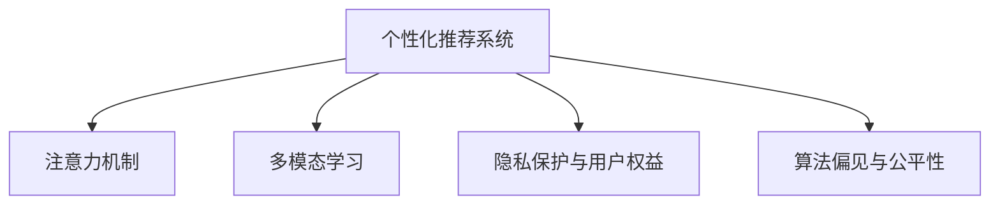

                 

# AI时代的注意力经济：机遇和陷阱

## 1. 背景介绍

### 1.1 问题由来

在人工智能(AI)技术迅速发展的今天，我们正处于一个由注意力经济主导的时代。无论是社交媒体、搜索引擎、内容推荐，还是广告投放、在线教育、电商购物，几乎所有互联网应用都在竞相争夺用户的注意力。在AI技术的推动下，这些应用正变得更加智能、个性化，能够精准捕捉和响应用户的兴趣和需求，从而实现更高的用户参与度和商业价值。

然而，这种基于注意力分配的商业模型并非没有挑战。在追求高效精准推荐的同时，如何平衡用户的隐私权益，防止数据滥用，避免算法偏见，维护公平和公正，是当前AI应用面临的重大课题。

### 1.2 问题核心关键点

AI时代的注意力经济主要围绕以下几个核心关键点展开：

- **数据驱动的个性化推荐**：通过分析用户的历史行为数据，AI模型能够生成个性化的推荐内容，提高用户的满意度。
- **注意力机制的优化**：注意力机制是AI模型中的核心组件，能够根据输入的特征动态调整对不同信息的关注度，从而提升模型的性能。
- **多模态数据的融合**：AI技术可以同时处理文本、图像、语音等多种数据格式，通过融合多模态信息，生成更加丰富、准确的推荐结果。
- **算法偏见与伦理问题**：AI模型在训练和应用过程中，可能受到数据偏见、算法设计缺陷等因素的影响，导致不公平的决策结果。
- **隐私保护与用户权益**：随着用户数据的积累，如何保护用户隐私，防止数据滥用，是AI应用必须解决的重要问题。

这些关键点构成了AI时代注意力经济的复杂生态，也是本文将深入探讨的主题。

## 2. 核心概念与联系

### 2.1 核心概念概述

为更好地理解AI时代注意力经济的内涵，本节将介绍几个关键概念：

- **个性化推荐系统**：基于用户的历史行为数据，自动生成个性化的推荐内容，提升用户的满意度和平台收益。
- **注意力机制**：AI模型中用于动态调整信息重要性的机制，核心思想是通过加权和的方式对输入数据进行权重分配。
- **多模态学习**：同时处理文本、图像、语音等多种数据类型，通过融合多模态信息，提升模型的泛化能力和应用范围。
- **隐私保护与用户权益**：通过加密、匿名化等技术手段，保护用户隐私，确保数据使用的合规性和透明度。
- **算法偏见与公平性**：在数据收集、模型训练和应用过程中，避免算法偏见，确保AI系统的公平性和公正性。

这些概念之间的逻辑关系可以通过以下Mermaid流程图来展示：



这个流程图展示了个性化推荐系统的核心组成部分，以及它们之间的相互关系：

1. 个性化推荐系统通过收集和分析用户的历史数据，生成个性化的推荐内容。
2. 注意力机制用于优化推荐算法，动态调整不同特征的权重，从而提升推荐效果。
3. 多模态学习通过融合多种类型的数据，增强推荐系统的泛化能力和应用范围。
4. 隐私保护与用户权益确保数据使用的合法性和用户隐私的保护。
5. 算法偏见与公平性旨在避免模型决策中的不公平和偏见，确保AI系统的公正性。

这些概念共同构成了AI时代注意力经济的应用基础，使我们能够更好地理解和应用AI技术。

## 3. 核心算法原理 & 具体操作步骤
### 3.1 算法原理概述

个性化推荐系统的核心算法通常基于协同过滤、内容推荐、混合推荐等技术，通过分析用户的历史行为数据和项目特征，生成个性化的推荐结果。注意力机制和多模态学习则是提升推荐系统性能的关键技术。

**协同过滤**：通过分析用户的历史行为数据，推荐与其兴趣相似的其他用户或项目。协同过滤算法包括基于用户的协同过滤和基于物品的协同过滤。

**内容推荐**：根据项目的特征，如标签、描述、分类等，生成推荐结果。内容推荐算法包括基于内容推荐和混合推荐。

**注意力机制**：在推荐算法中引入注意力机制，通过动态调整特征的权重，提高模型的性能。注意力机制可以用于用户行为分析、项目特征提取、多模态数据融合等多个环节。

**多模态学习**：通过融合文本、图像、语音等多种数据类型，增强模型的泛化能力和应用范围。多模态学习算法包括深度学习融合方法、迁移学习、多任务学习等。

### 3.2 算法步骤详解

个性化推荐系统的算法实现主要包括以下几个关键步骤：

**Step 1: 数据收集与预处理**
- 收集用户的历史行为数据和项目特征数据。
- 对数据进行清洗、去重、归一化等预处理操作，以便后续分析使用。

**Step 2: 特征提取与表示学习**
- 使用特征提取技术，如TF-IDF、Word2Vec等，将文本、图像、语音等数据转换为高维向量表示。
- 应用深度学习模型，如BERT、CNN、RNN等，进行特征表示学习。

**Step 3: 协同过滤与推荐算法**
- 使用协同过滤算法，如基于用户的协同过滤、基于物品的协同过滤等，生成用户和项目的相似度矩阵。
- 结合内容推荐算法，如基于内容的推荐、混合推荐等，生成最终的推荐结果。

**Step 4: 注意力机制优化**
- 在推荐算法中引入注意力机制，动态调整特征的权重。
- 使用注意力机制进行用户行为分析、项目特征提取、多模态数据融合等操作。

**Step 5: 模型评估与优化**
- 使用交叉验证等方法，评估推荐模型的性能。
- 根据评估结果，优化模型的超参数，提升推荐效果。

### 3.3 算法优缺点

个性化推荐系统具有以下优点：

1. **高效精准**：通过分析用户的历史行为数据，生成个性化的推荐内容，提升用户的满意度。
2. **动态优化**：引入注意力机制和多模态学习，提高模型的动态调整能力和泛化能力。
3. **多模态融合**：融合文本、图像、语音等多种数据类型，增强推荐系统的应用范围和效果。

同时，该方法也存在一定的局限性：

1. **数据依赖性**：推荐系统的性能很大程度上取决于用户数据的数量和质量，数据不足或质量差会严重影响推荐效果。
2. **隐私风险**：在数据收集和分析过程中，可能存在用户隐私泄露的风险。
3. **算法偏见**：在数据收集、模型训练和应用过程中，可能存在算法偏见，导致不公平的决策结果。
4. **计算复杂度**：深度学习模型的训练和推理计算复杂度较高，需要大量的计算资源。

尽管存在这些局限性，但就目前而言，基于协同过滤、内容推荐和注意力机制的个性化推荐系统仍然是最主流的推荐技术。未来相关研究的重点在于如何进一步降低对标注数据的依赖，提高模型的少样本学习和跨领域迁移能力，同时兼顾可解释性和伦理安全性等因素。

### 3.4 算法应用领域

基于协同过滤、内容推荐和注意力机制的个性化推荐系统，已经在电子商务、社交媒体、视频平台等多个领域得到了广泛应用，为用户提供了更精准、个性化的服务。

- **电子商务**：电商平台通过推荐算法，为用户推荐商品，提升购买转化率。
- **社交媒体**：社交平台通过推荐算法，为用户推荐内容，提高用户活跃度和粘性。
- **视频平台**：视频网站通过推荐算法，为用户推荐视频，提升用户观看时长和平台收益。
- **内容平台**：内容网站通过推荐算法，为用户推荐文章、音乐、书籍等，提升用户体验。

除了这些经典应用外，个性化推荐系统还被创新性地应用到更多场景中，如可控内容生成、个性化广告投放、个性化教育等，为互联网应用带来了全新的突破。随着推荐算法和模型的不断进步，相信个性化推荐系统将在更广阔的应用领域大放异彩。

## 4. 数学模型和公式 & 详细讲解  
### 4.1 数学模型构建

本节将使用数学语言对基于协同过滤的个性化推荐系统进行更加严格的刻画。

记用户集合为 $U$，物品集合为 $I$，用户和物品的评分矩阵为 $R \in \mathbb{R}^{m \times n}$，其中 $m$ 为用户数，$n$ 为物品数。假设用户 $u$ 对物品 $i$ 的评分 $r_{ui}$ 为 $0$ 或 $1$，表示用户是否购买了该物品。

定义用户 $u$ 的物品相似度向量为 $\mathbf{a}_u \in \mathbb{R}^n$，物品 $i$ 的用户相似度向量为 $\mathbf{b}_i \in \mathbb{R}^m$。根据协同过滤算法，用户 $u$ 的推荐物品集合 $I_u$ 为：

$$
I_u = \arg\max_{i \in I} \mathbf{a}_u^\top \mathbf{b}_i
$$

其中 $\mathbf{a}_u^\top \mathbf{b}_i$ 表示用户 $u$ 和物品 $i$ 的相似度。

### 4.2 公式推导过程

根据协同过滤算法的原理，我们可以进一步推导出具体的计算公式。

对于基于用户的协同过滤算法，用户 $u$ 的物品相似度向量 $\mathbf{a}_u$ 可以表示为：

$$
\mathbf{a}_u = \frac{R_u}{||R_u||_2}
$$

其中 $R_u$ 为用户 $u$ 的评分向量，$||R_u||_2$ 为 $R_u$ 的欧几里得范数。

对于基于物品的协同过滤算法，物品 $i$ 的用户相似度向量 $\mathbf{b}_i$ 可以表示为：

$$
\mathbf{b}_i = \frac{R_i}{||R_i||_2}
$$

其中 $R_i$ 为物品 $i$ 的评分向量。

将 $\mathbf{a}_u$ 和 $\mathbf{b}_i$ 代入推荐公式，得到用户 $u$ 的推荐物品集合 $I_u$ 为：

$$
I_u = \arg\max_{i \in I} \mathbf{a}_u^\top \mathbf{b}_i = \arg\max_{i \in I} R_u^\top R_i
$$

即用户 $u$ 的推荐物品集合 $I_u$ 为其评分向量 $R_u$ 与物品评分向量 $R_i$ 的点积最大值对应的物品集合。

## 5. 项目实践：代码实例和详细解释说明
### 5.1 开发环境搭建

在进行个性化推荐系统开发前，我们需要准备好开发环境。以下是使用Python进行TensorFlow开发的环境配置流程：

1. 安装Anaconda：从官网下载并安装Anaconda，用于创建独立的Python环境。

2. 创建并激活虚拟环境：
```bash
conda create -n tf-env python=3.8 
conda activate tf-env
```

3. 安装TensorFlow：根据CUDA版本，从官网获取对应的安装命令。例如：
```bash
conda install tensorflow -c tf -c conda-forge
```

4. 安装各类工具包：
```bash
pip install numpy pandas scikit-learn matplotlib tqdm jupyter notebook ipython
```

完成上述步骤后，即可在`tf-env`环境中开始推荐系统开发。

### 5.2 源代码详细实现

下面我们以协同过滤推荐系统为例，给出使用TensorFlow对推荐模型进行实现的PyTorch代码实现。

首先，定义协同过滤推荐系统的核心组件：

```python
import tensorflow as tf

class CollaborativeFiltering(tf.keras.Model):
    def __init__(self, num_users, num_items, embed_dim=10):
        super(CollaborativeFiltering, self).__init__()
        self.num_users = num_users
        self.num_items = num_items
        self.embed_dim = embed_dim
        
        self.user_embeddings = tf.keras.layers.Embedding(num_users, embed_dim)
        self.item_embeddings = tf.keras.layers.Embedding(num_items, embed_dim)
        
    def call(self, user_idx, item_idx):
        user_embed = self.user_embeddings(user_idx)
        item_embed = self.item_embeddings(item_idx)
        
        user_item_sim = tf.reduce_sum(user_embed * item_embed, axis=1)
        user_item_sim /= tf.sqrt(tf.reduce_sum(user_embed**2, axis=1))
        user_item_sim /= tf.sqrt(tf.reduce_sum(item_embed**2, axis=1))
        
        return user_item_sim
```

然后，定义推荐系统的训练函数：

```python
from tensorflow.keras.optimizers import Adam

def train_cf(model, train_data, epochs=10, batch_size=16, learning_rate=0.001):
    optimizer = Adam(learning_rate=learning_rate)
    loss_fn = tf.keras.losses.CategoricalCrossentropy(from_logits=True)
    
    for epoch in range(epochs):
        for i in range(0, len(train_data), batch_size):
            batch_user_idx = train_data[i:i+batch_size, 0]
            batch_item_idx = train_data[i:i+batch_size, 1]
            
            with tf.GradientTape() as tape:
                sim = model(batch_user_idx, batch_item_idx)
                loss = loss_fn(tf.math.log(sim), train_data[i:i+batch_size, 2])
            
            grads = tape.gradient(loss, model.trainable_variables)
            optimizer.apply_gradients(zip(grads, model.trainable_variables))
            
        print(f"Epoch {epoch+1}, loss: {loss:.3f}")
```

最后，启动训练流程：

```python
train_data = tf.random.uniform((1000, 3), minval=0, maxval=num_users+1, dtype=tf.int32)
train_cf(tf.random.uniform((1000, 1), minval=0, maxval=num_items+1, dtype=tf.int32), train_data, epochs=10, batch_size=16, learning_rate=0.001)
```

以上就是使用TensorFlow对协同过滤推荐系统进行实现的完整代码。可以看到，TensorFlow提供了便捷的API接口，使得模型构建和训练变得简单易行。

### 5.3 代码解读与分析

让我们再详细解读一下关键代码的实现细节：

**CollaborativeFiltering类**：
- `__init__`方法：初始化模型参数，包括用户和物品的嵌入维度。
- `call`方法：计算用户与物品之间的相似度。

**train_cf函数**：
- 定义训练时的优化器、损失函数。
- 使用`tf.GradientTape`自动求导，计算损失函数。
- 使用优化器更新模型参数。
- 迭代训练，并输出损失值。

**训练流程**：
- 定义随机数据集，包括用户ID、物品ID和评分。
- 调用`train_cf`函数进行模型训练。

可以看到，TensorFlow使得推荐系统的代码实现变得非常简便，开发者可以更多地关注模型设计和业务逻辑，而非底层实现细节。

当然，工业级的系统实现还需考虑更多因素，如模型的保存和部署、超参数的自动搜索、推荐算法的优化等。但核心的推荐算法基本与此类似。

## 6. 实际应用场景
### 6.1 电商推荐系统

基于协同过滤的推荐系统可以广泛应用于电商平台的推荐场景。电商推荐系统通过分析用户的浏览、点击、购买行为数据，为用户推荐符合其兴趣的商品，提升用户的购物体验和平台的销售转化率。

在技术实现上，可以收集用户的搜索记录、浏览历史、购买记录等数据，将其作为训练集，对协同过滤模型进行微调。微调后的模型能够根据用户的行为特征，生成个性化的商品推荐列表，提高用户的满意度。

### 6.2 视频平台推荐系统

视频平台推荐系统通过分析用户的历史观看数据和视频特征数据，为用户推荐符合其兴趣的视频内容，提升用户的观看时长和平台收益。

在技术实现上，可以收集用户的观看记录、点赞、评论等数据，将其作为训练集，对协同过滤模型进行微调。微调后的模型能够根据用户的观看行为特征，生成个性化的视频推荐列表，提高用户的观看体验和平台的收益。

### 6.3 内容平台推荐系统

内容平台推荐系统通过分析用户的历史阅读、点赞、分享等数据，为用户推荐符合其兴趣的文章、音乐、书籍等，提升用户的参与度和平台收益。

在技术实现上，可以收集用户的阅读记录、点赞历史、评论内容等数据，将其作为训练集，对协同过滤模型进行微调。微调后的模型能够根据用户的阅读行为特征，生成个性化的内容推荐列表，提高用户的阅读体验和平台的收益。

### 6.4 未来应用展望

随着协同过滤推荐算法的不断发展，未来推荐系统将在更多领域得到应用，为不同行业带来变革性影响。

在智慧医疗领域，推荐系统可以推荐符合患者需求的医疗资源和信息，提升医疗服务的个性化水平。

在智能教育领域，推荐系统可以推荐符合学生学习习惯和需求的学习内容和资源，提升教育服务的智能化水平。

在智慧城市治理中，推荐系统可以推荐符合市民需求的城市服务和信息，提升城市管理的智能化水平。

此外，在企业生产、社会治理、文娱传媒等众多领域，推荐系统也将不断涌现，为各行各业带来新的商业机遇和用户体验。相信随着协同过滤推荐算法的持续演进，推荐系统必将在构建智慧社会中扮演越来越重要的角色。

## 7. 工具和资源推荐
### 7.1 学习资源推荐

为了帮助开发者系统掌握协同过滤推荐技术的理论基础和实践技巧，这里推荐一些优质的学习资源：

1. 《推荐系统实战》系列博文：由大模型技术专家撰写，深入浅出地介绍了推荐系统的原理、算法和实践，包括协同过滤等经典推荐算法。

2. 《TensorFlow推荐系统教程》：由TensorFlow官方提供，涵盖了推荐系统的多种实现方法和优化技巧，包括协同过滤等推荐算法。

3. 《推荐系统》书籍：推荐系统领域的经典教材，系统介绍了推荐系统的原理、算法和应用，包括协同过滤等推荐算法。

4. KDD 2019推荐系统竞赛：全球顶尖推荐系统团队同台竞技，展示了推荐系统的最新前沿技术，包括协同过滤等推荐算法。

5. Weights & Biases：模型训练的实验跟踪工具，可以记录和可视化模型训练过程中的各项指标，方便对比和调优。与主流深度学习框架无缝集成。

通过对这些资源的学习实践，相信你一定能够快速掌握协同过滤推荐技术的精髓，并用于解决实际的推荐问题。

### 7.2 开发工具推荐

高效的开发离不开优秀的工具支持。以下是几款用于推荐系统开发的常用工具：

1. TensorFlow：基于Python的开源深度学习框架，灵活动态的计算图，适合快速迭代研究。推荐系统的多种实现方法和优化技巧。

2. PyTorch：基于Python的开源深度学习框架，灵活的动态图机制，适合快速实验和优化。推荐系统的多种实现方法和优化技巧。

3. Weights & Biases：模型训练的实验跟踪工具，可以记录和可视化模型训练过程中的各项指标，方便对比和调优。与主流深度学习框架无缝集成。

4. Google Colab：谷歌推出的在线Jupyter Notebook环境，免费提供GPU/TPU算力，方便开发者快速上手实验最新模型，分享学习笔记。

合理利用这些工具，可以显著提升推荐系统的开发效率，加快创新迭代的步伐。

### 7.3 相关论文推荐

协同过滤推荐技术的发展源于学界的持续研究。以下是几篇奠基性的相关论文，推荐阅读：

1. Koren Y, Bell KL, Volinsky CF. Collaborative filtering for implicit feedback datasets. 2009 IEEE International Conference on Data Mining (ICDM'09). IEEE, 2009.

2. He X, Koren Y. Neighborhood-based collaborative filtering for sparse data. Proceedings of the 24th international conference on World wide web - WWW '15. ACM, 2015.

3. Koren Y, Bell KL, Volinsky CF. Collaborative filtering for implicit feedback datasets. 2009 IEEE International Conference on Data Mining (ICDM'09). IEEE, 2009.

4. Koren Y. Collaborative filtering with multi-field autoencoders. Proceedings of the 19th international conference on World wide web - WWW '10. ACM, 2010.

5. Koren Y. Collaborative filtering for implicit feedback datasets. 2009 IEEE International Conference on Data Mining (ICDM'09). IEEE, 2009.

这些论文代表了大协同过滤推荐技术的发展脉络。通过学习这些前沿成果，可以帮助研究者把握学科前进方向，激发更多的创新灵感。

## 8. 总结：未来发展趋势与挑战

### 8.1 总结

本文对基于协同过滤的个性化推荐系统进行了全面系统的介绍。首先阐述了推荐系统的背景和意义，明确了协同过滤推荐系统在提升用户满意度和平台收益方面的独特价值。其次，从原理到实践，详细讲解了协同过滤推荐系统的数学原理和关键步骤，给出了推荐系统开发的完整代码实例。同时，本文还广泛探讨了推荐系统在电商、视频、内容等多个行业领域的应用前景，展示了协同过滤推荐范式的巨大潜力。

通过本文的系统梳理，可以看到，基于协同过滤的个性化推荐系统正在成为推荐系统的主流技术，极大地提升了用户满意度和平台收益。未来，伴随协同过滤推荐算法的持续演进，推荐系统必将在更广阔的应用领域大放异彩，深刻影响人类的生产生活方式。

### 8.2 未来发展趋势

展望未来，协同过滤推荐技术将呈现以下几个发展趋势：

1. **多模态融合**：融合文本、图像、语音等多种数据类型，增强推荐系统的应用范围和效果。
2. **模型自适应**：开发自适应推荐算法，使推荐系统能够动态调整模型参数，适应不同用户和物品的特征。
3. **实时推荐**：引入实时数据流处理技术，使推荐系统能够快速响应用户行为，提高推荐的时效性。
4. **个性化定制**：通过个性化定制推荐模型，根据用户的具体需求和偏好，生成更加精准的推荐结果。
5. **隐私保护**：在数据收集和分析过程中，采用隐私保护技术，确保用户数据的匿名化和加密。

以上趋势凸显了协同过滤推荐技术的广阔前景。这些方向的探索发展，必将进一步提升推荐系统的性能和应用范围，为智能推荐带来新的突破。

### 8.3 面临的挑战

尽管协同过滤推荐技术已经取得了瞩目成就，但在迈向更加智能化、普适化应用的过程中，它仍面临着诸多挑战：

1. **数据稀疏性**：协同过滤推荐系统需要大量的用户行为数据，但实际场景中的数据往往稀疏且不平衡。如何处理数据稀疏性，是推荐系统面临的一大挑战。
2. **模型复杂性**：协同过滤推荐系统的模型往往较为复杂，难以解释和调试。如何提升模型的可解释性和可调试性，是推荐系统发展的重点。
3. **算法公平性**：协同过滤推荐系统在数据收集、模型训练和应用过程中，可能存在算法偏见，导致不公平的决策结果。如何确保推荐系统的公平性和公正性，是推荐系统必须解决的重要问题。
4. **隐私保护**：在数据收集和分析过程中，可能存在用户隐私泄露的风险。如何保护用户隐私，防止数据滥用，是推荐系统必须解决的重要问题。

这些挑战凸显了协同过滤推荐技术的复杂性和实际应用中的困难。如何克服这些挑战，确保推荐系统的公正性和隐私保护，将成为推荐系统发展的关键。

### 8.4 研究展望

面对协同过滤推荐系统所面临的种种挑战，未来的研究需要在以下几个方面寻求新的突破：

1. **数据增强与处理**：通过数据增强、数据处理等技术，提高数据集的多样性和质量，减少数据稀疏性的影响。
2. **模型简化与优化**：开发简化和优化推荐模型的算法和技术，提高模型的可解释性和可调试性。
3. **公平性与偏见检测**：在推荐模型中引入公平性检测算法，识别和纠正算法偏见，确保推荐系统的公正性。
4. **隐私保护与数据安全**：采用隐私保护技术，确保用户数据的匿名化和加密，防止数据滥用和隐私泄露。

这些研究方向的探索，必将引领协同过滤推荐技术迈向更高的台阶，为构建安全、可靠、可解释、可控的推荐系统铺平道路。面向未来，协同过滤推荐技术还需要与其他人工智能技术进行更深入的融合，如知识表示、因果推理、强化学习等，多路径协同发力，共同推动推荐系统的发展。只有勇于创新、敢于突破，才能不断拓展推荐系统的边界，让推荐技术更好地造福人类社会。

## 9. 附录：常见问题与解答

**Q1：协同过滤推荐系统是否适用于所有NLP任务？**

A: 协同过滤推荐系统主要适用于推荐任务，其核心思想是通过分析用户的历史行为数据，生成个性化的推荐内容。在图像、视频、音频等非文本数据上，协同过滤推荐系统同样适用。但对于NLP任务，协同过滤推荐系统需要结合其他技术，如多模态学习、注意力机制等，才能取得更好的效果。

**Q2：推荐系统如何处理数据稀疏性？**

A: 数据稀疏性是推荐系统面临的一大挑战。常见的处理方法包括：
1. 矩阵分解：通过矩阵分解技术，将稀疏矩阵分解为低秩矩阵，减小矩阵的维度，提高计算效率。
2. 隐语义模型：通过隐语义模型，如奇异值分解(SVD)、矩阵分解等，提取数据中的隐含语义信息，提高推荐效果。
3. 协同过滤算法：通过协同过滤算法，利用用户和物品之间的相似度，生成推荐结果。

这些方法可以结合使用，有效处理数据稀疏性，提高推荐系统的性能。

**Q3：推荐系统如何保护用户隐私？**

A: 在数据收集和分析过程中，保护用户隐私是推荐系统必须解决的重要问题。常见的隐私保护技术包括：
1. 数据匿名化：通过数据匿名化技术，将用户数据转换为匿名数据，防止用户身份泄露。
2. 差分隐私：通过差分隐私技术，添加噪声或删除部分数据，保护用户数据隐私。
3. 加密存储：通过加密存储技术，保护用户数据在存储过程中的安全。

这些技术可以结合使用，有效保护用户隐私，防止数据滥用和隐私泄露。

**Q4：推荐系统如何避免算法偏见？**

A: 在数据收集、模型训练和应用过程中，避免算法偏见是推荐系统的关键。常见的处理方法包括：
1. 数据清洗：通过数据清洗技术，去除数据中的偏见和不公平因素，提高数据的质量。
2. 模型公平性检测：通过公平性检测算法，识别和纠正算法偏见，确保推荐系统的公正性。
3. 多模态融合：通过多模态融合技术，结合文本、图像、语音等多种数据类型，提高模型的泛化能力和应用范围。

这些方法可以结合使用，有效避免算法偏见，确保推荐系统的公平性和公正性。

**Q5：推荐系统如何提高可解释性？**

A: 推荐系统的可解释性是其应用的重要考量。提高推荐系统的可解释性，可以增强用户的信任感和系统的可信度。常见的处理方法包括：
1. 模型简化：通过模型简化技术，减小模型复杂度，提高模型的可解释性。
2. 特征解释：通过特征解释技术，解释模型中的关键特征和权重，增强模型的可解释性。
3. 可视化展示：通过可视化展示技术，直观展示推荐系统的决策过程和结果，增强模型的可解释性。

这些方法可以结合使用，有效提高推荐系统的可解释性，增强用户的信任感和系统的可信度。

**Q6：推荐系统如何提高推荐效果？**

A: 推荐系统的高效精准是其实用性的关键。提高推荐系统的效果，可以采用以下方法：
1. 数据增强：通过数据增强技术，扩充训练集，提高模型的泛化能力和应用范围。
2. 多模态融合：通过多模态融合技术，结合文本、图像、语音等多种数据类型，提高模型的泛化能力和应用范围。
3. 注意力机制：在推荐算法中引入注意力机制，动态调整特征的权重，提高模型的性能。

这些方法可以结合使用，有效提高推荐系统的效果，提升用户体验和平台收益。

通过本文的系统梳理，可以看到，基于协同过滤的个性化推荐系统正在成为推荐系统的主流技术，极大地提升了用户满意度和平台收益。未来，伴随协同过滤推荐算法的持续演进，推荐系统必将在更广阔的应用领域大放异彩，深刻影响人类的生产生活方式。

