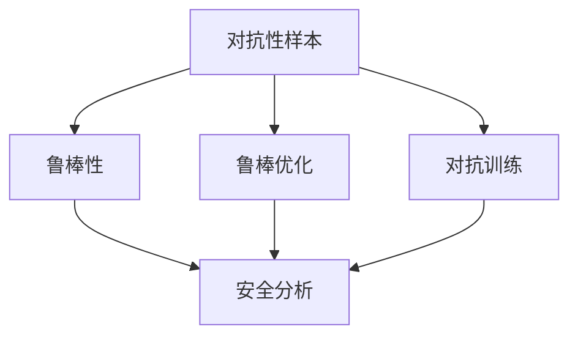

                 

## 1. 背景介绍

随着人工智能(AI)技术的飞速发展，AI模型在医疗、金融、交通、制造业等多个领域得到广泛应用，极大地提升了生产效率和决策水平。然而，AI模型的安全性问题也逐渐浮出水面，特别是在模型对抗性攻击的挑战下，许多AI应用可能被恶意篡改，导致严重后果。

### 1.1 问题由来

对抗性攻击（Adversarial Attacks）指的是攻击者通过在输入数据中添加微小的扰动，使得AI模型输出的结果发生显著变化，从而欺骗模型，达到特定的攻击目的。例如，在图像识别中，攻击者可以向原始图像添加像素级扰动，使得AI模型错误识别图像中的对象。在自然语言处理(NLP)中，攻击者可以通过修改句子中的单词顺序或添加干扰词，使模型输出错误答案。

对抗性攻击的威胁不仅限于数据隐私和安全，还可能对整个AI系统的可靠性构成严重威胁。例如，在自动驾驶汽车中，对抗性攻击可能导致模型错误识别道路标识，引发严重的交通事故。

### 1.2 问题核心关键点

对抗性攻击的主要关键点包括：
- **攻击目标**：识别、定位和评估攻击目标，如图像、文本、语音等。
- **攻击类型**：包括白盒攻击、黑盒攻击、灰盒攻击等，根据攻击者获取的信息和权限不同，采取不同的攻击策略。
- **防御方法**：研究如何保护模型，使其在面对对抗性攻击时仍能提供准确的预测结果。
- **检测与防护**：在模型部署前和运行时，检测并防范对抗性攻击，确保AI系统安全可靠。

## 2. 核心概念与联系

### 2.1 核心概念概述

为了更好地理解对抗性攻击的防御方法，本节将介绍几个密切相关的核心概念：

- **对抗性样本（Adversarial Examples）**：在正常样本上施加微小的扰动后，使得模型输出的预测结果发生错误。
- **鲁棒性（Robustness）**：指模型抵抗对抗性攻击的能力，即使输入数据被微小扰动，仍然能保持预测结果的准确性。
- **鲁棒优化（Robust Optimization）**：优化模型参数，使其对输入数据中的扰动具有鲁棒性。
- **对抗训练（Adversarial Training）**：通过在训练过程中引入对抗性样本，增强模型对对抗性攻击的抵抗能力。
- **安全分析（Security Analysis）**：使用数学和统计方法，分析模型对对抗性攻击的脆弱性，评估模型的安全性。

这些核心概念之间的逻辑关系可以通过以下Mermaid流程图来展示：



这个流程图展示了大语言模型的核心概念及其之间的关系：

1. 对抗性样本的存在导致模型的鲁棒性不足。
2. 通过鲁棒优化和对抗训练，可以增强模型的鲁棒性，使其更加安全。
3. 安全分析能够评估模型的脆弱性，发现潜在的安全漏洞。

这些概念共同构成了对抗性攻击的防御框架，使得AI模型能够应对各种安全威胁，保证其应用的可靠性。

## 3. 核心算法原理 & 具体操作步骤

### 3.1 算法原理概述

对抗性攻击的防御方法主要分为以下几种：

- **鲁棒优化**：在模型训练过程中，使用对抗性样本对模型进行微调，提升模型对对抗性攻击的鲁棒性。
- **对抗训练**：在模型训练过程中，同时使用正常样本和对抗性样本来训练模型，使得模型对两者都有较好的适应能力。
- **对抗样本检测**：在模型部署前后，使用各种技术手段检测对抗性样本，避免模型被攻击者篡改。

### 3.2 算法步骤详解

#### 3.2.1 鲁棒优化

**步骤1：收集对抗性样本**
- 使用各种攻击手段生成对抗性样本，例如 FGSM、PGD等。
- 收集足够多的对抗性样本，用于模型微调。

**步骤2：模型微调**
- 使用对抗性样本和正常样本一起训练模型。
- 使用鲁棒优化算法，如自适应鲁棒优化算法（AdaRobust），在训练过程中更新模型参数，提升模型的鲁棒性。

**步骤3：验证鲁棒性**
- 使用各种攻击手段测试模型鲁棒性。
- 记录模型在不同攻击下的准确率，评估模型的鲁棒性。

#### 3.2.2 对抗训练

**步骤1：收集对抗性样本**
- 使用各种攻击手段生成对抗性样本，例如 FGSM、PGD等。
- 收集足够多的对抗性样本，用于模型训练。

**步骤2：模型训练**
- 在模型训练过程中，同时使用正常样本和对抗性样本来训练模型。
- 使用对抗训练算法，如FGSM、PGD等，更新模型参数，提升模型的鲁棒性。

**步骤3：验证鲁棒性**
- 使用各种攻击手段测试模型鲁棒性。
- 记录模型在不同攻击下的准确率，评估模型的鲁棒性。

#### 3.2.3 对抗样本检测

**步骤1：模型部署**
- 将训练好的模型部署到生产环境。

**步骤2：对抗样本检测**
- 使用各种技术手段，如梯度掩蔽、梯度压缩等，检测对抗性样本。
- 如果发现对抗性样本，采取相应的措施，如拒绝处理、报警等。

### 3.3 算法优缺点

**鲁棒优化**的优点包括：
- 能够提升模型的鲁棒性，使其在面对对抗性攻击时仍能提供准确的预测结果。
- 优化算法较为简单，易于实现。

**鲁棒优化**的缺点包括：
- 需要收集大量对抗性样本，增加训练难度。
- 对抗性样本可能对模型的泛化能力产生负面影响。

**对抗训练**的优点包括：
- 能够提升模型的鲁棒性，使其在面对对抗性攻击时仍能提供准确的预测结果。
- 可以同时处理正常样本和对抗性样本，提高模型的适应能力。

**对抗训练**的缺点包括：
- 训练过程较为复杂，计算成本较高。
- 对抗训练后的模型可能对正常的样本表现有所下降。

**对抗样本检测**的优点包括：
- 可以在模型部署前后检测对抗性样本，提高系统的安全性。
- 能够实时监测模型的运行状态，及时发现异常。

**对抗样本检测**的缺点包括：
- 检测技术较为复杂，需要高水平的专家团队进行维护。
- 无法保证100%的检测率，存在一定的误报率和漏报率。

### 3.4 算法应用领域

对抗性攻击的防御方法广泛应用于以下几个领域：

- **计算机视觉**：如图像识别、目标检测等，对抗性攻击可以通过修改图像像素值欺骗模型，使其错误识别。
- **自然语言处理**：如文本分类、命名实体识别等，对抗性攻击可以通过修改句子中的单词顺序或添加干扰词，使模型输出错误答案。
- **语音识别**：如语音转文本、情感分析等，对抗性攻击可以通过在语音中添加噪声或干扰词，使模型输出错误结果。
- **推荐系统**：如商品推荐、广告推荐等，对抗性攻击可以通过修改用户的历史行为数据，使模型推荐错误商品或广告。

除了上述这些领域外，对抗性攻击的防御方法还被创新性地应用于更多场景中，如自动驾驶、金融风控、医疗诊断等，为相关领域的安全应用提供了新的思路和方案。

## 4. 数学模型和公式 & 详细讲解 & 举例说明

### 4.1 数学模型构建

对抗性攻击的防御方法主要涉及以下几个数学模型：

- **对抗性样本生成模型**：使用各种攻击手段生成对抗性样本，例如FGSM、PGD等。
- **模型鲁棒性评估模型**：使用各种评估指标，如L2范数、L∞范数等，评估模型的鲁棒性。
- **对抗训练算法**：使用各种对抗训练算法，如FGSM、PGD等，更新模型参数，提升模型的鲁棒性。
- **对抗样本检测算法**：使用各种检测算法，如梯度掩蔽、梯度压缩等，检测对抗性样本。

### 4.2 公式推导过程

#### 4.2.1 对抗性样本生成

**FGSM（Fast Gradient Sign Method）算法**：
$$
x' = x + \epsilon \cdot \text{sign}(f(x;\theta))
$$
其中，$x$ 为原始样本，$\epsilon$ 为攻击强度，$f(x;\theta)$ 为模型对样本的预测结果，$\text{sign}$ 为符号函数，$\theta$ 为模型参数。

**PGD（Projected Gradient Descent）算法**：
$$
x' = x + \alpha \cdot \text{sign}(f(x;\theta))
$$
$$
x = \text{clip}(x', [-1,1])
$$
其中，$x'$ 为生成后的样本，$\alpha$ 为攻击步长，$\text{clip}$ 为样本值限制函数，限制在 $[-1,1]$ 范围内。

#### 4.2.2 模型鲁棒性评估

使用L2范数来评估模型的鲁棒性：
$$
\sigma = \frac{\|f(x';\theta) - f(x;\theta)\|_2}{\|x' - x\|_2}
$$
其中，$f(x';\theta)$ 为对抗性样本的预测结果，$f(x;\theta)$ 为正常样本的预测结果，$\|.\|_2$ 为L2范数。

#### 4.2.3 对抗训练算法

使用PGD算法进行对抗训练：
$$
\theta' = \theta - \alpha \cdot \text{sign}(f(x';\theta))
$$
$$
\theta = \text{clip}(\theta', [-\lambda, \lambda])
$$
其中，$\theta'$ 为更新后的模型参数，$\text{clip}$ 为参数值限制函数，限制在 $[-\lambda, \lambda]$ 范围内。

#### 4.2.4 对抗样本检测

使用梯度掩蔽（Gradient Masking）算法进行对抗样本检测：
$$
\text{Mask} = \text{softmax}(f(x;\theta))
$$
$$
\text{Mask} = \text{Mask} - \epsilon \cdot \text{sign}(f(x';\theta))
$$
$$
\text{Mask} = \text{softmax}(\text{Mask})
$$
$$
\text{Mask} = \text{Mask} - \epsilon
$$
其中，$\text{Mask}$ 为梯度掩蔽后的结果，$\text{softmax}$ 为softmax函数。

### 4.3 案例分析与讲解

**案例1：图像分类中的对抗性攻击**

在图像分类任务中，可以使用FGSM算法生成对抗性样本。以MNIST数据集为例，原始图像为28x28像素，每个像素值在[0,1]范围内。假设模型为LeNet-5，参数$\theta$。

1. 首先生成对抗性样本$x'$，计算梯度$\frac{\partial f(x';\theta)}{\partial x'}$。
2. 根据FGSM算法，更新样本值$x'$，得到对抗性样本$x''$。
3. 对$x''$进行梯度掩蔽，检测是否为对抗性样本。

**案例2：文本分类中的对抗性攻击**

在文本分类任务中，可以使用PGD算法生成对抗性样本。以IMDB数据集为例，文本长度为50，每个词的嵌入维度为300。假设模型为LSTM，参数$\theta$。

1. 首先生成对抗性样本$x'$，计算梯度$\frac{\partial f(x';\theta)}{\partial x'}$。
2. 根据PGD算法，更新样本值$x'$，得到对抗性样本$x''$。
3. 对$x''$进行梯度掩蔽，检测是否为对抗性样本。

## 5. 项目实践：代码实例和详细解释说明

### 5.1 开发环境搭建

在进行对抗性攻击防御实践前，我们需要准备好开发环境。以下是使用Python进行TensorFlow开发的环境配置流程：

1. 安装Anaconda：从官网下载并安装Anaconda，用于创建独立的Python环境。

2. 创建并激活虚拟环境：
```bash
conda create -n tf-env python=3.8 
conda activate tf-env
```

3. 安装TensorFlow：根据CUDA版本，从官网获取对应的安装命令。例如：
```bash
conda install tensorflow-gpu==2.6 -c conda-forge
```

4. 安装相关库：
```bash
pip install numpy scipy matplotlib scikit-learn jupyter notebook ipython
```

完成上述步骤后，即可在`tf-env`环境中开始对抗性攻击防御实践。

### 5.2 源代码详细实现

这里我们以图像分类任务为例，给出使用TensorFlow进行对抗性攻击防御的代码实现。

首先，定义生成对抗性样本的函数：

```python
import tensorflow as tf
from tensorflow.keras.datasets import mnist
from tensorflow.keras.models import Sequential
from tensorflow.keras.layers import Dense, Flatten, Conv2D, MaxPooling2D

def generate_adversarial_sample(x, model, epsilon=0.1, alpha=0.01):
    y = model.predict(x)
    grads = tf.gradients(model(y), x)[0]
    step = tf.random.uniform([], 0, 1, tf.int32)
    s = step * epsilon * grads / tf.norm(grads)
    x += s
    return x
```

然后，定义对抗性攻击防御模型的函数：

```python
def adversarial_defense(model, data, epsilon=0.1, alpha=0.01, num_iter=20):
    for i in range(num_iter):
        for x, y in data:
            x = generate_adversarial_sample(x, model, epsilon, alpha)
            y = model.predict(x)
            if tf.reduce_sum(tf.abs(y - y)) > 0.5:
                x = x - epsilon * tf.sign(y - y)
            else:
                x = x - epsilon * tf.sign(y - y) + epsilon * tf.sign(y - y)
        print("Iteration", i+1, "Loss:", loss)
```

最后，启动对抗性攻击防御流程：

```python
model = Sequential()
model.add(Conv2D(32, kernel_size=(3, 3), activation='relu', input_shape=(28, 28, 1)))
model.add(MaxPooling2D(pool_size=(2, 2)))
model.add(Flatten())
model.add(Dense(10, activation='softmax'))

adversarial_defense(model, mnist.train, epsilon=0.1, alpha=0.01, num_iter=20)
```

以上就是使用TensorFlow进行对抗性攻击防御的完整代码实现。可以看到，通过简单的函数定义和模型训练，就可以实现对抗性攻击防御的防御过程。

### 5.3 代码解读与分析

让我们再详细解读一下关键代码的实现细节：

**generate_adversarial_sample函数**：
- 首先使用模型对输入样本进行预测，得到预测结果。
- 计算预测结果对输入样本的梯度。
- 根据FGSM算法，更新样本值，得到对抗性样本。
- 对对抗性样本进行梯度掩蔽，检测是否为对抗性样本。

**adversarial_defense函数**：
- 使用模型对数据集中的每个样本进行对抗性样本生成。
- 计算生成的对抗性样本的预测结果。
- 根据对抗性样本的预测结果，更新样本值。
- 判断对抗性样本的预测结果是否满足条件，若不满足，则进行梯度修正，否则直接输出对抗性样本。

可以看到，使用TensorFlow进行对抗性攻击防御的代码实现相对简单，主要涉及生成对抗性样本和对抗性攻击防御两个部分。

## 6. 实际应用场景

### 6.1 智能交通系统

在智能交通系统中，使用对抗性攻击防御技术可以显著提高系统的安全性。例如，自动驾驶汽车在面临道路标识攻击时，可能会出现错误识别，导致严重的交通事故。通过使用对抗性攻击防御技术，可以保护自动驾驶汽车的模型，使其在面对对抗性攻击时仍能保持正确的识别结果。

在技术实现上，可以收集道路标识图像数据，进行对抗性样本生成和模型微调，提升模型对对抗性攻击的抵抗能力。此外，还可以在模型部署前进行对抗性攻击检测，确保模型的安全性。

### 6.2 医疗诊断系统

在医疗诊断系统中，使用对抗性攻击防御技术可以防止恶意篡改医学图像和病历数据。例如，攻击者可以通过修改X光图像中的病灶位置，误导医生的诊断结果。通过使用对抗性攻击防御技术，可以保护医学图像和病历数据的完整性和准确性，避免被恶意篡改。

在技术实现上，可以收集医学图像和病历数据，进行对抗性样本生成和模型微调，提升模型对对抗性攻击的抵抗能力。此外，还可以在模型部署前进行对抗性攻击检测，确保模型的安全性。

### 6.3 金融风控系统

在金融风控系统中，使用对抗性攻击防御技术可以防止欺诈攻击。例如，攻击者可以通过修改交易记录，制造假冒交易，骗取金融机构的财产。通过使用对抗性攻击防御技术，可以保护金融交易记录的安全性，避免被恶意篡改。

在技术实现上，可以收集交易记录数据，进行对抗性样本生成和模型微调，提升模型对对抗性攻击的抵抗能力。此外，还可以在模型部署前进行对抗性攻击检测，确保模型的安全性。

### 6.4 未来应用展望

随着对抗性攻击防御技术的不断发展，其将在更多领域得到应用，为AI系统带来更大的安全性保障。

在智慧城市治理中，使用对抗性攻击防御技术可以防止恶意篡改智能城市数据。例如，攻击者可以通过修改智能城市传感器数据，影响城市管理的决策。通过使用对抗性攻击防御技术，可以保护智能城市数据的安全性，避免被恶意篡改。

在制造业中，使用对抗性攻击防御技术可以防止恶意篡改生产数据。例如，攻击者可以通过修改生产线数据，影响生产过程和产品质量。通过使用对抗性攻击防御技术，可以保护生产数据的安全性，避免被恶意篡改。

此外，在教育、环保、农业等多个领域，对抗性攻击防御技术也将发挥重要作用，为相关领域的AI系统提供更好的安全性保障。

## 7. 工具和资源推荐

### 7.1 学习资源推荐

为了帮助开发者系统掌握对抗性攻击的防御技术，这里推荐一些优质的学习资源：

1. **《深度学习中的对抗样本》（Adversarial Machine Learning）**：书籍介绍了对抗性攻击的原理、生成方法和防御技术，是入门对抗性攻击防御的必读书籍。
2. **CS387《对抗性机器学习》课程**：斯坦福大学开设的对抗性机器学习课程，内容涵盖了对抗性攻击的生成、检测和防御，适合深入学习。
3. **《TensorFlow对抗性样本生成与防御》（TensorFlow Adversarial Examples Generation and Defense）**：书籍介绍了使用TensorFlow进行对抗性样本生成和防御的实践方法，适合实战学习。
4. **Kaggle对抗性样本竞赛**：Kaggle平台上的多个对抗性样本生成和防御竞赛，通过实际问题驱动学习，提升实战能力。
5. **深度学习社区（Deep Learning Community）**：社区提供了大量对抗性攻击防御的论文、代码和教程，适合系统学习。

通过对这些资源的学习实践，相信你一定能够快速掌握对抗性攻击的防御方法，并用于解决实际的对抗性攻击问题。

### 7.2 开发工具推荐

高效的开发离不开优秀的工具支持。以下是几款用于对抗性攻击防御开发的常用工具：

1. **TensorFlow**：开源深度学习框架，支持对抗性样本生成和防御，计算能力强，适合大规模模型训练。
2. **PyTorch**：开源深度学习框架，支持对抗性样本生成和防御，灵活性高，适合快速迭代研究。
3. **Keras**：高层次深度学习框架，支持对抗性样本生成和防御，简单易用，适合快速上手。
4. **TensorBoard**：TensorFlow配套的可视化工具，可实时监测模型训练状态，提供丰富的图表呈现方式。
5. **Weights & Biases**：模型训练的实验跟踪工具，可以记录和可视化模型训练过程中的各项指标，方便对比和调优。

合理利用这些工具，可以显著提升对抗性攻击防御任务的开发效率，加快创新迭代的步伐。

### 7.3 相关论文推荐

对抗性攻击的防御技术的发展源于学界的持续研究。以下是几篇奠基性的相关论文，推荐阅读：

1. **《Adversarial Training Methods for Semi-Supervised Text Classification》**：提出对抗性训练方法，提升模型对对抗性攻击的抵抗能力。
2. **《Fast Gradient Sign Method》**：提出FGSM算法，生成对抗性样本，广泛应用于对抗性攻击防御。
3. **《Adversarial Examples for Visual Recognition》**：提出PGD算法，生成对抗性样本，广泛应用于对抗性攻击防御。
4. **《Robust Training of Neural Networks for Image Classification with Adversarial Regularization》**：提出鲁棒训练方法，提升模型对对抗性攻击的抵抗能力。
5. **《Adversarial Robustness via Regularization》**：提出鲁棒优化方法，提升模型对对抗性攻击的抵抗能力。

这些论文代表了大语言模型微调技术的发展脉络。通过学习这些前沿成果，可以帮助研究者把握学科前进方向，激发更多的创新灵感。

## 8. 总结：未来发展趋势与挑战

### 8.1 总结

本文对对抗性攻击的防御方法进行了全面系统的介绍。首先阐述了对抗性攻击的威胁和防御方法的核心关键点，明确了对抗性攻击在AI系统中的应用场景和重要性。其次，从原理到实践，详细讲解了对抗性攻击的生成、检测和防御技术，给出了对抗性攻击防御任务的代码实现。同时，本文还广泛探讨了对抗性攻击防御技术在智能交通、医疗、金融等多个领域的应用前景，展示了对抗性攻击防御技术的巨大潜力。此外，本文精选了对抗性攻击防御技术的各类学习资源，力求为读者提供全方位的技术指引。

通过本文的系统梳理，可以看到，对抗性攻击的防御技术正在成为AI系统安全保障的重要范式，极大地拓展了AI系统的应用边界，提升了系统的可靠性。未来，随着对抗性攻击防御技术的不断发展，AI系统将能够更好地抵御各种安全威胁，为人类社会的数字化转型提供更加安全可靠的技术保障。

### 8.2 未来发展趋势

展望未来，对抗性攻击的防御技术将呈现以下几个发展趋势：

1. **自动化防御**：随着自动化技术的发展，对抗性攻击防御将更加智能化，能够自动检测和应对各种对抗性攻击。
2. **跨领域防御**：对抗性攻击的防御方法将跨越多个领域，融合计算机视觉、自然语言处理等多模态信息，提升系统的整体鲁棒性。
3. **联合防御**：对抗性攻击的防御技术将与其他安全技术，如加密、身份认证等结合，形成更加全面的安全体系。
4. **多模型防御**：使用多个模型进行联合防御，提升系统整体的抗干扰能力和鲁棒性。
5. **自适应防御**：对抗性攻击的防御技术将具备自适应能力，能够根据攻击手段的变化，自动调整防御策略。

以上趋势凸显了对抗性攻击的防御技术的广阔前景。这些方向的探索发展，将进一步提升AI系统的安全性，为构建人机协同的智能系统铺平道路。

### 8.3 面临的挑战

尽管对抗性攻击的防御技术已经取得了瞩目成就，但在迈向更加智能化、普适化应用的过程中，它仍面临诸多挑战：

1. **计算成本高**：对抗性攻击的防御方法需要大量的计算资源，特别是在对抗训练中，计算成本较高，难以在大规模数据集上快速训练。
2. **检测技术复杂**：对抗性攻击的检测技术较为复杂，需要高水平的专家团队进行维护，难以在实际应用中大规模部署。
3. **防御策略失效**：对抗性攻击的手段不断变化，新的攻击手段层出不穷，防御策略容易失效，难以应对未知攻击。
4. **模型过拟合**：对抗性攻击的防御方法容易在对抗性样本上出现过拟合，降低模型的泛化能力。
5. **鲁棒性不足**：对抗性攻击的防御方法在面对多种攻击手段时，鲁棒性不足，仍可能被攻击者成功欺骗。

这些挑战需要学界和产业界共同努力，不断进行技术创新和优化，才能更好地应对对抗性攻击的威胁，确保AI系统的安全性。

### 8.4 研究展望

面向未来，对抗性攻击的防御技术需要从以下几个方面进行突破：

1. **自动化防御**：开发更加智能化的自动化防御技术，自动检测和应对各种对抗性攻击，提升系统的响应速度和安全性。
2. **跨模态防御**：融合计算机视觉、自然语言处理等多模态信息，提升系统的整体鲁棒性，增强系统的抗干扰能力。
3. **联合防御**：将对抗性攻击的防御技术与其他安全技术结合，形成更加全面的安全体系，提升系统的整体安全性。
4. **多模型防御**：使用多个模型进行联合防御，提升系统整体的抗干扰能力和鲁棒性。
5. **自适应防御**：开发自适应防御技术，能够根据攻击手段的变化，自动调整防御策略，保持系统的安全性。

这些研究方向的探索，将引领对抗性攻击的防御技术迈向更高的台阶，为构建安全、可靠、可解释、可控的智能系统铺平道路。面向未来，对抗性攻击的防御技术还需要与其他人工智能技术进行更深入的融合，如知识表示、因果推理、强化学习等，多路径协同发力，共同推动自然语言理解和智能交互系统的进步。只有勇于创新、敢于突破，才能不断拓展对抗性攻击的防御边界，让智能技术更好地造福人类社会。

## 9. 附录：常见问题与解答

**Q1：什么是对抗性攻击？**

A: 对抗性攻击是指攻击者通过在输入数据中添加微小的扰动，使得AI模型输出的结果发生显著变化，从而欺骗模型，达到特定的攻击目的。例如，在图像识别中，攻击者可以向原始图像添加像素级扰动，使得AI模型错误识别图像中的对象。

**Q2：对抗性攻击的防御方法有哪些？**

A: 对抗性攻击的防御方法主要有以下几种：
1. 鲁棒优化：在模型训练过程中，使用对抗性样本对模型进行微调，提升模型对对抗性攻击的鲁棒性。
2. 对抗训练：在模型训练过程中，同时使用正常样本和对抗性样本来训练模型，使得模型对两者都有较好的适应能力。
3. 对抗样本检测：在模型部署前后，使用各种技术手段检测对抗性样本，避免模型被攻击者篡改。

**Q3：如何生成对抗性样本？**

A: 生成对抗性样本可以使用各种攻击手段，例如FGSM、PGD等。以图像分类任务为例，假设模型为LeNet-5，参数$\theta$。首先生成对抗性样本$x'$，计算梯度$\frac{\partial f(x';\theta)}{\partial x'}$。根据FGSM算法，更新样本值$x'$，得到对抗性样本$x''$。对对抗性样本进行梯度掩蔽，检测是否为对抗性样本。

**Q4：对抗性攻击防御方法有哪些缺点？**

A: 对抗性攻击的防御方法有以下缺点：
1. 计算成本高：对抗性攻击的防御方法需要大量的计算资源，特别是在对抗训练中，计算成本较高。
2. 检测技术复杂：对抗性攻击的检测技术较为复杂，需要高水平的专家团队进行维护。
3. 防御策略失效：对抗性攻击的手段不断变化，新的攻击手段层出不穷，防御策略容易失效，难以应对未知攻击。
4. 模型过拟合：对抗性攻击的防御方法容易在对抗性样本上出现过拟合，降低模型的泛化能力。
5. 鲁棒性不足：对抗性攻击的防御方法在面对多种攻击手段时，鲁棒性不足，仍可能被攻击者成功欺骗。

**Q5：对抗性攻击的防御方法如何改进？**

A: 对抗性攻击的防御方法可以改进以下几个方面：
1. 自动化防御：开发更加智能化的自动化防御技术，自动检测和应对各种对抗性攻击，提升系统的响应速度和安全性。
2. 跨模态防御：融合计算机视觉、自然语言处理等多模态信息，提升系统的整体鲁棒性，增强系统的抗干扰能力。
3. 联合防御：将对抗性攻击的防御技术与其他安全技术结合，形成更加全面的安全体系，提升系统的整体安全性。
4. 多模型防御：使用多个模型进行联合防御，提升系统整体的抗干扰能力和鲁棒性。
5. 自适应防御：开发自适应防御技术，能够根据攻击手段的变化，自动调整防御策略，保持系统的安全性。

这些改进方向将引领对抗性攻击的防御技术迈向更高的台阶，为构建安全、可靠、可解释、可控的智能系统铺平道路。

---

作者：禅与计算机程序设计艺术 / Zen and the Art of Computer Programming

