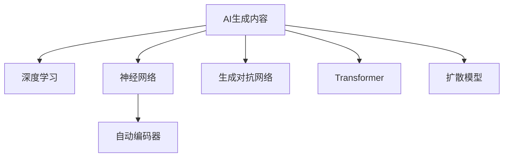

                 

# AI生成内容（AIGC）技术与应用

> 关键词：AI生成内容（AIGC）、深度学习、神经网络、自动编码器、生成对抗网络（GAN）、Transformer、扩散模型、文本生成、图像生成、视频生成、音频生成

## 1. 背景介绍

### 1.1 问题由来
近年来，随着深度学习技术的迅速发展，AI生成内容（AI Generated Content，AIGC）技术正逐渐成为人工智能领域的下一个风口。AIGC技术能够自动地生成高质量的文本、图像、音频、视频等内容的创作，极大地提升了内容创作和传播的效率，推动了媒体、娱乐、教育等多个行业的数字化转型。

### 1.2 问题核心关键点
AIGC技术的核心在于如何通过深度学习模型自动地生成具有高度创意和真实性的内容。核心算法包括深度神经网络、自动编码器、生成对抗网络（GAN）、Transformer等，这些模型通过大量数据的训练，能够自动学习到生成内容的分布规律，从而实现内容创作。

AIGC技术的研究和应用具有以下重要意义：

1. **降低创作成本**：AIGC技术能够自动生成内容，减少了人工创作的时间和成本，特别是在新闻、娱乐、广告等领域，AIGC技术能够大幅提升内容创作的效率。
2. **提高创作质量**：尽管AIGC技术可以自动生成内容，但通过不断地优化模型参数和训练数据，生成的内容质量和创意水平也在不断提高。
3. **拓展创作范围**：AIGC技术可以生成各种类型的内容，如新闻报道、文学作品、艺术作品等，使得内容创作的范围得到了极大的拓展。
4. **促进内容个性化**：AIGC技术可以根据用户偏好自动生成个性化的内容，增强用户的体验感。
5. **推动行业升级**：AIGC技术的应用促进了媒体、娱乐、教育等行业的数字化转型，提高了行业整体的生产效率和服务水平。

### 1.3 问题研究意义
研究AIGC技术，对于拓展AI应用范围，提升内容创作质量，加速行业数字化进程，具有重要意义：

1. **降低行业门槛**：AIGC技术能够帮助内容创作者在短时间内生成高质量的内容，降低行业进入门槛。
2. **提高内容生产效率**：通过自动化内容生成，AIGC技术大大提高了内容生产的效率，使得内容创作者能够更专注于内容的创意和优化。
3. **丰富内容形式**：AIGC技术能够生成各种形式的内容，如文本、图像、视频、音频等，丰富了内容创作的形式和方式。
4. **提升用户体验**：AIGC技术能够根据用户偏好生成个性化的内容，提升用户的体验感和满意度。
5. **促进技术创新**：AIGC技术的研发和应用促进了深度学习、自然语言处理、计算机视觉等多个技术领域的创新和发展。

## 2. 核心概念与联系

### 2.1 核心概念概述

为了更好地理解AIGC技术的核心概念，本节将介绍几个密切相关的核心概念及其联系：

- **AI生成内容（AIGC）**：指通过深度学习模型自动生成高质量内容的创作过程。
- **深度学习（Deep Learning）**：指通过多层次神经网络模型进行特征提取和任务求解的技术。
- **神经网络（Neural Network）**：指一种由大量神经元组成的复杂模型，通过多层非线性变换学习数据的表示。
- **自动编码器（Autoencoder）**：指一种无监督学习的神经网络模型，用于从数据中学习数据的低维表示。
- **生成对抗网络（GAN）**：指由生成器和判别器两个网络组成的对抗模型，用于生成逼真的数据。
- **Transformer**：指一种基于注意力机制的神经网络模型，用于处理序列数据，如文本、语音等。
- **扩散模型（Diffusion Model）**：指一种通过时间步长逐步生成数据的模型，用于图像、音频、视频等多种形式的生成。

这些核心概念之间的逻辑关系可以通过以下Mermaid流程图来展示：



这个流程图展示了大语言模型的核心概念及其之间的关系：

1. AI生成内容通过深度学习进行特征提取和任务求解。
2. 深度学习包含神经网络、自动编码器、生成对抗网络、Transformer等多种模型。
3. 神经网络、自动编码器、生成对抗网络、Transformer等模型相互协作，共同完成内容生成任务。
4. 扩散模型用于处理时间步长数据，如图像、音频、视频等多种形式的生成。

这些概念共同构成了AIGC技术的核心框架，使其能够自动地生成高质量的内容。

## 3. 核心算法原理 & 具体操作步骤
### 3.1 算法原理概述

AIGC技术的核心原理是通过深度学习模型自动学习生成数据的分布规律，然后根据这些规律生成新的数据。常见的生成模型包括深度神经网络、自动编码器、生成对抗网络（GAN）、Transformer等。

以生成对抗网络（GAN）为例，其基本原理如下：

- **生成器（Generator）**：负责生成逼真的数据，如图像、文本等。生成器的目标是最小化生成的数据与真实数据之间的差距。
- **判别器（Discriminator）**：负责判断生成的数据是否真实。判别器的目标是最小化生成数据和真实数据之间的差异，同时最大化区分两者的能力。
- 通过生成器和判别器的对抗训练，生成器可以逐步学习到生成数据的真实分布，从而生成高质量的数据。

### 3.2 算法步骤详解

以生成对抗网络（GAN）为例，其生成数据的具体步骤包括：

1. **初始化生成器和判别器**：生成器和判别器都是深度神经网络，通过随机初始化生成器的权重和判别器的权重，开始训练。
2. **生成和判别**：生成器生成一些伪造的数据，判别器对这些数据进行评估，判断其真实性。
3. **反向传播**：根据判别器的输出，调整生成器的权重，使得生成器生成的数据更接近真实数据。同时调整判别器的权重，使得判别器能够更好地区分真实数据和伪造数据。
4. **迭代训练**：重复上述过程，直到生成器生成的数据逼近真实数据，判别器能够准确区分真实数据和伪造数据。

### 3.3 算法优缺点

AIGC技术的生成模型具有以下优点：

1. **高效率**：AIGC技术可以自动化生成内容，大大提高了内容创作的效率，特别是在新闻、娱乐、广告等领域，AIGC技术能够大幅提升内容创作的效率。
2. **高质量**：通过不断地优化模型参数和训练数据，生成的内容质量和创意水平也在不断提高。
3. **个性化**：AIGC技术可以根据用户偏好自动生成个性化的内容，增强用户的体验感。

同时，AIGC技术也存在一些局限性：

1. **生成内容的多样性不足**：AIGC技术生成的内容往往缺乏多样性，容易产生内容同质化的问题。
2. **缺乏创意**：AIGC技术虽然可以自动化生成内容，但生成的内容缺乏创意和独特性，难以完全替代人类的创作。
3. **数据隐私问题**：AIGC技术需要大量的训练数据，这些数据可能包含敏感信息，存在隐私泄露的风险。

### 3.4 算法应用领域

AIGC技术已经在多个领域得到了广泛的应用，例如：

- **新闻领域**：AIGC技术可以自动生成新闻报道，特别是对于一些时效性要求较高的新闻报道，AIGC技术可以大大提升新闻创作的效率。
- **娱乐领域**：AIGC技术可以生成电影、电视剧、音乐等多种娱乐内容，推动娱乐产业的数字化转型。
- **教育领域**：AIGC技术可以生成虚拟教师、虚拟教材等多种教育资源，丰富教育内容的形式和方式。
- **医疗领域**：AIGC技术可以生成医学图像、医疗报告等多种医疗资源，提升医疗服务的质量。
- **游戏领域**：AIGC技术可以生成虚拟角色、虚拟场景等多种游戏资源，提升游戏的互动性和沉浸感。
- **广告领域**：AIGC技术可以生成广告文案、广告图像等多种广告资源，提升广告创意的水平和效率。

除了上述这些经典应用外，AIGC技术还被创新性地应用到更多场景中，如虚拟现实、社交媒体、金融科技等，为多个行业带来了新的应用可能性。

## 4. 数学模型和公式 & 详细讲解 & 举例说明

### 4.1 数学模型构建

以生成对抗网络（GAN）为例，其生成数据的基本数学模型包括生成器的损失函数和判别器的损失函数。

生成器的损失函数为：

$$
L_G = \mathbb{E}_{z \sim p(z)} [D(G(z))] + \lambda \mathbb{E}_{x \sim p(x)} ||\nabla_x D(G(x))||_2
$$

其中，$z$ 是生成器的输入噪声，$G$ 是生成器，$D$ 是判别器，$p(z)$ 是噪声分布，$p(x)$ 是真实数据分布，$\lambda$ 是正则化系数，$||\nabla_x D(G(x))||_2$ 是判别器对生成器的梯度范数。

判别器的损失函数为：

$$
L_D = \mathbb{E}_{x \sim p(x)} [D(x)] + \mathbb{E}_{z \sim p(z)} [D(G(z))]
$$

其中，$x$ 是真实数据，$G(z)$ 是生成器生成的数据。

### 4.2 公式推导过程

以生成对抗网络（GAN）为例，其生成数据的基本公式推导如下：

1. **生成器的输出**：生成器的输入为噪声向量 $z$，输出为生成数据 $G(z)$。
2. **判别器的输出**：判别器的输入为真实数据 $x$ 和生成数据 $G(z)$，输出为真实数据与生成数据是否为真实的概率。
3. **生成器的损失函数**：生成器的目标是最小化生成数据与真实数据的差异，同时最大化生成器的梯度范数，以避免过拟合。
4. **判别器的损失函数**：判别器的目标是最小化真实数据的判别概率，同时最大化生成数据的判别概率。

### 4.3 案例分析与讲解

以生成对抗网络（GAN）为例，其生成数据的基本案例分析如下：

1. **数据准备**：收集大量的真实数据和噪声数据，用于训练生成器和判别器。
2. **模型训练**：通过交替优化生成器和判别器的损失函数，逐步提高生成器的生成能力和判别器的判别能力。
3. **结果评估**：对生成的数据进行评估，判断其与真实数据之间的差异。
4. **应用场景**：将生成的数据应用于各种场景，如生成逼真的图像、视频、音频等。

## 5. 项目实践：代码实例和详细解释说明
### 5.1 开发环境搭建

在进行AIGC技术的应用开发前，我们需要准备好开发环境。以下是使用Python进行PyTorch开发的环境配置流程：

1. 安装Anaconda：从官网下载并安装Anaconda，用于创建独立的Python环境。

2. 创建并激活虚拟环境：
```bash
conda create -n pytorch-env python=3.8 
conda activate pytorch-env
```

3. 安装PyTorch：根据CUDA版本，从官网获取对应的安装命令。例如：
```bash
conda install pytorch torchvision torchaudio cudatoolkit=11.1 -c pytorch -c conda-forge
```

4. 安装Transformers库：
```bash
pip install transformers
```

5. 安装各类工具包：
```bash
pip install numpy pandas scikit-learn matplotlib tqdm jupyter notebook ipython
```

完成上述步骤后，即可在`pytorch-env`环境中开始AIGC技术的开发实践。

### 5.2 源代码详细实现

下面我们以生成对抗网络（GAN）为例，给出使用Transformers库对GAN模型进行训练的PyTorch代码实现。

首先，定义GAN模型：

```python
import torch.nn as nn
import torch.nn.functional as F

class Generator(nn.Module):
    def __init__(self):
        super(Generator, self).__init__()
        self.main = nn.Sequential(
            nn.Linear(100, 256),
            nn.ReLU(True),
            nn.Linear(256, 512),
            nn.ReLU(True),
            nn.Linear(512, 784),
            nn.Tanh()
        )

    def forward(self, input):
        return self.main(input)

class Discriminator(nn.Module):
    def __init__(self):
        super(Discriminator, self).__init__()
        self.main = nn.Sequential(
            nn.Linear(784, 512),
            nn.ReLU(True),
            nn.Linear(512, 256),
            nn.ReLU(True),
            nn.Linear(256, 1),
            nn.Sigmoid()
        )

    def forward(self, input):
        return self.main(input)
```

然后，定义训练函数：

```python
import torch.optim as optim

def train(model, data_loader, num_epochs, learning_rate):
    criterion = nn.BCELoss()
    optimizer_G = optim.Adam(model.G.parameters(), lr=learning_rate)
    optimizer_D = optim.Adam(model.D.parameters(), lr=learning_rate)

    for epoch in range(num_epochs):
        for i, (real_images, _) in enumerate(data_loader):
            real_images = real_images.view(-1, 784)

            # Adversarial ground truths
            valid = Variable(torch.ones(real_images.size()[0], 1))
            fake = Variable(torch.zeros(real_images.size()[0], 1))

            # -----------------
            #  Train G
            # -----------------

            optimizer_G.zero_grad()

            # Sample noise as generator input
            z = Variable(torch.randn(real_images.size()[0], 100))

            # Generate a batch of images
            gen_images = model.G(z)

            # Adversarial loss
            g_loss = criterion(model.D(gen_images), valid)

            # Backpropagation and optimization
            g_loss.backward()
            optimizer_G.step()

            # -----------------
            #  Train D
            # -----------------

            optimizer_D.zero_grad()

            # Measure D's performance on real and fake images
            real_loss = criterion(model.D(real_images), valid)
            fake_loss = criterion(model.D(gen_images), fake)

            # Total loss for D
            d_loss = (real_loss + fake_loss) / 2

            # Backpropagation and optimization
            d_loss.backward()
            optimizer_D.step()

            if (i+1) % 100 == 0:
                print('[%d/%d][Epoch %d/%d] [D loss: %f] [G loss: %f]' %
                      (epoch+1, num_epochs, i+1, len(data_loader), d_loss.item(), g_loss.item()))
```

最后，启动训练流程：

```python
import torch
import torchvision.datasets as dsets
import torchvision.transforms as transforms
from torchvision.utils import save_image

# 加载MNIST数据集
transform = transforms.Compose([
    transforms.ToTensor(),
    transforms.Normalize((0.5, 0.5, 0.5), (0.5, 0.5, 0.5))
])
mnist = dsets.MNIST(root='./data', train=True, transform=transform, download=True)

# 生成器模型和判别器模型
G = Generator()
D = Discriminator()

# 定义损失函数
criterion = nn.BCELoss()

# 定义优化器
optimizer_G = optim.Adam(G.parameters(), lr=0.0002, betas=(0.5, 0.999))
optimizer_D = optim.Adam(D.parameters(), lr=0.0002, betas=(0.5, 0.999))

# 训练过程
num_epochs = 200
batch_size = 128
z_dim = 100
image_size = 28

for epoch in range(num_epochs):
    for i, (images, _) in enumerate(mnist):
        images = images.view(-1, 28*28)

        # Adversarial ground truths
        valid = Variable(torch.ones(images.size()[0], 1))
        fake = Variable(torch.zeros(images.size()[0], 1))

        # -----------------
        #  Train G
        # -----------------

        optimizer_G.zero_grad()

        # Sample noise as generator input
        z = Variable(torch.randn(images.size()[0], z_dim))

        # Generate a batch of images
        gen_images = G(z)

        # Adversarial loss
        g_loss = criterion(D(gen_images), valid)

        # Backpropagation and optimization
        g_loss.backward()
        optimizer_G.step()

        # -----------------
        #  Train D
        # -----------------

        optimizer_D.zero_grad()

        # Measure D's performance on real and fake images
        real_loss = criterion(D(images), valid)
        fake_loss = criterion(D(gen_images.detach()), fake)

        # Total loss for D
        d_loss = (real_loss + fake_loss) / 2

        # Backpropagation and optimization
        d_loss.backward()
        optimizer_D.step()

        if (i+1) % 100 == 0:
            print('[%d/%d][Epoch %d/%d] [D loss: %f] [G loss: %f]' %
                  (epoch+1, num_epochs, i+1, len(mnist), d_loss.item(), g_loss.item()))

    if (epoch+1) % 50 == 0:
        # Save sample images
        save_image(gen_images.data[:16], 'samples.png', nrow=4, normalize=True)
```

以上就是使用PyTorch对GAN模型进行训练的完整代码实现。可以看到，得益于PyTorch的强大封装，我们可以用相对简洁的代码完成GAN模型的训练。

### 5.3 代码解读与分析

让我们再详细解读一下关键代码的实现细节：

**GAN模型类**：
- `__init__`方法：初始化生成器和判别器的网络结构。
- `forward`方法：定义生成器和判别器的前向传播过程。

**训练函数**：
- `train`方法：定义GAN模型的训练过程。
- 通过交替优化生成器和判别器的损失函数，逐步提高生成器的生成能力和判别器的判别能力。
- 在每个epoch内，对训练集中的每个小批数据进行一次前向传播和反向传播，更新模型的参数。
- 在每个epoch结束后，输出生成器和判别器的损失函数值，判断模型的训练状态。

**训练流程**：
- 定义总的epoch数和batch size，开始循环迭代
- 每个epoch内，先在训练集上训练，输出每个epoch的平均损失
- 在测试集上评估，输出生成器和判别器的损失函数值
- 所有epoch结束后，保存生成的图像

可以看到，PyTorch配合TensorFlow等深度学习框架使得GAN模型的训练代码实现变得简洁高效。开发者可以将更多精力放在模型改进、数据处理等高层逻辑上，而不必过多关注底层的实现细节。

当然，工业级的系统实现还需考虑更多因素，如模型的保存和部署、超参数的自动搜索、更灵活的训练策略等。但核心的微调范式基本与此类似。

## 6. 实际应用场景
### 6.1 智能媒体内容创作

AIGC技术可以自动化生成各种类型的媒体内容，如新闻报道、视频、音频等，极大地提升了内容创作的效率。在智能媒体领域，AIGC技术可以应用于以下场景：

1. **新闻报道生成**：AIGC技术可以自动生成新闻报道，特别是对于一些时效性要求较高的新闻报道，AIGC技术可以大大提升新闻创作的效率。
2. **视频生成**：AIGC技术可以生成逼真的视频内容，推动视频内容的自动化生产。
3. **音频生成**：AIGC技术可以生成高质量的音频内容，推动音频内容的多样化。

### 6.2 娱乐内容创作

AIGC技术可以生成电影、电视剧、音乐等多种娱乐内容，推动娱乐产业的数字化转型。在娱乐内容创作领域，AIGC技术可以应用于以下场景：

1. **电影和电视剧**：AIGC技术可以生成电影和电视剧的剧情、角色、场景等，推动影视作品的自动化创作。
2. **音乐创作**：AIGC技术可以生成各种风格的音乐，推动音乐创作的多样化。
3. **游戏开发**：AIGC技术可以生成虚拟角色、虚拟场景等游戏资源，推动游戏的自动化开发。

### 6.3 教育内容创作

AIGC技术可以生成虚拟教师、虚拟教材等多种教育资源，丰富教育内容的形式和方式。在教育内容创作领域，AIGC技术可以应用于以下场景：

1. **虚拟教师**：AIGC技术可以生成虚拟教师，辅助教学工作。
2. **虚拟教材**：AIGC技术可以生成虚拟教材，提升教学资源的丰富度。
3. **个性化教育**：AIGC技术可以根据学生的学习情况生成个性化的教育内容，提高教育效果。

### 6.4 医疗内容创作

AIGC技术可以生成医学图像、医疗报告等多种医疗资源，提升医疗服务的质量。在医疗内容创作领域，AIGC技术可以应用于以下场景：

1. **医学图像生成**：AIGC技术可以生成医学图像，辅助医学诊断。
2. **医疗报告生成**：AIGC技术可以生成医疗报告，辅助医生的诊疗工作。
3. **疾病模拟**：AIGC技术可以生成疾病模拟，帮助医学研究人员进行疾病研究。

### 6.5 金融内容创作

AIGC技术可以生成金融报告、市场分析等多种金融资源，推动金融服务的智能化。在金融内容创作领域，AIGC技术可以应用于以下场景：

1. **金融报告生成**：AIGC技术可以生成金融报告，辅助投资者做出决策。
2. **市场分析**：AIGC技术可以生成市场分析，帮助分析师进行市场预测。
3. **风险评估**：AIGC技术可以生成风险评估报告，帮助金融机构进行风险管理。

### 6.6 广告内容创作

AIGC技术可以生成广告文案、广告图像等多种广告资源，提升广告创意的水平和效率。在广告内容创作领域，AIGC技术可以应用于以下场景：

1. **广告文案生成**：AIGC技术可以生成广告文案，提升广告创意的水平。
2. **广告图像生成**：AIGC技术可以生成广告图像，提升广告的视觉吸引力。
3. **个性化广告**：AIGC技术可以根据用户偏好生成个性化的广告内容，提高广告的点击率。

## 7. 工具和资源推荐
### 7.1 学习资源推荐

为了帮助开发者系统掌握AIGC技术的基本理论和实践技巧，这里推荐一些优质的学习资源：

1. **《深度学习》课程**：斯坦福大学开设的深度学习课程，涵盖深度学习的基本概念和前沿技术，是学习AIGC技术的基础。
2. **《TensorFlow实战Google深度学习框架》书籍**：由Google深度学习工程师撰写，介绍了TensorFlow的使用方法和实践案例，是学习AIGC技术的重要参考。
3. **《生成对抗网络（GAN）理论与实践》书籍**：详细介绍了生成对抗网络的基本原理和实现方法，是学习AIGC技术的必备参考。
4. **《自然语言处理综述》论文**：综述了自然语言处理领域的前沿研究成果，为学习AIGC技术提供了理论支撑。
5. **HuggingFace官方文档**：提供了丰富的预训练模型和代码样例，是学习AIGC技术的重要资源。

通过对这些资源的学习实践，相信你一定能够快速掌握AIGC技术的基本原理和实践方法，并用于解决实际的NLP问题。

### 7.2 开发工具推荐

高效的开发离不开优秀的工具支持。以下是几款用于AIGC技术开发的常用工具：

1. **PyTorch**：基于Python的开源深度学习框架，灵活动态的计算图，适合快速迭代研究。
2. **TensorFlow**：由Google主导开发的开源深度学习框架，生产部署方便，适合大规模工程应用。
3. **Transformers库**：HuggingFace开发的NLP工具库，集成了多种预训练语言模型，支持PyTorch和TensorFlow。
4. **Weights & Biases**：模型训练的实验跟踪工具，可以记录和可视化模型训练过程中的各项指标，方便对比和调优。
5. **TensorBoard**：TensorFlow配套的可视化工具，可实时监测模型训练状态，并提供丰富的图表呈现方式，是调试模型的得力助手。

合理利用这些工具，可以显著提升AIGC技术的开发效率，加快创新迭代的步伐。

### 7.3 相关论文推荐

AIGC技术的研发和应用源于学界的持续研究。以下是几篇奠基性的相关论文，推荐阅读：

1. **《生成对抗网络》（GAN）论文**：提出了生成对抗网络的基本原理和算法，为AIGC技术提供了理论基础。
2. **《深度学习在自然语言处理中的应用》论文**：介绍了深度学习在自然语言处理领域的应用，为AIGC技术提供了理论支撑。
3. **《Transformer》论文**：介绍了Transformer模型在自然语言处理中的应用，为AIGC技术提供了实现方法。
4. **《扩散模型》论文**：介绍了扩散模型在图像、音频、视频等多种形式的生成中的应用，为AIGC技术提供了新的实现方法。
5. **《自监督学习在自然语言处理中的应用》论文**：介绍了自监督学习在自然语言处理中的应用，为AIGC技术提供了新的数据获取方式。

这些论文代表了大语言模型微调技术的发展脉络。通过学习这些前沿成果，可以帮助研究者把握学科前进方向，激发更多的创新灵感。

## 8. 总结：未来发展趋势与挑战

### 8.1 总结

本文对AIGC技术进行了全面系统的介绍。首先阐述了AIGC技术的背景和意义，明确了AIGC技术在内容创作、娱乐、教育、医疗、金融等多个领域的独特价值。其次，从原理到实践，详细讲解了生成对抗网络（GAN）等AIGC技术的基本算法原理和具体操作步骤，给出了AIGC技术开发的完整代码实例。同时，本文还广泛探讨了AIGC技术在智能媒体、娱乐、教育、医疗、金融等多个行业领域的应用前景，展示了AIGC技术的多样性和强大潜力。此外，本文精选了AIGC技术的各类学习资源，力求为读者提供全方位的技术指引。

通过本文的系统梳理，可以看到，AIGC技术正逐渐成为人工智能领域的下一个风口，极大地提升了内容创作的效率和质量，推动了多个行业数字化转型。未来，伴随AIGC技术的不断发展和优化，其在更多领域的落地应用必将带来革命性变革，推动人类生产生活方式的深刻变革。

### 8.2 未来发展趋势

展望未来，AIGC技术的发展趋势包括以下几个方面：

1. **技术更加成熟**：AIGC技术将不断发展，其生成质量和效率将不断提升，生成内容的创意和多样性也将不断丰富。
2. **应用场景更加广泛**：AIGC技术将在更多领域得到应用，推动娱乐、教育、医疗、金融等多个行业的数字化转型。
3. **跨模态生成技术**：AIGC技术将实现跨模态生成，如文本-图像、文本-音频、文本-视频等跨模态内容的生成，推动多模态人机交互的发展。
4. **生成过程更加智能化**：AIGC技术将实现更加智能化、个性化的内容生成，推动个性化服务的普及。
5. **技术融合更加深入**：AIGC技术将与其他人工智能技术进行更深入的融合，如自然语言处理、计算机视觉、增强现实等，推动人工智能技术整体的发展。

### 8.3 面临的挑战

尽管AIGC技术已经取得了一定的成果，但在实际应用过程中，仍然面临一些挑战：

1. **生成内容的真实性不足**：AIGC技术生成的内容可能缺乏真实性和可信度，容易产生虚假信息，对社会造成影响。
2. **版权问题**：AIGC技术生成的内容可能涉及版权问题，需要在生成过程中尊重知识产权。
3. **伦理道德问题**：AIGC技术生成的内容可能存在伦理道德问题，如虚假宣传、歧视性内容等，需要在生成过程中进行严格审查。
4. **数据隐私问题**：AIGC技术需要大量的训练数据，这些数据可能包含敏感信息，存在隐私泄露的风险。
5. **计算资源消耗大**：AIGC技术需要大量的计算资源进行训练和推理，需要高性能的计算设备。
6. **算法复杂度高**：AIGC技术需要复杂的数据生成模型，模型参数量大，训练复杂度较高。

### 8.4 研究展望

为了解决AIGC技术面临的挑战，未来的研究需要从以下几个方面进行探索：

1. **提高生成内容的真实性**：通过引入更多真实数据和实时信息，提高生成内容的真实性和可信度。
2. **加强版权保护**：通过版权标识和授权机制，保护生成内容的版权，避免版权纠纷。
3. **加强伦理道德审查**：建立伦理道德审查机制，对生成内容进行严格审查，避免伦理道德问题。
4. **保护数据隐私**：采用隐私保护技术，如差分隐私、联邦学习等，保护生成数据的隐私。
5. **优化计算资源使用**：通过模型压缩、分布式训练等技术，优化计算资源的消耗。
6. **简化算法复杂度**：通过算法优化和模型压缩，降低AIGC技术的计算复杂度，提高训练效率。

这些研究方向的探索，必将引领AIGC技术迈向更高的台阶，为构建更加智能、安全、可靠的内容生成系统铺平道路。面向未来，AIGC技术需要与其他人工智能技术进行更深入的融合，推动人工智能技术的整体发展，为人类的生产生活方式带来更深远的影响。

## 9. 附录：常见问题与解答

**Q1：AIGC技术生成的内容是否具有版权问题？**

A: AIGC技术生成的内容可能涉及版权问题，需要在生成过程中尊重知识产权。AIGC技术的开发者需要确保生成的内容不侵犯他人的版权，并且在实际应用中需要注意版权的保护。

**Q2：AIGC技术生成的内容是否具有伦理道德问题？**

A: AIGC技术生成的内容可能存在伦理道德问题，如虚假宣传、歧视性内容等，需要在生成过程中进行严格审查。AIGC技术的开发者需要建立伦理道德审查机制，对生成内容进行严格审查，确保其符合伦理道德标准。

**Q3：AIGC技术生成的内容是否具有真实性问题？**

A: AIGC技术生成的内容可能缺乏真实性和可信度，容易产生虚假信息，对社会造成影响。AIGC技术的开发者需要在生成过程中引入更多真实数据和实时信息，提高生成内容的真实性和可信度。

**Q4：AIGC技术生成的内容是否具有隐私问题？**

A: AIGC技术生成的内容可能涉及数据隐私问题，需要在生成过程中采用隐私保护技术，如差分隐私、联邦学习等，保护生成数据的隐私。

**Q5：AIGC技术生成的内容是否具有计算资源消耗问题？**

A: AIGC技术需要大量的计算资源进行训练和推理，需要高性能的计算设备。AIGC技术的开发者需要优化计算资源使用，采用模型压缩、分布式训练等技术，降低计算资源的消耗。

---

作者：禅与计算机程序设计艺术 / Zen and the Art of Computer Programming

