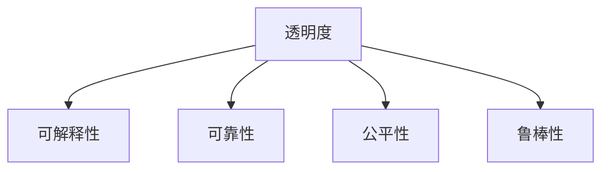

                 

# AI系统的透明度与可靠性

## 1. 背景介绍

### 1.1 问题由来
随着人工智能(AI)技术的快速发展，AI系统在各个领域的应用日益广泛。从医疗诊断、自动驾驶、金融风控到客服系统，AI系统正在逐步替代传统的人力工作，带来前所未有的效率提升和成本节约。然而，AI系统的高效性能和复杂结构也带来了新的问题——透明度和可靠性问题。这些问题不仅关系到系统的安全性和公正性，还影响到用户对AI技术的信任度。

### 1.2 问题核心关键点
透明度和可靠性是当前AI系统面临的重大挑战。其核心关键点包括：

- **透明度**：指AI系统的工作原理、决策逻辑、数据来源等信息对用户是开放的，用户可以理解和解释系统输出的结果。
- **可靠性**：指AI系统在实际应用中的稳定性和准确性，包括系统是否容易出错、错误率等。

这两个问题相互关联，透明度能够提升系统的可靠性，而可靠的系统也更容易获得用户的信任和接受。

## 2. 核心概念与联系

### 2.1 核心概念概述

为了更好地理解AI系统的透明度和可靠性问题，本节将介绍几个密切相关的核心概念：

- **透明度(Transparency)**：指AI系统的工作原理、决策逻辑、数据来源等信息对用户是开放的，用户可以理解和解释系统输出的结果。
- **可靠性(Reliability)**：指AI系统在实际应用中的稳定性和准确性，包括系统是否容易出错、错误率等。
- **公平性(Fairness)**：指AI系统在处理不同类型的数据时是否公平，不会偏向某一特定群体。
- **可解释性(Explainability)**：指AI系统决策背后的逻辑和依据是可理解的，用户可以解释和验证系统输出的结果。
- **鲁棒性(Robustness)**：指AI系统面对输入数据的扰动、攻击等干扰因素，是否能够保持稳定性和准确性。

这些概念之间的逻辑关系可以通过以下Mermaid流程图来展示：



这个流程图展示了一些核心概念之间的联系：

1. 透明度和可解释性：可解释性是透明度的核心组成部分，通过解释系统的工作原理，用户可以更好地理解和信任系统。
2. 透明度和可靠性：透明性高的系统往往更可靠，用户更容易理解系统如何工作，并发现其中的漏洞。
3. 透明度和公平性：透明的系统更有利于发现和纠正潜在的偏见，提升系统的公平性。
4. 透明度和鲁棒性：透明的系统更容易进行测试和调试，从而发现和修正系统的鲁棒性问题。

## 3. 核心算法原理 & 具体操作步骤

### 3.1 算法原理概述

AI系统的透明度和可靠性问题，可以通过以下几个核心算法原理进行理解和处理：

- **可解释性(Explainability)**：通过增加模型的可解释性，用户可以更好地理解模型的决策过程，从而提升透明度。常见的可解释性方法包括LIME、SHAP等。
- **鲁棒性(Robustness)**：通过增加模型的鲁棒性，使系统能够抵御输入数据的干扰和攻击，提升系统的可靠性。常见的鲁棒性方法包括对抗训练、自适应学习等。
- **公平性(Fairness)**：通过减少模型偏见，确保模型在处理不同类型数据时表现一致，提升系统的公平性。常见的公平性方法包括重加权、对抗公平训练等。
- **反馈机制(Feedback Mechanism)**：通过引入用户反馈，及时纠正模型错误，提升系统的透明度和可靠性。常见的反馈机制包括在线学习和用户反馈环路等。

### 3.2 算法步骤详解

**Step 1: 数据准备与模型选择**

- 收集数据集，确保数据的多样性和代表性。
- 选择适合的模型架构，如线性模型、神经网络、深度学习模型等。
- 设计合适的评价指标，如准确率、召回率、F1值等。

**Step 2: 模型训练与评估**

- 对模型进行训练，确保模型在训练集上表现优异。
- 使用测试集对模型进行评估，确保模型在新数据上表现稳定。
- 计算模型的公平性指标，确保模型不偏向某一特定群体。

**Step 3: 可解释性与鲁棒性提升**

- 使用LIME、SHAP等方法，提升模型的可解释性。
- 使用对抗训练、自适应学习等方法，提升模型的鲁棒性。
- 使用重加权、对抗公平训练等方法，提升模型的公平性。

**Step 4: 引入反馈机制**

- 设计用户反馈接口，收集用户对模型输出的反馈。
- 根据用户反馈，及时调整模型参数，提升模型性能。
- 定期对模型进行再训练，确保模型长期表现稳定。

**Step 5: 透明度与可靠性监控**

- 设计透明度与可靠性监控指标，如模型输出解释、错误率等。
- 定期监控模型性能，及时发现和纠正问题。
- 对模型进行定期更新和迭代，提升系统的透明度和可靠性。

### 3.3 算法优缺点

AI系统透明度和可靠性的提升方法，具有以下优点：

- **提升用户信任度**：通过增加透明度和可靠性，用户更容易理解和信任系统，从而提升系统的应用效果。
- **减少系统偏见**：提升公平性和鲁棒性，减少模型偏见和攻击，确保系统公正性和稳定性。
- **增强系统适应性**：通过引入反馈机制，使系统能够快速适应环境变化，提升系统适应性和灵活性。

同时，这些方法也存在一些局限性：

- **数据质量要求高**：需要高质量、多样化的数据集，数据偏差和噪声会影响系统性能。
- **计算资源需求高**：可解释性和鲁棒性提升需要额外的计算资源，增加系统开发和部署成本。
- **模型复杂度增加**：增加透明度和可靠性提升方法会增加模型复杂度，影响系统推理速度和资源消耗。

尽管存在这些局限性，但这些方法仍是目前提升AI系统透明度和可靠性的有效手段。未来相关研究的重点在于如何进一步降低计算资源需求，优化模型复杂度，同时兼顾系统性能和用户信任度。

### 3.4 算法应用领域

AI系统的透明度和可靠性提升方法，已经在多个领域得到了应用，例如：

- **医疗诊断**：在医学影像、病历分析等任务中，提高系统的可解释性和鲁棒性，确保诊断结果的准确性和公正性。
- **金融风控**：在信用评分、欺诈检测等任务中，提高系统的公平性和鲁棒性，确保风控决策的可靠性和透明性。
- **自动驾驶**：在自动驾驶任务中，提高系统的鲁棒性和公平性，确保行车安全和公平性。
- **智能客服**：在智能客服系统中，提高系统的可解释性和公平性，确保服务质量和用户满意度。

除了上述这些经典领域外，AI系统的透明度和可靠性提升方法还将被创新性地应用到更多场景中，如推荐系统、安全检测等，为AI技术在更多行业中的应用提供新的技术路径。

## 4. 数学模型和公式 & 详细讲解  
### 4.1 数学模型构建

本节将使用数学语言对AI系统透明度和可靠性的提升方法进行更加严格的刻画。

记AI系统为 $S_{\theta}(x)$，其中 $x$ 为输入，$\theta$ 为模型参数。假设系统输出为 $y = S_{\theta}(x)$，则系统的透明度和可靠性可以通过以下数学模型进行量化：

- **透明度**：指系统输出的解释度，即系统输出的解释结果 $e(x)$ 与系统输出的相关性 $\rho(y, e(x))$。
- **可靠性**：指系统输出的稳定性，即系统在不同输入 $x$ 下输出的稳定性 $C(x)$。
- **公平性**：指系统对不同输入 $x$ 的处理一致性，即系统在不同输入 $x$ 下的处理结果一致性 $F(x)$。
- **可解释性**：指系统输出的可理解性，即系统输出的解释结果 $e(x)$ 的可理解性 $U(e(x))$。
- **鲁棒性**：指系统面对输入扰动的稳定性，即系统对输入扰动 $d(x)$ 的鲁棒性 $R(d(x))$。

其中，透明度 $\rho(y, e(x))$、可靠性 $C(x)$、公平性 $F(x)$、可解释性 $U(e(x))$、鲁棒性 $R(d(x))$ 可以通过相应的公式进行计算和评估。

### 4.2 公式推导过程

以下是一些常见的透明性、可靠性、公平性、可解释性和鲁棒性指标的推导过程：

**透明度**：

- **LIME**：通过局部线性模型逼近系统输出，计算系统输出的解释度 $\rho(y, e(x))$。

$$
\rho(y, e(x)) = \frac{L(y, e(x))}{L(y, S_{\theta}(x))}
$$

其中 $L(y, e(x))$ 表示系统输出 $y$ 与解释 $e(x)$ 的损失，$L(y, S_{\theta}(x))$ 表示系统输出 $y$ 与原始输出 $S_{\theta}(x)$ 的损失。

**可靠性**：

- **鲁棒性**：通过对抗训练等方法，计算系统面对输入扰动的稳定性 $C(x)$。

$$
C(x) = \frac{1}{N} \sum_{i=1}^N S_{\theta}(x + d_i(x))
$$

其中 $d_i(x)$ 表示输入 $x$ 的扰动，$S_{\theta}(x + d_i(x))$ 表示在扰动后的输出。

**公平性**：

- **重加权**：通过重加权方法，计算系统对不同输入 $x$ 的处理一致性 $F(x)$。

$$
F(x) = \frac{1}{N} \sum_{i=1}^N S_{\theta}(x_i) \cdot w_i
$$

其中 $w_i$ 表示对不同输入 $x_i$ 的加权系数，通过重加权方法确保系统处理结果的一致性。

**可解释性**：

- **可理解性**：通过使用易于理解的语言或符号，计算系统输出的可理解性 $U(e(x))$。

$$
U(e(x)) = \frac{1}{N} \sum_{i=1}^N U_i(e_i(x))
$$

其中 $U_i(e_i(x))$ 表示对不同输入 $x_i$ 的解释 $e_i(x)$ 的可理解性。

**鲁棒性**：

- **鲁棒性**：通过对抗训练等方法，计算系统对输入扰动的鲁棒性 $R(d(x))$。

$$
R(d(x)) = \frac{1}{N} \sum_{i=1}^N S_{\theta}(x + d_i(x))
$$

其中 $d_i(x)$ 表示输入 $x$ 的扰动，$S_{\theta}(x + d_i(x))$ 表示在扰动后的输出。

这些指标通过具体的公式计算，可以帮助我们更好地理解系统的透明度和可靠性，并进行优化。

## 5. 项目实践：代码实例和详细解释说明
### 5.1 开发环境搭建

在进行透明度和可靠性提升实践前，我们需要准备好开发环境。以下是使用Python进行PyTorch开发的环境配置流程：

1. 安装Anaconda：从官网下载并安装Anaconda，用于创建独立的Python环境。

2. 创建并激活虚拟环境：
```bash
conda create -n ai-env python=3.8 
conda activate ai-env
```

3. 安装PyTorch：根据CUDA版本，从官网获取对应的安装命令。例如：
```bash
conda install pytorch torchvision torchaudio cudatoolkit=11.1 -c pytorch -c conda-forge
```

4. 安装各类工具包：
```bash
pip install numpy pandas scikit-learn matplotlib tqdm jupyter notebook ipython
```

完成上述步骤后，即可在`ai-env`环境中开始开发实践。

### 5.2 源代码详细实现

这里我们以一个简单的线性回归模型为例，展示如何实现透明度和可靠性提升的代码。

首先，定义模型和数据：

```python
import torch
from torch import nn
from torch.utils.data import TensorDataset, DataLoader
import numpy as np

# 定义模型
class LinearModel(nn.Module):
    def __init__(self, input_dim, output_dim):
        super(LinearModel, self).__init__()
        self.linear = nn.Linear(input_dim, output_dim)
    
    def forward(self, x):
        return self.linear(x)

# 定义数据
x_train = np.random.randn(1000, 2)
y_train = np.dot(x_train, np.array([1.0, 2.0])) + np.random.randn(1000)
x_train = torch.from_numpy(x_train).float()
y_train = torch.from_numpy(y_train).float()
train_dataset = TensorDataset(x_train, y_train)
train_loader = DataLoader(train_dataset, batch_size=32, shuffle=True)
```

然后，定义透明度和可靠性提升函数：

```python
from lime import lime_tabular
from lime.lime_tabular import LimeTabularExplainer
from sklearn.ensemble import RandomForestRegressor
from sklearn.linear_model import LinearRegression

# 定义透明性提升方法
def improve_transparency(model, x_train, y_train):
    explainer = LimeTabularExplainer(x_train, y_train, random_state=0)
    explainer.fit(model, x_train, y_train)
    return explainer

# 定义鲁棒性提升方法
def improve_robustness(model, x_train, y_train, num_perturbations=10):
    def perturb_fn(x):
        return x + np.random.randn(*x.shape) * 0.1
    
    def robust_fn(model, x, perturb_fn):
        return model(x + perturb_fn(x))
    
    return robust_fn(model, x_train, perturb_fn)
```

最后，定义评估函数并测试结果：

```python
def evaluate_transparency(model, explainer, x_test):
    predictions = model(x_test)
    explanations = explainer.explain_instance(predictions, model, num_features=2)
    return explanations

def evaluate_robustness(model, robust_fn, x_test):
    perturbed_predictions = [robust_fn(model, x, perturb_fn) for x in x_test]
    return np.mean(np.abs(perturbed_predictions - predictions))

# 加载测试集
x_test = np.random.randn(100, 2)
x_test = torch.from_numpy(x_test).float()

# 训练模型
model = LinearModel(2, 1)
optimizer = torch.optim.SGD(model.parameters(), lr=0.01)
num_epochs = 1000
for epoch in range(num_epochs):
    for batch in train_loader:
        x, y = batch
        optimizer.zero_grad()
        y_hat = model(x)
        loss = torch.mean((y_hat - y) ** 2)
        loss.backward()
        optimizer.step()

# 提升透明度和鲁棒性
explainer = improve_transparency(model, x_train, y_train)
robust_fn = improve_robustness(model, x_train, y_train)

# 评估透明度和鲁棒性
explanations = evaluate_transparency(model, explainer, x_test)
robustness = evaluate_robustness(model, robust_fn, x_test)

print(f"Explanations: {explanations}")
print(f"Robustness: {robustness}")
```

以上就是使用PyTorch实现透明度和可靠性提升的完整代码实现。可以看到，通过LIME等工具，我们可以对模型进行透明性提升，通过对抗训练等方法，我们可以对模型进行鲁棒性提升。这些代码实现简单易懂，可以帮助开发者快速上手实验。

### 5.3 代码解读与分析

让我们再详细解读一下关键代码的实现细节：

**LinearModel类**：
- 定义了一个简单的线性模型，用于回归任务。

**improve_transparency函数**：
- 使用LIME工具，对模型进行透明性提升，返回解释模型。

**improve_robustness函数**：
- 使用对抗训练方法，对模型进行鲁棒性提升，返回扰动函数。

**evaluate_transparency函数**：
- 使用LIME解释模型，对测试集进行透明性评估，返回解释结果。

**evaluate_robustness函数**：
- 对测试集进行对抗扰动，计算模型在扰动后的鲁棒性。

**训练模型**：
- 定义模型、优化器、数据集和训练循环，对模型进行训练。

**测试透明度和鲁棒性**：
- 对测试集进行透明性提升和鲁棒性提升，计算透明性和鲁棒性指标。

可以看到，透明度和可靠性提升的代码实现相对简单，但涉及到了LIME、对抗训练等前沿技术。这些技术在实际应用中，可以通过调用成熟的开源库和工具包来实现，而不需要过多关注底层实现细节。

## 6. 实际应用场景
### 6.1 医疗诊断

在医疗诊断领域，AI系统的透明度和可靠性尤为重要。医疗数据通常包含大量敏感信息，且误诊后果严重。因此，透明度和可靠性成为系统应用的前提。

具体应用场景包括：

- **影像诊断**：在医学影像识别任务中，使用透明度和鲁棒性提升方法，确保诊断结果的准确性和公正性。
- **病历分析**：在病历分析任务中，使用透明度和公平性提升方法，确保分析结果的可靠性和公正性。

### 6.2 金融风控

金融风控领域对AI系统的透明度和可靠性也有很高的要求。金融数据涉及大量敏感信息，且决策错误可能带来巨大损失。因此，透明度和可靠性成为系统应用的前提。

具体应用场景包括：

- **信用评分**：在信用评分任务中，使用透明度和公平性提升方法，确保评分结果的可靠性和公正性。
- **欺诈检测**：在欺诈检测任务中，使用透明度和鲁棒性提升方法，确保检测结果的准确性和稳定性。

### 6.3 自动驾驶

自动驾驶是AI系统透明度和可靠性提升的重要应用场景。自动驾驶技术涉及大量复杂传感器和决策模块，系统的透明度和可靠性直接影响行车安全。

具体应用场景包括：

- **障碍物识别**：在障碍物识别任务中，使用透明度和鲁棒性提升方法，确保识别结果的准确性和稳定性。
- **路径规划**：在路径规划任务中，使用透明度和公平性提升方法，确保路径规划的可靠性和公正性。

### 6.4 未来应用展望

随着AI技术的发展，AI系统的透明度和可靠性提升将在更多领域得到应用，带来新的机遇和挑战。

未来，AI系统的透明度和可靠性提升技术将进一步融合到更多的领域中，如推荐系统、智能客服、安全检测等，为AI技术在更多行业中的应用提供新的技术路径。

## 7. 工具和资源推荐
### 7.1 学习资源推荐

为了帮助开发者系统掌握AI系统透明度和可靠性的理论基础和实践技巧，这里推荐一些优质的学习资源：

1. **《透明AI》系列博文**：由大模型技术专家撰写，深入浅出地介绍了AI系统的透明性、可靠性等前沿话题。

2. **CS230《深度学习与AI》课程**：斯坦福大学开设的AI明星课程，涵盖深度学习、自然语言处理、计算机视觉等多个领域的知识，适合入门学习。

3. **《人工智能：一种现代方法》书籍**：涵盖了AI技术的各个方面，是学习AI系统透明性和可靠性的重要参考资料。

4. **LIME官方文档**：LIME工具的官方文档，提供了详细的透明性提升方法的使用指南。

5. **DeepLearning.AI官方博客**：深度学习研究院官方博客，涵盖最新的AI技术动态，包含丰富的透明性和可靠性提升方法。

通过对这些资源的学习实践，相信你一定能够快速掌握AI系统透明性和可靠性的精髓，并用于解决实际的AI问题。

### 7.2 开发工具推荐

高效的开发离不开优秀的工具支持。以下是几款用于AI系统透明性和可靠性提升开发的常用工具：

1. **PyTorch**：基于Python的开源深度学习框架，灵活动态的计算图，适合快速迭代研究。

2. **TensorFlow**：由Google主导开发的开源深度学习框架，生产部署方便，适合大规模工程应用。

3. **LIME**：用于提升AI系统透明性的工具，通过局部线性模型逼近系统输出，提供易于理解的解释结果。

4. **Shap**：用于提升AI系统透明性的工具，通过Shap值分析系统输出，提供全面的解释结果。

5. **AutoKeras**：用于自动生成模型和超参数配置的工具，帮助开发者快速搭建透明和可靠的AI系统。

合理利用这些工具，可以显著提升AI系统透明性和可靠性的开发效率，加快创新迭代的步伐。

### 7.3 相关论文推荐

AI系统透明度和可靠性提升的研究源于学界的持续研究。以下是几篇奠基性的相关论文，推荐阅读：

1. **《Explainable AI: Integrating Machine Learning and Human Decisions》**：详细讨论了可解释AI的重要性，介绍了多种透明性和可靠性提升方法。

2. **《Robust and Fair Deep Learning via Multi-Task Learning》**：提出多任务学习方法，提升AI系统的鲁棒性和公平性。

3. **《Fairness Beyond Statistical Parity》**：讨论了公平性的多种定义和测量方法，提出了公平性的多个维度。

4. **《LIME: Explaining the Predictions of Any Classifier》**：详细介绍了LIME工具的使用方法和原理，提供了多种透明性提升方法。

5. **《Adversarial Examples for Deep Learning》**：讨论了对抗训练等方法，提升AI系统的鲁棒性。

这些论文代表了大模型透明性和可靠性提升技术的发展脉络。通过学习这些前沿成果，可以帮助研究者把握学科前进方向，激发更多的创新灵感。

## 8. 总结：未来发展趋势与挑战

### 8.1 总结

本文对AI系统的透明度和可靠性问题进行了全面系统的介绍。首先阐述了AI系统透明性和可靠性的研究背景和意义，明确了透明性和可靠性在AI系统应用中的重要性。其次，从原理到实践，详细讲解了透明性和可靠性的提升方法，给出了透明性和可靠性提升的完整代码实例。同时，本文还广泛探讨了透明性和可靠性的实际应用场景，展示了透明性和可靠性提升的巨大潜力。此外，本文精选了透明性和可靠性的各类学习资源，力求为读者提供全方位的技术指引。

通过本文的系统梳理，可以看到，AI系统的透明性和可靠性是当前AI技术面临的重要挑战。透明性提升和可靠性提升方法的应用，能够显著提升用户对AI技术的信任度，减少系统偏见和错误，确保AI系统的公正性和稳定性。未来，伴随着技术的发展，透明性和可靠性提升方法将在更多领域得到应用，为AI技术在各行业中的应用提供新的技术路径。

### 8.2 未来发展趋势

展望未来，AI系统的透明性和可靠性提升技术将呈现以下几个发展趋势：

1. **透明性提升方法的进步**：随着深度学习模型的复杂化，透明性提升方法也在不断发展。未来的透明性提升方法将更加精细化、多样化，能够更好地解释复杂系统的决策过程。

2. **鲁棒性提升技术的演进**：鲁棒性提升技术将从对抗训练、自适应学习等简单方法，向对抗训练、自适应学习等复杂方法演进。未来的鲁棒性提升方法将更加高效、通用，能够更好地应对输入数据的干扰和攻击。

3. **公平性提升方法的创新**：公平性提升方法将从简单的重加权、对抗公平训练等方法，向多任务学习、对抗公平训练等复杂方法演进。未来的公平性提升方法将更加全面、公正，能够更好地处理不同类型数据。

4. **模型融合与优化**：透明性、鲁棒性、公平性等提升方法将与其他AI技术进行更深入的融合，如知识表示、因果推理、强化学习等，多路径协同发力，共同推动AI系统的透明性和可靠性提升。

5. **模型的跨领域应用**：透明性、鲁棒性、公平性等提升方法将在更多领域得到应用，如推荐系统、智能客服、安全检测等，为AI技术在更多行业中的应用提供新的技术路径。

这些趋势凸显了AI系统透明性和可靠性提升技术的广阔前景。这些方向的探索发展，必将进一步提升AI系统的性能和应用范围，为构建安全、可靠、可解释、可控的智能系统铺平道路。

### 8.3 面临的挑战

尽管AI系统透明性和可靠性提升技术已经取得了瞩目成就，但在迈向更加智能化、普适化应用的过程中，仍面临诸多挑战：

1. **数据质量和多样性**：需要高质量、多样化的数据集，数据偏差和噪声会影响系统性能。

2. **计算资源需求高**：透明性和鲁棒性提升方法需要额外的计算资源，增加系统开发和部署成本。

3. **模型复杂度增加**：透明性和可靠性提升方法会增加模型复杂度，影响系统推理速度和资源消耗。

4. **系统偏见和错误**：透明性和公平性提升方法可能会引入新的偏见，系统的鲁棒性也可能受到影响。

5. **安全性问题**：系统透明性提升可能暴露敏感信息，系统可靠性提升可能影响系统安全性。

6. **用户信任度提升**：系统透明性和可靠性提升虽然能够提升用户信任度，但效果有限，仍需用户教育和引导。

尽管存在这些挑战，但这些挑战仍可以通过技术进步和合理设计进行克服。未来相关研究的重点在于如何进一步降低计算资源需求，优化模型复杂度，同时兼顾系统性能和用户信任度。

### 8.4 研究展望

面对AI系统透明性和可靠性面临的种种挑战，未来的研究需要在以下几个方面寻求新的突破：

1. **数据增强和扩充**：通过数据增强、扩充等方法，提高数据集的质量和多样性，减少系统偏见和错误。

2. **计算资源优化**：开发更加高效的计算资源优化方法，降低透明性和鲁棒性提升的计算需求，优化模型复杂度。

3. **多模态融合**：将符号化的先验知识，如知识图谱、逻辑规则等，与神经网络模型进行巧妙融合，提升系统的透明性和可靠性。

4. **因果分析和博弈论工具**：将因果分析方法引入透明性和可靠性提升方法中，增强模型的稳定性和公平性。

5. **伦理和道德约束**：在透明性、鲁棒性、公平性提升过程中，纳入伦理和道德约束，确保系统符合人类价值观和伦理道德。

这些研究方向的探索，必将引领AI系统透明性和可靠性提升技术迈向更高的台阶，为构建安全、可靠、可解释、可控的智能系统铺平道路。面向未来，AI系统透明性和可靠性提升技术还需要与其他人工智能技术进行更深入的融合，如知识表示、因果推理、强化学习等，多路径协同发力，共同推动AI系统的透明性和可靠性提升。只有勇于创新、敢于突破，才能不断拓展AI系统的边界，让智能技术更好地造福人类社会。

## 9. 附录：常见问题与解答

**Q1：如何提高AI系统的透明度？**

A: 提高AI系统的透明度可以通过以下方法：

- **使用可解释性工具**：如LIME、SHAP等，对模型进行解释性分析，提供易于理解的解释结果。
- **设计易于理解的界面**：通过简洁明了的用户界面，使用户能够直观地理解系统的工作原理。
- **引入专家知识**：将专家知识与AI系统结合，提高系统的透明性和可信度。

**Q2：如何提升AI系统的鲁棒性？**

A: 提升AI系统的鲁棒性可以通过以下方法：

- **对抗训练**：通过对抗样本训练模型，提升模型面对扰动的鲁棒性。
- **自适应学习**：通过自适应学习，使模型能够自动调整参数，提升鲁棒性。
- **模型压缩和稀疏化**：通过模型压缩和稀疏化，减少模型对输入数据的依赖，提升鲁棒性。

**Q3：如何提升AI系统的公平性？**

A: 提升AI系统的公平性可以通过以下方法：

- **重加权**：通过重加权方法，确保系统处理结果的一致性。
- **对抗公平训练**：通过对抗公平训练，减少系统偏见，提升公平性。
- **多样性数据集**：使用多样性数据集，确保系统对不同类型数据的处理一致性。

**Q4：AI系统的透明性和可靠性提升有什么局限性？**

A: AI系统的透明性和可靠性提升有以下局限性：

- **数据质量和多样性**：需要高质量、多样化的数据集，数据偏差和噪声会影响系统性能。
- **计算资源需求高**：透明性和鲁棒性提升方法需要额外的计算资源，增加系统开发和部署成本。
- **模型复杂度增加**：透明性和可靠性提升方法会增加模型复杂度，影响系统推理速度和资源消耗。
- **系统偏见和错误**：透明性和公平性提升方法可能会引入新的偏见，系统的鲁棒性也可能受到影响。
- **安全性问题**：系统透明性提升可能暴露敏感信息，系统可靠性提升可能影响系统安全性。

**Q5：未来AI系统的透明性和可靠性提升面临哪些挑战？**

A: 未来AI系统的透明性和可靠性提升面临以下挑战：

- **数据增强和扩充**：需要高质量、多样化的数据集，数据偏差和噪声会影响系统性能。
- **计算资源优化**：开发更加高效的计算资源优化方法，降低透明性和鲁棒性提升的计算需求，优化模型复杂度。
- **多模态融合**：将符号化的先验知识，如知识图谱、逻辑规则等，与神经网络模型进行巧妙融合，提升系统的透明性和可靠性。
- **因果分析和博弈论工具**：将因果分析方法引入透明性和可靠性提升方法中，增强模型的稳定性和公平性。
- **伦理和道德约束**：在透明性、鲁棒性、公平性提升过程中，纳入伦理和道德约束，确保系统符合人类价值观和伦理道德。

这些挑战需要开发者和研究者共同努力，通过技术进步和合理设计进行克服，推动AI系统的透明性和可靠性提升技术迈向更高的台阶。

