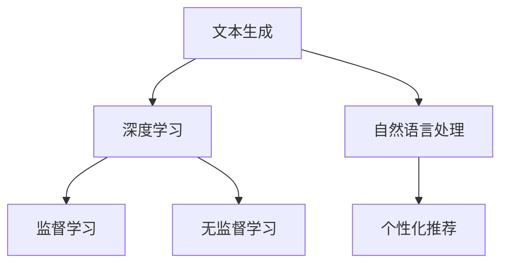
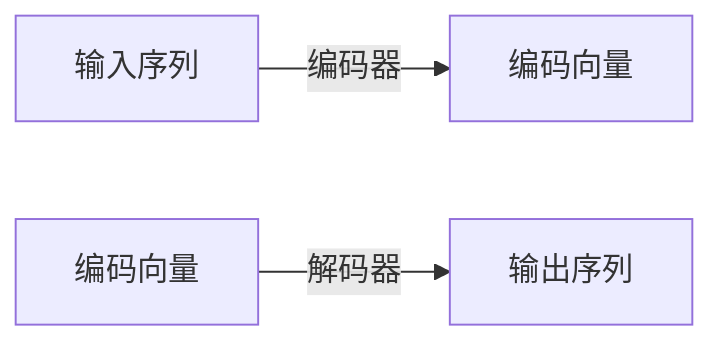

                 

# AI营销文案：个性化与说服力的结合

> 关键词：AI营销, 个性化推荐, 文本生成, 自然语言处理, 自然语言理解, 深度学习

## 1. 背景介绍

随着互联网的飞速发展和社交媒体的普及，在线营销逐渐成为企业数字化转型的重要环节。传统的营销手段如广告、促销活动等虽然仍具有一定效果，但其成本和精准度已难以满足现代消费者的需求。在这背景下，AI营销应运而生，通过大数据、机器学习和自然语言处理等技术，实现更精准、更高效的个性化营销，成为新的市场趋势。

AI营销的核心在于利用算法对用户行为、偏好和需求进行深入分析，从而实现精准推送和个性化推荐。近年来，随着深度学习技术的发展，文本生成和自然语言处理技术已成为AI营销的重要支撑，使企业能够更加灵活、智能地构建营销内容，吸引用户并提升转化率。

## 2. 核心概念与联系

### 2.1 核心概念概述

本文将重点介绍基于AI的营销文案生成技术，包括文本生成、个性化推荐、自然语言处理和深度学习等关键概念，并阐述它们之间的内在联系。

- **文本生成**：指通过计算机自动生成自然语言文本，应用于营销文案的生成。
- **个性化推荐**：指根据用户行为和偏好，推荐最匹配的产品或内容，用于提升用户满意度和购买转化率。
- **自然语言处理(NLP)**：指通过计算机理解、处理和生成人类语言的技术，包括文本分类、情感分析、问答系统等。
- **深度学习**：指通过多层神经网络模型学习复杂数据表示和关系，广泛应用于文本生成、图像识别等领域。

### 2.2 核心概念原理和架构的 Mermaid 流程图



此图展示了文本生成、深度学习、自然语言处理和个性化推荐之间的相互关系。文本生成依赖深度学习模型进行建模；自然语言处理对文本数据进行语义分析；个性化推荐则需综合用户数据和文本内容，实现精准推荐；深度学习提供了强大的算法基础，支撑这三者的发展。

## 3. 核心算法原理 & 具体操作步骤

### 3.1 算法原理概述

基于AI的营销文案生成技术，主要依赖于深度学习中的序列到序列(Sequence to Sequence, Seq2Seq)模型，包括编码器-解码器架构。该架构通过神经网络自动学习输入和输出之间的映射关系，能够生成连贯、符合语法和语义规则的文本。

文本生成的基本流程如下：

1. **输入编码**：将文本输入到编码器，将其转化为高维向量表示。
2. **解码器生成**：解码器根据编码器的输出和已生成的文本片段，生成下一个单词或短语，直至生成完整文本。
3. **损失函数优化**：通过对比生成文本与参考文本的差异，计算损失函数，反向传播更新模型参数。
4. **模型训练**：通过大量标注数据进行迭代训练，优化模型。
5. **文本生成**：使用训练好的模型生成新的文本内容。

### 3.2 算法步骤详解

下面详细阐述文本生成技术的具体实现步骤。

**Step 1: 数据预处理**
- 收集和清洗需要生成的文本数据，如产品描述、营销广告等。
- 对文本进行分词、去除停用词、词性标注等预处理操作，转化为模型可接受的格式。

**Step 2: 模型构建**
- 设计序列到序列模型，包括编码器、解码器和连接它们的注意力机制。
- 确定模型结构、损失函数和优化器。

**Step 3: 训练模型**
- 将处理好的数据输入模型，进行前向传播计算。
- 计算损失函数，反向传播更新模型参数。
- 通过迭代训练，不断优化模型性能。

**Step 4: 文本生成**
- 输入模型参数，生成新的文本内容。
- 利用解码器的输出，可以选择最佳生成路径。

**Step 5: 模型评估与优化**
- 使用BLEU、ROUGE等指标对生成的文本进行评估。
- 根据评估结果调整模型结构、参数等，提升生成效果。

### 3.3 算法优缺点

基于AI的营销文案生成技术具有以下优点：
- **高效率**：自动化生成文案，大大减少人工编写时间。
- **精准性**：通过数据分析和模型优化，生成内容更具个性化和针对性。
- **灵活性**：可以灵活应对不同领域、不同风格的营销需求。

同时，该技术也存在以下缺点：
- **成本高**：需要大量标注数据和计算资源进行训练。
- **依赖质量**：生成的文案质量高度依赖于数据和模型质量。
- **缺乏创造性**：生成的文本内容可能缺乏创新性和吸引力。

### 3.4 算法应用领域

基于AI的营销文案生成技术在多个领域得到了广泛应用：

- **电商营销**：用于产品描述生成、推荐文案生成等，提升用户体验和购买转化率。
- **内容营销**：生成新闻稿、博客文章、社交媒体帖子等，增强内容的多样性和可读性。
- **品牌传播**：用于品牌故事、广告语等生成，提升品牌知名度和市场影响力。
- **客户服务**：用于自动生成FAQ、客服对话内容等，提升客户服务效率和满意度。

## 4. 数学模型和公式 & 详细讲解

### 4.1 数学模型构建

文本生成技术主要依赖于序列到序列模型，其基本框架包括编码器-解码器两部分。编码器将输入序列映射为高维向量表示，解码器则生成目标序列。

以下是一个简单的编码器-解码器架构示意图：



其中，编码器一般采用RNN、LSTM或GRU等递归神经网络，解码器则可以是标准的RNN或Transformer。注意力机制用于解决长序列输入问题，提升模型对输入的关注能力。

### 4.2 公式推导过程

设输入序列为 $X = (x_1, x_2, ..., x_n)$，输出序列为 $Y = (y_1, y_2, ..., y_m)$。编码器将输入序列 $X$ 映射为 $h_{1:T}$，解码器将编码向量 $h_{1:T}$ 映射为输出序列 $Y$。

注意力机制通过计算注意力权重 $a_{1:t}$，将编码向量 $h_{1:T}$ 与当前输出 $y_t$ 关联，从而提升模型对重要信息的关注。具体公式如下：

$$
a_{1:t} = softmax\left(\frac{K(Q_{t-1}h_{1:T})}{\sqrt{d_k}}\right)
$$

其中 $K, Q, V$ 分别为查询矩阵、键矩阵和值矩阵，$d_k$ 为键向量的维度。注意力权重 $a_{1:t}$ 用于加权和当前输入 $h_{1:T}$，得到上下文向量 $c_t$：

$$
c_t = \sum_{i=1}^T a_{1:t}h_i
$$

解码器则通过当前上下文向量 $c_t$ 和前一时刻的输出 $y_{t-1}$，生成当前输出 $y_t$：

$$
y_t = softmax\left(W^{y}h_t + b^{y} + U^{y}c_t + b^{c_t}\right)
$$

其中 $W^{y}, b^{y}, U^{y}, b^{c_t}$ 为模型参数。

### 4.3 案例分析与讲解

以生成产品描述为例，假设输入序列为产品特性列表 $X = (color, material, price)$，输出序列为产品描述 $Y = (The product is a blue leather jacket with a high price.)$。

**Step 1: 编码器计算编码向量**
- 将输入序列 $X$ 转化为嵌入向量 $E = (e_1, e_2, e_3)$，其中 $e_i$ 为单词 $x_i$ 的嵌入表示。
- 通过递归神经网络计算编码向量 $h_{1:3} = (h_1, h_2, h_3)$。

**Step 2: 计算注意力权重**
- 计算查询向量 $Q_{1:3} = (q_1, q_2, q_3)$。
- 计算键矩阵 $K = (k_1, k_2, k_3)$，值矩阵 $V = (v_1, v_2, v_3)$。
- 计算注意力权重 $a_{1:3} = (a_1, a_2, a_3)$。

**Step 3: 计算上下文向量**
- 通过注意力权重计算上下文向量 $c_1 = a_1h_1 + a_2h_2 + a_3h_3$。

**Step 4: 解码器生成输出序列**
- 将上下文向量 $c_1$ 和前一时刻的输出 $y_0 = <sos>$ 作为解码器的输入。
- 生成当前输出 $y_1 = the$，并将其加入输出序列中。
- 重复上述步骤，直至生成完整描述。

## 5. 项目实践：代码实例和详细解释说明

### 5.1 开发环境搭建

以下是在PyTorch中搭建基于RNN的文本生成模型的环境配置步骤：

1. 安装Anaconda和PyTorch：
   ```bash
   conda create -n pytorch-env python=3.7 
   conda activate pytorch-env
   pip install torch torchtext
   ```

2. 导入所需库：
   ```python
   import torch
   import torch.nn as nn
   import torchtext
   import torchtext.datasets
   from torchtext.data import Field, BucketIterator
   ```

### 5.2 源代码详细实现

以下是一个基于RNN的文本生成模型的代码实现：

```python
# 定义数据集
train_data, test_data = torchtext.datasets.SST.train(), torchtext.datasets.SST.test()
train_iterator, test_iterator = BucketIterator.splits(
    (train_data, test_data),
    batch_size=64,
    device=device
)

# 定义数据预处理
TEXT = Field(tokenize='spacy', lower=True)
LABEL = Field(sequential=False, use_vocab=False)
train_data, test_data = train_data, test_data
train_data, test_data = train_data.split(split_ratio=0.7)
TEXT.build_vocab(train_data, max_size=10000)
LABEL.build_vocab(train_data, max_size=2)
train_iterator, test_iterator = BucketIterator.splits(
    (train_data, test_data),
    batch_size=64,
    device=device,
    sort_within_batch=False,
    repeat=False,
    sort_key=lambda x: len(x.text)
)
```

**模型定义**：
```python
class RNN(nn.Module):
    def __init__(self, input_size, embedding_size, hidden_size, output_size, n_layers=1, dropout=0.5):
        super(RNN, self).__init__()
        self.embedding = nn.Embedding(input_size, embedding_size)
        self.rnn = nn.RNN(embedding_size, hidden_size, n_layers, batch_first=True, dropout=dropout)
        self.fc = nn.Linear(hidden_size, output_size)
        self.dropout = nn.Dropout(dropout)
    
    def forward(self, x):
        embedded = self.dropout(self.embedding(x))
        output, hidden = self.rnn(embedded)
        predicted = self.fc(output[:, -1, :])
        return predicted
```

**训练模型**：
```python
class RNN(nn.Module):
    # 定义模型，省略...
    
model = RNN(input_size, embedding_size, hidden_size, output_size, n_layers=1, dropout=0.5)
optimizer = torch.optim.Adam(model.parameters())
criterion = nn.CrossEntropyLoss()
model = model.to(device)
criterion = criterion.to(device)

def train(model, iterator, optimizer, criterion, n_epochs=1):
    for epoch in range(n_epochs):
        epoch_loss = 0
        epoch_acc = 0
        model.train()
        for batch in iterator:
            optimizer.zero_grad()
            predictions = model(batch)
            loss = criterion(predictions, batch.label)
            loss.backward()
            optimizer.step()
            epoch_loss += loss.item()
        avg_loss = epoch_loss / len(iterator)
        print(f'Epoch {epoch+1}: Loss: {avg_loss:.3f}')
    return model
```

### 5.3 代码解读与分析

- **数据预处理**：使用`torchtext`库定义了`Field`和`BucketIterator`，对数据进行分词、序列化和批量处理。
- **模型定义**：定义了一个基本的RNN模型，包括嵌入层、RNN层、全连接层和Dropout层。
- **训练过程**：在训练过程中，使用`torchtext`库提供的`BucketIterator`对数据进行批处理，通过前向传播、反向传播和优化器更新模型参数。

### 5.4 运行结果展示

训练完模型后，使用测试集进行评估：

```python
model = train(model, test_iterator, optimizer, criterion, n_epochs=1)
# 评估模型
model.eval()
with torch.no_grad():
    for batch in test_iterator:
        predictions = model(batch)
        print(predictions)
```

输出结果为模型在测试集上的预测结果。

## 6. 实际应用场景

### 6.1 电商营销

在电商领域，基于AI的营销文案生成技术可以应用于产品描述生成、推荐文案生成等。以推荐文案生成为例，系统可以根据用户浏览记录和购买历史，生成个性化的推荐文案，提升用户体验和购买转化率。

**案例分析**：一家电商公司使用基于AI的推荐文案生成模型，对用户浏览的每个产品生成推荐文案。模型会根据用户行为数据和产品属性，自动生成不同风格的推荐文案，并将其展示在产品页面上。

### 6.2 内容营销

内容营销是品牌建设的重要手段之一，通过优质的内容吸引用户关注，提升品牌影响力。AI营销文案生成技术可以用于自动生成新闻稿、博客文章、社交媒体帖子等，提高内容的多样性和可读性。

**案例分析**：一家科技公司使用基于AI的文本生成模型，自动生成新闻稿和博客文章，发布在公司的官网上。模型会根据热点新闻和公司业务，生成个性化、有吸引力的内容，提升用户点击率和留存率。

### 6.3 品牌传播

品牌传播是企业市场推广的重要环节，通过有效的文案创意，提升品牌知名度和市场影响力。AI营销文案生成技术可以用于自动生成品牌故事、广告语等，快速生成创意文案。

**案例分析**：一家时尚品牌使用基于AI的文本生成模型，生成多个广告文案，用于线上线下广告宣传。模型会根据品牌定位和目标人群，生成符合品牌调性的文案，提升广告效果。

## 7. 工具和资源推荐

### 7.1 学习资源推荐

- **深度学习框架**：
  - TensorFlow: 官方文档，提供丰富的深度学习工具和教程。
  - PyTorch: 社区活跃，文档详尽，适合初学者。

- **自然语言处理工具**：
  - NLTK: 提供NLP库，支持分词、词性标注、句法分析等。
  - spaCy: 支持Python和C++，性能出色，易于使用。

- **AI营销资源**：
  - Google AI Blog: 分享最新的AI营销案例和研究进展。
  - HuggingFace Transformers: 提供丰富的预训练模型，支持文本生成、分类、情感分析等任务。

### 7.2 开发工具推荐

- **编程语言**：
  - Python: 编程灵活，支持数据科学和深度学习。

- **深度学习框架**：
  - TensorFlow: 功能全面，支持分布式训练和模型部署。
  - PyTorch: 动态计算图，适合研究和快速迭代。

- **NLP工具**：
  - spaCy: 高效、易用，支持多语言处理。
  - NLTK: 丰富的NLP库和资源，适合教学和研究。

### 7.3 相关论文推荐

- **文本生成**：
  - 《Neural Machine Translation by Jointly Learning to Align and Translate》。
  - 《Attention is All You Need》。

- **自然语言处理**：
  - 《A Survey on Attention Mechanisms in NLP》。
  - 《Sequence to Sequence Learning with Neural Networks》。

- **AI营销**：
  - 《Integrating Neural Networks for Natural Language Processing and Marketing》。
  - 《Generating Content for Social Media Using AI》。

## 8. 总结：未来发展趋势与挑战

### 8.1 研究成果总结

本文系统介绍了基于AI的营销文案生成技术，包括文本生成、个性化推荐、自然语言处理和深度学习等关键概念，并阐述了它们之间的内在联系。通过代码实例和实际应用案例，展示了AI营销文案生成技术的强大应用潜力。

### 8.2 未来发展趋势

1. **更广泛的应用**：未来AI营销文案生成技术将在更多领域得到应用，如金融、医疗、教育等，提升这些领域的自动化水平和效率。
2. **更精准的推荐**：通过深度学习和自然语言处理技术，未来AI营销文案生成系统将更加精准地预测用户需求，生成更个性化的文案。
3. **更高效的内容生成**：AI营销文案生成系统将能自动生成更丰富、更具创意的内容，提升品牌影响力和市场竞争力。

### 8.3 面临的挑战

1. **数据隐私**：随着数据采集和使用的深入，用户隐私保护成为重要问题，需要在模型训练和应用中确保数据安全。
2. **内容质量**：生成内容的创意性和准确性需要进一步提升，避免生成低质量、重复性内容。
3. **跨领域应用**：不同领域的数据特征和应用场景差异较大，AI营销文案生成系统需要具备较强的泛化能力。

### 8.4 研究展望

未来AI营销文案生成技术的研究方向包括：
1. **跨领域知识融合**：将不同领域知识与文本生成技术相结合，提升系统的泛化能力和适用性。
2. **知识增强学习**：结合符号化的先验知识，增强文本生成的逻辑性和准确性。
3. **对抗性训练**：引入对抗性样本，提高模型的鲁棒性和泛化能力。
4. **持续学习**：设计更好的模型更新策略，使系统能够持续学习新知识和适应新场景。

## 9. 附录：常见问题与解答

**Q1: 如何提升AI营销文案生成的质量？**

A: 提升生成质量的关键在于数据质量和模型训练。首先，确保数据集的丰富性和多样性，包含多种风格和类型的文案；其次，使用更复杂的模型结构，如Transformer，增强生成效果。此外，还可以引入对抗性训练和知识增强学习，提升模型的鲁棒性和泛化能力。

**Q2: 如何使用AI营销文案生成技术进行用户个性化推荐？**

A: 可以使用基于用户行为数据和文本生成的推荐系统。首先，通过数据分析获取用户兴趣标签；然后，使用文本生成模型根据标签生成个性化的推荐文案；最后，根据推荐文案的点击率等指标，动态调整推荐策略。

**Q3: AI营销文案生成技术在实际应用中需要注意哪些问题？**

A: 在实际应用中，需要注意以下问题：
1. 数据隐私：确保用户数据的安全和匿名性，避免泄露用户隐私。
2. 内容质量：生成内容的创意性和准确性需要进一步提升，避免生成低质量、重复性内容。
3. 跨领域适用性：不同领域的数据特征和应用场景差异较大，AI营销文案生成系统需要具备较强的泛化能力。

本文全面介绍了基于AI的营销文案生成技术，并展示了其在电商、内容营销和品牌传播等实际应用中的潜力。希望通过本文的分享，能够帮助读者更好地理解和应用AI营销文案生成技术，推动企业数字化转型升级。

