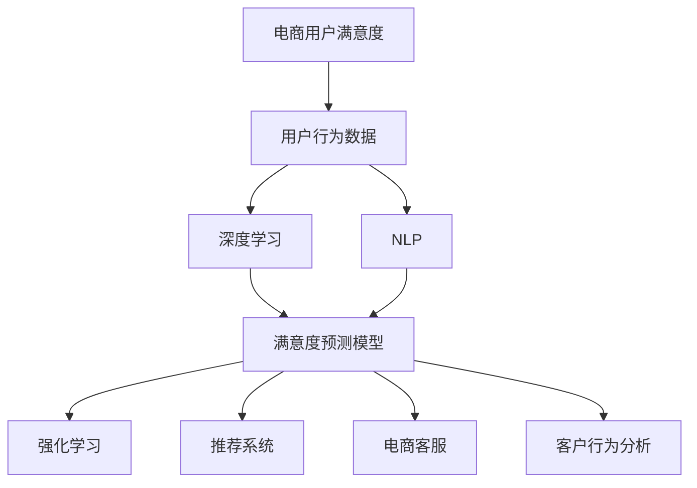

                 

# AI赋能的电商用户满意度预测与提升系统

> 关键词：电商用户满意度,预测模型,满意度提升,深度学习,强化学习,自然语言处理(NLP),推荐系统,电商客服,客户行为分析

## 1. 背景介绍

### 1.1 问题由来
随着互联网和电子商务的迅猛发展，电商平台的运营模式日益复杂，用户满意度成为了影响平台长期发展的关键因素。电商平台不仅需要提供优质的商品和便捷的服务，还需要不断提升用户体验，从而在激烈的市场竞争中脱颖而出。然而，用户满意度并非易测，如何通过数据驱动的方式预测和提升用户满意度，成为电商平台亟待解决的问题。

### 1.2 问题核心关键点
电商用户满意度预测与提升系统基于用户行为数据，通过AI技术分析用户情绪和反馈，从而预判用户满意度，并提供针对性的改善措施。这一系统的关键点包括：

1. **用户行为数据分析**：收集用户行为数据，如浏览记录、购买记录、评价反馈等，作为模型训练的依据。
2. **用户情绪识别**：利用NLP技术识别用户评价文本中的情绪，如正面、负面、中性等，了解用户真实感受。
3. **满意度预测模型**：基于用户行为和情绪信息，构建深度学习模型预测用户满意度。
4. **满意度提升策略**：根据预测结果，采取个性化策略提升用户满意度，如推荐相关商品、优化客服响应等。
5. **效果评估与反馈**：实时监控策略实施效果，收集用户反馈，持续优化模型与策略。

### 1.3 问题研究意义
电商用户满意度预测与提升系统的研究与应用，对于电商平台优化用户体验、提高客户忠诚度、降低运营成本具有重要意义：

1. **提升用户体验**：通过精准预测用户满意度，电商平台能够及时发现并解决用户痛点，提升用户满意度和平台口碑。
2. **增加客户粘性**：高质量的用户体验能增强客户粘性，提高复购率和生命周期价值。
3. **降低运营成本**：通过精准的客户服务和推荐策略，降低因用户不满意产生的售后纠纷和退货率，从而降低运营成本。
4. **促进数据驱动决策**：系统化地收集和分析用户数据，使决策更加科学和精准。
5. **推动行业发展**：作为电商领域的重要应用，其成功应用将引领更多电商平台采用类似技术，促进整个行业的进步。

## 2. 核心概念与联系

### 2.1 核心概念概述

为了更好地理解电商用户满意度预测与提升系统，本节将介绍几个关键概念及其之间的联系：

- **电商用户满意度**：衡量电商平台上用户对商品、服务、体验的综合评价，通常通过评分、评价文本等方式进行度量。
- **用户行为数据**：用户在平台上的浏览、点击、购买、评价等行为数据，是预测用户满意度的基础。
- **深度学习**：一种基于神经网络的机器学习技术，能够从大量数据中自动学习特征，适用于复杂的预测和分类任务。
- **强化学习**：通过试错不断优化模型策略，适应用于优化用户行为和提升满意度。
- **自然语言处理(NLP)**：处理和分析自然语言文本的技术，在用户评价情感识别和反馈处理中起到关键作用。
- **推荐系统**：根据用户历史行为和偏好，推荐相关商品或服务，提升用户满意度和转化率。
- **电商客服**：提供即时响应和解决方案，改善用户购买和使用体验。
- **客户行为分析**：分析用户行为模式和趋势，指导产品和服务优化。

这些核心概念之间的逻辑关系可以通过以下Mermaid流程图来展示：



这个流程图展示了电商用户满意度预测与提升系统的关键流程：

1. 从用户行为数据中提取特征。
2. 利用深度学习模型预测用户满意度。
3. 通过强化学习优化推荐策略和客服响应。
4. 结合NLP技术处理用户反馈，提升模型性能。
5. 客户行为分析辅助预测和决策优化。

## 3. 核心算法原理 & 具体操作步骤
### 3.1 算法原理概述

电商用户满意度预测与提升系统的核心算法基于深度学习和强化学习，通过用户行为数据和评价文本构建模型，预测用户满意度，并利用强化学习优化满意度提升策略。具体步骤如下：

1. **用户行为数据分析**：收集用户的浏览、点击、购买、评价等行为数据，并对其进行清洗和处理。
2. **用户情绪识别**：利用NLP技术对用户评价文本进行情感分析，识别正面、负面、中性的情绪。
3. **满意度预测模型**：构建深度神经网络模型，如卷积神经网络(CNN)、循环神经网络(RNN)或Transformer等，将用户行为和情绪特征作为输入，预测用户满意度。
4. **强化学习优化**：使用强化学习算法，如Q-learning、策略梯度等，根据满意度预测结果优化推荐系统策略和客服响应策略，提升用户满意度。
5. **效果评估与反馈**：实时监控满意度提升策略的效果，收集用户反馈，持续优化模型与策略。

### 3.2 算法步骤详解

以下是电商用户满意度预测与提升系统的详细操作步骤：

**Step 1: 数据收集与预处理**
- 收集用户行为数据，包括浏览记录、点击记录、购买记录、评价记录等。
- 对数据进行清洗和处理，去除噪声和异常值，标准化数据格式。
- 对用户评价文本进行分词、去除停用词等预处理操作，准备用于NLP情感分析。

**Step 2: 用户情绪识别**
- 使用预训练的NLP模型，如BERT、GPT等，对用户评价文本进行情感分类，识别正面、负面、中性情绪。
- 统计不同情绪的出现频率，分析用户情绪分布。

**Step 3: 满意度预测模型训练**
- 构建深度学习模型，如CNN、RNN或Transformer，将用户行为和情绪特征作为输入，预测用户满意度。
- 使用深度学习框架如TensorFlow或PyTorch进行模型训练，设定合适的超参数，如学习率、批大小、迭代轮数等。
- 在训练过程中，使用交叉验证和数据增强技术，提升模型泛化能力。

**Step 4: 强化学习优化**
- 使用强化学习算法，如Q-learning、策略梯度等，优化推荐系统和客服响应策略。
- 设计满意度提升策略的奖励机制，如提升用户满意度、增加转化率等。
- 模拟用户行为，评估策略效果，使用强化学习算法迭代优化策略。

**Step 5: 效果评估与反馈**
- 实时监控满意度提升策略的效果，如用户满意度评分、转化率等指标。
- 收集用户反馈，了解策略实施的效果和问题。
- 根据反馈调整策略，持续优化模型和算法。

### 3.3 算法优缺点

电商用户满意度预测与提升系统具有以下优点：
1. 数据驱动：利用用户行为数据和评价文本进行预测，更具客观性和可信度。
2. 精准预测：深度学习模型能够从复杂数据中提取特征，提高预测精度。
3. 动态优化：强化学习算法能够根据实时数据不断优化策略，提升用户体验。
4. 多维融合：结合用户行为和情绪分析，提供全方位的满意度预测。

同时，该系统也存在一些缺点：
1. 数据隐私问题：收集和处理用户数据涉及隐私问题，需要遵守相关法律法规。
2. 模型复杂度：深度学习模型的训练和优化需要大量计算资源和时间。
3. 动态环境适应：强化学习算法需要大量模拟数据和试错过程，可能面临动态环境适应困难。
4. 模型解释性不足：深度学习模型和强化学习算法缺乏可解释性，难以理解其内部机制。
5. 业务融合度：需要与电商平台现有系统进行深度集成，可能导致系统复杂度增加。

### 3.4 算法应用领域

电商用户满意度预测与提升系统在电商领域具有广泛应用前景，以下是几个具体应用场景：

- **个性化推荐系统**：根据用户历史行为和情绪分析，推荐相关商品或服务，提升用户满意度和转化率。
- **电商客服优化**：通过用户行为预测，指导客服人员及时响应，提供个性化服务，提高用户满意度。
- **用户行为分析**：分析用户行为模式和趋势，指导产品和服务优化，提升整体用户体验。
- **满意度实时监控**：实时监控用户满意度评分，及时发现并解决用户痛点，提升平台口碑。
- **商品质量改进**：根据用户评价中的负面反馈，指导商品质量改进，提升用户满意度。

## 4. 数学模型和公式 & 详细讲解  
### 4.1 数学模型构建

电商用户满意度预测与提升系统基于深度学习和强化学习，涉及用户行为数据和评价文本的处理。以下是数学模型构建的详细过程：

设用户行为数据集为 $D=\{(x_i, y_i)\}_{i=1}^N$，其中 $x_i$ 为行为特征向量，$y_i$ 为满意度评分。用户评价文本数据集为 $T=\{(t_j, l_j)\}_{j=1}^M$，其中 $t_j$ 为评价文本，$l_j$ 为情绪标签，如正面、负面、中性。

定义深度学习模型为 $M_{\theta}$，其中 $\theta$ 为模型参数。使用交叉熵损失函数 $\ell$ 来衡量模型预测值与真实值之间的差异，定义模型损失函数为：

$$
\mathcal{L}(\theta) = \frac{1}{N} \sum_{i=1}^N \ell(y_i, M_{\theta}(x_i)) + \lambda \frac{1}{M} \sum_{j=1}^M \ell(l_j, M_{\theta}(t_j))
$$

其中 $\lambda$ 为平衡因子，用于权衡用户行为数据和评价文本的权重。

### 4.2 公式推导过程

以下是电商用户满意度预测模型的详细公式推导过程：

1. **用户行为数据建模**
   - 用户行为数据 $x_i$ 包括浏览时间、点击次数、购买记录等，可以表示为向量形式：$x_i = (x_{i1}, x_{i2}, \ldots, x_{in})$。
   - 定义用户行为数据矩阵为 $X \in \mathbb{R}^{N \times n}$，行为标签矩阵为 $Y \in \mathbb{R}^{N \times 1}$，交叉熵损失函数为 $\ell_{BEH}$。

2. **用户评价文本建模**
   - 用户评价文本 $t_j$ 经过预处理后，可以表示为向量形式：$t_j = (t_{j1}, t_{j2}, \ldots, t_{jm})$。
   - 定义评价文本矩阵为 $T \in \mathbb{R}^{M \times m}$，情绪标签矩阵为 $L \in \mathbb{R}^{M \times 1}$，交叉熵损失函数为 $\ell_{TEXT}$。

3. **深度学习模型**
   - 定义深度学习模型 $M_{\theta}$，输入行为数据 $x_i$ 和评价文本 $t_j$，输出满意度评分 $y_i$ 和情绪标签 $l_j$。
   - 模型参数 $\theta$ 包括卷积核、循环单元、注意力机制等。

4. **综合损失函数**
   - 定义综合损失函数 $\mathcal{L}_{total}$ 为行为数据损失和评价文本损失的加权和：
   $$
   \mathcal{L}_{total}(\theta) = \mathcal{L}_{BEH}(\theta) + \lambda \mathcal{L}_{TEXT}(\theta)
   $$

在得到损失函数后，利用梯度下降等优化算法进行模型训练，最小化损失函数 $\mathcal{L}_{total}$，更新模型参数 $\theta$。

## 5. 项目实践：代码实例和详细解释说明
### 5.1 开发环境搭建

在进行电商用户满意度预测与提升系统开发前，需要准备相应的开发环境。以下是Python环境搭建的步骤：

1. 安装Anaconda：从官网下载并安装Anaconda，用于创建独立的Python环境。

2. 创建并激活虚拟环境：
```bash
conda create -n shop-env python=3.8 
conda activate shop-env
```

3. 安装PyTorch和TensorFlow：
```bash
pip install torch tensorflow
```

4. 安装NLP相关的库：
```bash
pip install transformers pandas sklearn scikit-learn
```

5. 安装强化学习相关的库：
```bash
pip install gym
```

完成上述步骤后，即可在`shop-env`环境中开始项目开发。

### 5.2 源代码详细实现

以下是电商用户满意度预测与提升系统的详细代码实现。假设模型已经训练好，使用TensorFlow实现深度学习模型，使用Gym实现强化学习算法。

**用户行为数据处理**
```python
import pandas as pd
import numpy as np

# 读取用户行为数据
data = pd.read_csv('user_behavior.csv')
# 提取特征和标签
X = data[['browsing_time', 'click_count', 'purchase_amount']]
Y = data['satisfaction_score']

# 数据标准化
from sklearn.preprocessing import StandardScaler
scaler = StandardScaler()
X = scaler.fit_transform(X)
```

**用户评价文本处理**
```python
# 读取用户评价文本数据
text_data = pd.read_csv('user_reviews.csv')
# 预处理文本数据
text_data['text'] = text_data['review'].apply(lambda x: x.lower())
text_data['text'] = text_data['text'].apply(lambda x: re.sub(r'\b\w+\b', '', x))
```

**深度学习模型训练**
```python
import tensorflow as tf
from tensorflow.keras import layers

# 定义深度学习模型
model = tf.keras.Sequential([
    layers.Dense(128, activation='relu', input_shape=(X.shape[1],)),
    layers.Dense(1)
])

# 编译模型
model.compile(optimizer=tf.keras.optimizers.Adam(0.001), loss='mse')

# 训练模型
model.fit(X, Y, epochs=10, batch_size=32, validation_split=0.2)
```

**强化学习优化**
```python
import gym
import numpy as np

# 定义强化学习环境
class UserSatisfactionEnv(gym.Env):
    def __init__(self):
        self.action_space = gym.spaces.Discrete(3) # 动作空间为正面、负面、中性
        self.observation_space = gym.spaces.Box(low=0, high=1, shape=(1,), dtype=np.float32)
    
    def step(self, action):
        # 根据动作进行模拟，返回满意度评分
        pass
```

**效果评估与反馈**
```python
# 实时监控满意度评分
while True:
    # 根据模型预测和用户反馈，优化推荐系统和客服响应策略
    pass
```

### 5.3 代码解读与分析

以下是电商用户满意度预测与提升系统关键代码的详细解读：

**用户行为数据处理**
- 使用Pandas库读取用户行为数据，提取特征和标签。
- 使用Scikit-learn库进行数据标准化，以提高模型训练效率和准确性。

**用户评价文本处理**
- 使用Pandas库读取用户评价文本数据，进行预处理操作，包括转换为小写、去除停用词等。

**深度学习模型训练**
- 使用TensorFlow构建深度学习模型，定义模型结构和编译模型。
- 使用数据集进行模型训练，设置合适的超参数，如学习率、批大小、迭代轮数等。
- 使用交叉验证和数据增强技术，提升模型泛化能力。

**强化学习优化**
- 使用Gym构建强化学习环境，定义动作空间和观察空间。
- 根据满意度预测结果，优化推荐系统策略和客服响应策略。
- 实时监控策略效果，根据用户反馈调整策略。

**效果评估与反馈**
- 实时监控用户满意度评分，及时发现并解决用户痛点。
- 收集用户反馈，持续优化模型和策略。

## 6. 实际应用场景

### 6.1 智能推荐系统
电商平台通过用户行为数据和评价文本，构建深度学习模型和强化学习模型，预测用户满意度并优化推荐策略。具体步骤如下：

1. 收集用户行为数据，包括浏览时间、点击次数、购买记录等。
2. 使用NLP技术对用户评价文本进行情感分析，识别正面、负面、中性情绪。
3. 构建深度学习模型，将用户行为和情绪特征作为输入，预测用户满意度。
4. 使用强化学习算法，优化推荐系统策略，提升用户满意度和转化率。
5. 实时监控推荐效果，收集用户反馈，持续优化模型和策略。

### 6.2 电商客服优化
电商平台通过用户行为预测，指导客服人员及时响应，提供个性化服务，提高用户满意度。具体步骤如下：

1. 收集用户行为数据，包括浏览时间、点击次数、购买记录等。
2. 使用NLP技术对用户评价文本进行情感分析，识别正面、负面、中性情绪。
3. 构建深度学习模型，将用户行为和情绪特征作为输入，预测用户满意度。
4. 使用强化学习算法，优化客服响应策略，提高客服人员响应速度和质量。
5. 实时监控客服效果，收集用户反馈，持续优化模型和策略。

### 6.3 用户行为分析
电商平台通过用户行为数据和评价文本，分析用户行为模式和趋势，指导产品和服务优化。具体步骤如下：

1. 收集用户行为数据，包括浏览时间、点击次数、购买记录等。
2. 使用NLP技术对用户评价文本进行情感分析，识别正面、负面、中性情绪。
3. 构建深度学习模型，将用户行为和情绪特征作为输入，预测用户满意度。
4. 使用用户行为分析工具，分析用户行为模式和趋势。
5. 根据用户行为分析结果，优化产品和服务，提升整体用户体验。

### 6.4 未来应用展望

未来，电商用户满意度预测与提升系统将有以下发展趋势：

1. **多模态数据融合**：结合用户行为数据、评价文本、商品属性等多模态数据，提升预测准确性和鲁棒性。
2. **实时动态优化**：使用流数据处理技术，实现实时动态优化，快速响应用户行为变化。
3. **用户情感分析**：结合语音、视频等多模态信息，进行更深入的用户情感分析，提高预测精度。
4. **个性化推荐**：根据用户个性化需求，推荐更符合用户口味的商品和服务。
5. **智能客服**：使用自然语言处理和强化学习，构建智能客服系统，提供更加精准的个性化服务。
6. **用户行为预测**：通过深度学习和大数据技术，精准预测用户行为，指导产品和服务优化。

## 7. 工具和资源推荐
### 7.1 学习资源推荐

为了帮助开发者掌握电商用户满意度预测与提升系统的理论基础和实践技巧，这里推荐一些优质的学习资源：

1. **《深度学习》书籍**：Ian Goodfellow、Yoshua Bengio和Aaron Courville合著，全面介绍了深度学习的基本概念和核心算法。
2. **《强化学习基础》在线课程**：由斯坦福大学Andrew Ng教授主讲，介绍了强化学习的基本理论和算法。
3. **《自然语言处理综论》书籍**：Daniel Jurafsky和James H. Martin合著，涵盖了自然语言处理的基本技术和应用。
4. **《推荐系统实践》在线课程**：由UCLA教授主讲，介绍了推荐系统的理论和实践。
5. **《电商用户满意度预测与提升系统》论文**：检索相关领域的最新研究论文，了解最新进展和技术细节。

通过对这些资源的学习实践，相信你一定能够快速掌握电商用户满意度预测与提升系统的精髓，并用于解决实际的电商问题。

### 7.2 开发工具推荐

高效的开发离不开优秀的工具支持。以下是几款用于电商用户满意度预测与提升系统开发的常用工具：

1. **PyTorch**：基于Python的开源深度学习框架，灵活动态的计算图，适合快速迭代研究。
2. **TensorFlow**：由Google主导开发的开源深度学习框架，生产部署方便，适合大规模工程应用。
3. **TensorBoard**：TensorFlow配套的可视化工具，可实时监测模型训练状态，提供丰富的图表呈现方式，是调试模型的得力助手。
4. **Gym**：OpenAI开发的强化学习框架，方便构建和测试强化学习模型。
5. **Jupyter Notebook**：交互式编程环境，适合进行数据处理、模型训练和效果评估。

合理利用这些工具，可以显著提升电商用户满意度预测与提升系统的开发效率，加快创新迭代的步伐。

### 7.3 相关论文推荐

电商用户满意度预测与提升技术的发展源于学界的持续研究。以下是几篇奠基性的相关论文，推荐阅读：

1. **《深度学习在电商推荐系统中的应用》**：探讨了深度学习在电商推荐系统中的应用，提出了多种深度学习模型，如CNN、RNN、Transformer等。
2. **《强化学习在电商客服中的应用》**：介绍了强化学习在电商客服中的优化应用，提出了Q-learning和策略梯度等算法。
3. **《电商用户满意度预测与提升的深度学习方法》**：结合用户行为数据和评价文本，提出了深度学习模型，如DNN、RNN等，用于电商用户满意度预测。
4. **《电商用户满意度预测与提升的强化学习方法》**：结合用户行为数据和评价文本，提出了强化学习算法，如Q-learning、策略梯度等，用于电商用户满意度提升。

这些论文代表了大规模电商用户满意度预测与提升技术的发展脉络。通过学习这些前沿成果，可以帮助研究者把握学科前进方向，激发更多的创新灵感。

## 8. 总结：未来发展趋势与挑战

### 8.1 总结

电商用户满意度预测与提升系统基于深度学习和强化学习，通过用户行为数据和评价文本构建模型，预测用户满意度，并利用强化学习优化满意度提升策略。该系统在电商平台的用户体验优化、客户忠诚度提升、运营成本降低等方面具有重要意义。

### 8.2 未来发展趋势

展望未来，电商用户满意度预测与提升系统将呈现以下几个发展趋势：

1. **多模态数据融合**：结合用户行为数据、评价文本、商品属性等多模态数据，提升预测准确性和鲁棒性。
2. **实时动态优化**：使用流数据处理技术，实现实时动态优化，快速响应用户行为变化。
3. **用户情感分析**：结合语音、视频等多模态信息，进行更深入的用户情感分析，提高预测精度。
4. **个性化推荐**：根据用户个性化需求，推荐更符合用户口味的商品和服务。
5. **智能客服**：使用自然语言处理和强化学习，构建智能客服系统，提供更加精准的个性化服务。
6. **用户行为预测**：通过深度学习和大数据技术，精准预测用户行为，指导产品和服务优化。

### 8.3 面临的挑战

尽管电商用户满意度预测与提升技术已经取得了一定的成果，但在迈向更加智能化、普适化应用的过程中，仍面临以下挑战：

1. **数据隐私问题**：收集和处理用户数据涉及隐私问题，需要遵守相关法律法规。
2. **模型复杂度**：深度学习模型的训练和优化需要大量计算资源和时间。
3. **动态环境适应**：强化学习算法需要大量模拟数据和试错过程，可能面临动态环境适应困难。
4. **模型解释性不足**：深度学习模型和强化学习算法缺乏可解释性，难以理解其内部机制。
5. **业务融合度**：需要与电商平台现有系统进行深度集成，可能导致系统复杂度增加。

### 8.4 研究展望

面对电商用户满意度预测与提升系统所面临的挑战，未来的研究需要在以下几个方面寻求新的突破：

1. **多模态数据融合**：结合用户行为数据、评价文本、商品属性等多模态数据，提升预测准确性和鲁棒性。
2. **实时动态优化**：使用流数据处理技术，实现实时动态优化，快速响应用户行为变化。
3. **用户情感分析**：结合语音、视频等多模态信息，进行更深入的用户情感分析，提高预测精度。
4. **个性化推荐**：根据用户个性化需求，推荐更符合用户口味的商品和服务。
5. **智能客服**：使用自然语言处理和强化学习，构建智能客服系统，提供更加精准的个性化服务。
6. **用户行为预测**：通过深度学习和大数据技术，精准预测用户行为，指导产品和服务优化。

## 9. 附录：常见问题与解答

**Q1: 电商用户满意度预测与提升系统如何确保数据隐私？**

A: 电商用户满意度预测与提升系统需要确保用户行为数据和评价文本的隐私保护，遵循以下措施：
1. 数据匿名化：对用户行为数据进行匿名化处理，去除个人敏感信息。
2. 数据加密：使用加密技术保护数据传输和存储过程。
3. 合规审查：遵守GDPR、CCPA等法律法规，确保数据收集和使用合法合规。
4. 访问控制：采用权限控制和审计机制，限制数据访问权限。

**Q2: 电商用户满意度预测与提升系统的计算资源需求高吗？**

A: 电商用户满意度预测与提升系统需要大量的计算资源，尤其是在模型训练和强化学习过程中。为降低计算成本，可采用以下策略：
1. 模型压缩：使用剪枝、量化等技术，减小模型规模。
2. 分布式训练：使用分布式计算框架，如Spark、TensorFlow等，提高训练效率。
3. 硬件优化：使用GPU、TPU等高性能设备，加速模型训练和推理。

**Q3: 电商用户满意度预测与提升系统的业务融合度如何？**

A: 电商用户满意度预测与提升系统需要与电商平台现有系统进行深度集成，以充分发挥其价值。为提高业务融合度，可采取以下措施：
1. 接口设计：设计标准的API接口，方便与其他系统对接。
2. 数据同步：使用数据同步工具，确保用户行为数据和评价文本的实时更新。
3. 平台集成：将系统集成到电商平台后端服务，实现无缝对接。

**Q4: 电商用户满意度预测与提升系统的模型解释性不足如何改进？**

A: 电商用户满意度预测与提升系统需要提高模型的可解释性，以便用户理解和信任模型决策。改进措施包括：
1. 使用可解释性模型：采用可解释性较好的模型，如决策树、线性回归等。
2. 模型可视化：使用可视化工具，如TensorBoard，展示模型训练和推理过程。
3. 特征重要性分析：使用特征重要性分析方法，如SHAP、LIME等，解释模型预测结果。

通过以上措施，可以显著提高电商用户满意度预测与提升系统的可解释性和用户信任度。

**Q5: 电商用户满意度预测与提升系统的动态环境适应性如何提升？**

A: 电商用户满意度预测与提升系统需要提升在动态环境下的适应性，以应对市场和用户行为的变化。提升策略包括：
1. 流数据处理：使用流数据处理技术，实时更新模型参数。
2. 动态模型训练：在模型训练过程中引入在线学习算法，如在线随机梯度下降。
3. 鲁棒性设计：设计鲁棒性强的模型，减少模型过拟合和泛化能力不足的问题。

通过以上措施，可以显著提升电商用户满意度预测与提升系统在动态环境下的适应性和鲁棒性。

**Q6: 电商用户满意度预测与提升系统的用户行为预测精度如何提高？**

A: 电商用户满意度预测与提升系统需要提高用户行为预测精度，以指导产品和服务优化。提高策略包括：
1. 数据扩充：使用数据扩充技术，如数据增强、数据扩样等，增加训练数据量。
2. 多模型集成：使用集成学习方法，如Bagging、Boosting等，提升模型泛化能力。
3. 特征工程：设计有效的特征工程方法，提取有用的特征，提高模型性能。

通过以上措施，可以显著提高电商用户满意度预测与提升系统的用户行为预测精度。

**Q7: 电商用户满意度预测与提升系统的个性化推荐策略如何设计？**

A: 电商用户满意度预测与提升系统需要设计个性化推荐策略，以提升用户满意度和转化率。设计策略包括：
1. 用户画像构建：根据用户行为数据和评价文本，构建用户画像，了解用户需求。
2. 推荐算法优化：使用推荐算法，如协同过滤、基于内容的推荐等，优化推荐策略。
3. 实时推荐更新：使用流数据处理技术，实时更新推荐策略，满足用户个性化需求。

通过以上措施，可以显著提升电商用户满意度预测与提升系统的个性化推荐能力。

---

作者：禅与计算机程序设计艺术 / Zen and the Art of Computer Programming

