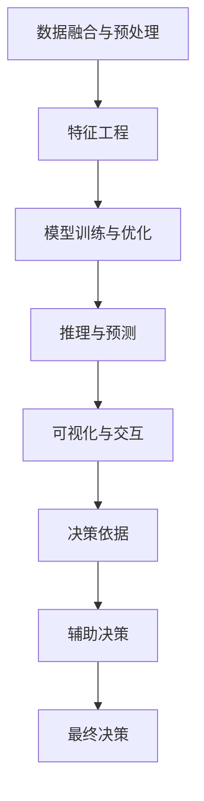

                 

# AI辅助决策系统：增强人类判断

## 1. 背景介绍

### 1.1 问题由来
在信息化和数字化的浪潮下，人类社会的决策机制正面临着前所未有的挑战。信息过载、数据复杂、分析难度加大等问题，使得传统的人为决策模式已难以为继。人工智能（AI）技术的兴起，为辅助人类决策提供了新的路径。通过AI技术对海量数据进行深度分析和理解，生成可视化的决策支持工具，能够显著增强人类的判断力和决策效率。

AI辅助决策系统（AI-based Decision Support System, AI-DSS）通过机器学习和自然语言处理（NLP）等技术，帮助人们从数据中提取关键信息、识别模式、预测趋势，最终辅助人类做出更为明智的决策。目前，AI-DSS在医疗、金融、法律、政府等多个领域中已开始得到应用，显示出巨大的潜力。

### 1.2 问题核心关键点
AI-DSS的核心在于将人工智能技术与人类决策过程相结合，构建出智能化的决策支持工具。其核心原理和关键点包括：
- **数据融合与分析**：从多源异构数据中提取关键信息，生成全面且准确的决策依据。
- **智能推理与预测**：利用机器学习模型对复杂问题进行智能推理和预测，提供决策参考。
- **可视化与交互**：通过直观的可视化界面，辅助决策者理解和应用AI模型输出结果，优化决策过程。
- **多模态融合**：融合文本、图像、视频等多种模态数据，提升决策系统的感知能力和理解深度。
- **透明度与可解释性**：确保AI决策过程透明，提供决策依据的可解释性，增强用户信任。
- **隐私与安全**：保护决策过程中的数据隐私和安全，避免数据泄露和滥用。

这些关键点共同构成了AI-DSS的核心技术框架，为其在实际应用中的有效性奠定了基础。

## 2. 核心概念与联系

### 2.1 核心概念概述

为更好地理解AI-DSS的核心工作原理和架构，本节将介绍几个密切相关的核心概念：

- **决策支持系统（Decision Support System, DSS）**：通过提供定量和定性信息，辅助决策者进行决策。DSS通常包括数据获取、数据分析、模型建立、结果呈现等多个模块。
- **智能决策支持系统（AI-DSS）**：基于人工智能技术的决策支持系统。通过机器学习、NLP、知识图谱等技术，增强DSS的智能水平。
- **数据融合与预处理**：将来自不同源的数据进行融合和预处理，生成统一的决策依据。
- **特征工程**：从原始数据中提取和构造出对决策有用的特征。
- **模型训练与优化**：利用机器学习算法训练模型，并在实际应用中进行参数优化。
- **推理与预测**：利用训练好的模型对未知数据进行推理和预测，生成决策依据。
- **可视化与交互**：将复杂的结果以直观的图形形式呈现，辅助决策者理解和应用结果。

这些核心概念之间的逻辑关系可以通过以下Mermaid流程图来展示：



这个流程图展示了一系列关键步骤，描述了AI-DSS从数据输入到最终决策输出的全过程：

1. **数据融合与预处理**：将异构数据进行清洗和整合，为后续分析打下基础。
2. **特征工程**：提取和构造关键特征，提升模型性能。
3. **模型训练与优化**：利用机器学习算法对模型进行训练和优化，提升模型的准确性和泛化能力。
4. **推理与预测**：利用训练好的模型对新数据进行推理和预测，生成决策依据。
5. **可视化与交互**：将推理结果以直观的图形形式呈现，辅助决策者理解和应用。
6. **决策依据**：将模型输出转化为可供人类决策者参考的信息。
7. **辅助决策**：通过综合考虑多种决策依据，辅助决策者做出更为明智的决策。
8. **最终决策**：决策者根据辅助决策和自身经验做出最终决策。

## 3. 核心算法原理 & 具体操作步骤
### 3.1 算法原理概述

AI-DSS的核心算法原理基于机器学习和自然语言处理（NLP）技术，旨在从海量数据中提取关键信息，生成决策依据。其核心流程包括数据预处理、特征工程、模型训练、推理预测等步骤。

数据预处理阶段，通过数据清洗、去重、归一化等操作，确保数据的一致性和准确性。特征工程阶段，从原始数据中提取关键特征，如文本中的关键词、句子结构、实体关系等，为模型训练提供输入。模型训练阶段，利用监督学习、无监督学习、强化学习等算法对模型进行训练，优化模型参数。推理预测阶段，利用训练好的模型对新数据进行推理和预测，生成决策依据。

### 3.2 算法步骤详解

AI-DSS的具体操作步骤包括以下几个关键步骤：

**Step 1: 数据预处理**
- 收集来自不同来源的数据，如市场数据、财务报表、社交媒体、新闻等。
- 清洗数据，去除噪声和错误，统一数据格式。
- 进行数据归一化和特征提取，生成模型所需的输入数据。

**Step 2: 特征工程**
- 对文本数据进行分词、去停用词、词干提取等操作。
- 识别文本中的关键实体、关键词、句法结构等，生成特征向量。
- 对图像、视频等非结构化数据进行预处理，提取特征向量。

**Step 3: 模型训练**
- 选择合适的机器学习算法，如决策树、随机森林、深度学习模型等。
- 使用训练集数据训练模型，调整模型参数，优化模型性能。
- 在验证集上评估模型性能，选择最优模型。

**Step 4: 推理预测**
- 将新数据输入训练好的模型，进行推理和预测。
- 生成模型输出，如分类结果、预测概率、趋势分析等。
- 将模型输出转化为可视化结果，辅助决策者理解和应用。

**Step 5: 决策依据生成**
- 综合考虑模型输出、领域知识、专家经验等因素，生成综合决策依据。
- 通过交互界面，将决策依据呈现给决策者。
- 辅助决策者做出最终决策，并记录决策过程和结果。

### 3.3 算法优缺点

AI-DSS的主要优点包括：
- **高效性**：通过自动化数据分析和模型推理，显著提升决策效率。
- **准确性**：利用机器学习和大数据分析，生成更为准确的决策依据。
- **灵活性**：支持多种数据类型和决策场景，易于定制和扩展。
- **可解释性**：利用可解释性模型和可视化界面，增强决策依据的可理解性。

其缺点主要包括：
- **依赖数据质量**：数据质量会直接影响模型性能和决策结果，对数据清洗和预处理要求较高。
- **模型过拟合**：在训练过程中可能出现过拟合问题，需要采用正则化等技术进行缓解。
- **高成本**：模型训练和推理可能需要较高的计算资源和存储成本。
- **隐私与安全**：数据隐私和安全问题需要得到充分考虑和保护。

尽管存在这些局限性，但AI-DSS通过其高效的决策支持和准确的分析能力，在多个领域中已展现出显著优势，成为辅助决策的重要工具。

### 3.4 算法应用领域

AI-DSS的应用领域非常广泛，以下是几个典型的应用场景：

- **医疗健康**：辅助医生进行诊断和治疗决策，提高诊疗效率和准确性。
- **金融投资**：利用历史数据和市场动态，辅助投资者进行投资决策和风险管理。
- **法律咨询**：通过分析案例和法规，辅助律师进行案件分析和法律咨询。
- **政府决策**：利用大数据分析，辅助政府进行公共政策制定和资源调配。
- **企业管理**：通过分析市场和内部数据，辅助企业进行战略规划和运营决策。
- **智能家居**：利用智能设备和传感器数据，辅助家庭决策，提高生活质量。

随着AI技术的不断发展，AI-DSS将在更多领域得到应用，为各行各业带来新的变革和机遇。

## 4. 数学模型和公式 & 详细讲解 & 举例说明

### 4.1 数学模型构建

AI-DSS的数学模型构建通常包括数据预处理、特征工程、模型训练和推理预测等步骤。以下是几个核心模型的数学表达：

**线性回归模型**
$$
y = \beta_0 + \beta_1 x_1 + \beta_2 x_2 + \cdots + \beta_n x_n + \epsilon
$$

**决策树模型**
$$
D(t) = 
\begin{cases}
    y & \text{if} \quad \text{node} = \text{leaf} \\
    D(t_1) & \text{if} \quad x_1 \leq t_1 \\
    D(t_2) & \text{if} \quad x_1 > t_1
\end{cases}
$$

**随机森林模型**
$$
\hat{y} = \frac{1}{M} \sum_{m=1}^{M} \hat{y}_m
$$

**深度学习模型**
$$
\hat{y} = f_\theta(x)
$$

其中，$\beta_i$ 为回归模型系数，$x_i$ 为自变量，$y$ 为因变量，$\epsilon$ 为误差项；$t_1, t_2$ 为决策树划分点；$M$ 为随机森林的决策树数量；$f_\theta(x)$ 为深度学习模型，$\theta$ 为模型参数。

### 4.2 公式推导过程

**线性回归模型推导**
线性回归模型的最小二乘法求解公式为：
$$
\hat{\beta} = (X^T X)^{-1} X^T y
$$
其中，$\hat{\beta}$ 为回归系数的最小二乘解，$X$ 为自变量矩阵，$y$ 为因变量向量。

**决策树模型推导**
决策树模型基于信息增益或基尼指数等指标选择最优划分点，递归构建决策树。

**随机森林模型推导**
随机森林模型通过多棵决策树的投票，得到最终的预测结果，减少了单棵树的过拟合风险。

**深度学习模型推导**
深度学习模型的前向传播和反向传播算法为：
$$
\hat{y} = f_\theta(x) = \sigma(\text{softmax}(W^H z + b^H)) = \sigma(\text{softmax}(W^H (Wh x + bh) + b^H))
$$
$$
\nabla_{\theta} L = \frac{\partial L}{\partial \hat{y}} \cdot \frac{\partial \hat{y}}{\partial z} \cdot \frac{\partial z}{\partial \theta}
$$

其中，$f_\theta(x)$ 为模型输出，$\sigma$ 为激活函数，$W$ 为权重矩阵，$h$ 为隐藏层向量，$z$ 为输入向量和权重矩阵的乘积，$b$ 为偏置向量，$L$ 为损失函数。

### 4.3 案例分析与讲解

**案例分析：金融风险评估**

在金融领域，风险评估是一个重要任务。通过分析历史交易数据、市场动态等，辅助投资经理评估投资组合的风险和收益。

具体而言，可以构建一个基于线性回归的金融风险评估模型：
- 收集历史交易数据和市场动态数据，进行数据预处理和特征提取。
- 构建线性回归模型，训练模型参数。
- 利用训练好的模型对新数据进行预测，生成风险评估结果。

通过可视化界面，将风险评估结果呈现给投资经理，辅助其做出更为明智的投资决策。

## 5. 项目实践：代码实例和详细解释说明

### 5.1 开发环境搭建

在进行AI-DSS项目实践前，我们需要准备好开发环境。以下是使用Python进行TensorFlow开发的环境配置流程：

1. 安装Anaconda：从官网下载并安装Anaconda，用于创建独立的Python环境。

2. 创建并激活虚拟环境：
```bash
conda create -n tf-env python=3.8 
conda activate tf-env
```

3. 安装TensorFlow：根据CUDA版本，从官网获取对应的安装命令。例如：
```bash
conda install tensorflow==2.6 -c conda-forge -c pypi
```

4. 安装TensorBoard：
```bash
pip install tensorboard
```

5. 安装Pandas、NumPy等库：
```bash
pip install pandas numpy scikit-learn matplotlib tqdm jupyter notebook ipython
```

完成上述步骤后，即可在`tf-env`环境中开始AI-DSS实践。

### 5.2 源代码详细实现

这里我们以金融风险评估为例，给出使用TensorFlow进行AI-DSS的Python代码实现。

首先，定义数据预处理函数：

```python
import pandas as pd
from sklearn.model_selection import train_test_split

def load_data(path):
    df = pd.read_csv(path)
    X = df.drop('y', axis=1)
    y = df['y']
    return X, y

X_train, X_test, y_train, y_test = train_test_split(X, y, test_size=0.2, random_state=42)
```

然后，定义特征工程函数：

```python
from sklearn.preprocessing import StandardScaler
from sklearn.compose import ColumnTransformer
from sklearn.pipeline import Pipeline

def feature_engineering(X, y):
    numeric_features = X.select_dtypes(include=['int64', 'float64']).columns
    categorical_features = X.select_dtypes(include=['object']).columns

    numeric_transformer = Pipeline(steps=[
        ('scaler', StandardScaler())
    ])

    preprocessor = ColumnTransformer(
        transformers=[
            ('num', numeric_transformer, numeric_features),
            ('cat', OneHotEncoder(), categorical_features)
        ])

    return preprocessor.fit_transform(X)
```

接着，定义模型训练函数：

```python
from tensorflow.keras.models import Sequential
from tensorflow.keras.layers import Dense, Dropout
from tensorflow.keras.callbacks import EarlyStopping

def train_model(X_train, y_train, epochs=10, batch_size=32, validation_split=0.2):
    model = Sequential()
    model.add(Dense(64, activation='relu', input_shape=(X_train.shape[1],)))
    model.add(Dropout(0.2))
    model.add(Dense(32, activation='relu'))
    model.add(Dense(1, activation='sigmoid'))

    model.compile(optimizer='adam', loss='binary_crossentropy', metrics=['accuracy'])
    early_stopping = EarlyStopping(monitor='val_loss', patience=3)
    history = model.fit(X_train, y_train, epochs=epochs, batch_size=batch_size, validation_split=validation_split, callbacks=[early_stopping])
    return model, history
```

最后，定义推理预测函数：

```python
def predict(model, X_test):
    y_pred = model.predict(X_test)
    return y_pred
```

结合以上函数，完成完整的AI-DSS实现：

```python
X_train, y_train = load_data('train.csv')
X_test, y_test = load_data('test.csv')

X_train_preprocessed = feature_engineering(X_train, y_train)
X_test_preprocessed = feature_engineering(X_test, y_test)

model, history = train_model(X_train_preprocessed, y_train)
y_pred = predict(model, X_test_preprocessed)
```

以上就是使用TensorFlow对金融风险评估任务进行AI-DSS的完整代码实现。可以看到，通过TensorFlow的高级API，可以轻松构建和训练线性回归模型，实现金融风险评估的AI-DSS。

### 5.3 代码解读与分析

让我们再详细解读一下关键代码的实现细节：

**load_data函数**：
- 从CSV文件中加载数据，并将数据分为特征和标签。
- 使用train_test_split函数将数据划分为训练集和测试集。

**feature_engineering函数**：
- 选择数值型和分类型特征。
- 对数值型特征进行标准化处理。
- 对分类型特征进行独热编码。
- 使用ColumnTransformer将数值型和分类型特征合并为一个数据框。

**train_model函数**：
- 定义线性回归模型，包含一个隐藏层和一个输出层。
- 使用Adam优化器和二元交叉熵损失函数。
- 使用EarlyStopping回调函数，防止过拟合。
- 使用fit函数训练模型，并返回模型和训练历史。

**predict函数**：
- 使用训练好的模型对测试集进行预测，生成二元分类结果。

可以看到，TensorFlow提供了简单易用的API，可以快速搭建和训练AI-DSS模型。同时，TensorBoard等工具也提供了丰富的可视化功能，方便我们监控模型训练和性能评估。

## 6. 实际应用场景

### 6.1 智能客服系统

在智能客服系统中，AI-DSS可以通过分析客户的历史咨询记录和问题类型，辅助客服人员快速定位问题并提供解决方案。通过将问题进行自然语言处理和文本分类，AI-DSS可以快速将问题分类，并推荐相应的解决方案，从而显著提升客服效率和客户满意度。

具体而言，可以构建一个基于NLP的智能客服系统：
- 收集历史客服咨询记录，提取文本特征。
- 构建分类模型，训练模型参数。
- 利用训练好的模型对新咨询进行分类，推荐解决方案。
- 通过可视化界面，将解决方案呈现给客服人员，辅助决策。

通过智能客服系统，能够大大减轻客服人员的工作负担，提高客户服务质量。

### 6.2 金融舆情监测

在金融领域，舆情监测是一个重要任务。通过分析社交媒体、新闻、论坛等数据，辅助投资者进行风险评估和市场分析。

具体而言，可以构建一个基于情感分析的金融舆情监测系统：
- 收集金融领域相关的新闻、评论、社交媒体等数据。
- 进行数据预处理和特征提取。
- 构建情感分析模型，训练模型参数。
- 利用训练好的模型对新数据进行情感分析，生成舆情评估结果。

通过可视化界面，将舆情评估结果呈现给投资者，辅助其进行投资决策和风险管理。

### 6.3 医疗诊断系统

在医疗领域，AI-DSS可以通过分析患者的历史病历、症状等数据，辅助医生进行疾病诊断和治疗决策。通过将症状进行自然语言处理和文本分类，AI-DSS可以快速诊断疾病，并推荐治疗方案，从而提高诊疗效率和准确性。

具体而言，可以构建一个基于自然语言处理的医疗诊断系统：
- 收集患者的历史病历和症状数据。
- 进行数据预处理和特征提取。
- 构建分类模型，训练模型参数。
- 利用训练好的模型对新病历进行诊断，推荐治疗方案。

通过医疗诊断系统，能够大大减轻医生的工作负担，提高诊断准确性。

## 7. 工具和资源推荐

### 7.1 学习资源推荐

为了帮助开发者系统掌握AI-DSS的理论基础和实践技巧，这里推荐一些优质的学习资源：

1. TensorFlow官方文档：提供了详细的API文档和教程，适合初学者入门。
2. Keras官方文档：提供了简单易用的API，适合快速搭建和训练AI-DSS模型。
3. Scikit-learn官方文档：提供了丰富的数据处理和模型训练工具，适合深度学习和自然语言处理任务。
4. TensorBoard：提供了模型训练的实时监控和可视化功能，适合调试和优化模型。
5. PyTorch官方文档：提供了灵活的动态计算图，适合深度学习和自然语言处理任务。

通过对这些资源的学习实践，相信你一定能够快速掌握AI-DSS的核心技术和实现方法，并用于解决实际的NLP问题。

### 7.2 开发工具推荐

高效的开发离不开优秀的工具支持。以下是几款用于AI-DSS开发的常用工具：

1. TensorFlow：由Google主导开发的开源深度学习框架，生产部署方便，适合大规模工程应用。
2. Keras：基于TensorFlow等深度学习框架的高级API，适合快速搭建和训练AI-DSS模型。
3. Scikit-learn：开源的机器学习库，提供了丰富的数据处理和模型训练工具。
4. TensorBoard：提供了模型训练的实时监控和可视化功能，适合调试和优化模型。
5. PyTorch：由Facebook主导开发的深度学习框架，灵活的动态计算图，适合深度学习和自然语言处理任务。
6. Jupyter Notebook：提供了交互式的开发环境，支持Python和R等多种编程语言。

合理利用这些工具，可以显著提升AI-DSS的开发效率，加快创新迭代的步伐。

### 7.3 相关论文推荐

AI-DSS的研究源于学界的持续研究。以下是几篇奠基性的相关论文，推荐阅读：

1. 《Deep Learning for Decision Support》：介绍深度学习在决策支持中的应用，涵盖数据预处理、特征工程、模型训练等关键环节。
2. 《Support Vector Machines for Decision Support》：介绍支持向量机在决策支持中的应用，涵盖模型训练、推理预测等关键环节。
3. 《Decision Support Systems Using Artificial Intelligence》：介绍AI技术在决策支持中的应用，涵盖数据融合、智能推理、可视化等关键环节。
4. 《The Influence of Big Data on Decision Making》：介绍大数据在决策支持中的应用，涵盖数据预处理、特征工程、模型训练等关键环节。
5. 《Machine Learning and Data Mining for Decision Support》：介绍机器学习和数据挖掘在决策支持中的应用，涵盖模型训练、推理预测等关键环节。

这些论文代表了大数据和人工智能技术在决策支持领域的发展脉络。通过学习这些前沿成果，可以帮助研究者把握学科前进方向，激发更多的创新灵感。

## 8. 总结：未来发展趋势与挑战

### 8.1 总结

本文对AI-DSS的基本原理和实现方法进行了全面系统的介绍。首先阐述了AI-DSS的背景和意义，明确了其在数据融合、智能推理、可视化等关键环节的核心技术。其次，从原理到实践，详细讲解了AI-DSS的数学模型和操作步骤，给出了完整的代码实例。同时，本文还广泛探讨了AI-DSS在智能客服、金融舆情、医疗诊断等多个领域的应用前景，展示了AI-DSS的巨大潜力。此外，本文精选了AI-DSS的学习资源和开发工具，力求为读者提供全方位的技术指引。

通过本文的系统梳理，可以看到，AI-DSS作为人工智能技术的重要应用，在辅助决策方面展示了巨大的价值和潜力。它通过自动化数据分析和智能推理，显著提升了决策的效率和准确性，为各行各业带来了新的变革和机遇。

### 8.2 未来发展趋势

展望未来，AI-DSS技术将呈现以下几个发展趋势：

1. **模型集成与融合**：随着AI-DSS在各个领域的应用，未来模型将更加集成和融合。基于多模态数据的AI-DSS，将融合文本、图像、视频等多种信息，提升决策系统的感知能力和理解深度。

2. **自动化与智能化**：AI-DSS将逐渐向自动化和智能化方向发展。未来的AI-DSS将更加智能，能够自主学习、自主优化，并根据新数据和新知识进行自我调整。

3. **实时性与高效率**：为了满足实时决策的需求，未来的AI-DSS将更加高效，能够在短时间内处理大量数据，并快速生成决策依据。

4. **可解释性与透明性**：随着AI-DSS在各个领域的应用，模型可解释性将成为重要考量。未来的AI-DSS将更加透明，能够提供决策依据的可解释性，增强用户信任。

5. **隐私与安全**：数据隐私和安全问题将得到更多重视。未来的AI-DSS将具备强大的隐私保护能力，确保数据和模型安全。

6. **跨领域应用**：未来的AI-DSS将跨越多领域，形成更加全面和系统的决策支持系统。

这些趋势将推动AI-DSS技术向更加智能化、普适化方向发展，为各行各业带来新的变革和机遇。

### 8.3 面临的挑战

尽管AI-DSS技术取得了显著进展，但在实际应用中仍面临诸多挑战：

1. **数据质量与多样性**：高质量、多样化的数据是AI-DSS的基础。如何获取和处理海量、多源异构数据，将是未来的一大挑战。

2. **模型复杂性与可解释性**：深度学习模型通常具有复杂的结构，难以解释。如何构建可解释性强的模型，增强决策依据的透明度，将是未来的一大挑战。

3. **实时性与计算资源**：AI-DSS需要处理大量数据，并实时生成决策依据。如何优化模型结构，提高计算效率，将是未来的一大挑战。

4. **隐私与安全**：数据隐私和安全问题将越来越重要。如何保护数据隐私，防止数据泄露和滥用，将是未来的一大挑战。

5. **用户接受度**：AI-DSS的广泛应用需要用户高度信任和接受。如何设计友好的用户体验，增强用户对AI-DSS的信任和依赖，将是未来的一大挑战。

6. **跨领域应用**：AI-DSS在不同领域的应用将面临差异化的需求和挑战。如何设计通用的AI-DSS框架，适应不同领域的需求，将是未来的一大挑战。

这些挑战将伴随着AI-DSS技术的不断演进和发展，需要学界和产业界共同努力，不断攻克。

### 8.4 研究展望

面对AI-DSS技术面临的诸多挑战，未来的研究需要在以下几个方面寻求新的突破：

1. **自动化数据预处理**：研究自动化数据清洗、去重、归一化等预处理技术，提高数据质量和多样性。

2. **可解释性模型设计**：研究可解释性强的模型架构和算法，增强决策依据的透明度和可信度。

3. **高效计算与优化**：研究高效计算技术，如梯度积累、混合精度训练等，提高模型的实时性和计算效率。

4. **隐私保护技术**：研究数据隐私保护技术，如差分隐私、联邦学习等，确保数据和模型的安全。

5. **用户友好设计**：研究友好的用户界面和交互设计，增强用户对AI-DSS的信任和依赖。

6. **跨领域应用研究**：研究通用的AI-DSS框架，适应不同领域的应用需求，提升AI-DSS的普适性和可扩展性。

这些研究方向的探索，必将引领AI-DSS技术迈向更高的台阶，为各行各业带来新的变革和机遇。面向未来，AI-DSS技术需要与其他人工智能技术进行更深入的融合，如知识表示、因果推理、强化学习等，多路径协同发力，共同推动自然语言理解和智能交互系统的进步。只有勇于创新、敢于突破，才能不断拓展AI-DSS的边界，让智能技术更好地造福人类社会。

## 9. 附录：常见问题与解答

**Q1：AI-DSS是否适用于所有决策场景？**

A: AI-DSS在许多决策场景中都能提供显著的辅助效果，特别是对于数据量大、决策复杂的问题。但对于一些需要高度人性化决策的场景，如个人健康、法律咨询等，AI-DSS可能难以完全替代人工决策。因此，AI-DSS更适合作为辅助工具，结合人工决策共同使用。

**Q2：如何评估AI-DSS的性能？**

A: 评估AI-DSS的性能通常需要考虑多个指标，如准确率、召回率、F1分数、AUC等。具体评估方法因任务类型而异。对于分类任务，通常使用混淆矩阵、ROC曲线等方法评估；对于回归任务，则使用均方误差、R方等指标评估。

**Q3：AI-DSS如何与人工决策结合？**

A: AI-DSS通常作为辅助工具，帮助决策者进行数据分析和推理，提供决策依据。具体结合方式包括：
1. 提供可视化界面，展示模型输出和推理过程。
2. 通过交互界面，让决策者能够自定义输入，生成个性化的决策依据。
3. 结合领域专家的经验，综合AI-DSS的输出，进行人工决策。

通过与人工决策结合，AI-DSS能够充分发挥其优势，提升决策的全面性和可信度。

**Q4：AI-DSS在开发过程中需要注意哪些问题？**

A: 在开发AI-DSS过程中，需要注意以下问题：
1. 数据质量：确保数据的高质量，避免噪声和错误。
2. 模型选择：根据任务类型选择合适的模型，如决策树、深度学习等。
3. 特征工程：从原始数据中提取关键特征，提升模型性能。
4. 模型训练：选择合适的优化算法和超参数，避免过拟合。
5. 模型评估：通过交叉验证等方法，评估模型的性能和泛化能力。
6. 部署优化：考虑计算资源和计算效率，优化模型结构。
7. 隐私保护：确保数据隐私和安全，避免数据泄露和滥用。

只有从数据、模型、训练、推理、部署等多个维度全面考虑，才能构建高效、可靠的AI-DSS。

**Q5：AI-DSS在实际应用中如何更新和维护？**

A: AI-DSS的更新和维护需要定期进行，以应对数据分布的变化和模型的退化。具体方法包括：
1. 数据更新：定期收集和处理新的数据，更新训练集和测试集。
2. 模型优化：根据新数据和新任务，优化模型参数，重新训练模型。
3. 模型评估：通过测试集和验证集，评估模型性能，确保模型质量。
4. 部署优化：优化模型结构和计算效率，提升AI-DSS的实时性和计算效率。
5. 用户反馈：收集用户反馈，优化用户体验和交互界面。

通过持续更新和维护，AI-DSS能够保持其性能和可靠性，持续发挥辅助决策的作用。

---

作者：禅与计算机程序设计艺术 / Zen and the Art of Computer Programming

