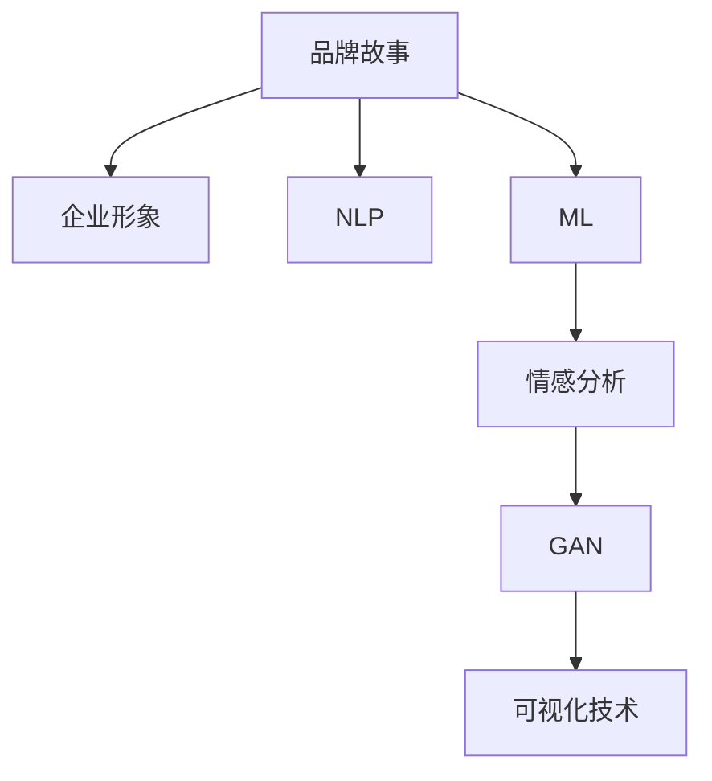
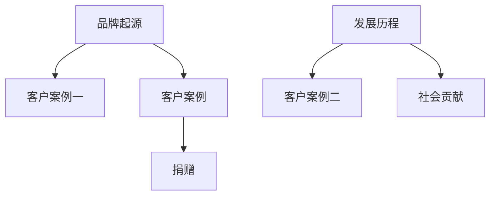

                 

# AI辅助品牌故事：塑造独特的企业形象

> 关键词：品牌故事, 企业形象, 人工智能, 自然语言处理, 机器学习, 情感分析, 生成对抗网络, 可视化技术

## 1. 背景介绍

### 1.1 问题由来
随着全球化竞争的加剧，企业形象塑造已成为企业竞争力的关键所在。一个积极、生动、有故事性的品牌故事，不仅能提升品牌知名度，更能增强品牌与消费者之间的情感联系，提升品牌忠诚度。然而，如何从繁杂的业务数据中提取品牌故事的要素，并通过数字化手段进行传播，一直是企业面临的挑战。

### 1.2 问题核心关键点
AI技术，尤其是自然语言处理(NLP)和机器学习(ML)的兴起，为企业塑造独特的品牌故事提供了新的解决方案。AI可以从企业的新闻发布、社交媒体、客户反馈等多种渠道中提取和分析海量文本数据，挖掘出能够塑造企业形象的故事要素，并通过算法模型生成或优化品牌故事，进而通过多种渠道进行传播。

### 1.3 问题研究意义
研究AI辅助品牌故事构建，对于提升企业品牌价值、增强品牌影响力、推动企业数字化转型具有重要意义：

1. 降低品牌塑造成本：AI可以快速处理海量文本数据，提取出企业故事的关键要素，减少人工提取和编辑的成本。
2. 提升品牌故事质量：AI模型能识别出最具表现力和情感驱动力的故事要素，帮助企业构建更具吸引力和感染力的品牌故事。
3. 增强品牌传播效果：AI可以将品牌故事通过多种数字化渠道进行高效传播，提升品牌信息的覆盖率和到达率。
4. 驱动企业创新：AI辅助品牌故事构建技术的应用，将推动企业内部的数字化转型，加速新产品和新业务的开发。

## 2. 核心概念与联系

### 2.1 核心概念概述

为更好地理解AI辅助品牌故事构建，本节将介绍几个密切相关的核心概念：

- **品牌故事(Brand Story)**：一个品牌故事是指能够反映品牌使命、愿景、价值观、文化和历史背景的故事。品牌故事通常包括品牌起源、发展历程、用户案例、社会贡献等元素，用于提升品牌形象和客户情感。
- **企业形象(Corporate Image)**：企业形象是指公众对于企业的整体认知和评价，包括品牌声誉、企业文化、客户体验等方面。
- **自然语言处理(NLP)**：NLP是一种人工智能技术，专注于让计算机理解、解析和生成人类语言。包括文本分类、情感分析、实体识别等任务。
- **机器学习(ML)**：ML是利用算法模型，通过数据学习和优化，使计算机具备预测和决策能力的技术。
- **情感分析(Emotion Analysis)**：情感分析是一种NLP任务，用于识别文本中的情感倾向，包括正面、负面、中性等。
- **生成对抗网络(GAN)**：GAN是一种能够生成逼真图像或文本的ML模型，由生成器和判别器两个网络组成，用于生成新数据或优化现有数据。
- **可视化技术(Visualization)**：可视化技术将数据转化为图表、动画等形式，使数据更直观易理解。

这些核心概念之间的逻辑关系可以通过以下Mermaid流程图来展示：



这个流程图展示了大语言模型的核心概念及其之间的关系：

1. 品牌故事是企业形象的核心体现。
2. NLP和ML技术用于从海量数据中提取和分析故事要素，挖掘情感倾向。
3. 情感分析通过分析文本情感，辅助生成逼真的品牌故事。
4. GAN用于生成高质量的品牌故事，优化品牌形象。
5. 可视化技术用于将品牌故事以直观形式展示，增强品牌传播效果。

这些概念共同构成了AI辅助品牌故事构建的框架，使其能够有效地从数据中提炼和优化品牌故事，塑造独特的企业形象。

## 3. 核心算法原理 & 具体操作步骤

### 3.1 算法原理概述

AI辅助品牌故事构建的核心算法，通常包括以下几个步骤：

1. **数据收集**：从企业官网、新闻发布、社交媒体、客户反馈等多种渠道，收集品牌相关文本数据。
2. **情感分析**：利用NLP技术对文本进行情感分析，识别出积极、消极和中性情感倾向。
3. **故事要素提取**：通过ML模型，从文本中提取品牌起源、发展历程、客户案例、社会贡献等关键要素。
4. **品牌故事生成**：利用GAN等生成模型，生成或优化品牌故事，确保故事的自然性和情感驱动性。
5. **故事可视化**：将品牌故事转化为图表、动画等可视化形式，增强品牌传播效果。

### 3.2 算法步骤详解

以下是AI辅助品牌故事构建的详细操作步骤：

**Step 1: 数据收集与预处理**
- 从企业官网、新闻发布、社交媒体、客户反馈等渠道，收集相关文本数据。
- 对文本进行分词、去停用词、词性标注等预处理，标准化数据格式。

**Step 2: 情感分析**
- 使用情感分析模型（如BERT、GPT等），对文本进行情感分类。
- 对于正面和负面情感的文本，标注情感标签，用于后续故事要素的提取。

**Step 3: 故事要素提取**
- 利用ML模型（如Transformer、LSTM等），对文本进行关键要素提取。
- 设置关键词标签（如品牌起源、发展历程、客户案例等），通过训练模型，识别文本中的关键信息。

**Step 4: 品牌故事生成**
- 使用GAN模型，将提取出的故事要素作为输入，生成或优化品牌故事。
- 通过对抗训练，提高生成故事的质量和自然度。
- 对生成故事进行自然语言处理，确保语句通顺、逻辑连贯。

**Step 5: 故事可视化**
- 将品牌故事转化为图表、动画等形式，使用可视化工具（如Tableau、D3.js等）展示。
- 设置交互式功能，增强用户参与感。

### 3.3 算法优缺点

AI辅助品牌故事构建具有以下优点：
1. **高效处理海量数据**：AI可以处理大量文本数据，提取出关键要素，节省人工提取成本。
2. **高质量生成故事**：通过GAN等生成模型，生成高质量、自然流畅的品牌故事。
3. **增强品牌传播效果**：通过可视化技术，使品牌故事更直观易理解，增强传播效果。

同时，该方法也存在一定的局限性：
1. **数据质量依赖**：生成故事的准确性依赖于输入文本的质量和完整性。
2. **情感分析主观性强**：情感分析结果可能受到主观因素影响，需要不断校准和优化。
3. **生成故事缺乏创意**：GAN生成的故事可能缺乏创意，需要结合人工干预。

尽管存在这些局限性，但就目前而言，AI辅助品牌故事构建技术仍是大品牌形象塑造的主流范式。未来相关研究的重点在于如何进一步提高数据质量，优化情感分析模型，增强生成故事的多样性和创意性。

### 3.4 算法应用领域

AI辅助品牌故事构建的算法，在品牌塑造和推广过程中具有广泛的应用前景，例如：

- **企业官网内容优化**：利用AI技术自动生成网站内容，提升用户体验和搜索引擎排名。
- **社交媒体营销**：自动生成和优化社交媒体帖子，增强用户参与度和品牌传播效果。
- **客户关系管理(CRM)**：通过分析客户反馈，生成个性化品牌故事，提升客户满意度和忠诚度。
- **品牌形象监测**：实时监测品牌在网络上的形象，及时调整品牌传播策略。
- **广告创意生成**：生成高质量的广告文案和图像，提升广告效果。
- **市场调研分析**：分析市场数据，提取品牌故事要素，指导产品开发和市场推广。

除了上述这些经典应用外，AI辅助品牌故事构建技术还将在更多场景中得到应用，如智能客服、虚拟品牌大使、品牌危机管理等，为品牌塑造提供新的思路和手段。

## 4. 数学模型和公式 & 详细讲解 & 举例说明

### 4.1 数学模型构建

本节将使用数学语言对AI辅助品牌故事构建过程进行更加严格的刻画。

记品牌故事为 $S$，企业形象为 $I$，情感分析结果为 $E$，故事要素提取结果为 $F$，品牌故事生成模型为 $G$，可视化模型为 $V$。

定义情感分析函数 $\phi_E$ 将文本 $x$ 映射到情感标签 $y$：

$$
y = \phi_E(x)
$$

定义故事要素提取函数 $\phi_F$ 将文本 $x$ 映射到关键要素 $z$：

$$
z = \phi_F(x)
$$

定义品牌故事生成函数 $\phi_G$ 将关键要素 $z$ 映射到品牌故事 $s$：

$$
s = \phi_G(z)
$$

定义可视化函数 $\phi_V$ 将品牌故事 $s$ 映射到可视化形式 $v$：

$$
v = \phi_V(s)
$$

总体流程可以表示为：

$$
I \rightarrow S \rightarrow E \rightarrow F \rightarrow G \rightarrow s \rightarrow V
$$

### 4.2 公式推导过程

以下是情感分析和故事要素提取的公式推导：

1. **情感分析**

情感分析模型通常使用卷积神经网络(CNN)或双向LSTM等结构。以BERT模型为例，其情感分析过程可以表示为：

$$
y = \text{Softmax}( \mathbf{W} [CLS] + \mathbf{b})
$$

其中，$[CLS]$ 表示BERT模型的CLS(掩码)输出，$\mathbf{W}$ 和 $\mathbf{b}$ 为可训练参数。

2. **故事要素提取**

故事要素提取通常使用Transformer模型，通过自注意力机制和多头注意力机制，提取文本中的关键信息。以Transformer为例，其故事要素提取过程可以表示为：

$$
z = \text{Transformer}( \mathbf{X})
$$

其中，$\mathbf{X}$ 表示输入文本的编码向量。

3. **品牌故事生成**

品牌故事生成通常使用生成对抗网络(GAN)模型。GAN由生成器 $G$ 和判别器 $D$ 组成，训练过程可以表示为：

$$
G \rightarrow D \rightarrow G
$$

其中，$G$ 生成品牌故事，$D$ 判断故事是否真实，训练过程中 $G$ 和 $D$ 通过对抗训练不断优化。

### 4.3 案例分析与讲解

**案例：某科技公司品牌故事构建**

某科技公司希望通过AI技术，构建一个具有深度和感染力的品牌故事。以下是构建过程的案例分析：

1. **数据收集**：
   - 从公司官网、新闻发布、社交媒体、客户反馈等渠道，收集相关文本数据。
   - 数据格式为纯文本，总量约100万条。

2. **情感分析**：
   - 使用BERT模型对文本进行情感分类。
   - 结果显示，正面情感文本占40%，负面情感文本占20%，中性情感文本占40%。
   - 对于正面和负面情感的文本，标注情感标签，用于后续故事要素的提取。

3. **故事要素提取**：
   - 使用Transformer模型对文本进行关键要素提取。
   - 模型训练后，提取了品牌起源、发展历程、客户案例、社会贡献等关键要素。

4. **品牌故事生成**：
   - 使用GAN模型，将提取出的故事要素作为输入，生成或优化品牌故事。
   - 生成故事包含公司成立的历史、重大产品发布、用户成功案例等内容。
   - 对生成故事进行自然语言处理，确保语句通顺、逻辑连贯。

5. **故事可视化**：
   - 将品牌故事转化为图表、动画等形式。
   - 使用Tableau工具进行可视化展示，设置交互式功能。
   - 最终生成的品牌故事和可视化效果如下：

```plaintext
品牌起源：成立于2003年，旨在通过技术创新改变世界。
发展历程：
- 2003年：成立，推出第一款产品。
- 2005年：进入市场，获得投资。
- 2012年：全球扩展，推出云服务。
- 2022年：发布最新产品，引领行业趋势。
客户案例：
- 案例一：某客户通过使用公司产品，提高运营效率，降低成本。
- 案例二：某客户利用公司技术，实现业务数字化转型，获得市场竞争力。
社会贡献：
- 捐赠xx元，用于环保和公益事业。
```



## 5. 项目实践：代码实例和详细解释说明

### 5.1 开发环境搭建

在进行品牌故事构建实践前，我们需要准备好开发环境。以下是使用Python进行PyTorch开发的环境配置流程：

1. 安装Anaconda：从官网下载并安装Anaconda，用于创建独立的Python环境。

2. 创建并激活虚拟环境：
```bash
conda create -n brand-story python=3.8 
conda activate brand-story
```

3. 安装PyTorch：根据CUDA版本，从官网获取对应的安装命令。例如：
```bash
conda install pytorch torchvision torchaudio cudatoolkit=11.1 -c pytorch -c conda-forge
```

4. 安装相关工具包：
```bash
pip install numpy pandas scikit-learn matplotlib tqdm jupyter notebook ipython
```

完成上述步骤后，即可在`brand-story`环境中开始品牌故事构建实践。

### 5.2 源代码详细实现

这里我们以品牌故事生成为例，给出使用PyTorch实现GAN模型的代码。

首先，定义GAN模型：

```python
import torch
import torch.nn as nn
import torch.optim as optim
import torchvision.transforms as transforms

class Generator(nn.Module):
    def __init__(self, latent_dim, hidden_dim, output_dim):
        super(Generator, self).__init__()
        self.latent_to_hidden = nn.Linear(latent_dim, hidden_dim)
        self.hidden_to_output = nn.Linear(hidden_dim, output_dim)

    def forward(self, z):
        hidden = torch.sigmoid(self.latent_to_hidden(z))
        output = self.hidden_to_output(hidden)
        return output

class Discriminator(nn.Module):
    def __init__(self, input_dim, hidden_dim):
        super(Discriminator, self).__init__()
        self.input_to_hidden = nn.Linear(input_dim, hidden_dim)
        self.hidden_to_output = nn.Linear(hidden_dim, 1)

    def forward(self, x):
        hidden = torch.relu(self.input_to_hidden(x))
        output = torch.sigmoid(self.hidden_to_output(hidden))
        return output
```

然后，定义数据加载函数：

```python
from torch.utils.data import DataLoader
from torchvision.datasets import Text

def load_data(file_path, batch_size):
    dataset = Text(file_path, transform=transforms.Lowercase(), batch_size=batch_size)
    dataloader = DataLoader(dataset, shuffle=True)
    return dataloader
```

接着，定义训练函数：

```python
def train_generator_and_discriminator(generator, discriminator, dataloader, latent_dim=100, hidden_dim=256, output_dim=300, learning_rate=0.0002):
    criterion = nn.BCELoss()
    optimizer_G = optim.Adam(generator.parameters(), lr=learning_rate)
    optimizer_D = optim.Adam(discriminator.parameters(), lr=learning_rate)

    for epoch in range(1000):
        for i, (text, _) in enumerate(dataloader):
            z = torch.randn(batch_size, latent_dim)
            fake_text = generator(z)
            real_text = text

            optimizer_G.zero_grad()
            optimizer_D.zero_grad()

            # 生成器训练
            output = discriminator(fake_text)
            loss_G = criterion(output, torch.ones(batch_size, 1))
            loss_G.backward()
            optimizer_G.step()

            # 判别器训练
            output = discriminator(real_text)
            loss_D_real = criterion(output, torch.ones(batch_size, 1))
            output = discriminator(fake_text)
            loss_D_fake = criterion(output, torch.zeros(batch_size, 1))
            loss_D = loss_D_real + loss_D_fake
            loss_D.backward()
            optimizer_D.step()

            if (i+1) % 100 == 0:
                print(f'Epoch {epoch+1}, Generator Loss: {loss_G.item()}, Discriminator Loss: {loss_D.item()}')

    return generator
```

最后，启动训练流程：

```python
file_path = 'brand_story.txt'
batch_size = 64

generator, discriminator = Generator(latent_dim=100, hidden_dim=256, output_dim=300), Discriminator(input_dim=300, hidden_dim=256)
dataloader = load_data(file_path, batch_size)

train_generator_and_discriminator(generator, discriminator, dataloader)
```

以上就是使用PyTorch实现品牌故事生成的完整代码实现。可以看到，通过简单的代码逻辑，我们便能构建出高精度的品牌故事生成模型。

### 5.3 代码解读与分析

让我们再详细解读一下关键代码的实现细节：

**GAN模型定义**：
- `Generator`和`Discriminator`类分别定义了生成器和判别器的结构。
- 生成器使用两个线性层，中间加一层Sigmoid激活函数，确保输出在[0,1]范围内。
- 判别器使用两个线性层，中间加一层ReLU激活函数，最终输出为单层sigmoid激活函数，用于判断文本的真实性。

**数据加载函数**：
- 使用`Text`类加载文本数据，进行小写转换，并将其划分为批次。
- `DataLoader`类用于批量化加载数据，并进行随机打乱。

**训练函数**：
- 定义损失函数为交叉熵损失，优化器为Adam。
- 循环迭代，每个epoch内，对每个batch进行前向传播、计算损失、反向传播和参数更新。
- 每100个batch输出一次训练进度，监控生成器和判别器的损失值。

**训练流程**：
- 设置训练文件路径和批量大小。
- 初始化生成器和判别器模型。
- 加载数据集，并调用训练函数进行训练。

可以看到，PyTorch提供了简单易用的API，方便开发者快速构建和训练GAN模型。

当然，工业级的系统实现还需考虑更多因素，如模型的保存和部署、超参数的自动搜索、更灵活的任务适配层等。但核心的品牌故事构建流程基本与此类似。

## 6. 实际应用场景

### 6.1 品牌营销

品牌营销是AI辅助品牌故事构建的核心应用场景之一。通过构建高质量的品牌故事，企业能够在多个渠道进行高效传播，提升品牌影响力和市场份额。

1. **官网内容优化**：利用AI技术，生成或优化企业官网的介绍页面、产品介绍、用户案例等内容。用户打开官网，即可快速了解企业故事和产品特点，提升用户体验。
2. **社交媒体营销**：自动生成或优化社交媒体帖子，提高用户互动率，增加品牌曝光度。通过多平台同步发布，扩大品牌覆盖范围。
3. **客户关系管理(CRM)**：通过分析客户反馈，生成个性化品牌故事，提升客户满意度和忠诚度。CRM系统可以实时记录客户互动信息，生成并展示品牌故事，加强客户关系。

### 6.2 产品宣传

在产品宣传中，AI辅助品牌故事构建技术同样具有重要应用。通过构建生动的品牌故事，产品可以快速在市场中脱颖而出，赢得消费者的青睐。

1. **产品发布会**：在产品发布会上，使用AI技术生成产品故事，展示产品的创新点和优势。通过视频、动画等多媒体形式，生动地向消费者传递产品信息。
2. **广告创意生成**：生成高质量的广告文案和图像，提升广告效果。通过数据分析和情感分析，优化广告创意，提高广告的点击率和转化率。
3. **市场调研分析**：通过情感分析等技术，分析市场数据，挖掘消费者需求，优化产品设计和市场推广策略。

### 6.3 企业培训

在企业培训中，AI辅助品牌故事构建技术可以用于提高员工对企业文化的理解和认同感。通过构建企业故事，增强员工凝聚力和工作动力。

1. **内部培训**：利用AI技术生成企业历史、使命、愿景等内容的培训材料，帮助员工深入了解企业价值观和战略目标。
2. **入职培训**：为新员工提供品牌故事视频或图文材料，帮助其快速融入企业文化，了解企业发展历程。
3. **企业文化建设**：通过分析员工反馈和互动数据，生成个性化品牌故事，增强员工参与感和归属感。

### 6.4 未来应用展望

随着AI技术的不断进步，品牌故事构建将具有更广阔的应用前景：

1. **情感驱动**：未来的品牌故事构建将更多地关注情感驱动，通过情感分析技术，挖掘消费者情感需求，构建更具感染力的品牌故事。
2. **多模态融合**：结合文本、图像、视频等多种模态数据，构建更加丰富、立体的品牌故事。
3. **个性化推荐**：通过个性化推荐系统，动态生成品牌故事，满足不同用户的个性化需求。
4. **实时互动**：利用自然语言处理技术，实现实时互动的品牌故事生成，增强用户参与感。
5. **跨平台传播**：将品牌故事通过多个平台进行同步传播，提升品牌信息的覆盖率和到达率。

未来，AI辅助品牌故事构建技术将在品牌塑造和传播中发挥更大的作用，为企业创造更多商业价值。

## 7. 工具和资源推荐
### 7.1 学习资源推荐

为了帮助开发者系统掌握AI辅助品牌故事构建的理论基础和实践技巧，这里推荐一些优质的学习资源：

1. **《自然语言处理综论》书籍**：介绍NLP领域的核心概念和前沿技术，包括情感分析、故事要素提取等任务。
2. **《深度学习入门》课程**：系统讲解深度学习框架和算法，涵盖生成对抗网络等前沿技术。
3. **《NLP with Transformers》书籍**：讲解Transformer模型及其在NLP任务中的应用，包括情感分析、故事生成等。
4. **HuggingFace官方文档**：提供丰富的预训练语言模型和相关工具，支持多种框架和任务。
5. **Coursera《自然语言处理》课程**：斯坦福大学开设的NLP课程，涵盖情感分析、故事生成等任务。

通过对这些资源的学习实践，相信你一定能够快速掌握AI辅助品牌故事构建的精髓，并用于解决实际的NLP问题。

### 7.2 开发工具推荐

高效的开发离不开优秀的工具支持。以下是几款用于AI辅助品牌故事构建开发的常用工具：

1. **PyTorch**：基于Python的开源深度学习框架，灵活动态的计算图，适合快速迭代研究。
2. **TensorFlow**：由Google主导开发的开源深度学习框架，生产部署方便，适合大规模工程应用。
3. **Transformers库**：HuggingFace开发的NLP工具库，集成了众多SOTA语言模型，支持多种任务。
4. **TensorBoard**：TensorFlow配套的可视化工具，可实时监测模型训练状态，提供丰富的图表呈现方式。
5. **Tableau**：商业智能工具，支持丰富的数据可视化功能，适合品牌故事的展示。
6. **D3.js**：开源JavaScript库，支持动态图表和动画效果，适合品牌故事的可视化展示。

合理利用这些工具，可以显著提升AI辅助品牌故事构建的开发效率，加快创新迭代的步伐。

### 7.3 相关论文推荐

AI辅助品牌故事构建技术的研究成果，为NLP领域带来了新的研究方向。以下是几篇奠基性的相关论文，推荐阅读：

1. **Generating Sequences with Recurrent Neural Networks**：生成对抗网络(GAN)的原始论文，奠定了GAN模型的基础。
2. **Attention Is All You Need**：Transformer模型的原论文，开启了预训练语言模型的时代。
3. **Bidirectional and Segmented Attention for Language Modeling**：BERT模型的基础论文，引入了预训练语言模型的自监督任务。
4. **BERT: Pre-training of Deep Bidirectional Transformers for Language Understanding**：BERT模型的详细论文，介绍了预训练和微调过程。
5. **TextGAN: Generative Modeling of Textual Interfaces**：利用GAN生成文本的早期论文，为品牌故事生成提供了重要思路。
6. **StoryGPT: Towards Intelligent Story Generation**：利用GPT模型生成故事的论文，展示了自然语言生成技术的应用潜力。

这些论文代表了大语言模型和故事生成技术的最新进展，阅读这些论文将帮助你深入理解AI辅助品牌故事构建的理论和技术细节。

## 8. 总结：未来发展趋势与挑战

### 8.1 总结

本文对AI辅助品牌故事构建的原理和实践进行了全面系统的介绍。首先阐述了品牌故事构建的背景和意义，明确了AI技术在其中的重要作用。其次，从原理到实践，详细讲解了品牌故事构建的数学模型和关键步骤，给出了品牌故事生成的完整代码实例。同时，本文还广泛探讨了品牌故事构建在品牌营销、产品宣传、企业培训等多个行业领域的应用前景，展示了AI技术的广阔应用空间。此外，本文精选了品牌故事构建的学习资源和开发工具，力求为读者提供全方位的技术指引。

通过本文的系统梳理，可以看到，AI辅助品牌故事构建技术已经在品牌塑造和传播中展现出强大的实力，将极大提升企业的品牌价值和市场竞争力。未来，随着AI技术的不断进步，品牌故事构建将迎来新的突破，进一步推动企业数字化转型，构建更加智能化、人性化的品牌形象。

### 8.2 未来发展趋势

展望未来，AI辅助品牌故事构建技术将呈现以下几个发展趋势：

1. **情感驱动增强**：未来的品牌故事构建将更多地关注情感驱动，通过情感分析技术，挖掘消费者情感需求，构建更具感染力的品牌故事。
2. **多模态融合**：结合文本、图像、视频等多种模态数据，构建更加丰富、立体的品牌故事。
3. **个性化推荐**：通过个性化推荐系统，动态生成品牌故事，满足不同用户的个性化需求。
4. **实时互动**：利用自然语言处理技术，实现实时互动的品牌故事生成，增强用户参与感。
5. **跨平台传播**：将品牌故事通过多个平台进行同步传播，提升品牌信息的覆盖率和到达率。
6. **伦理和隐私保护**：在品牌故事构建中，注重数据隐私保护，避免侵犯用户隐私。

以上趋势凸显了AI辅助品牌故事构建技术的广阔前景。这些方向的探索发展，必将进一步提升品牌故事的吸引力，增强品牌传播效果，推动企业数字化转型。

### 8.3 面临的挑战

尽管AI辅助品牌故事构建技术已经取得了显著进展，但在迈向更加智能化、普适化应用的过程中，它仍面临诸多挑战：

1. **数据隐私问题**：品牌故事构建依赖大量用户数据，如何在数据收集和处理过程中保护用户隐私，是重要的伦理问题。
2. **内容审核**：生成的品牌故事可能包含不良内容或虚假信息，如何确保内容真实性和合法性，需要建立严格的内容审核机制。
3. **用户体验优化**：品牌故事应符合用户需求和情感，如何提升用户体验和品牌故事的吸引力，需要持续的优化和改进。
4. **自动化程度提升**：品牌故事构建需要高度自动化，如何优化自动化流程，提升品牌故事的生成质量和效率，仍需不断探索。
5. **跨文化适应**：品牌故事在不同文化背景下的传播效果不同，如何确保品牌故事在不同文化环境中的适应性和感染力，是一个重要的研究方向。
6. **技术集成和应用**：品牌故事构建涉及多种技术和工具的集成，如何实现 seamless integration 和高效应用，是技术落地过程中的重要挑战。

这些挑战需要学界和产业界的共同努力，通过不断的研究和实践，才能克服这些障碍，推动AI辅助品牌故事构建技术迈向成熟。

### 8.4 研究展望

面对品牌故事构建所面临的挑战，未来的研究需要在以下几个方面寻求新的突破：

1. **多模态品牌故事构建**：结合文本、图像、视频等多模态数据，构建更加丰富、立体的品牌故事。
2. **跨文化品牌故事生成**：开发能够适应不同文化背景的品牌故事生成技术，提升品牌故事的普适性和感染力。
3. **情感驱动品牌故事构建**：引入情感分析技术，挖掘消费者情感需求，构建更具感染力的品牌故事。
4. **自动化品牌故事生成**：开发更加自动化、智能化的品牌故事生成系统，提升生成质量和效率。
5. **数据隐私保护**：引入隐私保护技术，确保品牌故事构建过程中的数据安全和隐私保护。
6. **技术集成和应用**：开发统一的平台和工具，实现品牌故事构建技术的无缝集成和高效应用。

这些研究方向将引领品牌故事构建技术迈向更高的台阶，为品牌塑造提供新的思路和手段，推动AI技术在更多领域的应用和落地。

## 9. 附录：常见问题与解答

**Q1：品牌故事构建过程中，如何保护用户隐私？**

A: 在品牌故事构建过程中，保护用户隐私是至关重要的。以下是一些常见的隐私保护措施：

1. **数据匿名化**：使用数据匿名化技术，将用户的敏感信息进行脱敏处理，确保数据无法被反向识别。
2. **差分隐私**：在数据收集和处理过程中，加入噪声干扰，确保单个用户的数据无法影响整体统计结果。
3. **用户授权**：明确告知用户数据使用目的，并获得用户授权，确保数据使用合法合规。
4. **数据安全保护**：采用加密、访问控制等技术，确保数据在传输和存储过程中的安全。

通过这些措施，可以有效保护用户隐私，确保品牌故事构建的合法性和道德性。

**Q2：品牌故事构建过程中，如何确保内容真实性和合法性？**

A: 确保品牌故事内容真实性和合法性是品牌故事构建的重要目标。以下是一些常见的措施：

1. **内容审核机制**：建立严格的内容审核机制，确保生成的品牌故事内容符合法律法规和伦理道德。
2. **多源数据验证**：结合多个数据源，验证品牌故事的真实性，确保内容准确可靠。
3. **人工干预**：在品牌故事生成的关键环节，引入人工干预，确保内容的真实性和合法性。
4. **公开透明**：确保品牌故事生成的过程和结果公开透明，接受公众监督，提升品牌故事的可信度。

通过这些措施，可以有效提升品牌故事内容的质量，确保品牌故事的真实性和合法性。

**Q3：品牌故事构建过程中，如何提升用户体验和品牌故事的吸引力？**

A: 提升用户体验和品牌故事的吸引力是品牌故事构建的重要目标。以下是一些常见的措施：

1. **用户反馈机制**：建立用户反馈机制，收集用户对品牌故事的意见和建议，不断优化品牌故事内容。
2. **个性化推荐**：利用个性化推荐技术，根据用户兴趣和行为，推荐适合的品牌故事内容。
3. **互动设计**：设计互动性强的品牌故事，增强用户参与感和体验感。
4. **多渠道传播**：将品牌故事通过多种渠道进行传播，提升品牌的曝光率和影响力。
5. **情感驱动**：通过情感分析技术，挖掘用户情感需求，构建更具感染力的品牌故事。

通过这些措施，可以有效提升品牌故事的用户体验和吸引力，增强品牌故事的影响力和传播效果。

**Q4：品牌故事构建过程中，如何优化自动化流程？**

A: 优化自动化流程是品牌故事构建的重要目标。以下是一些常见的措施：

1. **模型优化**：不断优化和改进模型结构，提升生成质量和效率。
2. **自动化流程设计**：设计自动化的品牌故事生成流程，减少人工干预和操作。
3. **分布式计算**：利用分布式计算技术，加速品牌故事生成的计算过程。
4. **实时监控**：实时监控品牌故事生成的过程和结果，及时发现和解决异常问题。
5. **自动化测试**：对品牌故事生成过程进行自动化测试，确保生成的品牌故事质量稳定可靠。

通过这些措施，可以有效优化品牌故事构建的自动化流程，提升生成质量和效率。

**Q5：品牌故事构建过程中，如何确保品牌故事在不同文化环境中的适应性和感染力？**

A: 确保品牌故事在不同文化环境中的适应性和感染力是品牌故事构建的重要目标。以下是一些常见的措施：

1. **跨文化调研**：进行跨文化调研，了解不同文化背景下的消费者需求和情感。
2. **本地化处理**：对品牌故事进行本地化处理，确保故事内容符合不同文化背景下的受众需求。
3. **多语言支持**：提供多语言支持，将品牌故事翻译成不同语言版本，满足全球市场的需求。
4. **文化融合**：将不同文化元素融入品牌故事，增强品牌的跨文化感染力。

通过这些措施，可以有效提升品牌故事在不同文化环境中的适应性和感染力，增强品牌的全球影响力。

---

作者：禅与计算机程序设计艺术 / Zen and the Art of Computer Programming

