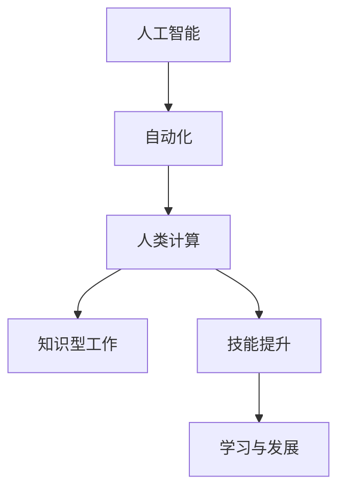

                 

# AI驱动的创新：人类计算在未来的工作

> 关键词：AI驱动, 人类计算, 自动化, 创新, 未来工作, 知识型工作, 技能提升, 学习与发展

## 1. 背景介绍

### 1.1 问题由来
随着人工智能（AI）技术的快速发展和广泛应用，人类工作方式正经历着前所未有的变革。AI不仅在传统的制造业、物流业等领域带来颠覆性影响，也在办公室、教室等知识型工作场景中悄然改变着工作流程和模式。AI驱动的自动化和智能化，让人类从繁琐的重复性任务中解放出来，转而专注于更需要创意、思考和战略规划的高级工作。

### 1.2 问题核心关键点
这一变革的核心在于AI技术如何与人类工作相结合，既发挥其高效、准确的优势，又避免造成失业或人类技能退化的风险。AI驱动的创新不仅改变了工作内容，也对工作技能、就业市场和个人发展路径产生了深远影响。

### 1.3 问题研究意义
研究AI驱动的创新和人类计算的未来工作，对于理解这一变革趋势、规划教育和职业发展、制定有效的政策法规，具有重要的理论和实践意义。本文旨在深入探讨AI技术如何重新定义工作，探讨人类在AI时代应如何提升自我，从而在未来的工作中实现可持续发展。

## 2. 核心概念与联系

### 2.1 核心概念概述

为更好地理解AI驱动的创新对未来工作的影响，本节将介绍几个关键概念及其相互关系：

- **人工智能（AI）**：使用算法、机器学习等技术，使计算机系统能够模拟人类智能行为。
- **自动化**：使用AI技术实现工作流程的自动化和智能化，减少人工干预。
- **人类计算（Human Computation）**：指人类通过思维、推理和创造性工作，与AI系统协同完成复杂任务。
- **知识型工作**：涉及大量信息处理、决策、问题解决等高认知需求的工作类型。
- **技能提升**：通过学习和培训，提升个人在AI时代所需的关键技能，如数据分析、编程、协作等。
- **学习与发展**：终身学习成为必然趋势，个人需要不断更新知识、掌握新技术以适应新工作环境。

这些概念之间的逻辑关系可以通过以下Mermaid流程图来展示：



这个流程图展示了AI驱动的自动化如何与人类计算相辅相成，进而促进知识型工作的创新和发展。

## 3. 核心算法原理 & 具体操作步骤
### 3.1 算法原理概述

AI驱动的创新涉及多个技术环节，核心在于如何将AI技术与人类工作相结合，以实现自动化、提升效率和创造新的工作模式。这一过程通常包括：

1. **数据获取与处理**：从各种来源收集数据，进行清洗和标注，以供AI模型训练和推理使用。
2. **模型训练**：使用大规模数据训练AI模型，使其能够执行特定任务。
3. **模型集成与部署**：将训练好的模型集成到实际应用中，如自动化流程、智能推荐系统等。
4. **人机协作**：通过界面、API等方式，让人类与AI系统进行协作，完成复杂任务。
5. **持续改进**：根据反馈和实际表现，持续优化模型和算法，提升系统性能。

### 3.2 算法步骤详解

以下步骤详细介绍了AI驱动的创新在实际应用中的具体操作步骤：

**Step 1: 数据准备**
- 收集与任务相关的数据，确保数据质量和多样性。
- 对数据进行清洗、标注，生成训练集和验证集。

**Step 2: 模型选择与训练**
- 选择合适的AI模型，如卷积神经网络（CNN）、循环神经网络（RNN）、Transformer等。
- 使用GPU/TPU等高性能设备进行模型训练，调整超参数以优化性能。

**Step 3: 模型集成与部署**
- 将训练好的模型部署到生产环境中，如云服务器、边缘计算设备等。
- 集成API、GUI等用户交互界面，便于人类使用。

**Step 4: 人机协作**
- 设计工作流程，使AI系统能够理解人类指令和反馈。
- 实现人类与AI系统的实时互动，如聊天机器人、智能助手等。

**Step 5: 持续改进**
- 定期收集用户反馈和系统性能数据。
- 根据反馈调整模型和算法，不断优化系统表现。

### 3.3 算法优缺点

AI驱动的创新在提升工作效率、自动化繁琐任务方面具有显著优势，但也存在一些局限性：

**优点**：
- 自动化和智能化减少了人工干预，提高了工作效率。
- 支持24/7工作，无间断处理任务，减少人为错误。
- 可以处理大量数据，发现人类难以察觉的模式和趋势。

**缺点**：
- 对数据依赖性强，数据质量直接影响模型性能。
- 模型可能存在偏见，导致不公正或错误决策。
- 需要大量计算资源，初期成本较高。

### 3.4 算法应用领域

AI驱动的创新广泛应用于多个领域，如医疗、金融、教育、制造业等，具体包括：

- **医疗领域**：通过AI辅助诊断、药物研发、健康监测等，提升医疗服务质量。
- **金融领域**：利用AI进行风险评估、投资分析、反欺诈检测等，优化金融决策。
- **教育领域**：使用AI进行个性化学习、智能评估、课程推荐等，提升教育效果。
- **制造业**：通过AI进行质量控制、供应链管理、设备维护等，提高生产效率。
- **服务业**：利用AI进行客户服务、推荐系统、内容生成等，提升客户体验。

## 4. 数学模型和公式 & 详细讲解 & 举例说明

### 4.1 数学模型构建

AI驱动的创新涉及多种数学模型和算法，其中最常用的是深度学习模型。这里以卷积神经网络（CNN）为例，展示其基本架构和训练流程。

**CNN结构**：
- **输入层**：输入图片数据，尺寸为$H \times W \times C$，其中$H$、$W$为图像尺寸，$C$为通道数。
- **卷积层**：通过滑动卷积核进行特征提取，每个卷积核的大小为$k \times k$，步长为$s$，得到特征图。
- **池化层**：对特征图进行降维和去噪，常用方式为最大池化或平均池化。
- **全连接层**：将池化后的特征向量输入全连接层，进行分类或回归。

**训练流程**：
- **前向传播**：将输入数据输入网络，计算损失函数$L$。
- **反向传播**：计算损失函数对各参数的梯度，更新模型参数。
- **优化**：使用优化器如SGD、Adam等，调整模型参数，最小化损失函数。

### 4.2 公式推导过程

以图像分类任务为例，展示CNN的训练过程。设输入图片大小为$H \times W \times C$，卷积核大小为$k \times k$，步长为$s$，卷积层输出特征图大小为$H' \times W' \times F$。

**前向传播**：
$$
Z^{(i+1)} = X^{(i)} * \omega^{(i+1)} + b^{(i+1)}
$$
其中$X^{(i)}$为第$i$层的输入，$\omega^{(i+1)}$为第$i+1$层的卷积核权重，$b^{(i+1)}$为偏置项。

**损失函数**：
$$
L = \frac{1}{N} \sum_{i=1}^N \sum_{j=1}^C l(y_i^{(j)}, \hat{y_i}^{(j)})
$$
其中$l$为损失函数，$y_i^{(j)}$为第$i$个样本的实际标签，$\hat{y_i}^{(j)}$为预测标签。

**反向传播**：
$$
\frac{\partial L}{\partial b^{(i+1)}} = \frac{1}{N} \sum_{i=1}^N \frac{\partial l}{\partial \hat{y_i}^{(j)}} * \frac{\partial \hat{y_i}^{(j)}}{\partial Z^{(i+1)}}
$$
$$
\frac{\partial L}{\partial \omega^{(i+1)}} = \frac{1}{N} \sum_{i=1}^N \frac{\partial l}{\partial \hat{y_i}^{(j)}} * \frac{\partial Z^{(i+1)}}{\partial \omega^{(i+1)}}
$$

### 4.3 案例分析与讲解

**案例：图像分类**

以手写数字识别为例，展示CNN的应用。

- **数据准备**：收集MNIST数据集，包含大量手写数字图片。
- **模型构建**：设计CNN模型，包含多个卷积层和全连接层。
- **模型训练**：使用GPU训练模型，调整超参数以优化性能。
- **模型评估**：在测试集上评估模型性能，使用混淆矩阵和准确率等指标。

## 5. 项目实践：代码实例和详细解释说明
### 5.1 开发环境搭建

在进行项目实践前，需要搭建相应的开发环境。以下是使用Python进行TensorFlow开发的流程：

1. **安装Python**：从官网下载并安装Python，选择3.7-3.9版本，确保与TensorFlow兼容。
2. **安装TensorFlow**：使用pip安装TensorFlow，建议安装1.15以上版本。
3. **安装其他库**：安装Pillow、matplotlib、numpy等辅助库。
4. **安装GPU驱动**：确保计算机安装了NVIDIA GPU驱动，并安装了CUDA工具包。
5. **设置环境变量**：设置TensorFlow环境变量，配置CUDA路径和TensorFlow路径。

### 5.2 源代码详细实现

以下是使用TensorFlow实现图像分类任务的代码示例：

```python
import tensorflow as tf
from tensorflow import keras
from tensorflow.keras import layers

# 加载数据
mnist = keras.datasets.mnist
(train_images, train_labels), (test_images, test_labels) = mnist.load_data()

# 数据预处理
train_images = train_images / 255.0
test_images = test_images / 255.0

# 构建模型
model = keras.Sequential([
    keras.layers.Flatten(input_shape=(28, 28)),
    layers.Dense(128, activation='relu'),
    layers.Dense(10, activation='softmax')
])

# 编译模型
model.compile(optimizer='adam',
              loss='sparse_categorical_crossentropy',
              metrics=['accuracy'])

# 训练模型
model.fit(train_images, train_labels, epochs=5, validation_data=(test_images, test_labels))

# 评估模型
model.evaluate(test_images, test_labels)
```

### 5.3 代码解读与分析

**数据加载与预处理**：
- 使用`mnist.load_data()`加载MNIST数据集，包含训练集和测试集。
- 将像素值归一化到0-1之间，方便模型训练。

**模型构建**：
- 使用`Sequential`模型定义神经网络结构。
- 添加Flatten层将图像数据展平，方便后续全连接层处理。
- 添加两个全连接层，分别使用ReLU和Softmax激活函数。

**模型编译与训练**：
- 使用`model.compile()`设置优化器、损失函数和评估指标。
- 使用`model.fit()`训练模型，设置训练轮数和验证集。

**模型评估**：
- 使用`model.evaluate()`评估模型性能，输出准确率。

## 6. 实际应用场景
### 6.1 医疗领域

在医疗领域，AI驱动的创新通过自动化诊断、药物研发、健康监测等，提升医疗服务质量。例如：

- **自动化诊断**：通过图像识别技术，自动分析X光片、CT扫描等医学影像，辅助医生诊断疾病。
- **药物研发**：利用深度学习预测分子活性，加速新药开发进程。
- **健康监测**：通过可穿戴设备收集健康数据，进行个性化健康管理。

### 6.2 金融领域

金融领域利用AI进行风险评估、投资分析、反欺诈检测等，优化金融决策。例如：

- **风险评估**：分析客户信用记录、交易历史，预测违约风险。
- **投资分析**：利用机器学习预测股票价格走势，优化投资组合。
- **反欺诈检测**：识别异常交易行为，预防金融欺诈。

### 6.3 教育领域

AI驱动的创新通过个性化学习、智能评估、课程推荐等，提升教育效果。例如：

- **个性化学习**：根据学生的学习行为和成绩，推荐适合的课程和学习路径。
- **智能评估**：自动批改作业和考试，提供实时反馈。
- **课程推荐**：分析学生的兴趣和学习轨迹，推荐合适的课程。

### 6.4 未来应用展望

未来，AI驱动的创新将继续拓展应用领域，带来更多创新工作模式。例如：

- **智慧城市**：通过AI优化城市管理，提升公共服务质量。
- **智能制造**：利用AI进行设备维护、质量控制，提高生产效率。
- **虚拟现实**：通过AI驱动的虚拟现实技术，创造沉浸式体验。
- **个性化定制**：通过AI分析消费者需求，提供个性化定制服务。

## 7. 工具和资源推荐
### 7.1 学习资源推荐

为了帮助开发者掌握AI驱动的创新及其在未来工作中的应用，这里推荐一些优质学习资源：

- **深度学习课程**：如Coursera上的“深度学习专项课程”、Udacity上的“深度学习纳米学位”。
- **AI与机器学习书籍**：如《深度学习》（Ian Goodfellow）、《Python机器学习》（Sebastian Raschka）。
- **在线教程和博客**：如Medium上的“TensorFlow教程”、Keras官方文档。
- **开源项目和库**：如GitHub上的TensorFlow、Keras等，提供丰富的代码示例和文档。

### 7.2 开发工具推荐

高效的开发离不开优秀的工具支持。以下是几款用于AI驱动的创新开发的常用工具：

- **Jupyter Notebook**：交互式Python开发环境，便于代码调试和实验。
- **TensorBoard**：可视化工具，展示模型训练过程中的各项指标。
- **Weights & Biases**：实验跟踪工具，记录和分析模型训练过程。
- **Google Colab**：云端的Jupyter Notebook环境，免费提供GPU资源。

### 7.3 相关论文推荐

AI驱动的创新涉及多个领域，以下是几篇奠基性的相关论文，推荐阅读：

- **ImageNet Classification with Deep Convolutional Neural Networks**：AlexNet模型，首次展示了深度学习在图像分类任务上的潜力。
- **Deep Learning for Self-Driving Cars**：无人驾驶汽车中的深度学习应用，展示了AI在复杂环境中的决策能力。
- **BERT: Pre-training of Deep Bidirectional Transformers for Language Understanding**：BERT模型，提升了自然语言处理任务的效果。
- **AlphaGo Zero**：AlphaGo Zero模型，展示了AI在复杂博弈中的自我学习能力。

## 8. 总结：未来发展趋势与挑战
### 8.1 研究成果总结

AI驱动的创新已经广泛应用于多个领域，显著提升了工作效率和质量。未来，随着技术的不断进步，AI在更多领域的普及和应用将带来更广泛的创新和变革。

### 8.2 未来发展趋势

未来，AI驱动的创新将呈现以下趋势：

1. **自动化和智能化水平提升**：自动化流程将更加智能化，减少人为干预。
2. **跨领域应用拓展**：AI将在更多领域得到应用，如智慧城市、智能制造等。
3. **人机协作更加紧密**：AI与人类将更加紧密地协同工作，发挥各自优势。
4. **个性化服务普及**：通过AI分析用户需求，提供更个性化的服务。

### 8.3 面临的挑战

尽管AI驱动的创新带来诸多便利，但在推广应用过程中仍面临一些挑战：

1. **数据隐私和安全**：AI模型需要大量数据训练，如何保护数据隐私和安全是一个重要问题。
2. **伦理和法律**：AI决策可能带来伦理和法律问题，需要制定相应的规范和法规。
3. **技能更新**：人类需要不断学习新技能，适应AI驱动的工作环境。
4. **技术可解释性**：AI决策过程缺乏可解释性，可能导致信任危机。
5. **技术普及成本**：技术推广和应用需要大量资金投入，初期成本较高。

### 8.4 研究展望

未来，AI驱动的创新需要解决上述挑战，进一步推动技术的普及和应用。具体方向包括：

1. **隐私保护技术**：开发数据隐私保护技术，确保数据安全。
2. **伦理法规制定**：制定AI伦理规范和法律法规，引导AI健康发展。
3. **终身学习机制**：建立终身学习机制，帮助人类不断更新技能。
4. **透明化技术**：开发透明化技术，增强AI决策的可解释性。
5. **技术普及化**：降低技术推广和应用成本，提高普及率。

## 9. 附录：常见问题与解答

**Q1：AI驱动的创新是否会取代人类工作？**

A: AI驱动的创新将自动化繁琐任务，提高工作效率，但不会完全取代人类工作。人类在复杂决策、创造性工作等方面具有独特的优势，AI只能辅助和支持人类工作。

**Q2：AI驱动的创新如何平衡人类与AI的关系？**

A: 通过设计合理的交互界面和工作流程，让人类与AI系统协同工作。AI负责自动化和智能化，人类负责决策和监督，实现人机互补。

**Q3：未来学习与发展面临哪些挑战？**

A: 未来学习与发展面临数据更新、技能升级、持续学习等挑战。需要建立终身学习机制，提供多样化的学习资源和平台，支持人类不断更新知识和技能。

**Q4：AI驱动的创新如何应用到更多领域？**

A: 需要跨学科研究和应用，结合不同领域的特点，设计适合的AI解决方案。同时，需要解决数据获取、算法优化、技术普及等挑战。

---

作者：禅与计算机程序设计艺术 / Zen and the Art of Computer Programming

