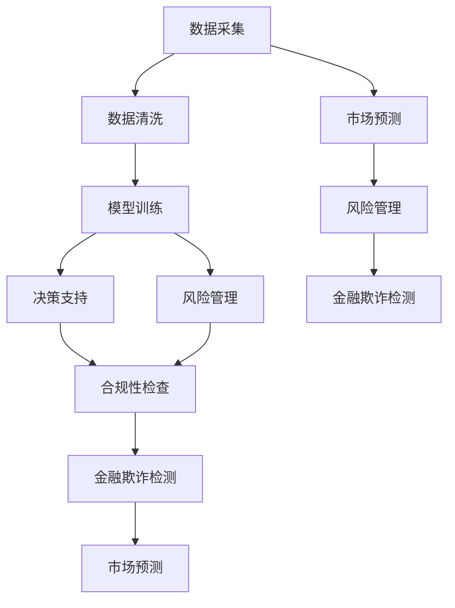

                 

# AI驱动的创新：人类计算在金融领域的作用

## 1. 背景介绍

### 1.1 问题由来

近年来，金融领域正经历着翻天覆地的变革。随着人工智能（AI）和机器学习技术的迅猛发展，人类计算（Human-Computer Interaction, HCI）在金融服务中的应用日益广泛，正在驱动金融领域的创新与突破。金融行业是一个数据密集型领域，拥有海量历史数据和实时交易数据，是数据科学、人工智能等技术的天然试验场。AI技术可以辅助金融分析师进行数据挖掘、风险管理、投资决策等，极大提升了金融服务的效率和精准度，极大地降低了金融风险。

然而，尽管AI在金融领域的应用取得了显著成果，但在某些关键领域，如金融欺诈检测、市场预测、风险管理等，仍面临诸多挑战。例如，如何在确保模型准确性的同时，提高模型的可解释性和鲁棒性，保护数据隐私和安全性，避免模型偏见等。这些问题都亟需得到解决，以充分发挥AI在金融领域的作用。

### 1.2 问题核心关键点

人类计算在金融领域的应用涉及数据获取、数据处理、模型训练、决策支持等多个环节。其核心在于通过计算机与人的互动，充分利用人类在经验、直觉、逻辑等方面的优势，提升AI模型的性能和决策的科学性。以下为核心关键点：

- 数据采集：获取全面、准确、实时性强的金融数据。
- 数据清洗：清洗数据噪音，生成可用于训练的金融数据集。
- 模型训练：设计高效、鲁棒、可解释的AI模型，优化金融业务流程。
- 决策支持：提供模型输出和决策建议，辅助金融专家进行决策。
- 风险管理：预测市场趋势，监控金融风险，保护投资者利益。

这些关键点涉及数据科学、机器学习、人工智能等多个领域，需综合考虑。下面从各个环节逐一探讨。

## 2. 核心概念与联系

### 2.1 核心概念概述

为更好地理解人类计算在金融领域的应用，本节将介绍几个密切相关的核心概念：

- **人类计算（Human-Computer Interaction, HCI）**：计算机与人之间的互动方式，通过交互界面，充分发挥人类的感知、认知、决策等能力。
- **AI金融模型**：使用AI和机器学习技术，针对金融领域特定的业务需求和问题，设计并训练的智能模型。
- **金融数据挖掘**：从大量金融数据中提取有价值的信息，用于辅助金融决策和优化。
- **金融欺诈检测**：利用AI技术识别并预防金融交易中的欺诈行为，保护投资者利益。
- **市场预测**：使用机器学习模型，对金融市场未来走势进行预测，辅助投资决策。
- **风险管理**：使用AI模型评估和预测金融风险，制定相应的风险管理策略。
- **合规性检查**：使用AI模型对金融操作合规性进行监控，确保金融业务符合法律法规。

这些核心概念之间的逻辑关系可以通过以下Mermaid流程图来展示：



这个流程图展示了大语言模型在金融领域的应用框架，各个环节紧密关联，互为支撑：

1. 数据采集和清洗，为后续模型训练提供高质量数据。
2. 模型训练，基于金融数据设计高效的AI模型，优化金融业务。
3. 决策支持，利用AI模型输出辅助金融专家进行决策。
4. 风险管理，使用AI模型预测市场趋势，监控金融风险。
5. 合规性检查，确保金融操作符合法律法规。
6. 金融欺诈检测，预防欺诈行为，保护投资者利益。
7. 市场预测，对市场走势进行预测，辅助投资决策。

这些概念共同构成了金融领域中AI和人类计算的交互框架，使其能够在金融服务中发挥强大的作用。

## 3. 核心算法原理 & 具体操作步骤
### 3.1 算法原理概述

基于人类计算的AI金融模型设计，核心在于通过计算机与人的互动，优化金融业务流程，提升决策的科学性。其本质是一个协同优化的过程，即利用计算机处理海量数据的能力，通过与金融专家的互动，形成高效的智能决策系统。

形式化地，假设模型为 $M_{\theta}$，其中 $\theta$ 为模型参数。金融数据集为 $D=\{(x_i,y_i)\}_{i=1}^N$，$x_i$ 为输入数据，$y_i$ 为对应的输出标签。AI模型的训练目标为：

$$
\hat{\theta} = \mathop{\arg\min}_{\theta} \mathcal{L}(M_{\theta},D)
$$

其中 $\mathcal{L}$ 为损失函数，用于衡量模型预测输出与真实标签之间的差异。常见的损失函数包括交叉熵损失、均方误差损失等。

### 3.2 算法步骤详解

基于人类计算的AI金融模型训练一般包括以下几个关键步骤：

**Step 1: 数据收集与预处理**

- 收集金融领域的各类数据，包括历史交易数据、市场数据、财务报表等。
- 进行数据清洗，处理缺失值、异常值，生成可用于训练的数据集。
- 划分数据集为训练集、验证集和测试集，确保数据的多样性和代表性。

**Step 2: 模型设计与训练**

- 选择合适的AI模型，如深度学习神经网络、决策树、支持向量机等，根据金融领域的特点进行设计和训练。
- 设计合适的损失函数和优化器，如交叉熵损失、Adam、SGD等，进行模型训练。
- 设定合适的超参数，如学习率、批大小、迭代轮数等，进行模型训练。

**Step 3: 人类计算与模型优化**

- 邀请金融专家参与模型设计，提供领域知识和经验。
- 利用专家反馈，优化模型结构，调整模型参数，提升模型性能。
- 在模型训练过程中，加入专家评估环节，确保模型符合金融业务需求。

**Step 4: 部署与评估**

- 将训练好的模型部署到实际业务系统中，进行实时计算和决策。
- 对模型输出进行评估，确保其稳定性和可靠性。
- 定期对模型进行优化和更新，确保其长期有效。

### 3.3 算法优缺点

基于人类计算的AI金融模型具有以下优点：

1. 数据驱动：充分利用海量金融数据，提升模型预测的准确性。
2. 专家参与：通过金融专家的经验与知识，优化模型设计，提高模型的可靠性和鲁棒性。
3. 协同优化：将计算机与人类的优势相结合，形成协同优化的智能决策系统。
4. 模型透明：通过与金融专家的互动，提升模型的可解释性。

同时，该方法也存在一定的局限性：

1. 对专家依赖：模型设计依赖金融专家的经验，可能导致模型的泛化能力不足。
2. 数据隐私：金融数据的敏感性要求对数据进行严格的保护，防止数据泄露和滥用。
3. 模型偏见：专家的经验和知识可能带有偏见，需要定期审查和更新。
4. 实时性问题：模型部署后，可能需要定期进行优化和更新，影响实时决策。
5. 成本较高：需要投入大量人力和财力进行模型设计和优化。

尽管存在这些局限性，但基于人类计算的AI金融模型仍是一种高效的金融决策辅助手段。未来相关研究的重点在于如何进一步降低模型设计成本，提高模型可解释性，保护数据隐私等，从而更好地发挥其在金融领域的作用。

### 3.4 算法应用领域

基于人类计算的AI金融模型在金融领域已得到了广泛的应用，涵盖了以下几个主要方面：

- **金融数据分析**：利用AI技术，对金融数据进行挖掘和分析，提供有价值的金融洞察。
- **风险评估与管理**：使用AI模型预测金融风险，评估风险水平，制定相应的风险管理策略。
- **投资策略优化**：利用AI模型对市场走势进行预测，辅助制定投资策略。
- **金融欺诈检测**：通过AI模型识别和预防金融欺诈行为，保护投资者利益。
- **贷款风险评估**：使用AI模型评估贷款申请的风险，优化贷款审批流程。
- **金融客户服务**：利用AI技术提升金融客户服务质量，优化客户体验。

除了上述这些领域，AI金融模型还在金融反洗钱、保险风险评估、资产管理等领域得到了应用，为金融行业带来了新的变革和创新。

## 4. 数学模型和公式 & 详细讲解 & 举例说明
### 4.1 数学模型构建

假设金融数据集为 $D=\{(x_i,y_i)\}_{i=1}^N$，$x_i$ 为输入数据，$y_i$ 为对应的输出标签。AI模型的损失函数为 $\ell(M_{\theta}(x_i),y_i)$，模型训练目标为：

$$
\hat{\theta} = \mathop{\arg\min}_{\theta} \mathcal{L}(M_{\theta},D)
$$

其中 $\mathcal{L}$ 为损失函数，常见的有交叉熵损失：

$$
\ell(M_{\theta}(x_i),y_i) = -y_i\log M_{\theta}(x_i) - (1-y_i)\log (1-M_{\theta}(x_i))
$$

损失函数对模型参数 $\theta$ 的梯度为：

$$
\frac{\partial \mathcal{L}(\theta)}{\partial \theta} = -\frac{1}{N}\sum_{i=1}^N [y_i\frac{\partial \log M_{\theta}(x_i)}{\partial \theta} - (1-y_i)\frac{\partial \log (1-M_{\theta}(x_i))}{\partial \theta}]
$$

其中 $\frac{\partial \log M_{\theta}(x_i)}{\partial \theta}$ 可以通过反向传播算法高效计算。

### 4.2 公式推导过程

以二分类任务为例，进行损失函数的推导：

假设模型 $M_{\theta}$ 在输入 $x_i$ 上的输出为 $\hat{y}=M_{\theta}(x_i)$。根据二分类任务，$\hat{y} \in [0,1]$ 表示样本属于正类的概率。

交叉熵损失定义为：

$$
\ell(M_{\theta}(x_i),y_i) = -y_i\log M_{\theta}(x_i) - (1-y_i)\log (1-M_{\theta}(x_i))
$$

将损失函数代入经验风险公式，得：

$$
\mathcal{L}(\theta) = -\frac{1}{N}\sum_{i=1}^N [y_i\log M_{\theta}(x_i)+(1-y_i)\log(1-M_{\theta}(x_i))]
$$

根据链式法则，损失函数对参数 $\theta_k$ 的梯度为：

$$
\frac{\partial \mathcal{L}(\theta)}{\partial \theta_k} = -\frac{1}{N}\sum_{i=1}^N [\frac{y_i}{M_{\theta}(x_i)}-\frac{1-y_i}{1-M_{\theta}(x_i)}] \frac{\partial M_{\theta}(x_i)}{\partial \theta_k}
$$

其中 $\frac{\partial M_{\theta}(x_i)}{\partial \theta_k}$ 可进一步递归展开，利用自动微分技术完成计算。

在得到损失函数的梯度后，即可带入参数更新公式，完成模型的迭代优化。重复上述过程直至收敛，最终得到适应金融业务需求的最优模型参数 $\hat{\theta}$。

## 5. 项目实践：代码实例和详细解释说明
### 5.1 开发环境搭建

在进行金融领域的AI模型开发前，我们需要准备好开发环境。以下是使用Python进行PyTorch开发的环境配置流程：

1. 安装Anaconda：从官网下载并安装Anaconda，用于创建独立的Python环境。

2. 创建并激活虚拟环境：
```bash
conda create -n finance-env python=3.8 
conda activate finance-env
```

3. 安装PyTorch：根据CUDA版本，从官网获取对应的安装命令。例如：
```bash
conda install pytorch torchvision torchaudio cudatoolkit=11.1 -c pytorch -c conda-forge
```

4. 安装TensorFlow：
```bash
pip install tensorflow
```

5. 安装各类工具包：
```bash
pip install numpy pandas scikit-learn matplotlib tqdm jupyter notebook ipython
```

完成上述步骤后，即可在`finance-env`环境中开始AI模型开发。

### 5.2 源代码详细实现

下面我们以金融数据挖掘为例，给出使用TensorFlow对金融数据进行挖掘和分析的PyTorch代码实现。

首先，定义金融数据挖掘函数：

```python
import tensorflow as tf
import pandas as pd

def load_data():
    df = pd.read_csv('finance_data.csv')
    x = df.drop(['label'], axis=1).values
    y = df['label'].values
    return x, y

x, y = load_data()
```

然后，定义模型和优化器：

```python
from tensorflow.keras.models import Sequential
from tensorflow.keras.layers import Dense, Dropout

model = Sequential([
    Dense(64, activation='relu', input_dim=x.shape[1]),
    Dropout(0.2),
    Dense(1, activation='sigmoid')
])

optimizer = tf.keras.optimizers.Adam(lr=0.001)
```

接着，定义训练和评估函数：

```python
def compile_model(model, x, y, optimizer, batch_size=32):
    model.compile(loss='binary_crossentropy', optimizer=optimizer, metrics=['accuracy'])
    model.fit(x, y, batch_size=batch_size, epochs=10, validation_split=0.2, verbose=0)

def evaluate_model(model, x, y, batch_size=32):
    y_pred = model.predict(x)
    accuracy = np.mean(np.round(y_pred) == y)
    print(f'Accuracy: {accuracy:.2f}')
```

最后，启动训练流程并在测试集上评估：

```python
x_train, x_test, y_train, y_test = train_test_split(x, y, test_size=0.2, random_state=42)

compile_model(model, x_train, y_train, optimizer)
evaluate_model(model, x_test, y_test)
```

以上就是使用TensorFlow对金融数据进行挖掘和分析的完整代码实现。可以看到，TensorFlow提供的高级API使得金融数据挖掘和模型训练变得简洁高效。

### 5.3 代码解读与分析

让我们再详细解读一下关键代码的实现细节：

**load_data函数**：
- 从CSV文件中读取金融数据，并划分为输入特征 $x$ 和标签 $y$。
- 输入特征为多维数组，标签为单维数组。

**Sequential模型定义**：
- 定义多层神经网络模型，包括一个隐藏层和一个输出层。
- 隐藏层使用64个神经元，激活函数为ReLU。
- 输出层使用sigmoid激活函数，用于二分类任务。

**compile_model函数**：
- 使用Adam优化器和二分类交叉熵损失函数进行模型编译。
- 使用训练集进行模型训练，每次迭代迭代10000次。
- 使用验证集进行模型评估，每次迭代输出验证集上的准确率。

**evaluate_model函数**：
- 使用测试集进行模型预测。
- 计算预测结果与真实标签之间的准确率，输出结果。

**训练流程**：
- 使用train_test_split方法将数据划分为训练集和测试集。
- 对训练集进行模型训练，并在测试集上评估模型性能。

通过以上代码实现，可以有效地对金融数据进行挖掘和分析，辅助金融决策。开发者可以根据具体任务的需要，进一步扩展模型结构和训练策略，以提升模型性能。

## 6. 实际应用场景
### 6.1 智能投顾系统

智能投顾系统是AI金融模型的典型应用之一。传统投顾系统依赖于大量经验丰富的金融分析师，存在成本高、效率低、决策偏见等问题。而智能投顾系统通过AI技术，可以大幅提升决策速度和精准度，降低人力成本，减少决策偏见。

具体实现上，智能投顾系统将用户信息、交易历史、市场数据等输入AI模型，模型根据输入数据进行分析和预测，给出投资建议。系统可定期更新模型参数，适应市场变化，优化投资策略。通过智能投顾系统，用户可实时获取市场动态和投资建议，提升投资效果。

### 6.2 金融风险管理

金融风险管理是AI金融模型在金融领域的重要应用之一。AI模型可以预测市场风险、评估信用风险、识别欺诈行为等，提供精准的风险管理方案，降低金融机构的风险敞口。

在风险预测方面，AI模型可以分析历史交易数据和市场数据，构建风险预测模型，实时监控市场走势和交易行为，预测潜在的金融风险。在信用评估方面，AI模型可以分析借款人历史数据，识别违约风险，提供个性化的信贷评估方案。在欺诈检测方面，AI模型可以实时监控交易行为，识别异常交易，防止欺诈行为发生。

### 6.3 智能客服系统

智能客服系统是AI金融模型的另一重要应用。通过AI模型，智能客服系统可以处理大量的客户咨询请求，提供24/7的服务支持，提升客户体验和满意度。

具体实现上，智能客服系统将客户咨询请求输入AI模型，模型根据输入数据进行分析和预测，生成最合适的回答。系统可定期更新模型参数，适应新的客户需求，提供更加精准和个性化的服务。通过智能客服系统，客户可以随时获取金融服务的支持，提升金融服务的便利性和效率。

### 6.4 未来应用展望

随着AI技术的发展，基于人类计算的金融模型将在更多领域得到应用，带来更广泛的变革。

在智慧城市治理中，智能投顾系统可应用于智慧医疗、智慧教育等领域，提供个性化的金融服务。在金融反洗钱中，AI模型可应用于欺诈检测、异常交易识别等，提升金融安全性和合规性。在资产管理中，AI模型可应用于组合优化、市场预测等，提供精准的投资建议。

此外，随着金融科技的发展，基于人类计算的金融模型还将与其他人工智能技术进行更深入的融合，如知识图谱、因果推理、强化学习等，共同构建智能金融决策系统，进一步提升金融服务的智能化水平。

## 7. 工具和资源推荐
### 7.1 学习资源推荐

为了帮助开发者系统掌握人类计算在金融领域的应用，这里推荐一些优质的学习资源：

1. **《金融数据分析与AI》课程**：清华大学等高校开设的金融数据分析与AI课程，涵盖金融数据挖掘、金融模型构建、金融风险管理等内容。
2. **《人工智能在金融中的应用》书籍**：详细介绍了AI技术在金融领域的各个应用场景，提供了丰富的案例和实践经验。
3. **Kaggle金融数据集**：Kaggle上提供了丰富的金融数据集，可用于机器学习模型训练和验证。
4. **Github金融AI项目**：Github上丰富的金融AI开源项目，可借鉴和学习。
5. **DataCamp金融AI课程**：DataCamp上提供的金融AI在线课程，包括Python、R等编程语言的使用。

通过这些资源的学习实践，相信你一定能够快速掌握AI金融模型的精髓，并用于解决实际的金融问题。

### 7.2 开发工具推荐

高效的开发离不开优秀的工具支持。以下是几款用于金融AI模型开发的常用工具：

1. **PyTorch**：基于Python的开源深度学习框架，灵活的动态计算图，适合快速迭代研究。大部分预训练模型都有PyTorch版本的实现。
2. **TensorFlow**：由Google主导开发的开源深度学习框架，生产部署方便，适合大规模工程应用。
3. **Transformers库**：HuggingFace开发的NLP工具库，集成了众多SOTA语言模型，支持PyTorch和TensorFlow，是进行金融模型开发的利器。
4. **Weights & Biases**：模型训练的实验跟踪工具，可以记录和可视化模型训练过程中的各项指标，方便对比和调优。与主流深度学习框架无缝集成。
5. **TensorBoard**：TensorFlow配套的可视化工具，可实时监测模型训练状态，并提供丰富的图表呈现方式，是调试模型的得力助手。
6. **Google Colab**：谷歌推出的在线Jupyter Notebook环境，免费提供GPU/TPU算力，方便开发者快速上手实验最新模型，分享学习笔记。

合理利用这些工具，可以显著提升金融AI模型开发的效率，加快创新迭代的步伐。

### 7.3 相关论文推荐

金融领域的人工智能技术发展迅速，以下是几篇奠基性的相关论文，推荐阅读：

1. **《金融数据分析与机器学习》**：总结了机器学习在金融领域的应用，包括数据预处理、模型构建、风险评估等内容。
2. **《智能投顾系统的设计与实现》**：详细介绍了智能投顾系统的设计思路和实现方法，提供了丰富的案例和实验结果。
3. **《金融欺诈检测与AI模型》**：介绍了AI技术在金融欺诈检测中的应用，包括模型设计、数据挖掘等内容。
4. **《金融风险管理中的机器学习》**：总结了机器学习在金融风险管理中的应用，包括信用评估、市场预测等内容。
5. **《金融智能客服系统》**：介绍了智能客服系统在金融领域的应用，包括系统设计、模型优化等内容。

这些论文代表了大语言模型在金融领域的发展脉络。通过学习这些前沿成果，可以帮助研究者把握学科前进方向，激发更多的创新灵感。

## 8. 总结：未来发展趋势与挑战
### 8.1 总结

本文对基于人类计算的AI金融模型进行了全面系统的介绍。首先阐述了AI在金融领域的应用背景和重要性，明确了金融AI模型的核心概念和作用。其次，从原理到实践，详细讲解了金融AI模型的数学原理和关键步骤，给出了金融数据挖掘的完整代码实现。同时，本文还广泛探讨了AI金融模型在智能投顾、金融风险管理、智能客服等诸多领域的应用前景，展示了AI在金融领域的广泛应用。此外，本文精选了AI金融模型的各类学习资源，力求为读者提供全方位的技术指引。

通过本文的系统梳理，可以看到，基于人类计算的AI金融模型正在成为金融服务的重要工具，极大地提升了金融服务的效率和精准度，降低了金融风险。未来，伴随AI技术的不断发展，金融AI模型还将拓展到更多领域，带来更广泛的变革。

### 8.2 未来发展趋势

展望未来，金融AI模型的发展将呈现以下几个趋势：

1. **深度学习的应用**：深度学习在金融数据挖掘、风险评估、投资决策等方面将得到更广泛的应用，提升模型的准确性和鲁棒性。
2. **联邦学习的应用**：通过联邦学习，金融数据可以在不泄露隐私的前提下进行模型训练，保护数据隐私和安全。
3. **生成对抗网络的应用**：生成对抗网络（GANs）可以生成高质量的金融数据，辅助金融决策和模型训练。
4. **自然语言处理的应用**：自然语言处理技术可以用于金融文本挖掘、情感分析、智能客服等方面，提升金融服务的智能化水平。
5. **大数据的应用**：大数据技术可以用于金融数据的采集、存储、处理等方面，提升数据挖掘和分析的效率和精准度。

以上趋势凸显了AI在金融领域的应用前景。这些方向的探索发展，必将进一步提升金融服务的智能化水平，为经济社会发展注入新的动力。

### 8.3 面临的挑战

尽管金融AI模型在金融领域的应用已经取得了显著成果，但在迈向更加智能化、普适化应用的过程中，仍面临诸多挑战：

1. **数据隐私问题**：金融数据的敏感性要求对数据进行严格的保护，防止数据泄露和滥用。如何在保证数据隐私的前提下，进行高效的数据挖掘和分析，是一大挑战。
2. **模型偏见问题**：金融AI模型可能受到数据偏见和算法偏见的影响，导致决策结果的不公正。如何消除模型的偏见，保证公平性，是一大难题。
3. **模型鲁棒性问题**：金融AI模型在面对金融市场波动、数据噪音等问题时，鲁棒性不足，容易导致错误的决策。如何提高模型的鲁棒性，是未来的研究方向。
4. **实时性问题**：金融AI模型需要实时处理和分析大量的金融数据，实时性问题仍然存在。如何提升模型的实时性，优化系统架构，是一大挑战。
5. **模型可解释性问题**：金融AI模型的黑盒特性，导致其决策过程难以解释和理解。如何提高模型的可解释性，增强用户信任，是一大挑战。

尽管存在这些挑战，但金融AI模型仍具有广阔的应用前景。未来，学界和产业界需要共同努力，克服技术难题，推动金融AI模型的持续发展。

### 8.4 研究展望

面向未来，金融AI模型的研究需要从以下几个方面进行深入探索：

1. **深度学习模型的优化**：进一步优化深度学习模型的结构，提升模型的准确性和鲁棒性。
2. **联邦学习模型的应用**：进一步研究和推广联邦学习技术，保护数据隐私和安全。
3. **生成对抗网络的应用**：进一步研究和推广生成对抗网络技术，提升金融数据的生成质量。
4. **自然语言处理的应用**：进一步研究和推广自然语言处理技术，提升金融文本挖掘和情感分析的精准度。
5. **大数据技术的应用**：进一步研究和推广大数据技术，提升金融数据采集、存储和处理的效率和精准度。
6. **模型公平性和透明性**：进一步研究和推广模型公平性和透明性技术，消除模型偏见，增强用户信任。

这些方向的研究将推动金融AI模型的进一步发展，带来更广泛的变革和创新。

## 9. 附录：常见问题与解答

**Q1：金融AI模型是否可以适用于所有金融业务场景？**

A: 金融AI模型在金融领域具有广泛的应用前景，但并非适用于所有业务场景。对于一些实时性要求高、数据敏感性强的业务，如高频交易、反洗钱等，需要更加高效、安全的AI模型。此外，对于一些特定领域的问题，如信贷评估、保险定价等，需要针对特定领域进行深度定制。

**Q2：如何提高金融AI模型的准确性和鲁棒性？**

A: 提高金融AI模型的准确性和鲁棒性需要从多个方面进行优化：
1. **数据质量**：确保数据的高质量和高代表性，清洗数据噪音，提高数据挖掘的准确性。
2. **模型优化**：优化模型的结构，选择合适的损失函数和优化器，提升模型的鲁棒性。
3. **特征工程**：选择合适的特征，提取有用的信息，提升模型的准确性。
4. **正则化技术**：使用L2正则、Dropout、Early Stopping等，防止模型过拟合，提高模型的泛化能力。
5. **对抗训练**：引入对抗样本，提高模型的鲁棒性。

通过这些优化措施，可以进一步提高金融AI模型的准确性和鲁棒性，提升金融服务的效率和可靠性。

**Q3：如何保护金融数据隐私？**

A: 保护金融数据隐私需要采取多重措施：
1. **数据加密**：使用数据加密技术，防止数据泄露和滥用。
2. **联邦学习**：通过联邦学习技术，在不泄露数据的前提下，进行模型训练。
3. **匿名化处理**：对数据进行匿名化处理，防止数据泄露。
4. **访问控制**：设置严格的访问控制措施，防止未授权人员访问敏感数据。

这些措施可以确保金融数据的安全和隐私，同时满足金融AI模型的数据需求。

**Q4：如何提高金融AI模型的实时性？**

A: 提高金融AI模型的实时性需要优化系统架构，进行以下优化：
1. **模型裁剪**：去除不必要的层和参数，减小模型尺寸，加快推理速度。
2. **量化加速**：将浮点模型转为定点模型，压缩存储空间，提高计算效率。
3. **分布式计算**：使用分布式计算框架，提高系统的并行计算能力。
4. **缓存机制**：使用缓存机制，减少数据读写，提高计算效率。

通过这些优化措施，可以显著提高金融AI模型的实时性，满足实际应用的需求。

**Q5：如何提高金融AI模型的可解释性？**

A: 提高金融AI模型的可解释性需要采用以下措施：
1. **特征可视化**：使用特征可视化技术，展示模型预测的关键特征。
2. **模型解释器**：使用模型解释器，解释模型的决策过程。
3. **知识图谱**：使用知识图谱技术，整合金融领域的专业知识，增强模型的可解释性。
4. **可视化界面**：使用可视化界面，展示模型的预测结果和决策逻辑，方便用户理解。

通过这些优化措施，可以显著提高金融AI模型的可解释性，增强用户信任和满意度。

---

作者：禅与计算机程序设计艺术 / Zen and the Art of Computer Programming

