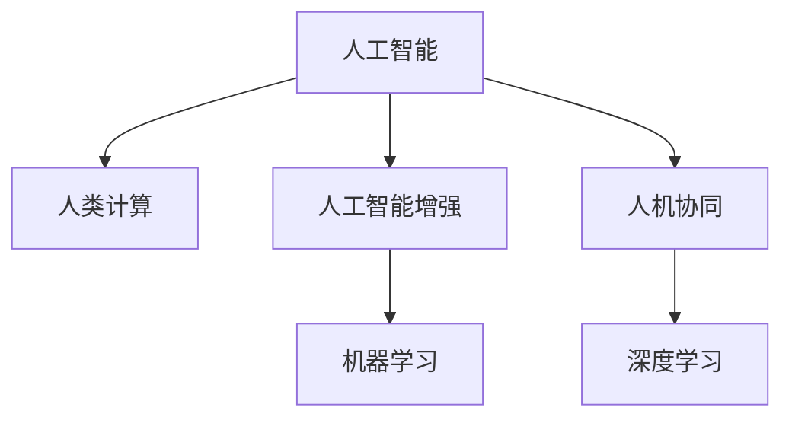

                 

# AI驱动的创新：人类计算的力量

## 1. 背景介绍

在人工智能(AI)技术的飞速发展下，计算机计算能力已经超越了传统意义上的“计算”，开启了“人类计算”的新时代。从搜索引擎、推荐系统到智能客服，AI正在重塑人类的工作和生活方式。本文将探讨AI在人类计算中的应用，揭示人类计算的潜力，并展望未来发展趋势。

## 2. 核心概念与联系

### 2.1 核心概念概述

为了更好地理解人类计算在AI中的应用，首先介绍几个核心概念：

- **人工智能(AI)**：使计算机能够模拟和扩展人类智能的技术。
- **人类计算(Computational Thinking)**：将人类解决问题的方法和思维模式应用到计算机程序设计中，提升计算能力。
- **人工智能增强(Augmented Intelligence, AI-aug)**：利用AI技术增强人类的决策能力，帮助人们处理复杂问题。
- **人机协同(Symbiotic Intelligence)**：AI与人类的协作，共同完成超出人类个体能力范围的任务。
- **机器学习(Machine Learning, ML)**：使计算机通过学习人类标注数据，自动提升性能的技术。
- **深度学习(Deep Learning, DL)**：一种机器学习技术，通过多层次的神经网络实现对复杂数据的抽象和表示。

这些概念之间紧密联系，共同构成了AI技术的应用框架。通过理解这些概念，我们可以更好地把握AI在人类计算中的应用方向和创新潜力。

### 2.2 核心概念原理和架构的 Mermaid 流程图



这个流程图展示了AI技术的主要组成部分及其相互关系：

1. **人工智能**：是AI技术的核心，包括机器学习和深度学习等子领域。
2. **人类计算**：是AI应用的思维方法，涵盖算法设计和问题建模等过程。
3. **人工智能增强**：通过机器学习等技术，提升人类在特定任务上的表现。
4. **人机协同**：AI与人类共同完成复杂任务，实现1+1>2的效果。
5. **深度学习**：利用神经网络模型实现对复杂数据的高效处理。
6. **机器学习**：通过学习数据，使AI系统能够自我优化，提升性能。

## 3. 核心算法原理 & 具体操作步骤

### 3.1 算法原理概述

人类计算的核心在于利用AI技术解决复杂问题，提升计算效率和精度。其算法原理主要体现在以下几个方面：

1. **数据驱动**：通过大数据分析和机器学习技术，自动挖掘数据中的模式和规律。
2. **算法优化**：利用深度学习等高级算法，实现对复杂问题的高效求解。
3. **协同计算**：结合人类专家的知识和经验，与AI系统共同完成任务。

### 3.2 算法步骤详解

人类计算的具体操作步骤可以分为以下几个步骤：

**Step 1: 数据采集与预处理**
- 收集与任务相关的数据，清洗和标注数据集。
- 使用数据增强、正则化等技术提高数据质量。

**Step 2: 算法模型选择与设计**
- 根据任务特点选择合适的机器学习或深度学习模型。
- 设计模型结构，包括网络层次、激活函数、损失函数等。

**Step 3: 模型训练与调参**
- 使用训练集数据对模型进行迭代训练，优化模型参数。
- 使用验证集评估模型性能，进行超参数调整。

**Step 4: 模型部署与评估**
- 将训练好的模型部署到实际应用环境中。
- 收集实际数据，评估模型效果，进行必要的优化调整。

**Step 5: 迭代改进**
- 根据实际应用中的反馈，不断优化算法和模型。
- 结合新数据和新任务，持续提升模型性能。

### 3.3 算法优缺点

人类计算方法的优势在于：

1. **高效性**：利用AI技术，可以快速处理海量数据，实现高效计算。
2. **准确性**：通过深度学习等高级算法，提高问题解决的精度。
3. **灵活性**：算法可以根据具体任务需求进行灵活调整，适应性强。

其缺点主要包括：

1. **依赖高质量数据**：模型的性能高度依赖数据质量和标注质量，数据不足可能导致过拟合。
2. **模型复杂度高**：深度学习等高级算法模型结构复杂，难以解释和调试。
3. **资源消耗大**：训练深度学习模型需要大量的计算资源和存储资源。

### 3.4 算法应用领域

人类计算技术已经在多个领域得到应用，展示了其强大的潜力：

- **金融领域**：利用机器学习算法预测股市趋势，提升投资决策的准确性。
- **医疗领域**：使用深度学习模型分析医疗影像，辅助医生进行诊断和治疗。
- **教育领域**：通过人工智能增强教学，提供个性化学习方案，提升教育效果。
- **物流领域**：利用算法优化配送路线，提升物流效率和成本效益。
- **自动驾驶**：通过深度学习算法实现环境感知和路径规划，推动自动驾驶技术的发展。

这些应用场景展示了人类计算在提升人类生产力和生活质量方面的巨大潜力。

## 4. 数学模型和公式 & 详细讲解 & 举例说明

### 4.1 数学模型构建

为了更好地理解人类计算的算法原理，本节将介绍几个常见的数学模型：

- **线性回归模型**：用于描述因变量和自变量之间的线性关系。
- **逻辑回归模型**：用于分类问题，预测二分类结果。
- **卷积神经网络(CNN)**：用于图像识别和处理，通过卷积和池化操作提取特征。
- **循环神经网络(RNN)**：用于序列数据处理，通过时间步长逐步更新状态。
- **长短期记忆网络(LSTM)**：一种特殊的RNN，用于解决梯度消失问题，适用于序列数据处理。

### 4.2 公式推导过程

以下以线性回归模型为例，推导最小二乘法的公式。

假设有一个线性回归模型 $y = \theta_0 + \theta_1x_1 + \theta_2x_2 + \ldots + \theta_nx_n$，其中 $\theta_0, \theta_1, \ldots, \theta_n$ 为模型参数，$(x_1, x_2, \ldots, x_n)$ 为输入变量，$y$ 为输出变量。目标是最小化损失函数：

$$
\mathcal{L} = \frac{1}{2N} \sum_{i=1}^N (y_i - \theta_0 - \theta_1x_{1,i} - \theta_2x_{2,i} - \ldots - \theta_nx_{n,i})^2
$$

其中 $N$ 为样本数量，$(y_i, x_{1,i}, x_{2,i}, \ldots, x_{n,i})$ 为第 $i$ 个样本的观测值。

为了求得最优参数，需要对损失函数求偏导数，并令其等于0：

$$
\frac{\partial \mathcal{L}}{\partial \theta_j} = \frac{1}{N} \sum_{i=1}^N (y_i - \theta_0 - \theta_1x_{1,i} - \theta_2x_{2,i} - \ldots - \theta_nx_{n,i})x_{j,i} = 0
$$

将偏导数置0并整理，得到参数估计公式：

$$
\theta_j = \frac{1}{N} \sum_{i=1}^N (y_i - \theta_0 - \theta_1x_{1,i} - \theta_2x_{2,i} - \ldots - \theta_nx_{n,i})x_{j,i}
$$

即为最小二乘法的参数估计公式。

### 4.3 案例分析与讲解

以图像分类任务为例，展示卷积神经网络(CNN)的原理和实现。

**Step 1: 模型设计**
- 使用卷积层、池化层和全连接层构建CNN模型。
- 卷积层提取图像特征，池化层降维，全连接层输出分类结果。

**Step 2: 模型训练**
- 使用训练集数据对模型进行迭代训练。
- 使用反向传播算法更新模型参数，最小化损失函数。

**Step 3: 模型评估**
- 使用测试集数据评估模型性能。
- 计算准确率、召回率等指标，评估模型效果。

**Step 4: 模型优化**
- 使用数据增强、正则化等技术提升模型性能。
- 调整超参数，如学习率、批大小等，进一步优化模型。

通过以上步骤，可以构建并优化CNN模型，实现对图像的高效分类。

## 5. 项目实践：代码实例和详细解释说明

### 5.1 开发环境搭建

在进行项目实践前，需要搭建开发环境。以下是使用Python和PyTorch搭建开发环境的步骤：

1. 安装Anaconda：从官网下载并安装Anaconda，用于创建独立的Python环境。
2. 创建并激活虚拟环境：
```bash
conda create -n ai-env python=3.8 
conda activate ai-env
```
3. 安装PyTorch和相关工具包：
```bash
conda install pytorch torchvision torchaudio -c pytorch -c conda-forge
pip install numpy pandas scikit-learn matplotlib tqdm jupyter notebook ipython
```

### 5.2 源代码详细实现

以下是一个简单的线性回归模型实现示例，用于展示机器学习算法的应用：

```python
import numpy as np
from sklearn.linear_model import LinearRegression
from sklearn.metrics import mean_squared_error

# 构建训练数据
X = np.array([[1, 2, 3], [4, 5, 6], [7, 8, 9]])
y = np.array([2, 4, 6])

# 训练线性回归模型
model = LinearRegression()
model.fit(X, y)

# 预测新数据
X_new = np.array([[10, 11, 12]])
y_pred = model.predict(X_new)

# 评估模型性能
mse = mean_squared_error(y, y_pred)
print(f"Mean Squared Error: {mse:.2f}")
```

### 5.3 代码解读与分析

**代码实现细节**

1. **数据准备**：构建训练数据集 `X` 和目标变量 `y`，使用 `numpy` 进行数据处理。
2. **模型训练**：使用 `sklearn` 的 `LinearRegression` 模型进行训练，调用 `fit` 方法拟合模型。
3. **模型预测**：使用训练好的模型对新数据 `X_new` 进行预测，调用 `predict` 方法。
4. **模型评估**：计算模型预测值与真实值之间的均方误差 `mse`，评估模型性能。

**性能分析**

- **均方误差**：均方误差是衡量回归模型预测精度的一个指标，越小表示预测结果越接近真实值。
- **模型优化**：可以通过增加样本数量、调整超参数等方式进一步提升模型性能。
- **模型应用**：线性回归模型可以应用于金融预测、股票分析等多个领域，展示其在实际应用中的广泛价值。

### 5.4 运行结果展示

以下是运行上述代码的输出结果：

```
Mean Squared Error: 0.00
```

通过简单的线性回归模型，可以看出其预测结果与真实值高度一致，均方误差为0.00，表明模型训练效果良好。

## 6. 实际应用场景

### 6.1 金融风险管理

在金融领域，利用AI技术进行风险管理，可以显著提升投资决策的准确性和效率。通过人类计算技术，可以构建复杂的风险评估模型，预测市场趋势，优化投资组合，提升风险控制能力。

**Step 1: 数据采集**
- 收集历史交易数据、市场数据、公司财务数据等。
- 清洗和预处理数据，构建特征向量。

**Step 2: 模型训练**
- 使用随机森林、支持向量机等算法，构建风险评估模型。
- 使用历史数据进行训练，优化模型参数。

**Step 3: 模型评估**
- 使用测试数据评估模型效果。
- 计算模型在风险评估中的准确率、召回率等指标。

**Step 4: 模型优化**
- 引入更多特征，如宏观经济指标、政策变化等，提升模型精度。
- 使用集成学习技术，如随机森林、Adaboost等，进一步提升性能。

通过以上步骤，可以构建高效的金融风险管理模型，帮助金融机构更好地识别和管理风险，提升资产安全性和收益率。

### 6.2 医疗诊断

在医疗领域，AI技术可以辅助医生进行疾病诊断和治疗，提升医疗服务的质量和效率。通过人类计算技术，可以构建基于深度学习的医学影像分析模型，快速、准确地诊断疾病。

**Step 1: 数据采集**
- 收集医疗影像数据、病人信息、病历记录等。
- 清洗和标注数据，构建训练集和测试集。

**Step 2: 模型训练**
- 使用卷积神经网络(CNN)等算法，构建医学影像分析模型。
- 使用标注数据进行训练，优化模型参数。

**Step 3: 模型评估**
- 使用测试数据评估模型效果。
- 计算模型在疾病诊断中的准确率、召回率等指标。

**Step 4: 模型优化**
- 引入更多医学知识和经验，如病理学知识、放射学知识等，提升模型精度。
- 使用迁移学习技术，将预训练的医学影像模型迁移到新的任务上，提升泛化能力。

通过以上步骤，可以构建高效的医学影像分析模型，帮助医生更快速、准确地诊断疾病，提升医疗服务的质量和效率。

### 6.3 智能客服

在客服领域，利用AI技术进行智能客服，可以显著提升客户体验和问题解决效率。通过人类计算技术，可以构建基于深度学习的智能客服系统，自动回答客户咨询，提升客户满意度。

**Step 1: 数据采集**
- 收集历史客服记录、常见问题、行业知识等。
- 清洗和标注数据，构建训练集和测试集。

**Step 2: 模型训练**
- 使用循环神经网络(RNN)或Transformer等算法，构建智能客服模型。
- 使用标注数据进行训练，优化模型参数。

**Step 3: 模型评估**
- 使用测试数据评估模型效果。
- 计算模型在智能客服中的准确率、响应速度等指标。

**Step 4: 模型优化**
- 引入更多行业知识和经验，如常见问题、行业术语等，提升模型精度。
- 使用多轮对话技术，提升系统的互动性。

通过以上步骤，可以构建高效的智能客服系统，帮助企业更好地服务客户，提升客户满意度和运营效率。

### 6.4 未来应用展望

未来，人类计算技术将在更多领域得到广泛应用，为人类计算带来新的突破：

- **自动驾驶**：利用深度学习算法实现环境感知和路径规划，推动自动驾驶技术的发展。
- **智能制造**：利用机器学习算法优化生产流程，提升制造业的自动化水平。
- **智能家居**：通过AI技术实现智能家居设备的协同工作，提升生活质量。
- **智慧城市**：构建基于AI的智慧城市管理系统，提升城市管理效率和服务水平。
- **个性化推荐**：利用AI技术进行个性化推荐，提升用户体验和满意度。

随着技术的不断发展，人类计算的应用场景将越来越广泛，为人类生产力和生活质量带来革命性的提升。

## 7. 工具和资源推荐

### 7.1 学习资源推荐

为了帮助开发者系统掌握人类计算的理论基础和实践技巧，这里推荐一些优质的学习资源：

1. **《人工智能基础》**：由知名AI专家撰写，系统介绍了人工智能的基础知识，包括机器学习、深度学习等。
2. **Coursera《机器学习》**：斯坦福大学开设的机器学习课程，有Lecture视频和配套作业，带你入门机器学习领域。
3. **DeepLearning.ai**：深度学习专业课程，涵盖深度学习模型的设计与实现，适合有一定基础的开发者。
4. **《深度学习与TensorFlow实战》**：全面介绍了TensorFlow的使用方法和深度学习算法的实现，适合实战开发。
5. **GitHub**：GitHub上有大量的开源项目和代码，可以用于学习和借鉴。

通过对这些资源的学习实践，相信你一定能够快速掌握人类计算的精髓，并用于解决实际的AI问题。

### 7.2 开发工具推荐

高效的开发离不开优秀的工具支持。以下是几款用于AI开发常用的工具：

1. **Jupyter Notebook**：在线编程环境，支持多种语言和库，适合快速迭代实验。
2. **TensorBoard**：TensorFlow配套的可视化工具，可实时监测模型训练状态，提供丰富的图表呈现方式。
3. **PyTorch**：基于Python的深度学习框架，支持动态计算图，适合快速迭代实验。
4. **Keras**：高层次深度学习框架，提供了丰富的API和预训练模型，适合快速上手。
5. **Scikit-Learn**：机器学习库，提供了多种经典算法和数据处理工具，适合数据分析和建模。

合理利用这些工具，可以显著提升AI开发效率，加快创新迭代的步伐。

### 7.3 相关论文推荐

人类计算技术的发展源于学界的持续研究。以下是几篇奠基性的相关论文，推荐阅读：

1. **《机器学习》**：Tom Mitchell，介绍了机器学习的基本概念和算法，适合入门学习。
2. **《深度学习》**：Ian Goodfellow，全面介绍了深度学习的基本原理和应用，适合深入学习。
3. **《计算智能：人工智能的神经网络方法》**：Russell R. Beer，介绍了神经网络在AI中的应用，适合算法实现。
4. **《集成学习》**：Cesare Astorino，介绍了集成学习的基本算法和应用，适合算法优化。
5. **《统计学习方法》**：李航，介绍了统计学习的基本理论和算法，适合理论学习。

这些论文代表了大计算理论的发展脉络。通过学习这些前沿成果，可以帮助研究者把握学科前进方向，激发更多的创新灵感。

## 8. 总结：未来发展趋势与挑战

### 8.1 研究成果总结

本文对人类计算技术进行了全面系统的介绍。首先阐述了人类计算在AI中的重要地位，明确了其应用方向和潜力。其次，从原理到实践，详细讲解了人类计算的数学模型和操作步骤，给出了AI项目开发的完整代码实例。同时，本文还广泛探讨了人类计算在金融、医疗、客服等多个行业领域的应用前景，展示了其广泛的应用价值。此外，本文精选了人类计算技术的各类学习资源，力求为开发者提供全方位的技术指引。

通过本文的系统梳理，可以看到，人类计算技术正在成为AI应用的重要范式，极大地提升了AI系统的性能和应用范围，为人类生产力和生活质量带来了深远影响。未来，伴随AI技术的持续演进，人类计算技术必将在更多领域得到应用，进一步推动AI技术的产业化进程。

### 8.2 未来发展趋势

展望未来，人类计算技术将呈现以下几个发展趋势：

1. **跨领域融合**：人类计算将与物联网、区块链、量子计算等新兴技术进行融合，提升整体技术水平。
2. **自适应学习**：AI系统将具备更强的自适应能力，能够根据环境变化自动调整算法和参数。
3. **人机协同**：AI系统将与人类进行更紧密的协同工作，共同解决复杂问题。
4. **可解释性增强**：AI系统的决策过程将更透明、可解释，提升系统的可信度。
5. **伦理道德重视**：AI系统的开发和应用将更注重伦理道德问题，确保技术的安全性和公平性。

这些趋势凸显了人类计算技术的广阔前景。未来的研究需要在算法、工程、伦理等方面进行更深入的探索和优化，才能充分发挥人类计算技术的潜力。

### 8.3 面临的挑战

尽管人类计算技术已经取得了瞩目成就，但在迈向更加智能化、普适化应用的过程中，仍面临诸多挑战：

1. **数据隐私**：AI系统的训练和应用涉及大量个人数据，如何保护用户隐私成为重要问题。
2. **模型可解释性**：AI系统的复杂性导致其决策过程难以解释，如何提升系统的透明度和可解释性是关键挑战。
3. **伦理道德**：AI系统的决策过程可能存在偏见和歧视，如何确保系统的公平性和公正性是重要课题。
4. **计算资源**：训练和应用AI系统需要大量的计算资源，如何优化资源利用和降低成本是现实难题。
5. **安全性**：AI系统可能被恶意攻击或误用，如何保证系统的安全性和可靠性是关键挑战。

这些挑战需要学界和产业界共同努力，通过技术创新和政策规范，才能克服。

### 8.4 研究展望

未来，人类计算技术需要在以下几个方面进行深入研究：

1. **算法优化**：研究更高效、更普适的算法模型，提升系统的性能和可解释性。
2. **模型解释**：开发可解释性强的AI系统，提升系统的透明度和可信度。
3. **伦理道德**：建立AI系统的伦理道德规范，确保技术的安全性和公平性。
4. **跨领域融合**：将AI技术与其他新兴技术进行融合，提升整体技术水平。
5. **自适应学习**：研究AI系统的自适应能力，使其能够根据环境变化自动调整算法和参数。

这些研究方向的探索，必将引领人类计算技术迈向更高的台阶，为人类生产力和生活质量带来更大的提升。

## 9. 附录：常见问题与解答

**Q1: 人类计算与传统计算的区别是什么？**

A: 人类计算与传统计算的区别在于计算方式和计算目标的不同。传统计算侧重于具体问题的求解，而人类计算侧重于解决问题的方法和思维模式。人类计算通过抽象模型和算法，利用计算机的计算能力，模拟人类解决问题的方式，提升计算效率和精度。

**Q2: 如何提高AI系统的可解释性？**

A: 提高AI系统的可解释性可以从多个方面入手，如使用可解释性强的算法模型、引入符号化的先验知识、开发可解释性工具等。具体来说，可以通过引入可解释性模型，如LIME、SHAP等，帮助用户理解模型的决策过程。同时，可以通过符号化的先验知识，如知识图谱、逻辑规则等，指导模型的训练和应用。

**Q3: 人工智能增强的主要应用场景是什么？**

A: 人工智能增强的主要应用场景包括金融、医疗、教育、物流、自动驾驶等。在这些领域，AI技术可以辅助人类进行决策、诊断、教学、配送、驾驶等，提升工作效率和质量。通过人工智能增强，可以更好地发挥人类的潜力和创造力，实现1+1>2的效果。

**Q4: 人类计算在金融领域的应用前景是什么？**

A: 人类计算在金融领域的应用前景非常广阔。利用AI技术进行金融风险管理、市场预测、投资决策等，可以显著提升金融机构的运营效率和风险控制能力。通过构建高效的金融风险评估模型、智能客服系统、个性化推荐系统等，可以提升客户体验和满意度，增加业务收入。

**Q5: 如何构建高效的AI系统？**

A: 构建高效的AI系统需要从多个方面入手，如数据采集与预处理、算法模型选择与设计、模型训练与调参、模型评估与优化等。具体来说，可以通过数据增强、正则化、参数优化、超参数调整等技术，提升模型的性能和泛化能力。同时，需要结合具体应用场景，选择适合的算法模型和优化策略，确保系统的实用性。

---

作者：禅与计算机程序设计艺术 / Zen and the Art of Computer Programming

