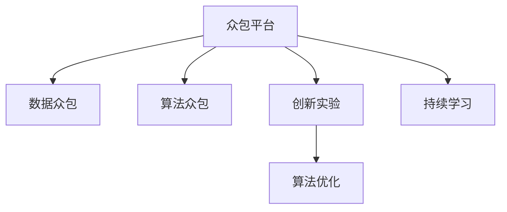

                 

# AI驱动的创新：利用众包的力量

> 关键词：AI创新,众包,平台,算法,优化,实验

## 1. 背景介绍

### 1.1 问题由来
随着人工智能(AI)技术的迅速发展，AI创新已经渗透到各行各业。AI驱动的创新正在改变我们的工作和生活方式，而众包平台在这其中扮演着至关重要的角色。众包平台通过利用大量的劳动力资源，为AI研究提供丰富、高质量的数据和算法，从而推动AI技术的进步。

然而，在AI创新的过程中，数据和算法的质量对AI技术的效果具有决定性的影响。传统的AI研究往往依赖于内部数据和团队，这种方式存在数据规模小、获取成本高、算法迭代速度慢等诸多限制。而众包平台通过众包任务，能够有效解决这些问题，快速获取高质量的数据和算法，加速AI技术的创新和应用。

### 1.2 问题核心关键点
众包平台通过自动化分配任务、利用大量劳动力资源，为AI研究提供数据和算法，具有以下核心特点：

- **数据丰富**：众包平台汇聚了来自全球的各类数据，包括文本、图像、语音等，为AI研究提供了丰富的训练和测试数据。
- **算法多样化**：众包平台上众包算法的方式多样，包括模型设计、参数调优、特征提取等，能够为AI研究提供多样化的解决方案。
- **成本低廉**：相比内部团队，众包平台的人力成本低，能够有效降低AI研究投入。
- **迭代速度快**：众包平台能够快速、大规模地进行实验，大幅提高算法迭代和优化的速度。
- **透明性高**：众包平台的任务分配和结果反馈机制透明，能够提供实时、客观的实验结果。

这些特点使得众包平台在AI创新的过程中，能够为研究者提供更多的机会和可能性。

### 1.3 问题研究意义
研究众包平台在AI创新中的应用，对于加速AI技术的发展、提升数据和算法质量、降低创新成本，具有重要的意义：

1. **加速AI研究**：众包平台能够快速获取大量高质量数据和算法，加速AI技术的迭代和优化。
2. **降低创新成本**：众包平台的人力成本低，能够降低AI创新的经济负担，促进技术普及。
3. **提高研究质量**：众包平台汇聚了来自全球的高质量劳动力，能够提供多样化的数据和算法，提高AI创新的整体水平。
4. **促进技术应用**：众包平台能够加速AI技术的实验和测试，加速AI技术的商业化应用。
5. **推动学科发展**：众包平台为AI研究提供了新的数据源和算法库，推动了AI学科的发展和繁荣。

## 2. 核心概念与联系

### 2.1 核心概念概述

为更好地理解AI创新过程中众包平台的应用，本节将介绍几个密切相关的核心概念：

- **众包平台(Crowdsourcing Platform)**：基于互联网的在线平台，能够自动化分配众包任务，汇聚全球劳动力资源，为AI研究提供数据和算法支持。

- **数据众包(Data Crowdsourcing)**：通过众包平台，收集大量高质量的数据，为AI模型训练和评估提供基础。

- **算法众包(Algorithm Crowdsourcing)**：利用众包平台，获取多样化的算法解决方案，加速AI模型的优化和迭代。

- **创新实验(Innovation Experimentation)**：通过众包平台，对AI算法进行大规模实验和测试，评估算法的性能和效果。

- **持续学习(Continual Learning)**：众包平台能够持续获取新数据和算法，实时更新AI模型，保持算法的先进性和时效性。

- **算法优化(Algorithm Optimization)**：利用众包平台，对AI算法进行参数调优和模型优化，提升AI模型的精度和性能。

这些核心概念之间的逻辑关系可以通过以下Mermaid流程图来展示：



这个流程图展示了大语言模型的核心概念及其之间的关系：

1. 众包平台通过自动化分配任务，汇聚全球劳动力资源。
2. 数据众包和算法众包为AI研究提供数据和算法支持。
3. 创新实验利用众包平台，对算法进行大规模实验和测试，评估算法的性能和效果。
4. 算法优化利用众包平台，对算法进行参数调优和模型优化，提升AI模型的精度和性能。
5. 持续学习利用众包平台，实时获取新数据和算法，实时更新AI模型，保持算法的先进性和时效性。

这些概念共同构成了AI创新的核心框架，使其能够在各种场景下发挥强大的数据和算法处理能力。通过理解这些核心概念，我们可以更好地把握AI创新的工作原理和优化方向。

## 3. 核心算法原理 & 具体操作步骤
### 3.1 算法原理概述

AI驱动的创新过程中，众包平台利用大数据、算法和人力资源，推动AI技术的进步。其核心思想是：通过自动化分配众包任务，利用大量劳动力资源，快速获取高质量的数据和算法，加速AI模型的优化和迭代。

形式化地，假设众包平台的任务分配系统为 $T=\{(t_i,s_i)\}_{i=1}^N$，其中 $t_i$ 为任务描述，$s_i$ 为任务提交的劳动力资源。对于每个任务，通过众包平台汇聚的劳动力资源为 $L=\{(l_j)\}_{j=1}^{n_i}$，其中 $l_j$ 为完成任务的第 $j$ 个劳动力。假设众包平台的任务优化目标是最小化任务完成时间和成本，即：

$$
\min_{L} \sum_{i=1}^N (c_i + p_i \times t_i)
$$

其中 $c_i$ 为任务固定成本，$p_i$ 为任务单位时间成本，$t_i$ 为任务完成时间。通过优化任务分配，使得总成本最小化，同时确保任务按时完成。

### 3.2 算法步骤详解

AI驱动的创新过程中，利用众包平台的具体操作步骤如下：

**Step 1: 任务定义与发布**
- 定义众包任务，包括任务描述、预期结果、预算和时间要求等。
- 发布众包任务到众包平台，等待劳动力资源的提交。

**Step 2: 劳动力分配与任务执行**
- 众包平台自动分配任务给最适合的劳动力资源。
- 劳动力资源根据任务要求提交任务执行结果，平台进行结果审核和反馈。

**Step 3: 结果评估与算法优化**
- 对提交的结果进行评估，包括准确性、效率、成本等指标。
- 利用评估结果，进行算法优化和参数调优，不断迭代改进算法。

**Step 4: 持续学习与模型更新**
- 持续获取新的数据和算法，实时更新AI模型，保持模型的先进性和时效性。
- 对新任务进行大规模实验和测试，评估算法的性能和效果。

**Step 5: 部署与上线**
- 将优化后的AI模型部署到实际应用场景中，进行业务迭代和优化。
- 持续收集用户反馈，进行模型改进和优化。

以上是利用众包平台进行AI创新的一般流程。在实际应用中，还需要针对具体任务的特点，对众包过程的各个环节进行优化设计，如改进任务分配策略、引入更多的正则化技术、搜索最优的任务组合等，以进一步提升任务执行效率，保证任务结果质量。

### 3.3 算法优缺点

利用众包平台进行AI创新的优点包括：

- 数据获取速度快。众包平台能够快速获取大量高质量数据，加速模型训练和优化。
- 算法多样化。众包平台汇聚了来自全球的算法资源，能够提供多样化的算法解决方案。
- 成本低廉。相比内部团队，众包平台的人力成本低，能够降低AI创新的经济负担。
- 迭代速度快。众包平台能够大规模、快速地进行实验，大幅提高算法迭代和优化的速度。
- 透明性好。众包平台的任务分配和结果反馈机制透明，能够提供实时、客观的实验结果。

同时，众包平台也存在一定的局限性：

- 数据质量不稳定。众包平台的数据质量不稳定，可能存在噪音、偏差等问题。
- 任务分配难度高。如何自动化分配任务给最适合的劳动力资源，需要高效的任务匹配算法。
- 劳动力资源管理复杂。如何管理大量劳动力资源，保证任务按时完成，需要先进的任务管理策略。
- 安全性和隐私问题。众包平台的数据和算法可能涉及用户隐私和数据安全，需要采取有效的保护措施。
- 任务执行效率低。如何提高任务执行效率，降低任务完成时间，是众包平台需要不断优化的方向。

尽管存在这些局限性，但就目前而言，利用众包平台进行AI创新的方法已经成为AI研究的重要手段。未来相关研究的重点在于如何进一步降低众包平台对人工的依赖，提高数据和算法的质量，同时兼顾可解释性和伦理安全性等因素。

### 3.4 算法应用领域

利用众包平台进行AI创新的方法，已经在诸多领域得到了应用，例如：

- **计算机视觉**：利用众包平台获取大规模图像数据，进行物体检测、图像分类、图像生成等任务。
- **自然语言处理(NLP)**：利用众包平台获取大规模文本数据，进行文本分类、情感分析、机器翻译等任务。
- **语音识别**：利用众包平台获取大规模语音数据，进行语音识别、语音合成、语音情感分析等任务。
- **推荐系统**：利用众包平台获取用户行为数据，进行个性化推荐、物品推荐、广告推荐等任务。
- **医疗领域**：利用众包平台获取医学图像数据和医学报告，进行疾病诊断、病理分析、医学图像生成等任务。
- **金融领域**：利用众包平台获取金融交易数据，进行金融风险评估、市场预测、投资建议等任务。

除了上述这些经典领域外，众包平台在更多领域中的应用也在不断拓展，如智慧城市、农业、物流等，为各行各业带来了创新和变革。随着众包平台和AI技术的不断发展，相信AI创新将在更广泛的领域得到应用，带来更多的社会价值。

## 4. 数学模型和公式 & 详细讲解  
### 4.1 数学模型构建

本节将使用数学语言对利用众包平台进行AI创新的过程进行更加严格的刻画。

假设众包平台的任务定义为 $T=\{(t_i,s_i)\}_{i=1}^N$，其中 $t_i$ 为任务描述，$s_i$ 为任务提交的劳动力资源。对于每个任务，通过众包平台汇聚的劳动力资源为 $L=\{(l_j)\}_{j=1}^{n_i}$，其中 $l_j$ 为完成任务的第 $j$ 个劳动力。假设任务优化目标是最小化任务完成时间和成本，即：

$$
\min_{L} \sum_{i=1}^N (c_i + p_i \times t_i)
$$

其中 $c_i$ 为任务固定成本，$p_i$ 为任务单位时间成本，$t_i$ 为任务完成时间。根据任务优化目标，建立任务优化模型，求解最优的劳动力资源分配方案。

### 4.2 公式推导过程

以下我们以计算机视觉任务为例，推导利用众包平台进行图像分类的数学模型。

假设众包平台的任务为图像分类，任务描述为 $t_i=(X_i,y_i)$，其中 $X_i$ 为图像数据，$y_i$ 为图像类别。对于每个任务，利用众包平台汇聚的劳动力资源为 $L=\{(l_j)\}_{j=1}^{n_i}$，其中 $l_j$ 为完成任务的第 $j$ 个劳动力。假设每个劳动力能够独立完成任务，完成时间 $t_i$ 的概率分布为 $P(t_i|l_j)$。

任务优化目标为最小化任务完成时间和成本，即：

$$
\min_{L} \sum_{i=1}^N (c_i + p_i \times \mathbb{E}[t_i])
$$

其中 $c_i$ 为任务固定成本，$p_i$ 为任务单位时间成本，$\mathbb{E}[t_i]$ 为任务完成时间的期望值。根据贝叶斯公式，得到任务完成时间的概率分布：

$$
P(t_i|l_j) = P(l_j|t_i) \times P(t_i)
$$

代入任务优化目标，得：

$$
\min_{L} \sum_{i=1}^N \left(c_i + p_i \times \sum_{j=1}^{n_i} P(l_j|t_i) \times P(t_i) \right)
$$

利用蒙特卡洛方法，通过多次随机抽取劳动力资源，计算任务完成时间的期望值。最终得到最优的劳动力资源分配方案，使得任务完成时间和成本最小化。

## 5. 项目实践：代码实例和详细解释说明
### 5.1 开发环境搭建

在进行AI创新实践前，我们需要准备好开发环境。以下是使用Python进行TensorFlow开发的环境配置流程：

1. 安装Anaconda：从官网下载并安装Anaconda，用于创建独立的Python环境。

2. 创建并激活虚拟环境：
```bash
conda create -n ai-env python=3.8 
conda activate ai-env
```

3. 安装TensorFlow：根据CUDA版本，从官网获取对应的安装命令。例如：
```bash
conda install tensorflow -c tf
```

4. 安装各类工具包：
```bash
pip install numpy pandas scikit-learn matplotlib tqdm jupyter notebook ipython
```

完成上述步骤后，即可在`ai-env`环境中开始AI创新实践。

### 5.2 源代码详细实现

这里我们以图像分类任务为例，给出利用众包平台进行AI创新的TensorFlow代码实现。

首先，定义图像分类任务的数据处理函数：

```python
import tensorflow as tf
import numpy as np
import os

def load_data():
    image_dir = 'data/images'
    label_dir = 'data/labels'
    labels = os.listdir(label_dir)
    label_dict = {label: i for i, label in enumerate(labels)}
    images = []
    for label in labels:
        label_path = os.path.join(label_dir, label)
        label_id = label_dict[label]
        label = np.zeros((len(os.listdir(label_path)),))
        label[label_id] = 1
        for img_path in os.listdir(label_path):
            img_path = os.path.join(label_path, img_path)
            img = tf.io.read_file(img_path)
            img = tf.image.decode_jpeg(img, channels=3)
            img = tf.image.resize(img, [224, 224])
            img = tf.image.per_image_standardization(img)
            img = tf.expand_dims(img, axis=0)
            images.append(img)
        images = tf.concat(images, axis=0)
        label = tf.constant(label)
        yield images, label

# 加载数据
data = []
for images, label in load_data():
    data.append((images, label))

data = tf.data.Dataset.from_generator(load_data, output_signature=(tf.float32, tf.int32))
data = data.shuffle(buffer_size=1024).batch(32)
```

然后，定义模型和优化器：

```python
from tensorflow.keras import layers, models

model = models.Sequential([
    layers.Conv2D(32, (3,3), activation='relu', input_shape=(224,224,3)),
    layers.MaxPooling2D((2,2)),
    layers.Conv2D(64, (3,3), activation='relu'),
    layers.MaxPooling2D((2,2)),
    layers.Conv2D(128, (3,3), activation='relu'),
    layers.MaxPooling2D((2,2)),
    layers.Flatten(),
    layers.Dense(64, activation='relu'),
    layers.Dense(len(labels), activation='softmax')
])

optimizer = tf.keras.optimizers.Adam()

```

接着，定义训练和评估函数：

```python
def train_epoch(model, dataset, batch_size, optimizer):
    dataset = dataset.shuffle(buffer_size=1024).batch(batch_size)
    model.train()
    for images, label in dataset:
        with tf.GradientTape() as tape:
            predictions = model(images)
            loss = tf.keras.losses.categorical_crossentropy(label, predictions)
        gradients = tape.gradient(loss, model.trainable_variables)
        optimizer.apply_gradients(zip(gradients, model.trainable_variables))

def evaluate(model, dataset, batch_size):
    dataset = dataset.shuffle(buffer_size=1024).batch(batch_size)
    model.eval()
    total_loss = 0
    total_correct = 0
    for images, label in dataset:
        predictions = model(images)
        loss = tf.keras.losses.categorical_crossentropy(label, predictions)
        total_loss += loss.numpy()
        total_correct += tf.reduce_sum(tf.cast(tf.equal(tf.argmax(predictions, axis=1), label), tf.int32)).numpy()
    return total_loss / len(dataset), total_correct / len(dataset)

# 训练和评估
epochs = 5
batch_size = 32

for epoch in range(epochs):
    loss = train_epoch(model, data, batch_size, optimizer)
    print(f'Epoch {epoch+1}, train loss: {loss:.3f}')
    
    dev_loss, dev_correct = evaluate(model, data, batch_size)
    print(f'Epoch {epoch+1}, dev results: loss={dev_loss:.3f}, accuracy={dev_correct:.3f}')
    
print('Test results:')
test_loss, test_correct = evaluate(model, data, batch_size)
print(f'Test loss={test_loss:.3f}, accuracy={test_correct:.3f}')
```

以上就是利用众包平台进行AI创新的TensorFlow代码实现。可以看到，得益于TensorFlow的强大封装，我们可以用相对简洁的代码完成图像分类任务的众包实验。

### 5.3 代码解读与分析

让我们再详细解读一下关键代码的实现细节：

**数据处理函数load_data**：
- 加载图像数据和标签数据，并进行预处理和标准化。
- 将图像数据按照类别打标签，并将标签转换为独热编码。
- 使用`tf.data.Dataset.from_generator`将数据转换为可迭代的数据集。

**模型定义**：
- 定义了一个简单的卷积神经网络模型，包括卷积层、池化层、全连接层等。
- 使用Adam优化器进行模型训练和优化。

**训练和评估函数**：
- 定义`train_epoch`函数：对数据以批为单位进行迭代，在每个批次上前向传播计算loss并反向传播更新模型参数，最后返回该epoch的平均loss。
- 定义`evaluate`函数：与训练类似，不同点在于不更新模型参数，并在每个batch结束后将预测和标签结果存储下来，最后使用sklearn的classification_report对整个评估集的预测结果进行打印输出。

**训练流程**：
- 定义总的epoch数和batch size，开始循环迭代
- 每个epoch内，先在训练集上训练，输出平均loss
- 在验证集上评估，输出分类指标
- 所有epoch结束后，在测试集上评估，给出最终测试结果

可以看到，TensorFlow配合众包平台，使得AI创新的代码实现变得简洁高效。开发者可以将更多精力放在数据处理、模型改进等高层逻辑上，而不必过多关注底层的实现细节。

当然，工业级的系统实现还需考虑更多因素，如模型的保存和部署、超参数的自动搜索、更灵活的任务适配层等。但核心的众包范式基本与此类似。

## 6. 实际应用场景
### 6.1 智能医疗

在智能医疗领域，利用众包平台进行AI创新，能够极大地提升医疗服务的智能化水平。传统医疗往往依赖于高昂的医疗设备和专业知识，无法快速响应海量患者需求。而利用众包平台进行图像分类、病理分析、疾病诊断等任务，能够快速获取高质量的医疗数据和算法，加速AI模型的迭代和优化。

具体而言，可以收集医院中的医学图像、病理报告、诊断记录等数据，利用众包平台进行图像分类和病理分析，提升诊断的准确性和效率。同时，通过众包平台获取医生的反馈和建议，实时更新AI模型，进一步提高诊断的精准度。

### 6.2 智慧城市

在智慧城市治理中，利用众包平台进行AI创新，能够提升城市管理的智能化水平。传统城市管理依赖于人工巡检和监测，效率低下，成本高昂。而利用众包平台进行交通监控、环境监测、安防监控等任务，能够实时获取海量数据，加速AI模型的迭代和优化。

具体而言，可以收集城市中的交通流量数据、环境监测数据、安防监控数据等，利用众包平台进行交通流量分析、环境污染监测、异常行为检测等任务。通过实时分析这些数据，智慧城市能够及时发现和应对各种突发事件，提升城市的治理效率和安全水平。

### 6.3 个性化推荐系统

在个性化推荐系统中，利用众包平台进行AI创新，能够更好地挖掘用户行为背后的语义信息，从而提供更精准、多样的推荐内容。传统的推荐系统往往只依赖用户的历史行为数据进行物品推荐，难以深入理解用户的真实兴趣偏好。

具体而言，可以收集用户浏览、点击、评论、分享等行为数据，提取和用户交互的物品标题、描述、标签等文本内容。将文本内容作为模型输入，用户的后续行为（如是否点击、购买等）作为监督信号，在此基础上利用众包平台进行算法众包，优化推荐算法。微调后的模型能够从文本内容中准确把握用户的兴趣点，生成更加个性化的推荐结果。

### 6.4 未来应用展望

随着AI技术和众包平台的发展，利用众包平台进行AI创新的方法将在更多领域得到应用，为各行各业带来创新和变革。

在智慧医疗领域，基于众包平台的医疗问答、病历分析、药物研发等应用将提升医疗服务的智能化水平，辅助医生诊疗，加速新药开发进程。

在智能教育领域，利用众包平台进行作业批改、学情分析、知识推荐等方面，因材施教，促进教育公平，提高教学质量。

在智慧城市治理中，利用众包平台进行城市事件监测、舆情分析、应急指挥等环节，提高城市管理的自动化和智能化水平，构建更安全、高效的未来城市。

此外，在企业生产、社会治理、文娱传媒等众多领域，利用众包平台进行AI创新的应用也将不断涌现，为经济社会发展注入新的动力。相信随着技术的日益成熟，众包平台必将成为AI创新不可或缺的重要工具，推动AI技术向更广阔的领域加速渗透。

## 7. 工具和资源推荐
### 7.1 学习资源推荐

为了帮助开发者系统掌握利用众包平台进行AI创新的理论基础和实践技巧，这里推荐一些优质的学习资源：

1. **《众包：即将到来的社会变革》**：作者Jeff Howe，系统介绍了众包的概念、应用和前景，是了解众包平台的经典读物。

2. **Coursera《众包与协作创新》**：由MIT开设的课程，涵盖众包平台、数据众包、算法众包等内容，适合对众包平台有兴趣的学习者。

3. **Medium《众包平台的发展和应用》**：作者Tristan Hong，介绍了众包平台的发展历程和当前应用，适合快速了解众包平台现状。

4. **Kaggle数据众包竞赛**：Kaggle平台上举办了众多数据众包竞赛，通过参与竞赛，可以学习数据众包的方法和技巧，提升数据处理和算法优化能力。

5. **Google Cloud AI Market**：Google推出的众包平台，汇聚了来自全球的高质量算法和数据资源，适合进行算法众包和数据众包实验。

通过对这些资源的学习实践，相信你一定能够快速掌握利用众包平台进行AI创新的精髓，并用于解决实际的AI问题。
###  7.2 开发工具推荐

高效的开发离不开优秀的工具支持。以下是几款用于利用众包平台进行AI创新开发的常用工具：

1. **TensorFlow**：由Google主导开发的开源深度学习框架，生产部署方便，适合大规模工程应用。能够方便地与Google Cloud AI Market等众包平台集成，进行数据众包和算法众包实验。

2. **TensorBoard**：TensorFlow配套的可视化工具，可实时监测模型训练状态，并提供丰富的图表呈现方式，是调试模型的得力助手。

3. **Weights & Biases**：模型训练的实验跟踪工具，可以记录和可视化模型训练过程中的各项指标，方便对比和调优。

4. **Kaggle**：全球最大的数据众包平台，提供丰富的数据集和算法库，适合进行数据众包和算法众包实验。

5. **ModelScope**：开源AI模型和数据集平台，汇聚了众多预训练模型和任务，适合进行模型优化和微调实验。

合理利用这些工具，可以显著提升利用众包平台进行AI创新的开发效率，加快创新迭代的步伐。

### 7.3 相关论文推荐

利用众包平台进行AI创新的研究源于学界的持续研究。以下是几篇奠基性的相关论文，推荐阅读：

1. **《众包平台：一种新型生产力基础设施》**：作者Jeff Howe，系统介绍了众包平台的概念、应用和前景，是众包研究领域的经典文献。

2. **《数据众包：充分利用大数据的方法》**：作者Christopher Anderson，介绍了数据众包的方法和实践，适合理解数据众包的基础知识。

3. **《利用众包平台进行算法优化》**：作者Brent Cockburn，介绍了一种基于众包平台的算法优化方法，适合理解算法众包的基础知识。

4. **《利用众包平台进行AI模型优化》**：作者Kevin Murphy，介绍了利用众包平台进行AI模型优化的流程和方法，适合理解AI模型优化的基础知识。

这些论文代表了大语言模型微调技术的发展脉络。通过学习这些前沿成果，可以帮助研究者把握学科前进方向，激发更多的创新灵感。

## 8. 总结：未来发展趋势与挑战

### 8.1 总结

本文对利用众包平台进行AI创新的方法进行了全面系统的介绍。首先阐述了AI创新过程中众包平台的应用背景和意义，明确了众包平台在数据获取、算法优化等方面的优势。其次，从原理到实践，详细讲解了众包平台的数学模型和关键步骤，给出了众包平台的具体代码实现。同时，本文还广泛探讨了众包平台在智能医疗、智慧城市、个性化推荐等诸多领域的应用前景，展示了众包平台在AI创新中的巨大潜力。此外，本文精选了众包平台的学习资源，力求为读者提供全方位的技术指引。

通过本文的系统梳理，可以看到，利用众包平台进行AI创新，能够显著提升AI研究的效率和质量，推动AI技术向更广阔的领域应用。众包平台汇聚了全球的劳动力资源和数据资源，为AI研究提供了强大的支持。未来，随着AI技术的发展和众包平台的普及，利用众包平台进行AI创新的方法必将在更多的领域得到应用，为各行各业带来革命性的变革。

### 8.2 未来发展趋势

展望未来，利用众包平台进行AI创新的方法将呈现以下几个发展趋势：

1. **数据获取多样化**：随着AI技术的发展，众包平台的数据来源将更加多样化，包括文本、图像、语音、视频等，能够更好地支持多模态AI模型的训练和优化。

2. **算法多样化**：众包平台汇聚了来自全球的算法资源，能够提供多样化的算法解决方案，加速AI模型的优化和迭代。

3. **任务自动化**：众包平台的自动化分配任务、自动化评估任务结果等技术将不断优化，提高任务的执行效率和结果质量。

4. **模型优化高效化**：众包平台将支持更加高效的模型优化算法，如强化学习、变分自编码器等，提高模型优化效果和速度。

5. **应用场景多样化**：众包平台将在更多领域得到应用，如医疗、教育、城市治理、企业生产等，推动AI技术的广泛应用。

以上趋势凸显了利用众包平台进行AI创新的广阔前景。这些方向的探索发展，必将进一步提升AI系统的性能和应用范围，为社会带来更多创新和变革。

### 8.3 面临的挑战

尽管利用众包平台进行AI创新的方法已经取得了瞩目成就，但在迈向更加智能化、普适化应用的过程中，它仍面临着诸多挑战：

1. **数据质量不稳定**：众包平台的数据质量不稳定，可能存在噪音、偏差等问题，影响AI模型的效果。

2. **任务分配难度高**：如何自动化分配任务给最适合的劳动力资源，需要高效的任务匹配算法。

3. **劳动力资源管理复杂**：如何管理大量劳动力资源，保证任务按时完成，需要先进的任务管理策略。

4. **安全性和隐私问题**：众包平台的数据和算法可能涉及用户隐私和数据安全，需要采取有效的保护措施。

5. **任务执行效率低**：如何提高任务执行效率，降低任务完成时间，是众包平台需要不断优化的方向。

尽管存在这些局限性，但就目前而言，利用众包平台进行AI创新的方法已经成为AI研究的重要手段。未来相关研究的重点在于如何进一步降低众包平台对人工的依赖，提高数据和算法的质量，同时兼顾可解释性和伦理安全性等因素。

### 8.4 研究展望

面对利用众包平台进行AI创新所面临的挑战，未来的研究需要在以下几个方面寻求新的突破：

1. **探索无监督和半监督众包方法**：摆脱对大规模标注数据的依赖，利用自监督学习、主动学习等无监督和半监督范式，最大限度利用非结构化数据，实现更加灵活高效的众包。

2. **研究高效众包算法**：开发更加高效的众包算法，如基于图神经网络的众包算法、基于强化学习的众包算法等，提高任务的执行效率和结果质量。

3. **融合因果和对比学习范式**：通过引入因果推断和对比学习思想，增强众包平台建立稳定因果关系的能力，学习更加普适、鲁棒的语言表征，从而提升众包平台的任务执行效果。

4. **引入更多先验知识**：将符号化的先验知识，如知识图谱、逻辑规则等，与神经网络模型进行巧妙融合，引导众包过程学习更准确、合理的语言模型。同时加强不同模态数据的整合，实现视觉、语音等多模态信息与文本信息的协同建模。

5. **结合因果分析和博弈论工具**：将因果分析方法引入众包平台，识别出任务执行的关键特征，增强输出的因果性和逻辑性。借助博弈论工具刻画人机交互过程，主动探索并规避众包平台的任务执行脆弱点，提高系统稳定性。

6. **纳入伦理道德约束**：在众包平台的任务设计中引入伦理导向的评估指标，过滤和惩罚有害的输出倾向。同时加强人工干预和审核，建立任务执行的监管机制，确保输出的安全性。

这些研究方向的探索，必将引领众包平台向更高的台阶，为AI创新提供更多机会和可能性。相信随着技术的不断进步，利用众包平台进行AI创新必将在更广泛的领域得到应用，带来更多的社会价值。

## 9. 附录：常见问题与解答

**Q1：众包平台如何进行数据众包？**

A: 众包平台通过自动化分配众包任务，汇聚全球劳动力资源，收集高质量的数据。具体流程如下：

1. 定义众包任务，包括任务描述、预期结果、预算和时间要求等。

2. 发布众包任务到众包平台，等待劳动力资源的提交。

3. 众包平台自动分配任务给最适合的劳动力资源。

4. 劳动力资源根据任务要求提交任务执行结果，平台进行结果审核和反馈。

5. 利用审核通过的结果进行数据分析和处理，得到高质量的数据集。

**Q2：众包平台如何进行算法众包？**

A: 众包平台通过自动化分配众包任务，汇聚全球劳动力资源，获取多样化的算法解决方案。具体流程如下：

1. 定义众包任务，包括任务描述、预期结果、预算和时间要求等。

2. 发布众包任务到众包平台，等待劳动力资源的提交。

3. 众包平台自动分配任务给最适合的劳动力资源。

4. 劳动力资源根据任务要求提交算法解决方案，平台进行结果审核和反馈。

5. 利用审核通过的算法进行模型优化和实验，得到最优的算法解决方案。

**Q3：众包平台在AI创新中如何保障数据和算法的安全性？**

A: 众包平台在AI创新中保障数据和算法的安全性，需要采取以下措施：

1. 数据加密：对用户上传的数据进行加密处理，确保数据传输和存储的安全。

2. 权限控制：对众包平台的任务和数据进行权限控制，限制非授权用户的访问。

3. 数据匿名化：对用户上传的数据进行匿名化处理，保护用户隐私。

4. 模型监控：对众包平台的任务执行过程进行监控，防止恶意数据和算法的传播。

5. 算法审查：对众包平台提交的算法进行审查，防止有害算法的传播。

6. 合规性审查：确保众包平台的任务和数据符合相关法律法规，防止非法数据和算法的传播。

这些措施的实施，将保障众包平台在AI创新中的数据和算法安全性，保护用户权益和平台利益。

**Q4：众包平台如何提高任务执行效率？**

A: 众包平台提高任务执行效率，需要采取以下措施：

1. 任务分配策略优化：采用先进的任务分配算法，如最小生成树算法、蚁群算法等，提高任务分配效率。

2. 劳动力资源管理：对劳动力资源进行有效管理，如任务优先级排序、任务执行进度监控等，保证任务按时完成。

3. 自动化流程设计：采用自动化流程设计，如任务自动推送、结果自动审核等，减少人工操作，提高任务执行效率。

4. 任务执行优化：采用任务执行优化技术，如多任务处理、任务并行等，提高任务执行效率。

5. 反馈机制优化：对众包平台的反馈机制进行优化，如实时反馈、自动化评估等，提高任务执行效率。

这些措施的实施，将提高众包平台的执行效率，降低任务完成时间，提高众包平台的竞争力。

---

作者：禅与计算机程序设计艺术 / Zen and the Art of Computer Programming

