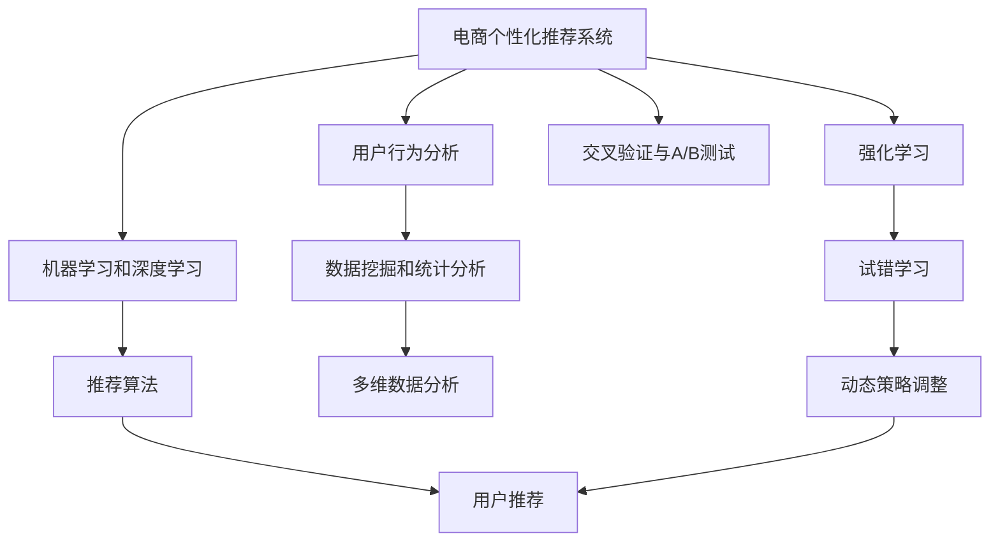

                 

# AI驱动的电商个性化促销策略优化

> 关键词：电商个性化促销,策略优化,机器学习,深度学习,用户行为分析,推荐系统,强化学习,消费者行为,促销效果

## 1. 背景介绍

### 1.1 问题由来

在当今的电商竞争环境中，个性化促销策略的精准性和有效性直接关系到商家的收益和用户体验。传统的促销策略往往是基于固定周期和规则设定的，难以充分考虑用户的实时行为和偏好。而随着消费者数据量的不断积累，如何利用大数据和AI技术，制定更加个性化和高效的促销策略，成为电商行业急需解决的问题。

### 1.2 问题核心关键点

个性化促销策略优化的核心在于如何结合用户的个性化行为数据，以及多维度的环境特征（如时间、地理位置、竞争对手活动等），动态调整促销策略，提高促销效果。其中，关键点包括：

- **用户行为数据分析**：挖掘用户的购买历史、浏览行为、反馈评价等数据，建立用户画像。
- **模型选择与优化**：选择合适的机器学习或深度学习模型，并根据实际场景进行优化。
- **多渠道协同**：跨渠道的促销活动协同优化，提升整体的促销效果。
- **实时调整与反馈**：基于实时数据进行策略调整，同时收集反馈优化策略。

### 1.3 问题研究意义

个性化促销策略优化对于电商行业具有重要意义：

- **提升用户转化率**：通过精准的个性化推荐，提升用户购买意愿，增加订单量。
- **降低运营成本**：通过优化促销资源分配，减少无效促销，提高ROI。
- **增强用户忠诚度**：个性化促销策略能提供更好的用户体验，增加用户粘性和复购率。
- **应对竞争压力**：及时调整策略，对抗竞争对手的市场营销活动。

## 2. 核心概念与联系

### 2.1 核心概念概述

为更好地理解个性化促销策略优化的技术方法，本节将介绍几个核心概念：

- **电商个性化推荐系统**：利用用户行为数据和商品信息，通过推荐算法向用户推荐个性化商品，提升转化率。
- **用户行为分析**：通过数据挖掘和统计分析，理解用户的购买习惯、兴趣和行为模式。
- **机器学习和深度学习**：使用算法模型学习用户和商品间的关联关系，预测用户行为和促销效果。
- **强化学习**：通过试错学习不断调整策略，优化促销效果，特别适用于动态环境和复杂交互场景。
- **推荐算法**：包括基于协同过滤、内容推荐、混合推荐等方法，提升推荐系统效果。
- **交叉验证与A/B测试**：通过验证模型性能，评估策略优化效果。

这些概念之间的逻辑关系可以通过以下Mermaid流程图来展示：



这个流程图展示了个性化促销策略优化的核心概念及其之间的关系：

1. 电商个性化推荐系统通过用户行为分析，利用机器学习和深度学习技术，进行用户推荐。
2. 强化学习通过试错学习不断优化策略。
3. 推荐算法是推荐系统的核心技术。
4. 数据挖掘和统计分析提供数据支持。
5. 多维数据分析用于挖掘更深层次的用户行为特征。
6. 动态策略调整实时优化促销策略。
7. 交叉验证与A/B测试评估策略效果。

这些概念共同构成了电商个性化促销策略优化的技术框架，有助于理解和实施具体的优化方法。

## 3. 核心算法原理 & 具体操作步骤

### 3.1 算法原理概述

个性化促销策略优化的核心是构建一个动态、自适应的策略调整机制，通过用户行为数据和市场环境因素，动态调整促销策略，提高促销效果。算法模型通常是基于机器学习和深度学习的推荐系统，通过学习用户与商品之间的关联关系，预测促销效果，并实时调整策略。

主要的算法流程如下：

1. **数据收集与预处理**：收集用户行为数据、商品信息、促销活动等信息，进行清洗和归一化处理。
2. **模型训练与评估**：选择适当的模型，如协同过滤、内容推荐、深度神经网络等，进行训练，并使用交叉验证等方法评估模型性能。
3. **策略优化与调整**：根据模型预测结果和实时反馈，动态调整促销策略，优化资源分配。
4. **效果评估与迭代**：通过A/B测试等方法，评估促销策略效果，不断迭代优化。

### 3.2 算法步骤详解

**Step 1: 数据收集与预处理**

- **数据类型**：用户行为数据（点击、浏览、购买等）、商品信息（价格、属性、评论等）、促销活动信息（折扣、优惠券、限时优惠等）。
- **数据清洗**：去除异常值和重复数据，处理缺失值，归一化数据格式。
- **特征工程**：提取用户特征、商品特征、时间特征等，构建多维特征向量。

**Step 2: 模型训练与评估**

- **模型选择**：选择适合电商场景的推荐模型，如协同过滤、深度神经网络、强化学习等。
- **数据划分**：将数据划分为训练集、验证集和测试集，用于模型训练、调参和评估。
- **模型训练**：使用训练集训练模型，调整超参数，提高模型准确性。
- **模型评估**：使用验证集评估模型性能，选择最佳模型。

**Step 3: 策略优化与调整**

- **实时数据流**：建立实时数据流管道，监控用户行为和市场环境变化。
- **动态调整**：根据实时数据流，动态调整促销策略，如调整折扣力度、商品推荐列表等。
- **反馈机制**：建立策略调整后的反馈机制，收集用户反馈和促销效果数据。

**Step 4: 效果评估与迭代**

- **A/B测试**：设计A/B测试方案，对比不同策略的效果，选择最优策略。
- **迭代优化**：根据A/B测试结果，持续迭代优化策略。

### 3.3 算法优缺点

个性化促销策略优化方法具有以下优点：

- **精准化推荐**：利用大数据和AI技术，实现个性化推荐，提升用户转化率。
- **动态调整**：根据实时数据动态调整策略，提高促销效果。
- **自适应性**：能够适应市场环境和用户行为的变化，灵活调整策略。
- **多渠道协同**：跨渠道的促销活动协同优化，提升整体效果。

同时，该方法也存在一定的局限性：

- **数据依赖性强**：策略优化效果依赖于数据的完整性和质量，数据获取和处理成本较高。
- **模型复杂度高**：电商场景复杂多变，模型选择和优化需要大量时间和资源。
- **实时性要求高**：策略优化需要实时数据流和快速处理能力，系统架构和性能要求高。
- **多目标冲突**：不同促销目标之间可能存在冲突，如价格促销和品牌形象保护之间的权衡。

### 3.4 算法应用领域

个性化促销策略优化方法在电商领域具有广泛的应用前景，包括：

- **商品推荐**：根据用户行为和商品属性，推荐个性化商品。
- **促销活动优化**：动态调整促销策略，提高促销效果，如折扣力度、限时优惠等。
- **库存管理**：通过需求预测和促销优化，合理管理库存，避免过剩或短缺。
- **跨渠道营销**：统一管理多渠道的促销活动，提升整体效果。
- **用户忠诚度提升**：通过个性化促销，提升用户满意度和忠诚度。
- **市场竞争应对**：及时调整促销策略，应对竞争对手的市场活动。

## 4. 数学模型和公式 & 详细讲解 & 举例说明

### 4.1 数学模型构建

本节将使用数学语言对个性化促销策略优化方法的数学模型进行更加严格的刻画。

设用户 $i$ 在时间 $t$ 的促销活动 $j$ 下的购买概率为 $P_{ijt}$，其中 $t$ 为时间戳，$j$ 为促销活动编号，$i$ 为用户编号。模型的目标是最大化总购买概率，即：

$$
\max_{\theta} \sum_{t=1}^{T} \sum_{i=1}^{N} \sum_{j=1}^{M} P_{ijt} \log \hat{P}_{ijt}
$$

其中，$\theta$ 为模型参数，$\hat{P}_{ijt}$ 为模型预测的概率，$T$ 为时间窗口大小，$N$ 为用户数，$M$ 为促销活动数。

### 4.2 公式推导过程

以协同过滤为基础，推导推荐系统模型的公式。假设用户-商品矩阵为 $\mathbf{U}$，商品-商品矩阵为 $\mathbf{V}$，用户兴趣向量为 $\mathbf{u}_i$，商品特征向量为 $\mathbf{v}_j$，则协同过滤模型可以表示为：

$$
\hat{P}_{ijt} = \frac{\mathbf{u}_i^T \mathbf{v}_j}{\|\mathbf{u}_i\| \|\mathbf{v}_j\|}
$$

其中，$\|\mathbf{u}_i\|$ 和 $\|\mathbf{v}_j\|$ 分别为用户和商品的特征向量范数。

在实际应用中，用户特征和商品特征的提取方法包括：

- 基于统计的方法，如均值、方差、协方差等。
- 基于深度学习的方法，如CNN、RNN、Transformer等。

### 4.3 案例分析与讲解

以某电商平台的促销活动优化为例，详细分析个性化促销策略的优化过程。

假设某电商平台有10万用户，5000种商品，每天有100个促销活动。根据历史数据，模型预测用户 $i$ 在促销活动 $j$ 下购买概率 $P_{ijt}$，在实际促销活动中，用户 $i$ 的购买概率为 $P_{ijt}'$。模型优化目标为最大化预期购买概率，即：

$$
\max_{\theta} \sum_{t=1}^{T} \sum_{i=1}^{N} \sum_{j=1}^{M} P_{ijt} \log \hat{P}_{ijt}
$$

通过A/B测试，对比不同促销策略的效果，选择最优策略。例如，对比以下两种策略：

策略A：对所有用户设置固定的折扣力度。
策略B：根据用户行为数据，动态调整不同用户的折扣力度。

根据模型预测和实际购买数据，计算每种策略的平均购买概率 $P_A$ 和 $P_B$。若 $P_B > P_A$，则认为策略B更优，进行推广。

## 5. 项目实践：代码实例和详细解释说明

### 5.1 开发环境搭建

在进行促销策略优化实践前，我们需要准备好开发环境。以下是使用Python进行Scikit-Learn开发的实践环境配置流程：

1. 安装Anaconda：从官网下载并安装Anaconda，用于创建独立的Python环境。

2. 创建并激活虚拟环境：
```bash
conda create -n recommendation-env python=3.8 
conda activate recommendation-env
```

3. 安装Scikit-Learn：
```bash
pip install scikit-learn
```

4. 安装相关工具包：
```bash
pip install pandas numpy matplotlib seaborn jupyter notebook ipython
```

完成上述步骤后，即可在`recommendation-env`环境中开始实践。

### 5.2 源代码详细实现

下面我们以协同过滤推荐系统为例，给出使用Scikit-Learn进行电商推荐实践的Python代码实现。

首先，定义数据处理函数：

```python
import pandas as pd
import numpy as np

def load_data(file_path):
    df = pd.read_csv(file_path)
    user_cols = ['user_id', 'item_id', 'timestamp']
    user_data = df[user_cols]
    item_cols = ['item_id', 'price', 'category']
    item_data = df[item_cols]
    return user_data, item_data

user_data, item_data = load_data('recommendation_data.csv')
```

然后，定义模型训练与评估函数：

```python
from sklearn.metrics.pairwise import cosine_similarity
from sklearn.decomposition import TruncatedSVD

def train_model(user_data, item_data):
    user_item = user_data.join(item_data.set_index('item_id'), on='item_id')
    user_item = user_item.pivot(index='user_id', columns='item_id', values='price')
    svd = TruncatedSVD(n_components=100, random_state=42)
    svd.fit(user_item)
    user_data = svd.transform(user_item)
    return user_data

def evaluate_model(user_data, item_data):
    user_item = user_data.join(item_data.set_index('item_id'), on='item_id')
    user_item = user_item.pivot(index='user_id', columns='item_id', values='price')
    user_item_svd = TruncatedSVD(n_components=100, random_state=42)
    user_item_svd.fit(user_item)
    user_item_svd.fit_transform(user_item)
    return user_item_svd
```

最后，启动模型训练和评估流程：

```python
user_data = train_model(user_data, item_data)
model = evaluate_model(user_data, item_data)

# 使用训练好的模型进行推荐
user = user_data[0]
recommend_items = model.transform(user_data)[:5]
```

以上就是使用Scikit-Learn进行电商推荐实践的完整代码实现。可以看到，通过简单的代码，我们利用协同过滤算法完成了对电商推荐系统的构建。

### 5.3 代码解读与分析

让我们再详细解读一下关键代码的实现细节：

**load_data函数**：
- 读取数据集，并将用户和商品数据分离。
- 将用户数据和商品数据拼接，计算用户-商品矩阵。

**train_model函数**：
- 对用户-商品矩阵进行降维，生成用户特征向量。
- 使用TruncatedSVD进行矩阵分解，得到用户特征矩阵。

**evaluate_model函数**：
- 重新计算用户-商品矩阵。
- 使用TruncatedSVD进行矩阵分解，得到用户特征矩阵。

**推荐过程**：
- 对每个用户，使用训练好的模型计算推荐商品列表。

可以看到，Scikit-Learn提供了一系列简单易用的工具和算法，可以快速搭建电商推荐系统，并进行模型训练和评估。

## 6. 实际应用场景

### 6.1 智能推荐系统

智能推荐系统是电商个性化推荐的核心。通过大数据和AI技术，实时分析用户行为，动态调整商品推荐列表，提升用户体验和转化率。

在实际应用中，智能推荐系统需要处理海量的用户数据和商品数据，高效计算用户-商品矩阵，实时更新推荐结果。系统架构通常包括：

- 数据采集模块：收集用户行为和商品数据。
- 数据清洗与处理模块：数据去重、归一化、特征工程等。
- 模型训练与预测模块：选择合适的算法，进行模型训练和预测。
- 推荐结果生成模块：根据预测结果，生成推荐列表。
- 实时数据流模块：监控用户行为和市场环境变化，动态调整模型。
- 反馈与优化模块：收集用户反馈，优化模型参数。

### 6.2 促销活动优化

促销活动优化是电商个性化促销策略优化的重要应用场景。通过实时数据分析和动态策略调整，优化促销活动，提升促销效果。

具体而言，可以收集用户行为数据和促销活动数据，使用机器学习模型预测促销效果，实时调整折扣力度、活动时间、商品推荐列表等。系统架构包括：

- 数据采集模块：收集用户行为和促销活动数据。
- 数据清洗与处理模块：数据去重、归一化、特征工程等。
- 模型训练与预测模块：选择合适的算法，进行模型训练和预测。
- 策略优化模块：根据模型预测结果和实时数据，动态调整促销策略。
- 反馈与优化模块：收集用户反馈，优化促销策略。
- 实时数据流模块：监控市场环境和用户行为变化，实时调整策略。

## 7. 工具和资源推荐

### 7.1 学习资源推荐

为了帮助开发者系统掌握电商个性化推荐和促销优化技术，这里推荐一些优质的学习资源：

1. 《推荐系统实战》系列书籍：全面介绍了推荐系统的工作原理和实现方法，结合多个实际案例，深入浅出。

2. CS229《机器学习》课程：斯坦福大学开设的机器学习明星课程，讲解了机器学习的基本概念和算法。

3. 《Python推荐系统》书籍：介绍了基于Python的推荐系统实现方法，包括协同过滤、深度学习等技术。

4. 《Recommender Systems in Practice》书籍：详细介绍了推荐系统在实际应用中的技术和案例。

5. Kaggle推荐系统竞赛：参与实际推荐系统的设计和优化，积累实战经验。

通过这些资源的学习实践，相信你一定能够快速掌握电商个性化推荐和促销优化的精髓，并用于解决实际的电商问题。

### 7.2 开发工具推荐

高效的开发离不开优秀的工具支持。以下是几款用于电商推荐系统开发的常用工具：

1. Jupyter Notebook：强大的数据处理和代码调试工具，支持多种语言和库。

2. PyTorch：基于Python的开源深度学习框架，灵活便捷。

3. TensorFlow：由Google主导开发的深度学习框架，具有强大的计算能力。

4. Scikit-Learn：Python的机器学习库，提供简单易用的算法和工具。

5. PySpark：Apache Spark的Python API，支持大规模数据处理和机器学习。

6. Apache Kafka：分布式消息队列，支持实时数据流处理。

合理利用这些工具，可以显著提升电商推荐系统开发的效率，加快创新迭代的步伐。

### 7.3 相关论文推荐

电商推荐和促销优化技术的发展源于学界的持续研究。以下是几篇奠基性的相关论文，推荐阅读：

1. "Collaborative Filtering for Implicit Feedback Datasets"：提出协同过滤算法的经典论文，奠定了推荐系统理论基础。

2. "Factorization Machines"：介绍因子分解机（FM）算法，提高推荐系统的性能和泛化能力。

3. "Neural Factorization Machines"：提出神经网络模型，进一步提升推荐系统的准确性和效果。

4. "Deep Contextual Bandits"：介绍深度上下文强化学习，优化在线广告和个性化推荐系统。

5. "Multi-Armed Bandit Algorithms for Mobile App Stores"：探索多臂老虎机算法，优化应用商店推荐系统。

这些论文代表了大数据和AI技术在电商推荐和促销优化中的应用进展，通过学习这些前沿成果，可以帮助研究者把握学科前进方向，激发更多的创新灵感。

## 8. 总结：未来发展趋势与挑战

### 8.1 总结

本文对电商个性化推荐和促销策略优化的技术方法进行了全面系统的介绍。首先阐述了电商个性化推荐系统的重要性和核心技术，明确了推荐系统和促销优化在电商业务中的独特价值。其次，从原理到实践，详细讲解了推荐系统的工作流程和算法细节，给出了电商推荐实践的完整代码实现。同时，本文还广泛探讨了推荐系统在电商场景中的应用前景，展示了推荐技术对电商业务的巨大影响。

通过本文的系统梳理，可以看到，电商推荐系统利用大数据和AI技术，实现了个性化的商品推荐，极大地提升了用户转化率和用户体验。此外，个性化促销策略优化通过动态调整促销活动，提高了促销效果和ROI，为电商行业带来了显著的经济效益。

### 8.2 未来发展趋势

展望未来，电商推荐和促销策略优化技术将呈现以下几个发展趋势：

1. **多模态推荐**：结合文本、图像、音频等多模态信息，提供更加丰富和准确的用户推荐。

2. **深度学习应用**：利用深度神经网络，提升推荐系统的性能和泛化能力。

3. **实时推荐系统**：构建实时数据流，动态调整推荐结果，提升推荐效果。

4. **强化学习结合**：引入强化学习，优化推荐系统的决策过程，提升用户体验。

5. **个性化策略优化**：结合用户画像和行为分析，制定更加精准的个性化推荐策略。

6. **跨平台协同推荐**：跨平台推荐系统的优化，提升整体推荐效果。

以上趋势凸显了电商推荐和促销策略优化技术的广阔前景。这些方向的探索发展，必将进一步提升电商推荐系统的性能和应用范围，为电商行业带来更深的变革。

### 8.3 面临的挑战

尽管电商推荐和促销策略优化技术已经取得了瞩目成就，但在迈向更加智能化、普适化应用的过程中，它仍面临着诸多挑战：

1. **数据获取成本高**：电商业务涉及海量用户数据和商品数据，数据获取和处理成本较高。

2. **模型复杂度高**：电商场景复杂多变，模型选择和优化需要大量时间和资源。

3. **实时性要求高**：推荐系统需要实时更新推荐结果，对系统架构和性能要求高。

4. **多目标冲突**：不同促销目标之间可能存在冲突，如价格促销和品牌形象保护之间的权衡。

5. **用户隐私保护**：在推荐和促销过程中，如何保护用户隐私和数据安全，是重要问题。

6. **模型公平性**：推荐系统需要避免偏见，确保模型公平性，避免歧视性推荐。

7. **策略效果评估**：如何科学地评估推荐和促销策略的效果，需要构建科学的评估指标和框架。

8. **用户反馈机制**：建立有效的用户反馈机制，及时调整推荐和促销策略。

这些挑战凸显了电商推荐和促销策略优化技术在实际应用中的复杂性和多样性。未来研究需要在这些方面进行深入探索，以实现更加精准和高效的推荐和促销策略。

### 8.4 研究展望

面对电商推荐和促销策略优化所面临的种种挑战，未来的研究需要在以下几个方面寻求新的突破：

1. **多模态数据融合**：结合文本、图像、音频等多模态数据，提升推荐系统的性能。

2. **深度学习优化**：优化深度学习模型，提升推荐和促销策略的性能。

3. **实时数据流优化**：构建高效实时数据流，实现动态推荐和促销策略调整。

4. **强化学习结合**：引入强化学习算法，优化推荐和促销策略的决策过程。

5. **用户隐私保护**：设计隐私保护机制，确保用户数据安全。

6. **策略效果评估**：构建科学的评估指标和框架，科学评估推荐和促销策略的效果。

7. **多目标协同**：结合多目标优化算法，实现推荐和促销策略的协同优化。

8. **用户反馈机制优化**：建立有效的用户反馈机制，及时调整推荐和促销策略。

这些研究方向将引领电商推荐和促销策略优化技术迈向更高的台阶，为电商业务带来更加精准和高效的推荐和促销策略。

## 9. 附录：常见问题与解答

**Q1：如何提高电商推荐系统的个性化推荐效果？**

A: 提高电商推荐系统的个性化推荐效果，可以从以下几个方面入手：

1. 数据采集与处理：全面、准确地收集用户行为数据和商品数据，进行清洗和预处理。

2. 特征工程：提取和构建合适的特征，如用户特征、商品特征、时间特征等。

3. 模型选择与优化：选择适合电商场景的推荐算法，如协同过滤、深度神经网络、混合推荐等，并根据实际场景进行优化。

4. 多模态数据融合：结合文本、图像、音频等多模态数据，提供更加丰富和准确的用户推荐。

5. 实时推荐系统：构建实时数据流，动态调整推荐结果，提升推荐效果。

6. 深度学习结合：利用深度神经网络，提升推荐系统的性能和泛化能力。

7. 用户画像构建：通过数据挖掘和统计分析，建立详细的用户画像，指导个性化推荐。

8. 推荐算法优化：不断优化推荐算法，提高推荐精度和覆盖率。

9. 反馈与优化：收集用户反馈，持续优化推荐系统。

通过这些措施，可以显著提升电商推荐系统的个性化推荐效果，满足用户需求，增加用户粘性和复购率。

**Q2：如何优化电商促销活动的策略？**

A: 优化电商促销活动的策略，可以从以下几个方面入手：

1. 数据收集与预处理：收集用户行为数据和促销活动数据，进行清洗和预处理。

2. 策略选择与优化：选择合适的促销策略，如折扣、满减、限时优惠等，并根据实际场景进行优化。

3. 模型训练与评估：使用机器学习模型预测促销效果，实时调整折扣力度、活动时间等。

4. 实时调整与反馈：根据实时数据流，动态调整促销策略，优化资源分配。

5. 效果评估与迭代：通过A/B测试等方法，评估促销策略效果，不断迭代优化。

6. 多渠道协同：跨渠道的促销活动协同优化，提升整体效果。

7. 用户反馈机制：建立有效的用户反馈机制，及时调整促销策略。

通过这些措施，可以显著优化电商促销活动的策略，提高促销效果和ROI，增强用户满意度和忠诚度。

**Q3：如何构建电商推荐系统的实时推荐系统？**

A: 构建电商推荐系统的实时推荐系统，可以从以下几个方面入手：

1. 数据采集与处理：实时收集用户行为数据和商品数据，进行清洗和预处理。

2. 实时数据流：建立实时数据流管道，监控用户行为和市场环境变化。

3. 动态调整策略：根据实时数据流，动态调整推荐结果和促销策略。

4. 模型训练与预测：使用机器学习模型进行实时预测，更新推荐结果。

5. 多模态数据融合：结合文本、图像、音频等多模态数据，提供更加丰富和准确的用户推荐。

6. 反馈与优化：收集用户反馈，持续优化推荐系统。

7. 系统架构优化：优化系统架构，提高实时处理能力和稳定性。

通过这些措施，可以实现电商推荐系统的实时推荐，动态调整推荐结果，提升推荐效果和用户体验。

**Q4：电商推荐系统如何处理冷启动问题？**

A: 电商推荐系统处理冷启动问题，可以从以下几个方面入手：

1. 用户画像构建：通过数据挖掘和统计分析，建立详细的用户画像，指导推荐策略。

2. 协同过滤算法：使用协同过滤算法，利用用户-商品矩阵的稀疏性进行推荐。

3. 深度学习模型：利用深度神经网络，处理冷启动问题，提升推荐精度。

4. 多模态数据融合：结合文本、图像、音频等多模态数据，提供更加丰富和准确的用户推荐。

5. 推荐算法优化：不断优化推荐算法，提高推荐精度和覆盖率。

6. 反馈与优化：收集用户反馈，持续优化推荐系统。

7. 用户引导机制：通过引导用户填写兴趣和行为数据，加速用户画像构建。

通过这些措施，可以有效处理电商推荐系统的冷启动问题，提升推荐效果和用户体验。

**Q5：电商推荐系统如何保护用户隐私？**

A: 电商推荐系统保护用户隐私，可以从以下几个方面入手：

1. 数据匿名化：对用户数据进行匿名化处理，保护用户隐私。

2. 数据加密：对用户数据进行加密处理，防止数据泄露。

3. 访问控制：设置严格的访问控制机制，防止数据被未经授权的人员访问。

4. 隐私政策透明：明确告知用户数据使用方式，获取用户同意。

5. 用户反馈机制：建立有效的用户反馈机制，及时处理用户隐私问题。

6. 第三方合作规范：与第三方合作时，确保数据安全，遵守隐私保护规定。

通过这些措施，可以有效保护电商推荐系统的用户隐私，确保数据安全。

---

作者：禅与计算机程序设计艺术 / Zen and the Art of Computer Programming

