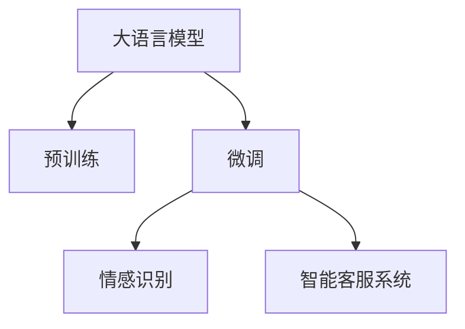

                 

# AI驱动的电商平台智能客服情感识别系统

> 关键词：人工智能,情感识别,电商平台,智能客服,情感分析

## 1. 背景介绍

### 1.1 问题由来
随着电子商务的迅猛发展，电商平台为提升用户体验、优化客户服务质量，纷纷引入智能客服系统。智能客服通过自然语言处理(NLP)技术，可实现24/7无间断服务，迅速响应客户咨询，解答各类常见问题，提升客户满意度。

然而，智能客服系统的核心在于理解客户情感和意图，对情感信息的准确识别和处理是实现高质量对话的关键。情感识别不仅关乎客户体验，更直接影响客服系统策略调整和个性化推荐。

### 1.2 问题核心关键点
情感识别是智能客服系统的重要组件，其核心任务在于从客户咨询中提取出情感信息，并对情感进行分类。传统的情感识别方法多基于人工规则和词典匹配，在复杂多变的网络语境中效果有限。而基于深度学习的方法，尤其是大语言模型微调技术，近年来在情感识别领域取得了显著进步。

大语言模型通过大规模无标签文本预训练，学习到丰富的语言表示，可以在小规模有标签数据上进行微调，提升情感识别精度。基于大模型的微调方法能够自动化学习情感表示，适应更复杂的情感表达和变化，进而大幅提升智能客服系统的准确性和智能化水平。

### 1.3 问题研究意义
大语言模型驱动的智能客服情感识别系统具有以下几个显著优势：
1. **适应性强**：模型能够适应不同客户群体和语境，识别各类情感变化，提供更为个性化的服务。
2. **响应速度快**：基于微调后的模型可以快速推理，提升客服系统的实时响应能力。
3. **可解释性好**：深度学习模型的决策过程具有可解释性，有助于客服系统优化策略。
4. **泛化能力强**：通过大语言模型的迁移学习，模型能够泛化到新任务和新客户，提升系统的通用性。

## 2. 核心概念与联系

### 2.1 核心概念概述

为更好地理解基于大语言模型的情感识别系统，本节将介绍几个密切相关的核心概念：

- **大语言模型(Large Language Model, LLM)**：如BERT、GPT等，通过大规模无标签文本预训练学习通用语言表示。
- **预训练(Pre-training)**：在大规模无标签文本上自监督学习，学习语言表示。
- **微调(Fine-tuning)**：在预训练模型的基础上，使用下游任务的少量标注数据进行有监督训练，优化模型。
- **情感识别(Emotion Recognition)**：识别文本中的情感信息，并对其进行分类。
- **智能客服系统(Customer Service Chatbot)**：结合情感识别技术，实现智能对话和个性化推荐。

这些概念之间的逻辑关系可以通过以下Mermaid流程图来展示：



这个流程图展示了大语言模型的核心概念及其之间的关系：

1. 大语言模型通过预训练获得基础能力。
2. 微调是对预训练模型进行任务特定的优化，针对情感识别任务进行调整。
3. 情感识别任务通过微调后的模型实现，进而应用于智能客服系统。

## 3. 核心算法原理 & 具体操作步骤
### 3.1 算法原理概述

基于大语言模型的情感识别系统，其核心思想是利用预训练模型进行情感表示学习，并在情感识别数据上进行微调，得到适应特定情感分类的模型。

假设预训练模型为 $M_{\theta}$，其中 $\theta$ 为预训练得到的模型参数。给定情感识别任务 $T$ 的标注数据集 $D=\{(x_i, y_i)\}_{i=1}^N$，其中 $x_i$ 为输入的客户咨询文本，$y_i$ 为情感分类标签。微调的目标是找到最优模型参数 $\hat{\theta}$，使得模型在情感识别任务上的性能最佳：

$$
\hat{\theta}=\mathop{\arg\min}_{\theta} \mathcal{L}(M_{\theta},D)
$$

其中 $\mathcal{L}$ 为针对情感识别任务设计的损失函数，用于衡量模型输出与真实标签之间的差异。常见的损失函数包括交叉熵损失、余弦相似度损失等。

通过梯度下降等优化算法，微调过程不断更新模型参数 $\theta$，最小化损失函数 $\mathcal{L}$，使得模型输出逼近真实标签。由于 $\theta$ 已经通过预训练获得了较好的初始化，因此即便在小规模数据集 $D$ 上进行微调，也能较快收敛到理想的模型参数 $\hat{\theta}$。

### 3.2 算法步骤详解

基于大语言模型的情感识别系统，一般包括以下几个关键步骤：

**Step 1: 准备预训练模型和数据集**
- 选择合适的预训练语言模型 $M_{\theta}$ 作为初始化参数，如BERT、GPT等。
- 准备情感识别任务 $T$ 的标注数据集 $D$，划分为训练集、验证集和测试集。一般要求标注数据与预训练数据的分布不要差异过大。

**Step 2: 添加情感分类层**
- 根据情感识别任务，在预训练模型顶层设计合适的输出层和损失函数。
- 对于二分类任务（如正面/负面情感），通常在顶层添加线性分类器和交叉熵损失函数。
- 对于多分类任务（如喜、怒、哀、乐等），使用softmax函数输出概率分布，并以交叉熵损失为优化目标。

**Step 3: 设置微调超参数**
- 选择合适的优化算法及其参数，如 AdamW、SGD 等，设置学习率、批大小、迭代轮数等。
- 设置正则化技术及强度，包括权重衰减、Dropout、Early Stopping等。
- 确定冻结预训练参数的策略，如仅微调顶层，或全部参数都参与微调。

**Step 4: 执行梯度训练**
- 将训练集数据分批次输入模型，前向传播计算损失函数。
- 反向传播计算参数梯度，根据设定的优化算法和学习率更新模型参数。
- 周期性在验证集上评估模型性能，根据性能指标决定是否触发 Early Stopping。
- 重复上述步骤直到满足预设的迭代轮数或 Early Stopping 条件。

**Step 5: 测试和部署**
- 在测试集上评估微调后模型 $M_{\hat{\theta}}$ 的性能，对比微调前后的精度提升。
- 使用微调后的模型对新样本进行情感识别，集成到智能客服系统。
- 持续收集新的数据，定期重新微调模型，以适应数据分布的变化。

以上是基于大语言模型的情感识别系统的一般流程。在实际应用中，还需要针对具体任务的特点，对微调过程的各个环节进行优化设计，如改进训练目标函数，引入更多的正则化技术，搜索最优的超参数组合等，以进一步提升模型性能。

### 3.3 算法优缺点

基于大语言模型的情感识别方法具有以下优点：
1. **适应性强**：大语言模型在情感表达的多样性和复杂性方面表现优异，能够适应不同文化背景和语境。
2. **精度高**：基于预训练模型进行微调，可以充分利用模型学到的语言知识和统计规律，提升情感识别的准确性。
3. **快速部署**：模型训练和微调的过程较短，能够在短时间内得到可用模型。
4. **可解释性好**：深度学习模型的决策过程可解释性强，有助于优化模型和客服策略。

同时，该方法也存在以下局限性：
1. **依赖标注数据**：情感识别任务的数据标注成本较高，标注数据的不平衡可能影响模型性能。
2. **模型复杂度高**：大语言模型的计算复杂度较高，训练和推理所需资源较多。
3. **泛化能力有限**：当情感表达方式与预训练数据差异较大时，模型泛化性能可能下降。
4. **对抗样本敏感**：模型可能对对抗样本较为敏感，导致情感识别结果不准确。

尽管存在这些局限性，但就目前而言，基于大语言模型的情感识别方法仍然是情感识别领域的主流范式。未来相关研究的重点在于如何进一步降低对标注数据的依赖，提高模型的泛化能力，同时兼顾可解释性和抗干扰性等因素。

### 3.4 算法应用领域

基于大语言模型的情感识别方法，在智能客服系统中有着广泛的应用场景，例如：

- **客户反馈分析**：分析客户咨询中的情感信息，提取客户满意度和痛点。
- **情感分类与追踪**：自动分类客户咨询的情感类别，并追踪情感变化趋势。
- **个性化推荐**：根据客户咨询中的情感信息，提供相应的商品推荐或服务建议。
- **用户情绪监控**：实时监控客服系统中的情感信息，预防可能的客户纠纷。
- **对话策略优化**：通过情感识别结果调整客服系统的对话策略，提升客户体验。

除了上述这些经典应用外，情感识别技术还被创新性地应用于舆情分析、市场研究、社交媒体情感监测等领域，为各行各业带来了新的价值和效率提升。

## 4. 数学模型和公式 & 详细讲解  
### 4.1 数学模型构建

本节将使用数学语言对基于大语言模型的情感识别过程进行更加严格的刻画。

记预训练语言模型为 $M_{\theta}$，其中 $\theta$ 为预训练得到的模型参数。假设情感识别任务 $T$ 的训练集为 $D=\{(x_i,y_i)\}_{i=1}^N$，其中 $x_i$ 为输入的客户咨询文本，$y_i$ 为情感分类标签。

定义模型 $M_{\theta}$ 在输入 $x$ 上的损失函数为 $\ell(M_{\theta}(x),y)$，则在数据集 $D$ 上的经验风险为：

$$
\mathcal{L}(\theta) = \frac{1}{N} \sum_{i=1}^N \ell(M_{\theta}(x_i),y_i)
$$

其中 $\ell$ 为情感识别任务对应的损失函数，如交叉熵损失。

微调的优化目标是最小化经验风险，即找到最优参数：

$$
\theta^* = \mathop{\arg\min}_{\theta} \mathcal{L}(\theta)
$$

在实践中，我们通常使用基于梯度的优化算法（如SGD、Adam等）来近似求解上述最优化问题。设 $\eta$ 为学习率，$\lambda$ 为正则化系数，则参数的更新公式为：

$$
\theta \leftarrow \theta - \eta \nabla_{\theta}\mathcal{L}(\theta) - \eta\lambda\theta
$$

其中 $\nabla_{\theta}\mathcal{L}(\theta)$ 为损失函数对参数 $\theta$ 的梯度，可通过反向传播算法高效计算。

### 4.2 公式推导过程

以下我们以二分类任务为例，推导交叉熵损失函数及其梯度的计算公式。

假设模型 $M_{\theta}$ 在输入 $x$ 上的输出为 $\hat{y}=M_{\theta}(x) \in [0,1]$，表示样本属于正类的概率。真实标签 $y \in \{0,1\}$。则二分类交叉熵损失函数定义为：

$$
\ell(M_{\theta}(x),y) = -[y\log \hat{y} + (1-y)\log (1-\hat{y})]
$$

将其代入经验风险公式，得：

$$
\mathcal{L}(\theta) = -\frac{1}{N}\sum_{i=1}^N [y_i\log M_{\theta}(x_i)+(1-y_i)\log(1-M_{\theta}(x_i))]
$$

根据链式法则，损失函数对参数 $\theta_k$ 的梯度为：

$$
\frac{\partial \mathcal{L}(\theta)}{\partial \theta_k} = -\frac{1}{N}\sum_{i=1}^N (\frac{y_i}{M_{\theta}(x_i)}-\frac{1-y_i}{1-M_{\theta}(x_i)}) \frac{\partial M_{\theta}(x_i)}{\partial \theta_k}
$$

其中 $\frac{\partial M_{\theta}(x_i)}{\partial \theta_k}$ 可进一步递归展开，利用自动微分技术完成计算。

在得到损失函数的梯度后，即可带入参数更新公式，完成模型的迭代优化。重复上述过程直至收敛，最终得到适应情感识别任务的最优模型参数 $\theta^*$。

## 5. 项目实践：代码实例和详细解释说明
### 5.1 开发环境搭建

在进行情感识别系统开发前，我们需要准备好开发环境。以下是使用Python进行PyTorch开发的环境配置流程：

1. 安装Anaconda：从官网下载并安装Anaconda，用于创建独立的Python环境。

2. 创建并激活虚拟环境：
```bash
conda create -n pytorch-env python=3.8 
conda activate pytorch-env
```

3. 安装PyTorch：根据CUDA版本，从官网获取对应的安装命令。例如：
```bash
conda install pytorch torchvision torchaudio cudatoolkit=11.1 -c pytorch -c conda-forge
```

4. 安装Transformers库：
```bash
pip install transformers
```

5. 安装各类工具包：
```bash
pip install numpy pandas scikit-learn matplotlib tqdm jupyter notebook ipython
```

完成上述步骤后，即可在`pytorch-env`环境中开始情感识别系统的开发。

### 5.2 源代码详细实现

这里我们以情感分类任务为例，给出使用Transformers库对BERT模型进行情感识别的PyTorch代码实现。

首先，定义情感分类任务的数据处理函数：

```python
from transformers import BertTokenizer
from torch.utils.data import Dataset
import torch

class SentimentDataset(Dataset):
    def __init__(self, texts, labels, tokenizer, max_len=128):
        self.texts = texts
        self.labels = labels
        self.tokenizer = tokenizer
        self.max_len = max_len
        
    def __len__(self):
        return len(self.texts)
    
    def __getitem__(self, item):
        text = self.texts[item]
        label = self.labels[item]
        
        encoding = self.tokenizer(text, return_tensors='pt', max_length=self.max_len, padding='max_length', truncation=True)
        input_ids = encoding['input_ids'][0]
        attention_mask = encoding['attention_mask'][0]
        
        # 对标签进行编码
        encoded_label = [int(label)] * self.max_len
        labels = torch.tensor(encoded_label, dtype=torch.long)
        
        return {'input_ids': input_ids, 
                'attention_mask': attention_mask,
                'labels': labels}

# 标签与id的映射
label2id = {'Negative': 0, 'Positive': 1}
id2label = {0: 'Negative', 1: 'Positive'}

# 创建dataset
tokenizer = BertTokenizer.from_pretrained('bert-base-cased')

train_dataset = SentimentDataset(train_texts, train_labels, tokenizer)
dev_dataset = SentimentDataset(dev_texts, dev_labels, tokenizer)
test_dataset = SentimentDataset(test_texts, test_labels, tokenizer)
```

然后，定义模型和优化器：

```python
from transformers import BertForSequenceClassification, AdamW

model = BertForSequenceClassification.from_pretrained('bert-base-cased', num_labels=2)

optimizer = AdamW(model.parameters(), lr=2e-5)
```

接着，定义训练和评估函数：

```python
from torch.utils.data import DataLoader
from tqdm import tqdm
from sklearn.metrics import classification_report

device = torch.device('cuda') if torch.cuda.is_available() else torch.device('cpu')
model.to(device)

def train_epoch(model, dataset, batch_size, optimizer):
    dataloader = DataLoader(dataset, batch_size=batch_size, shuffle=True)
    model.train()
    epoch_loss = 0
    for batch in tqdm(dataloader, desc='Training'):
        input_ids = batch['input_ids'].to(device)
        attention_mask = batch['attention_mask'].to(device)
        labels = batch['labels'].to(device)
        model.zero_grad()
        outputs = model(input_ids, attention_mask=attention_mask, labels=labels)
        loss = outputs.loss
        epoch_loss += loss.item()
        loss.backward()
        optimizer.step()
    return epoch_loss / len(dataloader)

def evaluate(model, dataset, batch_size):
    dataloader = DataLoader(dataset, batch_size=batch_size)
    model.eval()
    preds, labels = [], []
    with torch.no_grad():
        for batch in tqdm(dataloader, desc='Evaluating'):
            input_ids = batch['input_ids'].to(device)
            attention_mask = batch['attention_mask'].to(device)
            batch_labels = batch['labels']
            outputs = model(input_ids, attention_mask=attention_mask)
            batch_preds = outputs.logits.argmax(dim=1).to('cpu').tolist()
            batch_labels = batch_labels.to('cpu').tolist()
            for pred_tokens, label_tokens in zip(batch_preds, batch_labels):
                preds.append(pred_tokens)
                labels.append(label_tokens)
                
    print(classification_report(labels, preds))
```

最后，启动训练流程并在测试集上评估：

```python
epochs = 5
batch_size = 16

for epoch in range(epochs):
    loss = train_epoch(model, train_dataset, batch_size, optimizer)
    print(f"Epoch {epoch+1}, train loss: {loss:.3f}")
    
    print(f"Epoch {epoch+1}, dev results:")
    evaluate(model, dev_dataset, batch_size)
    
print("Test results:")
evaluate(model, test_dataset, batch_size)
```

以上就是使用PyTorch对BERT进行情感分类任务微调的完整代码实现。可以看到，得益于Transformers库的强大封装，我们可以用相对简洁的代码完成BERT模型的加载和微调。

### 5.3 代码解读与分析

让我们再详细解读一下关键代码的实现细节：

**SentimentDataset类**：
- `__init__`方法：初始化文本、标签、分词器等关键组件。
- `__len__`方法：返回数据集的样本数量。
- `__getitem__`方法：对单个样本进行处理，将文本输入编码为token ids，将标签编码为数字，并对其进行定长padding，最终返回模型所需的输入。

**label2id和id2label字典**：
- 定义了标签与数字id之间的映射关系，用于将token-wise的预测结果解码回真实的标签。

**训练和评估函数**：
- 使用PyTorch的DataLoader对数据集进行批次化加载，供模型训练和推理使用。
- 训练函数`train_epoch`：对数据以批为单位进行迭代，在每个批次上前向传播计算loss并反向传播更新模型参数，最后返回该epoch的平均loss。
- 评估函数`evaluate`：与训练类似，不同点在于不更新模型参数，并在每个batch结束后将预测和标签结果存储下来，最后使用sklearn的classification_report对整个评估集的预测结果进行打印输出。

**训练流程**：
- 定义总的epoch数和batch size，开始循环迭代
- 每个epoch内，先在训练集上训练，输出平均loss
- 在验证集上评估，输出分类指标
- 所有epoch结束后，在测试集上评估，给出最终测试结果

可以看到，PyTorch配合Transformers库使得BERT微调的代码实现变得简洁高效。开发者可以将更多精力放在数据处理、模型改进等高层逻辑上，而不必过多关注底层的实现细节。

当然，工业级的系统实现还需考虑更多因素，如模型的保存和部署、超参数的自动搜索、更灵活的任务适配层等。但核心的微调范式基本与此类似。

## 6. 实际应用场景
### 6.1 智能客服系统

基于大语言模型微调的情感识别技术，可以广泛应用于智能客服系统的构建。传统客服往往需要配备大量人力，高峰期响应缓慢，且一致性和专业性难以保证。而使用微调后的情感识别模型，可以7x24小时不间断服务，快速响应客户咨询，用自然流畅的语言解答各类常见问题。

在技术实现上，可以收集企业内部的历史客服对话记录，将问题和最佳答复构建成监督数据，在此基础上对预训练情感识别模型进行微调。微调后的情感识别模型能够自动理解客户意图，匹配最合适的答复模板进行回复。对于客户提出的新问题，还可以接入检索系统实时搜索相关内容，动态组织生成回答。如此构建的智能客服系统，能大幅提升客户咨询体验和问题解决效率。

### 6.2 情感分析

情感分析是电商平台用户行为分析的重要组成部分，通过分析客户评论、评分等情感信息，可以了解客户满意度、识别潜在问题，进而优化产品和服务。传统的情感分析方法多依赖人工规则和词典匹配，难以处理复杂多变的情感表达。

基于大语言模型的情感识别方法可以自动学习情感表示，适应不同的情感表达方式和变化，提升情感分析的精度和覆盖面。将微调后的情感识别模型应用于客户评论分析，可以自动化地进行情感分类和情感强度打分，为产品优化和市场策略调整提供数据支持。

### 6.3 金融舆情监测

金融机构需要实时监测市场舆论动向，以便及时应对负面信息传播，规避金融风险。传统的人工监测方式成本高、效率低，难以应对网络时代海量信息爆发的挑战。

基于大语言模型的情感识别技术，可以实时抓取网络上的财经新闻、社交媒体评论等信息，自动分析其中的情感信息，提前预警市场波动和风险。将微调后的情感识别模型应用于舆情分析，可以高效识别舆情变化，帮助金融机构防范风险，保护资产安全。

### 6.4 未来应用展望

随着大语言模型和情感识别技术的不断发展，基于微调范式将在更多领域得到应用，为传统行业带来变革性影响。

在智慧医疗领域，基于情感识别技术，可以实时监测患者情绪变化，提升医疗服务质量。在智能教育领域，情感识别技术可以帮助教师及时掌握学生情绪状态，提供个性化辅导，促进教育公平。

在智慧城市治理中，情感识别技术可以实时分析城市舆情，预防可能的公共事件和市民不满，提升城市管理效率。此外，在企业生产、社会治理、文娱传媒等众多领域，基于大模型微调的人工智能应用也将不断涌现，为经济社会发展注入新的动力。

相信随着技术的日益成熟，情感识别技术必将在更广阔的应用领域大放异彩，深刻影响人类的生产生活方式。

## 7. 工具和资源推荐
### 7.1 学习资源推荐

为了帮助开发者系统掌握大语言模型微调的理论基础和实践技巧，这里推荐一些优质的学习资源：

1. 《Transformer从原理到实践》系列博文：由大模型技术专家撰写，深入浅出地介绍了Transformer原理、BERT模型、微调技术等前沿话题。

2. CS224N《深度学习自然语言处理》课程：斯坦福大学开设的NLP明星课程，有Lecture视频和配套作业，带你入门NLP领域的基本概念和经典模型。

3. 《Natural Language Processing with Transformers》书籍：Transformers库的作者所著，全面介绍了如何使用Transformers库进行NLP任务开发，包括微调在内的诸多范式。

4. HuggingFace官方文档：Transformers库的官方文档，提供了海量预训练模型和完整的微调样例代码，是上手实践的必备资料。

5. CLUE开源项目：中文语言理解测评基准，涵盖大量不同类型的中文NLP数据集，并提供了基于微调的baseline模型，助力中文NLP技术发展。

通过对这些资源的学习实践，相信你一定能够快速掌握大语言模型微调的精髓，并用于解决实际的NLP问题。
###  7.2 开发工具推荐

高效的开发离不开优秀的工具支持。以下是几款用于大语言模型微调开发的常用工具：

1. PyTorch：基于Python的开源深度学习框架，灵活动态的计算图，适合快速迭代研究。大部分预训练语言模型都有PyTorch版本的实现。

2. TensorFlow：由Google主导开发的开源深度学习框架，生产部署方便，适合大规模工程应用。同样有丰富的预训练语言模型资源。

3. Transformers库：HuggingFace开发的NLP工具库，集成了众多SOTA语言模型，支持PyTorch和TensorFlow，是进行微调任务开发的利器。

4. Weights & Biases：模型训练的实验跟踪工具，可以记录和可视化模型训练过程中的各项指标，方便对比和调优。与主流深度学习框架无缝集成。

5. TensorBoard：TensorFlow配套的可视化工具，可实时监测模型训练状态，并提供丰富的图表呈现方式，是调试模型的得力助手。

6. Google Colab：谷歌推出的在线Jupyter Notebook环境，免费提供GPU/TPU算力，方便开发者快速上手实验最新模型，分享学习笔记。

合理利用这些工具，可以显著提升大语言模型微调任务的开发效率，加快创新迭代的步伐。

### 7.3 相关论文推荐

大语言模型和情感识别技术的发展源于学界的持续研究。以下是几篇奠基性的相关论文，推荐阅读：

1. Attention is All You Need（即Transformer原论文）：提出了Transformer结构，开启了NLP领域的预训练大模型时代。

2. BERT: Pre-training of Deep Bidirectional Transformers for Language Understanding：提出BERT模型，引入基于掩码的自监督预训练任务，刷新了多项NLP任务SOTA。

3. Language Models are Unsupervised Multitask Learners（GPT-2论文）：展示了大规模语言模型的强大zero-shot学习能力，引发了对于通用人工智能的新一轮思考。

4. Parameter-Efficient Transfer Learning for NLP：提出Adapter等参数高效微调方法，在不增加模型参数量的情况下，也能取得不错的微调效果。

5. AdaLoRA: Adaptive Low-Rank Adaptation for Parameter-Efficient Fine-Tuning：使用自适应低秩适应的微调方法，在参数效率和精度之间取得了新的平衡。

6. Fine-grained Emotion Recognition from Short Texts with MIMO-Transformer：提出MIMO-Transformer模型，用于情感识别任务，取得了显著的精度提升。

这些论文代表了大语言模型微调技术的发展脉络。通过学习这些前沿成果，可以帮助研究者把握学科前进方向，激发更多的创新灵感。

## 8. 总结：未来发展趋势与挑战

### 8.1 总结

本文对基于大语言模型的情感识别系统进行了全面系统的介绍。首先阐述了大语言模型和情感识别系统的研究背景和意义，明确了情感识别在智能客服系统中的重要性和应用前景。其次，从原理到实践，详细讲解了情感识别过程的数学原理和关键步骤，给出了情感识别任务开发的完整代码实例。同时，本文还广泛探讨了情感识别技术在智能客服、情感分析、金融舆情监测等多个行业领域的应用前景，展示了情感识别范式的巨大潜力。此外，本文精选了情感识别技术的各类学习资源，力求为读者提供全方位的技术指引。

通过本文的系统梳理，可以看到，基于大语言模型的情感识别方法正在成为智能客服系统的重要技术，极大地提升了客户咨询体验和问题解决效率。未来，伴随情感识别技术的不断发展，智能客服系统将朝着更加智能、高效、个性化的方向演进，为客户带来全新的体验和服务。

### 8.2 未来发展趋势

展望未来，情感识别技术将呈现以下几个发展趋势：

1. **模型规模持续增大**：随着算力成本的下降和数据规模的扩张，预训练语言模型的参数量还将持续增长。超大规模语言模型蕴含的丰富情感表达，将支持更加复杂多变的情感识别任务。

2. **微调方法日趋多样**：除了传统的全参数微调外，未来会涌现更多参数高效的微调方法，如Prompt-based Learning、LoRA等，在节省计算资源的同时也能保证情感识别精度。

3. **实时性要求提高**：随着智能客服系统对实时响应的要求不断提升，情感识别系统需要具备更强的推理速度和计算效率，以支持高并发场景。

4. **可解释性需求增强**：深度学习模型的决策过程具有可解释性，有助于客服系统优化策略，提高用户信任度。

5. **跨模态融合增强**：将文本、语音、图像等多模态信息进行融合，实现更全面、准确的情感识别，提升用户体验。

6. **伦理与安全考量**：情感识别技术可能会涉及隐私数据和用户情感，需加强数据保护和隐私保护，避免误判和偏见。

以上趋势凸显了情感识别技术的广阔前景。这些方向的探索发展，必将进一步提升情感识别系统的性能和应用范围，为智能客服系统的智能化、个性化提供更强大的技术支撑。

### 8.3 面临的挑战

尽管大语言模型情感识别技术已经取得了瞩目成就，但在迈向更加智能化、普适化应用的过程中，它仍面临着诸多挑战：

1. **标注数据成本高**：情感识别任务的数据标注成本较高，标注数据的不平衡可能影响模型性能。如何降低标注成本，提升标注数据的多样性，是未来的重要研究方向。

2. **模型鲁棒性不足**：情感表达方式多样，情感识别模型可能在对抗样本和噪声数据上表现不佳。如何提高模型的鲁棒性和泛化能力，避免过拟合和偏见，将是重要的研究方向。

3. **实时性需求高**：情感识别系统需要在实时环境中高效运行，对推理速度和资源利用率有较高要求。如何在保证精度的同时，优化模型结构，提高推理速度，仍是挑战。

4. **隐私与安全问题**：情感识别技术可能会涉及用户的敏感信息，需加强数据保护和隐私保护，避免信息泄露和滥用。

5. **情感模型复杂性**：情感表达方式复杂多样，情感模型需要适应不同的情感变化和表达方式，设计高效的情感分类器是重要挑战。

这些挑战需要学界和工业界的共同努力，通过技术创新和规范标准的制定，逐步克服情感识别技术的瓶颈，推动技术的成熟应用。

### 8.4 研究展望

面对情感识别技术所面临的挑战，未来的研究需要在以下几个方面寻求新的突破：

1. **无监督和半监督学习**：探索无监督和半监督学习范式，摆脱对大规模标注数据的依赖，利用自监督学习、主动学习等技术，提升情感识别的准确性和泛化能力。

2. **参数高效微调**：开发更多参数高效的微调方法，如Prompt-based Learning、LoRA等，在保证情感识别精度的同时，减少计算资源消耗，实现轻量级部署。

3. **实时推理优化**：研究高效的推理算法和模型结构，提升情感识别系统的实时性和可扩展性，支持大规模实时场景应用。

4. **跨模态融合**：将文本、语音、图像等多模态信息进行融合，提升情感识别的全面性和准确性，适应更多应用场景。

5. **伦理与隐私保护**：研究情感识别技术的伦理与安全问题，制定相关的规范标准，保障用户隐私和数据安全。

6. **智能推荐与优化**：将情感识别结果应用于个性化推荐系统，通过情感分析优化推荐策略，提升用户体验。

这些研究方向将引领情感识别技术的未来发展，推动智能客服系统迈向更加智能化、普适化和安全可靠的新阶段。相信随着技术的不断进步，情感识别技术必将在构建人机协同的智能时代中扮演越来越重要的角色。

## 9. 附录：常见问题与解答

**Q1：情感识别系统如何处理客户咨询中的多模态信息？**

A: 客户咨询中的情感信息可能同时包含文本、语音、图像等多种形式。针对多模态情感识别，可以采用以下方法：

1. **文本情感分析**：利用大语言模型对文本进行情感识别，提取文本中的情感信息。
2. **语音情感分析**：利用声学特征提取技术和情感识别模型，分析语音中的情感表达。
3. **图像情感分析**：利用计算机视觉技术和情感识别模型，分析图像中的情感表达。

将多模态信息进行融合，结合各模态的情感识别结果，综合判断客户咨询中的情感状态。

**Q2：情感识别模型如何处理情感模糊的情况？**

A: 情感模糊是指客户咨询中的情感表达不明确，难以直接归类。处理情感模糊的方法包括：

1. **多分类任务**：将情感分类任务设计为多分类任务，如喜、怒、哀、乐等，可以提升模型对模糊情感的识别能力。
2. **情感强度打分**：将情感识别结果转化为情感强度打分，而非二分类标签，可以更准确地描述情感变化的强度。
3. **情感归一化**：通过归一化处理，将不同的情感表达方式统一映射到一定的范围内，便于模型学习。

**Q3：情感识别系统如何适应不同文化背景的客户咨询？**

A: 不同文化背景的客户咨询，其情感表达方式和习惯差异较大，需要采用以下方法：

1. **多语言支持**：使用多语言版本的预训练模型，支持多种语言的情感识别任务。
2. **文化适应性训练**：在特定文化背景的客户咨询数据上，对模型进行有针对性的训练，提升模型对本地情感表达的理解能力。
3. **情感词典更新**：定期更新情感词典，适应不同文化背景下的情感表达方式，提升情感识别的准确性。

**Q4：情感识别系统如何处理情感识别的实时性需求？**

A: 情感识别系统需要在实时环境中高效运行，对推理速度和资源利用率有较高要求。可以采用以下方法：

1. **优化模型结构**：设计轻量级模型结构，减少计算量和内存占用。
2. **模型压缩与量化**：利用模型压缩和量化技术，优化模型推理速度和资源利用率。
3. **异构计算**：利用GPU、TPU等异构计算资源，提升模型推理性能。

**Q5：情感识别系统如何保护用户隐私和数据安全？**

A: 情感识别系统可能涉及用户的敏感信息，需加强数据保护和隐私保护，避免信息泄露和滥用。可以采用以下方法：

1. **数据加密**：对用户数据进行加密存储和传输，防止数据泄露。
2. **匿名化处理**：对用户数据进行匿名化处理，保护用户隐私。
3. **访问控制**：设置严格的访问控制机制，确保只有授权人员可以访问敏感数据。
4. **合规性审查**：遵守相关法律法规，确保数据处理合规。

通过以上措施，可以保障用户隐私和数据安全，提升情感识别系统的可信度和用户信任度。

**Q6：情感识别系统如何结合知识图谱优化推荐策略？**

A: 情感识别结果可以结合知识图谱，提升推荐系统的精度和个性化水平。可以采用以下方法：

1. **情感信息融合**：将情感识别结果与知识图谱中的实体信息进行融合，生成情感化的推荐结果。
2. **兴趣图谱构建**：利用情感识别结果，构建用户兴趣图谱，进行个性化推荐。
3. **情感影响分析**：分析情感信息对用户行为的影响，优化推荐策略。

通过结合知识图谱，情感识别系统可以更全面地理解用户需求和情感状态，提升推荐系统的性能和用户体验。

---

作者：禅与计算机程序设计艺术 / Zen and the Art of Computer Programming

