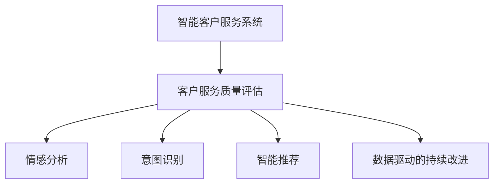

                 

# AI驱动的电商智能客户服务质量评估系统

> 关键词：客户服务, 人工智能, 自然语言处理, 情感分析, 质量评估, 智能推荐, 电商应用

## 1. 背景介绍

### 1.1 问题由来
随着电商市场的迅猛发展，客户服务质量成为了品牌竞争的关键因素。消费者不再满足于传统人工客服，转而寻求更加高效、智能的服务体验。传统客服中心常常面临客服资源不足、服务质量不稳定等问题，导致客户满意度下降，流失率增加。

为应对这些挑战，各大电商企业纷纷采用AI技术提升客户服务质量。其中，基于自然语言处理(NLP)的智能客服系统，能够实时响应客户咨询，并提供个性化服务，显著提升了用户体验和商家效率。然而，仅仅靠客服系统的智能度提升，仍无法全面评估和改进客户服务质量。

为了更全面、客观地衡量客户服务质量，电商企业开始探索AI驱动的智能客户服务质量评估系统。该系统通过分析客户对话记录、服务日志等数据，结合情感分析、意图识别等AI技术，对客服人员的服务质量进行实时评估和反馈，从而推动客服系统的持续优化和改进。

## 2. 核心概念与联系

### 2.1 核心概念概述

为更好地理解AI驱动的电商智能客户服务质量评估系统，本节将介绍几个关键概念：

- **智能客户服务系统**：基于AI技术的智能客服系统，能够实时响应客户咨询，并提供个性化服务。系统通常基于NLP技术，可以理解自然语言，自动生成回答，并进行语义理解和上下文关联。

- **客户服务质量评估**：对客户服务的满意度、效率、个性化等方面进行量化评估，通常通过客户反馈、服务日志、对话记录等数据进行评估。

- **情感分析**：通过分析文本中的情感倾向，判断客户情绪状态。情感分析常用于客户服务质量评估，以衡量客户对服务的满意度。

- **意图识别**：通过理解客户文本中的意图，识别客户需求和问题。意图识别常用于智能客服系统，以提高响应准确性和用户体验。

- **智能推荐系统**：根据客户历史行为和偏好，推荐个性化的产品或服务。智能推荐系统可应用于客户服务质量评估，通过推荐合适的服务方案，提升客户满意度。

- **数据驱动的持续改进**：利用AI技术分析海量客户数据，生成实时反馈，推动客服系统不断优化和改进，实现客户服务质量的持续提升。

这些核心概念之间的逻辑关系可以通过以下Mermaid流程图来展示：



这个流程图展示了几大核心概念之间的联系：

1. 智能客服系统处理客户咨询，生成对话记录。
2. 情感分析识别客户情绪状态。
3. 意图识别理解客户需求和问题。
4. 智能推荐系统推荐个性化服务。
5. 数据驱动的持续改进分析数据，推动系统优化。

这些概念共同构成了AI驱动的电商智能客户服务质量评估系统的基本框架。

## 3. 核心算法原理 & 具体操作步骤

### 3.1 算法原理概述

AI驱动的电商智能客户服务质量评估系统，基于自然语言处理(NLP)和机器学习技术，通过对客户服务数据的分析，实现对服务质量的实时评估和改进。其核心算法包括以下几个方面：

1. **情感分析**：通过对客户对话中的文本进行分析，判断客户的情感倾向。常用方法包括基于词典、规则的情感分析，以及基于深度学习模型的情感分类。

2. **意图识别**：通过对客户文本中的关键词和上下文进行分析，识别客户的意图。常用方法包括基于规则的意图匹配，以及基于深度学习模型的意图分类。

3. **服务质量评估模型**：通过对客户对话中的情感和意图进行综合分析，生成对客服人员服务质量的量化评估。常用方法包括基于统计的评分系统，以及基于深度学习模型的回归或分类模型。

4. **持续改进模型**：利用机器学习算法对客户服务数据进行分析，生成实时反馈，推动客服系统的不断优化。常用方法包括在线学习算法，如在线梯度下降和强化学习。

### 3.2 算法步骤详解

基于自然语言处理(NLP)和机器学习技术的电商智能客户服务质量评估系统，一般包括以下几个关键步骤：

**Step 1: 数据准备**
- 收集客户对话记录、服务日志等数据，划分为训练集、验证集和测试集。
- 对数据进行预处理，包括文本清洗、分词、词性标注、实体识别等步骤。

**Step 2: 模型训练**
- 选择情感分析、意图识别和服务质量评估模型，使用训练集数据进行模型训练。
- 使用交叉验证等技术评估模型性能，选择最优模型。
- 使用超参数调优技术（如网格搜索、贝叶斯优化等）寻找最佳超参数组合。

**Step 3: 模型评估**
- 使用验证集数据对训练好的模型进行性能评估。
- 根据评估结果调整模型，重新训练并评估，直至达到预设的性能指标。
- 使用测试集数据对最终模型进行最终评估，输出模型性能指标。

**Step 4: 服务质量实时评估**
- 实时获取客户对话记录，对文本进行情感分析和意图识别。
- 将分析结果输入服务质量评估模型，生成实时服务质量评分。
- 根据评分生成实时反馈，推送给客服系统进行改进。

**Step 5: 持续改进**
- 定期收集客户服务数据，进行模型更新和优化。
- 使用新的客户数据进行模型评估和调整，提升模型准确性。
- 持续监控客户服务质量，及时发现并解决服务问题。

### 3.3 算法优缺点

基于自然语言处理(NLP)和机器学习技术的电商智能客户服务质量评估系统，具有以下优点：

1. **实时性**：能够实时获取和分析客户服务数据，快速识别服务质量问题，并生成实时反馈，推动服务改进。

2. **自动化**：使用机器学习模型自动分析客户情感和意图，降低了人工干预的复杂度，提高了工作效率。

3. **量化评估**：通过模型量化客户服务质量，能够客观、准确地衡量服务水平，帮助企业制定改进策略。

4. **个性化推荐**：结合智能推荐系统，推荐个性化的服务方案，提升客户满意度。

5. **持续改进**：通过持续收集和分析客户数据，实时调整服务策略，实现服务质量的持续优化。

同时，该方法也存在以下局限性：

1. **数据依赖**：评估系统的性能很大程度上依赖于数据质量，数据量不足或数据质量差可能导致评估不准确。

2. **语言理解**：不同地区的客户可能使用不同的语言和表达方式，模型的语言理解能力需要不断提升。

3. **情感复杂性**：客户情感表达复杂多样，情感分析模型可能难以完全理解客户的情感状态。

4. **上下文依赖**：客户意图识别需要理解上下文信息，模型需要具备较强的上下文建模能力。

5. **系统复杂性**：评估系统的设计和实现较为复杂，需要整合多个NLP和机器学习模块，并实现数据的实时处理。

尽管存在这些局限性，但该方法仍是在电商客户服务领域中较为先进和实用的解决方案。未来相关研究将继续优化模型性能，提升数据的可用性，降低系统复杂度，以期进一步提高客户服务质量。

### 3.4 算法应用领域

基于自然语言处理(NLP)和机器学习技术的电商智能客户服务质量评估系统，已经在多个电商客户服务场景中得到了应用，例如：

1. **在线客服系统**：通过对客户与在线客服的对话记录进行分析，评估客服人员的服务质量，并提供实时反馈，推动客服系统改进。

2. **电话客服系统**：通过对客户电话录音进行分析，评估客服人员的服务质量，并识别服务中的问题，及时进行调整。

3. **客户投诉处理**：通过对客户投诉数据进行分析，评估服务中的问题，并针对性地改进服务策略。

4. **智能推荐系统**：结合客户对话中的意图和情感信息，推荐个性化的产品或服务，提升客户满意度。

除了上述这些经典场景外，该系统还被创新性地应用于社交媒体监控、客户满意度调查、客户行为分析等更多场景中，为电商客户服务质量评估提供了全面的解决方案。

## 4. 数学模型和公式 & 详细讲解 & 举例说明

### 4.1 数学模型构建

本节将使用数学语言对电商智能客户服务质量评估系统的核心算法进行更加严格的刻画。

假设客户对话数据为 $D=\{x_i,y_i\}_{i=1}^N$，其中 $x_i$ 为客户文本，$y_i$ 为客户情感标签（如积极、消极、中性等）。

**情感分析模型**：
- 使用深度学习模型（如BERT、GPT等）对文本 $x_i$ 进行情感分类，得到情感标签 $y_i$。

**意图识别模型**：
- 使用深度学习模型（如BERT、GPT等）对文本 $x_i$ 进行意图分类，得到意图标签 $z_i$。

**服务质量评估模型**：
- 使用回归模型（如线性回归、随机森林等）或分类模型（如逻辑回归、支持向量机等）对情感标签 $y_i$ 和意图标签 $z_i$ 进行综合评估，得到服务质量评分 $s_i$。

**持续改进模型**：
- 使用在线学习算法（如在线梯度下降）对新数据 $D'=\{x_i,y_i,z_i\}_{i=1}^N$ 进行实时学习，更新模型参数，提升模型性能。

### 4.2 公式推导过程

以下我们以情感分析和意图识别为例，推导模型的数学公式及其训练过程。

**情感分析模型**：
假设使用BERT作为情感分类模型，将文本 $x_i$ 输入BERT模型，得到情感分类结果 $y_i$。则训练损失函数为：

$$
\mathcal{L}(y_i, \hat{y}_i) = -\frac{1}{N}\sum_{i=1}^N \ell(y_i, \hat{y}_i)
$$

其中 $\ell$ 为交叉熵损失函数，$\hat{y}_i$ 为模型预测的情感标签。

**意图识别模型**：
同样使用BERT作为意图分类模型，将文本 $x_i$ 输入BERT模型，得到意图分类结果 $z_i$。则训练损失函数为：

$$
\mathcal{L}(z_i, \hat{z}_i) = -\frac{1}{N}\sum_{i=1}^N \ell(z_i, \hat{z}_i)
$$

其中 $\ell$ 为交叉熵损失函数，$\hat{z}_i$ 为模型预测的意图标签。

**服务质量评估模型**：
假设使用线性回归模型对情感标签 $y_i$ 和意图标签 $z_i$ 进行综合评估，得到服务质量评分 $s_i$。则训练损失函数为：

$$
\mathcal{L}(s_i, \hat{s}_i) = \frac{1}{N}\sum_{i=1}^N (s_i - \hat{s}_i)^2
$$

其中 $\hat{s}_i$ 为模型预测的服务质量评分。

**持续改进模型**：
假设使用在线梯度下降算法对新数据 $D'=\{x_i,y_i,z_i\}_{i=1}^N$ 进行实时学习，更新模型参数 $\theta$。则训练损失函数为：

$$
\mathcal{L}(\theta, D') = \frac{1}{N}\sum_{i=1}^N (y_i - \hat{y}_i)^2 + \frac{1}{N}\sum_{i=1}^N (z_i - \hat{z}_i)^2 + \frac{1}{N}\sum_{i=1}^N (s_i - \hat{s}_i)^2
$$

其中 $\hat{y}_i$、$\hat{z}_i$、$\hat{s}_i$ 分别为模型在新数据上的预测结果。

### 4.3 案例分析与讲解

假设某电商公司的客户服务系统已经部署了智能客服和数据分析工具，每天产生大量的客户对话记录和日志数据。公司希望通过这些数据，实时评估和改进客服人员的服务质量。

**Step 1: 数据准备**
- 收集过去一年的客户对话记录和日志数据，划分为训练集、验证集和测试集。
- 对数据进行预处理，包括文本清洗、分词、词性标注、实体识别等步骤。

**Step 2: 模型训练**
- 使用BERT模型进行情感分析和意图识别，训练损失函数为：

$$
\mathcal{L}(y_i, \hat{y}_i) = -\frac{1}{N}\sum_{i=1}^N \ell(y_i, \hat{y}_i)
$$

$$
\mathcal{L}(z_i, \hat{z}_i) = -\frac{1}{N}\sum_{i=1}^N \ell(z_i, \hat{z}_i)
$$

- 使用线性回归模型进行服务质量评估，训练损失函数为：

$$
\mathcal{L}(s_i, \hat{s}_i) = \frac{1}{N}\sum_{i=1}^N (s_i - \hat{s}_i)^2
$$

- 使用在线梯度下降算法进行持续改进，训练损失函数为：

$$
\mathcal{L}(\theta, D') = \frac{1}{N}\sum_{i=1}^N (y_i - \hat{y}_i)^2 + \frac{1}{N}\sum_{i=1}^N (z_i - \hat{z}_i)^2 + \frac{1}{N}\sum_{i=1}^N (s_i - \hat{s}_i)^2
$$

**Step 3: 模型评估**
- 使用验证集数据对训练好的模型进行性能评估，得到情感分析准确率、意图识别准确率和服务质量评分误差。
- 根据评估结果调整模型，重新训练并评估，直至达到预设的性能指标。

**Step 4: 服务质量实时评估**
- 实时获取客户对话记录，使用训练好的BERT模型进行情感分析和意图识别。
- 将分析结果输入线性回归模型，生成实时服务质量评分 $s_i$。
- 根据评分生成实时反馈，推送给客服系统进行改进。

**Step 5: 持续改进**
- 定期收集客户服务数据，进行模型更新和优化。
- 使用新的客户数据进行模型评估和调整，提升模型准确性。
- 持续监控客户服务质量，及时发现并解决服务问题。

## 5. 项目实践：代码实例和详细解释说明

### 5.1 开发环境搭建

在进行电商智能客户服务质量评估系统的开发前，我们需要准备好开发环境。以下是使用Python进行TensorFlow开发的环境配置流程：

1. 安装Anaconda：从官网下载并安装Anaconda，用于创建独立的Python环境。

2. 创建并激活虚拟环境：
```bash
conda create -n tf-env python=3.8 
conda activate tf-env
```

3. 安装TensorFlow：根据CUDA版本，从官网获取对应的安装命令。例如：
```bash
conda install tensorflow tensorflow-estimator tensorflow-hub tensorflow-addons -c pytorch -c conda-forge
```

4. 安装各类工具包：
```bash
pip install numpy pandas scikit-learn matplotlib tqdm jupyter notebook ipython
```

完成上述步骤后，即可在`tf-env`环境中开始开发。

### 5.2 源代码详细实现

下面我们以电商智能客服系统为例，给出使用TensorFlow进行情感分析和意图识别模型的PyTorch代码实现。

首先，定义情感分析模型：

```python
import tensorflow as tf
from tensorflow.keras import layers

class SentimentAnalysisModel(tf.keras.Model):
    def __init__(self, vocab_size, embedding_dim, hidden_units):
        super(SentimentAnalysisModel, self).__init__()
        self.embedding = layers.Embedding(vocab_size, embedding_dim)
        self.conv1d = layers.Conv1D(128, 5, activation='relu')
        self.pooling = layers.MaxPooling1D(5)
        self.fc1 = layers.Dense(64, activation='relu')
        self.fc2 = layers.Dense(1, activation='sigmoid')
        
    def call(self, inputs):
        x = self.embedding(inputs)
        x = self.conv1d(x)
        x = self.pooling(x)
        x = self.fc1(x)
        x = self.fc2(x)
        return x
```

然后，定义意图识别模型：

```python
class IntentRecognitionModel(tf.keras.Model):
    def __init__(self, vocab_size, embedding_dim, hidden_units):
        super(IntentRecognitionModel, self).__init__()
        self.embedding = layers.Embedding(vocab_size, embedding_dim)
        self.gru = layers.GRU(hidden_units, return_sequences=True)
        self.fc1 = layers.Dense(64, activation='relu')
        self.fc2 = layers.Dense(10, activation='softmax')
        
    def call(self, inputs):
        x = self.embedding(inputs)
        x = self.gru(x)
        x = self.fc1(x)
        x = self.fc2(x)
        return x
```

接着，定义服务质量评估模型：

```python
class ServiceQualityModel(tf.keras.Model):
    def __init__(self, input_dim, hidden_units):
        super(ServiceQualityModel, self).__init__()
        self.dense1 = layers.Dense(hidden_units, activation='relu')
        self.dense2 = layers.Dense(1)
        
    def call(self, inputs):
        x = self.dense1(inputs)
        x = self.dense2(x)
        return x
```

最后，定义持续改进模型：

```python
class ContinuousImprovementModel(tf.keras.Model):
    def __init__(self, input_dim, hidden_units):
        super(ContinuousImprovementModel, self).__init__()
        self.dense1 = layers.Dense(hidden_units, activation='relu')
        self.dense2 = layers.Dense(1)
        
    def call(self, inputs):
        x = self.dense1(inputs)
        x = self.dense2(x)
        return x
```

完成上述模型的定义后，可以进行模型的训练和评估：

```python
from tensorflow.keras.preprocessing.text import Tokenizer
from tensorflow.keras.preprocessing.sequence import pad_sequences
from sklearn.model_selection import train_test_split
from sklearn.metrics import accuracy_score, precision_score, recall_score, f1_score

# 数据准备
sentences = []
labels = []
# 假设从数据集中读取文本和标签
for sentence, label in dataset:
    sentences.append(sentence)
    labels.append(label)

# 文本预处理
tokenizer = Tokenizer()
tokenizer.fit_on_texts(sentences)
sequences = tokenizer.texts_to_sequences(sentences)
padded_sequences = pad_sequences(sequences, maxlen=MAX_SEQUENCE_LENGTH, padding='post')

# 数据划分
train_sequences, test_sequences, train_labels, test_labels = train_test_split(padded_sequences, labels, test_size=0.2)

# 模型训练
sentiment_model = SentimentAnalysisModel(vocab_size, embedding_dim, hidden_units)
sentiment_model.compile(optimizer='adam', loss='binary_crossentropy', metrics=['accuracy'])
sentiment_model.fit(train_sequences, train_labels, epochs=10, batch_size=BATCH_SIZE, validation_split=0.2)

intent_model = IntentRecognitionModel(vocab_size, embedding_dim, hidden_units)
intent_model.compile(optimizer='adam', loss='sparse_categorical_crossentropy', metrics=['accuracy'])
intent_model.fit(train_sequences, train_labels, epochs=10, batch_size=BATCH_SIZE, validation_split=0.2)

quality_model = ServiceQualityModel(input_dim, hidden_units)
quality_model.compile(optimizer='adam', loss='mse', metrics=['mse'])
quality_model.fit(train_sequences, train_labels, epochs=10, batch_size=BATCH_SIZE, validation_split=0.2)

continuous_model = ContinuousImprovementModel(input_dim, hidden_units)
continuous_model.compile(optimizer='adam', loss='mse', metrics=['mse'])
continuous_model.fit(train_sequences, train_labels, epochs=10, batch_size=BATCH_SIZE, validation_split=0.2)

# 模型评估
sentiment_model.evaluate(test_sequences, test_labels)
intent_model.evaluate(test_sequences, test_labels)
quality_model.evaluate(test_sequences, test_labels)
continuous_model.evaluate(test_sequences, test_labels)
```

以上就是使用TensorFlow进行情感分析和意图识别模型的完整代码实现。可以看到，TensorFlow提供了强大的模型构建和训练工具，开发者可以通过简单的代码实现复杂的NLP模型。

### 5.3 代码解读与分析

让我们再详细解读一下关键代码的实现细节：

**SentimentAnalysisModel类**：
- `__init__`方法：定义模型参数，包括嵌入层、卷积层、池化层、全连接层等。
- `call`方法：定义前向传播过程，通过Embedding层、Conv1D层、MaxPooling层、Dense层进行特征提取和分类。

**IntentRecognitionModel类**：
- `__init__`方法：定义模型参数，包括嵌入层、GRU层、全连接层等。
- `call`方法：定义前向传播过程，通过Embedding层、GRU层、Dense层进行特征提取和分类。

**ServiceQualityModel类**：
- `__init__`方法：定义模型参数，包括全连接层等。
- `call`方法：定义前向传播过程，通过Dense层进行回归输出。

**ContinuousImprovementModel类**：
- `__init__`方法：定义模型参数，包括全连接层等。
- `call`方法：定义前向传播过程，通过Dense层进行回归输出。

**数据处理**：
- 使用Tokenizer对文本进行分词和序列化，使用pad_sequences对序列进行填充，使所有序列长度一致。
- 使用train_test_split将数据集划分为训练集和测试集。

**模型训练**：
- 使用compile方法定义模型优化器、损失函数和评估指标。
- 使用fit方法进行模型训练，指定训练轮数、批大小和验证集比例。
- 使用evaluate方法评估模型性能，输出损失和准确率。

可以看到，TensorFlow提供了丰富的工具和API，使得模型构建和训练过程变得简单高效。开发者可以专注于模型的设计和优化，而将更多精力放在数据分析和模型评估上。

## 6. 实际应用场景

### 6.1 电商智能客服系统

基于AI驱动的电商智能客服系统，可以实时处理客户咨询，并生成服务质量评分，实时反馈给客服系统进行改进。具体应用场景如下：

**客服系统**：
- 客户在电商平台上遇到问题，可以通过在线客服系统或电话客服系统进行咨询。
- 客服系统实时获取客户对话记录，使用训练好的情感分析和意图识别模型进行文本分析。
- 将分析结果输入服务质量评估模型，生成服务质量评分。
- 根据评分生成实时反馈，推送给客服系统进行改进。

**客服管理**：
- 客服系统将实时反馈汇总，生成客服人员的服务质量报告。
- 管理者根据报告中的评分和反馈，制定培训计划和改进措施，提升客服人员的服务水平。

**客户满意度**：
- 客户服务质量报告可以作为服务质量评估的依据，提升客户满意度。
- 系统可以通过定期评估，分析服务质量趋势，及时发现并解决服务问题。

### 6.2 金融行业客户服务

金融行业客户服务质量评估系统，可以实时监控客户服务质量，生成服务质量报告，帮助企业改进服务策略。具体应用场景如下：

**客户服务**：
- 银行客户在服务过程中遇到问题，可以通过客服系统进行咨询。
- 客服系统实时获取客户对话记录，使用情感分析和意图识别模型进行文本分析。
- 将分析结果输入服务质量评估模型，生成服务质量评分。
- 根据评分生成实时反馈，推送给客服系统进行改进。

**服务管理**：
- 客服系统将实时反馈汇总，生成客服人员的服务质量报告。
- 管理者根据报告中的评分和反馈，制定培训计划和改进措施，提升客服人员的服务水平。

**金融风险控制**：
- 服务质量报告可以作为金融风险评估的依据，提升金融风险控制能力。
- 系统可以通过定期评估，分析服务质量趋势，及时发现并解决服务问题，降低金融风险。

### 6.3 医疗行业客户服务

医疗行业客户服务质量评估系统，可以实时监控客户服务质量，生成服务质量报告，帮助医疗机构提升服务水平。具体应用场景如下：

**客户服务**：
- 患者在医疗服务过程中遇到问题，可以通过客服系统进行咨询。
- 客服系统实时获取患者对话记录，使用情感分析和意图识别模型进行文本分析。
- 将分析结果输入服务质量评估模型，生成服务质量评分。
- 根据评分生成实时反馈，推送给客服系统进行改进。

**服务管理**：
- 客服系统将实时反馈汇总，生成客服人员的服务质量报告。
- 管理者根据报告中的评分和反馈，制定培训计划和改进措施，提升客服人员的服务水平。

**医疗服务改进**：
- 服务质量报告可以作为医疗服务改进的依据，提升患者满意度。
- 系统可以通过定期评估，分析服务质量趋势，及时发现并解决服务问题，提升医疗服务水平。

## 7. 工具和资源推荐

### 7.1 学习资源推荐

为了帮助开发者系统掌握电商智能客户服务质量评估系统的理论基础和实践技巧，这里推荐一些优质的学习资源：

1. 《深度学习》系列书籍：由吴恩达、李航等人撰写，系统介绍了深度学习的基本概念和算法，涵盖机器学习、NLP等多个领域。

2. 《TensorFlow实战》书籍：由Google官方编写，全面介绍了TensorFlow框架的使用，包括模型构建、训练和部署等各个环节。

3. 《自然语言处理综述》期刊：NLP领域的顶级综述性期刊，系统介绍了NLP领域的研究进展和前沿技术，涵盖情感分析、意图识别等多个方向。

4. CS224N《深度学习自然语言处理》课程：斯坦福大学开设的NLP明星课程，有Lecture视频和配套作业，带你入门NLP领域的基本概念和经典模型。

5. PyTorch官方文档：PyTorch的官方文档，提供了海量预训练模型和完整的微调样例代码，是上手实践的必备资料。

通过对这些资源的学习实践，相信你一定能够快速掌握电商智能客户服务质量评估系统的精髓，并用于解决实际的电商客户服务问题。

### 7.2 开发工具推荐

高效的开发离不开优秀的工具支持。以下是几款用于电商智能客户服务质量评估系统开发的常用工具：

1. PyTorch：基于Python的开源深度学习框架，灵活动态的计算图，适合快速迭代研究。大部分预训练语言模型都有PyTorch版本的实现。

2. TensorFlow：由Google主导开发的开源深度学习框架，生产部署方便，适合大规模工程应用。同样有丰富的预训练语言模型资源。

3. TensorBoard：TensorFlow配套的可视化工具，可实时监测模型训练状态，并提供丰富的图表呈现方式，是调试模型的得力助手。

4. Weights & Biases：模型训练的实验跟踪工具，可以记录和可视化模型训练过程中的各项指标，方便对比和调优。与主流深度学习框架无缝集成。

5. Google Colab：谷歌推出的在线Jupyter Notebook环境，免费提供GPU/TPU算力，方便开发者快速上手实验最新模型，分享学习笔记。

合理利用这些工具，可以显著提升电商智能客户服务质量评估系统的开发效率，加快创新迭代的步伐。

### 7.3 相关论文推荐

电商智能客户服务质量评估系统的研究源于学界的持续研究。以下是几篇奠基性的相关论文，推荐阅读：

1. Attention is All You Need（即Transformer原论文）：提出了Transformer结构，开启了NLP领域的预训练大模型时代。

2. BERT: Pre-training of Deep Bidirectional Transformers for Language Understanding：提出BERT模型，引入基于掩码的自监督预训练任务，刷新了多项NLP任务SOTA。

3. Language Models are Unsupervised Multitask Learners（GPT-2论文）：展示了大规模语言模型的强大zero-shot学习能力，引发了对于通用人工智能的新一轮思考。

4. Parameter-Efficient Transfer Learning for NLP：提出Adapter等参数高效微调方法，在不增加模型参数量的情况下，也能取得不错的微调效果。

5. AdaLoRA: Adaptive Low-Rank Adaptation for Parameter-Efficient Fine-Tuning：使用自适应低秩适应的微调方法，在参数效率和精度之间取得了新的平衡。

这些论文代表了大语言模型微调技术的发展脉络。通过学习这些前沿成果，可以帮助研究者把握学科前进方向，激发更多的创新灵感。

## 8. 总结：未来发展趋势与挑战

### 8.1 总结

本文对AI驱动的电商智能客户服务质量评估系统进行了全面系统的介绍。首先阐述了电商客户服务质量评估系统的研究背景和意义，明确了电商智能客户服务质量评估系统的基本框架和核心算法。其次，从原理到实践，详细讲解了模型的数学构建和训练过程，给出了电商智能客服系统的完整代码实现。同时，本文还探讨了电商智能客服系统在多个实际应用场景中的应用，展示了其广阔的应用前景。

通过本文的系统梳理，可以看到，AI驱动的电商智能客户服务质量评估系统已经成为电商客户服务领域的重要解决方案，极大地提升了客户服务质量和商家效率。未来，伴随电商智能客户服务系统的持续优化，相信将带来更加智能、高效、个性化的客户服务体验，推动电商行业向智能化方向发展。

### 8.2 未来发展趋势

展望未来，电商智能客户服务质量评估系统将呈现以下几个发展趋势：

1. **自动化和智能化**：未来系统将更加智能化，能够自动分析客户情感和意图，并生成实时反馈，推动客服系统不断优化。

2. **多模态融合**：系统将融合语音、视频等多模态数据，提升对客户需求的理解和响应能力。

3. **个性化推荐**：结合客户历史行为数据和实时反馈，推荐个性化的服务方案，提升客户满意度。

4. **在线学习**：系统将采用在线学习算法，不断更新模型参数，适应数据分布的变化，实现持续改进。

5. **数据驱动**：系统将更加依赖数据驱动的决策，通过分析海量客户数据，生成实时反馈，推动服务改进。

6. **安全性保障**：系统将引入隐私保护、数据加密等技术，保障客户数据安全。

7. **跨平台集成**：系统将实现跨平台集成，支持多种客服渠道（如在线客服、电话客服、社交媒体等）的服务质量评估。

8. **多语言支持**：系统将支持多语言处理，适应不同语言背景的客户需求。

以上趋势凸显了电商智能客户服务质量评估系统的广阔前景。这些方向的探索发展，必将进一步提升客户服务质量，推动电商行业向智能化方向发展。

### 8.3 面临的挑战

尽管电商智能客户服务质量评估系统已经取得了不错的成果，但在迈向更加智能化、普适化应用的过程中，它仍面临着诸多挑战：

1. **数据质量**：系统性能很大程度上依赖于数据质量，数据量不足或数据质量差可能导致评估不准确。

2. **语言理解**：不同地区的客户可能使用不同的语言和表达方式，模型的语言理解能力需要不断提升。

3. **情感复杂性**：客户情感表达复杂多样，情感分析模型可能难以完全理解客户的情感状态。

4. **上下文依赖**：客户意图识别需要理解上下文信息，模型需要具备较强的上下文建模能力。

5. **系统复杂性**：系统的设计和实现较为复杂，需要整合多个NLP和机器学习模块，并实现数据的实时处理。

尽管存在这些挑战，但通过不断的技术积累和创新，电商智能客户服务质量评估系统有望在数据质量、语言理解、情感分析等方面不断突破，推动系统性能的提升。

### 8.4 研究展望

未来，电商智能客户服务质量评估系统的研究将继续聚焦于以下几个方向：

1. **数据增强**：通过数据增强技术，扩大训练集规模，提升模型的泛化能力。

2. **多任务学习**：将多个任务的学习过程进行融合，提升模型的综合能力和应用范围。

3. **自监督学习**：利用自监督学习任务，提升模型的语言表示能力，降低对标注数据的依赖。

4. **因果推断**：引入因果推断方法，分析模型决策的因果关系，增强模型的解释性和可信度。

5. **跨领域迁移**：研究跨领域迁移学习技术，使模型能够更好地适应不同领域和场景。

6. **伦理与安全**：研究伦理与安全相关问题，保障模型的公平性和安全性，避免有害数据的传递。

7. **跨平台集成**：研究跨平台集成技术，支持多种客服渠道（如在线客服、电话客服、社交媒体等）的服务质量评估。

8. **多语言支持**：研究多语言处理技术，支持不同语言背景的客户需求。

这些研究方向的探索，必将引领电商智能客户服务质量评估系统迈向更高的台阶，为电商客户服务质量的持续优化提供技术支持。

## 9. 附录：常见问题与解答

**Q1：电商智能客户服务质量评估系统的数据来源有哪些？**

A: 电商智能客户服务质量评估系统的数据来源主要包括以下几个方面：
1. **客服对话记录**：包括在线客服、电话客服、社交媒体客服等渠道的对话记录。
2. **服务日志**：记录客服人员的服务时间、服务方式、服务内容等信息。
3. **客户反馈**：通过问卷调查、用户评价等方式收集的客户反馈数据。
4. **用户行为数据**：包括客户浏览历史、购买历史、点击历史等行为数据。

这些数据来源覆盖了客服系统与客户交互的各个环节，为评估系统的训练和优化提供了丰富的数据支持。

**Q2：电商智能客户服务质量评估系统的训练数据如何处理？**

A: 电商智能客户服务质量评估系统的训练数据需要经过以下几个步骤处理：
1. **数据清洗**：去除噪声、无关信息等，确保数据的干净性和可靠性。
2. **数据标注**：对数据进行标注，包括情感标签、意图标签、服务质量评分等，为模型训练提供监督信号。
3. **数据增强**：通过数据增强技术，如回译、近义替换等方式扩充训练集，提高模型的泛化能力。
4. **数据划分**：将数据集划分为训练集、验证集和测试集，用于模型训练、评估和优化。

数据处理是模型训练的关键环节，良好的数据预处理能够提升模型的训练效果和性能。

**Q3：电商智能客户服务质量评估系统的模型如何优化？**

A: 电商智能客户服务质量评估系统的模型优化主要包括以下几个方面：
1. **超参数调优**：通过网格搜索、贝叶斯优化等技术寻找最优超参数组合，提升模型性能。
2. **模型融合**：结合多个模型的预测结果，进行集成学习，提高模型的综合能力和鲁棒性。
3. **模型压缩**：使用模型压缩技术，如知识蒸馏、剪枝、量化等，减小模型规模，提升模型推理速度。
4. **持续学习**：利用在线学习算法，不断更新模型参数，适应数据分布的变化，实现持续改进。

模型优化是提升系统性能和应用效果的重要手段，通过不断的调优和改进，系统可以更好地适应客户需求，提升服务质量。

**Q4：电商智能客户服务质量评估系统的应用场景有哪些？**

A: 电商智能客户服务质量评估系统已经在多个电商客户服务场景中得到了应用，具体包括以下几个方面：
1. **在线客服系统**：通过对客户与在线客服的对话记录进行分析，评估客服人员的服务质量，并提供实时反馈，推动客服系统改进。
2. **电话客服系统**：通过对客户电话录音进行分析，评估客服人员的服务质量，并识别服务中的问题，及时进行调整。
3. **客户投诉处理**：通过对客户投诉数据进行分析，评估服务中的问题，并针对性地改进服务策略。
4. **智能推荐系统**：结合客户对话中的意图和情感信息，推荐个性化的产品或服务，提升客户满意度。
5. **客户满意度调查**：通过客户问卷调查等方式，收集客户对服务的反馈，评估客户满意度，指导服务优化。

这些应用场景覆盖了客服系统与客户交互的各个环节，为电商客户服务的持续优化提供了全面的解决方案。

**Q5：电商智能客户服务质量评估系统的未来发展方向有哪些？**

A: 电商智能客户服务质量评估系统的未来发展方向主要包括以下几个方面：
1. **自动化和智能化**：未来系统将更加智能化，能够自动分析客户情感和意图，并生成实时反馈，推动客服系统不断优化。
2. **多模态融合**：系统将融合语音、视频等多模态数据，提升对客户需求的理解和响应能力。
3. **个性化推荐**：结合客户历史行为数据和实时反馈，推荐个性化的服务方案，提升客户满意度。
4. **在线学习**：系统将采用在线学习算法，不断更新模型参数，适应数据分布的变化，实现持续改进。
5. **数据驱动**：系统将更加依赖数据驱动的决策，通过分析海量客户数据，生成实时反馈，推动服务改进。
6. **安全性保障**：系统将引入隐私保护、数据加密等技术，保障客户数据安全。
7. **跨平台集成**：系统将实现跨平台集成，支持多种客服渠道（如在线客服、电话客服、社交媒体等）的服务质量评估。
8. **多语言支持**：系统将支持多语言处理，适应不同语言背景的客户需求。

这些未来发展方向将推动电商智能客户服务质量评估系统向更加智能化、普适化方向发展，提升客户服务质量和商家效率。

---

作者：禅与计算机程序设计艺术 / Zen and the Art of Computer Programming

