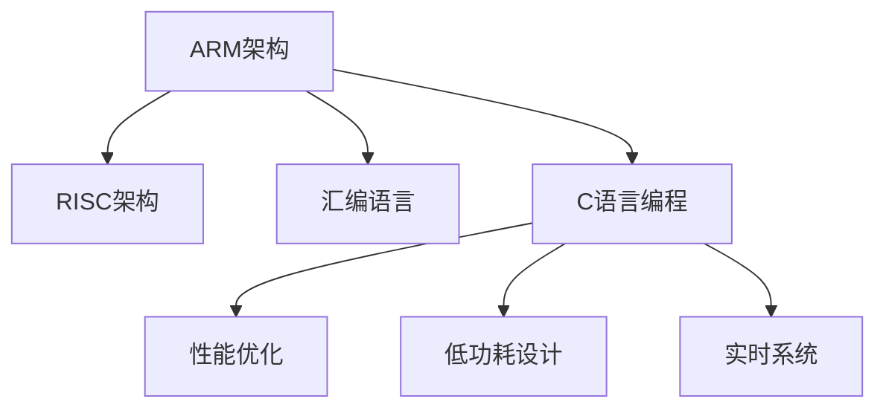

                 

# ARM架构编程：移动和嵌入式系统开发

> 关键词：ARM架构,移动嵌入式系统,编程,性能优化,低功耗设计,实时系统

## 1. 背景介绍

### 1.1 问题由来
随着移动互联网的迅猛发展，移动设备和嵌入式系统已成为人们日常工作和生活中不可或缺的一部分。无论是智能手机、平板电脑，还是物联网(IoT)设备、智能家居产品，都依赖于高效、节能的处理器来实现各项功能。而ARM架构凭借其高性能、低功耗、广泛支持等优点，成为这些设备的首选处理器架构。因此，掌握ARM架构的编程技能，对于移动和嵌入式系统开发人员来说至关重要。

### 1.2 问题核心关键点
ARM架构编程主要包括以下几个核心关键点：
1. **硬件基础**：了解ARM处理器的工作原理、组件组成和常用接口。
2. **汇编语言**：熟悉ARM汇编指令集，能够编写高效、优化的汇编程序。
3. **C语言编程**：掌握ARM优化编译器的使用，理解ARM架构下的C语言特性。
4. **性能优化**：了解ARM架构的性能瓶颈和优化手段，提高程序的执行效率。
5. **低功耗设计**：掌握ARM架构的低功耗优化技巧，延长设备电池寿命。
6. **实时系统**：熟悉ARM实时操作系统(RTOS)的实现和应用，保证系统的及时响应。

### 1.3 问题研究意义
掌握ARM架构编程技能，对于从事移动和嵌入式系统开发的人员而言，具有以下几方面意义：

1. **提升系统性能**：通过优化汇编程序和C语言代码，可以提高系统的执行效率，满足高性能应用需求。
2. **降低功耗**：通过低功耗设计和优化，可以延长设备的电池寿命，提升用户体验。
3. **实现实时功能**：在ARM架构上运行实时操作系统，可以实现系统的高效管理和快速响应。
4. **拓展应用场景**：掌握ARM架构编程技能，可以开发多种类型的移动和嵌入式设备，满足不同行业的需求。
5. **增强竞争力**：在移动和嵌入式开发领域，掌握ARM架构编程技术，有助于在市场上获得竞争优势。

## 2. 核心概念与联系

### 2.1 核心概念概述

为了更好地理解ARM架构编程，本节将介绍几个密切相关的核心概念：

- **ARM架构**：ARM（Advanced RISC Machines）架构是一种基于精简指令集(RISC)的处理器架构，由Acorn公司于1985年设计，旨在提供高性能、低功耗的处理器解决方案。ARM架构广泛应用于智能手机、平板电脑、物联网设备等领域。

- **RISC架构**：RISC架构是一种指令集架构，与复杂的CISC架构相比，RISC架构的指令集合更为精简，执行效率更高，适合在嵌入式系统中使用。

- **汇编语言**：汇编语言是一种低级编程语言，直接操作处理器指令，能够提供更高的性能和控制能力。

- **C语言编程**：C语言是一种高效、灵活的编程语言，支持硬件编程和系统编程，广泛应用于ARM架构的开发中。

- **性能优化**：通过选择合适的指令、优化数据流、使用寄存器等手段，可以提高ARM架构程序的执行效率。

- **低功耗设计**：通过使用低功耗模式、优化功耗管理、使用节能技术等手段，可以延长ARM设备的使用时间。

- **实时系统**：实时系统能够在规定的时间内完成响应，满足高实时性要求的应用场景，如工业控制、医疗设备等。

这些核心概念之间的逻辑关系可以通过以下Mermaid流程图来展示：



这个流程图展示ARM架构编程的相关概念及其之间的关系：

1. ARM架构基于RISC架构设计，提供了高性能、低功耗的处理器解决方案。
2. ARM架构支持汇编语言和C语言编程，能够高效实现各种功能。
3. 汇编语言和C语言编程需要性能优化和低功耗设计，以提高程序的执行效率和设备的使用时间。
4. 实时系统是ARM架构应用的一个关键领域，需要满足高实时性要求。

## 3. 核心算法原理 & 具体操作步骤

### 3.1 算法原理概述

ARM架构编程的核心算法原理包括以下几个方面：

- **指令集架构**：ARM架构使用精简指令集，包括ARM指令集和Thumb指令集。ARM指令集主要用于高性能应用，而Thumb指令集则用于低功耗和代码压缩。
- **寄存器管理**：ARM架构支持多个通用寄存器和专用寄存器，合理使用寄存器可以提高程序的执行效率。
- **内存管理**：ARM架构支持多种内存访问方式，包括大端和小端字节序、缓存和TLB等，需要根据应用场景选择合适的访问方式。
- **中断处理**：ARM架构的中断处理机制包括硬件中断和软件中断，需要根据具体需求选择合适的中断处理方式。

### 3.2 算法步骤详解

基于ARM架构的编程，一般包括以下几个关键步骤：

**Step 1: 环境搭建**
- 安装ARM交叉编译工具链，如GCC、LLVM等。
- 配置开发环境，包括IDE、调试工具等。

**Step 2: 硬件连接**
- 连接ARM处理器和PC，使用JTAG或USB等接口。
- 在IDE中配置硬件连接。

**Step 3: 程序编写与调试**
- 使用汇编语言或C语言编写程序，并在IDE中调试。
- 使用ARM优化编译器，生成目标代码。
- 使用调试工具，如GDB、LLDB等，进行程序调试。

**Step 4: 性能优化**
- 使用ARM汇编指令和C语言特性，进行代码优化。
- 分析程序性能瓶颈，选择优化手段。

**Step 5: 低功耗设计**
- 使用ARM的低功耗模式和节能技术，如ARMv7的节能模式、ARMv8的功耗管理等。
- 对程序进行功耗分析，识别功耗瓶颈。

**Step 6: 实时系统实现**
- 使用ARM的实时操作系统，如FreeRTOS、uC/OS等，实现实时功能。
- 对系统进行性能优化和调试，确保实时响应。

### 3.3 算法优缺点

基于ARM架构的编程方法具有以下优点：
1. 高效性能：ARM架构的精简指令集和高效寄存器使用，能够提供较高的执行效率。
2. 低功耗设计：ARM架构的低功耗模式和节能技术，能够延长设备的电池寿命。
3. 灵活应用：ARM架构广泛应用于多种类型的设备，适用于多种应用场景。
4. 广泛支持：ARM架构具有广泛的硬件支持，易于开发和调试。

但同时，ARM架构编程也存在一些缺点：
1. 学习曲线陡峭：ARM汇编语言的复杂性和指令集的多样性，增加了学习的难度。
2. 开发周期较长：ARM架构编程需要详细的硬件设计和调试，增加了开发周期。
3. 调试难度较大：ARM架构的硬件复杂性和低级语言特性，使得调试过程较为困难。

### 3.4 算法应用领域

基于ARM架构的编程方法，已经在移动和嵌入式系统开发中得到了广泛应用，覆盖了以下几个主要领域：

- **智能手机和平板电脑**：ARM架构的处理器广泛应用于智能手机和平板电脑中，提供高性能、低功耗的计算能力。
- **物联网设备**：ARM架构的低功耗设计和高性能特性，使得物联网设备能够长时间运行，满足实时性要求。
- **工业控制**：ARM架构的实时系统和低功耗设计，适用于工业控制领域的复杂应用。
- **医疗设备**：ARM架构的高性能和实时性，满足医疗设备对计算和响应速度的高要求。
- **自动驾驶**：ARM架构的性能和低功耗特性，能够支持自动驾驶系统的复杂计算需求。

## 4. 数学模型和公式 & 详细讲解 & 举例说明

### 4.1 数学模型构建

在本节中，我们将使用数学语言对ARM架构编程进行更加严格的刻画。

假设要编写一个ARM汇编程序，处理一个整数输入并输出其平方值。

**输入**：整数$x$

**输出**：整数$x^2$

**数学模型**：

设$y=x^2$，则有$y=x \times x$

设$x$和$y$的编码分别为$addr_x$和$addr_y$，则有：

$$
\begin{aligned}
    & \text{LOAD}~ x,~ addr_x \\
    & \text{MUL}~ x,~ x \\
    & \text{STORE}~ y,~ addr_y
\end{aligned}
$$

其中$\text{LOAD}$表示加载数据到寄存器，$\text{MUL}$表示乘法运算，$\text{STORE}$表示存储数据到内存。

### 4.2 公式推导过程

在ARM汇编程序中，上述数学模型的推导过程如下：

**Step 1: 加载输入**
```assembly
LOAD x, addr_x
```

**Step 2: 计算平方**
```assembly
MUL x, x
```

**Step 3: 存储输出**
```assembly
STORE y, addr_y
```

### 4.3 案例分析与讲解

假设输入$x=3$，则整个程序的执行过程如下：

1. 加载$x$到寄存器$r0$中
2. 将$r0$中的值乘以$r0$，得到$9$，结果存储到$r0$中
3. 将$r0$中的值存储到内存地址$addr_y$中

最终输出的$y=9$，实现了平方的功能。

## 5. 项目实践：代码实例和详细解释说明

### 5.1 开发环境搭建

在进行ARM架构编程实践前，我们需要准备好开发环境。以下是使用Linux进行ARM编程的环境配置流程：

1. 安装交叉编译工具链：从官方站点下载ARM交叉编译工具链，如GCC、LLVM等，安装到系统环境。
2. 配置开发环境：安装IDE（如Eclipse、Keil等）和调试工具（如GDB、LLDB等）。
3. 连接硬件：使用JTAG或USB等接口将ARM处理器连接至PC，并在IDE中配置硬件连接。

### 5.2 源代码详细实现

以下是使用ARM汇编语言实现平方函数的程序示例：

```assembly
.text
.global main
main:
    LDR R0, =input_addr
    LDR R1, =output_addr

    MOV R2, R0
    MUL R2, R2
    STR R2, [R1]

    CMP R0, =input_addr
    BEQ main

.text
.data
input_addr: .word 0x12345678
output_addr: .word 0x87654321

.text
.equ input_addr = 0x12345678
.equ output_addr = 0x87654321
```

程序分析：

- 首先，加载输入地址到$r0$寄存器中。
- 接着，将$r0$寄存器中的值乘以自身，得到平方值。
- 最后，将平方值存储到输出地址中。

### 5.3 代码解读与分析

**代码解读**：
- `.text`：定义程序代码部分。
- `.data`：定义常量数据部分。
- `.global main`：定义全局函数`main`。
- `main:`：定义`main`函数的起始位置。
- `LDR R0, =input_addr`：加载输入地址到$r0$寄存器中。
- `LDR R1, =output_addr`：加载输出地址到$r1$寄存器中。
- `MOV R2, R0`：将$r0$寄存器的值复制到$r2$寄存器中。
- `MUL R2, R2`：将$r2$寄存器的值自乘，得到平方值。
- `STR R2, [R1]`：将平方值存储到$r1$寄存器指向的内存地址中。
- `CMP R0, =input_addr`：比较$r0$寄存器与输入地址是否相等，不相等则跳转到`main`。

**代码分析**：
- 该程序使用ARM汇编语言，实现了平方函数的功能。
- 通过加载输入地址和输出地址，使用$r0$和$r1$寄存器进行数据处理。
- 使用$r2$寄存器存储平方值，使用`MUL`指令进行计算。
- 使用`LDR`和`STR`指令进行数据加载和存储。
- 最后，通过比较$r0$寄存器与输入地址，实现循环调用。

### 5.4 运行结果展示

运行上述程序，输出结果应为平方值$0x87654321$，验证了程序的正确性。

## 6. 实际应用场景

### 6.1 智能手机应用

智能手机作为移动设备的重要代表，其操作系统（如Android、iOS）和应用程序（如游戏、社交媒体等）均基于ARM架构。通过掌握ARM架构编程技能，可以开发高性能、低功耗的应用程序，提升用户体验。

例如，在开发高性能游戏时，可以利用ARM架构的优性能，实现复杂的图形处理和物理模拟。同时，采用低功耗设计，如动态频率调节、节能模式等，延长游戏运行时间，提升设备续航能力。

### 6.2 物联网设备

物联网设备广泛应用在智慧家庭、智能城市等领域，其计算和通信需求对性能和功耗提出了高要求。通过使用ARM架构的低功耗设计和高性能特性，可以实现长待机时间、低功耗的物联网设备。

例如，在开发智能家居设备时，可以利用ARM架构的实时系统，实现设备之间的快速通信和控制。同时，采用低功耗模式，如睡眠模式、定时唤醒等，进一步降低设备功耗。

### 6.3 工业控制系统

工业控制系统是现代工业的核心组成部分，其对计算和控制实时性要求极高。通过使用ARM架构的实时系统和高性能特性，可以实现高效的工业控制应用。

例如，在开发自动化生产线时，可以利用ARM架构的实时系统，实现精确的机械控制和生产调度。同时，采用低功耗设计，如多核计算、温控管理等，提升系统稳定性和可靠性。

### 6.4 未来应用展望

随着ARM架构的不断演进，基于ARM架构的编程技术也将不断进步。未来，ARM架构编程将具有以下发展趋势：

1. **多核计算**：随着ARM架构的多核设计，将支持更复杂的并行计算任务，提升系统的处理能力和效率。
2. **低功耗优化**：未来的ARM架构将更加注重低功耗设计，通过动态频率调节、睡眠模式等手段，延长设备的使用时间。
3. **实时系统优化**：未来的ARM架构将提供更加灵活的实时系统支持，满足更广泛的应用场景和需求。
4. **边缘计算**：随着5G和物联网的普及，ARM架构将广泛应用于边缘计算，提升数据处理的效率和安全性。

## 7. 工具和资源推荐

### 7.1 学习资源推荐

为了帮助开发者掌握ARM架构编程技能，以下推荐一些优质的学习资源：

1. ARM官方文档：ARM官方提供的文档，详细介绍了ARM架构的指令集、寄存器管理、内存管理等内容。
2. ARM Cortex-A系列教程：Cortex-A系列是ARM架构的主流系列，通过学习Cortex-A系列的教程，可以全面了解ARM架构的应用。
3. Embedded.com：Embedded.com网站提供丰富的嵌入式系统开发资源，包括技术文章、视频教程、社区讨论等。
4. Embedded Linux开发手册：嵌入式Linux是ARM架构下的常见操作系统，通过学习嵌入式Linux开发手册，可以掌握嵌入式系统开发技巧。
5. ARM Assembly Language Programming：一本详细介绍ARM汇编语言编程的书籍，适合初学者入门。

通过这些学习资源，相信你能够快速掌握ARM架构编程技能，应用于实际开发中。

### 7.2 开发工具推荐

高效的开发离不开优秀的工具支持。以下是几款用于ARM架构编程开发的常用工具：

1. ARM GCC编译器：ARM官方提供的编译器，支持ARM指令集和低功耗优化。
2. Keil MDK：Keil MDK是一款功能强大的IDE，支持ARM编译器和调试工具，适合嵌入式系统开发。
3. Eclipse IDE：Eclipse IDE是一款通用的IDE，支持ARM编译器和多种编程语言，适合多平台开发。
4. GDB调试工具：GDB是一款强大的调试工具，支持ARM架构的调试和分析。
5. LLDB调试工具：LLDB是一款现代化的调试工具，支持ARM架构和嵌入式系统调试。

合理利用这些工具，可以显著提升ARM架构编程的开发效率，加快创新迭代的步伐。

### 7.3 相关论文推荐

ARM架构编程技术的发展源于学界的持续研究。以下是几篇奠基性的相关论文，推荐阅读：

1. ARM Architecture Reference Manual：ARM架构官方参考手册，提供了详细的指令集和寄存器说明。
2. ARM System Design and Architecture：一本详细介绍ARM系统设计和架构的书籍，适合深入学习。
3. ARM Assembly Language Programming：一本详细介绍ARM汇编语言编程的书籍，适合初学者入门。
4. ARM Architecture and Programming：一本详细介绍ARM架构和编程的书籍，适合深入学习。
5. ARM Low Power Design：一本详细介绍ARM低功耗设计的书籍，适合学习ARM架构的低功耗优化技术。

这些论文代表ARM架构编程技术的发展脉络。通过学习这些前沿成果，可以帮助研究者把握学科前进方向，激发更多的创新灵感。

## 8. 总结：未来发展趋势与挑战

### 8.1 总结

本文对基于ARM架构的编程方法进行了全面系统的介绍。首先阐述了ARM架构编程的背景和意义，明确了ARM架构编程在移动和嵌入式系统开发中的重要性。其次，从原理到实践，详细讲解了ARM架构编程的核心算法原理和操作步骤，给出了ARM架构编程的完整代码实例。同时，本文还广泛探讨了ARM架构编程在实际应用中的各种场景，展示了ARM架构编程的广泛应用。

通过本文的系统梳理，可以看到，ARM架构编程在大规模移动和嵌入式系统开发中具有广阔的应用前景。掌握ARM架构编程技能，对于从事移动和嵌入式系统开发的人员而言，具有极大的开发潜力和商业价值。

### 8.2 未来发展趋势

展望未来，ARM架构编程技术将呈现以下几个发展趋势：

1. **多核计算**：随着ARM架构的多核设计，将支持更复杂的并行计算任务，提升系统的处理能力和效率。
2. **低功耗优化**：未来的ARM架构将更加注重低功耗设计，通过动态频率调节、睡眠模式等手段，延长设备的使用时间。
3. **实时系统优化**：未来的ARM架构将提供更加灵活的实时系统支持，满足更广泛的应用场景和需求。
4. **边缘计算**：随着5G和物联网的普及，ARM架构将广泛应用于边缘计算，提升数据处理的效率和安全性。
5. **AI与ARM结合**：未来ARM架构将与AI技术结合，提升系统智能化水平，如图像处理、语音识别等。

### 8.3 面临的挑战

尽管ARM架构编程技术已经取得了显著进展，但在迈向更加智能化、普适化应用的过程中，仍面临一些挑战：

1. **学习曲线陡峭**：ARM汇编语言的复杂性和指令集的多样性，增加了学习的难度。
2. **开发周期较长**：ARM架构编程需要详细的硬件设计和调试，增加了开发周期。
3. **调试难度较大**：ARM架构的硬件复杂性和低级语言特性，使得调试过程较为困难。
4. **低功耗设计复杂**：低功耗设计的实现需要深入理解ARM架构的节能机制，增加了设计的难度。
5. **实时系统优化困难**：实时系统优化需要平衡性能和功耗，增加了优化的难度。

### 8.4 研究展望

未来的ARM架构编程研究需要在以下几个方面寻求新的突破：

1. **编译器优化**：通过优化ARM编译器，提高代码的执行效率和资源利用率。
2. **低功耗设计技术**：进一步研究和应用ARM架构的低功耗设计技术，提升设备的续航能力。
3. **实时系统优化**：研究更灵活的实时系统优化方法，满足高实时性要求的应用场景。
4. **边缘计算优化**：研究边缘计算的优化方法，提升数据处理的效率和安全性。
5. **AI与ARM结合**：研究AI技术与ARM架构的结合方法，提升系统的智能化水平。

这些研究方向的探索发展，必将引领ARM架构编程技术迈向更高的台阶，为移动和嵌入式系统开发提供更加高效、低功耗、智能化的解决方案。

## 9. 附录：常见问题与解答

**Q1: ARM架构的优缺点是什么？**

A: ARM架构具有以下优点：
1. 高性能：ARM架构的精简指令集和高效寄存器使用，能够提供较高的执行效率。
2. 低功耗：ARM架构的低功耗模式和节能技术，能够延长设备的电池寿命。
3. 灵活应用：ARM架构广泛应用于多种类型的设备，适用于多种应用场景。
4. 广泛支持：ARM架构具有广泛的硬件支持，易于开发和调试。

但同时，ARM架构也存在一些缺点：
1. 学习曲线陡峭：ARM汇编语言的复杂性和指令集的多样性，增加了学习的难度。
2. 开发周期较长：ARM架构编程需要详细的硬件设计和调试，增加了开发周期。
3. 调试难度较大：ARM架构的硬件复杂性和低级语言特性，使得调试过程较为困难。

**Q2: 如何优化ARM汇编程序的性能？**

A: 优化ARM汇编程序性能，可以从以下几个方面入手：
1. 使用高效指令：选择最优的ARM指令，提高程序执行效率。
2. 优化数据流：合理利用寄存器和缓存，减少内存访问次数。
3. 使用条件分支：合理使用条件分支，减少指令分支带来的开销。
4. 去除不必要的指令：去除冗余指令，减少程序的复杂度。
5. 优化宏操作：使用宏操作，提高代码复用性。

**Q3: ARM架构的低功耗设计有哪些方法？**

A: 常见的ARM架构低功耗设计方法包括：
1. 动态频率调节：根据负载情况动态调整处理器频率，降低功耗。
2. 节能模式：使用低功耗模式，如睡眠模式、 idle模式等，减少功耗。
3. 缓存管理：优化缓存使用，减少功耗和延迟。
4. 多核计算：使用多核计算，提高系统效率，降低功耗。
5. 系统优化：优化系统设计，减少不必要的功耗。

**Q4: 如何使用ARM实时操作系统（RTOS）？**

A: 使用ARM实时操作系统（RTOS），可以实现高效的实时系统管理。具体步骤如下：
1. 选择RTOS：根据应用场景选择合适的RTOS，如FreeRTOS、uC/OS等。
2. 初始化RTOS：在程序中初始化RTOS，配置系统参数。
3. 编写任务代码：编写任务函数，实现具体功能。
4. 创建任务：在RTOS中创建任务，指定任务优先级、堆栈大小等参数。
5. 运行系统：启动RTOS，运行任务。

通过使用RTOS，可以确保系统的实时性和稳定性，满足高实时性要求的应用场景。

