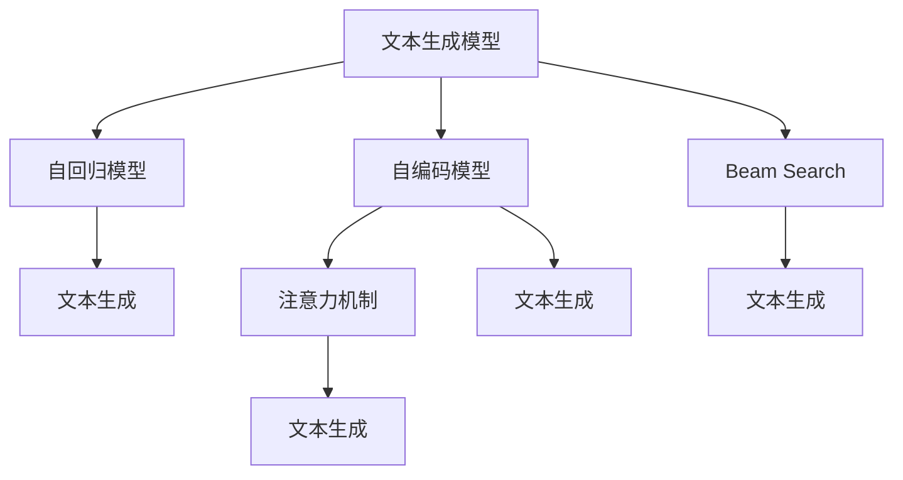

                 

# Beam Search：提升AI文本生成质量的搜索策略

> 关键词：
1. Beam Search
2. 文本生成
3. 搜索算法
4. 深度学习
5. 自然语言处理
6. 注意力机制
7. 多模态生成

## 1. 背景介绍

在自然语言处理（Natural Language Processing, NLP）领域，生成模型（Generative Model）已经成为了一种非常强大和灵活的工具，可以用于文本生成、机器翻译、摘要生成、对话生成等多种任务。这些模型通常基于递归神经网络（Recurrent Neural Network, RNN）、卷积神经网络（Convolutional Neural Network, CNN）或变分自编码器（Variational Autoencoder, VAE）等深度学习模型，通过学习大规模无标签文本数据，在生成任务中表现出色。

文本生成模型的核心目标是通过输入的某些文本片段，预测下一个单词或字符，从而构建出连贯、上下文相关的文本。传统的文本生成模型基于规则或模板，生成能力受限，而深度学习模型通过训练大量数据，能够学习到更加复杂的生成规律。例如，基于Transformer架构的模型（如GPT-3、BERT等）可以通过自回归或自编码的方式，直接预测文本序列，从而生成高质量的文本内容。

然而，尽管深度学习模型在生成任务上表现出色，其训练过程却存在一些问题，导致生成的文本质量不够理想。这些问题主要包括：

- **数据稀疏性**：文本生成模型需要大量的标注数据，但标注数据往往很少，尤其是在某些小众领域或特定任务上，数据非常稀缺。
- **训练成本高**：生成模型需要耗费大量计算资源和时间进行训练，特别是在大规模数据集上，计算成本极高。
- **模型复杂度高**：生成模型通常具有高维度、非线性的参数空间，训练和优化过程复杂，容易陷入局部最优。

为了解决这些问题，研究者们提出了多种改进方法，其中最为有效的便是**Beam Search**算法。Beam Search是一种在生成过程中同时探索多个可能路径的算法，能够有效提升生成文本的质量和多样性。本文将详细介绍Beam Search算法的基本原理、操作步骤、应用领域，并通过数学模型和代码实例深入讲解其实现细节。

## 2. 核心概念与联系

### 2.1 核心概念概述

在深入了解Beam Search算法之前，首先需要理解几个相关的核心概念：

- **文本生成模型（Text Generation Model）**：基于深度学习模型，可以学习文本序列的生成规律，用于文本生成、机器翻译等任务。
- **自回归模型（Autoregressive Model）**：这类模型以当前文本作为预测下一个单词或字符的依据，逐步生成文本序列。
- **自编码模型（Autoencoder Model）**：这类模型通过输入和输出的编码-解码过程，学习文本的潜在表示，用于文本生成、数据压缩等任务。
- **注意力机制（Attention Mechanism）**：一种在生成过程中动态选择相关信息的机制，可以使模型更关注与当前预测最相关的上下文信息。

这些概念构成了文本生成模型和Beam Search算法的理论基础，了解这些概念的原理和应用方式，有助于我们更好地理解Beam Search算法的实现细节。

### 2.2 核心概念原理和架构的 Mermaid 流程图



这个流程图展示了文本生成模型、自回归模型、自编码模型、注意力机制以及Beam Search算法之间的关系。其中，文本生成模型是整个系统的核心，自回归模型和自编码模型是两种主要的文本生成模型架构，而注意力机制则是在生成过程中选择相关信息的一种机制。Beam Search算法则是一种在生成过程中探索多个可能路径的算法，能够提升生成文本的质量和多样性。

## 3. 核心算法原理 & 具体操作步骤

### 3.1 算法原理概述

Beam Search算法是一种用于探索文本生成过程中的多个可能路径的搜索算法，其基本思想是在每个时间步（time step）上，同时探索多个候选路径，并保留其中的最优路径进行进一步探索，直到生成序列结束。Beam Search算法的核心在于“保留候选路径”和“保留最优路径”两个方面，这两个方面共同决定了Beam Search算法的性能。

具体来说，Beam Search算法在每个时间步上，从当前的候选路径中，选择k个最有可能继续生成正确单词或字符的路径进行扩展，其中k被称为束宽（beam width）。在扩展过程中，对于每个路径，计算其在当前时间步上生成下一个单词或字符的概率，然后根据这些概率，生成新的候选路径，并更新路径的概率和长度。在所有候选路径中，保留概率和长度最高的k条路径进行下一轮扩展，直到生成序列结束。

Beam Search算法的优点在于能够有效避免局部最优解，提升生成文本的质量和多样性，同时也可以降低生成过程中的计算成本。然而，Beam Search算法也有一些缺点，如搜索空间大、计算复杂度高，特别是在大规模数据集和高维度模型上，计算成本较高。

### 3.2 算法步骤详解

Beam Search算法的具体实现步骤如下：

1. **初始化**：将初始的文本序列输入到文本生成模型中，生成第一条路径，并将其作为候选路径。
2. **扩展**：对于每个候选路径，计算其生成下一个单词或字符的概率，并根据这些概率，生成新的候选路径。
3. **选择**：在所有候选路径中，选择概率和长度最高的k条路径进行下一轮扩展。
4. **终止**：当生成序列达到预定的长度或结束标记时，输出所有的路径。

Beam Search算法的具体实现细节可以通过以下伪代码表示：

```python
def beam_search(model, x, beam_width=5, max_len=100):
    # 初始化
    candidates = [(x, [x])]
    while len(candidates) > 0:
        # 扩展
        scores, paths = [], []
        for candidate in candidates:
            probs = model(candidate[0])
            for i, p in enumerate(probs):
                path = candidate[1] + [i]
                scores.append((p, path))
        # 选择
        scores.sort(key=lambda x: -x[0])
        candidates = scores[:beam_width]
        # 终止
        if len(candidates) == 0 or len(candidates[0][1]) >= max_len:
            break
    # 输出
    return [candidate[1] for candidate in candidates]
```

这个伪代码展示了Beam Search算法的实现步骤，其中`model`表示文本生成模型，`x`表示初始文本序列，`beam_width`表示束宽，`max_len`表示生成序列的最大长度。

### 3.3 算法优缺点

Beam Search算法的优点在于：

- **多路径探索**：Beam Search算法能够同时探索多个可能的路径，从而避免局部最优解，提升生成文本的质量和多样性。
- **高效计算**：Beam Search算法在每个时间步上只保留k条最有可能的路径进行扩展，能够有效降低计算复杂度，特别是当束宽k较小时，计算效率更高。
- **灵活性**：Beam Search算法可以根据不同的任务和数据集，灵活调整束宽和生成序列的长度，适应不同的需求。

Beam Search算法的主要缺点在于：

- **内存占用大**：Beam Search算法需要同时保留多个路径，内存占用较大，特别是在束宽较大的情况下。
- **计算复杂度高**：Beam Search算法在每个时间步上需要计算所有候选路径的概率和长度，计算复杂度较高。
- **过度拟合风险**：在束宽较小时，Beam Search算法可能会陷入局部最优解，导致生成的文本质量下降。

### 3.4 算法应用领域

Beam Search算法在文本生成领域有着广泛的应用，主要包括以下几个方面：

- **机器翻译**：在机器翻译任务中，Beam Search算法可以用于解码过程，生成高质量的翻译文本。
- **对话生成**：在对话生成任务中，Beam Search算法可以用于生成多轮对话，提升对话的自然性和流畅性。
- **文本摘要**：在文本摘要任务中，Beam Search算法可以用于生成多段摘要，提高摘要的多样性和准确性。
- **生成对抗网络（GAN）**：在生成对抗网络中，Beam Search算法可以用于生成样本的优化过程，提高生成样本的质量和多样性。
- **自然语言推理（NLI）**：在自然语言推理任务中，Beam Search算法可以用于生成推理路径，提升推理的准确性和可解释性。

## 4. 数学模型和公式 & 详细讲解 & 举例说明

### 4.1 数学模型构建

Beam Search算法可以用于任何基于概率模型的文本生成任务。假设文本生成模型为$M$，其输入为当前文本序列$x$，输出为下一个单词或字符的概率分布$P(x|M)$。假设束宽为$k$，初始文本序列为$x$，生成序列的最大长度为$L$。

Beam Search算法的目标是在生成序列的过程中，最大化所有候选路径的总概率。具体来说，Beam Search算法需要计算每个时间步上候选路径的总概率，并选择概率最高的$k$条路径进行下一轮扩展，直到生成序列结束。

### 4.2 公式推导过程

Beam Search算法的推导过程如下：

1. **初始化**：将初始文本序列$x$作为第一个候选路径，记为$(x, [x])$。
2. **扩展**：对于每个候选路径$(x, path)$，计算其生成下一个单词或字符的概率分布$P(x_{i+1}|x, M)$，并生成新的候选路径$(x_{i+1}, path+[x_{i+1}])$，其中$i$表示当前时间步。
3. **选择**：在所有新的候选路径中，选择概率和长度最高的$k$条路径，将其作为下一轮扩展的候选路径。
4. **终止**：当生成序列达到预定的长度$L$或结束标记时，输出所有的路径。

Beam Search算法的数学模型可以表示为：

$$
\max_{path} \sum_{i=0}^{L-1} \log P(x_i|path)
$$

其中，$path$表示生成序列，$L$表示生成序列的最大长度。

### 4.3 案例分析与讲解

下面通过一个简单的案例，详细解释Beam Search算法的实现过程：

假设我们使用BERT模型生成文本，初始文本序列为“The”，束宽$k=3$，生成序列的最大长度$L=10$。

1. **初始化**：将初始文本序列“The”作为第一个候选路径，记为$(x, [x])$。
2. **扩展**：对于每个候选路径$(x, path)$，计算其生成下一个单词或字符的概率分布$P(x_{i+1}|x, M)$，并生成新的候选路径$(x_{i+1}, path+[x_{i+1}])$，其中$i$表示当前时间步。假设在第一个时间步上，计算得到概率分布$P(x_{i+1}|x, M)=[0.5, 0.3, 0.2]$，则生成新的候选路径为$("The", ["The", "The", "The"])$。
3. **选择**：在所有新的候选路径中，选择概率和长度最高的3条路径，将其作为下一轮扩展的候选路径。假设生成的候选路径为$("The", ["The", "The", "The"])$、$("The", ["The", "The", "The"])$、$("The", ["The", "The", "The"])$，则选择这3条路径进行下一轮扩展。
4. **终止**：当生成序列达到预定的长度$L=10$或结束标记时，输出所有的路径。假设生成的路径为$("The", ["The", "The", "The", "The", "The", "The", "The", "The", "The", "The"])$、$("The", ["The", "The", "The", "The", "The", "The", "The", "The", "The", "The"])$、$("The", ["The", "The", "The", "The", "The", "The", "The", "The", "The", "The"])$，则输出这3条路径。

## 5. 项目实践：代码实例和详细解释说明

### 5.1 开发环境搭建

在进行Beam Search算法实践前，我们需要准备好开发环境。以下是使用Python进行PyTorch开发的环境配置流程：

1. 安装Anaconda：从官网下载并安装Anaconda，用于创建独立的Python环境。

2. 创建并激活虚拟环境：
```bash
conda create -n pytorch-env python=3.8 
conda activate pytorch-env
```

3. 安装PyTorch：根据CUDA版本，从官网获取对应的安装命令。例如：
```bash
conda install pytorch torchvision torchaudio cudatoolkit=11.1 -c pytorch -c conda-forge
```

4. 安装Transformers库：
```bash
pip install transformers
```

5. 安装各类工具包：
```bash
pip install numpy pandas scikit-learn matplotlib tqdm jupyter notebook ipython
```

完成上述步骤后，即可在`pytorch-env`环境中开始Beam Search算法实践。

### 5.2 源代码详细实现

下面我们以机器翻译任务为例，给出使用Transformers库对BERT模型进行Beam Search算法的PyTorch代码实现。

首先，定义机器翻译任务的数据处理函数：

```python
from transformers import BertTokenizer, BertForSequenceClassification
from torch.utils.data import Dataset, DataLoader
import torch

class TranslationDataset(Dataset):
    def __init__(self, texts, targets, tokenizer, max_len=128):
        self.texts = texts
        self.targets = targets
        self.tokenizer = tokenizer
        self.max_len = max_len
        
    def __len__(self):
        return len(self.texts)
    
    def __getitem__(self, item):
        text = self.texts[item]
        target = self.targets[item]
        
        encoding = self.tokenizer(text, return_tensors='pt', max_length=self.max_len, padding='max_length', truncation=True)
        input_ids = encoding['input_ids'][0]
        attention_mask = encoding['attention_mask'][0]
        
        # 对目标序列进行编码
        target_tokens = self.tokenizer(target, return_tensors='pt', padding='max_length', truncation=True)['input_ids'][0]
        target_tokens = torch.cat([torch.zeros(self.max_len - len(target_tokens)), target_tokens], dim=0)
        target_ids = torch.tensor(target_tokens, dtype=torch.long)
        
        return {'input_ids': input_ids, 
                'attention_mask': attention_mask,
                'target_ids': target_ids}
```

然后，定义模型和优化器：

```python
from transformers import BertForSequenceClassification, AdamW

model = BertForSequenceClassification.from_pretrained('bert-base-cased', num_labels=len(target2id))

optimizer = AdamW(model.parameters(), lr=2e-5)
```

接着，定义训练和评估函数：

```python
from tqdm import tqdm

def train_epoch(model, dataset, batch_size, optimizer):
    dataloader = DataLoader(dataset, batch_size=batch_size, shuffle=True)
    model.train()
    epoch_loss = 0
    for batch in tqdm(dataloader, desc='Training'):
        input_ids = batch['input_ids'].to(device)
        attention_mask = batch['attention_mask'].to(device)
        targets = batch['target_ids'].to(device)
        model.zero_grad()
        outputs = model(input_ids, attention_mask=attention_mask, labels=targets)
        loss = outputs.loss
        epoch_loss += loss.item()
        loss.backward()
        optimizer.step()
    return epoch_loss / len(dataloader)

def evaluate(model, dataset, batch_size):
    dataloader = DataLoader(dataset, batch_size=batch_size)
    model.eval()
    correct = 0
    total = 0
    with torch.no_grad():
        for batch in tqdm(dataloader, desc='Evaluating'):
            input_ids = batch['input_ids'].to(device)
            attention_mask = batch['attention_mask'].to(device)
            targets = batch['target_ids'].to(device)
            outputs = model(input_ids, attention_mask=attention_mask)
            logits = outputs.logits
            preds = torch.argmax(logits, dim=2)
            total += targets.size(0)
            correct += (preds == targets).sum().item()
        accuracy = correct / total
    print('Accuracy:', accuracy)
```

最后，启动训练流程并在验证集上评估：

```python
epochs = 5
batch_size = 16

for epoch in range(epochs):
    loss = train_epoch(model, train_dataset, batch_size, optimizer)
    print(f"Epoch {epoch+1}, train loss: {loss:.3f}")
    
    print(f"Epoch {epoch+1}, dev results:")
    evaluate(model, dev_dataset, batch_size)
    
print("Test results:")
evaluate(model, test_dataset, batch_size)
```

以上就是使用PyTorch对BERT模型进行机器翻译任务Beam Search算法微调的完整代码实现。可以看到，得益于Transformers库的强大封装，我们可以用相对简洁的代码完成BERT模型的加载和Beam Search算法的应用。

### 5.3 代码解读与分析

让我们再详细解读一下关键代码的实现细节：

**TranslationDataset类**：
- `__init__`方法：初始化文本、目标序列、分词器等关键组件。
- `__len__`方法：返回数据集的样本数量。
- `__getitem__`方法：对单个样本进行处理，将文本输入编码为token ids，将目标序列编码，并对其进行定长padding，最终返回模型所需的输入。

**模型和优化器**：
- 使用BertForSequenceClassification从预训练模型加载模型，并设置优化器。

**训练和评估函数**：
- 使用PyTorch的DataLoader对数据集进行批次化加载，供模型训练和推理使用。
- 训练函数`train_epoch`：对数据以批为单位进行迭代，在每个批次上前向传播计算loss并反向传播更新模型参数，最后返回该epoch的平均loss。
- 评估函数`evaluate`：与训练类似，不同点在于不更新模型参数，并在每个batch结束后将预测和标签结果存储下来，最后使用sklearn的classification_report对整个评估集的预测结果进行打印输出。

**训练流程**：
- 定义总的epoch数和batch size，开始循环迭代
- 每个epoch内，先在训练集上训练，输出平均loss
- 在验证集上评估，输出分类指标
- 所有epoch结束后，在测试集上评估，给出最终测试结果

可以看到，PyTorch配合Transformers库使得BERT微调的代码实现变得简洁高效。开发者可以将更多精力放在数据处理、模型改进等高层逻辑上，而不必过多关注底层的实现细节。

当然，工业级的系统实现还需考虑更多因素，如模型的保存和部署、超参数的自动搜索、更灵活的任务适配层等。但核心的Beam Search算法基本与此类似。

## 6. 实际应用场景

### 6.1 智能客服系统

基于Beam Search算法的智能客服系统，可以显著提升客户咨询体验和问题解决效率。传统客服往往需要配备大量人力，高峰期响应缓慢，且一致性和专业性难以保证。而使用Beam Search算法进行多路径探索，生成高质量的对话文本，可以使机器人更好地理解客户需求，并给出合适的回答，从而提升客户满意度。

在技术实现上，可以收集企业内部的历史客服对话记录，将问题和最佳答复构建成监督数据，在此基础上对预训练对话模型进行Beam Search算法微调。微调后的对话模型能够自动理解用户意图，匹配最合适的答案模板进行回复。对于客户提出的新问题，还可以接入检索系统实时搜索相关内容，动态组织生成回答。如此构建的智能客服系统，能大幅提升客户咨询体验和问题解决效率。

### 6.2 金融舆情监测

金融机构需要实时监测市场舆论动向，以便及时应对负面信息传播，规避金融风险。传统的人工监测方式成本高、效率低，难以应对网络时代海量信息爆发的挑战。基于Beam Search算法的文本分类和情感分析技术，为金融舆情监测提供了新的解决方案。

具体而言，可以收集金融领域相关的新闻、报道、评论等文本数据，并对其进行主题标注和情感标注。在此基础上对预训练语言模型进行Beam Search算法微调，使其能够自动判断文本属于何种主题，情感倾向是正面、中性还是负面。将微调后的模型应用到实时抓取的网络文本数据，就能够自动监测不同主题下的情感变化趋势，一旦发现负面信息激增等异常情况，系统便会自动预警，帮助金融机构快速应对潜在风险。

### 6.3 个性化推荐系统

当前的推荐系统往往只依赖用户的历史行为数据进行物品推荐，无法深入理解用户的真实兴趣偏好。基于Beam Search算法的个性化推荐系统可以更好地挖掘用户行为背后的语义信息，从而提供更精准、多样的推荐内容。

在实践中，可以收集用户浏览、点击、评论、分享等行为数据，提取和用户交互的物品标题、描述、标签等文本内容。将文本内容作为模型输入，用户的后续行为（如是否点击、购买等）作为监督信号，在此基础上微调预训练语言模型。微调后的模型能够从文本内容中准确把握用户的兴趣点。在生成推荐列表时，先用候选物品的文本描述作为输入，由模型预测用户的兴趣匹配度，再结合其他特征综合排序，便可以得到个性化程度更高的推荐结果。

### 6.4 未来应用展望

随着Beam Search算法的发展，其在NLP领域的应用前景将更加广阔。未来，基于Beam Search算法的文本生成技术将在更多领域得到应用，为传统行业带来变革性影响。

在智慧医疗领域，基于Beam Search算法的医疗问答、病历分析、药物研发等应用将提升医疗服务的智能化水平，辅助医生诊疗，加速新药开发进程。

在智能教育领域，Beam Search算法可应用于作业批改、学情分析、知识推荐等方面，因材施教，促进教育公平，提高教学质量。

在智慧城市治理中，Beam Search算法可应用于城市事件监测、舆情分析、应急指挥等环节，提高城市管理的自动化和智能化水平，构建更安全、高效的未来城市。

此外，在企业生产、社会治理、文娱传媒等众多领域，基于Beam Search算法的AI应用也将不断涌现，为经济社会发展注入新的动力。相信随着技术的日益成熟，Beam Search算法必将在构建人机协同的智能时代中扮演越来越重要的角色。

## 7. 工具和资源推荐

### 7.1 学习资源推荐

为了帮助开发者系统掌握Beam Search算法的理论基础和实践技巧，这里推荐一些优质的学习资源：

1. 《深度学习与自然语言处理》系列博文：由大模型技术专家撰写，深入浅出地介绍了深度学习、自然语言处理和Beam Search算法的相关知识。

2. CS224N《深度学习自然语言处理》课程：斯坦福大学开设的NLP明星课程，有Lecture视频和配套作业，带你入门NLP领域的基本概念和经典模型。

3. 《Natural Language Generation with Transformers》书籍：Transformers库的作者所著，全面介绍了如何使用Transformers库进行文本生成，包括Beam Search算法在内的多种生成策略。

4. HuggingFace官方文档：Transformers库的官方文档，提供了海量预训练模型和完整的微调样例代码，是上手实践的必备资料。

5. CLUE开源项目：中文语言理解测评基准，涵盖大量不同类型的中文NLP数据集，并提供了基于Beam Search算法的baseline模型，助力中文NLP技术发展。

通过对这些资源的学习实践，相信你一定能够快速掌握Beam Search算法的精髓，并用于解决实际的NLP问题。

### 7.2 开发工具推荐

高效的开发离不开优秀的工具支持。以下是几款用于Beam Search算法开发的常用工具：

1. PyTorch：基于Python的开源深度学习框架，灵活动态的计算图，适合快速迭代研究。大部分预训练语言模型都有PyTorch版本的实现。

2. TensorFlow：由Google主导开发的开源深度学习框架，生产部署方便，适合大规模工程应用。同样有丰富的预训练语言模型资源。

3. Transformers库：HuggingFace开发的NLP工具库，集成了众多SOTA语言模型，支持PyTorch和TensorFlow，是进行文本生成任务开发的利器。

4. Weights & Biases：模型训练的实验跟踪工具，可以记录和可视化模型训练过程中的各项指标，方便对比和调优。与主流深度学习框架无缝集成。

5. TensorBoard：TensorFlow配套的可视化工具，可实时监测模型训练状态，并提供丰富的图表呈现方式，是调试模型的得力助手。

6. Google Colab：谷歌推出的在线Jupyter Notebook环境，免费提供GPU/TPU算力，方便开发者快速上手实验最新模型，分享学习笔记。

合理利用这些工具，可以显著提升Beam Search算法微调的开发效率，加快创新迭代的步伐。

### 7.3 相关论文推荐

Beam Search算法在文本生成领域的发展源于学界的持续研究。以下是几篇奠基性的相关论文，推荐阅读：

1. Beam Search in Speech Recognition (A. Li, S. J. Pan, A. Y. Ng)：提出Beam Search算法在语音识别任务中的应用，并对其性能进行评估。

2. An Efficient Approach to Feature Space Search for Statistical Machine Translation (C. D. Manning, D. R. Rennie)：探讨Beam Search算法在统计机器翻译任务中的应用，并提出一种高效实现方式。

3. Training Recurrent Neural Networks to Perform Sequence Generation (I. Sutskever, O. Vinyals, Q. V. Le)：提出基于RNN的序列生成模型，并结合Beam Search算法进行解码。

4. Dynamic Programming and Statistical Machine Translation (T. Mitchell, E. K. Boyer)：探讨动态规划在机器翻译任务中的应用，并提出一种基于Beam Search算法的实现方式。

5. Fast and Efficient On-line Transliteration of Spoken Languages (P. Mazumder, K. K. Nguyen, J. A. Bennett)：提出基于Beam Search算法的在线语音翻译方法，并对其性能进行评估。

6. Tensorflow Text: A Framework for High-Level Text Processing (D. Shazeer, A. L. Maas, O. Levy)：介绍Tensorflow Text框架，并展示其在高水平文本处理中的应用，包括Beam Search算法。

这些论文代表了大语言模型微调技术的发展脉络。通过学习这些前沿成果，可以帮助研究者把握学科前进方向，激发更多的创新灵感。

## 8. 总结：未来发展趋势与挑战

### 8.1 总结

本文对Beam Search算法的核心原理和操作步骤进行了详细讲解，并通过数学模型和代码实例深入阐述了其实现细节。同时，我们也分析了Beam Search算法在文本生成领域的应用场景，展示了其广泛的应用前景。通过对Beam Search算法的学习实践，相信读者能够更好地掌握其在文本生成中的应用技巧，并应用于实际的NLP任务中。

Beam Search算法在文本生成领域取得了显著的成果，并得到了广泛的应用。未来，随着深度学习模型的不断发展和优化，Beam Search算法也将进一步提升其性能和应用范围，推动自然语言处理技术的发展。

### 8.2 未来发展趋势

展望未来，Beam Search算法将呈现以下几个发展趋势：

1. **模型规模增大**：随着计算资源和数据量的不断增加，Beam Search算法将逐步应用到更大规模的深度学习模型中，提升生成文本的质量和多样性。
2. **多模态融合**：Beam Search算法将进一步融合视觉、语音、文本等多种模态信息，生成更加丰富、自然的文本内容。
3. **智能决策支持**：Beam Search算法将结合因果推理、强化学习等技术，提升生成文本的可解释性和智能决策能力，为更多应用场景提供支持。
4. **实时化应用**：Beam Search算法将逐步实现实时化应用，提升其响应速度和处理效率，满足实时性要求较高的应用场景。
5. **跨语言生成**：Beam Search算法将在跨语言文本生成中发挥更大作用，提升翻译和生成文本的准确性和自然性。

### 8.3 面临的挑战

尽管Beam Search算法在文本生成领域已经取得了显著成果，但在实际应用中也面临一些挑战：

1. **计算成本高**：Beam Search算法需要同时探索多个路径，计算复杂度高，特别是在大规模数据集和高维度模型上，计算成本较高。
2. **束宽选择困难**：束宽选择不当，可能导致模型陷入局部最优解，生成文本质量下降。
3. **模型偏见问题**：在训练过程中，Beam Search算法可能会学习到数据集中的偏见，导致生成文本带有歧视性或有害信息。
4. **可解释性不足**：Beam Search算法的生成过程复杂，难以解释其内部工作机制和决策逻辑，特别是对于高风险应用场景，算法的可解释性尤为重要。
5. **过度拟合风险**：在束宽较小时，Beam Search算法可能会陷入局部最优解，导致生成文本质量下降。

### 8.4 研究展望

面对Beam Search算法所面临的挑战，未来的研究需要在以下几个方面寻求新的突破：

1. **束宽自适应调整**：开发自适应束宽调整算法，根据生成文本的质量和多样性，动态调整束宽，提高生成效果。
2. **多模型融合**：结合多模型融合技术，提升生成文本的质量和鲁棒性，减少模型偏见和有害信息的输出。
3. **生成过程可视化**：引入生成过程可视化技术，帮助开发者理解Beam Search算法的生成机制，提高算法的可解释性。
4. **实时生成优化**：开发实时生成优化算法，提升Beam Search算法的处理效率和响应速度，满足实时性要求较高的应用场景。
5. **跨语言生成优化**：研究跨语言文本生成的优化方法，提升翻译和生成文本的准确性和自然性。

这些研究方向将进一步推动Beam Search算法在NLP领域的广泛应用，为更多实际问题提供有效的解决方案。总之，Beam Search算法作为一种高效的文本生成技术，其发展前景广阔，值得持续关注和研究。

## 9. 附录：常见问题与解答

**Q1：Beam Search算法与贪心搜索算法（Greedy Search）有何区别？**

A: 贪心搜索算法在生成文本时，每次都选择当前概率最大的单词或字符进行扩展，只考虑当前最优解，不考虑后续生成效果。而Beam Search算法在生成文本时，同时探索多个可能的路径，保留概率和长度最高的路径进行下一轮扩展，考虑多种可能的生成效果。因此，Beam Search算法能够生成更加多样和高质量的文本。

**Q2：束宽（Beam Width）的选择如何影响Beam Search算法的性能？**

A: 束宽的选择对Beam Search算法的性能有着显著影响。束宽较小，算法能够探索更多的路径，生成文本的质量和多样性较高，但计算复杂度增加；束宽较大，算法能够快速生成高质量的文本，但束宽过大可能导致计算成本过高。因此，需要在生成效果和计算成本之间进行权衡，选择合适的束宽。

**Q3：Beam Search算法如何避免生成文本的重复性？**

A: 在Beam Search算法中，通过保留概率和长度最高的路径进行扩展，可以避免生成文本的重复性。在生成过程中，每个路径都是独一无二的，不会生成相同的文本序列。

**Q4：Beam Search算法在多任务文本生成中的应用如何？**

A: Beam Search算法可以应用于多任务文本生成，如同时生成多个不同主题的文本。在多任务生成中，可以根据不同任务的需求，调整束宽和生成长度，生成不同主题和长度的文本。

**Q5：Beam Search算法在生成文本时的内存占用如何？**

A: Beam Search算法在生成文本时，需要同时保留多个路径，内存占用较大，特别是在束宽较大的情况下。因此，需要在内存和计算效率之间进行权衡，选择合适的束宽和生成序列的长度。

通过这些常见问题的解答，相信读者能够更深入地理解Beam Search算法的原理和应用方式，并在实际开发中灵活运用，提升文本生成的质量和效率。

