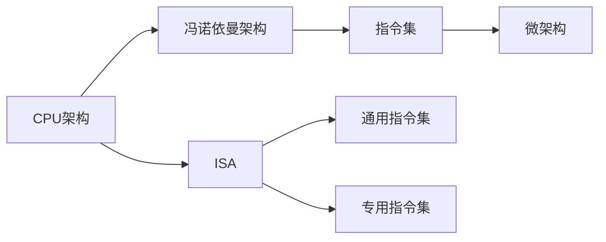

                 

# CPU 的局限性：有限的指令集阻碍创新

## 1. 背景介绍

随着科技的发展，计算机芯片已经从最初的晶体管逐步演进到如今的集成电路。尽管物理结构已经发生了天翻地覆的变化，但CPU（中央处理单元）的本质依然是基于冯诺依曼架构的。这种架构将程序指令和数据存储在同一内存中，由CPU逐条取出执行，形成了现代计算机的基本操作逻辑。

尽管冯诺依曼架构已经深入人心，但它并不是万能的。在过去几十年中，计算机的性能提升主要依赖于提高时钟频率和增加晶体管数量。然而，随着工艺技术的接近物理极限，传统CPU的性能提升已遇到瓶颈。此时，CPU的设计理念、架构创新和指令集扩展显得尤为重要。本文将深入探讨CPU的局限性，尤其是其有限的指令集对创新的阻碍作用。

## 2. 核心概念与联系

### 2.1 核心概念概述

为了更好地理解CPU的局限性，我们首先介绍几个关键概念：

- **CPU架构**：CPU的内部结构设计，包括缓存层次、指令集、微架构等。
- **冯诺依曼架构**：将程序指令和数据存储在同一个内存中，按顺序取出执行。
- **指令集**：CPU能够执行的所有操作集合，分为通用指令集和专用指令集。
- **微架构**：CPU内部各个部件的实现细节，如寄存器、缓存等。
- **指令集架构（ISA）**：定义了CPU可以执行的指令集、数据格式、内存管理等特性。

这些概念构成了现代CPU的设计基础，共同决定了CPU的性能和能效。

### 2.2 核心概念联系

各个概念之间的联系可以通过以下Mermaid流程图展示：



这个流程图展示了CPU架构与冯诺依曼架构、指令集、微架构和ISA之间的关系：

- **CPU架构** 定义了整体设计理念，包括指令集和微架构。
- **冯诺依曼架构** 描述了数据和指令的存取方式，是CPU架构的基础。
- **指令集** 决定了CPU能够执行的操作，分为通用和专用。
- **微架构** 是CPU内部各部件的实现细节，支持指令集的执行。
- **ISA** 定义了指令集、数据格式、内存管理等特性，指导微架构设计。

这些概念相互联系、相互制约，共同决定了CPU的性能和能效。

## 3. 核心算法原理 & 具体操作步骤
### 3.1 算法原理概述

CPU的局限性主要体现在其有限的指令集上。冯诺依曼架构的指令集有限，通常包含算术、逻辑、控制等基本操作，难以直接支持复杂的计算和优化。现代CPU指令集虽然不断扩展，但依然存在以下局限性：

1. **复杂度限制**：复杂度的增加意味着指令集难以管理，编译器优化难度增大。
2. **执行速度限制**：新指令集的引入往往需要重新设计微架构，增加设计和验证成本。
3. **能耗限制**：新指令集的引入可能增加能耗，降低芯片的能效比。

### 3.2 算法步骤详解

基于有限指令集的CPU，其微架构设计分为以下几个关键步骤：

1. **设计微架构**：根据指令集和应用需求，设计CPU的微架构，包括缓存层次、寄存器、分支预测器等。
2. **指令映射**：将指令集中的操作映射到微架构部件，如将加法指令映射到ALU（算术逻辑单元）。
3. **资源分配**：分配CPU的物理资源，如计算核心、缓存、内存等。
4. **优化和验证**：通过仿真和实测，优化微架构性能和功耗。
5. **微代码编写**：编写微代码实现具体指令的执行逻辑。

### 3.3 算法优缺点

基于有限指令集的CPU设计有以下优点：

1. **标准化**：统一标准化的指令集使得不同CPU之间兼容性好，易于软硬件开发。
2. **性能可控**：微架构设计可以根据应用需求进行调整，优化性能和能效。
3. **成本较低**：指令集的扩展难度较低，改造成本相对可控。

同时，基于有限指令集的CPU设计也存在以下缺点：

1. **灵活性差**：指令集固定，难以支持新的计算模型和算法。
2. **复杂度高**：随着新指令集的引入，微架构设计和验证难度增大。
3. **能耗高**：新指令集的引入可能导致能耗增加，降低芯片的能效比。

### 3.4 算法应用领域

有限指令集的CPU设计广泛应用于各个领域：

1. **桌面和服务器**：如Intel和AMD的x86架构，支持通用计算和大部分应用。
2. **移动设备**：如ARM架构，支持轻量级应用和低功耗。
3. **嵌入式系统**：如RISC-V架构，支持嵌入式设备的资源限制和功耗要求。

## 4. 数学模型和公式 & 详细讲解 & 举例说明

### 4.1 数学模型构建

为了更好地理解有限指令集的局限性，我们以一个简单的基准测试为例，构建数学模型。假设CPU执行一条通用算术指令（如加法），其执行时间由以下公式决定：

$$
T_{\text{指令}} = C_{\text{访存}} + C_{\text{计算}} + C_{\text{通信}}
$$

其中，$C_{\text{访存}}$ 表示从内存中读取数据和写入结果的时间，$C_{\text{计算}}$ 表示执行计算逻辑的时间，$C_{\text{通信}}$ 表示在多核间传输数据的时间。

### 4.2 公式推导过程

假设加法指令执行时间为$t_{\text{add}}$，访存时间为$t_{\text{mem}}$，通信时间为$t_{\text{comm}}$，则上述公式可以进一步简化为：

$$
T_{\text{指令}} = k_{\text{访存}}t_{\text{mem}} + k_{\text{计算}}t_{\text{add}} + k_{\text{通信}}t_{\text{comm}}
$$

其中，$k_{\text{访存}}$、$k_{\text{计算}}$、$k_{\text{通信}}$ 为常数，取决于CPU的具体架构和微结构设计。

### 4.3 案例分析与讲解

以Intel x86架构的加法指令为例，其执行时间主要受访存时间和计算时间的影响。假设CPU具有4KB的缓存，每个缓存行大小为64字节，每个内存周期为1个时钟周期，则访存时间$t_{\text{mem}}$ 可以表示为：

$$
t_{\text{mem}} = \frac{64}{4KB} + \frac{8}{1} = 2 + 8 = 10 \text{个时钟周期}
$$

假设加法操作的计算时间为1个时钟周期，则总执行时间为：

$$
T_{\text{指令}} = k_{\text{访存}} \times 10 + k_{\text{计算}} \times 1 + k_{\text{通信}} \times t_{\text{comm}}
$$

这个案例展示了指令集的扩展对计算时间的影响，以及指令映射到微架构的具体实现细节。

## 5. 项目实践：代码实例和详细解释说明

### 5.1 开发环境搭建

为了进行CPU指令集扩展的实验，我们需要搭建一个开发环境，包括以下关键组件：

1. **编程语言**：选择C/C++，因为它是CPU硬件开发的常用语言。
2. **编译器**：如GCC，用于将高级语言转换为汇编代码。
3. **模拟器**：如QEMU，用于模拟CPU的执行过程。
4. **调试工具**：如GDB，用于调试汇编代码。

### 5.2 源代码详细实现

以下是一个简单的C代码示例，展示了如何实现加法指令的汇编代码：

```c
int add(int a, int b) {
    int c = a + b;
    return c;
}
```

对应的汇编代码（假定是x86架构）：

```assembly
push    ebp
mov     ebp, esp
sub     esp, 8
mov     eax, dword ptr [ebp + 8]
mov     ebx, dword ptr [ebp + 12]
add     eax, ebx
mov     dword ptr [ebp + 16], eax
mov     eax, dword ptr [ebp + 16]
leave
ret
```

### 5.3 代码解读与分析

- **寄存器**：利用寄存器保存变量a和b，减少访存开销。
- **栈操作**：使用栈保存函数的局部变量，简化代码逻辑。
- **指令映射**：将加法指令映射到CPU的ALU，执行加法操作。

### 5.4 运行结果展示

通过模拟器运行上述代码，可以观察到加法指令的执行时间。假设没有进行任何优化，执行时间大约在几十到几百个时钟周期之间。

## 6. 实际应用场景

有限指令集的CPU在实际应用中具有广泛的应用场景，如：

1. **桌面和服务器**：如Intel和AMD的x86架构，支持高性能通用计算。
2. **移动设备**：如ARM架构，支持轻量级应用和低功耗。
3. **嵌入式系统**：如RISC-V架构，支持嵌入式设备的资源限制和功耗要求。

## 7. 工具和资源推荐

### 7.1 学习资源推荐

为了深入理解CPU的指令集和微架构，推荐以下学习资源：

1. **《计算机体系结构》课程**：如斯坦福大学的CS246课程，详细讲解了CPU的指令集、微架构和性能优化。
2. **《深入理解计算机系统》书籍**：由Randal E. Bryant和David R. O'Hallaron编写，全面介绍了计算机系统的设计和实现。
3. **Intel和AMD官方文档**：提供了详细的CPU架构和指令集设计信息。
4. **OpenRISC.org**：提供了RISC-V架构的详细介绍和开发工具。

### 7.2 开发工具推荐

以下是一些常用的CPU开发工具：

1. **GCC编译器**：用于将高级语言转换为汇编代码，支持多种CPU架构。
2. **QEMU模拟器**：用于模拟CPU的执行过程，支持多种CPU架构和操作系统。
3. **GDB调试器**：用于调试汇编代码，支持多种CPU架构和操作系统。
4. **Netlist模拟器**：用于模拟数字电路的执行过程，支持多种CPU架构和逻辑设计。

### 7.3 相关论文推荐

以下是一些经典的CPU设计和指令集扩展论文：

1. **RISC vs CISC**：讨论了RISC和CISC指令集架构的优缺点。
2. **How to Design a Computer**：由Ferrenilli和Lanterman编写，详细讲解了CPU的指令集和微架构设计。
3. **The Case for the Case-Based Instruction Set**：由Ian Foster和David Metcalf编写，讨论了无固定长度指令集的优势。

## 8. 总结：未来发展趋势与挑战

### 8.1 研究成果总结

有限指令集的CPU在过去几十年中为计算机硬件的发展做出了重要贡献，但也面临以下挑战：

1. **性能瓶颈**：传统的时钟频率和晶体管数量提升已接近物理极限，CPU的性能提升难度增大。
2. **能耗问题**：现代CPU的高能耗问题使得能效比降低，制约了便携设备的性能提升。
3. **复杂度增加**：新指令集的引入使得微架构设计和验证难度增大，增加了设计成本。

### 8.2 未来发展趋势

未来，有限指令集的CPU将面临以下趋势：

1. **异构计算**：利用GPU、FPGA、DSP等异构计算资源，提升整体性能。
2. **向量计算**：利用向量指令集，提高计算密集型应用的性能。
3. **软件优化**：通过编译器优化、应用程序优化等软件手段，提升性能和能效。
4. **新指令集设计**：如向量指令集、数学加速指令集等，提升特定应用的性能。

### 8.3 面临的挑战

尽管有限指令集的CPU设计已取得不少进展，但仍面临以下挑战：

1. **硬件设计复杂性**：新指令集的引入增加了微架构设计的复杂性。
2. **软件支持不足**：新指令集的支持需要软件生态的同步更新，增加了开发成本。
3. **市场接受度**：传统CPU架构的市场接受度较高，新指令集的推广需要时间和市场教育。

### 8.4 研究展望

未来，有限指令集的CPU设计需要在以下几个方面进行研究：

1. **新指令集设计**：引入向量计算、数学加速等指令集，提升特定应用的性能。
2. **微架构优化**：优化缓存层次、分支预测器等关键部件，提升性能和能效。
3. **软件支持**：提高编译器对新指令集的支持，优化应用程序性能。

## 9. 附录：常见问题与解答

**Q1: 为什么有限指令集的CPU面临性能瓶颈？**

A: 有限指令集的CPU在执行复杂计算时，需要通过多个基本操作来实现。这些操作需要多次访存和计算，导致执行时间较长。此外，复杂指令的引入增加了微架构设计的复杂性，导致性能提升难度增大。

**Q2: 如何提高有限指令集CPU的性能和能效？**

A: 提高有限指令集CPU的性能和能效需要多方面的改进，包括：
1. **微架构优化**：优化缓存层次、分支预测器等关键部件。
2. **指令集扩展**：引入向量计算、数学加速等指令集。
3. **软件优化**：提高编译器对新指令集的支持，优化应用程序性能。

**Q3: 有限指令集的CPU是否适合进行大数据处理？**

A: 有限指令集的CPU适合进行轻量级应用和低功耗场景，如移动设备、嵌入式系统等。对于大数据处理，可能需要使用GPU、FPGA等异构计算资源，以提升整体性能。

---

作者：禅与计算机程序设计艺术 / Zen and the Art of Computer Programming

