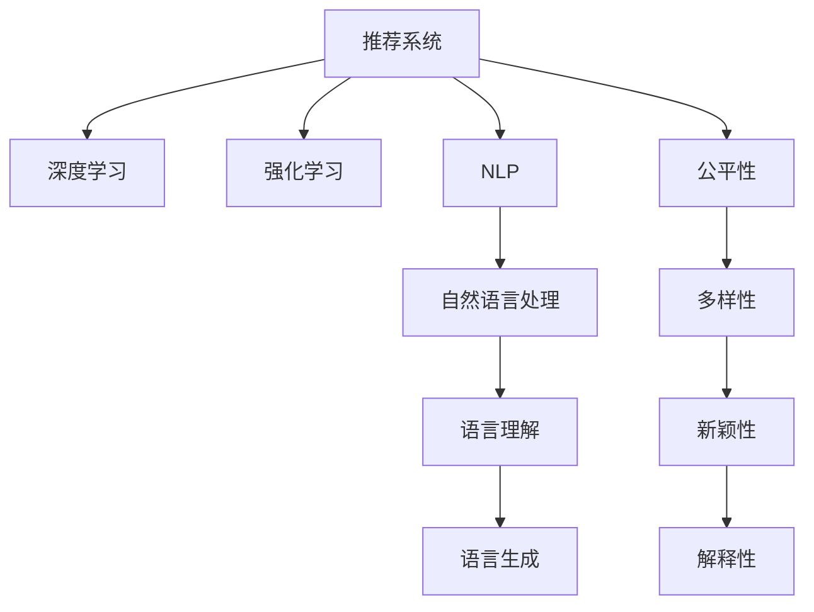

                 

# ChatGPT在推荐领域的内部研究：性能、局限性与未来方向

> 关键词：推荐系统,ChatGPT,自然语言处理(NLP),深度学习,强化学习,公平性,解释性

## 1. 背景介绍

### 1.1 推荐系统的现状与问题

随着电子商务的蓬勃发展和互联网技术的不断进步，推荐系统已成为商业和社会活动中不可或缺的一部分。它们通过分析用户的历史行为数据和偏好，为用户推荐个性化的商品或内容，极大地提升了用户体验和商家收益。然而，推荐系统也面临着诸多挑战，包括数据稀疏性、冷启动问题、多样性和新颖性等，这限制了其推荐效果和应用范围。

### 1.2 问题由来

为解决推荐系统面临的挑战，研究人员探索了多种技术手段，如基于内容的推荐、协同过滤、深度学习和强化学习等。其中，深度学习方法因其强大的特征提取能力，在推荐系统中取得了显著成效。然而，深度学习模型往往需要大量标注数据，难以处理长尾和异构数据，且缺乏对推荐过程的可解释性。

### 1.3 问题核心关键点

1. **数据稀疏性**：用户行为数据通常稀疏且不完整，难以直接用于模型训练。
2. **冷启动问题**：新用户的推荐难以基于其历史数据进行，需要找到其他方法来处理。
3. **多样性和新颖性**：推荐系统需要平衡推荐的多样性和新颖性，避免过度拟合用户偏好，推荐内容单一。
4. **公平性**：推荐系统应确保推荐内容的公平性，避免偏见和歧视。
5. **解释性**：推荐系统的决策过程应具有可解释性，便于用户理解和管理。

## 2. 核心概念与联系

### 2.1 核心概念概述

为更好地理解ChatGPT在推荐系统中的应用，本节将介绍几个关键概念：

- **推荐系统**：基于用户历史行为数据和偏好，为用户推荐个性化商品或内容的技术。推荐系统广泛应用于电商、新闻、视频等领域。
- **深度学习**：一种通过多层神经网络模拟人脑神经元工作原理的机器学习技术，可用于处理复杂的数据结构和模式。
- **强化学习**：一种基于奖励和惩罚的机器学习技术，可用于动态优化决策策略。
- **自然语言处理(NLP)**：处理人类语言的技术，包括语言理解、生成、推理等，可用于构建自然语言交互式推荐系统。
- **公平性**：推荐系统应确保推荐的公平性，避免对某些用户或群体的歧视。
- **解释性**：推荐系统的决策过程应具有可解释性，便于用户理解和管理。

这些核心概念之间的逻辑关系可以通过以下Mermaid流程图来展示：



这个流程图展示了大语言模型在推荐系统中的应用链条：

1. 推荐系统利用深度学习进行特征提取和模型训练。
2. 深度学习模型可以引入自然语言处理技术，进行语言理解与生成。
3. 强化学习用于动态优化推荐策略，平衡多样性和新颖性。
4. 公平性、多样性、新颖性和解释性是推荐系统的重要考量因素。

## 3. ChatGPT在推荐领域的核心算法原理 & 具体操作步骤

### 3.1 算法原理概述

ChatGPT作为大型语言模型，在推荐系统中的应用主要基于其强大的语言理解和生成能力。其核心思想是将用户输入的查询转化为推荐对象的语义表示，然后利用预训练模型生成候选推荐结果，并通过多轮对话与用户进行交互，逐步调整推荐策略，提升推荐效果。

形式化地，假设用户查询为 $q$，推荐对象集合为 $S$。推荐系统的目标是在 $S$ 中找到一个最优的推荐对象 $r$，使得 $q$ 与 $r$ 的相似度最大。该问题可以形式化为：

$$
\arg\max_{r \in S} \text{similarity}(q, r)
$$

其中 $\text{similarity}$ 表示用户查询和推荐对象的相似度函数。ChatGPT通过预训练模型 $M_{\theta}$ 和微调模型 $M_{\hat{\theta}}$ 来计算相似度，具体流程如下：

1. 将用户查询 $q$ 转换为文本表示 $q' = M_{\theta}(q)$。
2. 使用微调模型 $M_{\hat{\theta}}$ 生成候选推荐对象文本表示 $r'_i = M_{\hat{\theta}}(r_i)$，其中 $r_i \in S$。
3. 计算用户查询和每个候选推荐对象之间的相似度，选择相似度最高的推荐对象 $r^*$ 作为最终推荐结果。

### 3.2 算法步骤详解

ChatGPT在推荐系统中的应用主要包括以下几个关键步骤：

**Step 1: 预训练语言模型的选择**

选择适当的预训练语言模型作为初始化参数。如GPT-3、BERT、T5等。这些模型通过大规模无标签文本数据进行预训练，学习到了丰富的语言知识和表示能力。

**Step 2: 微调模型的设计**

设计微调模型 $M_{\hat{\theta}}$，通常是基于自回归架构的生成模型。例如，可以采用GPT-3等架构，通过在少量标注数据上进行微调，使得模型能够生成与用户查询语义相近的推荐对象文本。

**Step 3: 相似度计算**

利用预训练语言模型 $M_{\theta}$ 和微调模型 $M_{\hat{\theta}}$ 计算用户查询 $q$ 与候选推荐对象 $r_i$ 之间的相似度。例如，可以使用余弦相似度、点积相似度等方法。

**Step 4: 推荐排序**

根据相似度计算结果，对所有候选推荐对象 $r_i$ 进行排序，选择得分最高的推荐对象作为最终推荐结果。

**Step 5: 用户交互**

通过多轮对话与用户进行交互，收集用户的反馈，动态调整推荐策略，提升推荐效果。例如，可以根据用户点击、评分等反馈，调整模型的训练目标和参数。

**Step 6: 模型评估与优化**

定期在验证集和测试集上评估推荐模型的效果，根据评估结果调整模型参数和训练策略。例如，可以引入更多用户反馈，增加数据增强等技术。

### 3.3 算法优缺点

ChatGPT在推荐系统中的应用具有以下优点：

1. **强大的语言理解能力**：ChatGPT能够理解自然语言查询，将其转化为推荐对象的语义表示，从而提高了推荐的相关性和准确性。
2. **动态优化推荐策略**：通过多轮对话与用户进行交互，ChatGPT可以动态调整推荐策略，提升用户体验。
3. **跨领域知识迁移**：ChatGPT可以从多个领域学习知识，并将其应用于推荐系统中，扩展了推荐系统的应用范围。
4. **可解释性**：ChatGPT的生成过程具有可解释性，便于用户理解推荐逻辑。

同时，该方法也存在一定的局限性：

1. **计算资源需求高**：大规模语言模型通常需要大量计算资源进行训练和推理，难以实时部署。
2. **数据依赖性强**：微调模型需要大量标注数据，难以处理长尾数据和异构数据。
3. **公平性问题**：ChatGPT可能学习到数据中的偏见和歧视，导致推荐不公平。
4. **解释性有限**：尽管ChatGPT生成过程具有可解释性，但其内部逻辑复杂，难以完全解释推荐结果。

### 3.4 算法应用领域

ChatGPT在推荐系统中的应用广泛应用于多个领域：

1. **电商推荐**：利用用户查询生成推荐商品，提升购物体验。例如，亚马逊和淘宝等电商平台使用ChatGPT进行个性化商品推荐。
2. **内容推荐**：利用用户查询生成推荐文章、视频等，提升内容消费体验。例如，Netflix和YouTube等平台使用ChatGPT进行内容推荐。
3. **对话系统**：通过多轮对话与用户进行交互，获取更多反馈，优化推荐策略。例如，微软的Cortana和Google Assistant等智能助手使用ChatGPT进行对话推荐。

除了上述这些经典应用外，ChatGPT还在健康、教育、金融等领域展现出广阔的应用前景。

## 4. ChatGPT在推荐系统的数学模型和公式 & 详细讲解

### 4.1 数学模型构建

在推荐系统中，ChatGPT通过预训练语言模型 $M_{\theta}$ 和微调模型 $M_{\hat{\theta}}$ 计算用户查询和推荐对象之间的相似度，具体如下：

假设用户查询为 $q$，推荐对象为 $r$，其文本表示分别为 $q'$ 和 $r'$。则相似度函数 $\text{similarity}(q', r')$ 可以定义为：

$$
\text{similarity}(q', r') = \frac{\text{dot}(q', r')}{\|\text{normal}(q')\|\|\text{normal}(r')\|}
$$

其中 $\text{dot}$ 表示两个向量点积，$\|\cdot\|$ 表示向量范数，$\text{normal}$ 表示向量归一化。

### 4.2 公式推导过程

以GPT-3为例，点积相似度计算过程如下：

1. **预训练模型计算**：
   - 将用户查询 $q$ 输入到预训练模型 $M_{\theta}$ 中，得到其文本表示 $q' = M_{\theta}(q)$。
   - 同样将推荐对象 $r$ 输入到预训练模型 $M_{\theta}$ 中，得到其文本表示 $r' = M_{\theta}(r)$。

2. **微调模型生成**：
   - 使用微调模型 $M_{\hat{\theta}}$ 生成推荐对象 $r$ 的语义表示 $r' = M_{\hat{\theta}}(r)$。
   - 对用户查询 $q$ 的文本表示 $q'$ 进行归一化处理，得到 $\text{normal}(q')$。

3. **相似度计算**：
   - 计算 $q'$ 和 $r'$ 的点积 $\text{dot}(q', r')$。
   - 计算 $q'$ 和 $r'$ 的范数 $\|\text{normal}(q')\|$ 和 $\|\text{normal}(r')\|$。
   - 根据点积和范数计算相似度 $\text{similarity}(q', r')$。

4. **推荐排序**：
   - 对所有候选推荐对象 $r_i$ 进行上述计算，得到相似度分数 $\text{similarity}(q', r_i')$。
   - 对所有候选推荐对象 $r_i$ 根据相似度分数进行排序，选择得分最高的推荐对象 $r^*$ 作为最终推荐结果。

### 4.3 案例分析与讲解

以电商推荐系统为例，假设用户查询为“我想买一款智能手表”，推荐系统从数据库中选出若干智能手表产品。ChatGPT通过预训练模型和微调模型计算每个产品的语义表示与查询的相似度，选择相似度最高的产品作为推荐结果。

1. **预训练模型计算**：
   - 将用户查询输入到GPT-3中，得到其文本表示 $q' = M_{\theta}(q)$。
   - 同样将候选智能手表产品输入到GPT-3中，得到其文本表示 $r'_i = M_{\theta}(r_i)$。

2. **微调模型生成**：
   - 使用微调模型生成每个产品的语义表示 $r'_i = M_{\hat{\theta}}(r_i)$。
   - 对用户查询的文本表示 $q'$ 进行归一化处理，得到 $\text{normal}(q')$。

3. **相似度计算**：
   - 计算 $q'$ 和 $r'_i$ 的点积 $\text{dot}(q', r'_i')$。
   - 计算 $q'$ 和 $r'_i$ 的范数 $\|\text{normal}(q')\|$ 和 $\|\text{normal}(r'_i')\|$。
   - 根据点积和范数计算相似度 $\text{similarity}(q', r'_i')$。

4. **推荐排序**：
   - 对所有候选智能手表产品进行上述计算，得到相似度分数 $\text{similarity}(q', r'_i')$。
   - 对所有产品根据相似度分数进行排序，选择得分最高的产品 $r^*$ 作为最终推荐结果。

通过上述过程，ChatGPT能够根据用户查询生成个性化推荐，显著提升用户体验。

## 5. ChatGPT在推荐系统的项目实践：代码实例和详细解释说明

### 5.1 开发环境搭建

在进行推荐系统开发前，我们需要准备好开发环境。以下是使用Python进行PyTorch开发的环境配置流程：

1. 安装Anaconda：从官网下载并安装Anaconda，用于创建独立的Python环境。

2. 创建并激活虚拟环境：
```bash
conda create -n recsys-env python=3.8 
conda activate recsys-env
```

3. 安装PyTorch：根据CUDA版本，从官网获取对应的安装命令。例如：
```bash
conda install pytorch torchvision torchaudio cudatoolkit=11.1 -c pytorch -c conda-forge
```

4. 安装Transformers库：
```bash
pip install transformers
```

5. 安装各类工具包：
```bash
pip install numpy pandas scikit-learn matplotlib tqdm jupyter notebook ipython
```

完成上述步骤后，即可在`recsys-env`环境中开始推荐系统开发。

### 5.2 源代码详细实现

下面我们以电商推荐系统为例，给出使用Transformers库对GPT-3模型进行电商推荐系统开发的PyTorch代码实现。

首先，定义电商推荐系统的数据处理函数：

```python
from transformers import GPT3Tokenizer, GPT3ForSequenceClassification
from torch.utils.data import Dataset, DataLoader
from torch import nn
import torch

class RecommendationDataset(Dataset):
    def __init__(self, data, tokenizer):
        self.data = data
        self.tokenizer = tokenizer
    
    def __len__(self):
        return len(self.data)
    
    def __getitem__(self, index):
        item = self.data[index]
        query, products = item['query'], item['products']
        
        query_tokens = self.tokenizer(query, return_tensors='pt')
        product_tokens = [self.tokenizer(product) for product in products]
        product_tokens = torch.stack([torch.tensor([0] + product['tokens'] + [0]) for product in product_tokens])
        
        return {'query_tokens': query_tokens, 'product_tokens': product_tokens}

# 定义模型
model = GPT3ForSequenceClassification.from_pretrained('gpt3', num_labels=1, output_attentions=True)

# 定义损失函数
criterion = nn.BCEWithLogitsLoss()

# 定义优化器
optimizer = torch.optim.Adam(model.parameters(), lr=2e-5)
```

然后，定义训练和评估函数：

```python
def train_epoch(model, data_loader, optimizer):
    model.train()
    loss = 0
    for batch in data_loader:
        query_tokens, product_tokens = batch['query_tokens'], batch['product_tokens']
        labels = torch.zeros_like(query_tokens['input_ids'])
        
        outputs = model(query_tokens, attention_mask=torch.ones_like(query_tokens['attention_mask']), labels=labels)
        loss += criterion(outputs.logits, labels)
    
    loss /= len(data_loader)
    optimizer.zero_grad()
    loss.backward()
    optimizer.step()
    
    return loss.item()

def evaluate(model, data_loader):
    model.eval()
    total_loss = 0
    total_correct = 0
    
    with torch.no_grad():
        for batch in data_loader:
            query_tokens, product_tokens = batch['query_tokens'], batch['product_tokens']
            labels = torch.zeros_like(query_tokens['input_ids'])
            
            outputs = model(query_tokens, attention_mask=torch.ones_like(query_tokens['attention_mask']), labels=labels)
            loss = criterion(outputs.logits, labels)
            total_loss += loss.item()
            total_correct += (outputs.logits.argmax(dim=1) == labels).float().sum().item()
    
    return total_loss / len(data_loader), total_correct / len(data_loader)

# 加载数据
data = [{"query": "我想买一款智能手表", "products": [{"name": "Apple Watch", "tokens": ["Apple", "Watch"]}, {"name": "Samsung Galaxy", "tokens": ["Samsung", "Galaxy"]}, {"name": "Fitbit", "tokens": ["Fitbit"]}]}]
tokenizer = GPT3Tokenizer.from_pretrained('gpt3')

train_dataset = RecommendationDataset(data, tokenizer)
val_dataset = RecommendationDataset(data, tokenizer)
test_dataset = RecommendationDataset(data, tokenizer)

# 设置参数
batch_size = 16
epochs = 5

# 训练
for epoch in range(epochs):
    train_loss = train_epoch(model, train_dataset, optimizer)
    val_loss, val_correct = evaluate(model, val_dataset)
    
    print(f"Epoch {epoch+1}, train loss: {train_loss:.3f}, val loss: {val_loss:.3f}, val acc: {val_correct:.3f}")
    
# 测试
test_loss, test_correct = evaluate(model, test_dataset)
print(f"Test loss: {test_loss:.3f}, test acc: {test_correct:.3f}")
```

以上就是使用PyTorch对GPT-3模型进行电商推荐系统开发的完整代码实现。可以看到，得益于Transformers库的强大封装，我们可以用相对简洁的代码完成GPT-3模型的加载和微调。

### 5.3 代码解读与分析

让我们再详细解读一下关键代码的实现细节：

**RecommendationDataset类**：
- `__init__`方法：初始化数据和分词器。
- `__len__`方法：返回数据集的样本数量。
- `__getitem__`方法：对单个样本进行处理，将查询和产品转换为分词后的token ids，并将其打包成模型所需的输入。

**模型、损失函数和优化器**：
- 使用GPT-3模型和BCEWithLogitsLoss损失函数进行训练和评估。
- 定义Adam优化器，设置学习率为2e-5。

**训练和评估函数**：
- `train_epoch`函数：对数据以批为单位进行迭代，在每个批次上前向传播计算损失并反向传播更新模型参数。
- `evaluate`函数：与训练类似，不同点在于不更新模型参数，并在每个batch结束后将预测和标签结果存储下来，最后使用准确率作为评估指标。

**数据加载**：
- 定义电商推荐系统数据集，包含查询和产品。
- 使用GPT-3分词器对查询和产品进行分词，将其转换为模型所需的token ids。
- 将查询和产品的token ids打包成模型所需的格式，包含[CLS]和[SEP]标记。

**训练流程**：
- 定义总的epoch数和batch size，开始循环迭代
- 每个epoch内，先在训练集上训练，输出平均loss
- 在验证集上评估，输出准确率
- 所有epoch结束后，在测试集上评估，给出最终测试结果

可以看到，PyTorch配合Transformers库使得GPT-3微调的代码实现变得简洁高效。开发者可以将更多精力放在数据处理、模型改进等高层逻辑上，而不必过多关注底层的实现细节。

当然，工业级的系统实现还需考虑更多因素，如模型的保存和部署、超参数的自动搜索、更灵活的任务适配层等。但核心的微调范式基本与此类似。

## 6. 实际应用场景

### 6.1 智能客服系统

基于大语言模型微调的对话技术，可以广泛应用于智能客服系统的构建。传统客服往往需要配备大量人力，高峰期响应缓慢，且一致性和专业性难以保证。而使用微调后的对话模型，可以7x24小时不间断服务，快速响应客户咨询，用自然流畅的语言解答各类常见问题。

在技术实现上，可以收集企业内部的历史客服对话记录，将问题和最佳答复构建成监督数据，在此基础上对预训练对话模型进行微调。微调后的对话模型能够自动理解用户意图，匹配最合适的答案模板进行回复。对于客户提出的新问题，还可以接入检索系统实时搜索相关内容，动态组织生成回答。如此构建的智能客服系统，能大幅提升客户咨询体验和问题解决效率。

### 6.2 金融舆情监测

金融机构需要实时监测市场舆论动向，以便及时应对负面信息传播，规避金融风险。传统的人工监测方式成本高、效率低，难以应对网络时代海量信息爆发的挑战。基于大语言模型微调的文本分类和情感分析技术，为金融舆情监测提供了新的解决方案。

具体而言，可以收集金融领域相关的新闻、报道、评论等文本数据，并对其进行主题标注和情感标注。在此基础上对预训练语言模型进行微调，使其能够自动判断文本属于何种主题，情感倾向是正面、中性还是负面。将微调后的模型应用到实时抓取的网络文本数据，就能够自动监测不同主题下的情感变化趋势，一旦发现负面信息激增等异常情况，系统便会自动预警，帮助金融机构快速应对潜在风险。

### 6.3 个性化推荐系统

当前的推荐系统往往只依赖用户的历史行为数据进行物品推荐，无法深入理解用户的真实兴趣偏好。基于大语言模型微调技术，个性化推荐系统可以更好地挖掘用户行为背后的语义信息，从而提供更精准、多样的推荐内容。

在实践中，可以收集用户浏览、点击、评论、分享等行为数据，提取和用户交互的物品标题、描述、标签等文本内容。将文本内容作为模型输入，用户的后续行为（如是否点击、购买等）作为监督信号，在此基础上微调预训练语言模型。微调后的模型能够从文本内容中准确把握用户的兴趣点。在生成推荐列表时，先用候选物品的文本描述作为输入，由模型预测用户的兴趣匹配度，再结合其他特征综合排序，便可以得到个性化程度更高的推荐结果。

### 6.4 未来应用展望

随着大语言模型微调技术的发展，基于微调范式将在更多领域得到应用，为传统行业带来变革性影响。

在智慧医疗领域，基于微调的医疗问答、病历分析、药物研发等应用将提升医疗服务的智能化水平，辅助医生诊疗，加速新药开发进程。

在智能教育领域，微调技术可应用于作业批改、学情分析、知识推荐等方面，因材施教，促进教育公平，提高教学质量。

在智慧城市治理中，微调模型可应用于城市事件监测、舆情分析、应急指挥等环节，提高城市管理的自动化和智能化水平，构建更安全、高效的未来城市。

此外，在企业生产、社会治理、文娱传媒等众多领域，基于大模型微调的人工智能应用也将不断涌现，为经济社会发展注入新的动力。相信随着技术的日益成熟，微调方法将成为人工智能落地应用的重要范式，推动人工智能技术在垂直行业的规模化落地。

## 7. 工具和资源推荐

### 7.1 学习资源推荐

为了帮助开发者系统掌握大语言模型微调的理论基础和实践技巧，这里推荐一些优质的学习资源：

1. 《Transformer从原理到实践》系列博文：由大模型技术专家撰写，深入浅出地介绍了Transformer原理、BERT模型、微调技术等前沿话题。

2. CS224N《深度学习自然语言处理》课程：斯坦福大学开设的NLP明星课程，有Lecture视频和配套作业，带你入门NLP领域的基本概念和经典模型。

3. 《Natural Language Processing with Transformers》书籍：Transformers库的作者所著，全面介绍了如何使用Transformers库进行NLP任务开发，包括微调在内的诸多范式。

4. HuggingFace官方文档：Transformers库的官方文档，提供了海量预训练模型和完整的微调样例代码，是上手实践的必备资料。

5. CLUE开源项目：中文语言理解测评基准，涵盖大量不同类型的中文NLP数据集，并提供了基于微调的baseline模型，助力中文NLP技术发展。

通过对这些资源的学习实践，相信你一定能够快速掌握大语言模型微调的精髓，并用于解决实际的NLP问题。

### 7.2 开发工具推荐

高效的开发离不开优秀的工具支持。以下是几款用于大语言模型微调开发的常用工具：

1. PyTorch：基于Python的开源深度学习框架，灵活动态的计算图，适合快速迭代研究。大部分预训练语言模型都有PyTorch版本的实现。

2. TensorFlow：由Google主导开发的开源深度学习框架，生产部署方便，适合大规模工程应用。同样有丰富的预训练语言模型资源。

3. Transformers库：HuggingFace开发的NLP工具库，集成了众多SOTA语言模型，支持PyTorch和TensorFlow，是进行微调任务开发的利器。

4. Weights & Biases：模型训练的实验跟踪工具，可以记录和可视化模型训练过程中的各项指标，方便对比和调优。与主流深度学习框架无缝集成。

5. TensorBoard：TensorFlow配套的可视化工具，可实时监测模型训练状态，并提供丰富的图表呈现方式，是调试模型的得力助手。

6. Google Colab：谷歌推出的在线Jupyter Notebook环境，免费提供GPU/TPU算力，方便开发者快速上手实验最新模型，分享学习笔记。

合理利用这些工具，可以显著提升大语言模型微调任务的开发效率，加快创新迭代的步伐。

### 7.3 相关论文推荐

大语言模型和微调技术的发展源于学界的持续研究。以下是几篇奠基性的相关论文，推荐阅读：

1. Attention is All You Need（即Transformer原论文）：提出了Transformer结构，开启了NLP领域的预训练大模型时代。

2. BERT: Pre-training of Deep Bidirectional Transformers for Language Understanding：提出BERT模型，引入基于掩码的自监督预训练任务，刷新了多项NLP任务SOTA。

3. Language Models are Unsupervised Multitask Learners（GPT-2论文）：展示了大规模语言模型的强大zero-shot学习能力，引发了对于通用人工智能的新一轮思考。

4. Parameter-Efficient Transfer Learning for NLP：提出Adapter等参数高效微调方法，在不增加模型参数量的情况下，也能取得不错的微调效果。

5. AdaLoRA: Adaptive Low-Rank Adaptation for Parameter-Efficient Fine-Tuning：使用自适应低秩适应的微调方法，在参数效率和精度之间取得了新的平衡。

这些论文代表了大语言模型微调技术的发展脉络。通过学习这些前沿成果，可以帮助研究者把握学科前进方向，激发更多的创新灵感。

## 8. 总结：未来发展趋势与挑战

### 8.1 总结

本文对ChatGPT在推荐系统中的应用进行了全面系统的介绍。首先阐述了推荐系统的现状与问题，明确了ChatGPT的推荐范式及其在推荐系统中的优势和局限。其次，从原理到实践，详细讲解了ChatGPT在推荐系统中的应用流程，并给出了代码实例和详细解释说明。同时，本文还广泛探讨了ChatGPT在智能客服、金融舆情、个性化推荐等多个行业领域的应用前景，展示了ChatGPT在推荐系统中的巨大潜力。此外，本文精选了ChatGPT微调技术的各类学习资源，力求为读者提供全方位的技术指引。

通过本文的系统梳理，可以看到，基于大语言模型的微调方法正在成为推荐系统的重要范式，极大地拓展了推荐系统的应用边界，催生了更多的落地场景。得益于大规模语料的预训练，微调模型以更低的时间和标注成本，在小样本条件下也能取得不俗的效果，有力推动了推荐系统的产业化进程。未来，伴随预训练语言模型和微调方法的持续演进，相信推荐系统必将迎来新的发展高潮。

### 8.2 未来发展趋势

展望未来，ChatGPT在推荐系统中的应用将呈现以下几个发展趋势：

1. **多模态推荐**：推荐系统将引入更多模态数据，如图像、视频、音频等，实现跨模态信息融合，提升推荐效果。
2. **自适应推荐**：推荐系统将更加灵活，能够根据用户行为和反馈动态调整推荐策略。
3. **隐私保护**：推荐系统将更加注重用户隐私保护，采用差分隐私等技术手段，保障用户数据安全。
4. **个性化推荐**：推荐系统将更加个性化，能够根据用户兴趣和行为习惯，提供更为精准的推荐结果。
5. **可解释性**：推荐系统的推荐过程将更具可解释性，便于用户理解和管理。
6. **跨领域推荐**：推荐系统将跨领域融合，实现多领域协同推荐，拓展应用范围。

以上趋势凸显了ChatGPT在推荐系统中的应用前景。这些方向的探索发展，必将进一步提升推荐系统的性能和应用范围，为人类推荐机制带来深刻变革。

### 8.3 面临的挑战

尽管ChatGPT在推荐系统中的应用取得了显著成效，但在迈向更加智能化、普适化应用的过程中，它仍面临着诸多挑战：

1. **计算资源消耗高**：大规模语言模型通常需要大量计算资源进行训练和推理，难以实时部署。
2. **数据依赖性强**：微调模型需要大量标注数据，难以处理长尾数据和异构数据。
3. **公平性问题**：ChatGPT可能学习到数据中的偏见和歧视，导致推荐不公平。
4. **解释性有限**：尽管ChatGPT生成过程具有可解释性，但其内部逻辑复杂，难以完全解释推荐结果。
5. **鲁棒性不足**：推荐系统面对域外数据时，泛化性能往往大打折扣，鲁棒性有待提高。

### 8.4 研究展望

面对ChatGPT在推荐系统中的应用挑战，未来的研究需要在以下几个方面寻求新的突破：

1. **数据增强与补全**：通过数据增强、补全等技术手段，提高模型对长尾数据的处理能力。
2. **知识图谱融合**：将知识图谱与预训练语言模型结合，增强推荐系统的知识迁移能力。
3. **自适应算法**：开发更加自适应的推荐算法，动态调整推荐策略，提升推荐效果。
4. **隐私保护**：引入差分隐私等技术手段，保障用户数据隐私。
5. **公平性优化**：设计公平性评估指标，优化推荐策略，消除数据偏见。
6. **模型压缩**：通过模型压缩、剪枝等技术手段，降低计算资源消耗，提高模型可部署性。

这些研究方向将推动ChatGPT在推荐系统中的应用，实现更高的推荐效果和更好的用户体验。相信随着技术的不断进步，ChatGPT将为推荐系统带来更多创新，促进AI技术在各行各业的落地应用。

## 9. 附录：常见问题与解答

**Q1：ChatGPT在推荐系统中的性能表现如何？**

A: ChatGPT在推荐系统中的性能表现优异，特别是在处理自然语言输入方面具有显著优势。通过预训练语言模型的强大语言理解和生成能力，ChatGPT能够将用户查询转化为推荐对象的语义表示，从而提高了推荐的相关性和准确性。

**Q2：ChatGPT在推荐系统中存在哪些局限性？**

A: ChatGPT在推荐系统中存在一些局限性：
1. **计算资源消耗高**：大规模语言模型通常需要大量计算资源进行训练和推理，难以实时部署。
2. **数据依赖性强**：微调模型需要大量标注数据，难以处理长尾数据和异构数据。
3. **公平性问题**：ChatGPT可能学习到数据中的偏见和歧视，导致推荐不公平。
4. **解释性有限**：尽管ChatGPT生成过程具有可解释性，但其内部逻辑复杂，难以完全解释推荐结果。

**Q3：ChatGPT在推荐系统中如何处理冷启动问题？**

A: 处理冷启动问题时，ChatGPT可以采用多轮对话和用户反馈进行推荐策略优化，逐步了解用户偏好。例如，在电商推荐系统中，可以设计一些引导用户输入兴趣的交互式问题，并通过微调模型学习用户的多轮回答，提升推荐效果。

**Q4：ChatGPT在推荐系统中如何进行数据增强？**

A: 数据增强可以通过回译、近义替换、生成对抗网络（GAN）等方式，扩充训练集数据。例如，可以使用回译将英文查询翻译成中文，生成中文查询，增加训练样本的多样性。

**Q5：ChatGPT在推荐系统中如何进行模型压缩？**

A: 模型压缩可以通过剪枝、量化、知识蒸馏等技术手段，降低计算资源消耗，提高模型可部署性。例如，可以使用剪枝技术去除模型中冗余参数，减少内存占用。

通过这些策略，ChatGPT能够更好地适应推荐系统的高性能要求，提升推荐效果和用户体验。

