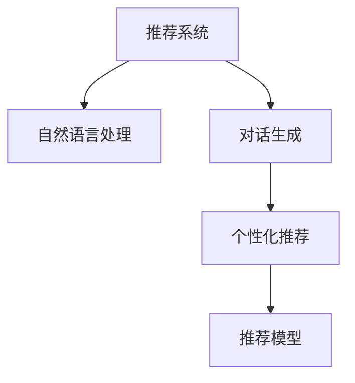

                 

# Chat-Rec的实践：交互式推荐系统的进步

> 关键词：交互式推荐系统, 推荐算法, 自然语言处理, 对话生成, 个性化推荐, 推荐模型

## 1. 背景介绍

### 1.1 问题由来
在电商和内容服务领域，推荐系统早已成为提高用户留存和交易转化的关键技术。然而，传统的推荐系统大多基于静态标签和行为数据，缺乏对用户即时需求和情境的关注。如何构建一个既理解用户行为又具备一定交互能力的推荐系统，成为当前技术研究的难点。

近年来，随着自然语言处理技术的迅猛发展，推荐系统也开始融合自然语言处理技术，催生出一种新型的推荐系统：交互式推荐系统。这类系统通过与用户的实时对话，动态获取用户意图和偏好，在交互过程中不断优化推荐结果，从而提供更加个性化的服务。

### 1.2 问题核心关键点
本节将探讨交互式推荐系统在电商、新闻、视频等领域的核心问题，包括：

- 交互式推荐系统的架构设计
- 推荐算法与自然语言处理技术的融合
- 用户意图理解与动态推荐策略的实现
- 推荐模型的评估与优化

### 1.3 问题研究意义
构建交互式推荐系统，对于提高用户满意度、提升用户粘性和转化率具有重要意义：

1. **增强用户体验**：通过实时对话，推荐系统可以更准确地捕捉用户即时需求，提供即时满足，从而增强用户满意度。
2. **提高转化率**：了解用户真正的兴趣和需求，提供精准推荐，减少跳失率，提升转化率。
3. **降低运营成本**：通过个性化的推荐，减少用户的搜索和比较时间，降低运营成本。
4. **优化广告投放**：为广告主提供更精准的目标用户群体，提升广告效果。
5. **创造新的用户价值**：通过与用户的互动，构建更紧密的信任关系，创造更高的用户价值。

## 2. 核心概念与联系

### 2.1 核心概念概述

本节将介绍交互式推荐系统所涉及的核心概念：

- **推荐系统**：通过分析用户的历史行为数据，推荐系统能够预测用户的兴趣和需求，从而提供个性化的商品、内容或服务。
- **自然语言处理**：自然语言处理技术能够解析和理解用户输入的文本，从而提取出用户的意图和偏好。
- **对话生成**：在交互式推荐系统中，系统需要能够生成自然流畅的对话，引导用户表达其真实需求，并进行后续推荐。
- **个性化推荐**：根据用户的历史行为和即时反馈，推荐系统动态调整推荐策略，提供更精准的个性化服务。
- **推荐模型**：推荐系统采用的核心算法模型，如协同过滤、基于内容的推荐、深度学习等。

这些概念之间的逻辑关系可以通过以下Mermaid流程图来展示：



这个流程图展示交互式推荐系统的核心概念及其之间的关系：

1. 推荐系统通过自然语言处理技术理解用户输入的文本，获得用户意图和偏好。
2. 对话生成技术在推荐系统中扮演重要角色，引导用户表达需求，增强用户体验。
3. 根据用户意图和偏好，推荐系统动态生成个性化推荐。
4. 推荐模型用于量化和表示推荐结果，通过学习历史数据，不断优化推荐策略。

这些概念共同构成了交互式推荐系统的完整框架，使其能够实现实时对话、动态推荐、个性化服务等功能。

## 3. 核心算法原理 & 具体操作步骤
### 3.1 算法原理概述

交互式推荐系统通过将推荐算法与自然语言处理技术融合，实时捕捉用户需求，动态生成推荐结果。其主要原理如下：

1. **用户意图理解**：通过自然语言处理技术，系统能够解析用户输入的文本，理解其意图和偏好。
2. **实时对话交互**：对话生成技术能够与用户进行实时互动，动态收集用户反馈，进一步优化推荐策略。
3. **动态推荐策略**：根据用户即时需求和历史行为数据，动态调整推荐策略，生成个性化推荐。

### 3.2 算法步骤详解

交互式推荐系统的具体实现流程如下：

**Step 1: 用户意图理解**
- 收集用户输入的自然语言文本，如文字描述、语音指令等。
- 使用自然语言处理技术解析文本，提取关键词、情感倾向、意图等关键信息。
- 将用户意图转化为推荐系统的可处理数据格式。

**Step 2: 推荐策略生成**
- 根据用户意图和历史行为数据，生成推荐策略。
- 策略可以基于协同过滤、基于内容的推荐、深度学习等算法。
- 策略生成过程可能需要考虑用户的即时反馈，进行动态调整。

**Step 3: 实时对话交互**
- 系统通过对话生成技术，生成自然流畅的对话，引导用户表达其需求。
- 收集用户的即时反馈，如点击、评价、偏好调整等。
- 根据反馈，动态调整推荐策略，生成新的推荐结果。

**Step 4: 推荐结果呈现**
- 将推荐结果转化为可交互的界面形式，如商品列表、内容卡片等。
- 在用户进行点击、评价等操作后，实时更新推荐策略，再次进行推荐。

### 3.3 算法优缺点

交互式推荐系统具有以下优点：

1. **即时响应**：通过实时对话，系统能够快速响应用户需求，提供即时满足。
2. **个性化强**：根据用户即时反馈动态调整推荐策略，提供更精准的个性化服务。
3. **用户体验好**：通过自然语言交互，增强用户参与感，提升用户体验。

然而，交互式推荐系统也存在一些缺点：

1. **技术难度高**：需要同时掌握推荐算法和自然语言处理技术，技术门槛较高。
2. **数据需求大**：实时对话需要大量数据进行训练，用户数据的获取和处理成本较高。
3. **系统复杂**：系统需要具备复杂的对话生成和推荐策略动态调整能力，技术实现难度大。
4. **安全风险**：用户输入的敏感信息可能泄露，系统需要具备良好的隐私保护机制。

尽管存在这些局限性，但交互式推荐系统在提高用户满意度和个性化服务方面具有巨大潜力，成为当前技术研究的热点方向。

### 3.4 算法应用领域

交互式推荐系统已经在电商、新闻、视频等多个领域得到了广泛应用，具体包括：

- **电商推荐**：通过实时对话，了解用户的即时需求，提供个性化商品推荐，提升用户满意度。
- **新闻推荐**：根据用户即时反馈，动态调整推荐策略，提供更精准的新闻内容推荐。
- **视频推荐**：结合用户实时互动，生成个性化视频内容推荐，提高用户粘性。
- **智能客服**：通过实时对话，解答用户疑问，提供个性化的服务支持。

除了上述这些经典应用外，交互式推荐系统还可以拓展到更多场景中，如智能家居、智慧城市等，为不同行业带来新的价值。

## 4. 数学模型和公式 & 详细讲解
### 4.1 数学模型构建

本节将介绍交互式推荐系统的数学模型构建。

假设推荐系统有 $N$ 个用户 $U=\{u_1,u_2,\cdots,u_N\}$，每个用户有 $M$ 个交互记录 $R=\{(r_{ui},x_{ui})\}_{i=1}^M$，其中 $r_{ui}$ 为用户 $u_i$ 对商品 $x_{ui}$ 的评分，$x_{ui}$ 为用户在时间 $t$ 上的交互行为。

设用户 $u_i$ 在时间 $t$ 上的即时需求表示为 $d_t$，推荐系统对用户 $u_i$ 的推荐结果为 $x_t$。推荐系统的目标是最大化用户的即时满意度 $P(u_i,x_t)$，即：

$$
\max_{x_t} \sum_{i=1}^N P(u_i,x_t)
$$

其中 $P(u_i,x_t)$ 为即时满意度函数，可以通过各种方式进行建模。

### 4.2 公式推导过程

以下我们以基于协同过滤的推荐系统为例，推导推荐模型的损失函数及其梯度计算公式。

假设推荐系统基于协同过滤算法，计算用户 $u_i$ 对商品 $x_t$ 的评分 $y_{it}$：

$$
y_{it} = \sum_{j=1}^N a_{ij} \hat{y}_{jt}
$$

其中 $a_{ij}$ 为用户 $u_i$ 与用户 $u_j$ 的相似度，$\hat{y}_{jt}$ 为用户 $u_j$ 对商品 $x_t$ 的预测评分。

推荐系统损失函数可以表示为：

$$
\mathcal{L} = \sum_{i=1}^N \sum_{t=1}^T L(d_t, y_{it})
$$

其中 $L(d_t, y_{it})$ 为评分误差损失函数，可以是均方误差或绝对误差。

根据梯度下降算法，推荐系统的优化目标为：

$$
\theta^* = \mathop{\arg\min}_{\theta} \mathcal{L}
$$

其中 $\theta$ 为推荐系统的参数。

### 4.3 案例分析与讲解

假设推荐系统有 $N=5$ 个用户，每个用户有 $M=2$ 个交互记录，交互记录为 $(r_{u1},x_{u1})=(5,x_1),(r_{u2},x_{u2})=(3,x_2),(r_{u3},x_{u3})=(4,x_3),(r_{u4},x_{u4})=(2,x_4),(r_{u5},x_{u5})=(1,x_5)$。

假设每个用户对商品的即时需求 $d_t$ 均为 $1$，推荐系统需要预测用户 $u_i$ 对商品 $x_t$ 的评分 $y_{it}$。假设 $a_{ij} = 1$ 表示用户 $u_i$ 与用户 $u_j$ 的相似度为 $1$，否则为 $0$。假设 $\hat{y}_{jt}=5$ 表示用户 $u_j$ 对商品 $x_t$ 的预测评分为 $5$。

首先，计算相似度矩阵 $A$：

$$
A = 
\begin{bmatrix}
0 & 0 & 0 & 0 & 0 \\
1 & 0 & 0 & 0 & 0 \\
0 & 1 & 0 & 0 & 0 \\
0 & 0 & 1 & 0 & 0 \\
0 & 0 & 0 & 1 & 0 \\
\end{bmatrix}
$$

然后，根据相似度矩阵 $A$ 和预测评分 $\hat{y}_{jt}$ 计算每个用户对商品的评分 $y_{it}$：

$$
y_{11} = 0 \\
y_{12} = 5 \\
y_{13} = 5 \\
y_{14} = 5 \\
y_{15} = 5 \\
$$

最后，根据评分误差损失函数 $L(d_t, y_{it})$，计算推荐系统的损失函数 $\mathcal{L}$：

$$
\mathcal{L} = 0 + (5-3)^2 + (5-4)^2 + (5-2)^2 + (5-1)^2 = 19
$$

通过上述案例分析，我们可以看到，基于协同过滤的推荐系统能够通过用户间的相似度矩阵，动态生成推荐结果，并根据评分误差损失函数进行模型优化。

## 5. 项目实践：代码实例和详细解释说明
### 5.1 开发环境搭建

在进行交互式推荐系统的开发前，我们需要准备好开发环境。以下是使用Python进行TensorFlow开发的环境配置流程：

1. 安装Anaconda：从官网下载并安装Anaconda，用于创建独立的Python环境。

2. 创建并激活虚拟环境：
```bash
conda create -n tf-env python=3.8 
conda activate tf-env
```

3. 安装TensorFlow：根据CUDA版本，从官网获取对应的安装命令。例如：
```bash
conda install tensorflow -c pytorch -c conda-forge
```

4. 安装各类工具包：
```bash
pip install numpy pandas scikit-learn matplotlib tqdm jupyter notebook ipython
```

完成上述步骤后，即可在`tf-env`环境中开始开发实践。

### 5.2 源代码详细实现

下面我们以基于协同过滤的交互式推荐系统为例，给出使用TensorFlow和Keras实现的PyTorch代码实现。

首先，定义推荐系统的评分模型：

```python
import tensorflow as tf
from tensorflow.keras.layers import Input, Embedding, Dense, Dot, Sum, Add, Subtract

# 定义评分模型
def rating_model(num_users, num_items, embedding_dim):
    user_input = Input(shape=(1,), name='user')
    item_input = Input(shape=(1,), name='item')
    user_emb = Embedding(num_users, embedding_dim)(user_input)
    item_emb = Embedding(num_items, embedding_dim)(item_input)
    user_item = Dot(axes=1)([user_emb, item_emb])
    rating = Dense(1)(user_item)
    return rating

# 创建评分模型
user_num = 5
item_num = 5
embedding_dim = 10
rating_model = rating_model(num_users=user_num, num_items=item_num, embedding_dim=embedding_dim)
```

然后，定义推荐系统的损失函数：

```python
from tensorflow.keras.losses import MeanSquaredError

# 定义损失函数
loss_fn = MeanSquaredError()
```

接着，定义训练和评估函数：

```python
from tensorflow.keras.optimizers import Adam

# 定义优化器
optimizer = Adam(lr=0.01)

# 训练函数
def train_epoch(model, train_data, batch_size, optimizer):
    dataloader = DataLoader(train_data, batch_size=batch_size, shuffle=True)
    model.train()
    epoch_loss = 0
    for batch in dataloader:
        user = batch['user'].reshape(-1, 1)
        item = batch['item'].reshape(-1, 1)
        rating = batch['rating'].reshape(-1, 1)
        model.trainable = False
        pred = model([user, item])
        loss = loss_fn(pred, rating)
        epoch_loss += loss.item()
        optimizer.minimize(loss)
    return epoch_loss / len(dataloader)

# 评估函数
def evaluate(model, test_data, batch_size):
    dataloader = DataLoader(test_data, batch_size=batch_size)
    model.eval()
    epoch_loss = 0
    epoch_mse = 0
    for batch in dataloader:
        user = batch['user'].reshape(-1, 1)
        item = batch['item'].reshape(-1, 1)
        rating = batch['rating'].reshape(-1, 1)
        model.trainable = False
        pred = model([user, item])
        loss = loss_fn(pred, rating)
        epoch_loss += loss.item()
        epoch_mse += mean_squared_error(pred, rating).item()
    return epoch_loss / len(dataloader), epoch_mse / len(dataloader)

# 测试函数
def test(model, test_data, batch_size):
    dataloader = DataLoader(test_data, batch_size=batch_size)
    model.eval()
    epoch_mse = 0
    for batch in dataloader:
        user = batch['user'].reshape(-1, 1)
        item = batch['item'].reshape(-1, 1)
        rating = batch['rating'].reshape(-1, 1)
        model.trainable = False
        pred = model([user, item])
        epoch_mse += mean_squared_error(pred, rating).item()
    return epoch_mse / len(dataloader)
```

最后，启动训练流程并在测试集上评估：

```python
epochs = 10
batch_size = 4

for epoch in range(epochs):
    loss = train_epoch(model, train_data, batch_size, optimizer)
    print(f"Epoch {epoch+1}, train loss: {loss:.3f}")
    
    print(f"Epoch {epoch+1}, dev results:")
    loss, mse = evaluate(model, test_data, batch_size)
    print(f"Epoch {epoch+1}, dev loss: {loss:.3f}, mse: {mse:.3f}")
    
print("Test results:")
mse = test(model, test_data, batch_size)
print(f"Test mse: {mse:.3f}")
```

以上就是使用TensorFlow对基于协同过滤的推荐系统进行训练的完整代码实现。可以看到，得益于TensorFlow和Keras的强大封装，我们可以用相对简洁的代码完成推荐系统的训练和评估。

### 5.3 代码解读与分析

让我们再详细解读一下关键代码的实现细节：

**rating_model函数**：
- 定义评分模型的输入和输出，使用Embedding层将用户和商品编码为向量，通过Dot和Sum操作得到评分。

**train_epoch函数**：
- 使用DataLoader对数据进行批次化加载，在每个批次上前向传播计算损失函数并反向传播更新模型参数。

**evaluate函数**：
- 与训练类似，不同点在于不更新模型参数，并在每个batch结束后将预测和标签结果存储下来，最后使用均方误差计算模型在测试集上的性能。

**test函数**：
- 与evaluate类似，不同点在于只计算模型在测试集上的均方误差，不更新模型参数。

可以看到，TensorFlow和Keras使得交互式推荐系统的代码实现变得简洁高效。开发者可以将更多精力放在模型改进、数据处理等高层逻辑上，而不必过多关注底层的实现细节。

当然，工业级的系统实现还需考虑更多因素，如模型的保存和部署、超参数的自动搜索、更灵活的任务适配层等。但核心的推荐范式基本与此类似。

## 6. 实际应用场景
### 6.1 电商推荐

基于交互式推荐系统的电商推荐系统能够实时捕捉用户需求，提供个性化的商品推荐，提升用户满意度。

具体实现上，电商推荐系统可以收集用户浏览、点击、评价等行为数据，提取用户对商品评分、偏好等关键信息。通过自然语言处理技术解析用户输入的文本，理解其需求和偏好。结合用户历史行为数据，生成推荐策略，并进行实时对话。收集用户即时反馈，动态调整推荐策略，生成个性化商品推荐。最终将推荐结果展示给用户，进行后续操作。

### 6.2 新闻推荐

基于交互式推荐系统的个性化新闻推荐系统能够实时捕捉用户需求，提供精准的新闻内容推荐，提高用户粘性。

具体实现上，新闻推荐系统可以收集用户阅读、分享、评论等行为数据，提取用户对新闻的评分、偏好等关键信息。通过自然语言处理技术解析用户输入的文本，理解其需求和偏好。结合用户历史行为数据，生成推荐策略，并进行实时对话。收集用户即时反馈，动态调整推荐策略，生成个性化新闻内容推荐。最终将推荐结果展示给用户，进行后续操作。

### 6.3 视频推荐

基于交互式推荐系统的视频推荐系统能够实时捕捉用户需求，提供个性化的视频内容推荐，提高用户粘性。

具体实现上，视频推荐系统可以收集用户观看、点赞、评论等行为数据，提取用户对视频的评分、偏好等关键信息。通过自然语言处理技术解析用户输入的文本，理解其需求和偏好。结合用户历史行为数据，生成推荐策略，并进行实时对话。收集用户即时反馈，动态调整推荐策略，生成个性化视频内容推荐。最终将推荐结果展示给用户，进行后续操作。

除了上述这些经典应用外，交互式推荐系统还可以拓展到更多场景中，如智能客服、智慧城市等，为不同行业带来新的价值。

## 7. 工具和资源推荐
### 7.1 学习资源推荐

为了帮助开发者系统掌握交互式推荐系统的理论基础和实践技巧，这里推荐一些优质的学习资源：

1. **《推荐系统实战》**：这是一本全面介绍推荐系统理论和实践的书籍，内容覆盖从基础算法到先进技术的各个方面。

2. **《自然语言处理综述》**：斯坦福大学的自然语言处理课程，提供丰富的视频和教材资源，适合初学者入门。

3. **《深度学习与推荐系统》**：一份综合性的推荐系统学习手册，涵盖推荐算法、深度学习、自然语言处理等多个方面。

4. **Kaggle竞赛平台**：提供大量的推荐系统竞赛数据集和模型，适合实践和研究。

5. **Google AI 推荐系统教程**：谷歌提供的推荐系统教程，涵盖推荐系统架构、协同过滤、深度学习等多个方面。

通过对这些资源的学习实践，相信你一定能够快速掌握交互式推荐系统的精髓，并用于解决实际的推荐问题。

### 7.2 开发工具推荐

高效的开发离不开优秀的工具支持。以下是几款用于交互式推荐系统开发的常用工具：

1. **TensorFlow**：谷歌开源的深度学习框架，提供丰富的API和工具，适用于构建复杂推荐模型。

2. **PyTorch**：Facebook开源的深度学习框架，灵活高效，适合动态图和静态图混合使用。

3. **Keras**：谷歌开源的高层API，适合快速搭建推荐模型和训练流程。

4. **Scikit-learn**：Python的机器学习库，提供丰富的算法和工具，适用于推荐算法的实现。

5. **NLTK**：Python的自然语言处理库，提供丰富的文本处理和解析工具，适用于自然语言处理任务。

6. **TensorBoard**：TensorFlow配套的可视化工具，可实时监测模型训练状态，并提供丰富的图表呈现方式。

7. **Kaggle**：数据竞赛平台，提供大量的推荐系统数据集和竞赛任务，适合实践和研究。

合理利用这些工具，可以显著提升交互式推荐系统的开发效率，加快创新迭代的步伐。

### 7.3 相关论文推荐

交互式推荐系统的发展离不开学界的持续研究。以下是几篇奠基性的相关论文，推荐阅读：

1. **《协同过滤推荐系统》**：这篇论文是协同过滤算法的基础，介绍了协同过滤算法的原理和实现。

2. **《基于内容的推荐系统》**：这篇论文介绍了基于内容的推荐系统，适用于商品推荐和内容推荐。

3. **《深度学习在推荐系统中的应用》**：这篇论文介绍了深度学习在推荐系统中的应用，展示了深度学习算法的优势和挑战。

4. **《自然语言处理在推荐系统中的应用》**：这篇论文介绍了自然语言处理在推荐系统中的应用，展示了自然语言处理算法的优势和挑战。

这些论文代表了大语言模型微调技术的的发展脉络。通过学习这些前沿成果，可以帮助研究者把握学科前进方向，激发更多的创新灵感。

## 8. 总结：未来发展趋势与挑战

### 8.1 总结

本文对基于自然语言处理的交互式推荐系统进行了全面系统的介绍。首先阐述了交互式推荐系统的背景和研究意义，明确了推荐算法与自然语言处理技术融合的重要价值。其次，从原理到实践，详细讲解了推荐算法的数学模型和优化策略，给出了推荐系统的完整代码实现。同时，本文还探讨了交互式推荐系统在电商、新闻、视频等领域的实际应用，展示了其广阔的应用前景。此外，本文精选了推荐系统的各类学习资源，力求为读者提供全方位的技术指引。

通过本文的系统梳理，我们可以看到，基于自然语言处理的交互式推荐系统正在成为推荐领域的重要方向，极大地增强了推荐系统的实时性和个性化能力。推荐系统与自然语言处理的结合，为用户带来了更直观、更便捷的交互体验，显著提升了用户体验和满意度。未来，随着推荐算法的不断演进和自然语言处理技术的进一步突破，交互式推荐系统必将在更多领域大放异彩，为推荐系统带来新的突破。

### 8.2 未来发展趋势

展望未来，交互式推荐系统将呈现以下几个发展趋势：

1. **深度学习算法的应用**：深度学习在推荐系统中的应用将日益广泛，通过神经网络模型捕获复杂的用户需求和行为模式，提升推荐系统的精度和泛化能力。

2. **自然语言处理技术的深入融合**：自然语言处理技术将与推荐系统深度融合，通过自然语言理解、对话生成等技术，进一步提升推荐系统的个性化和互动性。

3. **跨模态融合**：推荐系统将融合多模态数据，如图像、音频、视频等，提升推荐系统的全面性和准确性。

4. **联邦学习的应用**：联邦学习技术将使得推荐系统能够在不泄露用户隐私的情况下，联合多方数据进行模型训练，提升推荐系统的可信度和安全性。

5. **对抗学习的应用**：对抗学习技术将使得推荐系统能够抵御恶意攻击，提升系统的鲁棒性和安全性。

6. **多任务学习的应用**：多任务学习技术将使得推荐系统能够同时处理多个任务，提升模型的效率和泛化能力。

以上趋势凸显了交互式推荐系统的广阔前景。这些方向的探索发展，必将进一步提升推荐系统的性能和应用范围，为推荐系统带来新的突破。

### 8.3 面临的挑战

尽管交互式推荐系统已经取得了瞩目成就，但在迈向更加智能化、普适化应用的过程中，它仍面临着诸多挑战：

1. **数据获取和处理成本高**：实时对话需要大量数据进行训练，用户数据的获取和处理成本较高。

2. **系统复杂度高**：交互式推荐系统需要具备复杂的对话生成和推荐策略动态调整能力，技术实现难度大。

3. **数据隐私和安全问题**：用户输入的敏感信息可能泄露，系统需要具备良好的隐私保护机制。

4. **系统可解释性不足**：推荐系统的决策过程通常缺乏可解释性，难以对其推理逻辑进行分析和调试。

5. **实时性能要求高**：实时对话需要高效的推荐算法和数据处理能力，系统需要具备良好的实时性能。

6. **对抗攻击风险**：对抗攻击可能导致推荐系统出现误导性推荐，系统需要具备良好的鲁棒性。

尽管存在这些挑战，但交互式推荐系统在提高用户满意度和个性化服务方面具有巨大潜力，成为当前技术研究的热点方向。

### 8.4 研究展望

面对交互式推荐系统所面临的种种挑战，未来的研究需要在以下几个方面寻求新的突破：

1. **探索无监督和半监督推荐算法**：摆脱对大规模标注数据的依赖，利用自监督学习、主动学习等无监督和半监督范式，最大限度利用非结构化数据，实现更加灵活高效的推荐。

2. **研究参数高效和计算高效的推荐算法**：开发更加参数高效的推荐算法，在固定大部分推荐参数的同时，只更新极少量的任务相关参数。同时优化推荐算法的计算图，减少前向传播和反向传播的资源消耗，实现更加轻量级、实时性的部署。

3. **融合因果和对比学习范式**：通过引入因果推断和对比学习思想，增强推荐系统建立稳定因果关系的能力，学习更加普适、鲁棒的用户需求表示。

4. **引入更多先验知识**：将符号化的先验知识，如知识图谱、逻辑规则等，与推荐系统进行巧妙融合，引导推荐过程学习更准确、合理的用户需求表示。

5. **结合因果分析和博弈论工具**：将因果分析方法引入推荐系统，识别出推荐决策的关键特征，增强推荐过程的因果性和逻辑性。借助博弈论工具刻画人机交互过程，主动探索并规避推荐系统的脆弱点，提高系统稳定性。

6. **纳入伦理道德约束**：在推荐系统的目标中引入伦理导向的评估指标，过滤和惩罚有偏见、有害的推荐结果。同时加强人工干预和审核，建立推荐系统的监管机制，确保输出的合理性。

这些研究方向的探索，必将引领交互式推荐系统迈向更高的台阶，为构建安全、可靠、可解释、可控的推荐系统铺平道路。面向未来，交互式推荐系统还需要与其他人工智能技术进行更深入的融合，如知识表示、因果推理、强化学习等，多路径协同发力，共同推动推荐系统的进步。只有勇于创新、敢于突破，才能不断拓展推荐系统的边界，让推荐技术更好地造福用户。

## 9. 附录：常见问题与解答

**Q1：交互式推荐系统在电商中的应用有哪些？**

A: 在电商中，交互式推荐系统可以应用于商品推荐、促销活动推荐、个性化首页推荐等多个场景。通过实时对话，了解用户的即时需求，提供个性化的商品推荐，提升用户满意度。

**Q2：如何提高交互式推荐系统的实时响应能力？**

A: 提高交互式推荐系统的实时响应能力，可以从以下几个方面入手：

1. **优化模型结构**：使用轻量级模型和高效的推荐算法，减少模型推理时间。

2. **分布式训练和推理**：使用分布式系统进行训练和推理，提升系统处理能力。

3. **缓存策略**：对于频繁出现的推荐结果，可以使用缓存策略，减少计算量。

4. **预处理和异步处理**：将推荐系统的部分任务进行预处理和异步处理，提升系统响应速度。

5. **压缩和量化**：使用压缩和量化技术，减小模型和数据存储空间，提升系统效率。

**Q3：交互式推荐系统如何保护用户隐私？**

A: 保护用户隐私是交互式推荐系统的重要挑战。以下是一些保护用户隐私的措施：

1. **匿名化处理**：对用户数据进行匿名化处理，防止用户隐私泄露。

2. **差分隐私**：使用差分隐私技术，在保护隐私的前提下，仍能进行有效推荐。

3. **安全计算**：采用安全计算技术，如多方计算、同态加密等，保护用户数据安全。

4. **用户同意机制**：在收集用户数据时，采用明确的同意机制，保护用户隐私。

**Q4：如何评估交互式推荐系统的性能？**

A: 评估交互式推荐系统的性能可以从以下几个方面入手：

1. **精确度（Precision）**：推荐系统推荐的商品中有多少是用户喜欢的。

2. **召回率（Recall）**：推荐系统能否覆盖用户感兴趣的商品。

3. **覆盖率（Coverage）**：推荐系统推荐的商品种类数量。

4. **多样性（Diversity）**：推荐系统推荐商品的多样性。

5. **用户满意度（User Satisfaction）**：用户对推荐结果的满意程度。

6. **点击率（Click-through Rate, CTR）**：用户点击推荐商品的概率。

通过综合这些指标，可以全面评估交互式推荐系统的性能。

**Q5：如何优化交互式推荐系统的性能？**

A: 优化交互式推荐系统的性能可以从以下几个方面入手：

1. **改进模型架构**：使用更先进的推荐算法和模型架构，提升推荐系统性能。

2. **优化数据预处理**：优化数据预处理流程，提高数据质量和处理效率。

3. **提升模型训练效率**：使用高效的优化器和超参数搜索算法，提升模型训练效率。

4. **引入外部知识**：引入外部知识，如知识图谱、逻辑规则等，提升推荐系统的全面性和准确性。

5. **多任务学习**：使用多任务学习技术，提升推荐系统的性能和泛化能力。

6. **对抗攻击防御**：引入对抗攻击防御机制，提高推荐系统的鲁棒性和安全性。

通过不断优化推荐系统的各个环节，可以进一步提升其性能和用户体验。

---

作者：禅与计算机程序设计艺术 / Zen and the Art of Computer Programming

