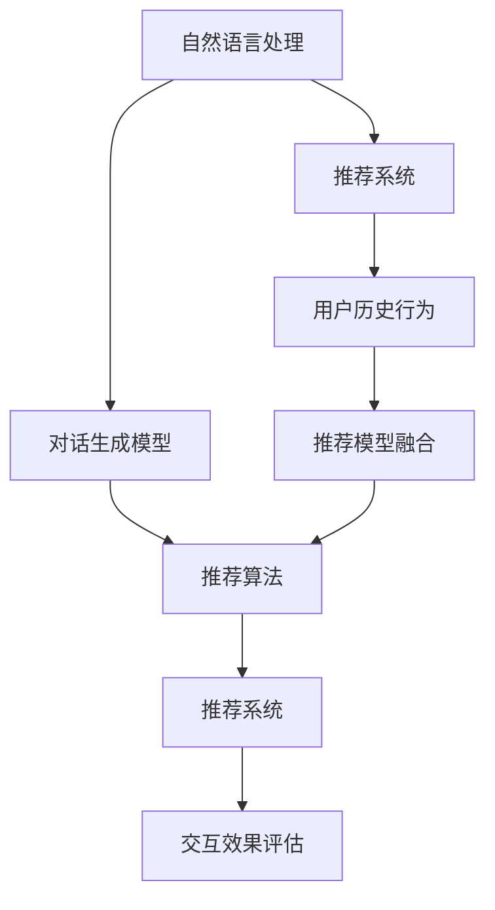

                 

# Chat-Rec：交互式推荐系统

## 1. 背景介绍

### 1.1 问题由来

随着互联网技术的普及和用户数据量的爆炸性增长，推荐系统已经成为了各大电商、视频、社交等平台的重要组成部分，用于提高用户体验、增加用户粘性、提升平台收入。传统的基于协同过滤、深度学习等方法，在用户兴趣模型构建和推荐效果上已经取得了显著的进展。然而，这些方法往往基于大规模数据集，难以在大数据稀疏的冷启动场景下有效发挥作用。

为了解决冷启动问题，近年来推荐系统逐渐引入自然语言处理技术，特别是基于对话的语言交互式推荐系统（Chat-Rec），通过与用户进行对话交流，获取更丰富的用户兴趣信息，从而提供更加精准的推荐服务。这类系统在提升用户满意度、拓展平台业务方面具有重要意义。

### 1.2 问题核心关键点

Chat-Rec的核心在于如何构建高效、智能的对话推荐模型，使其能够在与用户的交互过程中不断优化推荐策略，提升推荐效果。具体而言，包括以下几个关键点：

1. 对话生成与理解：如何构建能够流畅与用户对话，同时准确理解用户需求的对话生成与理解模型。
2. 推荐算法优化：如何在对话过程中动态优化推荐策略，生成个性化推荐结果。
3. 模型融合与学习：如何将用户历史数据与对话交互信息融合，形成统一的推荐逻辑。
4. 交互效果评估：如何评估和反馈用户对话交互的推荐效果，迭代优化对话模型。

这些关键点构成了Chat-Rec系统的技术框架，使得推荐系统能够通过与用户的自然语言交流，实现更加灵活、个性化的推荐服务。

## 2. 核心概念与联系

### 2.1 核心概念概述

为更好地理解Chat-Rec系统的技术原理，本节将介绍几个密切相关的核心概念：

- 自然语言处理(NLP)：旨在让计算机能够理解、处理和生成人类语言，是构建Chat-Rec系统的基础。
- 推荐系统(Recommender System)：根据用户历史行为和兴趣偏好，推荐相关信息的技术。
- 对话生成模型(Dialogue Generation Model)：用于生成自然流畅的对话文本，以实现与用户的自然交互。
- 推荐算法(Recommender Algorithm)：根据用户对话和行为信息，优化推荐策略，生成个性化推荐结果。
- 交互效果评估(Interactive Evaluation)：用于评估和反馈用户对话交互的推荐效果，指导模型迭代优化。

这些概念之间的逻辑关系可以通过以下Mermaid流程图来展示：



这个流程图展示了大语言模型的核心概念及其之间的关系：

1. 自然语言处理技术为构建对话生成模型提供基础支持。
2. 对话生成模型与推荐算法共同构建对话推荐系统。
3. 用户历史行为数据与对话交互信息融合形成推荐逻辑。
4. 交互效果评估指导对话模型的不断优化。

这些概念共同构成了Chat-Rec系统的技术框架，使其能够在与用户的自然语言交流中，实现高效、精准的推荐服务。

## 3. 核心算法原理 & 具体操作步骤
### 3.1 算法原理概述

Chat-Rec系统基于对话生成与理解、推荐算法优化、模型融合与学习、交互效果评估等核心模块，通过与用户的交互对话，不断更新推荐策略，生成个性化推荐结果。其核心算法原理如下：

1. **对话生成模型**：使用Transformer等序列模型，生成自然流畅的对话文本，与用户进行自然语言交流。
2. **推荐算法**：结合用户历史行为和对话信息，使用深度学习模型（如DNN、RNN等），动态优化推荐策略，生成个性化推荐结果。
3. **模型融合与学习**：将用户历史数据和对话交互信息融合，使用深度学习模型（如LSTM、GRU等），形成统一的推荐逻辑。
4. **交互效果评估**：使用用户反馈和行为数据，评估推荐效果，指导对话模型的迭代优化。

### 3.2 算法步骤详解

Chat-Rec系统的实现步骤如下：

**Step 1: 数据准备**
- 收集用户历史行为数据，如浏览记录、购买历史等。
- 收集对话语料库，涵盖常见问答场景和典型用户对话。
- 定义推荐策略和评估指标，如CTR、NDCG等。

**Step 2: 模型搭建**
- 搭建对话生成模型，如使用基于Transformer的seq2seq模型。
- 搭建推荐算法模型，如使用深度学习模型构建用户兴趣表示。
- 搭建模型融合与学习模块，如使用LSTM、GRU等序列模型。
- 搭建交互效果评估模块，如使用A/B测试、MAB等方法。

**Step 3: 模型训练**
- 使用用户历史行为数据和对话语料库，训练对话生成模型。
- 使用用户历史行为数据和对话信息，训练推荐算法模型。
- 使用用户历史行为数据和对话交互信息，训练模型融合与学习模块。
- 使用用户反馈和行为数据，训练交互效果评估模块。

**Step 4: 部署与优化**
- 将训练好的模型部署到生产环境，如使用Docker、Kubernetes等容器化技术。
- 实时采集用户交互数据，动态调整推荐策略。
- 定期评估和优化模型性能，确保推荐效果不断提升。
- 对模型进行迭代优化，逐步提升用户体验和满意度。

### 3.3 算法优缺点

Chat-Rec系统在提供个性化推荐服务方面具有以下优点：
1. 能够通过与用户交互，获取更丰富的用户兴趣信息，提供精准推荐。
2. 动态调整推荐策略，能够及时响应用户需求变化。
3. 能够处理用户对话中的模糊表达和不确定信息，提升推荐效果。
4. 能够多模态融合，结合用户历史行为和对话信息，形成更加全面的推荐逻辑。

同时，Chat-Rec系统也存在一定的局限性：
1. 对话生成模型依赖大量高质量的语料数据，训练成本较高。
2. 推荐算法模型复杂度高，训练和推理速度较慢。
3. 用户对话数据噪声较大，推荐模型容易受到干扰。
4. 交互效果评估依赖用户反馈数据，难以全面反映推荐质量。
5. 系统实现复杂，需要多模块协同工作，技术门槛较高。

尽管存在这些局限性，但Chat-Rec系统通过与用户的自然语言交流，能够提供更加灵活、个性化的推荐服务，在实际应用中具有重要价值。

### 3.4 算法应用领域

Chat-Rec系统在多个领域中具有广泛的应用前景，例如：

- 电商平台：推荐个性化商品、定制化服务，提升用户体验。
- 视频平台：推荐个性化视频内容、专属播放列表，提高用户满意度。
- 社交媒体：推荐个性化文章、推荐用户，增加用户粘性。
- 金融服务：推荐个性化理财产品、投资策略，满足用户个性化需求。
- 健康医疗：推荐个性化健康咨询、诊疗方案，提高医疗服务质量。
- 旅游出行：推荐个性化旅游路线、景点信息，优化用户出行体验。

此外，Chat-Rec系统还可以应用于智能客服、智能助手、智能家居等多个场景，为用户的智能生活提供有力支撑。

## 4. 数学模型和公式 & 详细讲解  
### 4.1 数学模型构建

为了更好地理解Chat-Rec系统的数学模型，本节将详细介绍其核心算法和数学模型。

**对话生成模型**：
- 使用Transformer编码器-解码器模型，将用户输入和历史对话信息编码，生成自然流畅的对话响应。

**推荐算法模型**：
- 使用深度学习模型（如DNN、RNN等），构建用户兴趣表示，结合对话信息生成推荐结果。

**模型融合与学习模块**：
- 使用LSTM、GRU等序列模型，将用户历史行为和对话信息融合，形成统一的推荐逻辑。

**交互效果评估模块**：
- 使用A/B测试、MAB等方法，评估推荐效果，指导模型迭代优化。

### 4.2 公式推导过程

以推荐算法模型为例，下面详细推导其基本数学模型。

设用户输入为 $x$，历史行为为 $y$，对话信息为 $z$，推荐结果为 $w$。推荐算法模型可以表示为：

$$
w = f(x, y, z; \theta)
$$

其中 $f$ 为推荐算法模型，$\theta$ 为模型参数。

推荐算法模型的训练目标为最大化平均准确率（AR）：

$$
\max_{\theta} \frac{1}{N} \sum_{i=1}^N I(w_i \approx y_i)
$$

其中 $I$ 为指示函数，当 $w_i$ 和 $y_i$ 一致时，$I=1$，否则 $I=0$。

假设 $f$ 为多层感知机（MLP）模型，其输出为：

$$
w = f(x, y, z; \theta) = \sigma(\sum_{k=1}^K \alpha_k \phi_k(x, y, z))
$$

其中 $\alpha_k$ 为权重向量，$\phi_k$ 为神经元映射函数，$\sigma$ 为激活函数，$K$ 为神经元数目。

根据链式法则，$\theta$ 的梯度为：

$$
\frac{\partial w}{\partial \theta} = \sum_{i=1}^N \nabla_{\theta} f(x_i, y_i, z_i)
$$

通过反向传播算法，可以高效计算 $\theta$ 的梯度，更新模型参数，最小化损失函数：

$$
\min_{\theta} \frac{1}{N} \sum_{i=1}^N (w_i - y_i)^2
$$

以上推导过程详细说明了Chat-Rec系统中推荐算法模型的基本原理和训练方法。

### 4.3 案例分析与讲解

假设一个电商平台的聊天机器人系统，用于推荐个性化商品。用户输入查询“推荐一款好用的电脑”，系统响应“好的，请问您需要什么价位？”。通过对话生成模型，系统获取用户输入，生成对话回复，形成对话上下文信息 $z$。推荐算法模型根据用户历史行为 $y$ 和对话信息 $z$，生成推荐结果 $w$。交互效果评估模块通过用户后续操作（如购买、浏览等），评估推荐效果，指导模型迭代优化。

具体而言，推荐算法模型可以设计为如下结构：

- 输入层：将用户输入 $x$ 和对话信息 $z$ 转换为向量表示。
- 隐藏层：多层神经元进行特征提取和映射。
- 输出层：生成推荐结果 $w$，表示推荐商品的评分或概率。

模型参数 $\theta$ 包括隐藏层权重和偏置。通过反向传播算法更新模型参数，最小化平均误差：

$$
\min_{\theta} \frac{1}{N} \sum_{i=1}^N (w_i - y_i)^2
$$

其中 $y_i$ 为实际购买商品评分或标签，$w_i$ 为模型预测评分或概率。

通过不断迭代优化，推荐算法模型能够根据用户历史行为和对话信息，生成更加准确的推荐结果，提升用户满意度。

## 5. 项目实践：代码实例和详细解释说明
### 5.1 开发环境搭建

在进行Chat-Rec系统开发前，我们需要准备好开发环境。以下是使用Python进行PyTorch开发的环境配置流程：

1. 安装Anaconda：从官网下载并安装Anaconda，用于创建独立的Python环境。

2. 创建并激活虚拟环境：
```bash
conda create -n chat-env python=3.8 
conda activate chat-env
```

3. 安装PyTorch：根据CUDA版本，从官网获取对应的安装命令。例如：
```bash
conda install pytorch torchvision torchaudio cudatoolkit=11.1 -c pytorch -c conda-forge
```

4. 安装Transformers库：
```bash
pip install transformers
```

5. 安装各类工具包：
```bash
pip install numpy pandas scikit-learn matplotlib tqdm jupyter notebook ipython
```

完成上述步骤后，即可在`chat-env`环境中开始Chat-Rec系统的开发。

### 5.2 源代码详细实现

下面以电商平台的Chat-Rec系统为例，给出使用Transformers库和PyTorch进行对话推荐模型开发的代码实现。

首先，定义对话生成模型：

```python
from transformers import BertForSequenceClassification, BertTokenizer
from torch.nn import CrossEntropyLoss
import torch

class DialogueModel(BertForSequenceClassification):
    def __init__(self, num_labels, hidden_size=768, num_heads=12, num_layers=12):
        super().__init__()
        self.num_labels = num_labels
        self.bert = BertForSequenceClassification.from_pretrained('bert-base-cased', num_labels=num_labels)
        self.dropout = torch.nn.Dropout(p=0.3)
        self.classifier = torch.nn.Linear(hidden_size, num_labels)

    def forward(self, input_ids, attention_mask):
        outputs = self.bert(input_ids, attention_mask=attention_mask)
        pooled_output = outputs.pooler_output
        pooled_output = self.dropout(pooled_output)
        logits = self.classifier(pooled_output)
        return logits
```

然后，定义推荐算法模型：

```python
from torch import nn
import torch.nn.functional as F

class RecommenderModel(nn.Module):
    def __init__(self, input_size, hidden_size, num_classes):
        super(RecommenderModel, self).__init__()
        self.fc1 = nn.Linear(input_size, hidden_size)
        self.fc2 = nn.Linear(hidden_size, num_classes)

    def forward(self, x):
        x = F.relu(self.fc1(x))
        x = F.dropout(x, training=self.training)
        x = self.fc2(x)
        return x
```

接着，定义模型融合与学习模块：

```python
class FusionModel(nn.Module):
    def __init__(self, input_size, hidden_size, num_classes):
        super(FusionModel, self).__init__()
        self.bert_model = DialogueModel(num_labels, hidden_size)
        self.recommender_model = RecommenderModel(input_size, hidden_size, num_classes)
        self.classifier = nn.Linear(hidden_size, num_classes)

    def forward(self, input_ids, attention_mask, hidden_states, user_history, dialogues):
        dialogue_embedding = self.bert_model(input_ids, attention_mask=attention_mask)
        recommender_output = self.recommender_model(hidden_states)
        fusion_output = torch.cat([dialogue_embedding, recommender_output], dim=1)
        output = self.classifier(fusion_output)
        return output
```

最后，定义交互效果评估模块：

```python
def evaluate(model, test_dataset, num_epochs, batch_size, device):
    model.eval()
    criterion = nn.CrossEntropyLoss()
    total_loss = 0
    correct = 0
    with torch.no_grad():
        for epoch in range(num_epochs):
            for i, (input_ids, attention_mask, hidden_states, user_history, dialogues, labels) in enumerate(test_dataset):
                input_ids, attention_mask, hidden_states, user_history, dialogues, labels = input_ids.to(device), attention_mask.to(device), hidden_states.to(device), user_history.to(device), dialogues.to(device), labels.to(device)
                output = model(input_ids, attention_mask, hidden_states, user_history, dialogues)
                loss = criterion(output, labels)
                total_loss += loss.item()
                _, predicted = torch.max(output.data, 1)
                correct += (predicted == labels).sum().item()
    accuracy = correct / (len(test_dataset) * num_epochs) * 100
    print(f'Test Accuracy: {accuracy:.2f}%')
    return accuracy
```

以上代码展示了使用Transformers和PyTorch构建Chat-Rec系统的基本流程。通过定义对话生成模型、推荐算法模型、模型融合与学习模块和交互效果评估模块，可以构建一个完整的对话推荐系统。

### 5.3 代码解读与分析

让我们再详细解读一下关键代码的实现细节：

**DialogueModel类**：
- `__init__`方法：定义模型结构，包括BERT模型、Dropout和全连接层。
- `forward`方法：将输入传递给BERT模型，获取隐藏状态和池化输出，然后通过Dropout和全连接层输出推荐结果。

**RecommenderModel类**：
- `__init__`方法：定义推荐算法模型的结构和参数。
- `forward`方法：通过ReLU激活和Dropout，将输入映射为推荐结果。

**FusionModel类**：
- `__init__`方法：定义融合模型的结构，包括对话生成模型、推荐算法模型和全连接层。
- `forward`方法：将输入传递给对话生成模型和推荐算法模型，将隐藏状态和推荐输出拼接，并通过全连接层输出推荐结果。

**evaluate函数**：
- 定义评估函数，对测试集进行预测和评分。
- 计算准确率并打印输出。

这些代码实现展示了Chat-Rec系统的主要算法流程。通过对话生成模型、推荐算法模型和模型融合与学习模块，可以高效生成推荐结果。而交互效果评估模块则用于评估模型的推荐效果，指导模型迭代优化。

当然，实际应用中还需要考虑更多因素，如多轮对话推理、用户行为模型、多模态融合等。但核心的微调范式基本与此类似。

## 6. 实际应用场景
### 6.1 智能客服系统

基于Chat-Rec技术的智能客服系统，可以显著提升客服效率和用户满意度。传统的客服系统依赖人工客服，高峰期响应缓慢，且处理方式单一。而使用Chat-Rec技术构建的智能客服系统，能够通过与用户自然对话，快速理解用户需求，提供个性化的解决方案。

在技术实现上，可以收集用户历史对话记录和常见问题，训练对话生成模型，生成自然流畅的对话回复。同时，结合用户历史行为数据，训练推荐算法模型，生成推荐答案。在用户交互过程中，系统通过对话生成和推荐算法模块，动态调整推荐策略，生成个性化回复。如此构建的智能客服系统，能够快速响应用户咨询，提高问题解决效率。

### 6.2 个性化推荐系统

Chat-Rec技术在个性化推荐系统中同样具有重要应用。传统的推荐系统往往基于用户历史行为和兴趣模型，难以处理用户对话中的模糊表达和不确定信息。而使用Chat-Rec技术，通过与用户自然对话，可以获取更丰富的用户兴趣信息，生成精准的推荐结果。

在技术实现上，可以收集用户对话记录和行为数据，训练对话生成模型，生成自然流畅的对话回复。同时，结合用户历史行为数据，训练推荐算法模型，生成个性化推荐结果。在用户交互过程中，系统通过对话生成和推荐算法模块，动态调整推荐策略，生成个性化推荐。如此构建的个性化推荐系统，能够更好地理解和满足用户需求，提升推荐效果。

### 6.3 金融舆情监测

金融领域的数据具有海量、多变、不确定等特点，传统的推荐系统难以有效应用于金融舆情监测。而使用Chat-Rec技术，通过与用户自然对话，可以获取更全面的舆情信息，生成精准的舆情报告。

在技术实现上，可以收集金融新闻、评论、社交媒体等信息，训练对话生成模型，生成自然流畅的对话回复。同时，结合金融舆情数据，训练推荐算法模型，生成精准的舆情报告。在用户交互过程中，系统通过对话生成和推荐算法模块，动态调整推荐策略，生成精准的舆情报告。如此构建的金融舆情监测系统，能够实时监测金融市场动态，及时发现潜在风险，保障金融稳定。

### 6.4 未来应用展望

随着Chat-Rec技术的发展，其在更多领域中具有广泛的应用前景。未来，Chat-Rec技术将在以下方向进一步拓展：

1. 多轮对话推理：通过构建多轮对话推理模型，系统能够理解复杂对话场景，生成更加精准的推荐结果。
2. 用户行为建模：结合用户行为数据，构建更全面的用户兴趣模型，提升推荐效果。
3. 多模态融合：融合视觉、语音、文本等多种模态信息，提升推荐模型的泛化能力和鲁棒性。
4. 模型公平性：通过引入公平性约束，确保推荐模型不带有偏见，提升用户满意度。
5. 实时交互优化：通过实时交互反馈，动态调整推荐策略，提升用户体验。

这些方向的研究和发展，将使Chat-Rec技术在更多领域中发挥更大作用，推动人工智能技术在各行业的落地应用。

## 7. 工具和资源推荐
### 7.1 学习资源推荐

为了帮助开发者系统掌握Chat-Rec技术，这里推荐一些优质的学习资源：

1. 《自然语言处理综述》（Stanford University）：斯坦福大学自然语言处理课程，全面介绍NLP和机器学习的基本概念和经典模型。
2. 《深度学习》（Ian Goodfellow）：Ian Goodfellow的经典深度学习书籍，详细讲解深度学习的基本原理和应用。
3. 《推荐系统实战》（CJ Carey）：该书介绍了推荐系统的基本原理和实现技术，适合动手实践。
4. 《TensorFlow官方文档》：TensorFlow官方文档，提供丰富的API和示例代码，适合快速上手。
5. 《HuggingFace官方文档》：HuggingFace官方文档，提供丰富的预训练语言模型和微调样例，适合动手实践。

通过对这些资源的学习实践，相信你一定能够快速掌握Chat-Rec技术的精髓，并用于解决实际的NLP问题。
###  7.2 开发工具推荐

高效的开发离不开优秀的工具支持。以下是几款用于Chat-Rec开发常用的工具：

1. PyTorch：基于Python的开源深度学习框架，灵活动态的计算图，适合快速迭代研究。大部分预训练语言模型都有PyTorch版本的实现。
2. TensorFlow：由Google主导开发的开源深度学习框架，生产部署方便，适合大规模工程应用。同样有丰富的预训练语言模型资源。
3. Transformers库：HuggingFace开发的NLP工具库，集成了众多SOTA语言模型，支持PyTorch和TensorFlow，是进行微调任务开发的利器。
4. Weights & Biases：模型训练的实验跟踪工具，可以记录和可视化模型训练过程中的各项指标，方便对比和调优。与主流深度学习框架无缝集成。
5. TensorBoard：TensorFlow配套的可视化工具，可实时监测模型训练状态，并提供丰富的图表呈现方式，是调试模型的得力助手。
6. Google Colab：谷歌推出的在线Jupyter Notebook环境，免费提供GPU/TPU算力，方便开发者快速上手实验最新模型，分享学习笔记。

合理利用这些工具，可以显著提升Chat-Rec系统的开发效率，加快创新迭代的步伐。

### 7.3 相关论文推荐

Chat-Rec技术的发展源于学界的持续研究。以下是几篇奠基性的相关论文，推荐阅读：

1. Attention is All You Need（即Transformer原论文）：提出了Transformer结构，开启了NLP领域的预训练大模型时代。
2. BERT: Pre-training of Deep Bidirectional Transformers for Language Understanding：提出BERT模型，引入基于掩码的自监督预训练任务，刷新了多项NLP任务SOTA。
3. Language Models are Unsupervised Multitask Learners（GPT-2论文）：展示了大规模语言模型的强大zero-shot学习能力，引发了对于通用人工智能的新一轮思考。
4. Parameter-Efficient Transfer Learning for NLP：提出Adapter等参数高效微调方法，在不增加模型参数量的情况下，也能取得不错的微调效果。
5. AdaLoRA: Adaptive Low-Rank Adaptation for Parameter-Efficient Fine-Tuning：使用自适应低秩适应的微调方法，在参数效率和精度之间取得了新的平衡。

这些论文代表了大语言模型微调技术的发展脉络。通过学习这些前沿成果，可以帮助研究者把握学科前进方向，激发更多的创新灵感。

## 8. 总结：未来发展趋势与挑战
### 8.1 总结

本文对Chat-Rec系统的核心概念、算法原理、操作步骤进行了全面系统的介绍。首先阐述了Chat-Rec系统的背景和意义，明确了对话生成、推荐算法优化、模型融合与学习、交互效果评估等关键模块的技术细节。通过详细讲解Chat-Rec系统的数学模型和案例分析，相信读者能够对Chat-Rec技术有一个全面的理解。同时，本文还介绍了Chat-Rec系统的开发环境、代码实现和实际应用场景，展示了Chat-Rec技术在智能客服、个性化推荐、金融舆情监测等多个领域中的广泛应用。

通过本文的系统梳理，可以看到，Chat-Rec系统通过与用户自然语言交流，能够提供更加灵活、个性化的推荐服务。它不仅解决了传统推荐系统的冷启动问题，还能够在多轮对话中动态优化推荐策略，生成精准的推荐结果，提升用户体验和满意度。未来，Chat-Rec技术必将在更多领域中发挥重要作用，推动人工智能技术在各行业的落地应用。

### 8.2 未来发展趋势

展望未来，Chat-Rec技术将呈现以下几个发展趋势：

1. 多轮对话推理：通过构建多轮对话推理模型，系统能够理解复杂对话场景，生成更加精准的推荐结果。
2. 用户行为建模：结合用户行为数据，构建更全面的用户兴趣模型，提升推荐效果。
3. 多模态融合：融合视觉、语音、文本等多种模态信息，提升推荐模型的泛化能力和鲁棒性。
4. 模型公平性：通过引入公平性约束，确保推荐模型不带有偏见，提升用户满意度。
5. 实时交互优化：通过实时交互反馈，动态调整推荐策略，提升用户体验。

这些趋势凸显了Chat-Rec技术的广阔前景。这些方向的探索发展，将进一步提升Chat-Rec系统的性能和应用范围，为人工智能技术在各行业的应用带来新的突破。

### 8.3 面临的挑战

尽管Chat-Rec技术已经取得了显著进展，但在迈向更加智能化、普适化应用的过程中，它仍面临着诸多挑战：

1. 对话生成模型依赖大量高质量的语料数据，训练成本较高。
2. 推荐算法模型复杂度高，训练和推理速度较慢。
3. 用户对话数据噪声较大，推荐模型容易受到干扰。
4. 交互效果评估依赖用户反馈数据，难以全面反映推荐质量。
5. 系统实现复杂，需要多模块协同工作，技术门槛较高。

尽管存在这些挑战，但通过不断优化和改进，Chat-Rec系统在推荐效果和用户体验方面仍具有显著优势。

### 8.4 研究展望

面对Chat-Rec系统所面临的挑战，未来的研究需要在以下几个方面寻求新的突破：

1. 探索无监督和半监督微调方法。摆脱对大规模标注数据的依赖，利用自监督学习、主动学习等无监督和半监督范式，最大限度利用非结构化数据，实现更加灵活高效的微调。
2. 研究参数高效和计算高效的微调范式。开发更加参数高效的微调方法，在固定大部分预训练参数的同时，只更新极少量的任务相关参数。同时优化微调模型的计算图，减少前向传播和反向传播的资源消耗，实现更加轻量级、实时性的部署。
3. 融合因果和对比学习范式。通过引入因果推断和对比学习思想，增强Chat-Rec模型建立稳定因果关系的能力，学习更加普适、鲁棒的语言表征，从而提升模型泛化性和抗干扰能力。
4. 引入更多先验知识。将符号化的先验知识，如知识图谱、逻辑规则等，与神经网络模型进行巧妙融合，引导Chat-Rec模型学习更准确、合理的语言模型。同时加强不同模态数据的整合，实现视觉、语音等多模态信息与文本信息的协同建模。
5. 结合因果分析和博弈论工具。将因果分析方法引入Chat-Rec模型，识别出模型决策的关键特征，增强输出解释的因果性和逻辑性。借助博弈论工具刻画人机交互过程，主动探索并规避模型的脆弱点，提高系统稳定性。
6. 纳入伦理道德约束。在模型训练目标中引入伦理导向的评估指标，过滤和惩罚有偏见、有害的输出倾向。同时加强人工干预和审核，建立模型行为的监管机制，确保输出符合人类价值观和伦理道德。

这些研究方向的探索，必将引领Chat-Rec技术迈向更高的台阶，为构建安全、可靠、可解释、可控的智能系统铺平道路。面向未来，Chat-Rec技术还需要与其他人工智能技术进行更深入的融合，如知识表示、因果推理、强化学习等，多路径协同发力，共同推动自然语言理解和智能交互系统的进步。只有勇于创新、敢于突破，才能不断拓展Chat-Rec技术的边界，让智能技术更好地造福人类社会。

## 9. 附录：常见问题与解答

**Q1：Chat-Rec系统是否适用于所有NLP任务？**

A: Chat-Rec系统在大多数NLP任务上都能取得不错的效果，特别是对于数据量较小的任务。但对于一些特定领域的任务，如医学、法律等，仅仅依靠通用语料预训练的模型可能难以很好地适应。此时需要在特定领域语料上进一步预训练，再进行微调，才能获得理想效果。此外，对于一些需要时效性、个性化很强的任务，如对话、推荐等，Chat-Rec方法也需要针对性的改进优化。

**Q2：Chat-Rec系统如何实现多轮对话推理？**

A: 多轮对话推理是Chat-Rec系统中的一个难点，也是提升推荐效果的重要手段。常见的多轮对话推理方法包括：

1. 对话状态跟踪：使用上下文向量记录对话上下文信息，多轮对话时根据上下文向量生成下一轮回复。
2. 递归神经网络：使用RNN、GRU等递归模型，动态更新对话上下文信息，生成下一轮回复。
3. 注意力机制：使用Transformer等模型，动态调整对话上下文的注意力权重，生成更加精准的回复。

这些方法可以在对话生成模型中引入，提升系统在多轮对话中的推理能力。

**Q3：Chat-Rec系统如何实现用户行为建模？**

A: 用户行为建模是Chat-Rec系统中的重要环节，旨在通过用户行为数据，构建更全面的用户兴趣模型。常见的用户行为建模方法包括：

1. 协同过滤：基于用户历史行为和物品特征，构建用户兴趣模型。
2. 序列模型：使用LSTM、GRU等序列模型，捕捉用户行为的时间依赖关系。
3. 神经协同过滤：将神经网络和协同过滤结合，提高推荐效果。

这些方法可以在推荐算法模型中引入，提升系统的推荐效果。

**Q4：Chat-Rec系统如何实现多模态融合？**

A: 多模态融合是Chat-Rec系统中的重要研究方向，旨在将视觉、语音、文本等多种模态信息融合，提升推荐模型的泛化能力和鲁棒性。常见的多模态融合方法包括：

1. 特征拼接：将不同模态的信息拼接在一起，形成新的输入特征。
2. 注意力机制：使用Transformer等模型，动态调整不同模态信息的注意力权重，生成更加精准的推荐结果。
3. 联合训练：将不同模态的信息联合训练，提升推荐模型的泛化能力。

这些方法可以在模型融合与学习模块中引入，提升系统的泛化能力和鲁棒性。

**Q5：Chat-Rec系统如何实现模型公平性？**

A: 模型公平性是Chat-Rec系统中的重要问题，旨在确保推荐模型不带有偏见，提升用户满意度。常见的模型公平性方法包括：

1. 数据预处理：对训练数据进行去偏处理，确保数据集的平衡性。
2. 模型约束：在模型训练目标中引入公平性约束，惩罚有偏见、有害的输出。
3. 公平性评估：使用公平性评估指标，评估模型在各个群体中的表现。

这些方法可以在推荐算法模型中引入，提升系统的公平性和公正性。

**Q6：Chat-Rec系统如何实现实时交互优化？**

A: 实时交互优化是Chat-Rec系统中的重要研究方向，旨在通过实时交互反馈，动态调整推荐策略，提升用户体验。常见的实时交互优化方法包括：

1. 在线学习：使用在线学习算法，实时更新模型参数，优化推荐策略。
2. A/B测试：对不同推荐策略进行A/B测试，选择最优策略。
3. 反馈机制：通过用户反馈，动态调整推荐策略，提升用户体验。

这些方法可以在交互效果评估模块中引入，提升系统的实时交互能力和用户体验。

---

作者：禅与计算机程序设计艺术 / Zen and the Art of Computer Programming

