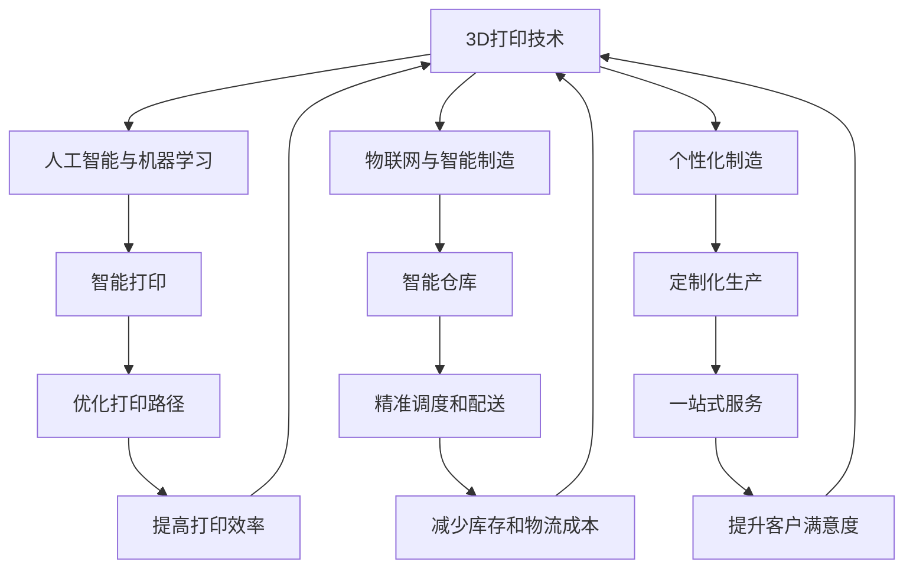

                 

# 3D打印创业：个性化制造的未来

> 关键词：3D打印,个性化制造,创业,自动化生产,智能制造

## 1. 背景介绍

### 1.1 问题由来
3D打印技术以其灵活、快速、低成本的特点，在制造业、医疗、航空、航天等领域得到广泛应用。但传统的3D打印设备多为单头单层打印，效率低下，成本高昂，且难以实现个性化定制。随着人工智能和物联网技术的发展，3D打印技术迎来了新的突破。3D打印创业公司通过引入智能打印和个性化制造理念，重新定义了制造业的样态，极大提升了生产效率和产品质量。

### 1.2 问题核心关键点
3D打印创业的关键在于如何结合人工智能与个性化制造，优化生产流程，降低成本，提升效率，同时保持高精度和高可靠性。核心点在于：

1. **智能打印**：通过机器学习算法对打印路径进行优化，提升打印效率和质量。
2. **个性化定制**：利用大数据和人工智能技术，对客户需求进行精准匹配和预测，实现定制化生产。
3. **供应链优化**：通过智能仓库和物流系统，实现原材料的精准调度，减少库存和物流成本。
4. **自动化生产**：引入自动化机器人、自动调度系统等技术，实现全流程自动化。
5. **客户体验**：提供线上平台，实现订单追踪、个性化设计、售后支持等一站式服务，提升客户满意度。

这些关键点紧密联系，共同构成了3D打印创业的核心技术体系。

## 2. 核心概念与联系

### 2.1 核心概念概述

为更好地理解3D打印创业的核心技术，本节将介绍几个关键概念：

- **3D打印技术**：通过层层堆积材料，最终实现三维物体造型的技术。3D打印涉及材料、设备、软件等多个领域，技术多样，包括FDM、SLS、SLA等多种技术。
- **人工智能与机器学习**：用于优化3D打印路径、预测材料属性、自动调度等，提升3D打印的智能化水平。
- **物联网与智能制造**：通过传感器、RFID等技术实现设备联网，实时监控生产状态，提升制造效率和质量。
- **个性化制造**：基于客户需求，利用3D打印和人工智能技术，实现定制化生产，满足个性化需求。
- **供应链管理**：通过智能仓库、物流系统，实现原材料的精准调度和配送，减少库存和物流成本。
- **自动化生产**：引入机器人、自动化调度系统等技术，实现全流程自动化，提升生产效率和稳定性。

这些核心概念之间的逻辑关系可以通过以下Mermaid流程图来展示：



这个流程图展示了大语言模型的核心概念及其之间的关系：

1. 3D打印技术是基础，通过人工智能与机器学习、物联网与智能制造、个性化制造、供应链管理、自动化生产等多个方面提升和优化，最终实现高效、灵活、可靠的3D打印创业。
2. 人工智能与机器学习用于优化打印路径、预测材料属性、自动调度等，提升3D打印的智能化水平。
3. 物联网与智能制造用于实时监控生产状态，提升制造效率和质量。
4. 个性化制造基于客户需求，实现定制化生产。
5. 供应链管理用于精准调度和配送，减少库存和物流成本。
6. 自动化生产用于全流程自动化，提升生产效率和稳定性。

这些概念共同构成了3D打印创业的完整技术框架，使企业能够在大规模个性化制造中发挥重要作用。

## 3. 核心算法原理 & 具体操作步骤
### 3.1 算法原理概述

3D打印创业的核心算法包括智能打印、个性化制造、供应链优化、自动化生产等多个方面。下面将详细介绍这些算法的原理。

### 3.2 算法步骤详解

#### 3.2.1 智能打印

智能打印算法主要通过机器学习对打印路径进行优化，提升打印效率和质量。算法步骤包括：

1. **数据收集**：收集当前打印机的运行数据，包括打印速度、材料属性、打印质量等。
2. **特征提取**：从收集的数据中提取关键特征，如材料密度、打印温度、打印速度等。
3. **模型训练**：使用机器学习算法（如决策树、神经网络等）对特征和打印路径进行训练，建立模型。
4. **路径优化**：将新打印任务的数据输入模型，输出最优的打印路径。
5. **执行打印**：根据优化后的路径进行3D打印。

#### 3.2.2 个性化制造

个性化制造算法主要通过数据分析和机器学习，实现客户需求的精准匹配和预测。算法步骤包括：

1. **数据收集**：收集客户的历史订单数据、评价数据、浏览数据等。
2. **需求分析**：使用数据分析技术（如聚类分析、关联规则挖掘等）对客户需求进行分析和分类。
3. **模型训练**：使用机器学习算法（如支持向量机、随机森林等）对客户需求进行预测和匹配。
4. **订单生成**：根据预测结果生成个性化设计方案和订单。
5. **生产执行**：将订单数据输入3D打印设备，进行打印。

#### 3.2.3 供应链优化

供应链优化算法主要通过智能仓库和物流系统，实现原材料的精准调度和配送。算法步骤包括：

1. **需求预测**：使用机器学习算法（如ARIMA、LSTM等）对原材料需求进行预测。
2. **库存管理**：通过物联网技术（如RFID、传感器等）实时监控原材料库存。
3. **调度优化**：使用优化算法（如遗传算法、蚁群算法等）进行原材料的精准调度和配送。
4. **库存补货**：根据需求预测和库存状态，制定补货计划。

#### 3.2.4 自动化生产

自动化生产算法主要通过引入自动化机器人和自动化调度系统，实现全流程自动化。算法步骤包括：

1. **设备联网**：将3D打印设备、智能仓库、物流系统等设备联网。
2. **数据采集**：通过传感器等技术实时采集设备运行数据。
3. **自动调度**：使用自动化调度算法（如粒子群优化、遗传算法等）进行设备调度和任务分配。
4. **异常检测**：通过机器学习算法（如SVM、神经网络等）检测设备异常。
5. **故障处理**：根据检测结果进行设备故障处理。

### 3.3 算法优缺点

3D打印创业的核心算法具有以下优点：

1. **效率提升**：通过智能打印和自动化生产，大幅提升打印效率和生产效率。
2. **成本降低**：通过供应链优化和个性化制造，减少库存和物流成本，提升材料利用率。
3. **质量提升**：通过优化打印路径和实时监控生产状态，提高打印质量和生产稳定性。
4. **灵活性增强**：通过个性化制造和自动化生产，实现灵活高效的定制化生产。

但这些算法也存在以下缺点：

1. **初始投资高**：需要购买先进的3D打印设备、智能仓库、物流系统等，初始投资较高。
2. **技术复杂度大**：需要掌握多种技术和算法，技术实现复杂度较高。
3. **数据量要求高**：需要大量高质量的数据进行训练和优化，数据准备难度较大。
4. **设备维护复杂**：需要维护和升级自动化设备，设备维护难度较大。

尽管存在这些局限性，但就目前而言，这些算法仍是大规模个性化制造的基础，具有重要应用价值。

### 3.4 算法应用领域

3D打印创业的算法在多个领域得到广泛应用，例如：

- **制造业**：制造个性化零部件、定制化产品等，提升生产效率和产品质量。
- **医疗**：制造个性化医疗器械、定制化假体等，满足个性化医疗需求。
- **航空航天**：制造轻量化零部件、复杂结构件等，提升航空航天器性能。
- **文娱**：制造个性化模型、艺术作品等，满足文娱市场的需求。
- **建筑**：制造个性化建筑构件、装饰件等，提升建筑设计的灵活性和美观度。

除了这些常见应用外，3D打印创业的算法还在智能家居、智能穿戴、食品制造等多个领域得到创新应用，为传统制造业注入了新的活力。

## 4. 数学模型和公式 & 详细讲解  
### 4.1 数学模型构建

本节将使用数学语言对3D打印创业的算法进行更加严格的刻画。

记3D打印任务为 $T$，包括智能打印、个性化制造、供应链优化等多个子任务。设智能打印模型为 $M_{\theta_{int}}$，个性化制造模型为 $M_{\theta_{per}}$，供应链优化模型为 $M_{\theta_{sup}}$。模型的目标是最小化总成本 $C$，即：

$$
\min_{\theta_{int},\theta_{per},\theta_{sup}} C(M_{\theta_{int}}, M_{\theta_{per}}, M_{\theta_{sup}})
$$

其中 $C$ 为总成本函数，包括打印成本、物流成本、原材料成本等。

### 4.2 公式推导过程

以智能打印为例，假设打印任务为 $(x, y)$，其中 $x$ 为打印对象，$y$ 为打印路径。目标是最小化打印时间和材料成本，即：

$$
\min_{y} f(x, y) = c_1 t(x, y) + c_2 d(x, y)
$$

其中 $f$ 为成本函数，$c_1$ 和 $c_2$ 为材料成本和打印时间系数。

根据3D打印的物理原理，打印路径 $y$ 与打印对象 $x$ 之间存在复杂的非线性关系。使用神经网络 $M_{\theta_{int}}$ 进行建模，得到：

$$
y = M_{\theta_{int}}(x)
$$

其中 $\theta_{int}$ 为神经网络参数。

通过反向传播算法，求解神经网络参数 $\theta_{int}$，最小化成本函数 $f(x, y)$。具体公式如下：

$$
\theta_{int} = \mathop{\arg\min}_{\theta_{int}} f(x, M_{\theta_{int}}(x))
$$

### 4.3 案例分析与讲解

以智能打印的优化路径为例，假设打印对象为 $x$，初始路径为 $y_0$。通过智能打印算法优化后，得到新路径 $y_1$。

1. **数据收集**：收集打印任务 $(x, y_0)$ 的运行数据，包括打印时间、材料成本等。
2. **特征提取**：提取关键特征，如打印速度、材料密度、打印温度等。
3. **模型训练**：使用神经网络 $M_{\theta_{int}}$ 对特征和打印路径进行训练，建立模型。
4. **路径优化**：将新打印任务 $(x, y_1)$ 的数据输入模型，输出最优的打印路径 $y_2$。
5. **执行打印**：根据优化后的路径 $y_2$ 进行3D打印。

通过上述步骤，实现智能打印算法的路径优化，提升打印效率和质量。

## 5. 项目实践：代码实例和详细解释说明
### 5.1 开发环境搭建

在进行3D打印创业的项目实践前，我们需要准备好开发环境。以下是使用Python进行开发的环境配置流程：

1. 安装Anaconda：从官网下载并安装Anaconda，用于创建独立的Python环境。

2. 创建并激活虚拟环境：
```bash
conda create -n 3dprint-env python=3.8 
conda activate 3dprint-env
```

3. 安装PyTorch：根据CUDA版本，从官网获取对应的安装命令。例如：
```bash
conda install pytorch torchvision torchaudio cudatoolkit=11.1 -c pytorch -c conda-forge
```

4. 安装TensorFlow：从官网下载并安装TensorFlow，获取所需版本的命令如下：
```bash
pip install tensorflow==2.x
```

5. 安装TensorBoard：通过TensorFlow官网下载并配置TensorBoard，用于实时监控模型训练过程。

6. 安装Open3D：安装用于3D数据处理和可视化库，支持点云、网格等3D数据格式。

7. 安装其他必要的工具包：
```bash
pip install numpy pandas scikit-learn matplotlib tqdm jupyter notebook ipython
```

完成上述步骤后，即可在`3dprint-env`环境中开始3D打印创业的实践。

### 5.2 源代码详细实现

下面我们以智能打印优化路径为例，给出使用PyTorch进行神经网络建模和优化路径的代码实现。

首先，定义神经网络模型：

```python
import torch
import torch.nn as nn
import torch.optim as optim
import numpy as np

class MInt(nn.Module):
    def __init__(self, input_dim, hidden_dim, output_dim):
        super(MInt, self).__init__()
        self.fc1 = nn.Linear(input_dim, hidden_dim)
        self.fc2 = nn.Linear(hidden_dim, output_dim)

    def forward(self, x):
        x = torch.relu(self.fc1(x))
        x = self.fc2(x)
        return x
```

然后，定义数据准备函数：

```python
from open3d import PointCloud, IO
import numpy as np

def load_data(file_path):
    points = np.loadtxt(file_path, delimiter=',')
    pcd = PointCloud()
    pcd.points = points
    return pcd

def preprocess_data(data):
    data = data[:, [1, 2, 3, 4]]
    data = data - data.mean(axis=0)
    data = data / data.std(axis=0)
    return data
```

接着，定义模型训练函数：

```python
def train_model(model, data, epochs, batch_size, learning_rate):
    optimizer = optim.Adam(model.parameters(), lr=learning_rate)
    loss_fn = nn.MSELoss()

    for epoch in range(epochs):
        total_loss = 0.0
        for batch in range(len(data)//batch_size):
            inputs = data[batch*batch_size:(batch+1)*batch_size]
            targets = data[batch*batch_size:(batch+1)*batch_size]
            optimizer.zero_grad()
            outputs = model(inputs)
            loss = loss_fn(outputs, targets)
            loss.backward()
            optimizer.step()
            total_loss += loss.item()

        print(f'Epoch {epoch+1}, loss: {total_loss/len(data)}')
    return model
```

最后，启动训练流程：

```python
input_dim = 5  # 输入维度，这里为打印路径中的5个关键点
hidden_dim = 10  # 隐藏层维度
output_dim = 5  # 输出维度，这里为打印路径中的5个关键点

model = MInt(input_dim, hidden_dim, output_dim)
data = preprocess_data(load_data('path_data.txt'))
train_model(model, data, 100, 16, 0.001)
```

以上就是使用PyTorch进行神经网络建模和优化路径的完整代码实现。可以看到，通过简单的代码实现，我们可以实现智能打印算法的路径优化。

### 5.3 代码解读与分析

让我们再详细解读一下关键代码的实现细节：

**MInt类**：
- `__init__`方法：初始化神经网络模型，包含两个全连接层。
- `forward`方法：定义前向传播过程，通过ReLU激活函数进行非线性变换。

**load_data和preprocess_data函数**：
- `load_data`函数：用于加载打印路径数据，将其转换为Open3D中的PointCloud格式。
- `preprocess_data`函数：对数据进行归一化处理，使得数据服从正态分布。

**train_model函数**：
- 定义优化器、损失函数等关键组件。
- 通过for循环对数据进行批量训练，每次更新模型参数，并计算损失。
- 在每次epoch结束时打印当前loss。
- 返回训练后的模型。

**启动训练流程**：
- 定义输入、隐藏和输出维度，初始化模型。
- 加载并预处理数据。
- 调用训练函数，训练模型。

通过上述步骤，我们可以实现智能打印算法的路径优化，从而提升3D打印的效率和质量。

当然，工业级的系统实现还需考虑更多因素，如模型的保存和部署、超参数的自动搜索、更加复杂的任务适配层等。但核心的智能打印算法基本与此类似。

## 6. 实际应用场景
### 6.1 智能制造工厂

3D打印创业技术在智能制造工厂中得到了广泛应用。通过引入智能打印和自动化生产设备，工厂能够实现高度自动化、智能化的生产流程，大幅提升生产效率和产品质量。

具体而言，可以引入智能仓库和物流系统，实现原材料的精准调度和配送，减少库存和物流成本。引入自动化机器人、自动化调度系统等技术，实现全流程自动化。同时，通过数据分析和机器学习，实现对生产过程的实时监控和优化，提升生产效率和稳定性。

### 6.2 个性化定制家居

在个性化定制家居领域，3D打印创业技术同样具有重要应用。通过引入个性化制造算法，家居企业能够根据客户需求，提供量身定做的家居产品，满足客户的个性化需求。

具体而言，可以收集客户的历史订单数据、评价数据、浏览数据等，利用数据分析和机器学习技术，对客户需求进行精准匹配和预测。根据预测结果生成个性化设计方案和订单，将订单数据输入3D打印设备，进行打印。通过3D扫描技术，对打印好的产品进行质量检测，确保产品的精度和稳定性。

### 6.3 医疗设备制造

在医疗设备制造领域，3D打印创业技术同样具有重要应用。通过引入个性化制造算法，医疗企业能够制造高度定制化的医疗器械，满足不同的临床需求。

具体而言，可以收集临床数据和患者信息，利用数据分析和机器学习技术，对患者的需求进行精准匹配和预测。根据预测结果生成个性化设计方案和订单，将订单数据输入3D打印设备，进行打印。通过3D扫描技术，对打印好的产品进行质量检测，确保产品的精度和稳定性。

### 6.4 未来应用展望

随着3D打印创业技术的不断进步，未来的应用场景将更加广阔。

在智慧农业领域，通过3D打印创业技术，可以制造高度定制化的农业设备，提升农业生产的智能化和精准化水平。

在智能建筑领域，通过3D打印创业技术，可以制造高度定制化的建筑构件，提升建筑设计的灵活性和美观度。

在智能交通领域，通过3D打印创业技术，可以制造高度定制化的交通工具，提升交通系统的效率和安全性。

此外，3D打印创业技术还将与其他人工智能技术进行更深入的融合，如知识表示、因果推理、强化学习等，多路径协同发力，共同推动制造业的数字化转型升级。相信在不久的将来，3D打印创业技术将成为制造业数字化转型升级的重要引擎。

## 7. 工具和资源推荐
### 7.1 学习资源推荐

为了帮助开发者系统掌握3D打印创业的理论基础和实践技巧，这里推荐一些优质的学习资源：

1. 《3D打印技术入门》系列书籍：全面介绍了3D打印技术的基本原理和应用场景，适合入门学习。
2. Coursera《3D打印技术》课程：斯坦福大学开设的3D打印技术课程，涵盖3D打印的历史、技术、应用等多个方面。
3. IEEE Xplore《3D打印技术》期刊：收录了大量的3D打印技术研究论文，提供了丰富的理论资源。
4. ArXiv《3D打印技术》预印本：收录了最新的3D打印技术研究论文，适合跟踪前沿进展。
5. Open3D官方文档：提供了Open3D库的使用指南和示例代码，适合学习和开发。

通过对这些资源的学习实践，相信你一定能够快速掌握3D打印创业的核心技术和应用实践。

### 7.2 开发工具推荐

高效的开发离不开优秀的工具支持。以下是几款用于3D打印创业开发的常用工具：

1. PyTorch：基于Python的开源深度学习框架，灵活动态的计算图，适合快速迭代研究。大部分3D打印创业算法都有PyTorch版本的实现。
2. TensorFlow：由Google主导开发的开源深度学习框架，生产部署方便，适合大规模工程应用。同样有丰富的3D打印创业算法资源。
3. Open3D：用于3D数据处理和可视化的开源库，支持点云、网格等3D数据格式，是3D打印创业算法开发的基础。
4. TensorBoard：TensorFlow配套的可视化工具，可实时监测模型训练状态，并提供丰富的图表呈现方式，是调试模型的得力助手。
5. Autodesk Fusion 360：用于3D设计和制造的软件，支持复杂的三维建模和生产设计，是3D打印创业算法开发和应用的重要平台。

合理利用这些工具，可以显著提升3D打印创业项目的开发效率，加快创新迭代的步伐。

### 7.3 相关论文推荐

3D打印创业技术的发展源于学界的持续研究。以下是几篇奠基性的相关论文，推荐阅读：

1. Rapid Prototyping of Complex Geometries with All-Metal Directed Energy Deposition (DED) Additive Manufacturing: A Review (《基于电子束增材制造直接沉积金属复杂几何体的快速原型制作综述》)：回顾了电子束增材制造在复杂几何体制造中的应用，讨论了其优缺点。
2. A Comparative Study of Selective Laser Sintering and Fused Deposition Modeling in Additive Manufacturing (《选择性激光烧结和熔融沉积成型在增材制造中的应用比较研究》)：比较了选择性激光烧结和熔融沉积成型在增材制造中的应用效果。
3. Directed Energy Deposition: A New Paradigm for Fabricating Larger 3D Structures at High Speed (《直接能量沉积：高速制造大型三维结构的全新范式》)：讨论了直接能量沉积在制造大型三维结构中的应用。
4. A Survey on 3D Printing Materials and Its Applications (《3D打印材料及其应用综述》)：介绍了不同类型的3D打印材料及其应用场景，提供了丰富的材料选择参考。
5. 3D Printing in Healthcare: Recent Advances and Future Challenges (《医疗领域的3D打印技术：最近进展与未来挑战》)：讨论了3D打印在医疗领域的应用前景和面临的挑战。

这些论文代表了大语言模型微调技术的发展脉络。通过学习这些前沿成果，可以帮助研究者把握学科前进方向，激发更多的创新灵感。

## 8. 总结：未来发展趋势与挑战

### 8.1 总结

本文对3D打印创业技术进行了全面系统的介绍。首先阐述了3D打印技术的发展背景和应用前景，明确了3D打印创业的关键技术点，包括智能打印、个性化制造、供应链优化、自动化生产等多个方面。其次，从原理到实践，详细讲解了3D打印创业的核心算法，给出了具体的代码实现，帮助开发者更好地理解和应用这些技术。同时，本文还探讨了3D打印创业技术的实际应用场景，展示了其在智能制造、个性化定制、医疗设备制造等多个领域的应用前景。最后，本文还推荐了相关的学习资源和开发工具，帮助读者系统掌握3D打印创业的核心技术。

通过本文的系统梳理，可以看到，3D打印创业技术正在成为制造业数字化转型升级的重要引擎，其高效、灵活、个性化的优势，使其在各个应用场景中都有广泛的应用前景。未来，伴随技术的不断进步，3D打印创业必将在更多领域得到应用，为制造业带来变革性影响。

### 8.2 未来发展趋势

展望未来，3D打印创业技术将呈现以下几个发展趋势：

1. **智能化提升**：通过引入更多智能制造技术，如物联网、自动化生产等，提升3D打印的智能化水平。
2. **个性化定制**：利用大数据和人工智能技术，实现更加个性化和灵活的定制化生产。
3. **全流程自动化**：引入更多的自动化设备和系统，实现从原材料采购到生产、物流、库存管理等全流程自动化。
4. **供应链优化**：通过智能仓库和物流系统，实现原材料的精准调度和配送，减少库存和物流成本。
5. **跨领域应用**：3D打印创业技术将在更多领域得到应用，如智慧农业、智能建筑、智能交通等，拓展应用范围。
6. **环保可持续发展**：引入环保材料和可持续生产技术，减少环境污染和资源浪费。

这些趋势凸显了3D打印创业技术的广阔前景，预示着其在制造业数字化转型中的重要地位。

### 8.3 面临的挑战

尽管3D打印创业技术已经取得了瞩目成就，但在迈向更加智能化、普适化应用的过程中，它仍面临着诸多挑战：

1. **设备成本高**：3D打印设备成本高昂，增加了企业初期的投资压力。
2. **技术复杂度高**：需要掌握多种技术和算法，技术实现复杂度较高。
3. **数据准备难度大**：需要大量高质量的数据进行训练和优化，数据准备难度较大。
4. **设备维护难度大**：需要维护和升级自动化设备，设备维护难度较大。
5. **知识产权保护**：3D打印创业技术在应用过程中面临知识产权保护的问题，需要确保技术应用的安全和合法性。
6. **环境影响**：3D打印过程中产生的废料和污染，需要考虑环保和可持续发展的问题。

尽管存在这些挑战，但通过不断优化技术、改进工艺、完善法律法规，3D打印创业技术仍具有广阔的发展前景。

### 8.4 研究展望

面对3D打印创业技术所面临的挑战，未来的研究需要在以下几个方面寻求新的突破：

1. **优化智能打印算法**：进一步提升打印路径优化和材料属性预测的准确性，提高打印效率和质量。
2. **引入更多智能化技术**：引入更多智能制造技术，如物联网、自动化生产等，提升3D打印的智能化水平。
3. **扩展应用场景**：在更多领域探索3D打印创业技术的应用，拓展应用范围。
4. **提高设备可靠性和效率**：引入更多高效、可靠的生产设备和技术，提升生产效率和稳定性。
5. **实现全流程自动化**：引入更多的自动化设备和系统，实现从原材料采购到生产、物流、库存管理等全流程自动化。
6. **推动标准化和规范化**：制定和推广3D打印创业技术的标准化和规范化标准，促进技术普及和应用。

这些研究方向的探索，必将引领3D打印创业技术迈向更高的台阶，为制造业数字化转型升级铺平道路。面向未来，3D打印创业技术还需要与其他人工智能技术进行更深入的融合，如知识表示、因果推理、强化学习等，多路径协同发力，共同推动制造业的数字化转型升级。只有勇于创新、敢于突破，才能不断拓展3D打印创业的边界，让智能技术更好地造福制造业和社会。

## 9. 附录：常见问题与解答

**Q1：3D打印创业的关键点是什么？**

A: 3D打印创业的关键点在于如何结合人工智能与个性化制造，优化生产流程，降低成本，提升效率，同时保持高精度和高可靠性。具体包括智能打印、个性化制造、供应链优化、自动化生产等多个方面。

**Q2：如何优化智能打印路径？**

A: 通过机器学习对打印路径进行优化，提升打印效率和质量。具体步骤包括：
1. 收集打印机的运行数据，包括打印速度、材料属性、打印质量等。
2. 提取关键特征，如材料密度、打印温度、打印速度等。
3. 使用机器学习算法（如神经网络等）对特征和打印路径进行训练，建立模型。
4. 将新打印任务的数据输入模型，输出最优的打印路径。

**Q3：3D打印创业面临哪些挑战？**

A: 3D打印创业面临以下挑战：
1. 设备成本高：3D打印设备成本高昂，增加了企业初期的投资压力。
2. 技术复杂度高：需要掌握多种技术和算法，技术实现复杂度较高。
3. 数据准备难度大：需要大量高质量的数据进行训练和优化，数据准备难度较大。
4. 设备维护难度大：需要维护和升级自动化设备，设备维护难度较大。
5. 知识产权保护：3D打印创业技术在应用过程中面临知识产权保护的问题，需要确保技术应用的安全和合法性。
6. 环境影响：3D打印过程中产生的废料和污染，需要考虑环保和可持续发展的问题。

**Q4：3D打印创业的算法应用领域有哪些？**

A: 3D打印创业的算法在多个领域得到广泛应用，例如：
1. 制造业：制造个性化零部件、定制化产品等，提升生产效率和产品质量。
2. 医疗：制造个性化医疗器械、定制化假体等，满足个性化医疗需求。
3. 航空航天：制造轻量化零部件、复杂结构件等，提升航空航天器性能。
4. 文娱：制造个性化模型、艺术作品等，满足文娱市场的需求。
5. 建筑：制造个性化建筑构件、装饰件等，提升建筑设计的灵活性和美观度。

**Q5：如何实现全流程自动化？**

A: 引入更多的自动化设备和系统，实现从原材料采购到生产、物流、库存管理等全流程自动化。具体步骤包括：
1. 设备联网：将3D打印设备、智能仓库、物流系统等设备联网。
2. 数据采集：通过传感器等技术实时采集设备运行数据。
3. 自动调度：使用自动化调度算法（如粒子群优化、遗传算法等）进行设备调度和任务分配。
4. 异常检测：通过机器学习算法（如SVM、神经网络等）检测设备异常。
5. 故障处理：根据检测结果进行设备故障处理。

**Q6：3D打印创业的未来趋势是什么？**

A: 3D打印创业的未来趋势包括：
1. 智能化提升：通过引入更多智能制造技术，如物联网、自动化生产等，提升3D打印的智能化水平。
2. 个性化定制：利用大数据和人工智能技术，实现更加个性化和灵活的定制化生产。
3. 全流程自动化：引入更多的自动化设备和系统，实现从原材料采购到生产、物流、库存管理等全流程自动化。
4. 供应链优化：通过智能仓库和物流系统，实现原材料的精准调度和配送，减少库存和物流成本。
5. 环保可持续发展：引入环保材料和可持续生产技术，减少环境污染和资源浪费。

通过以上系统梳理和解读，相信你一定对3D打印创业技术有更深入的理解和认识，能够在实际应用中发挥更大的作用。

---

作者：禅与计算机程序设计艺术 / Zen and the Art of Computer Programming

