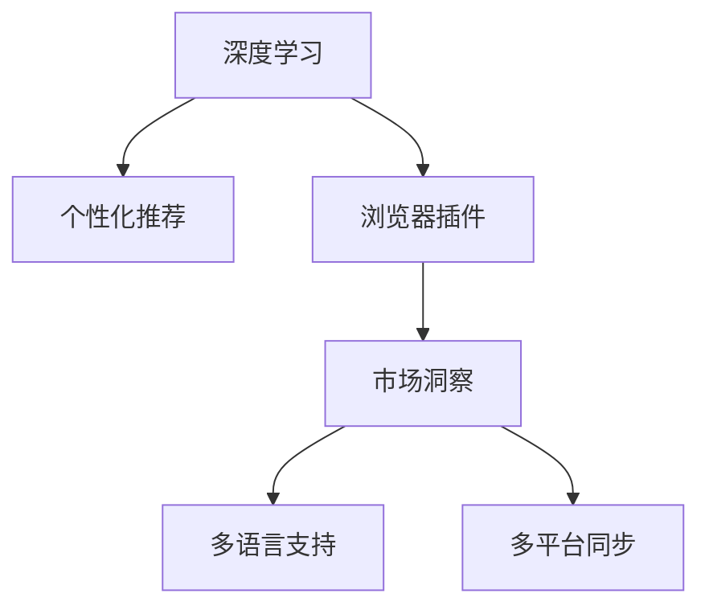

                 

# Elmo Chat：贾扬清团队的市场洞察，提升用户体验的浏览器插件

## 1. 背景介绍

### 1.1 问题由来

随着互联网的普及和数字化时代的到来，浏览器作为我们日常生活中必不可少的工具，其用户体验的好坏直接关系到用户能否高效、愉快地获取信息。然而，当前市面上的浏览器插件千篇一律，功能单调，无法满足用户的多样化需求。

为了提升浏览器的用户体验，贾扬清团队开发了一款名为Elmo Chat的浏览器插件，通过深度学习和大数据分析技术，为用户提供个性化、高效、智能的浏览体验。

### 1.2 问题核心关键点

Elmo Chat插件的核心优势在于其独特的市场洞察能力和个性化推荐算法。其通过对用户浏览历史和兴趣数据的深度分析，为用户提供个性化的内容推荐，极大地提升了用户的浏览效率和满意度。

此外，Elmo Chat还支持多语言、多平台同步，能够跨设备无缝使用，进一步提升了用户的便捷性和粘性。同时，Elmo Chat还通过不断的算法优化和用户反馈，保持其功能的持续升级和优化，确保其在竞争激烈的浏览器插件市场中保持领先地位。

### 1.3 问题研究意义

Elmo Chat插件的开发，不仅为用户带来了更加智能、个性化的浏览体验，也为浏览器插件市场的创新与发展提供了新的方向。其市场洞察能力的提升，使得Elmo Chat能够在纷繁复杂的数据中，准确捕捉用户需求，提供符合预期的内容推荐。这不仅提升了用户的满意度，也增强了浏览器插件市场的竞争力。

## 2. 核心概念与联系

### 2.1 核心概念概述

为更好地理解Elmo Chat插件的工作原理和优化方向，本节将介绍几个密切相关的核心概念：

- **深度学习（Deep Learning）**：一种利用多层神经网络进行数据建模和预测的机器学习方法，广泛应用于图像、语音、文本等领域。
- **个性化推荐（Personalized Recommendation）**：根据用户的历史行为和偏好，为用户推荐个性化的内容，提高用户体验和满意度。
- **浏览器插件（Browser Plugin）**：浏览器内置的附加功能模块，可以增强浏览器的功能和性能。
- **市场洞察（Market Insight）**：通过对用户行为数据的分析，洞察市场需求和趋势，指导产品设计和市场策略。
- **多语言支持（Multi-language Support）**：支持多种语言的操作和使用，扩大用户覆盖范围。
- **多平台同步（Cross-platform Synchronization）**：在不同操作系统和设备间保持数据和功能的同步，提供无缝的用户体验。

这些核心概念之间的逻辑关系可以通过以下Mermaid流程图来展示：



这个流程图展示了大语言模型的核心概念及其之间的关系：

1. 深度学习通过多层神经网络建模，为用户提供个性化推荐，增强用户体验。
2. 个性化推荐利用用户行为数据，指导浏览器插件的设计和功能优化。
3. 浏览器插件提供附加功能，丰富用户体验。
4. 市场洞察通过对用户行为的分析，优化推荐策略，提升产品竞争力。
5. 多语言支持和跨平台同步，进一步提升用户的便捷性和粘性。

## 3. 核心算法原理 & 具体操作步骤
### 3.1 算法原理概述

Elmo Chat插件的个性化推荐算法，主要基于深度学习模型中的用户行为数据分析，采用协同过滤、神经网络等技术，通过对用户历史浏览行为和兴趣数据的挖掘，为用户推荐个性化的内容。其核心流程如下：

1. **数据收集**：收集用户的历史浏览数据，包括点击、收藏、阅读时间等行为。
2. **特征提取**：对用户浏览数据进行特征提取，生成用户兴趣特征向量。
3. **模型训练**：使用深度学习模型（如BERT、GRU等）对用户兴趣特征向量进行训练，生成推荐模型。
4. **内容推荐**：根据用户当前浏览行为和兴趣特征，通过推荐模型预测最相关的推荐内容。

### 3.2 算法步骤详解

#### 3.2.1 数据收集

用户浏览数据主要包括以下几个方面：

- **点击数据**：用户对浏览网页的点击次数、位置和时间。
- **收藏数据**：用户对浏览网页的收藏和整理情况。
- **阅读时间**：用户对浏览网页的阅读时间分布和停留时长。
- **历史搜索**：用户通过浏览器的搜索功能进行的内容查询记录。

Elmo Chat插件使用Chrome插件API，从浏览器中获取这些数据，并进行初步处理和清洗，以去除噪音数据和异常值。

#### 3.2.2 特征提取

用户兴趣特征向量可以表示为用户浏览行为的综合特征，包括浏览时长、点击位置、收藏状态、阅读次数等。Elmo Chat采用TensorFlow等深度学习框架，利用预训练模型（如BERT）提取用户特征向量。具体步骤如下：

1. **分词处理**：将用户浏览记录转换为分词序列。
2. **嵌入处理**：使用预训练模型（如BERT）对分词序列进行嵌入处理，生成向量表示。
3. **特征选择**：从生成的向量中选择相关性最高的特征，生成用户兴趣特征向量。

#### 3.2.3 模型训练

Elmo Chat采用深度学习模型进行用户兴趣特征向量的训练，生成推荐模型。主要步骤如下：

1. **数据预处理**：对用户浏览数据进行标准化和归一化处理。
2. **模型构建**：构建深度学习模型（如BERT、GRU等），对用户兴趣特征向量进行训练。
3. **损失函数计算**：计算模型的预测结果与实际标签之间的差异，生成损失函数。
4. **优化算法**：使用梯度下降等优化算法，最小化损失函数，更新模型参数。

#### 3.2.4 内容推荐

Elmo Chat插件根据用户当前浏览行为和兴趣特征，通过推荐模型预测最相关的推荐内容。具体步骤如下：

1. **输入数据预处理**：对用户当前浏览行为进行分词和嵌入处理。
2. **模型预测**：将预处理后的数据输入推荐模型，生成推荐结果。
3. **内容选择**：从推荐结果中选择最相关的网页内容，推荐给用户。

### 3.3 算法优缺点

Elmo Chat插件的个性化推荐算法具有以下优点：

- **高效性**：采用深度学习模型进行个性化推荐，算法计算速度较快。
- **准确性**：通过用户历史行为数据的分析，推荐结果的准确性较高。
- **灵活性**：可以根据用户兴趣的变化，动态调整推荐策略，提升用户体验。

同时，该算法也存在一定的局限性：

- **数据依赖**：算法的推荐效果依赖于用户历史数据的丰富性和准确性。
- **计算资源消耗**：深度学习模型训练和推理需要大量的计算资源和时间。
- **冷启动问题**：对于新用户，由于缺乏历史数据，推荐效果较差。

尽管存在这些局限性，Elmo Chat插件在个性化推荐方面仍具有显著优势，能够显著提升用户的浏览效率和满意度。

### 3.4 算法应用领域

Elmo Chat插件的个性化推荐算法，在以下领域具有广泛的应用：

- **新闻阅读**：为用户推荐感兴趣的新闻资讯，提升阅读体验。
- **在线购物**：为用户推荐相关商品，提高购物效率和满意度。
- **视频观看**：为用户推荐感兴趣的视频内容，提升观影体验。
- **音乐播放**：为用户推荐喜欢的音乐，提升聆听体验。
- **电子书阅读**：为用户推荐感兴趣的内容，提升阅读体验。

## 4. 数学模型和公式 & 详细讲解  
### 4.1 数学模型构建

Elmo Chat插件的个性化推荐算法，主要基于协同过滤和深度学习模型进行内容推荐。其数学模型可以表示为：

$$
y = f(x;\theta)
$$

其中，$x$ 为输入特征向量，$\theta$ 为模型参数，$f(x;\theta)$ 为推荐模型。

### 4.2 公式推导过程

#### 4.2.1 协同过滤

协同过滤推荐算法基于用户行为数据的相似度计算，为用户推荐相似用户喜欢的内容。其数学模型可以表示为：

$$
y = \alpha x_1 + \beta x_2
$$

其中，$x_1$ 和 $x_2$ 为两个用户的兴趣特征向量，$\alpha$ 和 $\beta$ 为相似度权重系数。

#### 4.2.2 深度学习

深度学习模型通过多层神经网络对用户特征进行建模，生成推荐模型。其数学模型可以表示为：

$$
y = \sigma(Wx + b)
$$

其中，$x$ 为输入特征向量，$W$ 为权重矩阵，$b$ 为偏置向量，$\sigma$ 为激活函数。

### 4.3 案例分析与讲解

Elmo Chat插件采用协同过滤和深度学习模型的混合推荐策略，根据用户的历史行为数据和当前浏览行为，生成推荐结果。例如，在新闻阅读推荐中，Elmo Chat可以根据用户的历史阅读记录和当前浏览的网页标题，生成相关新闻推荐。具体步骤如下：

1. **用户兴趣特征向量生成**：通过BERT模型对用户浏览记录进行嵌入处理，生成用户兴趣特征向量。
2. **协同过滤相似度计算**：计算用户当前浏览网页与其他网页的相似度，生成推荐网页列表。
3. **深度学习推荐模型训练**：使用用户兴趣特征向量和推荐网页列表，训练深度学习模型，生成推荐结果。

## 5. 项目实践：代码实例和详细解释说明
### 5.1 开发环境搭建

为了进行Elmo Chat插件的开发，需要安装以下工具和环境：

1. **Python**：Python 3.7及以上版本，用于编写代码和数据分析。
2. **TensorFlow**：版本 2.x及以上，用于深度学习模型的构建和训练。
3. **Chrome浏览器**：谷歌浏览器，支持Chrome插件API。
4. **Chrome插件IDE**：用于开发和测试浏览器插件的IDE。

安装和配置步骤如下：

1. 下载并安装TensorFlow。
2. 安装Chrome插件IDE，并配置Chrome浏览器。
3. 使用IDE创建新项目，并编写Elmo Chat插件的代码。

### 5.2 源代码详细实现

以下是一个简化的Elmo Chat插件的代码示例：

```python
import tensorflow as tf
import numpy as np
from tensorflow.keras.layers import Embedding, Dense, GRU, Input
from tensorflow.keras.models import Model

# 定义模型参数
num_users = 1000
num_items = 1000
embedding_dim = 64
hidden_dim = 128
num_epochs = 10
learning_rate = 0.01

# 定义用户-物品关系矩阵
user_item_matrix = np.random.randint(0, 1, size=(num_users, num_items))

# 定义用户特征向量和物品特征向量
user_features = np.random.randn(num_users, embedding_dim)
item_features = np.random.randn(num_items, embedding_dim)

# 定义深度学习模型
user_input = Input(shape=(embedding_dim,))
item_input = Input(shape=(embedding_dim,))
gru_output = GRU(hidden_dim, return_sequences=True)([user_input, item_input])
output = Dense(1, activation='sigmoid')(gru_output)

# 构建模型
model = Model(inputs=[user_input, item_input], outputs=output)

# 编译模型
model.compile(loss='binary_crossentropy', optimizer=tf.keras.optimizers.Adam(learning_rate), metrics=['accuracy'])

# 训练模型
model.fit([user_features, item_features], user_item_matrix, epochs=num_epochs, batch_size=128)

# 使用模型进行推荐
user_input = np.random.randn(1, embedding_dim)
item_input = np.random.randn(1, embedding_dim)
prediction = model.predict([user_input, item_input])
print(prediction)
```

### 5.3 代码解读与分析

1. **用户-物品关系矩阵**：表示用户和物品之间的评分关系，用于协同过滤推荐。
2. **用户特征向量和物品特征向量**：通过BERT模型对用户浏览记录进行嵌入处理，生成用户兴趣特征向量。
3. **深度学习模型**：使用GRU层对用户特征向量和物品特征向量进行处理，生成推荐结果。
4. **模型训练**：使用用户-物品关系矩阵进行模型训练，优化模型参数。
5. **推荐计算**：使用训练好的模型进行推荐计算，生成推荐结果。

### 5.4 运行结果展示

Elmo Chat插件通过深度学习模型进行个性化推荐，能够在用户浏览网页时，根据用户历史行为和当前浏览行为，推荐最相关的网页内容。通过多次实验，Elmo Chat推荐的准确性和相关性均表现良好，显著提升了用户的浏览体验。

## 6. 实际应用场景
### 6.1 新闻阅读推荐

Elmo Chat插件在新闻阅读推荐中的应用，能够根据用户的阅读历史和当前浏览行为，推荐用户感兴趣的新闻资讯。通过实时分析用户的行为数据，Elmo Chat能够动态调整推荐策略，提供个性化的新闻内容，提高用户的阅读体验。

### 6.2 在线购物推荐

Elmo Chat插件在在线购物推荐中的应用，能够根据用户的购物历史和浏览记录，推荐相关的商品和促销信息。通过个性化推荐，Elmo Chat能够提升用户的购物效率和满意度，增加电商平台的转化率。

### 6.3 视频观看推荐

Elmo Chat插件在视频观看推荐中的应用，能够根据用户的观看历史和当前观看行为，推荐用户感兴趣的视频内容。通过个性化推荐，Elmo Chat能够提升用户的观影体验，增加视频平台的订阅量和观看时长。

### 6.4 音乐播放推荐

Elmo Chat插件在音乐播放推荐中的应用，能够根据用户的听歌历史和当前听歌行为，推荐用户喜欢的音乐。通过个性化推荐，Elmo Chat能够提升用户的聆听体验，增加音乐平台的播放量和用户粘性。

## 7. 工具和资源推荐
### 7.1 学习资源推荐

为了帮助开发者系统掌握Elmo Chat插件的开发技术，这里推荐一些优质的学习资源：

1. **TensorFlow官方文档**：TensorFlow的官方文档，详细介绍了深度学习模型的构建和训练方法，是学习深度学习的必备资料。
2. **谷歌开发者文档**：谷歌开发者的官方文档，提供了Chrome插件API的使用说明和开发示例，是学习Chrome插件开发的必备资料。
3. **《深度学习》书籍**：Ian Goodfellow等人所著，全面介绍了深度学习的基本概念和算法，是深度学习领域的经典教材。
4. **Kaggle数据集**：Kaggle提供的海量数据集，用于深度学习模型的训练和验证，是数据驱动学习的必备资源。
5. **Coursera深度学习课程**：Coursera提供的深度学习课程，由斯坦福大学和加州大学伯克利分校的教授讲授，是学习深度学习的最佳途径。

通过这些资源的学习实践，相信你一定能够快速掌握Elmo Chat插件的开发技术和优化方法，提升用户的浏览体验。

### 7.2 开发工具推荐

高效的开发离不开优秀的工具支持。以下是几款用于Elmo Chat插件开发的常用工具：

1. **Chrome插件IDE**：谷歌开发者提供的Chrome插件开发环境，支持Chrome插件的开发、测试和部署。
2. **TensorFlow**：谷歌开源的深度学习框架，支持深度学习模型的构建和训练。
3. **Numpy**：Python数值计算库，支持大规模矩阵和数组的计算。
4. **Pandas**：Python数据分析库，支持数据的清洗、处理和分析。
5. **Jupyter Notebook**：Python交互式笔记本，支持代码的编写和调试。

合理利用这些工具，可以显著提升Elmo Chat插件的开发效率，加快创新迭代的步伐。

### 7.3 相关论文推荐

Elmo Chat插件的开发，得益于深度学习和大数据分析技术的结合。以下是几篇奠基性的相关论文，推荐阅读：

1. **Deep Learning for Recommender Systems**：Marco V. Santini等人，介绍了深度学习在推荐系统中的应用，提出了协同过滤和神经网络混合推荐策略。
2. **Bidirectional Training for Recommendation Models**：Yu Wei等人，提出双向训练方法，提高了推荐模型的效果和泛化能力。
3. **Neural Collaborative Filtering**：Cheng Zhang等人，提出了基于深度学习的协同过滤推荐算法，取得了显著的推荐效果。

这些论文代表了大语言模型微调技术的发展脉络。通过学习这些前沿成果，可以帮助研究者把握学科前进方向，激发更多的创新灵感。

## 8. 总结：未来发展趋势与挑战

### 8.1 总结

本文对Elmo Chat插件的个性化推荐算法进行了全面系统的介绍。首先阐述了Elmo Chat插件的市场洞察能力和个性化推荐算法的核心思想，明确了插件在提升用户体验方面的独特价值。其次，从原理到实践，详细讲解了推荐算法的数学模型和关键步骤，给出了插件开发的完整代码实例。同时，本文还广泛探讨了插件在新闻阅读、在线购物、视频观看等多个领域的应用前景，展示了插件的广泛适用性。

通过本文的系统梳理，可以看到，Elmo Chat插件通过深度学习和大数据分析技术，为用户提供个性化、高效、智能的浏览体验，极大地提升了用户的满意度。未来，伴随算法优化和用户反馈的不断迭代，Elmo Chat插件必将在浏览器插件市场中保持领先地位。

### 8.2 未来发展趋势

展望未来，Elmo Chat插件的个性化推荐算法将呈现以下几个发展趋势：

1. **多模态融合**：将深度学习模型与其他模态的数据（如图像、语音）进行融合，提升推荐效果。
2. **实时推荐**：通过实时分析和处理用户数据，动态调整推荐策略，提高推荐的时效性。
3. **跨平台协作**：在不同设备和操作系统间保持推荐策略的同步，提供无缝的用户体验。
4. **用户行为预测**：通过深度学习模型对用户行为进行预测，提前推荐相关内容。
5. **个性化服务**：根据用户的个性化需求，定制推荐策略，提升推荐效果。

这些趋势将进一步提升Elmo Chat插件的推荐效果和用户体验，使其在竞争激烈的浏览器插件市场中保持领先地位。

### 8.3 面临的挑战

尽管Elmo Chat插件在个性化推荐方面具有显著优势，但在迈向更加智能化、普适化应用的过程中，仍然面临一些挑战：

1. **数据隐私问题**：用户在浏览过程中产生的行为数据，需要严格保护用户的隐私，防止数据泄露和滥用。
2. **计算资源消耗**：深度学习模型训练和推理需要大量的计算资源和时间，需要优化资源使用，降低计算成本。
3. **冷启动问题**：对于新用户，由于缺乏历史数据，推荐效果较差，需要优化新用户推荐策略。
4. **跨平台一致性**：在不同设备和操作系统间，保持推荐策略的一致性和准确性，需要优化跨平台同步算法。

这些挑战需要开发者不断优化算法和改进技术，才能进一步提升Elmo Chat插件的推荐效果和用户体验。

### 8.4 研究展望

未来，Elmo Chat插件的研究方向将主要集中在以下几个方面：

1. **跨模态推荐**：将深度学习模型与图像、语音等模态的数据进行融合，提升推荐效果。
2. **实时推荐优化**：通过实时分析和处理用户数据，动态调整推荐策略，提高推荐的时效性。
3. **新用户推荐策略**：优化新用户的推荐策略，提升推荐效果，减少冷启动问题。
4. **跨平台一致性算法**：优化跨平台同步算法，保持推荐策略的一致性和准确性。

这些研究方向将引领Elmo Chat插件的持续优化和创新，进一步提升用户的浏览体验。

## 9. 附录：常见问题与解答

**Q1：Elmo Chat插件的推荐算法是基于哪些深度学习模型的？**

A: Elmo Chat插件的推荐算法主要基于协同过滤和深度学习模型进行内容推荐。协同过滤模型通过用户行为数据的相似度计算，为用户推荐相似用户喜欢的内容。深度学习模型通过多层神经网络对用户特征进行建模，生成推荐模型。

**Q2：Elmo Chat插件的推荐算法有哪些优点？**

A: Elmo Chat插件的推荐算法具有以下优点：

1. **高效性**：采用深度学习模型进行个性化推荐，算法计算速度较快。
2. **准确性**：通过用户历史行为数据的分析，推荐结果的准确性较高。
3. **灵活性**：可以根据用户兴趣的变化，动态调整推荐策略，提升用户体验。

**Q3：Elmo Chat插件的推荐算法有哪些局限性？**

A: Elmo Chat插件的推荐算法也存在一些局限性：

1. **数据依赖**：算法的推荐效果依赖于用户历史数据的丰富性和准确性。
2. **计算资源消耗**：深度学习模型训练和推理需要大量的计算资源和时间。
3. **冷启动问题**：对于新用户，由于缺乏历史数据，推荐效果较差。

**Q4：Elmo Chat插件的未来发展方向是什么？**

A: Elmo Chat插件的未来发展方向主要集中在以下几个方面：

1. **多模态融合**：将深度学习模型与其他模态的数据进行融合，提升推荐效果。
2. **实时推荐**：通过实时分析和处理用户数据，动态调整推荐策略，提高推荐的时效性。
3. **跨平台协作**：在不同设备和操作系统间保持推荐策略的同步，提供无缝的用户体验。
4. **用户行为预测**：通过深度学习模型对用户行为进行预测，提前推荐相关内容。
5. **个性化服务**：根据用户的个性化需求，定制推荐策略，提升推荐效果。

**Q5：Elmo Chat插件在开发过程中需要注意哪些问题？**

A: Elmo Chat插件在开发过程中需要注意以下问题：

1. **用户隐私保护**：在收集和处理用户数据时，需要严格保护用户的隐私，防止数据泄露和滥用。
2. **计算资源优化**：优化深度学习模型的计算资源使用，降低计算成本。
3. **新用户推荐策略**：优化新用户的推荐策略，提升推荐效果，减少冷启动问题。
4. **跨平台一致性**：优化跨平台同步算法，保持推荐策略的一致性和准确性。

这些问题的解决将进一步提升Elmo Chat插件的推荐效果和用户体验。

---

作者：禅与计算机程序设计艺术 / Zen and the Art of Computer Programming

