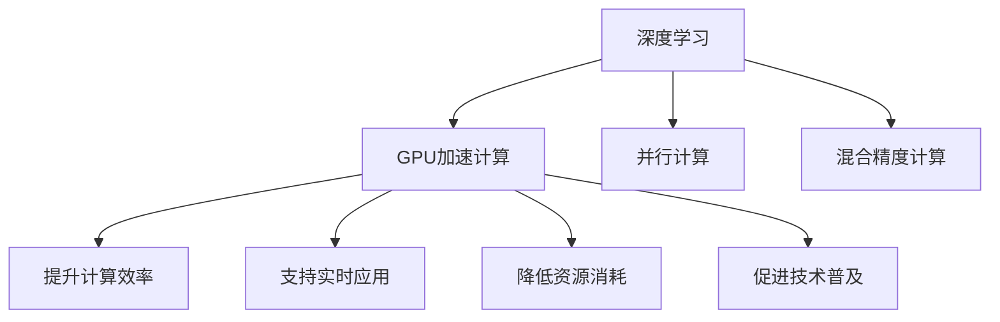

                 

## 1. 背景介绍

### 1.1 问题由来
深度学习作为一种人工智能的重要技术，广泛应用于计算机视觉、自然语言处理、语音识别等诸多领域，并在各个应用中取得了显著的成果。随着深度学习模型的复杂度不断提升，模型参数量也随之呈指数级增长，这导致计算和存储资源的消耗巨大，对硬件设备的要求也越来越高。

具体来说，目前深度学习模型中的计算量主要集中在卷积和全连接层的矩阵乘法和矩阵加法运算上，这些计算量在传统CPU上难以高效完成，需要强大的并行计算能力。因此，利用GPU进行加速计算，成为深度学习发展的重要方向。

### 1.2 问题核心关键点
GPU加速计算的根本目标在于通过并行计算能力提升深度学习模型的训练和推理效率，使得模型能够在大规模数据集上快速迭代训练，并且在实际应用中能够实时响应。GPU加速计算主要分为以下三个关键点：

1. **并行计算能力**：GPU可以同时处理多个计算任务，将计算密集型的深度学习模型分解成多个并行计算任务，提升计算效率。
2. **大容量显存**：GPU拥有比传统CPU更大的显存容量，可以存储大规模中间结果和模型参数，保证模型的完整性和训练的连续性。
3. **混合精度计算**：GPU支持混合精度计算，能够通过降低计算精度的同时提高计算速度，进一步提升训练和推理的效率。

### 1.3 问题研究意义
GPU加速计算不仅提升了深度学习模型的训练和推理效率，降低了计算和存储成本，还推动了深度学习技术在更多领域的应用，具有重要的研究意义：

1. **提升模型训练速度**：GPU加速计算可以在短时间内完成深度学习模型的训练，使得大规模深度学习任务成为可能。
2. **支持实时应用**：GPU加速计算使得深度学习模型能够在实际应用中实时响应，广泛应用于自动驾驶、语音识别、医疗影像分析等领域。
3. **降低资源消耗**：GPU加速计算降低了深度学习模型的资源消耗，减少了对传统计算资源的依赖。
4. **促进技术普及**：GPU加速计算降低了深度学习技术的入门门槛，使得更多研究人员和工程师能够快速上手和应用深度学习技术。

## 2. 核心概念与联系

### 2.1 核心概念概述

为了更好地理解GPU加速计算的工作原理和应用场景，本节将介绍几个密切相关的核心概念：

- **深度学习**：一种模拟人脑神经网络结构的机器学习技术，通过多层神经网络对输入数据进行复杂非线性变换，从而实现分类、回归、生成等任务。
- **GPU（图形处理器）**：一种专门用于处理图形和并行计算任务的处理器，拥有强大的并行计算能力和大容量显存。
- **并行计算**：通过将计算任务分解成多个并行任务，同时处理多个计算任务，从而提升计算效率。
- **混合精度计算**：使用不同精度的数据类型进行计算，从而在保证精度的情况下提升计算速度。

这些核心概念之间的逻辑关系可以通过以下Mermaid流程图来展示：



这个流程图展示了大语言模型的核心概念及其之间的关系：

1. 深度学习通过GPU加速计算提升了计算效率。
2. GPU加速计算通过并行计算和大容量显存实现了计算任务的并行处理。
3. 混合精度计算通过降低计算精度提升了计算速度，同时保证了计算精度。

这些概念共同构成了GPU加速计算的框架，使得深度学习技术能够在实际应用中高效运行。通过理解这些核心概念，我们可以更好地把握GPU加速计算的工作原理和优化方向。

## 3. 核心算法原理 & 具体操作步骤
### 3.1 算法原理概述

GPU加速计算的原理在于充分利用GPU的并行计算能力，将深度学习模型的计算任务分解成多个并行计算任务，同时在GPU的大容量显存中存储中间结果和模型参数。这样可以极大地提升计算效率和训练速度。

具体而言，GPU加速计算可以分为以下几个步骤：

1. **数据准备**：将输入数据和模型参数加载到GPU显存中，确保数据和模型在GPU上可见。
2. **模型部署**：将深度学习模型从CPU加载到GPU上，并部署到GPU的并行计算环境中进行计算。
3. **并行计算**：在GPU的并行计算环境中，将计算密集型的矩阵乘法和矩阵加法运算分解成多个并行计算任务，同时处理多个计算任务。
4. **混合精度计算**：在并行计算中，使用混合精度数据类型进行计算，降低计算精度同时提升计算速度。
5. **结果处理**：将并行计算的结果从GPU显存中读取，进行后续的模型更新和推理。

### 3.2 算法步骤详解

以下是GPU加速计算的具体步骤和代码实现：

**Step 1: 数据准备**
将输入数据和模型参数加载到GPU显存中，可以使用Python中的`torch.cuda`和`np.cuda`等库进行数据传输和内存管理。

```python
import torch
import numpy as np

# 将输入数据加载到GPU显存中
input_data = np.random.randn(32, 784)
input_data = torch.from_numpy(input_data).cuda()

# 将模型参数加载到GPU显存中
model = torch.nn.Linear(784, 10).cuda()
model.load_state_dict(torch.load('model.pth'))
```

**Step 2: 模型部署**
将深度学习模型从CPU加载到GPU上，并部署到GPU的并行计算环境中进行计算。

```python
# 将深度学习模型从CPU加载到GPU上
model.to('cuda')
```

**Step 3: 并行计算**
在GPU的并行计算环境中，将计算密集型的矩阵乘法和矩阵加法运算分解成多个并行计算任务，同时处理多个计算任务。

```python
# 使用GPU进行并行计算
output = model(input_data)
```

**Step 4: 混合精度计算**
在并行计算中，使用混合精度数据类型进行计算，降低计算精度同时提升计算速度。

```python
# 使用混合精度计算
torch.cuda.set_float16(False) # 关闭混合精度计算
```

**Step 5: 结果处理**
将并行计算的结果从GPU显存中读取，进行后续的模型更新和推理。

```python
# 将计算结果从GPU显存中读取
output = output.cpu()
```

### 3.3 算法优缺点

GPU加速计算具有以下优点：

1. **计算效率高**：GPU的并行计算能力使得深度学习模型的训练和推理速度大幅提升，可以在短时间内完成大规模计算任务。
2. **支持实时应用**：GPU加速计算使得深度学习模型能够在实际应用中实时响应，广泛应用于自动驾驶、语音识别、医疗影像分析等领域。
3. **降低资源消耗**：GPU加速计算降低了深度学习模型的资源消耗，减少了对传统计算资源的依赖。
4. **支持混合精度计算**：GPU支持混合精度计算，能够在保证精度的同时提升计算速度，进一步降低计算资源消耗。

同时，GPU加速计算也存在一定的局限性：

1. **GPU资源成本高**：GPU的购买和维护成本较高，需要较大的硬件投入。
2. **GPU并行计算优化复杂**：GPU并行计算的优化需要丰富的硬件和软件知识，增加了开发难度。
3. **数据传输开销大**：数据在GPU和CPU之间的传输需要消耗一定的时间，增加了计算延迟。
4. **内存限制**：GPU的显存容量有限，对于大规模数据集和模型需要考虑内存限制问题。

尽管存在这些局限性，但GPU加速计算仍然是深度学习加速计算的重要手段，广泛应用于大规模深度学习任务中。未来相关研究的重点在于如何进一步降低GPU加速计算的资源成本，提高计算效率，优化数据传输和内存管理。

### 3.4 算法应用领域

GPU加速计算在深度学习中得到了广泛应用，主要应用于以下几个领域：

1. **计算机视觉**：GPU加速计算用于图像识别、目标检测、语义分割等计算机视觉任务，使得模型能够在大量图像数据上进行高效训练和推理。
2. **自然语言处理**：GPU加速计算用于语言模型训练、机器翻译、情感分析等自然语言处理任务，提升了模型的训练速度和推理效率。
3. **语音识别**：GPU加速计算用于语音识别任务，使得模型能够在大量音频数据上进行高效训练和实时推理。
4. **自动驾驶**：GPU加速计算用于自动驾驶中的环境感知、决策规划等任务，提升了系统的实时性和稳定性。
5. **医疗影像分析**：GPU加速计算用于医疗影像分析任务，使得模型能够在大量医学图像数据上进行高效训练和推理。
6. **视频处理**：GPU加速计算用于视频处理任务，使得模型能够在大量视频数据上进行高效训练和实时推理。

此外，GPU加速计算在科学研究、工业制造、金融分析等领域也得到了广泛应用，推动了相关技术的进步和产业的发展。

## 4. 数学模型和公式 & 详细讲解 & 举例说明

### 4.1 数学模型构建

GPU加速计算的数学模型主要涉及矩阵乘法和矩阵加法运算。以卷积神经网络（CNN）为例，其计算过程可以表示为：

$$
\text{output} = \text{convolution}(\text{input}, \text{filter}) + \text{bias}
$$

其中，$\text{input}$表示输入特征图，$\text{filter}$表示卷积核，$\text{bias}$表示偏置项。卷积运算可以表示为：

$$
\text{output}_{i,j} = \sum_{k=0}^{N-1} \text{filter}_{k,i,j} \times \text{input}_{k,i+s,j+s}
$$

其中，$N$表示卷积核大小，$s$表示步幅。

### 4.2 公式推导过程

以下是卷积运算的详细推导过程：

1. **输入数据**：假设输入特征图大小为$H \times W$，每个像素点为一个$D$维向量，表示为$\text{input}_{i,j}$，其中$i,j$表示像素点在特征图上的位置。
2. **卷积核**：假设卷积核大小为$N \times N$，每个像素点为一个$D$维向量，表示为$\text{filter}_{k,i,j}$，其中$k$表示卷积核的位置。
3. **计算输出**：将卷积核在输入特征图上滑动，进行卷积运算，得到输出特征图大小为$H' \times W'$，每个像素点为$\text{output}_{i,j}$。

具体计算过程可以表示为：

$$
\text{output}_{i,j} = \sum_{k=0}^{N-1} \text{filter}_{k,i,j} \times \text{input}_{k,i+s,j+s}
$$

其中，$s$表示卷积核的步幅，$H'$和$W'$表示卷积后的特征图大小。

### 4.3 案例分析与讲解

以图像分类任务为例，对GPU加速计算进行详细分析：

假设输入特征图大小为$32 \times 32$，卷积核大小为$3 \times 3$，步幅为$1$，输出特征图大小为$30 \times 30$。具体计算过程如下：

1. **输入数据**：输入特征图大小为$32 \times 32$，每个像素点为一个$D$维向量，表示为$\text{input}_{i,j}$。
2. **卷积核**：卷积核大小为$3 \times 3$，每个像素点为一个$D$维向量，表示为$\text{filter}_{k,i,j}$。
3. **计算输出**：将卷积核在输入特征图上滑动，进行卷积运算，得到输出特征图大小为$30 \times 30$，每个像素点为$\text{output}_{i,j}$。

具体计算过程如下：

$$
\text{output}_{i,j} = \sum_{k=0}^{2} \text{filter}_{k,i,j} \times \text{input}_{k,i+1,j+1} + \text{filter}_{k,i,j} \times \text{input}_{k,i+1,j+2} + \cdots
$$

其中，$k$表示卷积核的位置。

通过上述推导，我们可以看到，卷积运算在GPU上可以通过并行计算进行优化，从而提升计算效率。在实际应用中，GPU加速计算在深度学习模型的训练和推理中得到了广泛应用，提升了计算效率和训练速度。

## 5. 项目实践：代码实例和详细解释说明
### 5.1 开发环境搭建

在进行GPU加速计算实践前，我们需要准备好开发环境。以下是使用Python进行PyTorch开发的环境配置流程：

1. 安装Anaconda：从官网下载并安装Anaconda，用于创建独立的Python环境。

2. 创建并激活虚拟环境：
```bash
conda create -n pytorch-env python=3.8 
conda activate pytorch-env
```

3. 安装PyTorch：根据CUDA版本，从官网获取对应的安装命令。例如：
```bash
conda install pytorch torchvision torchaudio cudatoolkit=11.1 -c pytorch -c conda-forge
```

4. 安装Transformers库：
```bash
pip install transformers
```

5. 安装各类工具包：
```bash
pip install numpy pandas scikit-learn matplotlib tqdm jupyter notebook ipython
```

完成上述步骤后，即可在`pytorch-env`环境中开始GPU加速计算实践。

### 5.2 源代码详细实现

下面是使用PyTorch对卷积神经网络（CNN）进行GPU加速计算的代码实现。

```python
import torch
import torch.nn as nn
import torchvision.transforms as transforms
from torchvision.datasets import CIFAR10
from torch.utils.data import DataLoader

# 定义卷积神经网络模型
class Net(nn.Module):
    def __init__(self):
        super(Net, self).__init__()
        self.conv1 = nn.Conv2d(3, 6, 5)
        self.pool = nn.MaxPool2d(2, 2)
        self.conv2 = nn.Conv2d(6, 16, 5)
        self.fc1 = nn.Linear(16 * 5 * 5, 120)
        self.fc2 = nn.Linear(120, 84)
        self.fc3 = nn.Linear(84, 10)

    def forward(self, x):
        x = self.pool(F.relu(self.conv1(x)))
        x = self.pool(F.relu(self.conv2(x)))
        x = x.view(-1, 16 * 5 * 5)
        x = F.relu(self.fc1(x))
        x = F.relu(self.fc2(x))
        x = self.fc3(x)
        return x

# 定义训练和测试函数
def train(model, device, train_loader, optimizer, epoch):
    model.train()
    for batch_idx, (data, target) in enumerate(train_loader):
        data, target = data.to(device), target.to(device)
        optimizer.zero_grad()
        output = model(data)
        loss = F.cross_entropy(output, target)
        loss.backward()
        optimizer.step()

def test(model, device, test_loader):
    model.eval()
    correct = 0
    total = 0
    with torch.no_grad():
        for data, target in test_loader:
            data, target = data.to(device), target.to(device)
            output = model(data)
            _, predicted = torch.max(output.data, 1)
            total += target.size(0)
            correct += (predicted == target).sum().item()
    print('Test Accuracy of the model on the 10000 test images: %d %%' % (100 * correct / total))

# 加载数据集
transform = transforms.Compose([
    transforms.ToTensor(),
    transforms.Normalize((0.5, 0.5, 0.5), (0.5, 0.5, 0.5))
])

train_dataset = CIFAR10(root='./data', train=True, download=True, transform=transform)
train_loader = DataLoader(train_dataset, batch_size=128, shuffle=True, num_workers=2)
test_dataset = CIFAR10(root='./data', train=False, download=True, transform=transform)
test_loader = DataLoader(test_dataset, batch_size=128, shuffle=False, num_workers=2)

# 定义模型和优化器
model = Net().cuda()
optimizer = torch.optim.SGD(model.parameters(), lr=0.001, momentum=0.9)
scheduler = torch.optim.lr_scheduler.StepLR(optimizer, step_size=7, gamma=0.1)

# 开始训练
device = torch.device('cuda' if torch.cuda.is_available() else 'cpu')
model.to(device)

for epoch in range(10):
    train(model, device, train_loader, optimizer, epoch)
    scheduler.step()
    test(model, device, test_loader)
```

### 5.3 代码解读与分析

让我们再详细解读一下关键代码的实现细节：

**定义Net类**：
- `__init__`方法：定义卷积神经网络的结构，包括卷积层、池化层和全连接层。
- `forward`方法：定义前向传播的计算过程。

**train函数**：
- 在训练过程中，将数据和标签加载到GPU上，并调用`model`进行前向传播计算。
- 计算损失函数，并使用反向传播算法更新模型参数。
- 输出每个epoch的损失值和训练进度。

**test函数**：
- 在测试过程中，将数据和标签加载到GPU上，并调用`model`进行前向传播计算。
- 计算模型的准确率，并输出测试结果。

**数据集加载**：
- 使用`transforms`库对数据集进行预处理，包括归一化等操作。
- 使用`CIFAR10`数据集，设置训练集和测试集，并加载到内存中。

**模型训练和测试**：
- 在训练过程中，使用SGD优化器进行模型参数更新。
- 在测试过程中，使用准确率作为评价指标。

通过上述代码，我们可以看到，使用GPU加速计算能够显著提升卷积神经网络的训练和推理速度。在实际应用中，GPU加速计算已经被广泛应用于深度学习模型的开发和应用中，极大地提升了计算效率和系统性能。

## 6. 实际应用场景
### 6.1 智能图像识别
GPU加速计算在智能图像识别任务中得到了广泛应用，如人脸识别、物体检测等。GPU并行计算的能力使得图像识别模型能够在大量图像数据上进行高效训练和推理。

以人脸识别为例，GPU加速计算可以显著提升人脸识别的速度和准确率。在实际应用中，人脸识别系统通常需要处理大量的视频流数据，GPU加速计算能够快速完成人脸检测和特征提取，提升系统的实时性和稳定性。

### 6.2 自然语言处理
GPU加速计算在自然语言处理任务中也得到了广泛应用，如机器翻译、文本分类、情感分析等。GPU并行计算的能力使得NLP模型能够在大量文本数据上进行高效训练和推理。

以机器翻译为例，GPU加速计算可以显著提升机器翻译模型的训练速度和推理效率。在实际应用中，机器翻译系统需要处理大量的文本数据，GPU加速计算能够快速完成翻译计算，提升系统的响应速度和翻译质量。

### 6.3 自动驾驶
GPU加速计算在自动驾驶中得到了广泛应用，如环境感知、决策规划等任务。GPU并行计算的能力使得自动驾驶系统能够在大量传感器数据上进行高效计算，提升系统的实时性和稳定性。

以环境感知为例，GPU加速计算可以显著提升自动驾驶中的图像处理和特征提取能力。在实际应用中，自动驾驶系统需要处理大量的传感器数据，GPU加速计算能够快速完成图像处理和特征提取，提升系统的实时性和可靠性。

### 6.4 金融分析
GPU加速计算在金融分析中也得到了广泛应用，如高频交易、风险管理等任务。GPU并行计算的能力使得金融模型能够在大量数据上进行高效计算，提升系统的实时性和准确率。

以高频交易为例，GPU加速计算可以显著提升高频交易模型的计算速度和实时性。在实际应用中，高频交易系统需要处理大量的交易数据，GPU加速计算能够快速完成高频交易计算，提升系统的交易速度和效率。

## 7. 工具和资源推荐
### 7.1 学习资源推荐

为了帮助开发者系统掌握GPU加速计算的理论基础和实践技巧，这里推荐一些优质的学习资源：

1. 《深度学习》课程：斯坦福大学开设的深度学习课程，涵盖了深度学习的基本概念和算法，适合初学者入门。
2. 《深度学习实战》书籍：Hands-On Machine Learning with Scikit-Learn, Keras, and TensorFlow，详细介绍了深度学习模型的开发和应用。
3. PyTorch官方文档：PyTorch官方文档，提供了丰富的API文档和代码示例，适合开发者快速上手。
4. TensorFlow官方文档：TensorFlow官方文档，提供了丰富的API文档和代码示例，适合开发者快速上手。
5. NVIDIA GPU加速计算官方文档：NVIDIA GPU加速计算官方文档，详细介绍了GPU加速计算的原理和应用。

通过对这些资源的学习实践，相信你一定能够快速掌握GPU加速计算的精髓，并用于解决实际的深度学习问题。

### 7.2 开发工具推荐

高效的开发离不开优秀的工具支持。以下是几款用于GPU加速计算开发的常用工具：

1. PyTorch：基于Python的开源深度学习框架，灵活动态的计算图，适合快速迭代研究。大部分深度学习模型都有PyTorch版本的实现。
2. TensorFlow：由Google主导开发的开源深度学习框架，生产部署方便，适合大规模工程应用。同样有丰富的深度学习模型资源。
3. Transformers库：HuggingFace开发的NLP工具库，集成了众多SOTA语言模型，支持PyTorch和TensorFlow，是进行GPU加速计算开发的利器。
4. Weights & Biases：模型训练的实验跟踪工具，可以记录和可视化模型训练过程中的各项指标，方便对比和调优。与主流深度学习框架无缝集成。
5. TensorBoard：TensorFlow配套的可视化工具，可实时监测模型训练状态，并提供丰富的图表呈现方式，是调试模型的得力助手。

合理利用这些工具，可以显著提升GPU加速计算的开发效率，加快创新迭代的步伐。

### 7.3 相关论文推荐

GPU加速计算在深度学习中的应用得到了学界的持续研究。以下是几篇奠基性的相关论文，推荐阅读：

1. ImageNet Classification with Deep Convolutional Neural Networks：提出深度卷积神经网络模型，首次在ImageNet数据集上取得了显著的分类结果。
2. Deep Residual Learning for Image Recognition：提出残差网络模型，解决了深度网络退化问题，提升了深度学习的性能。
3. Efficient Estimation of Unigram Language Models：提出基于GPU加速的分布式训练方法，极大地提升了语言模型训练速度。
4. Accelerating the Training of Deep Neural Networks Using GPUs：详细介绍了GPU加速计算的原理和应用，提出了多种GPU加速计算的优化方法。
5. Scaling Up Deep Learning with GPUs：详细介绍了GPU加速计算的原理和应用，提出了多种GPU加速计算的优化方法，适合初学者入门。

这些论文代表了大语言模型加速计算的发展脉络。通过学习这些前沿成果，可以帮助研究者把握学科前进方向，激发更多的创新灵感。

## 8. 总结：未来发展趋势与挑战
### 8.1 总结

本文对GPU加速计算的原理和实践进行了全面系统的介绍。首先阐述了GPU加速计算的背景和重要性，明确了GPU加速计算在深度学习中的应用价值。其次，从原理到实践，详细讲解了GPU加速计算的数学模型和操作步骤，给出了GPU加速计算的代码实现。同时，本文还探讨了GPU加速计算在智能图像识别、自然语言处理、自动驾驶、金融分析等多个领域的应用，展示了GPU加速计算的强大性能。最后，本文推荐了相关的学习资源、开发工具和研究论文，力求为读者提供全方位的技术指引。

通过本文的系统梳理，我们可以看到，GPU加速计算在深度学习中发挥了重要作用，极大地提升了计算效率和训练速度。未来，随着GPU硬件的不断进步和深度学习技术的不断发展，GPU加速计算将会在更多领域得到应用，进一步推动深度学习技术的发展。

### 8.2 未来发展趋势

展望未来，GPU加速计算的发展趋势如下：

1. **硬件升级**：随着GPU硬件的不断进步，GPU的并行计算能力和内存容量将进一步提升，能够支持更大规模、更复杂的深度学习模型。
2. **混合精度计算**：随着混合精度计算技术的不断发展，GPU将能够支持更高精度的混合精度计算，进一步提升计算速度和模型性能。
3. **自动混合精度**：未来GPU将能够自动调整计算精度，根据模型参数的重要程度和计算资源的需求，进行动态混合精度计算，提高计算效率和模型性能。
4. **软硬件协同**：未来GPU将能够与CPU、内存等硬件设备进行协同优化，提升系统整体性能。
5. **分布式训练**：随着分布式训练技术的不断发展，GPU将能够支持更大规模的分布式训练，提升模型训练速度和模型性能。

以上趋势表明，GPU加速计算将在深度学习领域发挥更加重要的作用，推动深度学习技术的不断进步和应用。

### 8.3 面临的挑战

尽管GPU加速计算在深度学习中发挥了重要作用，但在未来发展过程中，仍面临以下挑战：

1. **资源成本高**：GPU的购买和维护成本较高，需要较大的硬件投入。
2. **功耗高**：GPU的高性能计算需要大量的电能，能耗较高，对环境影响较大。
3. **编程复杂**：GPU编程需要掌握复杂的并行编程技术，增加了开发难度。
4. **数据传输开销大**：数据在GPU和CPU之间的传输需要消耗一定的时间，增加了计算延迟。
5. **内存限制**：GPU的显存容量有限，对于大规模数据集和模型需要考虑内存限制问题。

尽管存在这些挑战，但随着技术的不断进步，GPU加速计算将会在深度学习中发挥更加重要的作用，推动深度学习技术的不断进步和应用。

### 8.4 研究展望

面对GPU加速计算所面临的挑战，未来的研究需要在以下几个方面寻求新的突破：

1. **优化硬件资源利用**：优化GPU的硬件资源利用率，提高计算效率和系统性能。
2. **降低功耗**：开发低功耗的GPU硬件设备，降低计算成本和环境影响。
3. **提升编程效率**：开发更易用的GPU编程工具，降低开发难度和编程复杂度。
4. **优化数据传输**：优化数据在GPU和CPU之间的传输方式，减少计算延迟。
5. **扩展内存容量**：开发更大容量的GPU显存设备，支持更大规模的数据集和模型。

这些研究方向将推动GPU加速计算技术的不断进步，进一步提升深度学习技术的性能和应用范围。

## 9. 附录：常见问题与解答

**Q1：GPU加速计算是否适用于所有深度学习模型？**

A: GPU加速计算在大多数深度学习模型中都能取得显著的效果，特别是在计算密集型的模型中。但对于一些特定模型，如长短期记忆网络（LSTM）等，可能需要对计算方式进行优化才能获得良好的加速效果。

**Q2：GPU加速计算是否会降低模型精度？**

A: GPU加速计算通常使用混合精度计算，可能会降低模型精度。但通过适当的精度控制和模型训练策略，可以在保证精度的同时提升计算速度。

**Q3：GPU加速计算是否需要较高的硬件投入？**

A: GPU加速计算需要较高的硬件投入，包括高性能的GPU设备和充足的内存空间。但随着硬件技术的发展和成本的降低，GPU加速计算的门槛逐渐降低，越来越多的研究人员和企业能够采用GPU加速计算。

**Q4：GPU加速计算是否会影响模型训练的稳定性？**

A: GPU加速计算可能会影响模型训练的稳定性，特别是在大规模数据集和复杂模型上。需要通过适当的硬件资源管理和软件优化，确保模型训练的稳定性和效率。

**Q5：GPU加速计算是否适用于分布式训练？**

A: GPU加速计算非常适合分布式训练，可以在多个GPU上并行计算，加速模型的训练过程。但分布式训练需要考虑数据传输、模型同步等复杂问题，需要丰富的硬件和软件知识。

通过本文的系统梳理，我们可以看到，GPU加速计算在深度学习中发挥了重要作用，极大地提升了计算效率和训练速度。未来，随着GPU硬件的不断进步和深度学习技术的不断发展，GPU加速计算将会在更多领域得到应用，进一步推动深度学习技术的发展。

作者：禅与计算机程序设计艺术 / Zen and the Art of Computer Programming

