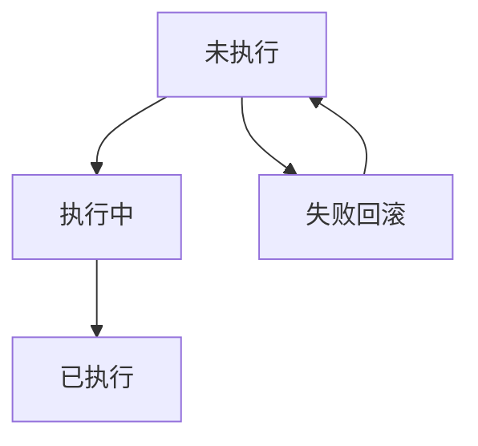
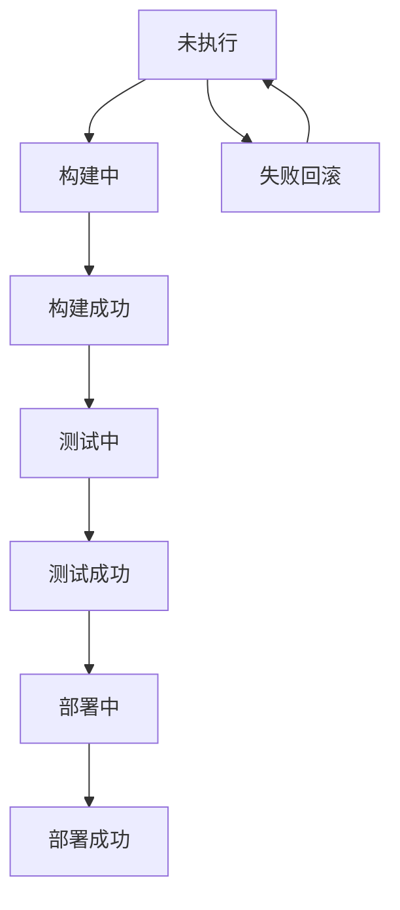

                 

# GitLab CI/CD最佳实践

> 关键词：CI/CD, GitLab, 持续集成, 持续部署, DevOps, 自动化

## 1. 背景介绍

### 1.1 问题由来

随着软件开发和运维复杂性的提升，传统的部署和运维流程已无法满足快速迭代和质量保障的需求。持续集成/持续部署（CI/CD）的概念应运而生，通过自动化流水线和自动化测试，提升了软件交付的速度和质量。

在CI/CD流程中，持续集成（CI）指的是在代码提交后自动进行构建、测试和验证，保证代码质量。持续部署（CD）则是指代码通过CI验证后，自动部署到生产环境，实现快速发布。

传统的CI/CD工具和平台，如Jenkins、Travis CI等，在中小型团队中应用广泛，但对于大型企业来说，功能扩展性和用户体验仍存在不足。而GitLab CI/CD则通过其强大的社区支持和丰富的功能，成为当下企业级CI/CD实践的首选工具。

### 1.2 问题核心关键点

GitLab CI/CD以Kubernetes为容器编排基础，实现了从代码提交到部署上线的一体化流程管理。其核心优势包括：

- **简洁易用**：GitLab的Web界面直观友好，新用户可以快速上手，高级功能也能在短时间内学会。
- **全面集成**：GitLab整合了代码托管、问题追踪、持续集成、持续部署、监控告警等所有DevOps所需工具，成为一站式DevOps平台。
- **灵活配置**：支持Kubernetes、Docker等主流容器技术，并提供丰富的插件和中间件支持。
- **强大的社区**：拥有活跃的社区和大量的第三方插件，能够满足不同企业的定制需求。
- **安全性**：内置安全扫描、漏洞管理、合规检查等功能，提升应用安全性。
- **多云支持**：支持多种云平台（如AWS、Azure、Google Cloud等），实现多云统一管理和优化。

GitLab CI/CD成为越来越多企业的选择，成为了构建高质量软件交付流程的最佳实践。

## 2. 核心概念与联系

### 2.1 核心概念概述

为更好地理解GitLab CI/CD的最佳实践，本节将介绍几个关键概念：

- **持续集成（Continuous Integration, CI）**：在代码提交后，自动化构建、测试和验证，保证代码质量。
- **持续部署（Continuous Deployment, CD）**：代码通过CI验证后，自动部署到生产环境，实现快速发布。
- **DevOps**：开发和运维的结合，通过自动化流程和协作工具，提升软件交付的效率和质量。
- **自动化测试（Automated Testing）**：通过自动化测试工具，快速发现和修复代码问题。
- **管道（Pipeline）**：将CI/CD流程自动化，形成从代码提交到部署上线的流水线。
- **Kubernetes**：容器编排技术，实现对容器化应用的自动部署和管理。

这些概念之间的逻辑关系可以通过以下Mermaid流程图来展示：

```mermaid
graph TB
    A[代码提交] --> B[持续集成(CI)]
    B --> C[自动化测试]
    C --> D[持续部署(CD)]
    A --> E[代码仓库]
    E --> F[CI流水线]
    F --> G[DevOps平台]
    G --> H[自动化部署]
    H --> I[生产环境]
    F --> J[监控告警]
    J --> K[反馈与优化]
    C --> L[代码重构]
    L --> M[代码提交]
    M --> N[代码审查]
    N --> O[代码合并]
```

这个流程图展示了GitLab CI/CD的核心流程和工具链：

1. 代码提交到GitLab仓库后，触发CI流水线。
2. CI流水线自动执行构建、测试、验证等步骤。
3. 通过CI验证的代码，自动部署到生产环境，完成CD流程。
4. 部署后的应用在Kubernetes中进行容器编排和调度。
5. DevOps平台集成代码、测试、部署等所有环节，形成一站式解决方案。
6. 监控告警系统实时监控应用状态，发现问题及时反馈。
7. 通过自动化测试、代码审查和重构等持续改进，提升软件质量。

## 3. 核心算法原理 & 具体操作步骤
### 3.1 算法原理概述

GitLab CI/CD的自动化流程主要基于以下几个关键算法：

1. **流水线（Pipeline）**：流水线是CI/CD的基石，通过定义多个步骤（如构建、测试、部署等），自动执行代码提交到生产上线的全流程。
2. **任务（Job）**：任务是流水线的最小执行单元，每个任务对应一个自动化步骤，通过定义任务完成特定的任务。
3. **触发器（Trigger）**：触发器用于触发流水线的执行，支持手动触发、代码提交触发、定时触发等多种方式。
4. **变量（Variable）**：变量用于在流水线中传递参数和配置，实现任务的灵活配置。
5. **缓存（Cache）**：缓存用于存储中间结果和依赖文件，减少重复构建，提高效率。
6. **并行执行（Parallelism）**：通过并行执行任务，提升流水线的执行效率，加速交付速度。

这些算法的有效结合，构成了GitLab CI/CD的强大自动化能力。

### 3.2 算法步骤详解

以下详细讲解GitLab CI/CD的各个核心算法步骤：

**Step 1: 配置CI流水线**

1. 在GitLab中创建仓库，并配置CI流水线。
2. 定义流水线的名称、描述、触发器等基本配置。
3. 在CI流水线中定义多个任务，每个任务对应一个自动化步骤。
4. 为每个任务定义输入输出、依赖关系等。

**Step 2: 定义任务**

1. 在CI流水线中定义具体任务，如构建、测试、部署等。
2. 配置任务的输入输出、执行命令、依赖文件等。
3. 定义任务的缓存策略，存储中间结果和依赖文件。
4. 设置任务的并行执行策略，提高流水线效率。

**Step 3: 配置变量和环境**

1. 定义变量，用于在任务之间传递参数和配置。
2. 配置环境变量，设置任务所需的系统环境。
3. 配置系统级别的缓存策略，优化构建速度。

**Step 4: 添加监控和告警**

1. 配置监控告警工具，实时监控任务执行状态。
2. 定义告警规则，设置告警阈值和触发条件。
3. 配置告警通知方式，如邮件、短信、Slack等。

**Step 5: 测试和部署**

1. 将CI流水线配置为测试流水线，仅执行构建和测试任务。
2. 将CI流水线配置为部署流水线，自动部署到生产环境。
3. 在CI流水线中定义失败回滚策略，确保回滚机制可靠。

### 3.3 算法优缺点

GitLab CI/CD具有以下优点：

1. **简洁易用**：界面直观友好，新用户可以轻松上手，高级功能也能快速学习。
2. **全面集成**：整合代码托管、问题追踪、持续集成、持续部署、监控告警等所有DevOps工具，形成一站式解决方案。
3. **灵活配置**：支持Kubernetes、Docker等主流容器技术，并提供丰富的插件和中间件支持。
4. **强大的社区**：拥有活跃的社区和大量的第三方插件，能够满足不同企业的定制需求。
5. **安全性**：内置安全扫描、漏洞管理、合规检查等功能，提升应用安全性。
6. **多云支持**：支持多种云平台，实现多云统一管理和优化。

同时，GitLab CI/CD也存在一些局限性：

1. **复杂场景支持不足**：对于一些复杂的应用场景，如微服务架构、容器编排等，配置和调试相对复杂。
2. **资源消耗较大**：CI/CD流程涉及大量自动化测试和构建，资源消耗较大，尤其是在高并发环境下。
3. **配置灵活性受限**：虽然支持灵活配置，但配置文件和代码库管理仍需开发者自行维护。

尽管存在这些局限性，但GitLab CI/CD仍然是企业级CI/CD实践的最佳选择之一。未来相关研究的重点在于如何进一步简化配置，提高性能，增强可扩展性，以满足不断变化的应用需求。

### 3.4 算法应用领域

GitLab CI/CD已在多个领域得到广泛应用，例如：

- **软件开发**：从代码提交到部署上线，全流程自动化。
- **运维管理**：自动化部署、监控告警、性能测试等，提升运维效率。
- **企业级应用**：支持多云、多环境、多项目等复杂场景，满足企业级需求。
- **持续交付**：通过自动化流程，实现快速交付和发布。
- **DevOps文化**：提升团队协作效率，推动DevOps文化落地。

除了上述这些经典应用外，GitLab CI/CD还被创新性地应用到更多场景中，如自动化测试、容器编排、自动化运维等，为DevOps技术的发展提供了坚实的基础。

## 4. 数学模型和公式 & 详细讲解 & 举例说明

### 4.1 数学模型构建

本节将使用数学语言对GitLab CI/CD的自动化流程进行更加严格的刻画。

假设代码提交后，触发CI流水线，流水线执行任务 $T$，任务 $T$ 的执行状态用 $\mathcal{S}_T$ 表示，包括未执行、执行中、已执行三种状态。

定义流水线的输入状态为 $\mathcal{S}_I$，输出状态为 $\mathcal{S}_O$。流水线从输入状态 $\mathcal{S}_I$ 到输出状态 $\mathcal{S}_O$ 的转移概率矩阵为 $P_{T \rightarrow O}$。流水线的状态转移图如下：



其中，从状态 $A$ 到状态 $B$ 的转移概率为 $P_{A \rightarrow B}$，从状态 $B$ 到状态 $C$ 的转移概率为 $P_{B \rightarrow C}$，从状态 $A$ 到状态 $D$ 的转移概率为 $P_{A \rightarrow D}$。

### 4.2 公式推导过程

假设流水线包含 $N$ 个任务，每个任务有 $M$ 种执行状态，流水线的输入状态 $\mathcal{S}_I$ 到输出状态 $\mathcal{S}_O$ 的转移概率矩阵为 $P$。

定义 $P_{i,j}$ 为从状态 $i$ 到状态 $j$ 的转移概率，则有：

$$
P = \begin{bmatrix}
P_{A \rightarrow A} & P_{A \rightarrow B} & \ldots & P_{A \rightarrow D} \\
P_{B \rightarrow A} & P_{B \rightarrow B} & \ldots & P_{B \rightarrow C} \\
\ldots & \ldots & \ldots & \ldots \\
P_{D \rightarrow A} & P_{D \rightarrow B} & \ldots & P_{D \rightarrow D}
\end{bmatrix}
$$

流水线从输入状态 $\mathcal{S}_I$ 到输出状态 $\mathcal{S}_O$ 的转移概率为：

$$
P_{T \rightarrow O} = \prod_{i=1}^{N} P_{i \rightarrow O}
$$

在计算具体概率时，可以通过统计每个状态转移的次数，得到实际转移概率。例如，假设任务 $i$ 从状态 $j$ 到状态 $k$ 的转移次数为 $N_{j,k}$，总任务执行次数为 $N$，则：

$$
P_{i,j,k} = \frac{N_{j,k}}{N}
$$

通过上述公式，可以计算出流水线从输入状态到输出状态的转移概率，进一步实现对流水线执行状态的分析和优化。

### 4.3 案例分析与讲解

假设某公司开发一款新应用，需要经过以下步骤：

1. 代码提交到GitLab仓库，触发CI流水线。
2. 流水线执行构建任务，生成可执行文件。
3. 流水线执行测试任务，验证应用功能。
4. 流水线执行部署任务，将应用部署到生产环境。

根据上述流程，可以定义流水线的状态转移图如下：



其中，$P_{A \rightarrow B}$ 为代码提交触发构建任务的概率，$P_{B \rightarrow C}$ 为构建任务的成功概率，$P_{C \rightarrow D}$ 为构建成功触发测试任务的概率，$P_{D \rightarrow E}$ 为测试任务的成功概率，$P_{E \rightarrow F}$ 为测试成功触发部署任务的概率，$P_{F \rightarrow G}$ 为部署任务的成功概率，$P_{A \rightarrow H}$ 为流水线执行失败的回滚概率。

通过上述公式，可以计算出流水线从输入状态到输出状态的转移概率，进一步实现对流水线执行状态的分析和优化。

## 5. 项目实践：代码实例和详细解释说明
### 5.1 开发环境搭建

在进行CI/CD实践前，我们需要准备好开发环境。以下是使用Python进行Docker开发的环境配置流程：

1. 安装Docker：从官网下载并安装Docker，用于构建和管理容器。
2. 创建Docker镜像：编写Dockerfile文件，定义镜像的构建过程。
3. 构建和运行Docker镜像：通过Docker CLI构建和运行Docker镜像。
4. 安装依赖工具：安装CI/CD流水线所需的依赖工具，如GitLab、Jenkins等。

完成上述步骤后，即可在Docker环境中开始CI/CD实践。

### 5.2 源代码详细实现

下面我们以GitLab CI/CD为例，给出使用Docker开发CI/CD流水线的完整代码实现。

首先，定义Dockerfile文件，用于构建CI/CD流水线的Docker镜像：

```dockerfile
FROM python:3.8-slim
WORKDIR /app
COPY requirements.txt .
RUN pip install -r requirements.txt
COPY . .
CMD ["python", "app.py"]
```

然后，定义CI流水线的GitLab配置文件，用于配置流水线任务：

```yaml
# .gitlab-ci.yml

stages:
  - build
  - test
  - deploy

build:
  stage: build
  script:
    - apt update && apt install -y unzip
    - cd /app
    - git clone <repository_url>
    - cd <repository_name>
    - docker build -t myapp .

test:
  stage: test
  script:
    - cd /app/<repository_name>
    - docker run -d -p 8080:8080 myapp
    - curl -X GET http://localhost:8080

deploy:
  stage: deploy
  script:
    - cd /app/<repository_name>
    - docker run -d -p 8080:8080 myapp
```

最后，在GitLab中创建仓库，并配置CI流水线，即可启动CI/CD流水线。

### 5.3 代码解读与分析

让我们再详细解读一下关键代码的实现细节：

**Dockerfile**：
- `FROM`指令指定基础镜像，使用Python 3.8的slim版本，以减小镜像体积。
- `WORKDIR`指令指定工作目录。
- `COPY`指令将依赖文件和应用代码复制到容器中。
- `RUN`指令在容器中执行安装依赖和构建应用的命令。
- `CMD`指令指定容器启动命令，即执行应用代码。

**.gitlab-ci.yml**：
- `stages`指令定义流水线的阶段，包括构建、测试、部署等。
- `build`任务在`build`阶段执行，包括克隆代码、构建Docker镜像等。
- `test`任务在`test`阶段执行，包括启动Docker容器、测试应用功能等。
- `deploy`任务在`deploy`阶段执行，包括启动Docker容器、部署应用等。

通过上述代码，实现了从代码提交到部署上线的一体化CI/CD流程，提高了软件交付的速度和质量。

### 5.4 运行结果展示

在GitLab中启动CI/CD流水线后，可以在Pipeline选项中查看流水线的执行情况。通过查看流水线的状态、日志和输出，可以了解流水线的执行过程和结果，及时发现和解决问题。

## 6. 实际应用场景
### 6.1 持续集成

在持续集成流程中，通过自动化构建和测试，保证了代码质量。在代码提交后，立即触发CI流水线，自动化执行构建和测试任务，确保代码的稳定性和可靠性。例如，某公司开发一款新的电商应用，通过CI流程可以快速发现和修复代码中的问题，保障应用的质量和稳定性。

### 6.2 持续部署

在持续部署流程中，通过自动化部署，实现了快速发布。在CI验证通过后，自动将应用部署到生产环境，减少了手动操作和部署失败的风险。例如，某公司的金融应用，通过CD流程可以实时部署新功能和修复bug，保持应用的实时更新和优化。

### 6.3 自动化测试

在自动化测试流程中，通过自动化测试工具，快速发现和修复代码问题。在CI流水线中配置自动化测试任务，快速执行测试用例，生成测试报告，帮助开发者及时发现和修复问题。例如，某公司的医疗应用，通过自动化测试流程，可以确保应用的稳定性和安全性，提升用户体验。

### 6.4 未来应用展望

随着CI/CD技术的不断进步，未来的应用场景将更加广泛：

- **多云环境**：支持多云平台的统一管理和优化，提升云资源的利用效率。
- **微服务架构**：支持微服务的CI/CD流程，实现服务的自动部署和扩展。
- **容器编排**：结合Kubernetes等容器编排技术，实现容器化应用的自动化部署和管理。
- **跨项目协作**：支持多个项目的协作，实现代码的集中管理和共享。
- **安全合规**：内置安全扫描、漏洞管理、合规检查等功能，提升应用的安全性和合规性。
- **监控告警**：实时监控应用状态，及时发现和解决问题，保障应用的稳定性和可靠性。

这些技术的应用，将进一步提升软件开发和运维的效率和质量，推动DevOps文化的发展。

## 7. 工具和资源推荐
### 7.1 学习资源推荐

为了帮助开发者系统掌握GitLab CI/CD的理论基础和实践技巧，这里推荐一些优质的学习资源：

1. GitLab官方文档：GitLab官方文档提供了完整的CI/CD流程和配置指南，是学习GitLab CI/CD的最佳入门资源。
2. DevOps工具指南：DevOps工具指南是一本介绍DevOps工具和实践的书籍，涵盖了GitLab、Jenkins、Kubernetes等主流工具。
3. Docker官方文档：Docker官方文档提供了Docker的详细使用指南，是学习Docker的基础。
4. Jenkins官方文档：Jenkins官方文档提供了Jenkins的详细使用指南，是学习Jenkins的必备资源。
5. Kubernetes官方文档：Kubernetes官方文档提供了Kubernetes的详细使用指南，是学习Kubernetes的必备资源。
6. GitLab DevOps平台：GitLab DevOps平台集成了代码托管、CI/CD、监控告警等所有DevOps工具，是学习GitLab CI/CD的实践平台。

通过对这些资源的学习实践，相信你一定能够快速掌握GitLab CI/CD的理论基础和实践技巧，并用于解决实际的DevOps问题。

### 7.2 开发工具推荐

高效的开发离不开优秀的工具支持。以下是几款用于GitLab CI/CD开发的常用工具：

1. GitLab：GitLab是GitLab CI/CD的核心平台，提供了完整的CI/CD流程和丰富的插件支持。
2. Jenkins：Jenkins是一款开源的自动化工具，支持多种构建和测试工具，可以与GitLab无缝集成。
3. Docker：Docker是容器化技术的代表，支持多平台构建和部署，是CI/CD流程中的重要工具。
4. Kubernetes：Kubernetes是容器编排技术的代表，支持自动部署和扩展，是CI/CD流程中的关键组件。
5. AWS CodePipeline：AWS CodePipeline是AWS提供的CI/CD平台，支持多种服务集成和部署。
6. GitHub Actions：GitHub Actions是GitHub提供的CI/CD平台，支持多种构建和测试工具。

合理利用这些工具，可以显著提升GitLab CI/CD的开发效率，加快创新迭代的步伐。

### 7.3 相关论文推荐

GitLab CI/CD技术的发展源于学界的持续研究。以下是几篇奠基性的相关论文，推荐阅读：

1. "Continuous Integration and Continuous Deployment: Coordinating Builds and Deployments"（《持续集成和持续部署：构建和部署的协调》）：讲解了CI/CD的基本概念和原理。
2. "Kubernetes: Portable, Scalable, Cross-Cloud Container Orchestration"（《Kubernetes：跨云、可扩展、容器编排》）：介绍了Kubernetes容器编排技术的基本概念和设计思路。
3. "CI/CD: Key Principles of Continuous Integration and Continuous Deployment"（《CI/CD：持续集成和持续部署的关键原则》）：讲解了CI/CD的关键原则和最佳实践。
4. "Docker: The Future of Computing"（《Docker：计算的未来》）：介绍了Docker容器技术的基本概念和设计思路。
5. "Jenkins: An Open Source Automated Build System"（《Jenkins：开源自动化构建系统》）：介绍了Jenkins的基本概念和功能。
6. "DevOps: The Future of Computing"（《DevOps：计算的未来》）：讲解了DevOps的基本概念和关键实践。

这些论文代表了大规模集成和持续部署技术的发展脉络。通过学习这些前沿成果，可以帮助研究者把握学科前进方向，激发更多的创新灵感。

## 8. 总结：未来发展趋势与挑战
### 8.1 总结

本文对GitLab CI/CD的自动化流程进行了全面系统的介绍。首先阐述了CI/CD的基本概念和意义，明确了CI/CD在提升软件开发和运维效率方面的独特价值。其次，从原理到实践，详细讲解了GitLab CI/CD的各个核心算法步骤，给出了CI/CD流程的完整代码实例。同时，本文还广泛探讨了CI/CD技术在持续集成、持续部署、自动化测试等多个领域的应用前景，展示了CI/CD技术的强大潜力。

通过本文的系统梳理，可以看到，GitLab CI/CD技术已成为软件开发和运维的重要范式，极大地提升了软件交付的速度和质量。未来，伴随CI/CD技术的不断发展，基于CI/CD范式的应用将更加广泛，为软件开发和运维带来更多的创新和突破。

### 8.2 未来发展趋势

展望未来，GitLab CI/CD技术将呈现以下几个发展趋势：

1. **全面集成**：未来的CI/CD工具将更加集成化，将代码托管、问题追踪、持续集成、持续部署、监控告警等所有DevOps工具集成到一体，形成一站式解决方案。
2. **自动化程度提升**：通过引入更多自动化工具和流程，进一步提升CI/CD的自动化程度，减少人工干预。
3. **智能化扩展**：引入机器学习和人工智能技术，提升CI/CD的智能化水平，实现自动化测试、代码审查、故障预测等智能功能。
4. **微服务支持**：支持微服务架构的CI/CD流程，实现服务的自动部署和扩展。
5. **多云统一管理**：支持多云平台的统一管理和优化，提升云资源的利用效率。
6. **容器编排增强**：结合Kubernetes等容器编排技术，实现容器化应用的自动化部署和管理。
7. **安全合规优化**：内置安全扫描、漏洞管理、合规检查等功能，提升应用的安全性和合规性。
8. **持续交付优化**：提升持续交付的速度和质量，实现快速发布和回滚机制。

以上趋势凸显了GitLab CI/CD技术的广阔前景。这些方向的探索发展，必将进一步提升软件开发和运维的效率和质量，推动DevOps文化的发展。

### 8.3 面临的挑战

尽管GitLab CI/CD技术已经取得了瞩目成就，但在迈向更加智能化、自动化、安全化的过程中，它仍面临诸多挑战：

1. **配置复杂性**：对于一些复杂的应用场景，如微服务架构、容器编排等，配置和调试相对复杂。
2. **资源消耗较大**：CI/CD流程涉及大量自动化测试和构建，资源消耗较大，尤其是在高并发环境下。
3. **灵活性受限**：虽然支持灵活配置，但配置文件和代码库管理仍需开发者自行维护。
4. **安全性问题**：CI/CD流程中的代码和配置文件，可能包含敏感信息，需要加强安全保护。
5. **扩展性不足**：对于大规模应用的CI/CD流程，扩展性仍需进一步提升，以应对更多并发请求。
6. **多云协同**：在不同云平台之间实现统一管理和优化，仍需进一步提升。

尽管存在这些挑战，但GitLab CI/CD技术的强大功能和灵活性，使其仍然在企业级CI/CD实践中占据重要地位。未来相关研究的重点在于如何进一步简化配置，提高性能，增强可扩展性，以满足不断变化的应用需求。

### 8.4 研究展望

面对GitLab CI/CD技术面临的挑战，未来的研究需要在以下几个方面寻求新的突破：

1. **配置自动化**：开发更智能的CI/CD配置工具，自动根据应用场景生成最优配置。
2. **资源优化**：引入资源优化技术，如梯度积累、混合精度训练等，减少资源消耗。
3. **安全增强**：加强安全保护机制，防止敏感信息泄露。
4. **多云协同**：开发多云协同技术，提升跨云平台的统一管理和优化。
5. **智能化扩展**：引入机器学习和人工智能技术，提升CI/CD的智能化水平。
6. **微服务支持**：支持微服务架构的CI/CD流程，实现服务的自动部署和扩展。

这些研究方向的探索，必将引领GitLab CI/CD技术迈向更高的台阶，为软件开发和运维带来更多的创新和突破。面向未来，GitLab CI/CD技术还需要与其他人工智能技术进行更深入的融合，如知识表示、因果推理、强化学习等，多路径协同发力，共同推动DevOps技术的发展。只有勇于创新、敢于突破，才能不断拓展CI/CD技术的边界，让自动化流程更好地服务于软件开发和运维。

## 9. 附录：常见问题与解答

**Q1：如何选择合适的CI/CD工具？**

A: 选择CI/CD工具时，应考虑以下几个方面：
1. **功能需求**：根据项目需求选择功能完备的工具，如代码托管、问题追踪、持续集成、持续部署等。
2. **集成能力**：选择支持多种工具和平台的工具，实现全流程自动化。
3. **性能表现**：选择性能稳定的工具，支持高并发、大流量的应用场景。
4. **社区支持**：选择有活跃社区和大量插件支持的工具，方便自定义和扩展。
5. **安全性**：选择内置安全扫描、漏洞管理等功能的工具，提升应用安全性。

**Q2：如何使用GitLab CI/CD实现多云统一管理？**

A: 使用GitLab CI/CD实现多云统一管理，主要通过以下步骤：
1. 创建多云环境，将云资源集成到GitLab CI/CD平台。
2. 配置多云触发器，根据不同云平台自动触发流水线。
3. 实现多云容器编排，支持多云环境中的容器化应用部署和管理。
4. 配置多云监控告警，实时监控多云环境中的应用状态，及时发现和解决问题。

**Q3：GitLab CI/CD在配置文件管理方面有哪些不足？**

A: GitLab CI/CD在配置文件管理方面存在以下不足：
1. 配置文件体积较大，管理复杂。
2. 配置文件版本控制和合并冲突管理较为繁琐。
3. 配置文件变更需要手动更新和部署。

为解决这些不足，建议：
1. 使用GitLab CI/CD的变量管理，减少配置文件体积。
2. 使用GitLab CI/CD的版本控制和合并冲突管理功能，简化配置文件管理。
3. 使用GitLab CI/CD的脚本语言和插件，实现自动化配置更新和部署。

**Q4：如何使用GitLab CI/CD实现持续交付？**

A: 使用GitLab CI/CD实现持续交付，主要通过以下步骤：
1. 创建持续交付流水线，包括构建、测试、部署等环节。
2. 配置持续交付触发器，根据代码变更自动触发流水线。
3. 实现自动化部署，将通过CI验证的代码部署到生产环境。
4. 配置持续交付回滚策略，确保失败后的快速回滚。

**Q5：如何使用GitLab CI/CD实现自动化测试？**

A: 使用GitLab CI/CD实现自动化测试，主要通过以下步骤：
1. 创建自动化测试流水线，包括构建、测试等环节。
2. 配置自动化测试工具，支持多种测试框架和测试用例。
3. 实现自动化测试报告，生成测试结果报告，方便开发者分析问题。
4. 配置自动化测试策略，实现持续集成和持续测试。

---

作者：禅与计算机程序设计艺术 / Zen and the Art of Computer Programming

