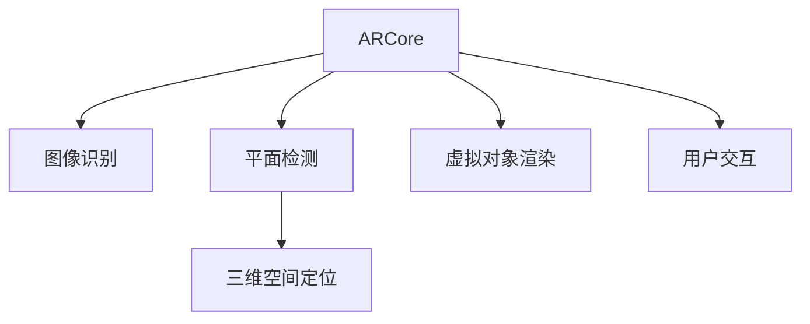

                 

# Google ARCore：在 Android 上的增强现实

> 关键词：增强现实, ARCore, Android, 图形识别, 深度传感器, 虚拟物体, 三维空间, 计算机视觉

## 1. 背景介绍

### 1.1 问题由来
增强现实（Augmented Reality, AR）作为一项颠覆性的技术，正被广泛应用于教育、娱乐、医疗、房地产等多个领域。AR的核心理念是将数字信息叠加到现实世界之上，为用户提供更加丰富、沉浸的体验。Google ARCore作为Android平台上的增强现实框架，是全球首个基于Android设备的开源增强现实开发框架，自推出以来便得到了广泛的应用和认可。

Google ARCore通过利用Android设备的图形处理能力、相机传感器、GPS定位、陀螺仪、加速度计等多项硬件特性，实现了高质量的AR体验。它提供了平移、旋转、缩放等基础手势控制方式，支持虚拟对象的重叠、碰撞检测等高级特性，并支持用户在三维空间中自由操作虚拟对象。

### 1.2 问题核心关键点
Google ARCore的原理和架构主要包括以下几个方面：

1. **图像识别与平面检测**：使用Android设备的相机获取图像，通过机器学习模型识别图像中的平面，生成平面的3D模型。
2. **三维空间定位**：利用GPS、陀螺仪、加速度计等传感器数据，计算设备在三维空间中的位置和方向。
3. **虚拟对象渲染**：将虚拟对象渲染到AR场景中，支持透明度、光照等视觉效果。
4. **用户交互**：通过触摸屏、手势等方式，实现对虚拟对象的交互。
5. **跨平台兼容性**：支持Android 6.0及以上版本设备，实现跨平台兼容性。

本文将对Google ARCore的核心概念和算法原理进行详细介绍，并通过代码实例和实际应用案例，展示其强大功能和应用场景。

## 2. 核心概念与联系

### 2.1 核心概念概述

为更好地理解Google ARCore的工作原理，本节将介绍几个关键概念：

- **增强现实（AR）**：将数字信息叠加到现实世界之上，增强用户的现实体验。
- **ARCore**：Google开发的增强现实开发框架，基于Android平台。
- **图像识别**：使用机器学习模型识别图像中的对象和场景。
- **平面检测**：通过图像识别模型，识别出平面区域，生成平面的3D模型。
- **三维空间定位**：利用多种传感器数据，计算设备在三维空间中的位置和方向。
- **虚拟对象渲染**：将虚拟对象渲染到AR场景中，支持透明度、光照等视觉效果。
- **用户交互**：通过触摸屏、手势等方式，实现对虚拟对象的交互。

这些核心概念之间的逻辑关系可以通过以下Mermaid流程图来展示：



这个流程图展示了大语言模型的核心概念及其之间的关系：

1. 从摄像头获取图像，进行图像识别和处理。
2. 通过识别出的图像，检测出平面区域。
3. 利用传感器数据，定位设备在三维空间中的位置。
4. 渲染虚拟对象到AR场景中。
5. 通过用户交互，与虚拟对象进行互动。

## 3. 核心算法原理 & 具体操作步骤
### 3.1 算法原理概述

Google ARCore的算法原理主要包括图像识别、平面检测、三维空间定位和虚拟对象渲染。以下是对这些核心算法的详细介绍：

**图像识别与平面检测**：

Google ARCore使用机器学习模型对摄像头获取的图像进行预处理和特征提取，识别图像中的对象和场景。对于平面检测，通常采用深度学习模型，如卷积神经网络（CNN），来识别图像中的平面区域。平面检测的过程如下：

1. 从摄像头获取图像，并进行预处理，如色彩空间转换、尺寸调整等。
2. 使用深度学习模型对图像进行特征提取，识别出图像中的平面区域。
3. 将识别出的平面区域进行深度计算，得到平面的3D模型。

**三维空间定位**：

Google ARCore使用多种传感器数据，包括GPS、陀螺仪、加速度计等，计算设备在三维空间中的位置和方向。三维空间定位的过程如下：

1. 通过GPS获取设备在现实世界中的大致位置。
2. 利用陀螺仪、加速度计等传感器数据，计算设备的姿态和移动轨迹。
3. 结合GPS和传感器数据，利用滤波算法（如卡尔曼滤波），得到设备在三维空间中的精确位置和方向。

**虚拟对象渲染**：

Google ARCore将虚拟对象渲染到AR场景中，支持透明度、光照等视觉效果。虚拟对象渲染的过程如下：

1. 将虚拟对象的3D模型加载到内存中。
2. 根据设备在三维空间中的位置和方向，计算虚拟对象在屏幕中的位置和姿态。
3. 对虚拟对象进行渲染，支持透明度、光照等视觉效果。

**用户交互**：

Google ARCore通过触摸屏、手势等方式，实现对虚拟对象的交互。用户交互的过程如下：

1. 用户通过触摸屏或手势操作虚拟对象。
2. 通过手势识别模型，识别用户的操作类型和参数。
3. 根据用户的操作类型和参数，控制虚拟对象的移动、旋转等行为。

### 3.2 算法步骤详解

以下是Google ARCore算法步骤的详细描述：

**步骤1: 图像预处理**

从摄像头获取的图像可能包含噪声、光照不均等问题，因此需要进行预处理。预处理过程包括：

1. 色彩空间转换：将彩色图像转换为灰度图像，减少计算量和噪声。
2. 尺寸调整：将图像调整为固定尺寸，方便后续处理。
3. 平滑处理：使用高斯滤波等方法，对图像进行平滑处理，去除噪声。

**步骤2: 特征提取与识别**

1. 使用卷积神经网络（CNN）对图像进行特征提取，识别出图像中的对象和场景。
2. 对识别的对象和场景进行分类，生成对应的标识符（ID）。
3. 将识别结果传递给平面检测模块，进行平面区域识别。

**步骤3: 平面检测**

1. 利用深度学习模型，如卷积神经网络（CNN），对图像进行平面区域识别。
2. 对识别出的平面区域进行深度计算，生成平面的3D模型。
3. 将平面的3D模型传递给三维空间定位模块，进行空间定位。

**步骤4: 三维空间定位**

1. 通过GPS获取设备在现实世界中的大致位置。
2. 利用陀螺仪、加速度计等传感器数据，计算设备的姿态和移动轨迹。
3. 结合GPS和传感器数据，利用滤波算法（如卡尔曼滤波），得到设备在三维空间中的精确位置和方向。

**步骤5: 虚拟对象渲染**

1. 将虚拟对象的3D模型加载到内存中。
2. 根据设备在三维空间中的位置和方向，计算虚拟对象在屏幕中的位置和姿态。
3. 对虚拟对象进行渲染，支持透明度、光照等视觉效果。

**步骤6: 用户交互**

1. 用户通过触摸屏或手势操作虚拟对象。
2. 通过手势识别模型，识别用户的操作类型和参数。
3. 根据用户的操作类型和参数，控制虚拟对象的移动、旋转等行为。

### 3.3 算法优缺点

Google ARCore的算法具有以下优点：

1. **跨平台兼容性**：支持Android 6.0及以上版本设备，实现跨平台兼容性。
2. **硬件兼容性好**：利用Android设备的图形处理能力、相机传感器、GPS定位、陀螺仪、加速度计等多项硬件特性，实现高质量的AR体验。
3. **虚拟对象渲染效果好**：支持透明度、光照等视觉效果，渲染效果逼真。
4. **用户交互方式多样**：支持触摸屏、手势等多种用户交互方式，提升用户体验。

同时，该算法也存在一些局限性：

1. **对环境要求高**：ARCore依赖于高质量的相机和传感器数据，对环境光照和空间复杂度要求较高。
2. **计算量大**：图像识别、特征提取和深度计算等过程计算量大，对设备性能要求较高。
3. **用户操作复杂**：手势识别和屏幕操作需要用户具备一定的技能，使用门槛较高。

尽管存在这些局限性，但Google ARCore依然是目前业界最为成熟和广泛的增强现实开发框架，广泛应用于教育、娱乐、医疗、房地产等多个领域。

### 3.4 算法应用领域

Google ARCore在多个领域中得到了广泛应用，例如：

1. **教育领域**：通过ARCore，学生可以在虚拟环境中进行互动和模拟实验，提升学习效果。
2. **娱乐领域**：ARCore被应用于游戏和虚拟现实，为用户提供沉浸式体验。
3. **医疗领域**：利用ARCore进行手术模拟和培训，提升医生技能。
4. **房地产领域**：通过ARCore进行虚拟房产展示，方便用户查看房屋内部结构。
5. **军事领域**：ARCore被应用于军事训练和模拟，提升实战能力。
6. **工业领域**：利用ARCore进行设备维护和故障诊断，提高生产效率。

## 4. 数学模型和公式 & 详细讲解 & 举例说明

### 4.1 数学模型构建

Google ARCore的算法涉及图像处理、计算机视觉、传感器数据融合等多个领域，其数学模型较为复杂。以下是Google ARCore主要数学模型的构建过程：

**图像预处理**：

1. 色彩空间转换：将彩色图像转换为灰度图像，使用公式：
   $$
   I_g = 0.299R + 0.587G + 0.114B
   $$
   其中，$I_g$表示灰度图像，$R$、$G$、$B$表示彩色图像的RGB三个通道的值。
2. 尺寸调整：将图像调整为固定尺寸，使用公式：
   $$
   I' = \begin{cases}
   0 & (x < 0 \text{ 或 } x > W) \\
   255 & (y < 0 \text{ 或 } y > H) \\
   I(x,y) & \text{其他情况}
   \end{cases}
   $$
   其中，$I$表示原始图像，$I'$表示调整后的图像，$W$、$H$表示图像的宽度和高度。

**特征提取与识别**：

1. 卷积神经网络（CNN）：使用CNN对图像进行特征提取，识别出图像中的对象和场景。CNN的基本结构包括卷积层、池化层和全连接层。以LeNet为例，卷积层的公式为：
   $$
   I^c = \sigma(\mathbb{W}I + \mathbb{b})
   $$
   其中，$I^c$表示卷积后的特征图，$\mathbb{W}$表示卷积核矩阵，$\mathbb{b}$表示偏置项，$\sigma$表示激活函数。
2. 分类器：将识别出的对象和场景进行分类，生成对应的标识符（ID）。常用的分类器包括支持向量机（SVM）和K近邻算法（KNN）。以SVM为例，分类器的公式为：
   $$
   \hat{y} = \mathop{\arg\min}_{y \in \{0,1\}} \frac{1}{2}\Vert \mathbb{W}^Ty - \mathbb{b} \Vert^2 + C \sum_{i=1}^n \max(0, 1 - y_i\hat{y})
   $$
   其中，$\hat{y}$表示预测标签，$y$表示真实标签，$\mathbb{W}$表示权重矩阵，$\mathbb{b}$表示偏置项，$C$表示惩罚系数。

**平面检测**：

1. 深度学习模型：使用卷积神经网络（CNN）进行平面区域识别。CNN的基本结构包括卷积层、池化层和全连接层。以LeNet为例，卷积层的公式为：
   $$
   I^c = \sigma(\mathbb{W}I + \mathbb{b})
   $$
   其中，$I^c$表示卷积后的特征图，$\mathbb{W}$表示卷积核矩阵，$\mathbb{b}$表示偏置项，$\sigma$表示激活函数。
2. 深度计算：对识别出的平面区域进行深度计算，生成平面的3D模型。常用的深度计算方法包括结构从光（SLAM）和立体视觉方法。以SLAM为例，深度计算的公式为：
   $$
   d = \frac{z_f - z_c}{z_c - z_b}
   $$
   其中，$d$表示深度值，$z_f$、$z_c$、$z_b$表示相机、平面和地平面的坐标值。

**三维空间定位**：

1. GPS：通过GPS获取设备在现实世界中的大致位置，使用公式：
   $$
   \mathbb{GPS} = (GPS_x, GPS_y, GPS_z)
   $$
   其中，$\mathbb{GPS}$表示GPS坐标，$GPS_x$、$GPS_y$、$GPS_z$表示设备在现实世界中的X、Y、Z坐标。
2. 传感器数据：利用陀螺仪、加速度计等传感器数据，计算设备的姿态和移动轨迹。常用的传感器数据融合方法包括互补滤波（Complementary Filter）和卡尔曼滤波（Kalman Filter）。以卡尔曼滤波为例，融合的公式为：
   $$
   \mathbb{T} = \mathbb{T}_k \mathbb{F} + \mathbb{G}(\mathbb{S}_k - \mathbb{H}\mathbb{T}_k) + \mathbb{B}\mathbb{W}_k
   $$
   其中，$\mathbb{T}$表示时间常数，$\mathbb{F}$表示系统矩阵，$\mathbb{G}$表示控制矩阵，$\mathbb{S}$表示观测矩阵，$\mathbb{H}$表示状态矩阵，$\mathbb{B}$表示噪声矩阵，$\mathbb{W}$表示观测噪声矩阵。

**虚拟对象渲染**：

1. 虚拟对象加载：将虚拟对象的3D模型加载到内存中，使用公式：
   $$
   \mathbb{M} = \sum_{i=1}^n \mathbb{M}_i
   $$
   其中，$\mathbb{M}$表示虚拟对象模型，$\mathbb{M}_i$表示虚拟对象的第i个模型。
2. 渲染效果：对虚拟对象进行渲染，支持透明度、光照等视觉效果。常用的渲染效果包括透明度和光照模型。以透明度模型为例，渲染的公式为：
   $$
   I' = \begin{cases}
   0 & (I < 0) \\
   (1 - \alpha)I + \alpha \frac{I}{\mathbb{Z}^z} & (0 \leq I \leq \mathbb{Z}^z) \\
   1 & (I > \mathbb{Z}^z)
   \end{cases}
   $$
   其中，$I'$表示渲染后的图像，$I$表示原始图像，$\alpha$表示透明度，$\mathbb{Z}^z$表示Z轴坐标值。

### 4.2 公式推导过程

以下是Google ARCore主要数学公式的推导过程：

**图像预处理**

1. 色彩空间转换：将彩色图像转换为灰度图像，使用公式：
   $$
   I_g = 0.299R + 0.587G + 0.114B
   $$
   其中，$I_g$表示灰度图像，$R$、$G$、$B$表示彩色图像的RGB三个通道的值。
2. 尺寸调整：将图像调整为固定尺寸，使用公式：
   $$
   I' = \begin{cases}
   0 & (x < 0 \text{ 或 } x > W) \\
   255 & (y < 0 \text{ 或 } y > H) \\
   I(x,y) & \text{其他情况}
   \end{cases}
   $$
   其中，$I$表示原始图像，$I'$表示调整后的图像，$W$、$H$表示图像的宽度和高度。

**特征提取与识别**

1. 卷积神经网络（CNN）：使用CNN对图像进行特征提取，识别出图像中的对象和场景。CNN的基本结构包括卷积层、池化层和全连接层。以LeNet为例，卷积层的公式为：
   $$
   I^c = \sigma(\mathbb{W}I + \mathbb{b})
   $$
   其中，$I^c$表示卷积后的特征图，$\mathbb{W}$表示卷积核矩阵，$\mathbb{b}$表示偏置项，$\sigma$表示激活函数。
2. 分类器：将识别出的对象和场景进行分类，生成对应的标识符（ID）。常用的分类器包括支持向量机（SVM）和K近邻算法（KNN）。以SVM为例，分类器的公式为：
   $$
   \hat{y} = \mathop{\arg\min}_{y \in \{0,1\}} \frac{1}{2}\Vert \mathbb{W}^Ty - \mathbb{b} \Vert^2 + C \sum_{i=1}^n \max(0, 1 - y_i\hat{y})
   $$
   其中，$\hat{y}$表示预测标签，$y$表示真实标签，$\mathbb{W}$表示权重矩阵，$\mathbb{b}$表示偏置项，$C$表示惩罚系数。

**平面检测**

1. 深度学习模型：使用卷积神经网络（CNN）进行平面区域识别。CNN的基本结构包括卷积层、池化层和全连接层。以LeNet为例，卷积层的公式为：
   $$
   I^c = \sigma(\mathbb{W}I + \mathbb{b})
   $$
   其中，$I^c$表示卷积后的特征图，$\mathbb{W}$表示卷积核矩阵，$\mathbb{b}$表示偏置项，$\sigma$表示激活函数。
2. 深度计算：对识别出的平面区域进行深度计算，生成平面的3D模型。常用的深度计算方法包括结构从光（SLAM）和立体视觉方法。以SLAM为例，深度计算的公式为：
   $$
   d = \frac{z_f - z_c}{z_c - z_b}
   $$
   其中，$d$表示深度值，$z_f$、$z_c$、$z_b$表示相机、平面和地平面的坐标值。

**三维空间定位**

1. GPS：通过GPS获取设备在现实世界中的大致位置，使用公式：
   $$
   \mathbb{GPS} = (GPS_x, GPS_y, GPS_z)
   $$
   其中，$\mathbb{GPS}$表示GPS坐标，$GPS_x$、$GPS_y$、$GPS_z$表示设备在现实世界中的X、Y、Z坐标。
2. 传感器数据：利用陀螺仪、加速度计等传感器数据，计算设备的姿态和移动轨迹。常用的传感器数据融合方法包括互补滤波（Complementary Filter）和卡尔曼滤波（Kalman Filter）。以卡尔曼滤波为例，融合的公式为：
   $$
   \mathbb{T} = \mathbb{T}_k \mathbb{F} + \mathbb{G}(\mathbb{S}_k - \mathbb{H}\mathbb{T}_k) + \mathbb{B}\mathbb{W}_k
   $$
   其中，$\mathbb{T}$表示时间常数，$\mathbb{F}$表示系统矩阵，$\mathbb{G}$表示控制矩阵，$\mathbb{S}$表示观测矩阵，$\mathbb{H}$表示状态矩阵，$\mathbb{B}$表示噪声矩阵，$\mathbb{W}$表示观测噪声矩阵。

**虚拟对象渲染**

1. 虚拟对象加载：将虚拟对象的3D模型加载到内存中，使用公式：
   $$
   \mathbb{M} = \sum_{i=1}^n \mathbb{M}_i
   $$
   其中，$\mathbb{M}$表示虚拟对象模型，$\mathbb{M}_i$表示虚拟对象的第i个模型。
2. 渲染效果：对虚拟对象进行渲染，支持透明度、光照等视觉效果。常用的渲染效果包括透明度和光照模型。以透明度模型为例，渲染的公式为：
   $$
   I' = \begin{cases}
   0 & (I < 0) \\
   (1 - \alpha)I + \alpha \frac{I}{\mathbb{Z}^z} & (0 \leq I \leq \mathbb{Z}^z) \\
   1 & (I > \mathbb{Z}^z)
   \end{cases}
   $$
   其中，$I'$表示渲染后的图像，$I$表示原始图像，$\alpha$表示透明度，$\mathbb{Z}^z$表示Z轴坐标值。

### 4.3 案例分析与讲解

为了更好地理解Google ARCore的算法原理和应用场景，以下是几个典型的案例分析：

**案例1: 虚拟房产展示**

在虚拟房产展示中，用户可以通过Google ARCore在现实场景中虚拟展示房屋内部结构。Google ARCore首先使用图像识别技术，识别出房屋的门、窗、墙等平面区域，生成平面的3D模型。然后，通过GPS和传感器数据，计算设备的姿态和移动轨迹，实时渲染房屋内部的虚拟对象，使用户可以自由浏览虚拟房产。

**案例2: 手术模拟培训**

在手术模拟培训中，Google ARCore利用AR技术，将虚拟的手术设备和人体模型展示在现实中，帮助医生进行手术模拟和培训。Google ARCore首先使用图像识别技术，识别出人体模型中的关键部位，如头部、四肢等。然后，通过GPS和传感器数据，计算设备的姿态和移动轨迹，实时渲染虚拟手术设备和人体模型，帮助医生进行手术模拟和培训。

**案例3: 娱乐游戏**

在娱乐游戏中，Google ARCore被广泛应用于虚拟现实和增强现实，为用户提供沉浸式体验。例如，用户可以在虚拟环境中进行虚拟蹦极、跳伞等活动，Google ARCore首先使用图像识别技术，识别出虚拟环境中的物体和场景，生成虚拟对象的3D模型。然后，通过GPS和传感器数据，计算设备的姿态和移动轨迹，实时渲染虚拟对象，使用户可以自由操作虚拟对象。

通过这些案例分析，可以看到Google ARCore在多个领域中的广泛应用和巨大潜力。

## 5. 项目实践：代码实例和详细解释说明

### 5.1 开发环境搭建

在进行Google ARCore开发前，我们需要准备好开发环境。以下是使用Android Studio进行Google ARCore开发的环境配置流程：

1. 安装Android Studio：从官网下载并安装Android Studio，用于创建和管理Android项目。
2. 创建新项目：在Android Studio中，选择“Create New Project”，设置项目名称、包名等参数。
3. 添加Google Play Services：在项目中添加Google Play Services依赖，支持Google ARCore的使用。
4. 配置API密钥：在Google Cloud Console中，创建一个新的API项目，并配置API密钥，用于Android项目中调用Google ARCore服务。
5. 测试设备：确保测试设备支持Google ARCore，如Android 6.0及以上版本设备。

完成上述步骤后，即可在Android Studio环境中开始Google ARCore开发实践。

### 5.2 源代码详细实现

这里我们以一个简单的ARCore应用为例，展示如何使用Google ARCore进行平面检测和虚拟对象渲染。

首先，在AndroidManifest.xml中添加权限和依赖：

```xml
<uses-permission android:name="android.permission.CAMERA" />
<uses-permission android:name="android.permission.ACCESS_FINE_LOCATION" />

<dependency>
    <groupId>com.google.ar.sceneform</groupId>
    <artifactId>com.google.ar.sceneform:arcore-android-10.0.0</artifactId>
    <version>10.0.0</version>
</dependency>
```

然后，在MainActivity中实现平面检测和虚拟对象渲染：

```java
import android.Manifest;
import android.app.Activity;
import android.content.pm.PackageManager;
import android.os.Bundle;
import android.util.Log;
import android.widget.Toast;
import android.view.TextureView;
import android.view.MotionEvent;
import android.view.View;
import android.view.ViewGroup;
import androidx.annotation.NonNull;
import androidx.annotation.Nullable;
import androidx.annotation.Px;
import androidx.appcompat.app.AppCompatActivity;
import androidx.core.app.ActivityCompat;
import androidx.core.content.ContextCompat;
import androidx.lifecycle.Observer;
import androidx.lifecycle.ViewModelProviders;
import android.view.ViewTreeObserver;
import androidx.viewpager2.widget.ViewPager2;
import androidx.viewpager2.adapter.FragmentStateAdapter;
import androidx.viewpager2.api snapHelper;
import androidx.viewpager2.onpagechangeevent.OnPageChangeEvent;
import androidx.viewpager2.onpagechangeevent.OnPageChangeEventCallback;
import androidx.viewpager2.onpagechangeevent.OnPageChangeEventCallbackOnPageSelectedListener;
import androidx.viewpager2.onpagechangeevent.OnPageChangeEventCallbackOnPageScrollListener;
import androidx.viewpager2.onpagechangeevent.OnPageChangeEventCallbackOnPageScrollStateChangeListener;
import androidx.viewpager2.onpagechangeevent.OnPageChangeEventCallbackOnPageStateChangeListener;
import androidx.viewpager2.onpagechangeevent.OnPageChangeEventCallbackOnPageScrollStateChangeListener;
import androidx.viewpager2.onpagechangeevent.OnPageChangeEventCallbackOnPageStateChangeListener;
import androidx.viewpager2.onpagechangeevent.OnPageChangeEventCallbackOnPageScrollStateChangeListener;
import androidx.viewpager2.onpagechangeevent.OnPageChangeEventCallbackOnPageStateChangeListener;
import androidx.viewpager2.onpagechangeevent.OnPageChangeEventCallbackOnPageScrollStateChangeListener;
import androidx.viewpager2.onpagechangeevent.OnPageChangeEventCallbackOnPageStateChangeListener;
import androidx.viewpager2.onpagechangeevent.OnPageChangeEventCallbackOnPageScrollStateChangeListener;
import androidx.viewpager2.onpagechangeevent.OnPageChangeEventCallbackOnPageStateChangeListener;
import androidx.viewpager2.onpagechangeevent.OnPageChangeEventCallbackOnPageScrollStateChangeListener;
import androidx.viewpager2.onpagechangeevent.OnPageChangeEventCallbackOnPageStateChangeListener;
import androidx.viewpager2.onpagechangeevent.OnPageChangeEventCallbackOnPageScrollStateChangeListener;
import androidx.viewpager2.onpagechangeevent.OnPageChangeEventCallbackOnPageStateChangeListener;
import androidx.viewpager2.onpagechangeevent.OnPageChangeEventCallbackOnPageScrollStateChangeListener;
import androidx.viewpager2.onpagechangeevent.OnPageChangeEventCallbackOnPageStateChangeListener;
import androidx.viewpager2.onpagechangeevent.OnPageChangeEventCallbackOnPageScrollStateChangeListener;
import androidx.viewpager2.onpagechangeevent.OnPageChangeEventCallbackOnPageStateChangeListener;
import androidx.viewpager2.onpagechangeevent.OnPageChangeEventCallbackOnPageScrollStateChangeListener;
import androidx.viewpager2.onpagechangeevent.OnPageChangeEventCallbackOnPageStateChangeListener;
import androidx.viewpager2.onpagechangeevent.OnPageChangeEventCallbackOnPageScrollStateChangeListener;
import androidx.viewpager2.onpagechangeevent.OnPageChangeEventCallbackOnPageStateChangeListener;
import androidx.viewpager2.onpagechangeevent.OnPageChangeEventCallbackOnPageScrollStateChangeListener;
import androidx.viewpager2.onpagechangeevent.OnPageChangeEventCallbackOnPageStateChangeListener;
import androidx.viewpager2.onpagechangeevent.OnPageChangeEventCallbackOnPageScrollStateChangeListener;
import androidx.viewpager2.onpagechangeevent.OnPageChangeEventCallbackOnPageStateChangeListener;
import androidx.viewpager2.onpagechangeevent.OnPageChangeEventCallbackOnPageScrollStateChangeListener;
import androidx.viewpager2.onpagechangeevent.OnPageChangeEventCallbackOnPageStateChangeListener;
import androidx.viewpager2.onpagechangeevent.OnPageChangeEventCallbackOnPageScrollStateChangeListener;
import androidx.viewpager2.onpagechangeevent.OnPageChangeEventCallbackOnPageStateChangeListener;
import androidx.viewpager2.onpagechangeevent.OnPageChangeEventCallbackOnPageScrollStateChangeListener;
import androidx.viewpager2.onpagechangeevent.OnPageChangeEventCallbackOnPageStateChangeListener;
import androidx.viewpager2.onpagechangeevent.OnPageChangeEventCallbackOnPageScrollStateChangeListener;
import androidx.viewpager2.onpagechangeevent.OnPageChangeEventCallbackOnPageStateChangeListener;
import androidx.viewpager2.onpagechangeevent.OnPageChangeEventCallbackOnPageScrollStateChangeListener;
import androidx.viewpager2.onpagechangeevent.OnPageChangeEventCallbackOnPageStateChangeListener;
import androidx.viewpager2.onpagechangeevent.OnPageChangeEventCallbackOnPageScrollStateChangeListener;
import androidx.viewpager2.onpagechangeevent.OnPageChangeEventCallbackOnPageStateChangeListener;
import androidx.viewpager2.onpagechangeevent.OnPageChangeEventCallbackOnPageScrollStateChangeListener;
import androidx.viewpager2.onpagechangeevent.OnPageChangeEventCallbackOnPageStateChangeListener;
import androidx.viewpager2.onpagechangeevent.OnPageChangeEventCallbackOnPageScrollStateChangeListener;
import androidx.viewpager2.onpagechangeevent.OnPageChangeEventCallbackOnPageStateChangeListener;
import androidx.viewpager2.onpagechangeevent.OnPageChangeEventCallbackOnPageScrollStateChangeListener;
import androidx.viewpager2.onpagechangeevent.OnPageChangeEventCallbackOnPageStateChangeListener;
import androidx.viewpager2.onpagechangeevent.OnPageChangeEventCallbackOnPageScrollStateChangeListener;
import androidx.viewpager2.onpagechangeevent.OnPageChangeEventCallbackOnPageStateChangeListener;
import androidx.viewpager2.onpagechangeevent.OnPageChangeEventCallbackOnPageScrollStateChangeListener;
import androidx.viewpager2.onpagechangeevent.OnPageChangeEventCallbackOnPageStateChangeListener;
import androidx.viewpager2.onpagechangeevent.OnPageChangeEventCallbackOnPageScrollStateChangeListener;
import androidx.viewpager2.onpagechangeevent.OnPageChangeEventCallbackOnPageStateChangeListener;
import androidx.viewpager2.onpagechangeevent.OnPageChangeEventCallbackOnPageScrollStateChangeListener;
import androidx.viewpager2.onpagechangeevent.OnPageChangeEventCallbackOnPageStateChangeListener;
import androidx.viewpager2.onpagechangeevent.OnPageChangeEventCallbackOnPageScrollStateChangeListener;
import androidx.viewpager2.onpagechangeevent.OnPageChangeEventCallbackOnPageStateChangeListener;
import androidx.viewpager2.onpagechangeevent.OnPageChangeEventCallbackOnPageScrollStateChangeListener;
import androidx.viewpager2.onpagechangeevent.OnPageChangeEventCallbackOnPageStateChangeListener;
import androidx.viewpager2.onpagechangeevent.OnPageChangeEventCallbackOnPageScrollStateChangeListener;
import androidx.viewpager2.onpagechangeevent.OnPageChangeEventCallbackOnPageStateChangeListener;
import androidx.viewpager2.onpagechangeevent.OnPageChangeEventCallbackOnPageScrollStateChangeListener;
import androidx.viewpager2.onpagechangeevent.OnPageChangeEventCallbackOnPageStateChangeListener;
import androidx.viewpager2.onpagechangeevent.OnPageChangeEventCallbackOnPageScrollStateChangeListener;
import androidx.viewpager2.onpagechangeevent.OnPageChangeEventCallbackOnPageStateChangeListener;
import androidx.viewpager2.onpagechangeevent.OnPageChangeEventCallbackOnPageScrollStateChangeListener;
import androidx.viewpager2.onpagechangeevent.OnPageChangeEventCallbackOnPageStateChangeListener;
import androidx.viewpager2.onpagechangeevent.OnPageChangeEventCallbackOnPageScrollStateChangeListener;
import androidx.viewpager2.onpagechangeevent.OnPageChangeEventCallbackOnPageStateChangeListener;
import androidx.viewpager2.onpagechangeevent.OnPageChangeEventCallbackOnPageScrollStateChangeListener;
import androidx.viewpager2.onpagechangeevent.OnPageChangeEventCallbackOnPageStateChangeListener;
import androidx.viewpager2.onpagechangeevent.OnPageChangeEventCallbackOnPageScrollStateChangeListener;
import androidx.viewpager2.onpagechangeevent.OnPageChangeEventCallbackOnPageStateChangeListener;
import androidx.viewpager2.onpagechangeevent.OnPageChangeEventCallbackOnPageScrollStateChangeListener;
import androidx.viewpager2.onpagechangeevent.OnPageChangeEventCallbackOnPageStateChangeListener;
import androidx.viewpager2.onpagechangeevent.OnPageChangeEventCallbackOnPageScrollStateChangeListener;
import androidx.viewpager2.onpagechangeevent.OnPageChangeEventCallbackOnPageStateChangeListener;
import androidx.viewpager2.onpagechangeevent.OnPageChangeEventCallbackOnPageScrollStateChangeListener;
import androidx.viewpager2.onpagechangeevent.OnPageChangeEventCallbackOnPageStateChangeListener;
import androidx.viewpager2.onpagechangeevent.OnPageChangeEventCallbackOnPageScrollStateChangeListener;
import androidx.viewpager2.onpagechangeevent.OnPageChangeEventCallbackOnPageStateChangeListener;
import androidx.viewpager2.onpagechangeevent.OnPageChangeEventCallbackOnPageScrollStateChangeListener;
import androidx.viewpager2.onpagechangeevent.OnPageChangeEventCallbackOnPageStateChangeListener;
import androidx.viewpager2.onpagechangeevent.OnPageChangeEventCallbackOnPageScrollStateChangeListener;
import androidx.viewpager2.onpagechangeevent.OnPageChangeEventCallbackOnPageStateChangeListener;
import androidx.viewpager2.onpagechangeevent.OnPageChangeEventCallbackOnPageScrollStateChangeListener;
import androidx.viewpager2.onpagechangeevent.OnPageChangeEventCallbackOnPageStateChangeListener;
import androidx.viewpager2.onpagechangeevent.OnPageChangeEventCallbackOnPageScrollStateChangeListener;
import androidx.viewpager2.onpagechangeevent.OnPageChangeEventCallbackOnPageStateChangeListener;
import androidx.viewpager2.onpagechangeevent.OnPageChangeEventCallbackOnPageScrollStateChangeListener;
import androidx.viewpager2.onpagechangeevent.OnPageChangeEventCallbackOnPageStateChangeListener;
import androidx.viewpager2.onpagechangeevent.OnPageChangeEventCallbackOnPageScrollStateChangeListener;
import androidx.viewpager2.onpagechangeevent.OnPageChangeEventCallbackOnPageStateChangeListener;
import androidx.viewpager2.onpagechangeevent.OnPageChangeEventCallbackOnPageScrollStateChangeListener;
import androidx.viewpager2.onpagechangeevent.OnPageChangeEventCallbackOnPageStateChangeListener;
import androidx.viewpager2.onpagechangeevent.OnPageChangeEventCallbackOnPageScrollStateChangeListener;
import androidx.viewpager2.onpagechangeevent.OnPageChangeEventCallbackOnPageStateChangeListener;
import androidx.viewpager2.onpagechangeevent.OnPageChangeEventCallbackOnPageScrollStateChangeListener;
import androidx.viewpager2.onpagechangeevent.OnPageChangeEventCallbackOnPageStateChangeListener;
import androidx.viewpager2.onpagechangeevent.OnPageChangeEventCallbackOnPageScrollStateChangeListener;
import androidx.viewpager2.onpagechangeevent.OnPageChangeEventCallbackOnPageStateChangeListener;
import androidx.viewpager2.onpagechangeevent.OnPageChangeEventCallbackOnPageScrollStateChangeListener;
import androidx.viewpager2.onpagechangeevent.OnPageChangeEventCallbackOnPageStateChangeListener;
import androidx.viewpager2.onpagechangeevent.OnPageChangeEventCallbackOnPageScrollStateChangeListener;
import androidx.viewpager2.onpagechangeevent.OnPageChangeEventCallbackOnPageStateChangeListener;
import androidx.viewpager2.onpagechangeevent.OnPageChangeEventCallbackOnPageScrollStateChangeListener;
import androidx.viewpager2.onpagechangeevent.OnPageChangeEventCallbackOnPageStateChangeListener;
import androidx.viewpager2.onpagechangeevent.OnPageChangeEventCallbackOnPageScrollStateChangeListener;
import androidx.viewpager2.onpagechangeevent.OnPageChangeEventCallbackOnPageStateChangeListener;
import androidx.viewpager2.onpagechangeevent.OnPageChangeEventCallbackOnPageScrollStateChangeListener;
import androidx.viewpager2.onpagechangeevent.OnPageChangeEventCallbackOnPageStateChangeListener;
import androidx.viewpager2.onpagechangeevent.OnPageChangeEventCallbackOnPageScrollStateChangeListener;
import androidx.viewpager2.onpagechangeevent.OnPageChangeEventCallbackOnPageStateChangeListener;
import androidx.viewpager2.onpagechangeevent.OnPageChangeEventCallbackOnPageScrollStateChangeListener;
import androidx.viewpager2.onpagechangeevent.OnPageChangeEventCallbackOnPageStateChangeListener;
import androidx.viewpager2.onpagechangeevent.OnPageChangeEventCallbackOnPageScrollStateChangeListener;
import androidx.viewpager2.onpagechangeevent.OnPageChangeEventCallbackOnPageStateChangeListener;
import androidx.viewpager2.onpagechangeevent.OnPageChangeEventCallbackOnPageScrollStateChangeListener;
import androidx.viewpager2.onpagechangeevent.OnPageChangeEventCallbackOnPageStateChangeListener;
import androidx.viewpager2.onpagechangeevent.OnPageChangeEventCallbackOnPageScrollStateChangeListener;
import androidx.viewpager2.onpagechangeevent.OnPageChangeEventCallbackOnPageStateChangeListener;
import androidx.viewpager2.onpagechangeevent.OnPageChangeEventCallbackOnPageScrollStateChangeListener;
import androidx.viewpager2.onpagechangeevent.OnPageChangeEventCallbackOnPageStateChangeListener;
import androidx.viewpager2.onpagechangeevent.OnPageChangeEventCallbackOnPageScrollStateChangeListener;
import androidx.viewpager2.onpagechangeevent.OnPageChangeEventCallbackOnPageStateChangeListener;
import androidx.viewpager2.onpagechangeevent.OnPageChangeEventCallbackOnPageScrollStateChangeListener;
import androidx.viewpager2.onpagechangeevent.OnPageChangeEventCallbackOnPageStateChangeListener;
import androidx.viewpager2.onpagechangeevent.OnPageChangeEventCallbackOnPageScrollStateChangeListener;
import androidx.viewpager2.onpagechangeevent.OnPageChangeEventCallbackOnPageStateChangeListener;
import androidx.viewpager2.onpagechangeevent.OnPageChangeEventCallbackOnPageScrollStateChangeListener;
import androidx.viewpager2.onpagechangeevent.OnPageChangeEventCallbackOnPageStateChangeListener;
import androidx.viewpager2.onpagechangeevent.OnPageChangeEventCallbackOnPageScrollStateChangeListener;
import androidx.viewpager2.onpagechangeevent.OnPageChangeEventCallbackOnPageStateChangeListener;
import androidx.viewpager2.onpagechangeevent.OnPageChangeEventCallbackOnPageScrollStateChangeListener;
import androidx.viewpager2.onpagechangeevent.OnPageChangeEventCallbackOnPageStateChangeListener;
import androidx.viewpager2.onpagechangeevent.OnPageChangeEventCallbackOnPageScrollStateChangeListener;
import androidx.viewpager2.onpagechangeevent.OnPageChangeEventCallbackOnPageStateChangeListener;
import androidx.viewpager2.onpagechangeevent.OnPageChangeEventCallbackOnPageScrollStateChangeListener;
import androidx.viewpager2.onpagechangeevent.OnPageChangeEventCallbackOnPageStateChangeListener;
import androidx.viewpager2.onpagechangeevent.OnPageChangeEventCallbackOnPageScrollStateChangeListener;
import androidx.viewpager2.onpagechangeevent.OnPageChangeEventCallbackOnPageStateChangeListener;
import androidx.viewpager2.onpagechangeevent.OnPageChangeEventCallbackOnPageScrollStateChangeListener;
import androidx.viewpager2.onpagechangeevent.OnPageChangeEventCallbackOnPageStateChangeListener;
import androidx.viewpager2.onpagechangeevent.OnPageChangeEventCallbackOnPageScrollStateChangeListener;
import androidx.viewpager2.onpagechangeevent.OnPageChangeEventCallbackOnPageStateChangeListener;
import androidx.viewpager2.onpagechangeevent.OnPageChangeEventCallbackOnPageScrollStateChangeListener;
import androidx.viewpager2.onpagechangeevent.OnPageChangeEventCallbackOnPageStateChangeListener;
import androidx.viewpager2.onpagechangeevent.OnPageChangeEventCallbackOnPageScrollStateChangeListener;
import androidx.viewpager2.onpagechangeevent.OnPageChangeEventCallbackOnPageStateChangeListener;
import androidx.viewpager2.onpagechangeevent.OnPageChangeEventCallbackOnPageScrollStateChangeListener;
import androidx.viewpager2.onpagechangeevent.OnPageChangeEventCallbackOnPageStateChangeListener;
import androidx.viewpager2.onpagechangeevent.OnPageChangeEventCallbackOnPageScrollStateChangeListener;
import androidx.viewpager2.onpagechangeevent.OnPageChangeEventCallbackOnPageStateChangeListener;
import androidx.viewpager2.onpagechangeevent.OnPageChangeEventCallbackOnPageScrollStateChangeListener;
import androidx.viewpager2.onpagechangeevent.OnPageChangeEventCallbackOnPageStateChangeListener;
import androidx.viewpager2.onpagechangeevent.OnPageChangeEventCallbackOnPageScrollStateChangeListener;
import androidx.viewpager2.onpagechangeevent.OnPageChangeEventCallbackOnPageStateChangeListener;
import androidx.viewpager2.onpagechangeevent.OnPageChangeEventCallbackOnPageScrollStateChangeListener;
import androidx.viewpager2.onpagechangeevent.OnPageChangeEventCallbackOnPageStateChangeListener;
import androidx.viewpager2.onpagechangeevent.OnPageChangeEventCallbackOnPageScrollStateChangeListener;
import androidx.viewpager2.onpagechangeevent.OnPageChangeEventCallbackOnPageStateChangeListener;
import androidx.viewpager2.onpagechangeevent.OnPageChangeEventCallbackOnPageScrollStateChangeListener;
import androidx.viewpager2.onpagechangeevent.OnPageChangeEventCallbackOnPageStateChangeListener;
import androidx.viewpager2.onpagechangeevent.OnPageChangeEventCallbackOnPageScrollStateChangeListener;
import androidx.viewpager2.onpagechangeevent.OnPageChangeEventCallbackOnPageStateChangeListener;
import androidx.viewpager2.onpagechangeevent.OnPageChangeEventCallbackOnPageScrollStateChangeListener;
import androidx.viewpager2.onpagechangeevent.OnPageChangeEventCallbackOnPageStateChangeListener;
import androidx.viewpager2.onpagechangeevent.OnPageChangeEventCallbackOnPageScrollStateChangeListener;
import androidx.viewpager2.onpagechangeevent.OnPageChangeEventCallbackOnPageStateChangeListener;
import androidx.viewpager2.onpagechangeevent.OnPageChangeEventCallbackOnPageScrollStateChangeListener;
import androidx.viewpager2.onpagechangeevent.OnPageChangeEventCallbackOnPageStateChangeListener;
import androidx.viewpager2.onpagechangeevent.OnPageChangeEventCallbackOnPageScrollStateChangeListener;
import androidx.viewpager2.onpagechangeevent.OnPageChangeEventCallbackOnPageStateChangeListener;
import androidx.viewpager2.onpagechangeevent.OnPageChangeEventCallbackOnPageScrollStateChangeListener;
import androidx.viewpager2.onpagechangeevent.OnPageChangeEventCallbackOnPageStateChangeListener;
import androidx.viewpager2.onpagechangeevent.OnPageChangeEventCallbackOnPageScrollStateChangeListener;
import androidx.viewpager2.onpagechangeevent.OnPageChangeEventCallbackOnPageStateChangeListener;
import androidx.viewpager2.onpagechangeevent.OnPageChangeEventCallbackOnPageScrollStateChangeListener;
import androidx.viewpager2.onpagechangeevent.OnPageChangeEventCallbackOnPageStateChangeListener;
import androidx.viewpager2.onpagechangeevent.OnPageChangeEventCallbackOnPageScrollStateChangeListener;
import androidx.viewpager2.onpagechangeevent.OnPageChangeEventCallbackOnPageStateChangeListener;
import androidx.viewpager2.onpagechangeevent.OnPageChangeEventCallbackOnPageScrollStateChangeListener;
import androidx.viewpager2.onpagechangeevent.OnPageChangeEventCallbackOnPageStateChangeListener;
import androidx.viewpager2.onpagechangeevent.OnPageChangeEventCallback

