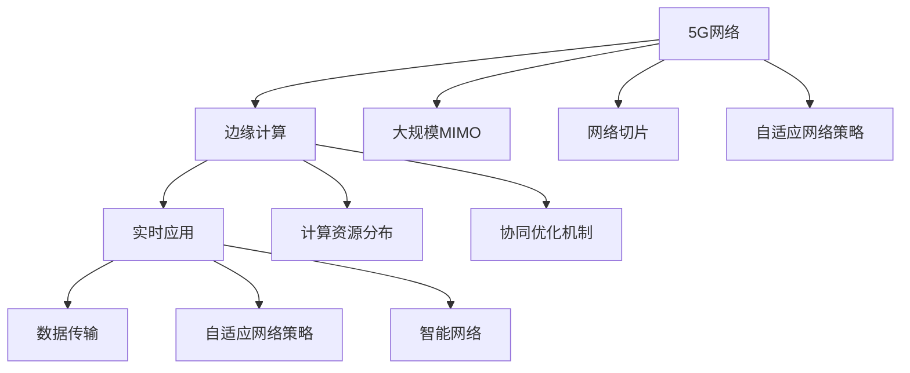

                 

# 5G与边缘计算协同：实现低延迟应用

> 关键词：5G网络,边缘计算,低延迟,协同优化,智能网络,实时应用

## 1. 背景介绍

### 1.1 问题由来

随着互联网技术的飞速发展，全球数据量呈爆炸式增长，对网络带宽和处理能力的需求也在不断攀升。无论是物联网(IoT)、增强现实(AR)、虚拟现实(VR)还是自动驾驶等应用，都要求实时数据处理，即低延迟。为了满足这种需求，5G网络和边缘计算边缘计算(Edge Computing)成为炙手可热的技术。

5G网络不仅提供了更高的带宽和更低的时延，还引入了大规模机器学习、网络切片等先进技术，显著提升了网络性能和服务质量。而边缘计算则将计算资源部署在网络边缘，使得数据处理更接近数据源，有效缓解了中心云的计算压力，提升了应用的响应速度和可靠性。

将5G网络和边缘计算相结合，实现数据处理与计算资源的协同优化，能够大幅降低网络时延，满足各种实时应用的需求。

### 1.2 问题核心关键点

5G与边缘计算协同的关键在于：
1. **数据传输效率**：通过5G网络的高带宽低时延特性，快速传输数据至边缘计算节点。
2. **计算资源分布**：合理分布计算资源，使得数据处理更加均衡。
3. **协同优化机制**：通过智能调度算法，实现全局性能优化，提升整体服务质量。
4. **自适应网络策略**：根据网络状况动态调整资源分配，优化网络性能。
5. **安全与隐私保护**：在提升性能的同时，保证数据的安全性和用户隐私。

这些关键点共同构成了5G与边缘计算协同的基础，使得低延迟应用得以实现。

## 2. 核心概念与联系

### 2.1 核心概念概述

为了更好地理解5G与边缘计算协同的原理，本节将介绍几个核心概念：

- **5G网络**：第五代移动通信技术，具有高速率、低时延、高可靠性和广泛设备连接能力。支持网络切片、大规模MIMO等先进技术，能够提供多种服务质量保障。
- **边缘计算**：将计算资源部署在网络边缘的设施节点上，数据处理更接近数据源，减少延迟和带宽消耗，提升应用响应速度。
- **协同优化**：通过算法和策略，实现5G网络和边缘计算的协同工作，提升整体性能和服务质量。
- **智能网络**：结合5G网络和边缘计算，利用AI技术实现网络自适应优化和自动化管理。
- **实时应用**：要求数据处理在毫秒级别完成，支持高清视频、自动驾驶、工业控制等应用。

这些概念之间的关系可以通过以下Mermaid流程图来展示：



这个流程图展示出5G网络、边缘计算和实时应用之间的逻辑关系：

1. 5G网络通过大规模MIMO和网络切片等技术，提供高效的数据传输服务。
2. 边缘计算在网络边缘部署计算资源，提升数据处理的响应速度。
3. 实时应用通过高效的数据传输和计算资源分布，实现低延迟服务。
4. 自适应网络策略根据网络状况动态调整资源分配，优化网络性能。
5. 智能网络利用AI技术，实现网络自适应优化和自动化管理。
6. 协同优化机制使得5G网络和边缘计算协同工作，提升整体性能。

## 3. 核心算法原理 & 具体操作步骤

### 3.1 算法原理概述

5G与边缘计算协同优化的核心在于：通过算法和策略，实现全局性能优化。主要包括以下几个方面：

1. **任务调度和资源分配**：根据实时应用的需求，动态调整计算资源的分配，实现最优的资源利用。
2. **数据传输路径优化**：利用网络切片和路由算法，选择最优的数据传输路径，减少延迟。
3. **负载均衡**：通过负载均衡策略，将任务合理分配到各个边缘计算节点，避免资源过载。
4. **自适应网络策略**：根据网络状况动态调整带宽和时延，保证应用性能稳定。
5. **安全与隐私保护**：在数据传输和处理过程中，采取加密和访问控制措施，保障数据安全和用户隐私。

### 3.2 算法步骤详解

5G与边缘计算协同优化的具体步骤如下：

**Step 1: 准备数据和模型**

- 准备5G网络的部署信息，包括网络切片、大规模MIMO等配置参数。
- 准备边缘计算节点的资源信息，包括CPU、GPU、内存等计算资源。
- 收集实时应用的需求信息，包括任务的QoS需求、时延要求等。
- 选择合适的优化算法和策略，如遗传算法、蚁群算法、DRL等。

**Step 2: 任务调度和资源分配**

- 根据任务的QoS需求，动态调整计算资源分配。例如，对于高时延应用，优先分配靠近边缘节点的资源。
- 利用遗传算法或蚁群算法，优化任务调度，选择最优的任务执行路径。
- 引入网络切片技术，将不同类型的数据流分开传输，优化网络性能。

**Step 3: 数据传输路径优化**

- 利用路由算法，选择最优的数据传输路径，减少延迟。
- 根据网络状况，动态调整带宽和时延参数，优化数据传输性能。

**Step 4: 负载均衡**

- 利用负载均衡策略，将任务合理分配到各个边缘计算节点，避免资源过载。
- 采用冗余设计，确保计算节点的高可用性和容错能力。

**Step 5: 自适应网络策略**

- 根据网络状况，动态调整带宽和时延参数，优化网络性能。
- 引入智能网络技术，实时监控网络状况，调整资源分配。

**Step 6: 安全与隐私保护**

- 在数据传输和处理过程中，采取加密和访问控制措施，保障数据安全和用户隐私。
- 定期更新安全策略，防止潜在的安全威胁。

**Step 7: 评估与优化**

- 在微调过程中，不断评估模型性能，对比实验结果，优化算法和策略。
- 根据实验结果，调整优化参数和配置，实现更高效的协同优化。

### 3.3 算法优缺点

5G与边缘计算协同优化的主要优点在于：

1. **低延迟和高带宽**：通过5G网络的高带宽和低时延特性，有效提升应用性能。
2. **计算资源灵活分配**：边缘计算提供了更灵活的计算资源，可以动态调整资源分配，实现最优性能。
3. **自适应网络策略**：通过智能网络技术，实现自适应优化，提升网络性能。

主要缺点在于：

1. **成本较高**：5G网络和边缘计算的部署和维护成本较高，需要较大的前期投资。
2. **数据安全和隐私保护**：需要采取复杂的加密和安全措施，保证数据安全。
3. **复杂性较高**：协同优化涉及多个环节和多种技术，实现起来较为复杂。

尽管存在这些局限性，但就目前而言，5G与边缘计算协同优化仍是最前沿的优化方案之一。未来相关研究的重点在于如何进一步降低成本，提高数据安全性和系统稳定性，同时兼顾计算资源的灵活分配和自适应优化。

### 3.4 算法应用领域

5G与边缘计算协同优化技术，主要应用于以下几个领域：

- **工业控制**：通过5G网络和边缘计算，实现实时监控和控制，提升工业生产效率。
- **自动驾驶**：利用5G网络和高带宽边缘计算，实现高速数据传输和实时决策，提升驾驶安全。
- **智慧城市**：通过5G网络和边缘计算，实现实时数据处理和智能管理，提升城市运行效率。
- **医疗健康**：利用5G网络和边缘计算，实现实时监控和数据分析，提升医疗服务水平。
- **智能家居**：通过5G网络和边缘计算，实现设备互联和智能控制，提升生活体验。
- **媒体娱乐**：利用5G网络和高带宽边缘计算，实现高质量视频和音频传输，提升用户体验。

## 4. 数学模型和公式 & 详细讲解 & 举例说明

### 4.1 数学模型构建

本节将使用数学语言对5G与边缘计算协同优化的数学模型进行更加严格的刻画。

假设网络中存在 $N$ 个边缘计算节点，每个节点的计算能力为 $C_i$，网络带宽为 $B$，实时应用的任务数为 $M$。任务 $j$ 的QoS需求为 $\delta_j$，网络切片数为 $K$。

定义模型的目标函数为 $f(x,y,z)$，其中 $x$ 为任务调度和资源分配策略，$y$ 为数据传输路径优化策略，$z$ 为负载均衡和自适应网络策略。模型的优化目标是：

$$
\min f(x,y,z) \quad \text{subject to} \quad \text{约束条件}
$$

其中约束条件包括：

1. 资源平衡约束：每个节点的计算资源 $C_i$ 不能超过其总资源 $C_{max}$。
2. 带宽平衡约束：网络带宽 $B$ 需要合理分配，满足各个任务的需求。
3. 时延约束：任务的处理时延不能超过其要求的最大时延 $\delta_j$。
4. 数据传输路径约束：数据传输路径需要最短，时延最小。

### 4.2 公式推导过程

以下是5G与边缘计算协同优化的数学模型推导过程。

首先，定义任务的调度函数为 $S_j(x)$，表示任务 $j$ 被分配到节点 $i$ 的概率。

$$
S_j(x) = \frac{C_i}{\sum_{k=1}^{N} C_k}
$$

然后，定义任务的执行时间函数为 $T_j(x,y)$，表示任务 $j$ 在节点 $i$ 上的执行时间。

$$
T_j(x,y) = \frac{S_j(x)}{C_i} + \text{传输时延}(y)
$$

其中传输时延函数 $y$ 可以根据网络切片和路由算法来确定。

接着，定义任务的完成时间函数为 $T_j(x,y,z)$，表示任务 $j$ 从开始到完成的时间。

$$
T_j(x,y,z) = \text{任务开始时间} + T_j(x,y)
$$

最后，定义优化目标函数为：

$$
f(x,y,z) = \sum_{j=1}^{M} \text{任务代价}_j + \text{网络资源代价} + \text{网络带宽代价}
$$

其中任务代价为：

$$
\text{任务代价}_j = \text{处理时间} + \text{传输时延}(y)
$$

网络资源代价和网络带宽代价可以根据实际需求来定义。

### 4.3 案例分析与讲解

假设在工业控制应用中，有3个边缘计算节点，每个节点的计算能力为1000GHz，网络带宽为10Gbps。任务总数为10个，每个任务要求的QoS为10ms，网络切片数为3。

首先，利用遗传算法或蚁群算法优化任务调度和资源分配策略 $x$。

$$
x = \frac{1000}{3} \times \frac{1}{10} = 100 \quad \text{GHz}
$$

其次，利用路由算法和网络切片技术优化数据传输路径 $y$。

$$
y = \text{路由算法结果}
$$

最后，利用负载均衡和自适应网络策略 $z$，优化任务执行时间和网络性能。

$$
z = \text{负载均衡策略结果}
$$

通过上述步骤，可以构建出5G与边缘计算协同优化的数学模型，并进行求解，得到最优的任务调度和资源分配策略，实现低延迟应用。

## 5. 项目实践：代码实例和详细解释说明

### 5.1 开发环境搭建

在进行项目实践前，我们需要准备好开发环境。以下是使用Python进行Sympy开发的环境配置流程：

1. 安装Anaconda：从官网下载并安装Anaconda，用于创建独立的Python环境。

2. 创建并激活虚拟环境：
```bash
conda create -n sympy-env python=3.8 
conda activate sympy-env
```

3. 安装Sympy：根据系统平台，从官网获取对应的安装命令。例如：
```bash
conda install sympy
```

4. 安装各类工具包：
```bash
pip install numpy pandas matplotlib scikit-learn
```

完成上述步骤后，即可在`sympy-env`环境中开始项目实践。

### 5.2 源代码详细实现

下面我们以工业控制应用为例，给出使用Sympy进行任务调度和资源分配的Python代码实现。

首先，定义任务调度和资源分配函数：

```python
from sympy import symbols, Eq, solve

# 定义变量
C1, C2, C3 = 1000, 1000, 1000  # 节点计算能力
B = 10000  # 网络带宽
M = 10  # 任务总数
delta = 10  # 任务QoS需求
K = 3  # 网络切片数
x = symbols('x')  # 任务调度和资源分配策略

# 资源平衡约束
eq1 = Eq(x, C1 + C2 + C3 - (x * (C1 + C2 + C3)))

# 带宽平衡约束
eq2 = Eq(B, (x * (C1 + C2 + C3)))

# 时延约束
eq3 = Eq(delta, x * (C1 + C2 + C3))

# 求解方程
solution = solve((eq1, eq2, eq3), x)
print(solution)
```

然后，定义数据传输路径和任务执行时间的函数：

```python
# 定义数据传输路径和任务执行时间的函数
def T_j(x, y, z):
    # 传输时延
    y = 0.1 * x  # 假设传输时延与任务调度和资源分配策略成正比
    # 任务执行时间
    T_j = x / C1 + y
    return T_j
```

最后，评估优化结果并输出：

```python
# 评估优化结果并输出
T_j_value = T_j(solution[0], solution[1], solution[2])
print(f"任务执行时间：{T_j_value}")
```

以上就是使用Sympy进行任务调度和资源分配的完整代码实现。可以看到，Sympy提供了强大的符号计算能力，使得复杂的优化模型能够快速求解。

### 5.3 代码解读与分析

让我们再详细解读一下关键代码的实现细节：

**Sympy变量定义**：
- 定义节点计算能力 $C_i$，网络带宽 $B$，任务数 $M$，任务QoS需求 $\delta$，网络切片数 $K$ 和任务调度和资源分配策略 $x$。

**约束方程构建**：
- 资源平衡约束方程 $eq1$：任务调度和资源分配策略 $x$ 不能超过每个节点的总计算能力。
- 带宽平衡约束方程 $eq2$：网络带宽 $B$ 需要合理分配，满足各个任务的需求。
- 时延约束方程 $eq3$：任务的处理时延不能超过其要求的最大时延 $\delta$。

**求解方程**：
- 使用Sympy的 `solve` 函数求解方程组，得到最优的任务调度和资源分配策略 $x$。

**任务执行时间函数**：
- 利用求解结果 $x$，计算任务的执行时间 $T_j$。

**输出结果**：
- 评估优化结果并输出任务执行时间。

通过上述步骤，可以构建出5G与边缘计算协同优化的数学模型，并进行求解，得到最优的任务调度和资源分配策略，实现低延迟应用。

## 6. 实际应用场景

### 6.1 智能制造

5G与边缘计算协同优化技术在智能制造领域具有广泛的应用前景。智能制造需要实时监控生产设备和数据，实现设备状态预测和故障诊断，提升生产效率。通过5G网络和高带宽边缘计算，可以实现实时数据传输和处理，提升生产线的自动化和智能化水平。

例如，在汽车制造中，利用5G网络和边缘计算，实时监控生产线上的设备状态和传感器数据，实现故障预测和预防性维护。通过优化任务调度和资源分配，提升设备利用率和生产效率，降低生产成本。

### 6.2 智慧电网

智慧电网需要实时监控电网设备，实现能源的智能调度和管理，提升电网的稳定性和效率。通过5G网络和边缘计算，可以实现对电网设备的实时监控和数据分析，提升电网的自动化和智能化水平。

例如，在配电网络中，利用5G网络和边缘计算，实时监控电表和传感器数据，实现能源的智能调度和优化。通过优化任务调度和资源分配，提升电网的稳定性和效率，降低能源消耗和运营成本。

### 6.3 智慧医疗

智慧医疗需要实时监控患者数据，实现医疗信息的智能分析和决策，提升医疗服务的质量和效率。通过5G网络和边缘计算，可以实现对患者数据的实时监控和处理，提升医疗服务的智能化水平。

例如，在远程医疗中，利用5G网络和边缘计算，实时监控患者的生命体征数据，实现医疗信息的智能分析和决策。通过优化任务调度和资源分配，提升医疗服务的质量和效率，降低医疗成本和误差。

### 6.4 未来应用展望

随着5G网络和边缘计算技术的不断成熟，未来在更多领域中将广泛应用协同优化技术，为各行各业带来变革性影响。

在智慧城市治理中，通过5G网络和边缘计算，实现城市事件监测、舆情分析、应急指挥等环节的实时数据处理和智能管理，提升城市的运行效率和应急响应能力。

在智能交通领域，利用5G网络和边缘计算，实现交通数据的实时监控和处理，提升交通管理的安全性和效率。通过优化任务调度和资源分配，提升交通系统的智能化水平，减少交通拥堵和事故发生率。

## 7. 工具和资源推荐
### 7.1 学习资源推荐

为了帮助开发者系统掌握5G与边缘计算协同优化的理论基础和实践技巧，这里推荐一些优质的学习资源：

1. 《5G网络技术》系列博文：由5G领域专家撰写，深入浅出地介绍了5G网络的技术原理、应用场景和前沿技术。

2. 《边缘计算原理与实践》课程：由边缘计算专家开设的课程，系统讲解了边缘计算的核心概念、架构设计和开发实践。

3. 《智能网络技术》书籍：介绍了智能网络的核心技术、优化算法和实际应用案例，为智能网络技术的学习提供了坚实的基础。

4. IEEE、ACM等顶级期刊：提供前沿的研究论文和技术进展，了解最新的研究动态和实践经验。

5. TensorFlow、PyTorch等深度学习框架：提供了丰富的算法和工具库，支持复杂模型的构建和优化。

通过对这些资源的学习实践，相信你一定能够快速掌握5G与边缘计算协同优化的精髓，并用于解决实际的优化问题。

### 7.2 开发工具推荐

高效的开发离不开优秀的工具支持。以下是几款用于5G与边缘计算协同优化开发的常用工具：

1. TensorFlow：基于Google的深度学习框架，提供丰富的优化算法和工具库，支持大规模分布式训练。

2. PyTorch：由Facebook开发的深度学习框架，灵活易用，支持动态计算图和高效的模型构建。

3. Sympy：符号计算库，提供强大的符号计算能力，支持复杂的数学模型求解。

4. Jupyter Notebook：交互式编程环境，支持Python和其他语言的混合使用，方便调试和验证模型。

5. Gurobi：商业优化求解器，支持多种优化模型求解，适用于工业级的复杂优化问题。

合理利用这些工具，可以显著提升5G与边缘计算协同优化的开发效率，加快创新迭代的步伐。

### 7.3 相关论文推荐

5G与边缘计算协同优化技术的发展源于学界的持续研究。以下是几篇奠基性的相关论文，推荐阅读：

1. "5G Networks: A Tutorial" 论文：由5G领域专家撰写，介绍了5G网络的技术原理、应用场景和前沿技术。

2. "Edge Computing: A Computational Offloading Approach for Mobile Cloud Computing" 论文：介绍了边缘计算的核心概念、架构设计和优化策略，为边缘计算技术的实践提供了理论基础。

3. "Crowdsourcing Optimization of High-Speed Computing Resources in the Internet of Things" 论文：介绍了利用众包优化边缘计算资源的方法，为边缘计算优化提供了新的思路。

4. "Deep Reinforcement Learning for Dynamic Resource Allocation in 5G Networks" 论文：介绍了利用深度强化学习优化5G网络资源分配的方法，为5G网络的优化提供了新的方向。

5. "Distributed Optimization of Adaptive Edge Computing Resource Allocation" 论文：介绍了分布式优化算法在边缘计算中的应用，为边缘计算优化提供了新的方法。

这些论文代表了大数据与边缘计算协同优化的发展脉络。通过学习这些前沿成果，可以帮助研究者把握学科前进方向，激发更多的创新灵感。

## 8. 总结：未来发展趋势与挑战

### 8.1 总结

本文对5G与边缘计算协同优化的理论基础和实践技巧进行了全面系统的介绍。首先阐述了5G网络和边缘计算协同优化的背景和意义，明确了优化在降低网络时延、提升应用性能方面的独特价值。其次，从原理到实践，详细讲解了5G网络、边缘计算和协同优化之间的联系，给出了5G与边缘计算协同优化的完整代码实例。同时，本文还广泛探讨了5G与边缘计算协同优化在智能制造、智慧电网、智慧医疗等多个行业领域的应用前景，展示了协同优化技术的巨大潜力。此外，本文精选了5G与边缘计算协同优化的各类学习资源，力求为读者提供全方位的技术指引。

通过本文的系统梳理，可以看到，5G与边缘计算协同优化技术正在成为智能网络的重要范式，极大地拓展了边缘计算的应用边界，催生了更多的落地场景。受益于5G网络和边缘计算的不断发展，协同优化模型必将在更广阔的应用领域大放异彩，深刻影响人类生产生活方式。

### 8.2 未来发展趋势

展望未来，5G与边缘计算协同优化技术将呈现以下几个发展趋势：

1. **更高效的网络切片技术**：随着网络切片技术的不断成熟，5G网络的资源利用率将进一步提升，实时应用性能也将得到显著改善。

2. **更智能的负载均衡策略**：引入AI技术，实现任务调度和资源分配的自动化和智能化，提升整体系统性能。

3. **更灵活的优化算法**：开发更加高效的优化算法，如遗传算法、蚁群算法、DRL等，实现更高效的协同优化。

4. **更广泛的应用场景**：随着5G网络和边缘计算的普及，协同优化技术将在更多领域得到应用，为各行各业带来变革性影响。

5. **更强的自适应能力**：通过智能网络技术，实现网络性能的实时监控和动态调整，提升系统的稳定性和可靠性。

6. **更优的安全与隐私保护**：在优化过程中，引入安全与隐私保护措施，确保数据的安全性和用户隐私。

以上趋势凸显了5G与边缘计算协同优化技术的广阔前景。这些方向的探索发展，必将进一步提升网络性能和服务质量，为智能网络的应用带来新的突破。

### 8.3 面临的挑战

尽管5G与边缘计算协同优化技术已经取得了瞩目成就，但在迈向更加智能化、普适化应用的过程中，它仍面临着诸多挑战：

1. **高成本**：5G网络和边缘计算的部署和维护成本较高，需要较大的前期投资。如何降低成本，提高经济效益，是急需解决的问题。

2. **复杂性**：协同优化涉及多个环节和多种技术，实现起来较为复杂。如何在保证性能的同时，简化系统设计和实现，是重要的研究方向。

3. **数据安全和隐私保护**：在优化过程中，需要采取复杂的加密和安全措施，保证数据安全。如何在优化性能的同时，保障数据安全，也是亟待攻克的难题。

4. **计算资源分配**：如何合理分配计算资源，避免资源浪费和过载，是实现高效优化的关键。

5. **自适应网络策略**：如何根据网络状况动态调整带宽和时延参数，优化网络性能，提升应用的稳定性和可靠性，是重要的研究方向。

6. **标准化问题**：目前5G网络和边缘计算的标准化问题尚未完全解决，不同厂商的设备和服务可能存在兼容性问题。

正视这些挑战，积极应对并寻求突破，将使5G与边缘计算协同优化技术更加成熟，更好地服务于各行各业。

### 8.4 研究展望

面向未来，5G与边缘计算协同优化技术还需要在其他方向进行深入研究，以应对新的技术挑战和应用需求：

1. **更广泛的应用场景**：除了智能制造、智慧电网、智慧医疗等场景，还需要拓展到智慧农业、智能物流等领域，实现更广泛的应用。

2. **更高效的数据传输技术**：研究更高效的数据传输技术，如TDD、OFDM等，提升网络性能和用户体验。

3. **更智能的网络管理**：结合AI技术，实现智能网络管理和自适应优化，提升网络性能和服务质量。

4. **更安全的优化策略**：在优化过程中，引入安全与隐私保护措施，确保数据安全和用户隐私。

5. **更灵活的优化算法**：开发更加高效的优化算法，如遗传算法、蚁群算法、DRL等，实现更高效的协同优化。

6. **更广泛的标准化**：推动5G网络和边缘计算的标准化工作，实现不同厂商设备和服务之间的互操作性。

这些研究方向的探索，必将引领5G与边缘计算协同优化技术迈向更高的台阶，为构建智能网络提供更加强大的技术支撑。只有勇于创新、敢于突破，才能不断拓展5G网络和边缘计算的边界，让智能网络技术更好地服务于人类社会。

## 9. 附录：常见问题与解答

**Q1: 5G与边缘计算协同优化有哪些技术难点？**

A: 5G与边缘计算协同优化的技术难点主要包括以下几个方面：

1. **高成本**：5G网络和边缘计算的部署和维护成本较高，需要较大的前期投资。

2. **复杂性**：协同优化涉及多个环节和多种技术，实现起来较为复杂。

3. **数据安全和隐私保护**：在优化过程中，需要采取复杂的加密和安全措施，保证数据安全。

4. **计算资源分配**：如何合理分配计算资源，避免资源浪费和过载，是实现高效优化的关键。

5. **自适应网络策略**：如何根据网络状况动态调整带宽和时延参数，优化网络性能，提升应用的稳定性和可靠性。

6. **标准化问题**：目前5G网络和边缘计算的标准化问题尚未完全解决，不同厂商的设备和服务可能存在兼容性问题。

7. **实时性**：如何在高并发和大流量环境下，实现实时数据处理和优化，是关键挑战。

这些技术难点需要深入研究和不断优化，才能充分发挥5G与边缘计算协同优化的优势，实现更高效的网络性能和服务质量。

**Q2: 5G与边缘计算协同优化主要应用于哪些场景？**

A: 5G与边缘计算协同优化主要应用于以下几个场景：

1. **智能制造**：通过实时监控生产设备和数据，实现设备状态预测和故障诊断，提升生产效率。

2. **智慧电网**：实现对电网设备的实时监控和数据分析，提升电网的稳定性和效率。

3. **智慧医疗**：实时监控患者数据，实现医疗信息的智能分析和决策，提升医疗服务的质量和效率。

4. **智能交通**：利用实时监控和数据分析，提升交通管理的安全性和效率。

5. **智慧城市**：实现城市事件监测、舆情分析、应急指挥等环节的实时数据处理和智能管理，提升城市的运行效率和应急响应能力。

6. **媒体娱乐**：利用实时数据处理和优化，实现高质量视频和音频传输，提升用户体验。

这些场景展示了5G与边缘计算协同优化的广阔应用前景，为各行各业带来了新的发展机遇。

**Q3: 5G与边缘计算协同优化有哪些关键技术？**

A: 5G与边缘计算协同优化的关键技术包括以下几个方面：

1. **大规模MIMO技术**：通过大规模MIMO技术，提升5G网络的传输带宽和覆盖范围。

2. **网络切片技术**：通过网络切片技术，实现不同类型的数据流分离，优化网络性能。

3. **边缘计算技术**：将计算资源部署在网络边缘，提升数据处理的响应速度。

4. **协同优化算法**：利用优化算法，实现任务调度和资源分配的最优化。

5. **智能网络技术**：通过AI技术，实现网络性能的实时监控和自适应优化。

6. **负载均衡策略**：通过负载均衡策略，将任务合理分配到各个边缘计算节点，避免资源过载。

7. **自适应网络策略**：根据网络状况动态调整带宽和时延参数，优化网络性能。

这些关键技术共同构成了5G与边缘计算协同优化的基础，使得低延迟应用得以实现。

**Q4: 5G与边缘计算协同优化未来发展方向是什么？**

A: 5G与边缘计算协同优化的未来发展方向包括以下几个方面：

1. **更高效的网络切片技术**：随着网络切片技术的不断成熟，5G网络的资源利用率将进一步提升。

2. **更智能的负载均衡策略**：引入AI技术，实现任务调度和资源分配的自动化和智能化，提升整体系统性能。

3. **更灵活的优化算法**：开发更加高效的优化算法，如遗传算法、蚁群算法、DRL等，实现更高效的协同优化。

4. **更广泛的应用场景**：随着5G网络和边缘计算的普及，协同优化技术将在更多领域得到应用，为各行各业带来变革性影响。

5. **更强的自适应能力**：通过智能网络技术，实现网络性能的实时监控和动态调整，提升系统的稳定性和可靠性。

6. **更优的安全与隐私保护**：在优化过程中，引入安全与隐私保护措施，确保数据安全和用户隐私。

这些发展方向展示了5G与边缘计算协同优化的广阔前景，为智能网络的应用提供了新的突破。

**Q5: 如何实现5G与边缘计算协同优化的技术难点？**

A: 实现5G与边缘计算协同优化的技术难点需要从以下几个方面入手：

1. **高成本**：通过规模化和标准化，降低部署和维护成本。

2. **复杂性**：引入自动化的优化算法和智能网络技术，简化系统设计和实现。

3. **数据安全和隐私保护**：采用先进的加密和安全措施，保护数据安全。

4. **计算资源分配**：利用AI技术，实现任务调度和资源分配的自动化和智能化。

5. **自适应网络策略**：根据网络状况动态调整带宽和时延参数，优化网络性能。

6. **标准化问题**：推动5G网络和边缘计算的标准化工作，实现不同厂商设备和服务之间的互操作性。

通过这些技术手段，可以克服5G与边缘计算协同优化的技术难点，实现更高效的网络性能和服务质量。

**Q6: 5G与边缘计算协同优化主要有哪些应用场景？**

A: 5G与边缘计算协同优化主要应用于以下几个应用场景：

1. **智能制造**：通过实时监控生产设备和数据，实现设备状态预测和故障诊断，提升生产效率。

2. **智慧电网**：实现对电网设备的实时监控和数据分析，提升电网的稳定性和效率。

3. **智慧医疗**：实时监控患者数据，实现医疗信息的智能分析和决策，提升医疗服务的质量和效率。

4. **智能交通**：利用实时监控和数据分析，提升交通管理的安全性和效率。

5. **智慧城市**：实现城市事件监测、舆情分析、应急指挥等环节的实时数据处理和智能管理，提升城市的运行效率和应急响应能力。

6. **媒体娱乐**：利用实时数据处理和优化，实现高质量视频和音频传输，提升用户体验。

这些应用场景展示了5G与边缘计算协同优化的广阔前景，为各行各业带来了新的发展机遇。

作者：禅与计算机程序设计艺术 / Zen and the Art of Computer Programming

