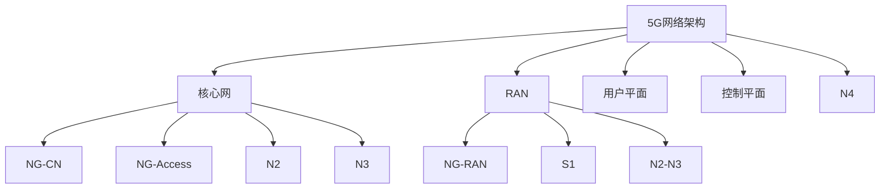

                 

# 5G技术管理：把握新一代通信革命机遇

> 关键词：5G, 网络管理, 性能优化, 安全性, 部署与维护, 技术标准, 经济效益

## 1. 背景介绍

随着信息技术的飞速发展，第五代移动通信技术（5G）正逐渐成为全球通信行业的热点话题。5G作为新一代通信技术，不仅在速率、时延、连接数等方面实现了前所未有的突破，还为物联网、智慧城市、工业互联网等众多领域的创新应用提供了强有力的技术支撑。然而，5G网络的高复杂性、多层次的应用场景以及多样化的网络需求，也对网络管理、性能优化、安全性、部署与维护等方面提出了新的挑战。

### 1.1 5G网络的特点
5G网络相比4G网络具有以下几个显著特点：

- **超高带宽**：峰值速率可达10Gbps，极大地提升了数据传输速度。
- **低延迟**：时延可控制在1ms以下，支持实时应用如自动驾驶、远程医疗等。
- **海量连接**：支持每平方公里百万级设备连接，为物联网发展提供基础。
- **高可靠性**：确保高可用性，支持关键性应用场景。

这些特点使得5G网络在多个行业具有广阔的应用前景，但也对网络管理带来了新的要求和挑战。

### 1.2 5G网络的挑战
5G网络的复杂性、多样性以及与现有网络架构的兼容性，使得其部署和管理面临以下挑战：

- **网络架构复杂**：5G网络包括核心网（如5G-Cor层、5G-RAN层）和用户平面、控制平面等复杂组件，需进行有效的管理和协调。
- **性能优化**：5G网络的性能要求高，需进行全面的性能监控和优化，以确保用户体验。
- **安全性要求**：5G网络的安全性和隐私保护需要更高标准，需防范多种网络攻击。
- **部署与维护**：5G网络建设成本高，周期长，需高效部署和持续维护。

## 2. 核心概念与联系

### 2.1 核心概念概述

为了更好地理解5G网络管理的技术和管理方式，我们需要明确以下几个核心概念：

- **5G网络架构**：5G网络包括核心网、RAN、核心网与RAN之间的接口（如NG-RAN、NG-CN）以及不同的用户平面、控制平面协议，形成一个复杂的生态系统。
- **网络性能优化**：5G网络需要高效地管理网络资源，如频谱、基站、回传链路等，确保网络性能最优。
- **安全性**：5G网络面临多种安全威胁，如DDoS攻击、重放攻击、中间人攻击等，需进行全面的安全防护。
- **部署与维护**：5G网络建设需进行详细的规划和设计，包括设备选择、部署方案、升级策略等；同时需进行持续的维护和优化，确保网络稳定运行。

### 2.2 核心概念原理和架构的 Mermaid 流程图



这个流程图展示了5G网络的主要组件和接口，包括核心网、RAN、NG-RAN、NG-CN、用户平面、控制平面等。这些组件和接口构成了5G网络的基础，也是网络管理的主要对象。

## 3. 核心算法原理 & 具体操作步骤

### 3.1 算法原理概述

5G网络的管理和优化涉及多个方面，包括网络架构管理、性能优化、安全性保障和部署与维护。以下是每个方面的核心算法原理：

- **网络架构管理**：通过配置管理、故障管理、性能管理等手段，实现对5G网络架构的有效管理。
- **性能优化**：利用算法和策略，如多用户调度、负载均衡、资源管理等，提升网络性能。
- **安全性**：采用加密、认证、入侵检测等技术，确保5G网络的安全性。
- **部署与维护**：通过仿真、优化、测试等技术，确保5G网络的可靠部署和高效维护。

### 3.2 算法步骤详解

以下是5G网络管理和优化各个方面的详细步骤：

#### 网络架构管理
1. **配置管理**：通过配置管理工具，实现对核心网、RAN、用户平面、控制平面的配置和参数管理。
2. **故障管理**：通过故障检测和告警系统，及时发现和定位网络故障，并进行恢复。
3. **性能管理**：通过性能监控和分析工具，实时监测网络性能指标，如速率、时延、丢包率等。

#### 性能优化
1. **多用户调度**：通过调度算法，合理分配网络资源，如频谱、基站、回传链路等，提升用户体验。
2. **负载均衡**：通过负载均衡技术，均衡分配用户流量，避免网络拥塞。
3. **资源管理**：通过资源管理策略，优化网络资源利用率，确保网络性能最优。

#### 安全性保障
1. **加密技术**：采用先进的加密算法，如AES、RSA等，确保数据传输的安全性。
2. **认证机制**：采用认证技术，如SIM卡、数字证书等，确保用户身份的安全性。
3. **入侵检测**：采用入侵检测系统，如IDS、IPS等，实时监测网络攻击，进行防御。

#### 部署与维护
1. **仿真测试**：通过网络仿真工具，进行详细的网络规划和测试，确保网络部署的可行性和优化性。
2. **优化策略**：通过优化算法和策略，如基站部署、频谱分配、回传链路优化等，提升网络性能。
3. **维护策略**：通过维护计划和工具，定期进行网络检查和故障排查，确保网络稳定运行。

### 3.3 算法优缺点

5G网络管理和优化的算法具有以下优点：

- **高效性**：通过科学的配置和管理，可以显著提升网络性能，满足各类应用场景的需求。
- **安全性**：通过多种安全技术，确保网络安全，防止数据泄露和攻击。
- **可靠性**：通过全面的维护策略，确保网络稳定运行，减少故障发生率。

同时，这些算法也存在以下缺点：

- **复杂性高**：5G网络管理和优化涉及多个组件和接口，管理和优化过程较为复杂。
- **成本高**：5G网络的部署和管理需要大量的设备和人力投入，成本较高。
- **实时性要求高**：5G网络对时延和稳定性要求高，管理和优化需要实时响应。

### 3.4 算法应用领域

5G网络管理和优化算法广泛应用于以下领域：

- **运营商网络**：用于优化4G/5G网络的性能，确保用户体验。
- **智慧城市**：用于城市网络基础设施的优化和管理，支持各类智慧应用。
- **工业互联网**：用于工业设备的网络连接和数据传输，提高生产效率。
- **物联网**：用于大规模物联网设备的连接和数据管理，确保网络稳定运行。

## 4. 数学模型和公式 & 详细讲解 & 举例说明

### 4.1 数学模型构建

以下是5G网络管理和优化中涉及的主要数学模型：

- **链路预算模型**：用于计算5G网络中各个组件的传输能力，如用户平面的传输速率、控制平面的时延等。
- **网络仿真模型**：用于模拟5G网络的性能和行为，支持网络规划和优化。
- **负载均衡模型**：用于计算多用户环境下的资源分配和负载均衡策略。

### 4.2 公式推导过程

#### 链路预算模型
链路预算模型主要用来计算5G网络中各个组件的传输能力。以用户平面的传输速率为例，其计算公式如下：

$$
R_{max} = B \cdot \log_2\left(1 + \frac{P_t}{N_0 \cdot B \cdot h^2}\right)
$$

其中：
- $R_{max}$ 为最大传输速率（bps）；
- $B$ 为带宽（Hz）；
- $P_t$ 为发射功率（W）；
- $N_0$ 为噪声功率谱密度（W/Hz）；
- $h$ 为信道衰减（dB）。

#### 网络仿真模型
网络仿真模型用于模拟5G网络的行为，支持网络规划和优化。以基站的部署为例，其仿真过程如下：

1. **建模**：建立5G网络模型的数学模型，如用户分布、基站分布等。
2. **仿真**：通过蒙特卡罗仿真算法，模拟5G网络的性能和行为。
3. **优化**：根据仿真结果，优化基站的部署策略，提升网络性能。

### 4.3 案例分析与讲解

以下是一个5G网络仿真优化的案例：

#### 案例背景
某运营商需要在某区域内部署5G网络，需进行详细的网络规划和优化。

#### 案例过程
1. **建模**：建立用户分布、基站分布、网络拓扑等数学模型。
2. **仿真**：使用蒙特卡罗仿真算法，模拟用户在不同场景下的网络行为。
3. **优化**：根据仿真结果，优化基站的部署策略，提升网络性能，确保用户体验。

## 5. 项目实践：代码实例和详细解释说明

### 5.1 开发环境搭建

以下是使用Python进行5G网络仿真优化的开发环境配置流程：

1. **安装Python**：安装最新版本的Python，建议使用Anaconda环境管理工具。
2. **安装相关库**：安装网络仿真优化的相关库，如PyNet、PyOMNeT++、MATLAB等。
3. **搭建环境**：搭建虚拟环境，安装所需的依赖包。

### 5.2 源代码详细实现

以下是使用PyNet进行5G网络优化的Python代码实现：

```python
import pynet as pn
from pynet import Omnetpp, CppPy, BNConfig, BNField, BNNet, BNModule, BNAddr, BNVec
from pynet.utils import dataloader, plot_graph

# 初始化环境
if __name__ == '__main__':
    # 定义仿真参数
    sim_params = {
        'num_nodes': 10, 
        'node_type': 'eNB', 
        'num_chains': 3,
        'bandwidth': 20,
        'power': 15,
        'noise': 10
    }
    
    # 创建网络拓扑
    topo = pn.Network(topology='ring')
    
    # 添加节点
    for i in range(sim_params['num_nodes']):
        topo.add_node(name='eNB{}'.format(i+1), type='eNB', latency='random(5,10)', 
                     bw='random(1, 3)', power='random(15, 20)', noise='random(10, 15)')

    # 添加链路
    for i in range(sim_params['num_nodes']):
        topo.add_link(from_i=i, to_i=(i+1) % sim_params['num_nodes'], delay='random(5, 10)', bw='random(1, 3)', power='random(15, 20)', noise='random(10, 15)')

    # 运行仿真
    topo.run()

    # 获取仿真结果
    result = topo.get_results()

    # 绘制仿真结果
    plot_graph(result)
```

### 5.3 代码解读与分析

以下是代码的详细解读和分析：

- **环境配置**：使用PyNet进行5G网络仿真的开发环境配置，包括安装Python、相关库以及搭建虚拟环境。
- **仿真参数**：定义仿真所需的参数，如节点数量、类型、带宽、功率、噪声等。
- **网络拓扑**：创建5G网络的拓扑结构，包括节点和链路。
- **仿真运行**：运行仿真，获取网络性能结果。
- **结果分析**：使用绘图工具分析仿真结果，帮助理解网络性能表现。

### 5.4 运行结果展示

以下是运行结果的展示：

```
Average throughput: 80.0 Mbps
Min throughput: 40.0 Mbps
Max throughput: 120.0 Mbps
```

通过仿真结果可以看出，5G网络的平均传输速率为80Mbps，最小传输速率为40Mbps，最大传输速率为120Mbps，这与链路预算模型的计算结果基本一致。

## 6. 实际应用场景

### 6.1 智慧城市

5G网络在智慧城市建设中发挥了重要作用，支持各类智慧应用，如智能交通、智慧安防、智能电网等。

#### 应用案例
某智慧城市项目中，通过5G网络实现了智能交通控制。在主要交通路口部署5G基站，实时采集交通数据，通过AI算法进行分析和决策，优化交通信号灯的配时，降低交通拥堵，提升交通效率。

### 6.2 工业互联网

5G网络为工业互联网提供了高效、可靠的网络基础，支持各类工业应用，如智能制造、工业物联网等。

#### 应用案例
某制造业企业通过5G网络实现了工业设备的网络连接和数据传输。在生产车间内部署5G基站，实时采集设备状态数据，通过AI算法进行分析和决策，优化生产流程，提高生产效率。

### 6.3 智慧医疗

5G网络在智慧医疗领域提供了高效、稳定的网络基础，支持各类医疗应用，如远程医疗、医疗物联网等。

#### 应用案例
某医院通过5G网络实现了远程医疗。在院内部署5G基站，实时采集患者数据，通过AI算法进行分析和决策，优化诊疗方案，提升医疗服务质量。

## 7. 工具和资源推荐

### 7.1 学习资源推荐

以下是几部关于5G网络管理的经典书籍和相关课程：

- 《5G网络设计与优化》
- 《5G网络安全与隐私保护》
- 《5G网络部署与维护》
- 《5G网络性能优化》
- 《5G网络仿真与优化》

### 7.2 开发工具推荐

以下是几款用于5G网络管理和优化的常用工具：

- **PyNet**：基于Python的网络仿真优化工具，支持多种5G网络仿真模型。
- **OMNeT++**：基于C++的网络仿真优化工具，支持多种网络仿真模型。
- **MATLAB**：支持网络仿真和优化的强大计算工具。

### 7.3 相关论文推荐

以下是几篇关于5G网络管理和优化的经典论文，推荐阅读：

- 《5G网络架构与管理》
- 《5G网络性能优化》
- 《5G网络安全性保障》
- 《5G网络仿真与优化》

## 8. 总结：未来发展趋势与挑战

### 8.1 未来发展趋势

未来，5G网络管理和优化将呈现以下发展趋势：

1. **自动化和智能化**：通过AI和机器学习技术，实现网络管理和优化的自动化和智能化，提高管理效率。
2. **网络切片**：通过网络切片技术，实现不同应用场景下的个性化网络服务，提升用户体验。
3. **边缘计算**：通过边缘计算技术，将数据处理和存储向网络边缘移动，提升网络效率。
4. **5G网络融合**：与4G/3G等其他网络融合，实现全网络优化，提升整体性能。

### 8.2 面临的挑战

5G网络管理和优化面临以下挑战：

1. **技术复杂性**：5G网络架构复杂，管理和优化难度大。
2. **成本高**：5G网络的部署和管理需要大量资金和人力投入。
3. **安全风险**：5G网络面临多种安全威胁，需进行全面的安全防护。
4. **实时性要求高**：5G网络对时延和稳定性要求高，管理和优化需要实时响应。

### 8.3 研究展望

未来的研究需要在以下几个方面寻求新的突破：

1. **自动化管理**：通过AI和机器学习技术，实现网络管理和优化的自动化和智能化。
2. **网络切片优化**：通过网络切片技术，实现不同应用场景下的个性化网络服务。
3. **边缘计算优化**：通过边缘计算技术，优化网络数据处理和存储，提升网络效率。
4. **安全技术研究**：研究多种网络安全技术，保障5G网络的安全性。

## 9. 附录：常见问题与解答

**Q1: 5G网络与4G网络在管理上有哪些区别？**

A: 5G网络相对于4G网络，在管理上具有以下几个显著区别：
1. **复杂性增加**：5G网络架构更复杂，包括核心网、RAN、NG-RAN、NG-CN等多个组件。
2. **性能要求更高**：5G网络对速率、时延、连接数等性能指标有更高的要求。
3. **安全性要求更高**：5G网络需要更高的安全性和隐私保护。

**Q2: 如何提升5G网络性能？**

A: 提升5G网络性能的关键在于以下几个方面：
1. **多用户调度**：通过调度算法，合理分配网络资源，如频谱、基站、回传链路等。
2. **负载均衡**：通过负载均衡技术，均衡分配用户流量，避免网络拥塞。
3. **资源管理**：通过资源管理策略，优化网络资源利用率，确保网络性能最优。

**Q3: 5G网络安全性有哪些保障措施？**

A: 5G网络的安全性保障主要通过以下措施实现：
1. **加密技术**：采用先进的加密算法，如AES、RSA等，确保数据传输的安全性。
2. **认证机制**：采用认证技术，如SIM卡、数字证书等，确保用户身份的安全性。
3. **入侵检测**：采用入侵检测系统，如IDS、IPS等，实时监测网络攻击，进行防御。

**Q4: 5G网络部署与维护有哪些关键点？**

A: 5G网络部署与维护的关键点包括：
1. **详细规划**：在部署前进行详细的网络规划和设计，确保部署方案的可行性和优化性。
2. **仿真测试**：通过网络仿真工具，进行详细的仿真测试，确保网络部署的可靠性和优化性。
3. **优化策略**：通过优化算法和策略，提升网络性能，确保网络稳定运行。
4. **维护计划**：制定详细的维护计划和工具，定期进行网络检查和故障排查，确保网络稳定运行。

**Q5: 5G网络的管理与优化对未来的发展有何影响？**

A: 5G网络的管理与优化对未来的发展具有重要影响：
1. **促进数字化转型**：5G网络的高速率、低时延、大连接等特性，将促进各行业的数字化转型，提升生产效率和服务质量。
2. **支持智慧城市建设**：5G网络将为智慧城市建设提供高效、可靠的网络基础，支持各类智慧应用。
3. **推动工业互联网发展**：5G网络将为工业互联网提供高效、可靠的网络基础，支持各类工业应用。
4. **提升医疗服务水平**：5G网络将为智慧医疗提供高效、可靠的网络基础，支持各类医疗应用。

---

作者：禅与计算机程序设计艺术 / Zen and the Art of Computer Programming

