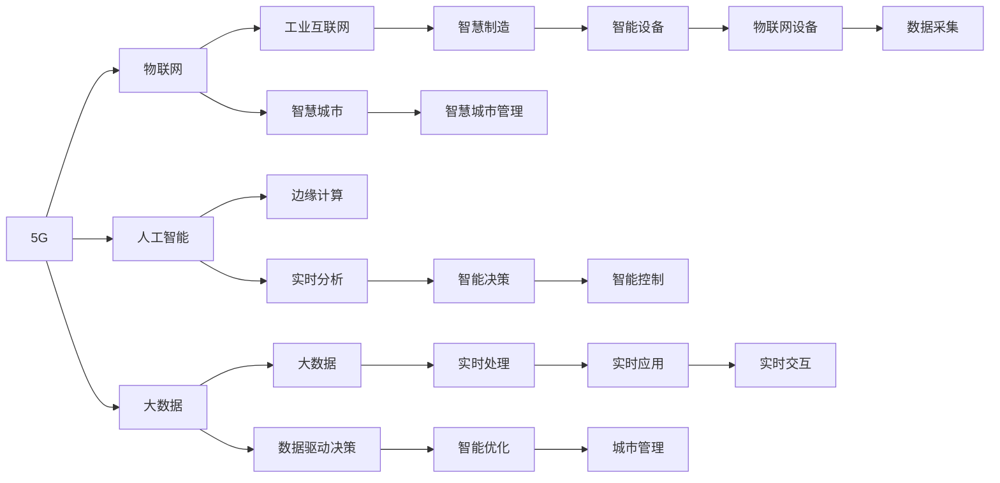

                 

## 1. 背景介绍

### 1.1 5G时代的到来
5G，即第五代移动通信技术，是继4G-LTE之后的最新一代无线通信技术。5G的到来，不仅标志着通信速度的飞跃，也象征着新一轮信息革命的开启。据国际电信联盟（ITU）定义，5G将提供至少10Gbps的下行速率和1Gbps的上行速率，实现毫秒级的低延迟，支持大规模物联网连接，推动工业互联网、智慧城市、自动驾驶等新场景的发展。

### 1.2 创业环境的变化
5G时代，创业环境发生了深刻变革。首先，5G的高速率、低延迟和海量连接能力，为数据传输和实时交互提供了前所未有的条件，催生了更多基于云的创新业务模式。其次，5G与物联网、大数据、人工智能等技术的融合，带来了新一轮的技术和市场竞争，激发了创业者的想象力。最后，5G商业化进程加快，落地应用场景增多，市场规模迅速扩大，为创业者提供了更多的商业机会。

## 2. 核心概念与联系

### 2.1 核心概念概述

本节将介绍5G时代与创业相关的核心概念及其之间的联系：

1. **5G**：新一代移动通信技术，具有高带宽、低延迟、高可靠性和大规模物联网连接等特点，为创业提供了新基础设施和应用场景。
2. **物联网（IoT）**：通过5G网络实现物的互联互通，推动工业互联网、智慧城市等领域的创新。
3. **人工智能（AI）**：与5G结合，实现实时数据分析和智能决策，提高自动化和智能化水平。
4. **大数据（Big Data）**：利用5G网络实现海量数据的实时传输和处理，为数据驱动的创新提供支撑。
5. **边缘计算（Edge Computing）**：在5G网络边缘部署计算资源，实现数据的本地化处理和实时响应。
6. **工业互联网（Industrial Internet）**：5G与工业物联网、云计算、大数据等技术结合，推动制造业数字化转型。
7. **智慧城市（Smart City）**：通过5G网络实现城市基础设施的智能化管理和优化。

这些核心概念通过5G网络得以高效融合，构成了推动创业发展的技术基础和应用场景。

### 2.2 核心概念原理和架构的 Mermaid 流程图



这个流程图展示了5G技术在各个核心概念中的应用，通过5G网络的高速率、低延迟和大规模连接能力，实现了物联网设备的数据采集、人工智能的实时分析和决策支持，以及智慧城市的智能化管理。

## 3. 核心算法原理 & 具体操作步骤

### 3.1 算法原理概述

5G时代的创业机遇，主要来源于以下几个方面的算法和技术的创新：

1. **边缘计算优化算法**：通过优化算法实现5G网络边缘计算资源的最优分配和使用，提升计算效率和资源利用率。
2. **数据融合算法**：将来自不同数据源的数据进行融合处理，实现全面、精准的数据分析。
3. **智能决策算法**：基于人工智能算法，对融合后的数据进行智能分析和决策，提升决策的精准性和效率。
4. **网络优化算法**：优化5G网络的传输路径、频率复用等，提升网络性能和稳定性。
5. **智慧城市管理算法**：通过算法实现智慧城市基础设施的智能化管理和优化，提高城市运行效率和居民生活质量。

### 3.2 算法步骤详解

1. **需求分析**：确定创业项目的核心需求，选择合适的5G应用场景。
2. **算法选择**：根据项目需求，选择合适的优化、融合、智能决策等算法。
3. **数据准备**：收集和整理相关数据，确保数据的质量和完整性。
4. **算法开发**：实现所选算法，并进行初步测试和优化。
5. **模型训练**：使用历史数据对算法模型进行训练，确保模型能够适应新场景。
6. **模型部署**：将训练好的模型部署到5G网络边缘节点，进行实时数据处理和决策。
7. **性能评估**：对模型性能进行评估，根据反馈进行迭代优化。

### 3.3 算法优缺点

#### 优点：

1. **高性能**：5G网络的高带宽、低延迟和高速率，为实时数据处理提供了支撑，提升了算法的效率。
2. **可扩展性**：5G网络支持大规模物联网连接，算法可以应用于更多场景，实现广泛应用。
3. **智能化**：结合人工智能技术，算法可以处理更复杂的数据，提供更精准的决策。
4. **实时性**：5G网络支持低延迟，算法可以在数据到达后立即进行处理，实现实时响应。

#### 缺点：

1. **复杂性**：5G网络与多种技术结合，算法实现复杂度增加，需要更高的技术门槛。
2. **资源消耗**：高带宽和低延迟的网络要求较高的计算资源，增加了成本。
3. **安全风险**：数据和算法的安全性需要特别关注，防止被恶意攻击。
4. **兼容性**：不同厂商的5G设备和网络可能存在兼容性问题，需要标准化和兼容性测试。

### 3.4 算法应用领域

5G技术在多个领域有广泛应用，包括但不限于以下几个方面：

1. **工业互联网**：通过5G网络和边缘计算，实现工业设备的远程监控、控制和预测维护。
2. **智慧城市**：利用5G网络实现交通管理、环境监测、公共安全等智慧应用。
3. **自动驾驶**：通过5G网络实现车辆间的实时通信和协同控制，推动自动驾驶技术的发展。
4. **医疗健康**：通过5G网络实现远程医疗、健康监测和智能诊断，提升医疗服务水平。
5. **智能制造**：通过5G网络实现工厂的数字化、智能化转型，提升生产效率和产品质量。
6. **智慧农业**：通过5G网络实现农机的远程监控和自动化作业，推动农业智能化发展。

## 4. 数学模型和公式 & 详细讲解 & 举例说明

### 4.1 数学模型构建

在5G时代的创业中，数学模型和算法起到了关键作用。以下介绍几个常见的数学模型及其构建方法：

1. **线性回归模型**：用于预测和分析数据之间的关系，例如工业设备故障预测。模型公式为：
   $$
   y = \beta_0 + \beta_1 x_1 + \beta_2 x_2 + \cdots + \beta_n x_n + \epsilon
   $$

2. **支持向量机（SVM）**：用于分类和回归问题，通过在高维空间中找到最优超平面实现分类。模型公式为：
   $$
   \min_{w,b} \frac{1}{2} ||w||^2 + C \sum_{i=1}^N (\text{margin error})^2
   $$

3. **深度学习模型**：用于处理复杂数据，例如图像、语音等。常见模型包括卷积神经网络（CNN）、循环神经网络（RNN）等。模型公式为：
   $$
   y = f_{\theta}(x) = \sigma(Wx + b)
   $$

### 4.2 公式推导过程

1. **线性回归**：
   - 目标函数为最小二乘法，即最小化预测值与真实值之间的平方误差。
   - 求解最优参数 $\beta$，可以使用梯度下降法或其他优化算法。

2. **支持向量机**：
   - 使用拉格朗日乘子法求解最优超平面。
   - 通过求解优化问题，得到最优参数 $w$ 和 $b$。

3. **深度学习**：
   - 使用反向传播算法更新权重 $W$ 和偏置 $b$，使得损失函数最小化。
   - 使用激活函数 $\sigma$ 处理非线性关系。

### 4.3 案例分析与讲解

以智慧城市中的交通管理为例，介绍如何使用线性回归和支持向量机模型进行分析：

1. **线性回归模型**：假设要预测道路拥堵情况，收集历史交通数据 $x = (x_1, x_2, \cdots, x_n)$，包括时间、天气、车流量等信息。模型预测值为 $y$，即道路拥堵程度。通过最小化误差 $E = \sum_{i=1}^N (y_i - \hat{y}_i)^2$ 来求解最优参数 $\beta$。

2. **支持向量机模型**：使用历史交通数据 $x$ 和对应的拥堵情况 $y$，训练支持向量机模型。通过最小化超平面误差 $\epsilon$ 和正则化项 $\lambda$ 来求解最优参数 $w$ 和 $b$。

## 5. 项目实践：代码实例和详细解释说明

### 5.1 开发环境搭建

1. **硬件需求**：高性能计算机（CPU、GPU）、5G实验环境（如实验室、运营商合作等）。
2. **软件环境**：Python 3.x、TensorFlow、PyTorch、OpenCV、scikit-learn 等工具。
3. **数据集**：选择与创业项目相关的数据集，如智慧城市交通数据、工业设备运行数据等。

### 5.2 源代码详细实现

以下是一个简单的智慧城市交通管理项目示例代码：

```python
import tensorflow as tf
from tensorflow.keras.layers import Dense, Input
from tensorflow.keras.models import Model

# 定义输入层
input_layer = Input(shape=(n_features,))

# 定义隐藏层
hidden_layer = Dense(32, activation='relu')(input_layer)

# 定义输出层
output_layer = Dense(1, activation='sigmoid')(hidden_layer)

# 定义模型
model = Model(inputs=input_layer, outputs=output_layer)

# 编译模型
model.compile(optimizer='adam', loss='binary_crossentropy', metrics=['accuracy'])

# 训练模型
model.fit(x_train, y_train, epochs=10, batch_size=32, validation_data=(x_val, y_val))
```

### 5.3 代码解读与分析

以上代码展示了如何使用 TensorFlow 实现一个简单的智慧城市交通管理模型。代码流程如下：

1. **输入层定义**：使用 Input 层定义模型的输入，包含 n_features 个特征。
2. **隐藏层定义**：使用 Dense 层定义模型的一个隐藏层，包含 32 个神经元，使用 ReLU 激活函数。
3. **输出层定义**：使用 Dense 层定义模型的输出，包含 1 个神经元，使用 Sigmoid 激活函数，表示道路拥堵概率。
4. **模型定义**：使用 Model 类定义模型，包含输入层、隐藏层和输出层。
5. **模型编译**：使用 compile 方法编译模型，设置优化器、损失函数和评估指标。
6. **模型训练**：使用 fit 方法训练模型，设置训练轮数、批次大小和验证集数据。

### 5.4 运行结果展示

训练完成后，可以通过以下代码进行模型评估：

```python
# 加载测试数据
x_test, y_test = load_data(test_data_path)

# 评估模型
loss, accuracy = model.evaluate(x_test, y_test, verbose=0)

# 输出评估结果
print(f'Test Loss: {loss:.4f}')
print(f'Test Accuracy: {accuracy:.4f}')
```

## 6. 实际应用场景

### 6.1 智能制造

在智能制造领域，5G技术可以应用于工厂的数字化、智能化转型。通过5G网络实现生产设备、质量检测、仓储管理等环节的数据采集和实时监控，利用算法进行预测维护、故障诊断和优化生产流程。

### 6.2 智慧医疗

在智慧医疗领域，5G技术可以用于远程医疗、健康监测和智能诊断。通过5G网络实现医疗设备的远程监控、患者数据的实时传输和分析，提升医疗服务的质量和效率。

### 6.3 智慧交通

在智慧交通领域，5G技术可以应用于交通管理、车辆监控和智能导航。通过5G网络实现交通流量监测、路况预测和智能信号控制，提升交通管理效率和安全性。

### 6.4 未来应用展望

随着5G网络的逐步普及和技术的不断进步，5G时代将带来更多创业机遇：

1. **智慧农业**：通过5G网络实现农机的远程监控和自动化作业，推动农业智能化发展。
2. **智慧教育**：利用5G网络实现远程教育、智能辅导和个性化学习，提升教育质量。
3. **智慧金融**：通过5G网络实现实时交易、智能风险控制和金融服务优化，提升金融服务水平。
4. **智慧物流**：通过5G网络实现智能仓储、物流管理和供应链优化，提升物流效率。
5. **智慧环境**：通过5G网络实现环境监测、资源管理和智能决策，推动可持续发展。

## 7. 工具和资源推荐

### 7.1 学习资源推荐

1. **5G基础课程**：
   - 《5G网络基础与技术》：介绍5G网络的基本原理、关键技术和发展前景。
   - 《5G移动通信》：涵盖5G网络架构、协议和应用场景。

2. **机器学习与深度学习**：
   - 《机器学习》（周志华）：全面介绍机器学习的理论基础和算法实现。
   - 《深度学习》（Ian Goodfellow）：深入讲解深度学习的基本原理和应用。

3. **物联网与边缘计算**：
   - 《物联网技术与应用》：介绍物联网的原理、技术和应用案例。
   - 《边缘计算》：涵盖边缘计算的基本概念、体系结构和典型应用。

4. **人工智能与大数据**：
   - 《人工智能基础》：介绍人工智能的基本概念、技术和应用。
   - 《大数据技术与应用》：涵盖大数据的基本概念、技术和应用。

### 7.2 开发工具推荐

1. **Python 编程语言**：
   - Anaconda：Python科学计算环境，提供丰富的第三方库支持。
   - Jupyter Notebook：交互式编程环境，方便代码调试和共享。

2. **深度学习框架**：
   - TensorFlow：由Google开发的深度学习框架，支持分布式计算和多种硬件平台。
   - PyTorch：由Facebook开发的深度学习框架，具有动态计算图和灵活的API设计。

3. **数据处理与分析**：
   - Pandas：数据处理和分析工具，支持数据清洗、处理和可视化。
   - NumPy：科学计算库，支持高性能矩阵运算和数组操作。

4. **可视化工具**：
   - Matplotlib：Python绘图库，支持绘制各种类型的图表。
   - Seaborn：基于Matplotlib的高级绘图库，支持统计图表和数据可视化。

### 7.3 相关论文推荐

1. **5G网络研究**：
   - 《5G移动通信系统架构与关键技术》：介绍5G网络的架构和关键技术。
   - 《5G网络优化与性能提升》：探讨5G网络的优化策略和性能提升方法。

2. **物联网与边缘计算**：
   - 《物联网传感器数据融合与智能决策》：研究物联网数据融合和智能决策的算法和应用。
   - 《边缘计算资源分配与优化》：探讨边缘计算资源分配和优化的算法和方法。

3. **人工智能与大数据**：
   - 《深度学习在大数据中的应用》：研究深度学习在大数据处理中的应用。
   - 《大数据驱动的智能决策》：探讨大数据在智能决策中的应用和算法。

## 8. 总结：未来发展趋势与挑战

### 8.1 研究成果总结

5G时代的创业，正处于技术快速发展的关键时期，以下是对当前研究成果的总结：

1. **5G网络优化**：通过优化算法实现5G网络的性能提升和资源分配，例如网络切片、频谱共享等。
2. **数据融合与智能决策**：将来自不同数据源的数据进行融合处理，实现全面、精准的数据分析，并应用智能决策算法提升决策效率。
3. **边缘计算**：在5G网络边缘部署计算资源，实现数据的本地化处理和实时响应。

### 8.2 未来发展趋势

1. **5G网络普及**：5G网络的覆盖范围和用户规模将持续扩大，推动更多的应用场景落地。
2. **技术创新**：边缘计算、人工智能和大数据技术的不断发展，将进一步推动5G时代的创业创新。
3. **商业模式创新**：5G技术的应用将催生新的商业模式，如平台经济、共享经济等。
4. **政策支持**：各国政府对5G技术的重视和支持，将为创业提供更多政策红利和资金支持。

### 8.3 面临的挑战

1. **技术挑战**：5G网络的复杂性和多样性，带来了技术实现和优化的挑战。
2. **市场竞争**：5G技术的市场竞争激烈，需要寻找差异化竞争优势。
3. **安全性**：5G网络的安全性和数据隐私保护需要特别关注。
4. **成本控制**：5G技术的部署和运营成本较高，需要有效控制成本。

### 8.4 研究展望

未来的研究将聚焦于以下几个方面：

1. **网络优化**：研究5G网络优化算法，提升网络性能和资源利用率。
2. **智能决策**：应用深度学习和大数据技术，提升决策的精准性和效率。
3. **应用拓展**：拓展5G技术在更多场景中的应用，推动创新和落地。
4. **安全性与隐私保护**：研究5G网络的安全性和数据隐私保护，确保技术的安全应用。

## 9. 附录：常见问题与解答

**Q1: 5G网络在创业中有哪些应用场景？**

A: 5G网络在创业中有很多应用场景，例如智慧城市、智慧医疗、智慧交通、工业互联网、智能制造等。5G网络的高带宽、低延迟和海量连接能力，为这些场景提供了新基础设施和应用支撑。

**Q2: 5G网络对创业项目有哪些挑战？**

A: 5G网络对创业项目有以下挑战：
1. **技术复杂性**：5G网络的技术实现和优化复杂度较高，需要较高的技术门槛。
2. **成本问题**：5G网络的部署和运营成本较高，需要有效控制成本。
3. **安全性**：5G网络的安全性和数据隐私保护需要特别关注。
4. **市场竞争**：5G技术的市场竞争激烈，需要寻找差异化竞争优势。

**Q3: 5G网络如何实现数据融合和智能决策？**

A: 5G网络通过以下方式实现数据融合和智能决策：
1. **数据采集**：利用5G网络的高带宽和低延迟特性，实现实时数据采集。
2. **数据融合**：通过边缘计算技术，将来自不同数据源的数据进行融合处理，实现全面、精准的数据分析。
3. **智能决策**：应用深度学习和大数据技术，对融合后的数据进行智能分析和决策，提升决策效率和精准性。

**Q4: 5G网络在智慧城市中的应用案例有哪些？**

A: 5G网络在智慧城市中的应用案例包括：
1. **智能交通管理**：通过5G网络实现交通流量监测、路况预测和智能信号控制，提升交通管理效率和安全性。
2. **智慧医疗**：利用5G网络实现远程医疗、健康监测和智能诊断，提升医疗服务的质量和效率。
3. **智慧安防**：通过5G网络实现视频监控、人脸识别和智能预警，提升公共安全管理水平。

**Q5: 5G网络在工业互联网中的应用前景如何？**

A: 5G网络在工业互联网中的应用前景非常广阔，例如：
1. **智能制造**：通过5G网络实现生产设备、质量检测、仓储管理等环节的数据采集和实时监控，利用算法进行预测维护、故障诊断和优化生产流程。
2. **智慧仓储**：利用5G网络实现智能仓储和物流管理，提升物流效率和仓储管理水平。
3. **远程监控**：通过5G网络实现设备的远程监控和维护，提升设备的使用寿命和效率。

**Q6: 5G网络在智慧农业中的应用有哪些？**

A: 5G网络在智慧农业中的应用包括：
1. **智能农机**：通过5G网络实现农机的远程监控和自动化作业，提高农业生产效率。
2. **精准农业**：利用5G网络实现精准农业，通过传感器数据采集和分析，指导农业生产。
3. **农业监测**：通过5G网络实现对农田环境、作物生长等数据的实时监测，提供决策支持。

**Q7: 5G网络在智慧教育中的应用有哪些？**

A: 5G网络在智慧教育中的应用包括：
1. **远程教育**：通过5G网络实现远程教育，支持线上课程、虚拟课堂和互动教学。
2. **智能辅导**：利用5G网络实现智能辅导系统，提供个性化学习路径和智能推荐。
3. **虚拟现实**：通过5G网络实现虚拟现实教学，提升学习体验和效果。

---

作者：禅与计算机程序设计艺术 / Zen and the Art of Computer Programming

