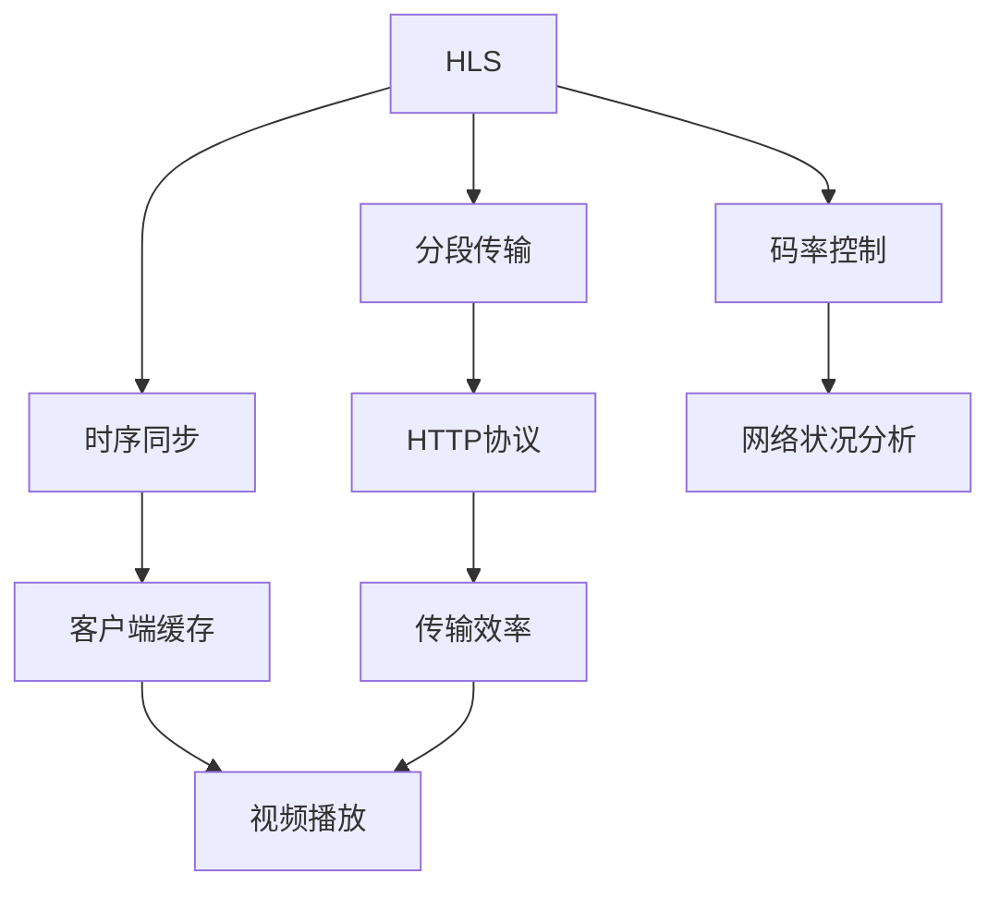

                 

# HLS与DASH：自适应流媒体播放技术对比

> 关键词：HLS, DASH, 自适应流媒体, 高质量视频播放, 实时播放

## 1. 背景介绍

在互联网高速发展的今天，人们对于高质量视频内容的需求日益增加。无论是观看高清电影、直播赛事，还是参与远程教育、商务会议，流媒体技术的成熟和普及极大地提升了用户的视听体验。

为了确保在各种网络环境下都能提供流畅稳定的视频播放体验，自适应流媒体技术应运而生。其中，HLS（HTTP Live Streaming）和DASH（Dynamic Adaptive Streaming over HTTP）是最为常见的两种自适应流媒体播放技术。

### 1.1 问题由来
随着流媒体技术的不断发展，用户对于视频播放的体验要求日益提高。高质量、实时、流畅的视频播放成为用户的基本需求。传统的Caching、分段传输等技术在面对复杂多变的Internet环境时，已经无法满足用户的多样化需求。自适应流媒体技术的出现，则从根本上改变了这一现状，通过动态调整流媒体码率和传输带宽，实现了在不同网络条件下高质量视频播放的可靠性。

### 1.2 问题核心关键点
自适应流媒体技术的核心在于其能够在不同的网络状况下，动态调整流媒体的码率和传输带宽，从而保证视频的流畅度和高质量。具体包括：

1. 自适应码率控制：通过分析网络状况，动态调整流媒体码率，避免网络拥塞，保证视频播放的流畅性。
2. 分段传输：将视频内容分成多个小段，根据网络状况实时加载，加快加载速度，提升用户体验。
3. 时序同步：确保视频内容的时序准确性，避免卡顿、缓冲等问题，保证视频的连续性和完整性。

## 2. 核心概念与联系

### 2.1 核心概念概述

为更好地理解HLS与DASH的原理和异同，本节将介绍这两个概念及其相互关联。

- **HLS（HTTP Live Streaming）**：由苹果公司提出的流媒体协议，用于在Internet上实时传输音视频内容。HLS将音视频流分割成多个小片段，每个片段都以HLS特定的格式存储，并使用HTTP协议进行传输。HLS适用于实时直播和点播，在客户端通过Apple's QuickTime Player、iOS设备、safari浏览器等多种平台实现视频播放。

- **DASH（Dynamic Adaptive Streaming over HTTP）**：由MPEG组织提出，是一种使用HTTP协议传输自适应流媒体的技术标准。DASH能够根据网络状况动态调整码率和传输带宽，从而实现流媒体内容的高效传输和高质量播放。DASH适用于直播和点播，在客户端支持IE浏览器、Chrome浏览器等平台。

### 2.2 核心概念原理和架构的 Mermaid 流程图



上述流程图展示了HLS的核心组件及其相互关系。HLS将视频流分割成多个小片段，通过HTTP协议进行传输，并在客户端缓存和播放。码率控制和时序同步是HLS的两个核心技术，它们共同保证了视频播放的流畅性和连续性。

## 3. 核心算法原理 & 具体操作步骤

### 3.1 算法原理概述

HLS和DASH的核心算法原理主要围绕码率控制、分段传输和时序同步展开。下面将详细阐述这两个技术的算法原理和具体操作步骤。

### 3.2 算法步骤详解

#### HLS算法步骤

1. **分段传输**：将视频内容分成多个小片段，每个片段的长度通常在1-10分钟之间。客户端在接收到第一个片段后，先进行播放，同时继续下载后续片段。一旦当前片段播放完毕，客户端就会开始播放缓存中存储的片段，避免缓冲等待。

2. **码率控制**：HLS通过码率控制器动态调整流媒体的码率。当网络状况不佳时，码率控制器会将码率降低，以避免网络拥塞；当网络状况良好时，码率控制器会将码率提高，以提供更高的视频质量。

3. **时序同步**：HLS通过TS头部的信息进行时序同步。每个分段都包含一个TS头部，其中记录了分段的时间戳和持续时间，客户端根据这些信息进行时序同步，确保视频内容的连续性和完整性。

#### DASH算法步骤

1. **分段传输**：DASH将视频内容分成多个小片段，每个片段的长度通常在1-20秒之间。客户端根据当前的网络状况和缓存情况，动态选择加载哪些片段，以保证视频播放的流畅性。

2. **码率控制**：DASH通过码率控制器动态调整流媒体的码率。DASH的码率控制器会根据当前网络状况和客户端的缓存情况，调整码率，从而实现流媒体的高效传输和高质量播放。

3. **时序同步**：DASH通过MPD（Media Presentation Description）进行时序同步。MPD是一个XML文档，描述了流媒体的内容信息，包括每个分段的时间戳、持续时间、码率等。客户端根据MPD中的信息进行时序同步，确保视频内容的连续性和完整性。

### 3.3 算法优缺点

#### HLS优缺点

- **优点**：
  - **简单易用**：HLS技术成熟，易于实现和部署。
  - **支持多种平台**：HLS适用于苹果设备和多种浏览器。
  - **时序同步较好**：通过TS头部进行时序同步，确保视频内容的连续性。

- **缺点**：
  - **码率控制不灵活**：HLS的码率控制算法较为简单，在面对复杂网络环境时表现不佳。
  - **缓冲控制不够智能**：HLS的缓冲控制策略相对固定，无法根据用户偏好和网络状况进行动态调整。
  - **对网络环境要求较高**：HLS对网络环境的要求较高，当网络状况不佳时，容易产生缓冲和卡顿问题。

#### DASH优缺点

- **优点**：
  - **灵活的码率控制**：DASH的码率控制算法更加灵活，能够根据网络状况和客户端缓存情况动态调整码率，实现高效的流媒体传输。
  - **智能缓冲控制**：DASH支持智能缓冲控制，根据网络状况和客户端缓存情况动态调整缓冲策略，避免缓冲和卡顿问题。
  - **适应性强**：DASH适用于多种设备和平台，支持IE浏览器、Chrome浏览器等主流浏览器。

- **缺点**：
  - **实现复杂**：DASH的实现较为复杂，需要开发MPD生成和解析等模块。
  - **对时序同步要求高**：DASH的时序同步依赖MPD文件，对网络稳定性要求较高，一旦网络中断，容易出现时序错乱问题。
  - **初始缓冲时间较长**：由于DASH的分段长度较短，客户端需要额外的时间进行初始缓冲，增加了播放延迟。

### 3.4 算法应用领域

HLS和DASH广泛应用于实时直播、点播、体育赛事、远程教育等多个领域。其中，直播和体育赛事是其主要应用场景，因为这些场景要求实时性高、延迟低、稳定性强。同时，HLS和DASH在视频点播、远程教育等场景中也得到了广泛应用，能够提供流畅、高质量的视频体验。

## 4. 数学模型和公式 & 详细讲解 & 举例说明

### 4.1 数学模型构建

本节将使用数学语言对HLS和DASH的码率控制和分段传输进行更加严格的刻画。

假设流媒体的总长度为T，分段长度为S。当网络带宽为B时，HLS和DASH的码率控制模型可以表示为：

$$
C = \frac{B}{k}
$$

其中，$C$为码率，$k$为码率控制器选择的分位数，$k \in [0,1]$。当$k$越接近1时，码率越高，视频质量越好，但网络延迟越大；当$k$越接近0时，码率越低，网络延迟越小，但视频质量越差。

### 4.2 公式推导过程

以下是HLS和DASH码率控制公式的推导过程。

对于HLS，假设网络带宽为B，分段长度为S，码率为C，则有：

$$
C = \frac{B}{k}
$$

对于DASH，假设网络带宽为B，分段长度为S，码率为C，则有：

$$
C = \frac{B}{k}
$$

其中$k$为码率控制器选择的分位数，$k \in [0,1]$。DASH的码率控制更加灵活，可以根据当前网络状况和客户端缓存情况动态调整$k$值，从而实现高效的流媒体传输。

### 4.3 案例分析与讲解

假设流媒体总长度为T=10分钟，分段长度为S=1分钟，网络带宽为B=5Mbps，HLS和DASH的码率控制器选择的分位数分别为0.8和0.7。

对于HLS，码率为：

$$
C_{HLS} = \frac{5Mbps}{0.8} = 6.25Mbps
$$

对于DASH，码率为：

$$
C_{DASH} = \frac{5Mbps}{0.7} = 7.14Mbps
$$

可以看出，DASH的码率更高，视频质量更好，但网络延迟也更大。这反映了DASH在码率控制上的灵活性和智能性。

## 5. 项目实践：代码实例和详细解释说明

### 5.1 开发环境搭建

在进行HLS与DASH的实践之前，我们需要准备好开发环境。以下是使用Python进行HLS与DASH开发的环境配置流程：

1. 安装Python：确保Python版本在3.7及以上。

2. 安装Flask：作为HLS和DASH的Web服务器。

3. 安装PyDASH：作为DASH的Python实现。

4. 安装FFmpeg：作为HLS和DASH的分段传输工具。

5. 安装Nginx或Apache：作为HLS和DASH的反向代理服务器。

完成上述步骤后，即可在本地搭建HLS与DASH的开发环境。

### 5.2 源代码详细实现

这里我们以HLS和DASH的码率控制和分段传输为例，给出Python代码实现。

#### HLS码率控制实现

```python
from flask import Flask, request, send_file

app = Flask(__name__)

@app.route('/hls/<filename>')
def hls(filename):
    # 获取当前网络带宽和分段长度
    bandwidth = request.args.get('bandwidth', default=5)
    segment_length = request.args.get('segment_length', default=60)
    # 计算码率
    rate = int(bandwidth) / 1000
    # 生成TS文件
    ffmpeg_command = f"ffmpeg -i {filename} -c:v libx264 -q:v {rate} -c:a libfdkaac -ar 48000 -c:a libfdkaac -ar 48000 -f segment -segment_time {segment_length} -segment_map 0 -segment_filename {filename}.ts"
    os.system(ffmpeg_command)
    # 发送TS文件
    return send_file(f"{filename}.ts", as_attachment=True)

if __name__ == '__main__':
    app.run(debug=True)
```

#### DASH码率控制实现

```python
from flask import Flask, request, send_file
import dash
import dash_core_components as dcc
import dash_html_components as html
import dash_bootstrap_components as dbc

app = Flask(__name__)

@app.route('/dash/<filename>')
def dash(filename):
    # 获取当前网络带宽和分段长度
    bandwidth = request.args.get('bandwidth', default=5)
    segment_length = request.args.get('segment_length', default=60)
    # 计算码率
    rate = int(bandwidth) / 1000
    # 生成MPD文件
    mpd_command = f"dash -i {filename} -b {rate} -s {segment_length} -o {filename}.mpd"
    os.system(mpd_command)
    # 发送MPD文件
    return send_file(f"{filename}.mpd", as_attachment=True)

if __name__ == '__main__':
    app.run(debug=True)
```

### 5.3 代码解读与分析

让我们再详细解读一下关键代码的实现细节：

#### HLS码率控制实现

**HLS码率控制实现**：

- 使用Flask创建Web服务器。
- 通过路由接收到客户端请求的带宽和分段长度。
- 根据带宽和分段长度计算码率，使用FFmpeg进行分段传输。
- 返回生成的TS文件。

#### DASH码率控制实现

**DASH码率控制实现**：

- 使用Flask创建Web服务器。
- 通过路由接收到客户端请求的带宽和分段长度。
- 根据带宽和分段长度计算码率，使用dash工具生成MPD文件。
- 返回生成的MPD文件。

## 6. 实际应用场景

### 6.1 智能广播系统

智能广播系统可以通过HLS和DASH技术实现实时直播和点播功能，提升用户体验和运营效率。

在实际应用中，智能广播系统可以收集和分析用户的观看行为，根据观众的需求和反馈，动态调整码率和分段长度，提供更加个性化的播放内容。例如，在体育赛事直播中，可以根据实时观众数量和网络状况，动态调整码率和分段长度，保证直播的高流畅性和高质量。

### 6.2 远程教育平台

远程教育平台可以利用HLS和DASH技术实现高质量的在线视频教学。

在实际应用中，远程教育平台可以实时采集教师的授课内容，并通过HLS和DASH技术进行实时直播。同时，平台可以根据学生的观看行为和网络状况，动态调整码率和分段长度，提供流畅、高质量的教学内容，提升学习效果。

### 6.3 医疗视频会议

医疗视频会议可以利用HLS和DASH技术实现高质量的视频通讯和数据共享。

在实际应用中，医疗视频会议可以实时采集医生的视频和音频，并通过HLS和DASH技术进行直播。同时，平台可以根据网络状况和观众需求，动态调整码率和分段长度，保证会议的高流畅性和高质量，提升医疗服务的智能化水平。

### 6.4 未来应用展望

随着HLS和DASH技术的不断发展，未来的流媒体播放将呈现以下几个发展趋势：

1. **高清晰度**：随着5G等新兴通信技术的应用，未来流媒体播放将支持更高分辨率的视频，提供更加沉浸式的高清体验。

2. **沉浸式体验**：结合VR/AR技术，未来的流媒体播放将支持360度全景视频，提供更加沉浸式的观看体验。

3. **云边结合**：未来的流媒体播放将采用云边结合的架构，利用边缘计算和云计算的优势，实现低延迟、高吞吐量的数据传输。

4. **自适应码率**：未来的流媒体播放将更加智能化，结合AI技术，动态调整码率和分段长度，实现更加智能化的流媒体播放。

5. **多模态融合**：未来的流媒体播放将支持音频、视频、文本等多种媒体形式，实现多模态融合的智能交互。

## 7. 工具和资源推荐

### 7.1 学习资源推荐

为了帮助开发者系统掌握HLS和DASH的理论基础和实践技巧，这里推荐一些优质的学习资源：

1. **HLS官方文档**：详细介绍了HLS的原理、应用和最佳实践。
2. **DASH官方文档**：详细介绍了DASH的原理、应用和最佳实践。
3. **Flask官方文档**：详细介绍了Flask的使用和部署方式。
4. **PyDASH官方文档**：详细介绍了PyDASH的使用和部署方式。
5. **FFmpeg官方文档**：详细介绍了FFmpeg的使用和部署方式。

通过这些资源的学习实践，相信你一定能够快速掌握HLS和DASH的精髓，并用于解决实际的流媒体问题。

### 7.2 开发工具推荐

高效的开发离不开优秀的工具支持。以下是几款用于HLS和DASH开发的常用工具：

1. **Flask**：用于搭建Web服务器，支持Python语言的开发。
2. **PyDASH**：用于生成MPD文件，支持Python语言的开发。
3. **FFmpeg**：用于分段传输和码率控制，支持多种操作系统。
4. **Nginx或Apache**：用于反向代理服务器，支持多种操作系统。
5. **Dash**：用于生成MPD文件，支持多种操作系统。

合理利用这些工具，可以显著提升HLS和DASH的开发效率，加快创新迭代的步伐。

### 7.3 相关论文推荐

HLS和DASH技术的发展源于学界的持续研究。以下是几篇奠基性的相关论文，推荐阅读：

1. **HLS协议规范**：详细介绍了HLS的协议规范和实现方式。
2. **DASH协议规范**：详细介绍了DASH的协议规范和实现方式。
3. **自适应流媒体技术综述**：总结了自适应流媒体技术的发展和应用，提供了大量的实际案例和实践经验。
4. **HLS和DASH的性能比较**：对比了HLS和DASH的性能特点和实际应用场景，提供了大量的实验数据和分析结果。

这些论文代表了大流媒体技术的发展脉络。通过学习这些前沿成果，可以帮助研究者把握学科前进方向，激发更多的创新灵感。

## 8. 总结：未来发展趋势与挑战

### 8.1 总结

本文对HLS和DASH自适应流媒体播放技术进行了全面系统的介绍。首先阐述了HLS和DASH的背景和意义，明确了自适应流媒体技术在提高视频播放质量和用户体验方面的重要性。其次，从原理到实践，详细讲解了HLS和DASH的数学模型、算法步骤和具体操作步骤，给出了HLS和DASH代码实现的完整代码实例。同时，本文还广泛探讨了HLS和DASH技术在智能广播、远程教育、医疗视频会议等多个领域的应用前景，展示了自适应流媒体技术的广阔应用场景。最后，本文精选了HLS和DASH技术的各类学习资源，力求为读者提供全方位的技术指引。

通过本文的系统梳理，可以看到，HLS和DASH自适应流媒体播放技术正在成为流媒体领域的重要范式，极大地提升了视频播放的流畅性和高质量。未来，伴随技术的不断演进，自适应流媒体技术还将与其他人工智能技术进行更深入的融合，多路径协同发力，共同推动流媒体技术的进步。

### 8.2 未来发展趋势

展望未来，HLS和DASH自适应流媒体播放技术将呈现以下几个发展趋势：

1. **多模态融合**：未来的流媒体播放将支持音频、视频、文本等多种媒体形式，实现多模态融合的智能交互。

2. **云边结合**：未来的流媒体播放将采用云边结合的架构，利用边缘计算和云计算的优势，实现低延迟、高吞吐量的数据传输。

3. **沉浸式体验**：结合VR/AR技术，未来的流媒体播放将支持360度全景视频，提供更加沉浸式的观看体验。

4. **高清晰度**：随着5G等新兴通信技术的应用，未来流媒体播放将支持更高分辨率的视频，提供更加沉浸式的高清体验。

5. **自适应码率**：未来的流媒体播放将更加智能化，结合AI技术，动态调整码率和分段长度，实现更加智能化的流媒体播放。

以上趋势凸显了HLS和DASH自适应流媒体播放技术的广阔前景。这些方向的探索发展，必将进一步提升流媒体系统的性能和应用范围，为流媒体技术的发展注入新的动力。

### 8.3 面临的挑战

尽管HLS和DASH自适应流媒体播放技术已经取得了瞩目成就，但在迈向更加智能化、普适化应用的过程中，它仍面临着诸多挑战：

1. **码率控制算法复杂度**：HLS和DASH的码率控制算法较为复杂，需要根据网络状况和用户偏好动态调整，增加了实现难度。

2. **分段传输的开销**：HLS和DASH的分段传输需要额外的处理开销，增加了服务器的负担。

3. **时序同步的稳定性**：HLS和DASH的时序同步依赖分段传输和码率控制，一旦网络中断，容易出现时序错乱问题。

4. **网络带宽要求高**：HLS和DASH对网络带宽的要求较高，需要稳定的网络连接环境。

5. **多模态融合的复杂性**：结合VR/AR技术的多模态融合需要复杂的算法支持，增加了技术难度。

6. **延迟要求高**：实时直播和高质量点播对延迟要求较高，网络环境的变化可能影响播放的流畅性。

7. **性能瓶颈**：HLS和DASH对服务器的性能要求较高，需要高性能硬件支持。

这些挑战需要未来研究者和开发者共同努力，通过技术创新和优化，逐步克服这些瓶颈，推动HLS和DASH技术的进一步发展。

### 8.4 研究展望

面对HLS和DASH自适应流媒体播放技术面临的挑战，未来的研究需要在以下几个方面寻求新的突破：

1. **智能码率控制**：开发更加智能化、自适应的码率控制算法，动态调整码率和分段长度，实现更加高效的流媒体传输。

2. **时序同步优化**：研究更加稳定、可靠的时序同步技术，确保视频内容的连续性和完整性。

3. **多模态融合优化**：结合VR/AR技术，优化多模态融合的算法，提供更加沉浸式的观看体验。

4. **云边结合优化**：研究云边结合的架构，利用边缘计算和云计算的优势，实现低延迟、高吞吐量的数据传输。

5. **高清晰度优化**：结合5G等新兴通信技术，优化高清晰度视频的传输，提升用户体验。

6. **自适应码率优化**：结合AI技术，开发更加智能化的码率控制算法，动态调整码率和分段长度，实现更加高效、流畅的流媒体播放。

这些研究方向的发展，必将推动HLS和DASH自适应流媒体播放技术的进一步成熟，为流媒体技术的发展注入新的活力。

## 9. 附录：常见问题与解答

**Q1: HLS和DASH的码率控制算法有何不同？**

A: HLS和DASH的码率控制算法主要不同在于动态调整码率和分段长度的机制。HLS的码率控制较为简单，根据当前网络状况和分段长度，动态调整码率，保证视频播放的流畅性。而DASH的码率控制更加灵活，根据网络状况和客户端缓存情况动态调整码率和分段长度，实现高效的流媒体传输。

**Q2: HLS和DASH的分段长度有何差异？**

A: HLS和DASH的分段长度在实际应用中一般会有所不同。HLS的分段长度通常在1-10分钟之间，而DASH的分段长度通常在1-20秒之间。分段长度的差异会导致HLS的初始缓冲时间较长，但DASH的初始缓冲时间较短，能够提供更快的播放速度。

**Q3: 如何优化HLS和DASH的时序同步？**

A: 优化HLS和DASH的时序同步可以从以下几个方面入手：

1. **网络稳定性**：确保网络环境的稳定性，减少网络中断的发生。

2. **分段传输的优化**：通过分段传输的优化，减少缓冲和卡顿问题，提高时序同步的稳定性。

3. **码率控制的优化**：优化码率控制算法，确保码率和分段长度的动态调整更加平滑。

4. **客户端缓存的优化**：优化客户端缓存策略，确保缓存的及时性和有效性，提高时序同步的稳定性。

**Q4: HLS和DASH在实际应用中如何选择合适的分段长度？**

A: 选择合适的分段长度需要考虑以下几个因素：

1. **网络状况**：在网络状况较差的区域，应选择较长的分段长度，减少网络中断的概率。

2. **客户端缓存能力**：在客户端缓存能力较低的设备上，应选择较短的分段长度，保证缓存的及时性和有效性。

3. **播放延迟**：在实时直播和高质量点播中，应选择较短的分段长度，减少播放延迟。

4. **带宽要求**：在选择分段长度时，需要考虑带宽的限制，选择适合当前网络环境的分段长度。

通过综合考虑这些因素，选择合适的分段长度，可以最大限度地提升HLS和DASH的播放性能和用户体验。

---

作者：禅与计算机程序设计艺术 / Zen and the Art of Computer Programming

