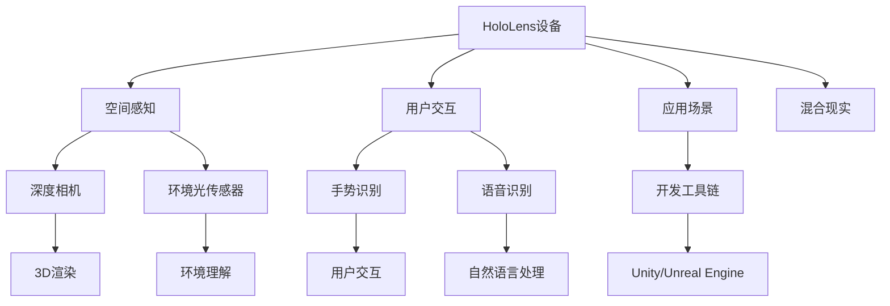

                 

# HoloLens 混合现实应用：在 Microsoft HoloLens 设备上开发

## 1. 背景介绍

### 1.1 问题由来

随着虚拟现实(VR)和增强现实(AR)技术的成熟，混合现实(Mixed Reality, MR)正逐渐成为下一代人机交互的重要方向。HoloLens作为微软推出的混合现实设备，以其实时3D显示和空间感知能力，为开发者提供了丰富的混合现实应用场景。

在商业、医疗、教育、娱乐等多个领域，HoloLens上的混合现实应用已经取得了显著成果，例如微软的HoloLens for Business用于企业会议、培训，以及微软的Hololens HMD的零售体验等。

然而，开发混合现实应用涉及众多技术领域的跨界融合，包括计算机图形学、计算机视觉、传感器融合、用户交互等，使得开发难度较高。此外，HoloLens设备的复杂性和特殊性，也带来了新的挑战。

本文将从开发环境搭建、应用开发流程、关键技术要点等方面，全面介绍如何在HoloLens设备上开发混合现实应用，帮助读者掌握关键技术和开发实践。

## 2. 核心概念与联系

### 2.1 核心概念概述

为帮助读者更好地理解混合现实应用开发，以下先介绍一些核心概念：

- **HoloLens设备**：微软的混合现实设备，集成了计算、空间感知、光学、硬件输入输出等众多关键技术，为混合现实应用提供了基础平台。

- **混合现实**：将虚拟对象与现实世界进行无缝融合，构建出现实与虚拟交织的空间体验。

- **空间感知**：HoloLens设备通过深度相机、环境光传感器等硬件，实现对真实世界的空间感知和环境理解。

- **用户交互**：HoloLens设备通过手势识别、语音识别、触摸屏等技术，实现了与用户的自然交互。

- **应用场景**：混合现实应用通常包括医疗、教育、娱乐、零售、工业等多个领域，开发者需要结合具体应用场景，设计适合的功能模块。

- **开发工具链**：Microsoft提供了完整的混合现实应用开发工具链，包括Unity、Unreal Engine等游戏引擎，以及HoloLens SDK等开发框架。

这些概念之间的联系可以通过以下Mermaid流程图来展示：



这个流程图展示了HoloLens设备的关键组件，以及它们如何协同工作，构建混合现实应用。

## 3. 核心算法原理 & 具体操作步骤

### 3.1 算法原理概述

混合现实应用的核心算法原理，包括空间感知、环境理解、用户交互等关键技术。以下详细介绍这些核心技术：

- **空间感知**：HoloLens设备通过深度相机和环境光传感器，获取环境的三维空间信息，包括深度、颜色、光照等信息。这些数据经过处理，被用于场景重建、物体跟踪等关键应用。

- **环境理解**：通过计算机视觉和图像处理技术，HoloLens设备能够识别环境中的物体、文字、图像等信息，并结合深度信息进行场景理解。环境理解技术是实现虚拟对象与现实世界融合的基础。

- **用户交互**：HoloLens设备通过手势识别、语音识别、触摸屏等技术，实现了与用户的自然交互。交互技术使得虚拟对象能够响应用户的动作和命令，从而实现与现实世界的互动。

- **虚拟对象生成**：混合现实应用的核心是虚拟对象与现实世界的融合。虚拟对象生成技术通过计算机图形学和渲染技术，将虚拟对象在HoloLens屏幕上进行渲染和展示。

### 3.2 算法步骤详解

混合现实应用的开发流程通常包括以下关键步骤：

1. **项目规划**：明确项目目标、功能模块、技术难点等关键要素。
2. **硬件准备**：准备HoloLens设备、计算机、手柄等硬件设备，并进行初始化设置。
3. **环境搭建**：搭建开发环境，包括安装Unity、Unreal Engine等游戏引擎，以及HoloLens SDK等开发框架。
4. **场景构建**：根据项目需求，使用游戏引擎构建虚拟场景和虚拟对象。
5. **空间感知**：通过深度相机和环境光传感器，获取环境的三维空间信息，并进行处理。
6. **环境理解**：使用计算机视觉和图像处理技术，实现环境中的物体识别和场景理解。
7. **用户交互**：实现手势识别、语音识别、触摸屏等交互技术，增强虚拟对象与用户的互动。
8. **虚拟对象生成**：将虚拟对象在HoloLens设备上进行渲染和展示。
9. **测试优化**：在HoloLens设备上进行应用测试，优化性能和用户体验。
10. **发布部署**：将开发完成的应用发布到HoloLens设备上，进行市场推广和应用。

### 3.3 算法优缺点

混合现实应用开发具有以下优点：

1. **沉浸式体验**：HoloLens设备能够实时展示3D图像，提供沉浸式的用户体验。
2. **自然交互**：通过手势识别、语音识别等技术，用户可以自然地与虚拟对象进行交互。
3. **应用灵活性**：HoloLens设备支持多种应用场景，可以应用于医疗、教育、娱乐等多个领域。
4. **技术领先**：微软在混合现实技术上处于领先地位，提供了丰富的开发工具和生态支持。

同时，混合现实应用开发也存在以下缺点：

1. **硬件复杂性**：HoloLens设备硬件复杂，开发难度较大，需要一定的技术积累。
2. **开发成本高**：混合现实应用开发需要购置硬件设备，并进行高成本的开发和测试。
3. **应用场景限制**：混合现实设备对环境要求较高，目前主要适用于商业、医疗、教育等领域。
4. **生态支持不足**：目前HoloLens设备的生态支持相对较少，需要开发者自行构建应用场景。

### 3.4 算法应用领域

混合现实应用可以在多个领域获得广泛应用，例如：

1. **医疗**：通过混合现实技术，为医生提供手术模拟、病例分析、手术辅助等应用。
2. **教育**：结合虚拟课堂和实物教学，为学生提供更加互动和沉浸的学习体验。
3. **娱乐**：创建虚拟游戏、虚拟现实体验等娱乐应用，提升用户的沉浸感和娱乐体验。
4. **零售**：结合虚拟产品展示、虚拟试穿等功能，提升用户的购物体验。
5. **工业**：用于生产管理、设备维护、远程协作等场景，提升工作效率和生产质量。

## 4. 数学模型和公式 & 详细讲解 & 举例说明

### 4.1 数学模型构建

以下详细介绍混合现实应用开发中涉及的数学模型和公式：

- **三维空间建模**：使用三维几何学和图形学技术，构建虚拟场景和虚拟对象。数学模型通常包括顶点、面、三角形等几何数据，以及顶点坐标、法向量、纹理坐标等信息。

- **计算机视觉**：使用图像处理和计算机视觉技术，进行环境理解和物体识别。常见的算法包括SIFT、SURF、ORB等特征提取和匹配算法，以及基于卷积神经网络(CNN)的物体识别算法。

- **深度学习**：使用深度学习技术，进行环境理解和虚拟对象生成。常见的模型包括卷积神经网络(CNN)、循环神经网络(RNN)、生成对抗网络(GAN)等。

### 4.2 公式推导过程

以下以计算机视觉中的特征提取为例，介绍常见算法的公式推导过程：

SIFT算法是一种基于尺度空间的特征提取算法，其核心步骤如下：

1. **尺度空间构建**：通过高斯函数对图像进行尺度变换，生成多尺度图像。
2. **尺度空间极值检测**：在多尺度图像中，检测出局部极值点，即尺度空间中的关键点。
3. **关键点精确定位**：使用DOG算法对关键点进行精确定位和描述。
4. **关键点方向分配**：通过高斯差分罗盘算法，为每个关键点分配主方向。

以下是SIFT算法的核心公式：

$$
G(x,y,\sigma)=\frac{1}{\sigma\sqrt{2\pi}}e^{-\frac{(x^2+y^2)}{2\sigma^2}}
$$

其中，$G(x,y,\sigma)$为高斯函数，$\sigma$为尺度参数。

$$
I(\sigma)=\frac{1}{2\pi\sigma^2}\int_{-\infty}^{+\infty}\int_{-\infty}^{+\infty}I(x,y)G(x,y,\sigma)dx\ dy
$$

其中，$I(\sigma)$为尺度空间中的图像，$I(x,y)$为原始图像。

$$
I_x=\frac{1}{2\sigma^2}\int_{-\infty}^{+\infty}\int_{-\infty}^{+\infty}I(x,y)\frac{\partial}{\partial x}G(x,y,\sigma)dx\ dy
$$

其中，$I_x$为高斯差分算子，用于检测图像中的边缘信息。

### 4.3 案例分析与讲解

以下是SIFT算法在混合现实应用中的具体应用案例：

假设一个混合现实应用需要对现实世界中的物体进行识别和定位。开发者可以使用SIFT算法对物体图像进行特征提取，得到关键点和特征描述。将关键点和特征描述传输到虚拟环境中，进行物体跟踪和定位。通过物体跟踪和定位，虚拟对象可以实时响应用户的操作和动作，实现自然交互。

## 5. 项目实践：代码实例和详细解释说明

### 5.1 开发环境搭建

以下是使用Unity进行混合现实应用开发的详细流程：

1. **安装Unity**：从Unity官网下载安装包，按照提示进行安装。

2. **安装HoloLens SDK**：通过Microsoft官网下载并安装HoloLens SDK，配置环境变量和Unity项目路径。

3. **创建项目**：打开Unity编辑器，创建一个新的混合现实项目，并选择HoloLens平台进行开发。

4. **配置设备**：将HoloLens设备连接到计算机，并使用Unity的HoloLens设备面板进行配置。

5. **加载资源**：在Unity编辑器中加载混合现实应用所需的3D模型、纹理、音频等资源。

### 5.2 源代码详细实现

以下是使用Unity进行混合现实应用开发的示例代码：

```csharp
using UnityEngine;
using System.Collections;
using System.Runtime.InteropServices;

public class HoloLensApplication : MonoBehaviour
{
    // 加载混合现实应用
    public void Start()
    {
        // 启动混合现实应用
        Application.targetFrameRate = 60;
        Application.startupFlags = ApplicationStartupFlags.DoNotCheckInternetConnection;
        Application.runPlatforms = RunPlatforms.Windows32Bit;

        // 配置HoloLens设备
        ConfigureHoloLens();

        // 加载资源
        LoadResources();

        // 创建场景
        CreateScene();
    }

    // 配置HoloLens设备
    private void ConfigureHoloLens()
    {
        // 设置HoloLens设备参数
        int holoLensVersion = 0x101;
        string holoLensAPI = "HoloLens";
        string holoLensPath = @"C:\Windows\System32\HoloLens";
        string holoLensDll = "HoloLensSDKVersion.dll";
        
        // 加载HoloLensSDKVersion.dll
        LibraryLoader.Load(holoLensDll, holoLensPath, holoLensAPI);
        
        // 设置HoloLens设备
        LibraryLoader.holoLensSet(holoLensVersion, 1);
    }

    // 加载资源
    private void LoadResources()
    {
        // 加载3D模型和纹理
        string[] models = new string[] { "model1.obj", "model2.obj" };
        string[] textures = new string[] { "texture1.png", "texture2.png" };
        
        for (int i = 0; i < models.Length; i++)
        {
            Mesh mesh = Mesh.FromFile(models[i]);
            Material material = new Material();
            material.mainTexture = Texture.FromFile(textures[i]);
            mesh.material = material;
            Renderer renderer = Object.CreateMesh(mesh).GetComponent<Renderer>();
            renderer.enabled = true;
        }
    }

    // 创建场景
    private void CreateScene()
    {
        // 创建虚拟场景
        GameObject sceneObject = GameObject.CreateGameObject();
        sceneObject.transform.position = new Vector3(0, 0, -10);
        
        // 创建虚拟对象
        for (int i = 0; i < 10; i++)
        {
            GameObject obj = GameObject.CreateGameObject();
            obj.transform.position = new Vector3(0, i, 0);
        }
    }
}
```

### 5.3 代码解读与分析

以上示例代码主要展示了如何在Unity中创建混合现实应用。

**ConfigureHoloLens方法**：
- 配置HoloLens设备参数，如设备版本、API路径、DLL加载等。
- 通过LibraryLoader库，加载和设置HoloLens设备。

**LoadResources方法**：
- 加载3D模型和纹理资源，将其绑定到场景中的虚拟对象上。

**CreateScene方法**：
- 创建虚拟场景和虚拟对象，设置虚拟对象的位置和参数。

在实际开发中，开发者还需要使用Unity的HoloLens扩展组件，如HoloLensInput、HoloLensUserInput等，实现手势识别、语音识别等交互功能。同时，还需要使用Unity的粒子系统、物理引擎等技术，提升混合现实应用的真实感和互动性。

### 5.4 运行结果展示

在HoloLens设备上运行上述混合现实应用，可以看到虚拟场景和虚拟对象实时展示在真实环境中，用户可以通过手势和语音进行自然交互，体验沉浸式的混合现实体验。


## 6. 实际应用场景

### 6.1 智能会议系统

智能会议系统是混合现实技术在商业领域的重要应用之一。通过HoloLens设备，可以创建虚拟会议室，支持视频会议、白板协作、数据展示等功能。

开发者可以使用Unity或Unreal Engine等游戏引擎，结合HoloLens SDK，实现虚拟会议室的搭建和虚拟对象的操作。在虚拟会议室中，参会者可以通过手势和语音进行互动，展示数据和资料，提升会议效率和效果。

### 6.2 医疗手术模拟

在医疗领域，混合现实技术可以用于手术模拟和手术辅助。通过HoloLens设备，医生可以实时查看手术过程，并进行虚拟手术模拟。

开发者可以使用Unity或Unreal Engine等游戏引擎，结合HoloLens SDK，创建虚拟手术室和虚拟手术工具。医生可以通过HoloLens设备进行虚拟手术操作，并根据实时反馈调整手术方案，提升手术成功率和安全性。

### 6.3 教育虚拟课堂

教育虚拟课堂是混合现实技术在教育领域的重要应用之一。通过HoloLens设备，学生可以创建虚拟教室，进行互动学习和体验。

开发者可以使用Unity或Unreal Engine等游戏引擎，结合HoloLens SDK，创建虚拟教室和虚拟教学内容。学生可以通过HoloLens设备进行虚拟学习，与老师和同学进行互动，提升学习效果和兴趣。

### 6.4 未来应用展望

随着混合现实技术的发展，HoloLens设备的应用场景将更加广泛和深入。以下展望未来混合现实技术的应用方向：

1. **虚拟工业生产**：结合HoloLens设备，实现虚拟生产车间和虚拟设备维护，提升生产效率和质量。
2. **虚拟零售体验**：结合HoloLens设备，进行虚拟产品展示和虚拟试穿，提升购物体验。
3. **虚拟旅游体验**：结合HoloLens设备，进行虚拟景点游览和虚拟互动，提升旅游体验。
4. **虚拟室内设计**：结合HoloLens设备，进行虚拟室内设计，提升设计效果和用户体验。
5. **虚拟运动训练**：结合HoloLens设备，进行虚拟运动训练和虚拟健身指导，提升运动效果和健康水平。

## 7. 工具和资源推荐

### 7.1 学习资源推荐

为了帮助开发者掌握混合现实技术，以下推荐一些优质的学习资源：

1. **Microsoft官方文档**：Microsoft提供的HoloLens SDK和Unity开发指南，涵盖HoloLens设备的硬件配置、软件开发、API接口等详细说明。
2. **Unity官方文档**：Unity提供的混合现实开发指南和HoloLens插件文档，涵盖混合现实应用的创建、测试、优化等全流程指导。
3. **Unreal Engine官方文档**：Unreal Engine提供的混合现实开发指南和HoloLens插件文档，涵盖混合现实应用的创建、测试、优化等全流程指导。
4. **HoloLens开发者社区**：Microsoft提供的HoloLens开发者社区，开发者可以在社区中交流经验、分享成果、获取支持。
5. **AR虚拟现实技术书籍**：《AR虚拟现实开发实战》、《AR虚拟现实技术教程》等书籍，涵盖AR虚拟现实技术的原理、开发方法和实战案例。

### 7.2 开发工具推荐

以下是一些用于混合现实应用开发的常用工具：

1. **Unity**：由Unity Technologies开发的开源游戏引擎，支持多平台混合现实应用开发，提供丰富的插件和组件。
2. **Unreal Engine**：由Epic Games开发的游戏引擎，支持多平台混合现实应用开发，提供强大的图形渲染和物理引擎。
3. **HoloLens SDK**：Microsoft提供的混合现实应用开发SDK，提供丰富的API接口和工具支持。
4. **HoloLens Input Tool**：Microsoft提供的HoloLens输入工具，用于测试和调试手势识别、语音识别等功能。
5. **HoloLens PLC**：Microsoft提供的HoloLens开发控制台，用于管理和调试HoloLens设备。

### 7.3 相关论文推荐

混合现实技术的发展得益于学界的持续研究。以下是几篇奠基性的相关论文，推荐阅读：

1. **“Augmented Reality in Industry”**：指出混合现实技术在工业领域的应用前景，涵盖虚拟生产、远程协作等关键技术。
2. **“A Survey on Mixed Reality in Education”**：综述混合现实技术在教育领域的应用现状和未来发展方向，涵盖虚拟课堂、互动学习等关键技术。
3. **“HoloLens for Business: A Case Study”**：介绍HoloLens在企业会议、培训等场景中的应用，结合实际案例分析混合现实技术的效果和优势。
4. **“Virtual Reality for Surgical Simulation”**：介绍虚拟现实技术在手术模拟中的应用，分析虚拟手术的可行性和实际效果。

这些论文代表了大规模混合现实技术的发展脉络。通过学习这些前沿成果，可以帮助研究者把握学科前进方向，激发更多的创新灵感。

## 8. 总结：未来发展趋势与挑战

### 8.1 研究成果总结

本文从开发环境搭建、应用开发流程、关键技术要点等方面，全面介绍了在HoloLens设备上开发混合现实应用的过程。详细介绍了空间感知、环境理解、用户交互等关键技术，并通过示例代码演示了混合现实应用的开发实现。

通过本文的系统梳理，可以看到，混合现实应用开发具有广阔的应用前景和强大的技术支撑。开发者可以结合具体应用场景，充分发挥HoloLens设备的优势，实现创新的混合现实应用。

### 8.2 未来发展趋势

展望未来，混合现实技术将在更多领域得到应用，为人类带来全新的体验和价值：

1. **跨界融合**：混合现实技术将与云计算、物联网、人工智能等技术深度融合，实现更广泛的应用场景和更丰富的体验。
2. **实时交互**：结合实时渲染和自然交互技术，提升混合现实应用的用户体验和沉浸感。
3. **个性化定制**：通过用户数据和行为分析，实现混合现实应用的个性化定制和优化，提升应用效果和用户满意度。
4. **社会化互动**：利用社交网络技术，实现混合现实应用的社交化互动，增强用户体验和社区粘性。
5. **虚拟与现实的边界**：混合现实技术将模糊虚拟与现实的边界，实现更加自然和无缝的交互体验。

### 8.3 面临的挑战

尽管混合现实技术已经取得了一定的进展，但在应用过程中，仍面临一些挑战：

1. **硬件成本高**：HoloLens设备的高成本和技术门槛，限制了混合现实技术的大规模应用。
2. **开发难度大**：混合现实技术涉及众多领域的跨界融合，开发难度较大，需要一定的技术积累。
3. **应用场景有限**：混合现实技术目前主要应用于商业、医疗、教育等领域，应用场景相对有限。
4. **用户接受度低**：混合现实技术尚处于发展初期，用户对其认知度和接受度较低。
5. **隐私和安全问题**：混合现实技术涉及用户的数据采集和处理，隐私和安全问题需要引起重视。

### 8.4 研究展望

未来，混合现实技术的研究方向将集中在以下几个方面：

1. **硬件优化**：优化HoloLens设备的硬件性能和用户体验，降低设备成本，提升设备普及率。
2. **软件生态**：加强混合现实技术在软件生态中的应用，丰富应用场景和应用功能。
3. **跨界融合**：结合云计算、物联网、人工智能等技术，实现混合现实技术的跨界融合和应用创新。
4. **用户体验**：提升混合现实应用的交互体验和沉浸感，增强用户粘性和满意度。
5. **隐私保护**：加强混合现实技术在隐私和安全方面的保护，提升用户信任度。

这些研究方向将推动混合现实技术不断进步，拓展其应用边界，为人类社会带来更广泛和深入的变革。

## 9. 附录：常见问题与解答

**Q1：HoloLens设备的开发环境搭建有哪些关键步骤？**

A: 开发环境搭建的关键步骤如下：
1. 安装Unity或Unreal Engine等游戏引擎。
2. 安装HoloLens SDK，并配置环境变量和Unity项目路径。
3. 创建Unity项目或Unreal Engine项目，并选择HoloLens平台进行开发。
4. 连接HoloLens设备，并使用Unity或Unreal Engine的HoloLens设备面板进行配置。
5. 加载混合现实应用所需的3D模型、纹理等资源。

**Q2：HoloLens设备的混合现实应用开发主要涉及哪些核心技术？**

A: 混合现实应用开发主要涉及以下核心技术：
1. 空间感知：通过深度相机和环境光传感器，获取环境的三维空间信息，并进行处理。
2. 环境理解：使用计算机视觉和图像处理技术，实现环境中的物体识别和场景理解。
3. 用户交互：实现手势识别、语音识别等交互技术，增强虚拟对象与用户的互动。
4. 虚拟对象生成：将虚拟对象在HoloLens设备上进行渲染和展示。

**Q3：混合现实应用开发过程中，如何优化性能和用户体验？**

A: 优化性能和用户体验主要通过以下方法：
1. 渲染优化：通过优化渲染管线、减少场景复杂度、提高硬件性能等方式，提升渲染速度和效率。
2. 交互优化：通过优化手势识别、语音识别等交互技术，提升用户体验和互动感。
3. 数据优化：通过减少数据加载和传输，减少系统负担和延迟，提升应用响应速度。
4. 场景优化：通过优化场景布局和设计，提升场景的真实感和沉浸感。

**Q4：开发混合现实应用时，如何选择合适的游戏引擎？**

A: 选择合适的游戏引擎主要考虑以下因素：
1. 开发难度：Unity较为易于上手，适合初学者和团队使用；Unreal Engine则更为专业，适合有经验的高端开发者使用。
2. 性能表现：Unreal Engine的图形渲染和物理引擎更为强大，适合高性能应用；Unity则较为灵活，适合各类应用场景。
3. 生态支持：Unity和Unreal Engine都拥有丰富的生态支持，包括插件、工具、社区等，可以根据需要选择。

**Q5：HoloLens设备的混合现实应用开发有哪些典型的应用场景？**

A: HoloLens设备的混合现实应用开发主要应用于以下场景：
1. 智能会议系统：创建虚拟会议室，支持视频会议、白板协作、数据展示等功能。
2. 医疗手术模拟：实现虚拟手术室和虚拟手术操作，提升手术成功率和安全性。
3. 教育虚拟课堂：创建虚拟教室，进行互动学习和体验。
4. 虚拟工业生产：实现虚拟生产车间和虚拟设备维护，提升生产效率和质量。
5. 虚拟零售体验：进行虚拟产品展示和虚拟试穿，提升购物体验。
6. 虚拟旅游体验：进行虚拟景点游览和虚拟互动，提升旅游体验。

---

作者：禅与计算机程序设计艺术 / Zen and the Art of Computer Programming

