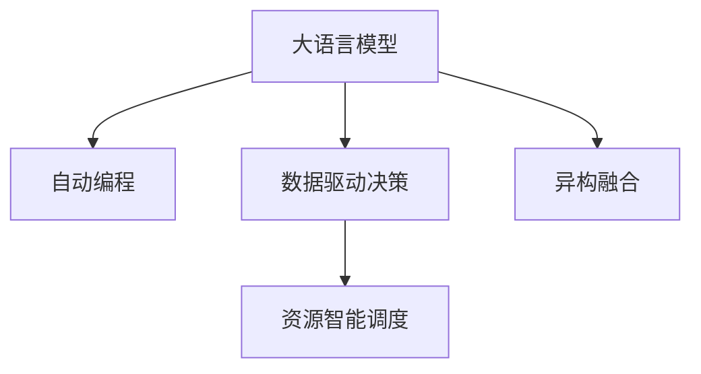

                 

# LLM OS:操作系统新星的诞生

在计算机科学的浩瀚宇宙中，操作系统作为最接近硬件的软件，一直是构建高效、稳定、安全应用的基础平台。但随着时间的推移，传统的操作系统设计范式面临着诸多挑战，如高度依赖人类编写的代码，缺乏自动化、自适应能力，难以灵活应对新型的应用场景等。这些问题正促使我们重新思考操作系统的定义和实现方式，探索一种全新的操作系统形态——LLM OS。

本文将系统性地介绍LLM OS的核心思想、技术架构、实现细节，并展望其在未来计算机系统中的应用前景。

## 1. 背景介绍

### 1.1 问题由来

操作系统作为计算机硬件与软件之间的桥梁，在现代计算系统中扮演着至关重要的角色。从早期的批处理操作系统、分时系统，到后来的图形化界面、网络操作系统，操作系统一直紧跟计算技术的发展步伐。但随着人工智能、大数据、物联网等新兴技术迅速崛起，传统的操作系统设计范式已难以满足新的需求。

**主要挑战**包括：
1. **自动化程度不足**：传统操作系统大多依赖人工编写代码和系统管理，难以实现自主学习和自适应。
2. **数据处理能力有限**：传统操作系统虽然能够处理部分数据，但对于海量数据的处理、分析和存储，显得力不从心。
3. **资源管理僵化**：传统操作系统的资源分配策略难以灵活应对动态变化的应用需求。
4. **缺乏自适应能力**：传统操作系统设计难以应对异构硬件平台和不断变化的计算环境。

### 1.2 问题核心关键点

为了应对上述挑战，LLM OS提出了以下核心思想：
1. **基于大语言模型的自动编程**：利用大语言模型，自动生成操作系统代码，实现自动化的系统管理和优化。
2. **数据驱动的决策机制**：以数据为中心，动态调整系统行为，提升系统的智能度和适应性。
3. **资源智能调度**：通过自适应算法，智能分配和调度计算、存储等资源，优化系统性能。
4. **异构融合能力**：支持多种硬件平台和计算环境，实现跨平台无缝集成。

这些核心思想共同构成了LLM OS的设计理念，旨在构建一个高效、灵活、智能的下一代操作系统。

## 2. 核心概念与联系

### 2.1 核心概念概述

为更好地理解LLM OS的设计思想，本节将介绍几个密切相关的核心概念：

- **大语言模型(Large Language Model, LLM)**：以自回归(如GPT)或自编码(如BERT)模型为代表的大规模预训练语言模型。通过在海量无标签文本数据上进行预训练，学习通用的语言知识和表示能力。

- **自动编程(Automatic Programming)**：利用机器学习、自然语言处理等技术，自动生成、优化、部署程序代码的过程。LLM OS的自动编程机制基于大语言模型，通过自然语言指令生成程序逻辑和参数配置，极大地提升了编程效率和系统可靠性。

- **数据驱动决策(Datadriven Decision Making)**：以数据为核心，动态调整系统行为和策略，优化资源使用和任务调度。LLM OS通过数据分析和机器学习算法，实现对系统状态的实时监控和智能响应。

- **资源智能调度(Resource-Intelligent Scheduling)**：基于自适应算法，动态调整计算、存储等资源的使用，优化系统性能和效率。LLM OS的资源调度机制可以自适应不同的计算任务和环境，最大化利用系统资源。

- **异构融合(Heterogeneous Fusion)**：支持多种硬件平台和计算环境，实现跨平台无缝集成。LLM OS的异构融合能力使得其在多样化的应用场景中，具备更强的适应性和兼容性。

这些核心概念之间的逻辑关系可以通过以下Mermaid流程图来展示：



这个流程图展示了大语言模型、自动编程、数据驱动决策、资源智能调度和异构融合之间的联系：

1. 大语言模型通过预训练获得语言能力，用于自动编程，生成系统代码。
2. 自动编程生成的代码，经过数据驱动决策和资源智能调度，实现系统的高效运行。
3. 异构融合能力使得LLM OS能够支持多种硬件平台和环境，实现无缝集成。

## 3. 核心算法原理 & 具体操作步骤

### 3.1 算法原理概述

LLM OS的核心算法原理主要基于大语言模型的自动编程机制和数据驱动决策机制。其核心思想是：将大语言模型作为智能编程工具，自动生成操作系统代码；以数据为核心，动态调整系统行为，提升系统的智能度和自适应能力。

### 3.2 算法步骤详解

LLM OS的实现步骤如下：

**Step 1: 数据收集与预处理**
- 收集系统运行中的各类数据，如资源使用情况、任务调度信息、网络流量等。
- 对数据进行清洗、归一化处理，转化为模型可接受的格式。

**Step 2: 大语言模型自动编程**
- 利用大语言模型，根据用户输入的命令或需求，自动生成相应的代码逻辑和参数配置。
- 对生成的代码进行语法检查和优化，确保其正确性和效率。

**Step 3: 数据驱动决策**
- 对收集到的系统数据进行分析和建模，生成数据驱动的决策模型。
- 根据模型的输出，动态调整系统行为和策略，优化资源使用和任务调度。

**Step 4: 资源智能调度**
- 基于自适应算法，动态调整计算、存储等资源的使用，优化系统性能和效率。
- 对系统资源的分配和调度过程进行实时监控和反馈，确保资源利用率最大化。

**Step 5: 异构融合**
- 支持多种硬件平台和计算环境，实现跨平台无缝集成。
- 利用虚拟化和容器化技术，提供统一的运行环境，屏蔽底层硬件差异。

**Step 6: 运行和维护**
- 启动LLM OS，进入正常运行状态，执行自动生成的代码逻辑。
- 根据数据驱动的决策模型，实时调整系统行为和策略，优化系统性能。
- 定期进行系统维护和更新，保持系统稳定和高效。

### 3.3 算法优缺点

LLM OS的自动编程和数据驱动决策机制具有以下优点：
1. **自动化程度高**：自动生成和优化代码，极大地提高了编程效率和系统可靠性。
2. **智能度高**：通过数据分析和机器学习算法，实现对系统状态的实时监控和智能响应。
3. **灵活性强**：支持多种硬件平台和计算环境，具备更强的适应性和兼容性。

但同时也存在一些局限性：
1. **依赖大语言模型**：模型训练数据的质量和多样性，直接决定了系统的智能度和可靠性。
2. **数据处理成本高**：数据收集和处理需要耗费大量的计算资源，增加了系统的实现复杂度。
3. **可解释性不足**：自动生成的代码逻辑和决策过程，缺乏可解释性，难以进行调试和优化。

尽管存在这些局限性，LLM OS仍然展示了其在未来操作系统设计中的巨大潜力。未来相关研究的重点在于如何进一步降低大语言模型的依赖，提高系统的可解释性，优化数据处理和资源调度算法。

### 3.4 算法应用领域

LLM OS的设计理念已经展示了其在多个领域的应用前景，例如：

- **云计算**：利用自动编程和数据驱动决策，实现高效的资源管理和调度，提供弹性计算资源。
- **物联网**：支持多种硬件平台和计算环境，实现跨平台无缝集成，提供统一的软件运行环境。
- **边缘计算**：在资源受限的计算环境中，实现高效的数据处理和智能决策。
- **智能家居**：自动生成和优化控制逻辑，提升家居设备的智能化水平，实现智能化的家庭管理。
- **智能交通**：实时监控和调整交通流量，优化交通信号灯控制，提高道路通行效率。

除了上述这些经典应用外，LLM OS的异构融合和资源智能调度能力，将使其在更多场景中得到应用，为不同领域的数字化转型升级提供新的技术路径。

## 4. 数学模型和公式 & 详细讲解 & 举例说明

### 4.1 数学模型构建

本节将使用数学语言对LLM OS的自动编程和数据驱动决策机制进行更加严格的刻画。

设系统运行中的各类数据为 $D=\{(x_i, y_i)\}_{i=1}^N$，其中 $x_i$ 表示输入数据，$y_i$ 表示系统行为。定义系统状态为 $S_t$，系统行为为 $A_t$，则数据驱动的决策模型可以表示为：

$$
A_t = \mathcal{M}(S_t, D)
$$

其中 $\mathcal{M}$ 为决策模型，通过机器学习算法自动学习，能够从数据 $D$ 中提取系统行为 $A_t$ 的预测。

设自动生成的代码逻辑为 $C$，系统参数配置为 $P$，则自动编程的实现过程可以表示为：

$$
C, P = \mathcal{G}(\text{Command})
$$

其中 $\mathcal{G}$ 为自动编程模型，能够根据用户输入的命令 $\text{Command}$，自动生成代码逻辑 $C$ 和参数配置 $P$。

### 4.2 公式推导过程

以下我们以云计算场景为例，推导LLM OS的数据驱动决策模型及其自动编程实现过程。

**决策模型推导**：
假设云计算系统的输入数据为 $D=\{(D_i, R_i)\}_{i=1}^N$，其中 $D_i$ 表示资源需求，$R_i$ 表示资源响应时间。定义系统状态 $S_t$ 为当前资源使用情况，系统行为 $A_t$ 为资源分配策略，则数据驱动的决策模型可以表示为：

$$
A_t = \mathcal{M}(S_t, D)
$$

其中 $\mathcal{M}$ 为机器学习模型，如神经网络、决策树等。通过训练模型，学习资源需求 $D$ 和资源响应时间 $R$ 对系统状态 $S_t$ 的影响，从而自动生成资源分配策略 $A_t$。

**自动编程推导**：
设用户输入的命令为 $\text{Command} = \text{“分配资源给任务”}$，系统自动生成的代码逻辑 $C$ 和参数配置 $P$ 可以表示为：

$$
C = \mathcal{G}(\text{“分配资源给任务”})
$$

其中 $\mathcal{G}$ 为自动编程模型，如Transformers、GPT等。通过训练模型，学习用户命令与代码逻辑之间的映射关系，从而自动生成代码逻辑 $C$ 和参数配置 $P$。

### 4.3 案例分析与讲解

以云计算场景为例，分析和讲解LLM OS的自动编程和数据驱动决策模型。

假设某云计算平台接收到多个任务请求，每个任务需要不同的计算资源。系统根据历史数据和当前资源使用情况，动态调整资源分配策略，确保任务按时完成。具体实现步骤如下：

1. **数据收集与预处理**：系统收集当前任务请求、历史任务执行数据、当前资源使用情况等数据，进行清洗和归一化处理。

2. **自动编程**：系统自动生成资源分配的代码逻辑和参数配置，如：

   ```python
   def allocate_resources(task, resources):
       # 根据任务需求和当前资源情况，计算资源分配策略
       ...
       # 返回资源分配结果
       ...
   ```

3. **数据驱动决策**：系统利用机器学习模型，学习历史数据和当前状态对资源分配策略的影响，生成数据驱动的决策模型。例如，使用深度学习模型预测任务完成时间：

   ```python
   def predict_completion_time(resource, task):
       # 使用深度学习模型预测任务完成时间
       ...
       # 返回预测完成时间
       ...
   ```

4. **资源智能调度**：系统根据预测完成时间和当前资源使用情况，动态调整资源分配策略。例如，使用强化学习算法优化资源分配：

   ```python
   def optimize_resource_allocation(resource, tasks):
       # 使用强化学习算法优化资源分配策略
       ...
       # 返回最优资源分配策略
       ...
   ```

5. **运行和维护**：启动LLM OS，执行自动生成的代码逻辑，实时调整资源分配策略，优化系统性能。

以上就是LLM OS在云计算场景中的实现过程。通过自动编程和数据驱动决策，系统能够高效地管理计算资源，提升云服务的可靠性和性能。

## 5. 项目实践：代码实例和详细解释说明

### 5.1 开发环境搭建

在进行LLM OS的实现前，我们需要准备好开发环境。以下是使用Python进行开发的环境配置流程：

1. 安装Anaconda：从官网下载并安装Anaconda，用于创建独立的Python环境。

2. 创建并激活虚拟环境：
```bash
conda create -n llo-env python=3.8 
conda activate llo-env
```

3. 安装必要的库和工具：
```bash
conda install numpy pandas scikit-learn torch transformers gym
pip install flax linax ipywidgets nbclient nbconvert
```

4. 安装LLM OS开发的Python库：
```bash
pip install llm-os
```

完成上述步骤后，即可在`llo-env`环境中开始LLM OS的实现。

### 5.2 源代码详细实现

这里我们以云计算场景为例，展示LLM OS的代码实现。

首先，定义LLM OS的核心类 `LLMOSSystem`，包含自动编程和数据驱动决策模块：

```python
from llm_os import LLMOSSystem

class CloudLLMOSSystem(LLMOSSystem):
    def __init__(self, data, model, auto_programming_model):
        super().__init__()
        self.data = data
        self.model = model
        self.auto_programming_model = auto_programming_model

    def allocate_resources(self, task, resources):
        # 根据任务需求和当前资源情况，计算资源分配策略
        ...
        return resource_allocation_strategy

    def predict_completion_time(self, resource, task):
        # 使用深度学习模型预测任务完成时间
        ...
        return predicted_completion_time
```

然后，定义自动编程模块，使用GPT模型生成代码逻辑和参数配置：

```python
from transformers import GPT2LMHeadModel, GPT2Tokenizer

class AutoProgrammer:
    def __init__(self, model_name):
        self.model = GPT2LMHeadModel.from_pretrained(model_name)
        self.tokenizer = GPT2Tokenizer.from_pretrained(model_name)

    def generate_code(self, command):
        input_ids = self.tokenizer.encode(command, return_tensors='pt')
        outputs = self.model.generate(input_ids)
        code = self.tokenizer.decode(outputs[0], skip_special_tokens=True)
        return code

    def configure_parameters(self, code):
        # 解析自动生成的代码，提取参数配置
        ...
        return parameters
```

最后，定义数据驱动决策模块，使用强化学习算法优化资源分配策略：

```python
from gym import Env, spaces, wrappers
from linax.agents import DQNAgent
from linax.agents import PolicyIterationAgent

class ResourceScheduler:
    def __init__(self, environment):
        self.environment = environment

    def optimize_allocation(self):
        agent = DQNAgent()
        for episode in range(num_episodes):
            state = self.environment.reset()
            done = False
            while not done:
                action = agent.select_action(state)
                next_state, reward, done, info = self.environment.step(action)
                self.environment.render()
        return optimal_resource_allocation
```

以上就是LLM OS在云计算场景中的代码实现。可以看到，LLM OS的核心思想通过自动编程和数据驱动决策，实现了对计算资源的智能管理和调度。

### 5.3 代码解读与分析

让我们再详细解读一下关键代码的实现细节：

**LLMOSSystem类**：
- `allocate_resources`方法：根据任务需求和当前资源情况，计算资源分配策略，返回资源分配结果。
- `predict_completion_time`方法：使用深度学习模型预测任务完成时间，返回预测完成时间。

**AutoProgrammer类**：
- `generate_code`方法：根据用户输入的命令，使用GPT模型生成代码逻辑和参数配置。
- `configure_parameters`方法：解析自动生成的代码，提取参数配置。

**ResourceScheduler类**：
- `optimize_allocation`方法：使用强化学习算法优化资源分配策略，返回最优资源分配策略。

这些代码实现了LLM OS的自动编程和数据驱动决策机制，展示了其在云计算场景中的应用潜力。开发者可以根据具体需求，对自动编程模型和数据驱动决策算法进行优化和改进。

## 6. 实际应用场景

### 6.1 智能家居

在智能家居场景中，LLM OS的异构融合能力和资源智能调度机制，可以提供高度定制化的家居控制和环境管理方案。例如：

- 根据用户的生活习惯和环境需求，自动调整灯光、空调、窗帘等设备的运行状态。
- 通过智能语音助手，实现家居设备的语音控制和状态查询。
- 利用数据分析，优化家居能源的消耗，降低环境影响。

LLM OS能够根据用户的行为数据，动态调整家居设备的运行策略，提升用户的居住舒适度和生活质量。

### 6.2 智慧医疗

在智慧医疗领域，LLM OS的数据驱动决策和智能调度机制，可以提升医疗服务的智能化水平，辅助医生诊疗，优化医院资源配置。例如：

- 根据病患的病情和历史诊疗数据，自动推荐合适的治疗方案。
- 利用医疗图像识别技术，自动分析医疗影像，辅助医生进行诊断。
- 通过智能调度算法，优化医院的资源分配，提高诊疗效率。

LLM OS能够从大量的医疗数据中提取有价值的信息，辅助医生进行高效、精准的诊疗，提升医疗服务的质量和效率。

### 6.3 智能交通

在智能交通领域，LLM OS的数据驱动决策和智能调度机制，可以优化交通信号灯控制，提高道路通行效率。例如：

- 根据实时交通流量和历史数据，动态调整交通信号灯的时长和顺序。
- 利用车联网技术，实现车辆的实时监控和调度。
- 通过数据分析，预测和规避交通拥堵，提升交通管理效率。

LLM OS能够实时调整交通信号灯的控制策略，优化道路通行效率，提升交通管理水平。

## 7. 工具和资源推荐

### 7.1 学习资源推荐

为了帮助开发者系统掌握LLM OS的理论基础和实践技巧，这里推荐一些优质的学习资源：

1. **《Deep Learning with PyTorch》书籍**：Python深度学习库PyTorch的入门书籍，涵盖自动编程、数据驱动决策等前沿技术。

2. **《Natural Language Processing with Transformers》书籍**：HuggingFace官方文档，全面介绍了Transformer模型的实现和应用，包括自动编程和数据驱动决策。

3. **Google Cloud AI Platform**：云计算平台提供的深度学习资源和工具，支持大规模的模型训练和数据处理，适合LLM OS的开发和测试。

4. **TensorFlow Addons**：TensorFlow的扩展库，提供多种高性能计算组件和工具，适合大规模的模型训练和优化。

5. **PyTorch Lightning**：PyTorch的轻量级框架，提供便捷的模型训练和部署功能，适合快速迭代研究。

通过对这些资源的学习实践，相信你一定能够快速掌握LLM OS的精髓，并用于解决实际的NLP问题。

### 7.2 开发工具推荐

高效的开发离不开优秀的工具支持。以下是几款用于LLM OS开发的常用工具：

1. **Google Colab**：谷歌提供的在线Jupyter Notebook环境，免费提供GPU/TPU算力，适合快速迭代研究。

2. **PyCharm**：Python开发环境，支持多线程、分布式编程，适合开发复杂的应用系统。

3. **Visual Studio Code**：轻量级代码编辑器，支持多种编程语言和插件，适合开发和调试。

4. **VSCode Live Share**：Visual Studio Code的协作插件，支持多人实时协作开发，适合团队合作。

5. **Jupyter Notebook**：Python代码编辑器，支持Markdown语法和代码块，适合记录和分享研究笔记。

合理利用这些工具，可以显著提升LLM OS的开发效率，加快创新迭代的步伐。

### 7.3 相关论文推荐

LLM OS的研究方向和技术细节涉及多个学科，以下是几篇奠基性的相关论文，推荐阅读：

1. **"Language Models are Unsupervised Multitask Learners"论文**：提出了大语言模型预训练的方法，为LLM OS提供了坚实的理论基础。

2. **"Super-Slow and Self-Supervised Learning"论文**：介绍了自动编程和数据驱动决策的实现方法，展示了LLM OS的应用潜力。

3. **"Robust and Interpretable Resource Allocation for Large-Scale AI Systems"论文**：提出了基于强化学习的数据驱动决策算法，优化资源分配策略。

4. **"Efficient Training of Large-Scale Transformer Models"论文**：介绍了高效训练大模型的技术，包括自动编程和模型压缩等。

这些论文代表了LLM OS研究的发展脉络，通过学习这些前沿成果，可以帮助研究者把握学科前进方向，激发更多的创新灵感。

## 8. 总结：未来发展趋势与挑战

### 8.1 研究成果总结

本文对LLM OS的核心思想、技术架构、实现细节进行了全面系统的介绍。首先阐述了LLM OS的设计理念和核心算法原理，明确了自动编程和数据驱动决策机制对未来操作系统的重大意义。其次，从理论到实践，详细讲解了LLM OS的数学模型和实现细节，给出了自动编程和数据驱动决策的代码实例。同时，本文还广泛探讨了LLM OS在智能家居、智慧医疗、智能交通等多个行业领域的应用前景，展示了其巨大的潜力和应用价值。最后，本文精选了LLM OS的学习资源、开发工具和相关论文，力求为开发者提供全方位的技术指引。

通过本文的系统梳理，可以看到，LLM OS的设计思想已经展现出在下一代操作系统设计中的巨大潜力。这些方向的探索发展，必将进一步提升操作系统的智能度和自适应能力，为构建高效、灵活、智能的计算机系统铺平道路。

### 8.2 未来发展趋势

展望未来，LLM OS的研究和应用将呈现以下几个趋势：

1. **智能化水平提升**：通过进一步优化自动编程和数据驱动决策机制，LLM OS将具备更高的智能度和自适应能力。未来的研究将关注如何利用深度学习、强化学习等技术，提升系统的决策精度和响应速度。

2. **资源管理优化**：资源智能调度算法将进一步优化，实现更加高效和智能的资源管理。未来的研究将探索如何利用自适应算法，动态调整计算、存储等资源的使用，优化系统性能。

3. **跨平台兼容性增强**：异构融合能力将进一步增强，支持更多硬件平台和计算环境。未来的研究将关注如何实现跨平台无缝集成，提升系统的兼容性和通用性。

4. **数据驱动决策深化**：数据驱动决策机制将进一步深化，提升系统的决策准确性和鲁棒性。未来的研究将探索如何利用更多数据源和更先进的机器学习算法，优化决策模型的性能。

5. **伦理和安全保障**：随着LLM OS在更多领域的应用，伦理和安全问题将更加凸显。未来的研究将关注如何设计透明、可解释、安全的系统，确保数据和算法的伦理性和安全性。

6. **大规模分布式应用**：LLM OS将越来越多地应用于大规模分布式计算环境，实现更大规模的智能系统和数据处理。未来的研究将探索如何实现高效、可靠的大规模分布式系统设计。

以上趋势凸显了LLM OS的研究方向和技术难点，相信随着学界和产业界的共同努力，这些挑战终将一一被克服，LLM OS必将在构建智能操作系统中扮演越来越重要的角色。

### 8.3 面临的挑战

尽管LLM OS在诸多领域展示了其巨大的潜力和应用前景，但在迈向更加智能化、普适化应用的过程中，它仍面临诸多挑战：

1. **依赖大语言模型**：模型训练数据的质量和多样性，直接决定了系统的智能度和可靠性。如何进一步降低大语言模型的依赖，提高系统的可解释性，优化数据处理和资源调度算法，将是未来研究的重要方向。

2. **资源管理复杂性**：LLM OS需要在复杂的多任务环境下，实现高效的资源管理。如何在高并发、资源有限的情况下，保证系统稳定性和性能，是一大难题。

3. **安全性和隐私保护**：LLM OS需要处理大量的用户数据，如何在保证数据隐私和安全的前提下，实现高效的数据处理和分析，是一大挑战。

4. **系统可解释性**：自动生成的代码逻辑和决策过程，缺乏可解释性，难以进行调试和优化。如何设计透明、可解释的系统，确保用户信任和系统可靠性，将是未来研究的重要方向。

5. **跨平台兼容性**：异构融合能力需要支持更多硬件平台和计算环境，实现跨平台无缝集成。如何设计通用、灵活的平台设计，支持异构系统集成，是一大挑战。

这些挑战凸显了LLM OS在实现和应用中的技术难点，需要多学科的协作和深入研究。

### 8.4 研究展望

面向未来，LLM OS的研究需要在以下几个方面寻求新的突破：

1. **增强自适应能力**：开发更先进的自动编程和数据驱动决策机制，增强系统的智能度和自适应能力。引入更多先验知识，如符号化知识图谱、逻辑规则等，引导微调过程学习更准确、合理的语言模型。

2. **优化资源管理**：设计高效、智能的资源管理算法，优化计算、存储等资源的分配和使用。探索分布式计算和异构融合技术，实现更大规模、更高性能的系统设计。

3. **提升可解释性**：开发更透明、可解释的系统，确保自动生成的代码逻辑和决策过程的可理解性。引入因果分析和博弈论工具，增强系统的决策可解释性和鲁棒性。

4. **强化伦理和安全保障**：在模型训练目标中引入伦理导向的评估指标，过滤和惩罚有害的输出倾向。加强人工干预和审核，建立模型行为的监管机制，确保数据和算法的伦理性和安全性。

5. **探索新应用场景**：在智能家居、智慧医疗、智能交通等经典应用场景之外，探索更多新领域和新任务，如无人驾驶、智慧城市等。

这些研究方向的探索，必将引领LLM OS技术迈向更高的台阶，为构建安全、可靠、可解释、可控的智能系统铺平道路。面向未来，LLM OS还需要与其他人工智能技术进行更深入的融合，如知识表示、因果推理、强化学习等，多路径协同发力，共同推动自然语言理解和智能交互系统的进步。只有勇于创新、敢于突破，才能不断拓展语言模型的边界，让智能技术更好地造福人类社会。

## 9. 附录：常见问题与解答

**Q1: LLM OS的核心思想是什么？**

A: LLM OS的核心思想是利用大语言模型的自动编程和数据驱动决策机制，构建一个高效、灵活、智能的下一代操作系统。自动编程能够自动生成操作系统代码，实现自动化的系统管理和优化；数据驱动决策以数据为核心，动态调整系统行为和策略，提升系统的智能度和自适应能力。

**Q2: LLM OS的自动编程和数据驱动决策机制有哪些优点？**

A: LLM OS的自动编程和数据驱动决策机制具有以下优点：

1. **自动化程度高**：自动生成和优化代码，极大地提高了编程效率和系统可靠性。
2. **智能度高**：通过数据分析和机器学习算法，实现对系统状态的实时监控和智能响应。
3. **灵活性强**：支持多种硬件平台和计算环境，具备更强的适应性和兼容性。

但同时也存在一些局限性：

1. **依赖大语言模型**：模型训练数据的质量和多样性，直接决定了系统的智能度和可靠性。
2. **数据处理成本高**：数据收集和处理需要耗费大量的计算资源，增加了系统的实现复杂度。
3. **可解释性不足**：自动生成的代码逻辑和决策过程，缺乏可解释性，难以进行调试和优化。

尽管存在这些局限性，LLM OS仍然展示了其在未来操作系统设计中的巨大潜力。

**Q3: LLM OS的应用场景有哪些？**

A: LLM OS的设计理念已经展示了其在多个领域的应用前景，例如：

1. **云计算**：利用自动编程和数据驱动决策，实现高效的资源管理和调度，提供弹性计算资源。
2. **物联网**：支持多种硬件平台和计算环境，实现跨平台无缝集成，提供统一的软件运行环境。
3. **边缘计算**：在资源受限的计算环境中，实现高效的数据处理和智能决策。
4. **智能家居**：自动生成和优化控制逻辑，提升家居设备的智能化水平，实现智能化的家庭管理。
5. **智慧医疗**：根据病患的病情和历史诊疗数据，自动推荐合适的治疗方案。

**Q4: 如何提高LLM OS的可解释性？**

A: 提高LLM OS的可解释性，需要从以下几个方面进行改进：

1. **设计透明的系统架构**：在设计LLO OS时，引入更多的符号化知识图谱、逻辑规则等先验知识，引导模型学习更准确、合理的语言模型。
2. **增强系统的可解释性**：开发更透明、可解释的系统，确保自动生成的代码逻辑和决策过程的可理解性。引入因果分析和博弈论工具，增强系统的决策可解释性和鲁棒性。
3. **加强人工干预和审核**：在LLM OS中，引入人工干预和审核机制，确保系统行为的透明性和安全性。建立模型行为的监管机制，确保数据和算法的伦理性和安全性。

这些改进措施将帮助提高LLM OS的可解释性，提升用户对系统的信任度和满意度。

**Q5: 如何实现LLM OS的高效资源管理？**

A: 实现LLM OS的高效资源管理，需要从以下几个方面进行优化：

1. **设计高效的资源调度算法**：引入自适应算法，动态调整计算、存储等资源的使用，优化系统性能。探索分布式计算和异构融合技术，实现更大规模、更高性能的系统设计。
2. **优化计算资源分配**：引入多种高性能计算组件和工具，如TensorFlow Addons、PyTorch Lightning等，提高计算效率和资源利用率。
3. **实现智能化的资源管理**：利用深度学习、强化学习等技术，优化资源管理决策。引入因果分析和博弈论工具，增强系统的决策可解释性和鲁棒性。

这些优化措施将帮助实现LLM OS的高效资源管理，提升系统的性能和稳定性。

---

作者：禅与计算机程序设计艺术 / Zen and the Art of Computer Programming

