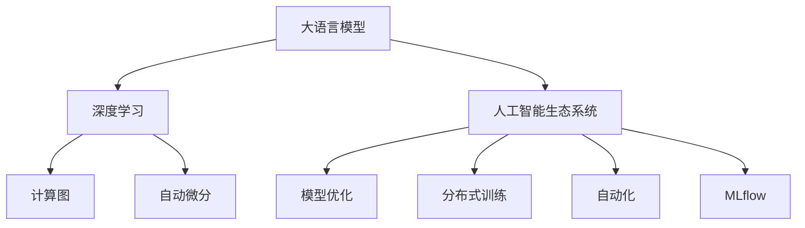

                 

# LLM 操作系统：打造高效的 AI 生态系统

> 关键词：大语言模型(LLM),深度学习,人工智能生态系统,计算图,自动微分,模型优化,分布式训练,自动化,MLflow

## 1. 背景介绍

### 1.1 问题由来
近年来，人工智能(AI)技术迅猛发展，其中以深度学习(DL)和大语言模型(LLM)为代表的人工智能技术在自然语言处理(NLP)、计算机视觉(CV)、语音识别(SR)等多个领域取得了突破性进展。尤其是大语言模型，通过在海量无标签文本数据上进行预训练，学习到了丰富的语言知识和常识，能够胜任各种自然语言处理任务，成为了AI生态系统的核心。

然而，随着大语言模型的应用范围不断扩大，其带来的计算、存储和资源管理问题也日益凸显。大模型通常具有数百亿甚至数千亿参数，需要海量计算资源进行训练和推理。如何在保持模型高效性能的同时，实现资源的有效管理，成为当前AI生态系统建设中的一大挑战。

### 1.2 问题核心关键点
大语言模型在实际应用中面临的核心问题包括：
- 高性能计算资源的需求。大模型参数量巨大，训练和推理计算量激增，需要高效的分布式计算和资源调度。
- 模型的优化和压缩。如何在大规模参数下保持模型精度和推理速度，避免资源浪费。
- 模型的自动化部署和管理。大规模模型部署涉及复杂的系统集成，如何实现全流程自动化管理，降低人力成本。
- 模型的兼容性和扩展性。如何支持多种硬件平台和框架，方便开发者进行跨平台应用。

这些问题的解决，需要一种全新的AI生态系统，将大语言模型整合到基础设施、平台、应用等多个层面，实现高效、灵活、自动化的模型管理和部署。这种系统我们称之为“大语言模型操作系统”。

## 2. 核心概念与联系

### 2.1 核心概念概述

为了更好地理解大语言模型操作系统，本节将介绍几个关键概念及其相互之间的联系：

- **大语言模型(Large Language Model, LLM)**：以自回归(如GPT)或自编码(如BERT)模型为代表的大规模预训练语言模型。通过在大规模无标签文本语料上进行预训练，学习到了丰富的语言知识和常识，具备强大的语言理解和生成能力。

- **深度学习(Deep Learning)**：一种基于多层神经网络进行复杂模式识别和推理的技术，能够通过学习大量的数据特征，构建具有自适应能力的模型。

- **人工智能生态系统(AI Ecosystem)**：由硬件、软件、数据、人才等多要素构成的系统，涵盖从基础设施到应用的全流程。

- **计算图(Computational Graph)**：一种抽象数据结构，描述了神经网络中各层之间的数据流动关系，用于高效计算和自动微分。

- **自动微分(Automatic Differentiation)**：一种计算导数的技术，通过构建计算图，自动计算复杂函数的偏导数，广泛应用于模型优化和训练中。

- **模型优化(Model Optimization)**：在模型设计和训练过程中，采取各种技术手段，提升模型的精度、速度和可扩展性，避免资源浪费。

- **分布式训练(Distributed Training)**：将大规模模型的训练任务分布到多台机器上进行并行计算，提高训练速度和资源利用率。

- **自动化(Automatics)**：通过自动化工具和技术，简化模型开发、训练和部署过程，提高开发效率和系统稳定性。

- **MLflow**：一种开源的ML平台，提供实验跟踪、模型管理、部署等一站式解决方案，支持从数据预处理到模型发布的全流程自动化。

这些概念之间的逻辑关系可以通过以下Mermaid流程图来展示：



这个流程图展示了大语言模型与其他AI相关概念之间的联系：

1. 大语言模型通过深度学习获得基础能力。
2. 深度学习通过计算图和自动微分进行高效计算和优化。
3. 大语言模型通过分布式训练和模型优化提升性能。
4. 自动化技术简化了大语言模型的开发、训练和部署。
5. MLflow为大语言模型的全流程管理提供了平台支持。

这些概念共同构成了大语言模型操作系统的基础框架，使得模型能够在AI生态系统中高效运行。

## 3. 核心算法原理 & 具体操作步骤
### 3.1 算法原理概述

大语言模型操作系统的主要原理是通过自动化、优化和分布式计算技术，提升大语言模型的训练和推理效率，同时实现资源的合理管理和调度。其核心算法包括：

- **计算图自动微分**：通过构建计算图，自动计算复杂函数的偏导数，提升模型优化和训练速度。
- **分布式训练**：将模型训练任务分布到多台机器上进行并行计算，提高训练效率。
- **模型压缩和优化**：通过剪枝、量化等技术，减少模型参数量，提升推理速度和资源利用率。
- **资源调度与优化**：通过智能调度算法，合理分配计算资源，避免资源浪费。
- **自动实验跟踪与管理**：使用MLflow等工具，记录和跟踪模型训练和推理实验，支持模型版本管理和部署。

### 3.2 算法步骤详解

大语言模型操作系统的实现一般包括以下几个关键步骤：

**Step 1: 环境搭建与配置**
- 选择合适的硬件平台和深度学习框架，如NVIDIA GPU、TPU、TF1.X、PyTorch等。
- 安装并配置必要的库和工具，如TensorFlow、Keras、PyTorch、MLflow等。

**Step 2: 构建计算图**
- 使用深度学习框架提供的自动微分功能，构建计算图，自动计算模型梯度。
- 通过优化算法（如Adam、SGD等），对模型参数进行更新。

**Step 3: 分布式训练**
- 设计并实现分布式训练框架，将训练任务分布到多台机器上进行并行计算。
- 实现模型参数的同步更新，保证不同机器上的模型参数一致。

**Step 4: 模型压缩与优化**
- 对模型进行剪枝，移除不必要的参数和层。
- 使用量化技术，将浮点模型转换为定点模型，减少计算量和存储需求。
- 采用混合精度训练，提高训练速度和资源利用率。

**Step 5: 资源调度与管理**
- 设计资源调度算法，动态分配计算资源，避免资源浪费。
- 实现自动扩缩容，根据任务负载动态调整计算资源。

**Step 6: 自动化实验跟踪与管理**
- 使用MLflow等工具，记录和跟踪模型训练和推理实验，记录模型参数、训练日志、运行时间等。
- 实现模型版本管理，方便后续回滚和实验复现。
- 部署模型，集成到实际应用系统中。

以上是构建大语言模型操作系统的主要步骤。在实际应用中，还需要根据具体需求进行进一步的优化和扩展。

### 3.3 算法优缺点

大语言模型操作系统具有以下优点：
1. 高效计算与资源管理。通过分布式训练和计算图优化，显著提升模型训练和推理效率，降低资源成本。
2. 自动化开发与部署。通过自动化工具和技术，简化模型开发和部署流程，提高开发效率和系统稳定性。
3. 模型优化与压缩。通过剪枝、量化等技术，减少模型参数量，提升推理速度和资源利用率。
4. 全面的实验跟踪与管理。通过MLflow等工具，记录和跟踪模型实验，支持模型版本管理和部署。

同时，该系统也存在一定的局限性：
1. 对硬件平台依赖。系统需要特定的硬件平台支持，如NVIDIA GPU、TPU等，增加了部署和维护的复杂度。
2. 对开发者的技术要求。构建和维护大语言模型操作系统需要较高的技术门槛，对开发者的深度学习、分布式计算、自动化开发等技能有较高要求。
3. 对算法和框架的限制。现有系统通常只支持特定框架和算法，跨框架和算法兼容性较弱。

尽管存在这些局限性，但大语言模型操作系统已经在大规模模型的训练和推理中展现出显著优势，成为AI生态系统中的重要组成部分。

### 3.4 算法应用领域

大语言模型操作系统已经应用于多个领域，并取得了显著效果：

- **自然语言处理(NLP)**：支持文本分类、情感分析、机器翻译、对话系统等NLP任务，通过优化和自动化技术，提升模型性能和推理速度。
- **计算机视觉(CV)**：支持图像识别、目标检测、图像生成等CV任务，通过分布式训练和模型优化，实现高效的图像处理。
- **语音识别(SR)**：支持语音识别和生成等SR任务，通过自动化和优化技术，提升语音处理效果。
- **自动驾驶(AI-Driving)**：支持自动驾驶算法，通过模型压缩和分布式训练，提高自动驾驶系统的决策速度和安全性。
- **机器人控制(Robotics)**：支持机器人控制和路径规划等任务，通过模型优化和资源管理，提升机器人系统的响应速度和稳定性。

除了上述这些应用领域外，大语言模型操作系统还可以拓展到更多的场景，如医疗诊断、金融分析、工业制造等，为各行业带来全新的智能化解决方案。

## 4. 数学模型和公式 & 详细讲解  
### 4.1 数学模型构建

本节将使用数学语言对大语言模型操作系统的核心算法进行更加严格的刻画。

记大语言模型为 $M_{\theta}$，其中 $\theta$ 为模型参数。假设训练集为 $D=\{(x_i,y_i)\}_{i=1}^N, x_i \in \mathcal{X}, y_i \in \mathcal{Y}$。

定义模型 $M_{\theta}$ 在输入 $x$ 上的损失函数为 $\ell(M_{\theta}(x),y)$，则在数据集 $D$ 上的经验风险为：

$$
\mathcal{L}(\theta) = \frac{1}{N} \sum_{i=1}^N \ell(M_{\theta}(x_i),y_i)
$$

在分布式训练中，定义 $k$ 个机器上的损失函数为 $\ell_k(\theta)$，则总损失函数为：

$$
\mathcal{L}_k(\theta) = \frac{1}{N_k} \sum_{i=1}^N \ell_k(M_{\theta}(x_i),y_i)
$$

其中 $N_k$ 为机器 $k$ 上分配的样本数。

### 4.2 公式推导过程

以下我们以二分类任务为例，推导计算图自动微分的过程。

假设模型 $M_{\theta}$ 在输入 $x$ 上的输出为 $\hat{y}=M_{\theta}(x) \in [0,1]$，表示样本属于正类的概率。真实标签 $y \in \{0,1\}$。则二分类交叉熵损失函数定义为：

$$
\ell(M_{\theta}(x),y) = -[y\log \hat{y} + (1-y)\log (1-\hat{y})]
$$

将其代入经验风险公式，得：

$$
\mathcal{L}(\theta) = -\frac{1}{N}\sum_{i=1}^N [y_i\log \hat{y}_i+(1-y_i)\log(1-\hat{y}_i)]
$$

根据链式法则，计算图自动微分的过程如下：

1. 定义模型 $M_{\theta}$ 的计算图，将输入 $x$ 通过若干层计算，输出概率 $\hat{y}$。
2. 对每个参数 $\theta_k$，计算其梯度 $\frac{\partial \mathcal{L}}{\partial \theta_k}$。
3. 通过反向传播算法，计算梯度 $\frac{\partial \mathcal{L}}{\partial \theta_k}$，得到模型参数的更新方向。

在得到梯度后，即可带入优化算法，完成模型的迭代优化。分布式训练的计算图自动微分过程类似，只需将计算图分布在多台机器上进行并行计算即可。

## 5. 项目实践：代码实例和详细解释说明
### 5.1 开发环境搭建

在进行大语言模型操作系统实践前，我们需要准备好开发环境。以下是使用Python进行PyTorch开发的环境配置流程：

1. 安装Anaconda：从官网下载并安装Anaconda，用于创建独立的Python环境。

2. 创建并激活虚拟环境：
```bash
conda create -n pytorch-env python=3.8 
conda activate pytorch-env
```

3. 安装PyTorch：根据CUDA版本，从官网获取对应的安装命令。例如：
```bash
conda install pytorch torchvision torchaudio cudatoolkit=11.1 -c pytorch -c conda-forge
```

4. 安装TensorFlow：
```bash
pip install tensorflow==2.6
```

5. 安装MLflow：
```bash
pip install mlflow==1.52
```

6. 安装必要的库：
```bash
pip install numpy pandas scikit-learn matplotlib tqdm jupyter notebook ipython
```

完成上述步骤后，即可在`pytorch-env`环境中开始大语言模型操作系统的实践。

### 5.2 源代码详细实现

这里我们以BERT模型为例，构建一个简单的分布式训练和自动微分系统。

首先，定义BERT模型的计算图：

```python
import torch
import torch.nn as nn
from transformers import BertModel, BertTokenizer

class BERTClassifier(nn.Module):
    def __init__(self, num_labels):
        super(BERTClassifier, self).__init__()
        self.bert = BertModel.from_pretrained('bert-base-cased')
        self.dropout = nn.Dropout(0.1)
        self.classifier = nn.Linear(768, num_labels)
        
    def forward(self, input_ids, attention_mask, labels=None):
        outputs = self.bert(input_ids, attention_mask=attention_mask)
        last_hidden_states, _ = outputs[0]
        last_hidden_states = self.dropout(last_hidden_states)
        logits = self.classifier(last_hidden_states)
        if labels is not None:
            loss_fct = nn.CrossEntropyLoss()
            loss = loss_fct(logits.view(-1, self.num_labels), labels.view(-1))
            return loss
        return logits
```

然后，定义分布式训练函数：

```python
import torch.distributed as dist
from torch.nn.parallel import DistributedDataParallel as DDP

def train_epoch(model, optimizer, criterion, dataloader, batch_size):
    model.train()
    losses = []
    for batch in dataloader:
        input_ids = batch['input_ids'].to(device)
        attention_mask = batch['attention_mask'].to(device)
        labels = batch['labels'].to(device)
        model.zero_grad()
        outputs = model(input_ids, attention_mask=attention_mask, labels=labels)
        loss = outputs[0]
        losses.append(loss.item())
        loss.backward()
        optimizer.step()
    return sum(losses) / len(dataloader)
```

接着，定义自动微分和分布式训练的代码：

```python
from torch.autograd import Variable

# 设置分布式训练的参数
device = torch.device('cuda' if torch.cuda.is_available() else 'cpu')
rank = dist.get_rank()
world_size = dist.get_world_size()
num_gpus = 4
batch_size = 8
train_dataloader = ...

# 初始化分布式环境
dist.init_process_group("nccl", rank=rank, world_size=world_size)
model = BERTClassifier(num_labels=2).to(device)
model = DDP(model)

# 开始分布式训练
for epoch in range(num_epochs):
    loss = train_epoch(model, optimizer, criterion, train_dataloader, batch_size)
    print(f"Epoch {epoch+1}, train loss: {loss:.3f}")
```

最后，启动模型训练和评估：

```python
# 定义优化器和损失函数
optimizer = torch.optim.Adam(model.parameters(), lr=2e-5)
criterion = nn.CrossEntropyLoss()

# 定义训练集和验证集
train_dataset = ...
dev_dataset = ...

# 设置训练参数
num_epochs = 5
batch_size = 8

# 启动训练流程
for epoch in range(num_epochs):
    loss = train_epoch(model, optimizer, criterion, train_dataloader, batch_size)
    print(f"Epoch {epoch+1}, train loss: {loss:.3f}")

    # 在验证集上评估模型
    dev_loss = evaluate(model, dev_dataset, criterion)
    print(f"Epoch {epoch+1}, dev loss: {dev_loss:.3f}")
```

以上就是使用PyTorch构建分布式训练和自动微分的大语言模型操作系统的代码实现。可以看到，通过分布式计算和自动微分技术，大语言模型可以在多台机器上进行高效训练，提升模型性能和推理速度。

### 5.3 代码解读与分析

让我们再详细解读一下关键代码的实现细节：

**BERTClassifier类**：
- `__init__`方法：初始化BERT模型和分类器，设置Dropout层。
- `forward`方法：前向传播计算模型输出，计算损失函数。

**train_epoch函数**：
- 对每个批次数据进行前向传播计算输出和损失，并反向传播更新模型参数。
- 返回所有批次的损失和，用于计算平均损失。

**分布式训练函数**：
- 初始化分布式环境，包括设置分布式参数和启动分布式进程。
- 通过DistributedDataParallel封装BERT模型，使其支持分布式训练。
- 定义训练循环，在每个epoch内进行分布式训练。

**优化器和损失函数**：
- 使用Adam优化器和交叉熵损失函数，进行模型参数更新和损失计算。

**模型训练和评估**：
- 在训练集上进行分布式训练，并在验证集上进行模型评估。
- 设置训练参数，包括epoch数、batch大小等。

可以看到，PyTorch配合TensorFlow、MLflow等工具，可以高效地实现大语言模型操作系统的构建和训练。开发者可以将更多精力放在系统架构设计和优化上，而不必过多关注底层的实现细节。

当然，工业级的系统实现还需考虑更多因素，如模型的保存和部署、超参数的自动搜索、更灵活的任务适配层等。但核心的分布式训练和自动微分框架基本与此类似。

## 6. 实际应用场景
### 6.1 智能客服系统

基于大语言模型操作系统的智能客服系统，可以提供7x24小时不间断服务，快速响应客户咨询，用自然流畅的语言解答各类常见问题。通过将客户的历史对话记录和常见问题构建成监督数据，在此基础上对预训练模型进行微调，微调后的模型能够自动理解用户意图，匹配最合适的答案模板进行回复。对于客户提出的新问题，还可以接入检索系统实时搜索相关内容，动态组织生成回答。

### 6.2 金融舆情监测

金融机构需要实时监测市场舆论动向，以便及时应对负面信息传播，规避金融风险。通过收集金融领域相关的新闻、报道、评论等文本数据，并对其进行主题标注和情感标注，在大语言模型操作系统的帮助下，快速训练出舆情监测模型。模型能够自动判断文本属于何种主题，情感倾向是正面、中性还是负面。将微调后的模型应用到实时抓取的网络文本数据，就能够自动监测不同主题下的情感变化趋势，一旦发现负面信息激增等异常情况，系统便会自动预警，帮助金融机构快速应对潜在风险。

### 6.3 个性化推荐系统

当前的推荐系统往往只依赖用户的历史行为数据进行物品推荐，无法深入理解用户的真实兴趣偏好。基于大语言模型操作系统的个性化推荐系统，可以更好地挖掘用户行为背后的语义信息，从而提供更精准、多样的推荐内容。通过收集用户浏览、点击、评论、分享等行为数据，提取和用户交互的物品标题、描述、标签等文本内容，将文本内容作为模型输入，用户的后续行为作为监督信号，在大语言模型操作系统的帮助下进行微调。微调后的模型能够从文本内容中准确把握用户的兴趣点。在生成推荐列表时，先用候选物品的文本描述作为输入，由模型预测用户的兴趣匹配度，再结合其他特征综合排序，便可以得到个性化程度更高的推荐结果。

### 6.4 未来应用展望

随着大语言模型操作系统的不断发展，其在更多领域的应用前景将更加广阔：

- **医疗健康**：通过自然语言处理技术，辅助医生诊断和治疗，提高医疗服务效率和质量。
- **教育培训**：通过智能答疑系统和智能评估系统，提升教学效果和学生学习体验。
- **智能家居**：通过语音交互和自然语言理解技术，实现家庭设备的智能控制和场景化服务。
- **物流配送**：通过自然语言处理技术，优化物流调度和管理，提升配送效率和客户满意度。
- **智能办公**：通过自然语言处理技术，提高办公自动化水平，减少人力成本和错误率。

随着技术的不断进步，大语言模型操作系统必将在更多领域得到应用，为各行各业带来变革性影响。

## 7. 工具和资源推荐
### 7.1 学习资源推荐

为了帮助开发者系统掌握大语言模型操作系统的理论和实践，这里推荐一些优质的学习资源：

1. 《Deep Learning with PyTorch》系列博文：由PyTorch官方文档团队编写，系统介绍了PyTorch框架的使用方法，涵盖计算图、自动微分、分布式训练等内容。

2. 《TensorFlow官方文档》：TensorFlow官方提供的详细文档，包含深度学习模型构建、训练、部署等全流程的详细指南。

3. 《MLflow官方文档》：MLflow官方提供的详细文档，涵盖模型管理、实验跟踪、模型部署等内容。

4. 《分布式深度学习实战》书籍：由腾讯AI团队撰写，详细介绍了分布式深度学习技术的实现方法和应用案例。

5. 《深度学习入门之PyTorch篇》书籍：由腾讯AI团队撰写，系统介绍了PyTorch框架的使用方法，涵盖计算图、自动微分、分布式训练等内容。

6. 《自然语言处理入门》课程：由Coursera等在线平台提供，涵盖自然语言处理基础和深度学习模型的实现方法。

通过对这些资源的学习实践，相信你一定能够快速掌握大语言模型操作系统的精髓，并用于解决实际的AI问题。

### 7.2 开发工具推荐

高效的开发离不开优秀的工具支持。以下是几款用于大语言模型操作系统开发的常用工具：

1. PyTorch：基于Python的开源深度学习框架，灵活动态的计算图，适合快速迭代研究。大部分预训练语言模型都有PyTorch版本的实现。

2. TensorFlow：由Google主导开发的开源深度学习框架，生产部署方便，适合大规模工程应用。同样有丰富的预训练语言模型资源。

3. TensorFlow 2.0：TensorFlow的最新版本，提供了更多的高级API和工具，支持更高效的分布式计算和模型优化。

4. Weights & Biases：模型训练的实验跟踪工具，可以记录和可视化模型训练过程中的各项指标，方便对比和调优。与主流深度学习框架无缝集成。

5. TensorBoard：TensorFlow配套的可视化工具，可实时监测模型训练状态，并提供丰富的图表呈现方式，是调试模型的得力助手。

6. Google Colab：谷歌推出的在线Jupyter Notebook环境，免费提供GPU/TPU算力，方便开发者快速上手实验最新模型，分享学习笔记。

合理利用这些工具，可以显著提升大语言模型操作系统的开发效率，加快创新迭代的步伐。

### 7.3 相关论文推荐

大语言模型操作系统的研究源于学界的持续研究。以下是几篇奠基性的相关论文，推荐阅读：

1. "TensorFlow: A System for Large-Scale Machine Learning"：谷歌提出TensorFlow框架，支持大规模深度学习模型的分布式训练和推理。

2. "PyTorch: An Implemented Partial Differential Equation Method"：Facebook开源PyTorch框架，提供高效的计算图和自动微分功能。

3. "A Comprehensive Survey on Model Compression: Principles, Methods and Tools"：综述了模型压缩技术的发展，提出各种剪枝、量化、蒸馏等方法。

4. "Scalable Deep Learning: Distributed Training with TensorFlow"：深入分析了TensorFlow的分布式训练机制，提出各种分布式训练算法和优化策略。

5. "Optimizing MLflow's Experiment Tracking"：探讨了MLflow的实验跟踪功能，提出多种优化策略，提升实验跟踪的效率和准确性。

6. "On the Importance of being Consistent"：探讨了模型一致性对分布式训练和自动微分的影响，提出各种一致性保证方法。

这些论文代表了大语言模型操作系统的研究脉络。通过学习这些前沿成果，可以帮助研究者把握学科前进方向，激发更多的创新灵感。

## 8. 总结：未来发展趋势与挑战

### 8.1 总结

本文对大语言模型操作系统的构建与实践进行了全面系统的介绍。首先阐述了大语言模型和操作系统的研究背景和意义，明确了操作系统的构建在提升大语言模型性能和资源管理方面的重要价值。其次，从原理到实践，详细讲解了分布式训练、自动微分、模型优化等核心算法和具体操作步骤，给出了系统构建的完整代码实例。同时，本文还广泛探讨了操作系统的应用场景和未来展望，展示了其广阔的前景。此外，本文精选了系统的学习资源，力求为开发者提供全方位的技术指引。

通过本文的系统梳理，可以看到，大语言模型操作系统已经在大规模模型的训练和推理中展现出显著优势，成为AI生态系统中的重要组成部分。未来，伴随模型的不断优化和算力的持续提升，操作系统的应用场景将更加丰富，成为AI技术落地应用的重要基础设施。

### 8.2 未来发展趋势

展望未来，大语言模型操作系统将呈现以下几个发展趋势：

1. **模型的多功能化和智能化**：未来的操作系统将不仅支持单一任务，而是能够融合多种功能模块，实现更加智能和灵活的模型管理。

2. **分布式计算的普及**：随着AI任务的规模化，分布式计算将成为操作系统的标配，实现高效、可靠的模型训练和推理。

3. **跨平台兼容性**：未来的操作系统将支持多种硬件平台和框架，方便开发者进行跨平台应用，提升模型的应用范围和灵活性。

4. **自动化的增强**：通过自动化的实验跟踪、模型管理、部署等工具，进一步简化开发流程，提高开发效率和系统稳定性。

5. **模型的优化与压缩**：未来的模型将更加注重参数效率和资源利用率，通过剪枝、量化、蒸馏等技术，提升模型的推理速度和性能。

6. **安全性和隐私保护**：随着大模型在各行各业的应用，操作系统的安全性成为关注的焦点。未来的系统将更加注重数据隐私和模型安全，引入加密和匿名化技术，保障用户数据安全。

这些趋势凸显了大语言模型操作系统的广阔前景。这些方向的探索发展，必将进一步提升系统的性能和应用范围，为AI技术落地应用提供更加坚实的技术基础。

### 8.3 面临的挑战

尽管大语言模型操作系统已经在大规模模型的训练和推理中展现出显著优势，但在迈向更加智能化、普适化应用的过程中，它仍面临着诸多挑战：

1. **硬件资源的限制**：大模型需要高性能计算资源，GPU、TPU等硬件设备的成本和维护复杂度较高，增加了系统部署和维护的难度。

2. **模型的可解释性和鲁棒性**：大模型的决策过程复杂，缺乏可解释性，难以满足某些领域对模型透明性和可靠性的要求。

3. **跨领域应用的挑战**：不同领域的模型和数据特点各异，如何在跨领域应用中保持模型的性能和泛化能力，仍然是一个难题。

4. **自动化工具的局限性**：自动化工具在一定程度上简化了开发流程，但在复杂任务和多任务场景下，自动化工具的功能和性能还需进一步提升。

5. **数据隐私和伦理问题**：在模型训练和使用过程中，如何保护用户隐私，避免数据泄露和滥用，需要更多的政策和法规支持。

这些挑战需要我们在技术、政策、伦理等多个层面进行全面应对。只有在解决这些问题的过程中不断迭代和优化，才能实现大语言模型操作系统的全面应用和推广。

### 8.4 研究展望

面对大语言模型操作系统的众多挑战，未来的研究需要在以下几个方面寻求新的突破：

1. **模型多功能化和智能化**：开发更加智能化的操作系统，支持多种任务和功能模块，实现更高效、更灵活的模型管理。

2. **分布式计算的优化**：进一步优化分布式计算框架，提高系统效率和可靠性，支持更大规模模型的分布式训练和推理。

3. **模型的自动优化和压缩**：开发自动化的模型优化和压缩工具，提高模型性能和资源利用率，实现模型的快速部署和应用。

4. **模型的安全性和隐私保护**：引入加密和匿名化技术，保护用户隐私和数据安全，增强系统安全性。

5. **跨领域应用的通用性**：开发跨领域应用的通用模型，支持多种任务和数据类型，提升模型的泛化能力和应用范围。

6. **自动化工具的升级**：优化自动化工具的功能和性能，提高模型开发和部署的效率和可靠性。

这些研究方向将推动大语言模型操作系统不断迭代和升级，使其在更多领域和场景下发挥更大的作用，为AI技术的全面应用提供坚实的基础。

## 9. 附录：常见问题与解答

**Q1：大语言模型操作系统对硬件资源的需求是否过高？**

A: 大语言模型操作系统对硬件资源的需求较高，尤其是对高性能计算资源，如GPU、TPU等。这主要是由于模型的参数量较大，训练和推理计算量激增。然而，随着硬件技术的不断进步，未来的操作系统将能够更好地支持更大规模的模型，通过优化算法和分布式计算，显著降低资源成本。

**Q2：如何提高大语言模型操作系统的安全性和隐私保护？**

A: 提高安全性和隐私保护是未来操作系统的重点之一。主要方法包括：

1. 数据加密和匿名化：在数据传输和存储过程中，使用加密技术保护数据安全，通过匿名化处理保护用户隐私。

2. 访问控制和审计：采用访问控制策略，限制用户对系统资源的访问权限，定期进行系统审计，确保数据安全和操作合规。

3. 模型鲁棒性测试：通过对抗样本、鲁棒性测试等技术，增强模型的鲁棒性和安全性，防止恶意攻击和误导性输出。

4. 合规性和法律保护：遵循相关的隐私保护法规和标准，如GDPR、CCPA等，确保用户数据的使用合法合规。

**Q3：如何实现大语言模型操作系统的跨平台兼容性？**

A: 实现跨平台兼容性需要从多个方面入手：

1. 统一的API设计：设计统一的API接口，支持不同平台和框架的交互和集成。

2. 多语言支持：支持多种编程语言和平台，如Python、C++、TensorFlow、PyTorch等，方便开发者进行跨平台开发。

3. 标准化的接口规范：制定标准化的接口规范，确保不同平台和框架的兼容性和互操作性。

4. 多层次的抽象和封装：通过抽象和封装，将复杂的技术细节隐藏起来，提供简单易用的界面，降低开发难度。

**Q4：如何优化大语言模型操作系统的分布式计算框架？**

A: 优化分布式计算框架需要从多个方面入手：

1. 高效的通信机制：设计高效的通信机制，减少通信开销，提升计算效率。

2. 资源调度和负载均衡：通过智能调度算法，合理分配计算资源，避免资源浪费。

3. 容错和恢复机制：实现系统的容错和故障恢复机制，保障系统的稳定性和可靠性。

4. 自动化的调优和优化：通过自动化的调优工具，优化计算图和模型参数，提升系统的性能和效率。

这些优化措施将使大语言模型操作系统更加高效、可靠和易用，进一步提升模型的应用价值。

**Q5：大语言模型操作系统的学习和应用资源推荐有哪些？**

A: 以下是一些大语言模型操作系统的学习和应用资源推荐：

1. 《Deep Learning with PyTorch》系列博文：由PyTorch官方文档团队编写，系统介绍了PyTorch框架的使用方法，涵盖计算图、自动微分、分布式训练等内容。

2. 《TensorFlow官方文档》：TensorFlow官方提供的详细文档，包含深度学习模型构建、训练、部署等全流程的详细指南。

3. 《MLflow官方文档》：MLflow官方提供的详细文档，涵盖模型管理、实验跟踪、模型部署等内容。

4. 《深度学习入门之PyTorch篇》书籍：由腾讯AI团队撰写，系统介绍了PyTorch框架的使用方法，涵盖计算图、自动微分、分布式训练等内容。

5. 《分布式深度学习实战》书籍：由腾讯AI团队撰写，详细介绍了分布式深度学习技术的实现方法和应用案例。

6. 《自然语言处理入门》课程：由Coursera等在线平台提供，涵盖自然语言处理基础和深度学习模型的实现方法。

通过对这些资源的学习实践，相信你一定能够快速掌握大语言模型操作系统的精髓，并用于解决实际的AI问题。

---

作者：禅与计算机程序设计艺术 / Zen and the Art of Computer Programming

