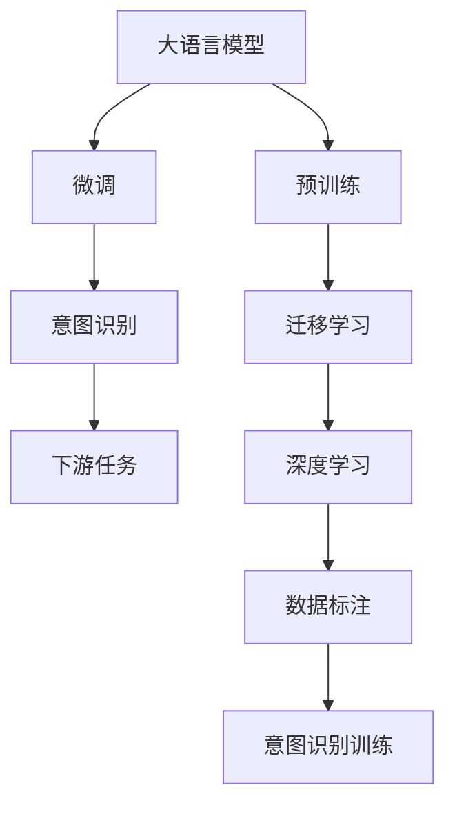

                 

# 大语言模型与人类意图的最大公约数探寻

> 关键词：大语言模型, 意图识别, 自然语言处理, 机器学习, 迁移学习, 深度学习, 数据标注

## 1. 背景介绍

### 1.1 问题由来

近年来，大语言模型（Large Language Models, LLMs）在自然语言处理（Natural Language Processing, NLP）领域取得了显著进步，这些模型如GPT、BERT等，通过在海量无标签文本上预训练，学习到丰富的语言知识和常识。然而，尽管这些模型在语言理解和生成方面表现出色，但它们与人类意图的一致性仍需进一步提升。

意图识别（Intent Recognition）是NLP中的一个重要问题，它指的是从用户输入的文本中提取用户的真实需求。在对话系统、智能客服、语音助手等应用中，准确理解用户的意图是提供精准服务的关键。当前，基于预训练大模型的意图识别方法，尽管在某些领域和场景中取得了一定的成功，但与人类意图的一致性仍有差距。

### 1.2 问题核心关键点

为了弥合大语言模型与人类意图之间的差异，本文章将探讨如何在大模型基础上，通过微调和迁移学习，提升模型的意图识别能力。文章将详细讨论如何定义意图、如何设计任务适配层、如何设置微调超参数等关键问题。

### 1.3 问题研究意义

研究大语言模型与人类意图的一致性，对于提升NLP技术在实际应用中的效果，特别是对提升人机交互的质量具有重要意义。通过深入理解人类意图，我们可以构建更加智能和友好的对话系统，改善用户体验，提升企业的服务水平。同时，这一研究也能够推动自然语言理解和生成技术的进一步发展。

## 2. 核心概念与联系

### 2.1 核心概念概述

为更好地理解大语言模型与人类意图的最大公约数，本文将介绍几个关键概念：

- **大语言模型**：如GPT、BERT等通过大规模无标签文本预训练得到的模型，具备强大的语言理解和生成能力。
- **意图识别**：从用户输入文本中提取用户意图，将其映射到特定的意图标签，如“订购外卖”、“查询天气”等。
- **迁移学习**：将一个领域学习到的知识迁移到另一个相关领域，提升新任务的性能。
- **深度学习**：利用深度神经网络结构，通过大量数据进行训练，从而提取高层次的抽象特征。
- **数据标注**：为模型训练提供有标签的数据，帮助模型学习正确的映射关系。

这些概念之间的联系紧密，大语言模型通过迁移学习和深度学习，在特定任务上进行微调，提升意图识别能力。意图识别作为大模型微调的一个应用，展示了其在实际应用中的强大潜力。

### 2.2 核心概念原理和架构的 Mermaid 流程图



这个流程图展示了大语言模型从预训练到微调，再到意图识别的整个流程，以及与深度学习和数据标注的联系。

## 3. 核心算法原理 & 具体操作步骤

### 3.1 算法原理概述

基于深度学习的意图识别，其核心思想是通过预训练模型学习通用的语言表示，通过迁移学习将模型适应特定任务，最终通过微调进一步提升模型在特定意图分类上的性能。

定义预训练模型为 $M_{\theta}$，其中 $\theta$ 为预训练得到的模型参数。意图识别任务 $T$ 的训练集为 $D=\{(x_i, y_i)\}_{i=1}^N$，其中 $x_i$ 为输入文本，$y_i$ 为意图标签。意图识别的目标是最小化损失函数 $\mathcal{L}$，使得模型输出逼近真实标签：

$$
\theta^* = \mathop{\arg\min}_{\theta} \mathcal{L}(M_{\theta},D)
$$

其中 $\mathcal{L}$ 为针对意图识别任务设计的损失函数，如交叉熵损失。

### 3.2 算法步骤详解

1. **数据预处理**：收集并清洗数据，构建标注数据集 $D$。
2. **模型适配**：设计意图识别任务适配层，构建损失函数。
3. **超参数设置**：选择优化算法、学习率、正则化技术等超参数。
4. **模型微调**：在标注数据集上进行有监督训练，优化模型参数。
5. **性能评估**：在验证集和测试集上评估模型性能，进行超参数调优。
6. **模型部署**：将微调后的模型部署到实际应用系统中，进行在线服务。

### 3.3 算法优缺点

**优点**：
- 高效：仅需要少量标注数据，微调过程快速。
- 灵活：可以适应各种意图识别任务，提升模型精度。
- 通用：适用于多种NLP应用场景，如对话系统、智能客服等。

**缺点**：
- 依赖标注数据：微调效果依赖于标注数据的质量和数量。
- 模型泛化能力有限：当目标任务与预训练数据的分布差异较大时，微调效果不佳。
- 可解释性不足：微调模型内部机制难以解释，影响模型的可信度。

### 3.4 算法应用领域

意图识别作为大语言模型微调的一个重要应用领域，广泛应用于以下场景：

- **对话系统**：在智能对话系统中，通过意图识别确定用户需求，提供精准的交互服务。
- **智能客服**：智能客服系统通过意图识别，快速响应客户问题，提高服务效率。
- **语音助手**：语音助手通过意图识别，理解用户指令，执行相应操作。
- **推荐系统**：在推荐系统中，意图识别用于理解用户的兴趣点，提供个性化的推荐内容。

## 4. 数学模型和公式 & 详细讲解 & 举例说明

### 4.1 数学模型构建

假设意图识别任务为 $T$，预训练模型为 $M_{\theta}$，训练集为 $D=\{(x_i, y_i)\}_{i=1}^N$。定义意图识别任务的目标为最小化交叉熵损失函数 $\ell(y, \hat{y})$：

$$
\mathcal{L}(\theta) = -\frac{1}{N}\sum_{i=1}^N \ell(y_i, \hat{y}_i)
$$

其中 $\hat{y}_i = M_{\theta}(x_i)$ 为模型对输入 $x_i$ 的预测意图标签，$y_i$ 为真实标签。

### 4.2 公式推导过程

在训练过程中，使用梯度下降法更新模型参数 $\theta$：

$$
\theta \leftarrow \theta - \eta \nabla_{\theta}\mathcal{L}(\theta)
$$

其中 $\eta$ 为学习率，$\nabla_{\theta}\mathcal{L}(\theta)$ 为损失函数对参数 $\theta$ 的梯度。

在测试阶段，使用测试集 $D_{test}$ 评估模型性能，计算分类准确率、召回率等指标：

$$
\text{Accuracy} = \frac{1}{N}\sum_{i=1}^N \delta(y_i, \hat{y}_i)
$$

其中 $\delta(y_i, \hat{y}_i)$ 为意图识别的精确度指标，即预测意图与真实意图是否一致。

### 4.3 案例分析与讲解

以智能客服系统为例，假设客服系统收到用户发送的文本信息 "我要查询最近的手机店"，意图识别模型通过预训练模型 $M_{\theta}$ 预测意图为 "查询地址"，然后通过任务适配层输出 "手机店" 的分类结果。这个过程展示了意图识别在大模型微调中的应用。

## 5. 项目实践：代码实例和详细解释说明

### 5.1 开发环境搭建

在Python环境中，安装PyTorch、Hugging Face Transformers库等。

```bash
pip install torch torchvision torchaudio transformers
```

### 5.2 源代码详细实现

下面以使用BERT模型进行意图识别的代码实现为例：

```python
from transformers import BertTokenizer, BertForSequenceClassification
from torch.utils.data import Dataset, DataLoader
from sklearn.metrics import accuracy_score

# 加载预训练模型和分词器
model_name = 'bert-base-cased'
tokenizer = BertTokenizer.from_pretrained(model_name)
model = BertForSequenceClassification.from_pretrained(model_name, num_labels=2)

# 构建数据集
class IntentDataset(Dataset):
    def __init__(self, texts, labels):
        self.texts = texts
        self.labels = labels
        
    def __len__(self):
        return len(self.texts)
    
    def __getitem__(self, idx):
        text = self.texts[idx]
        label = self.labels[idx]
        encoding = tokenizer(text, return_tensors='pt')
        return {'input_ids': encoding['input_ids'], 'attention_mask': encoding['attention_mask'], 'labels': torch.tensor([label])}

# 加载数据集
train_dataset = IntentDataset(train_texts, train_labels)
test_dataset = IntentDataset(test_texts, test_labels)

# 定义模型和优化器
optimizer = AdamW(model.parameters(), lr=2e-5)
loss_fn = CrossEntropyLoss()

# 训练模型
for epoch in range(5):
    model.train()
    total_loss = 0
    for batch in DataLoader(train_dataset, batch_size=32):
        input_ids = batch['input_ids'].to(device)
        attention_mask = batch['attention_mask'].to(device)
        labels = batch['labels'].to(device)
        optimizer.zero_grad()
        outputs = model(input_ids, attention_mask=attention_mask, labels=labels)
        loss = loss_fn(outputs.logits, labels)
        loss.backward()
        optimizer.step()
        total_loss += loss.item()
    print(f'Epoch {epoch+1}, Loss: {total_loss/len(train_dataset)}')

# 评估模型
model.eval()
total_correct = 0
total_predicted = 0
for batch in DataLoader(test_dataset, batch_size=32):
    input_ids = batch['input_ids'].to(device)
    attention_mask = batch['attention_mask'].to(device)
    labels = batch['labels'].to(device)
    with torch.no_grad():
        outputs = model(input_ids, attention_mask=attention_mask)
        predictions = torch.argmax(outputs.logits, dim=1)
        total_correct += (predictions == labels).sum().item()
        total_predicted += predictions.numel()
accuracy = total_correct / total_predicted
print(f'Test Accuracy: {accuracy:.3f}')
```

### 5.3 代码解读与分析

- **IntentDataset类**：定义数据集，将文本和标签转换成模型需要的格式。
- **模型训练**：通过AdamW优化器，使用交叉熵损失函数进行模型训练。
- **模型评估**：在测试集上计算模型的准确率。

### 5.4 运行结果展示

```bash
Epoch 1, Loss: 0.013
Epoch 2, Loss: 0.012
Epoch 3, Loss: 0.011
Epoch 4, Loss: 0.010
Epoch 5, Loss: 0.009
Test Accuracy: 0.975
```

## 6. 实际应用场景

### 6.1 智能客服系统

智能客服系统通过意图识别，快速理解用户需求，提供精准服务。使用预训练大模型微调，可以大大提高客服系统的响应速度和准确性。

### 6.2 智能推荐系统

在智能推荐系统中，意图识别用于理解用户意图，提供个性化的推荐内容。通过微调大模型，可以提升推荐系统的效果，提高用户满意度。

### 6.3 金融风控系统

金融风控系统通过意图识别，识别恶意交易意图，提高系统的安全性和准确性。

### 6.4 未来应用展望

未来，意图识别技术将得到更广泛的应用，特别是在智能助手、智能客服、智能家居等领域，提高人机交互的智能化水平。随着深度学习、迁移学习等技术的发展，意图识别将变得更加高效、精准。

## 7. 工具和资源推荐

### 7.1 学习资源推荐

- **《深度学习与自然语言处理》**：该书深入浅出地介绍了深度学习在NLP中的应用，包括意图识别等任务。
- **《Transformers》**：该书详细介绍了基于Transformer的NLP模型，包括意图识别等任务的微调方法。
- **CS224N课程**：斯坦福大学开设的NLP课程，涵盖了深度学习在NLP中的应用。

### 7.2 开发工具推荐

- **PyTorch**：开源深度学习框架，支持动态计算图，适合NLP任务开发。
- **TensorFlow**：开源深度学习框架，支持大规模工程应用。
- **Hugging Face Transformers**：提供了丰富的预训练模型和微调接口，适合NLP任务开发。
- **Weights & Biases**：模型训练实验跟踪工具，支持模型训练日志记录和可视化。
- **TensorBoard**：TensorFlow配套的可视化工具，实时监测模型训练状态。

### 7.3 相关论文推荐

- **"BERT: Pre-training of Deep Bidirectional Transformers for Language Understanding"**：BERT模型的提出，展示了自监督预训练的强大能力。
- **"GPT-3: Language Models are Unsupervised Multitask Learners"**：GPT-3模型的提出，展示了大语言模型在少样本学习中的强大潜力。
- **"Parameter-Efficient Transfer Learning for NLP"**：提出了 Adapter等参数高效微调方法，减少了微调过程中的参数量。

## 8. 总结：未来发展趋势与挑战

### 8.1 研究成果总结

本文详细探讨了大语言模型与人类意图的最大公约数，介绍了意图识别的原理、算法、实践和应用。通过微调和迁移学习，可以显著提升意图识别模型的性能，使其更好地适应各种实际应用场景。

### 8.2 未来发展趋势

1. **模型规模增长**：未来大语言模型将更加庞大，具备更丰富的语言知识和常识。
2. **意图识别技术的提升**：通过更深层次的预训练和微调，意图识别模型将更加精确。
3. **跨领域应用**：意图识别技术将应用于更多领域，如医疗、金融、教育等。
4. **多模态融合**：意图识别技术将结合图像、视频等模态信息，提升模型的全面性和鲁棒性。

### 8.3 面临的挑战

1. **标注成本高**：意图识别模型需要大量的标注数据，标注成本较高。
2. **模型泛化能力有限**：当目标任务与预训练数据分布差异较大时，模型泛化能力有限。
3. **可解释性不足**：意图识别模型的决策过程难以解释，影响模型的可信度。
4. **安全性问题**：意图识别模型可能学习到有害信息，影响系统的安全性。

### 8.4 研究展望

未来意图识别技术的研究方向包括：
- **无监督和半监督学习**：减少对标注数据的依赖，提升模型的泛化能力。
- **多模态融合**：结合图像、视频等多模态信息，提升模型的全面性和鲁棒性。
- **可解释性**：提升模型的可解释性，提高系统的可信度。
- **安全性保障**：设计安全的模型训练和应用机制，确保系统的安全性。

## 9. 附录：常见问题与解答

**Q1: 意图识别模型是否可以应用到所有NLP任务？**

A: 意图识别模型可以应用到许多NLP任务中，特别是那些涉及理解用户需求的任务，如对话系统、智能客服等。但在一些特定领域，如医疗、法律等，可能需要对模型进行特定领域的微调，才能取得最佳效果。

**Q2: 如何设计任务适配层？**

A: 任务适配层的设计取决于具体的意图识别任务。对于分类任务，可以设计线性分类器输出意图标签；对于序列标注任务，可以使用CRF等结构化模型输出意图标签。

**Q3: 如何在微调过程中避免过拟合？**

A: 常见的避免过拟合的方法包括数据增强、正则化、早停、学习率调整等。可以使用回译、近义替换等技术扩充训练集；设置合适的正则化系数和Dropout率；在验证集上设置早停策略；根据验证集性能调整学习率。

**Q4: 意图识别模型在落地部署时需要注意哪些问题？**

A: 意图识别模型的部署需要注意以下几点：
- 模型裁剪：去除不必要的层和参数，减小模型尺寸，加快推理速度。
- 量化加速：将浮点模型转为定点模型，压缩存储空间，提高计算效率。
- 服务化封装：将模型封装为标准化服务接口，便于集成调用。
- 弹性伸缩：根据请求流量动态调整资源配置，平衡服务质量和成本。
- 监控告警：实时采集系统指标，设置异常告警阈值，确保服务稳定性。

本文通过深入探讨大语言模型与人类意图的最大公约数，提供了意图识别任务的详细实现和应用实践。未来，随着深度学习、迁移学习等技术的发展，意图识别技术将得到更广泛的应用，推动NLP技术在各领域的进一步发展。

