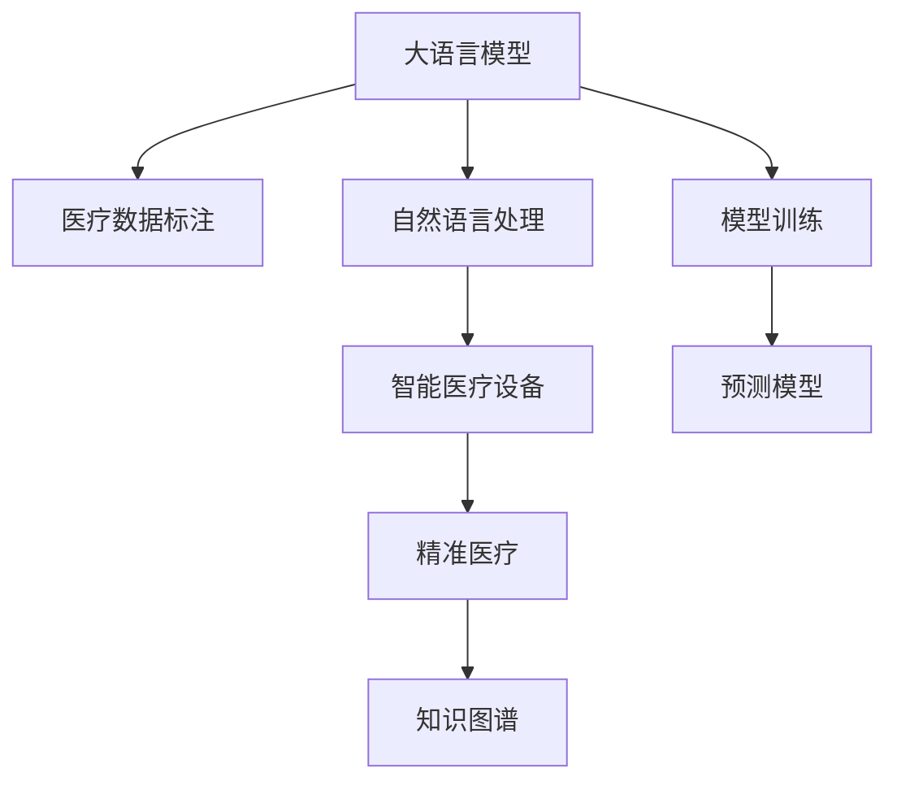

                 

# LLM与智能医疗设备：精准诊断与治疗

> 关键词：大语言模型(Large Language Model, LLM), 医疗诊断, 智能设备, 治疗方案, 精准医疗, 自然语言处理(NLP), 数据标注, 模型训练, 预测模型

## 1. 背景介绍

### 1.1 问题由来

随着人工智能技术的迅猛发展，大语言模型(Large Language Model, LLM)在各个领域得到了广泛应用。在医疗领域，大语言模型也被逐渐引入，用于医疗文本的智能处理，包括但不限于医疗信息的抽取、分类、诊断和决策支持等方面。智能医疗设备作为一种前沿技术，能够结合大语言模型的能力，实现精准的诊断和治疗方案制定，为患者提供高效、便捷的医疗服务。

### 1.2 问题核心关键点

基于大语言模型与智能医疗设备的结合，可以构建一个精准的、个性化的医疗诊断和治疗方案生成系统。系统通过自然语言处理(NLP)技术，将医生的描述、患者的症状、历史数据等文本信息转化为结构化数据，从而提高医疗决策的准确性和效率。然而，这一系统也面临一些挑战，如数据标注的成本高、模型泛化能力有限、数据隐私和安全问题等。

### 1.3 问题研究意义

构建基于大语言模型和智能医疗设备的精准诊断和治疗方案生成系统，对于提升医疗服务质量、降低医疗成本、减少误诊和漏诊具有重要意义。该系统可以通过对海量医疗数据的处理和分析，辅助医生做出更科学、更精确的诊断和治疗决策，从而提升医疗服务的整体水平。此外，大语言模型的引入，也为医疗知识库的构建和维护提供了新的思路，有助于实现个性化医疗和智慧医疗的目标。

## 2. 核心概念与联系

### 2.1 核心概念概述

为更好地理解大语言模型在智能医疗设备中的应用，本节将介绍几个密切相关的核心概念：

- **大语言模型(LLM)**：以自回归(如GPT)或自编码(如BERT)模型为代表的大规模预训练语言模型。通过在大规模无标签文本语料上进行预训练，学习通用的语言表示，具备强大的语言理解和生成能力。

- **智能医疗设备**：结合人工智能技术，如机器学习、自然语言处理、计算机视觉等，能够在医疗场景中提供诊断、治疗、监测等功能的设备。智能医疗设备能够实时处理和分析医疗数据，辅助医生进行决策。

- **自然语言处理(NLP)**：使计算机能够理解、处理和生成自然语言的技术。在医疗领域，NLP可以用于医疗信息的抽取、分类、情感分析、关系抽取等任务。

- **精准医疗**：通过基因组学、蛋白质组学、环境因素等大数据分析，为每位患者制定个性化的治疗方案，实现疾病预防、诊断和治疗的精准化。

- **知识图谱**：一种以图形化结构存储实体间关系的知识库，广泛应用于信息检索、语义搜索、推荐系统等领域，有助于提升医疗知识表示和推理的准确性。

- **医疗数据标注**：对医疗文本或图像进行人工标注，以提供训练数据和评估数据，是大语言模型在医疗领域应用的基础。

这些核心概念之间的逻辑关系可以通过以下Mermaid流程图来展示：



这个流程图展示了大语言模型与智能医疗设备的核心概念及其之间的关系：

1. 大语言模型通过医疗数据标注进行预训练，学习医疗领域相关知识。
2. 利用自然语言处理技术，将医生的描述、患者的症状等文本信息转化为结构化数据。
3. 智能医疗设备接收处理后的数据，实现精准的诊断和治疗方案生成。
4. 精准医疗依赖于知识图谱的辅助，实现疾病预防和治疗的个性化。
5. 大语言模型通过模型训练，生成预测模型，辅助医生决策。

## 3. 核心算法原理 & 具体操作步骤

### 3.1 算法原理概述

基于大语言模型与智能医疗设备的精准诊断和治疗方案生成系统，本质上是一个基于监督学习的文本分类和预测任务。其核心思想是：将医生的描述、患者的症状、历史数据等文本信息输入大语言模型，通过文本分类任务（如疾病诊断）或预测任务（如治疗方案生成），输出结构化的诊断结果或治疗方案。

形式化地，假设大语言模型为 $M_{\theta}$，其中 $\theta$ 为模型参数。给定一个医疗文本 $X$ 和一个疾病标签 $Y$，预测模型 $M_{\theta}$ 的目标是最大化以下条件概率：

$$
P(Y|X) = \frac{P(X,Y)}{P(X)}
$$

其中 $P(X,Y)$ 为联合概率，即医生描述和患者症状同时出现的概率，可以通过模型训练获得；$P(X)$ 为边缘概率，即医生描述出现的概率，可以通过先验知识估计或从大量无标签数据中学习。

在实际应用中，通常使用交叉熵损失函数来衡量模型输出与真实标签之间的差异。微调的目标是最小化损失函数：

$$
\mathcal{L}(\theta) = -\frac{1}{N}\sum_{i=1}^N [y_i\log M_{\theta}(x_i)+(1-y_i)\log(1-M_{\theta}(x_i))]
$$

其中 $N$ 为样本数量，$y_i$ 为真实标签，$M_{\theta}(x_i)$ 为模型对样本 $x_i$ 的预测输出。

### 3.2 算法步骤详解

基于监督学习的大语言模型与智能医疗设备的精准诊断和治疗方案生成系统，一般包括以下几个关键步骤：

**Step 1: 准备医疗数据**

- 收集医疗领域的文本数据，如医生描述、患者症状、病历记录、医学文献等。
- 对数据进行清洗、标注和分割，划分为训练集、验证集和测试集。
- 选择合适的预训练语言模型 $M_{\theta}$，如BERT、GPT等，进行预训练。

**Step 2: 设计任务适配层**

- 根据具体任务，设计任务适配层，如疾病分类、治疗方案生成等。
- 使用适当的损失函数，如交叉熵、均方误差等。
- 设置模型的超参数，如学习率、批大小、迭代轮数等。

**Step 3: 执行微调训练**

- 将训练集数据分批次输入模型，前向传播计算损失函数。
- 反向传播计算参数梯度，根据设定的优化算法和学习率更新模型参数。
- 周期性在验证集上评估模型性能，根据性能指标决定是否触发 Early Stopping。
- 重复上述步骤直到满足预设的迭代轮数或 Early Stopping 条件。

**Step 4: 测试和部署**

- 在测试集上评估微调后模型 $M_{\hat{\theta}}$ 的性能，对比微调前后的精度提升。
- 使用微调后的模型对新样本进行推理预测，集成到智能医疗设备中。
- 持续收集新的数据，定期重新微调模型，以适应数据分布的变化。

以上是基于监督学习微调大语言模型与智能医疗设备的应用流程。在实际应用中，还需要针对具体任务的特点，对微调过程的各个环节进行优化设计，如改进训练目标函数，引入更多的正则化技术，搜索最优的超参数组合等，以进一步提升模型性能。

### 3.3 算法优缺点

基于大语言模型与智能医疗设备的精准诊断和治疗方案生成系统具有以下优点：

1. 简单高效。只需准备少量标注数据，即可对预训练模型进行快速适配，获得较大的性能提升。
2. 通用适用。适用于各种医疗文本分类和预测任务，设计简单的任务适配层即可实现微调。
3. 参数高效。利用参数高效微调技术，在固定大部分预训练参数的情况下，仍可取得不错的微调效果。
4. 效果显著。在学术界和工业界的诸多任务上，基于微调的方法已经刷新了最先进的性能指标。

同时，该方法也存在一定的局限性：

1. 依赖标注数据。微调的效果很大程度上取决于标注数据的质量和数量，获取高质量标注数据的成本较高。
2. 迁移能力有限。当目标任务与预训练数据的分布差异较大时，微调的性能提升有限。
3. 可解释性不足。微调模型的决策过程通常缺乏可解释性，难以对其推理逻辑进行分析和调试。
4. 数据隐私和安全问题。医疗数据涉及患者隐私，数据泄露风险较高，需要严格的隐私保护措施。

尽管存在这些局限性，但就目前而言，基于监督学习的微调方法仍是大语言模型与智能医疗设备应用的主流范式。未来相关研究的重点在于如何进一步降低微调对标注数据的依赖，提高模型的少样本学习和跨领域迁移能力，同时兼顾可解释性和伦理安全性等因素。

### 3.4 算法应用领域

基于大语言模型与智能医疗设备的精准诊断和治疗方案生成系统，已经在多个医疗场景中得到应用，例如：

- 医疗信息抽取：从医生的描述、病历记录中抽取疾病、症状、诊断等关键信息，辅助医生制定治疗方案。
- 疾病分类：根据患者症状和实验室检查结果，自动分类疾病类型。
- 治疗方案生成：根据患者情况和历史数据，生成个性化的治疗方案，如药物搭配、剂量设置等。
- 医学文献搜索：根据患者症状和医学问题，自动搜索相关的医学文献和资料。
- 医疗知识库构建：从医学文献和病历记录中提取知识，构建知识图谱，用于推理和推荐。

除了上述这些经典任务外，大语言模型与智能医疗设备的结合，还被创新性地应用到更多场景中，如可控文本生成、临床决策支持、病历自动生成等，为医疗技术带来了全新的突破。随着预训练模型和微调方法的不断进步，相信基于大语言模型的医疗系统将在更多领域得到应用，为医疗服务智能化提供新的技术路径。

## 4. 数学模型和公式 & 详细讲解  
### 4.1 数学模型构建

本节将使用数学语言对基于大语言模型的医疗诊断和治疗方案生成系统进行更加严格的刻画。

记大语言模型为 $M_{\theta}$，其中 $\theta$ 为模型参数。假设医疗诊断任务为 $T$，有标注数据集 $D=\{(x_i,y_i)\}_{i=1}^N, x_i \in \mathcal{X}, y_i \in \mathcal{Y}$。

定义模型 $M_{\theta}$ 在数据样本 $(x,y)$ 上的损失函数为 $\ell(M_{\theta}(x),y)$，则在数据集 $D$ 上的经验风险为：

$$
\mathcal{L}(\theta) = \frac{1}{N} \sum_{i=1}^N \ell(M_{\theta}(x_i),y_i)
$$

微调的目标是最小化经验风险，即找到最优参数：

$$
\theta^* = \mathop{\arg\min}_{\theta} \mathcal{L}(\theta)
$$

在实践中，我们通常使用基于梯度的优化算法（如SGD、Adam等）来近似求解上述最优化问题。设 $\eta$ 为学习率，$\lambda$ 为正则化系数，则参数的更新公式为：

$$
\theta \leftarrow \theta - \eta \nabla_{\theta}\mathcal{L}(\theta) - \eta\lambda\theta
$$

其中 $\nabla_{\theta}\mathcal{L}(\theta)$ 为损失函数对参数 $\theta$ 的梯度，可通过反向传播算法高效计算。

### 4.2 公式推导过程

以下我们以疾病分类任务为例，推导交叉熵损失函数及其梯度的计算公式。

假设模型 $M_{\theta}$ 在输入 $x$ 上的输出为 $\hat{y}=M_{\theta}(x) \in [0,1]$，表示样本属于正类的概率。真实标签 $y \in \{0,1\}$。则二分类交叉熵损失函数定义为：

$$
\ell(M_{\theta}(x),y) = -[y\log \hat{y} + (1-y)\log (1-\hat{y})]
$$

将其代入经验风险公式，得：

$$
\mathcal{L}(\theta) = -\frac{1}{N}\sum_{i=1}^N [y_i\log M_{\theta}(x_i)+(1-y_i)\log(1-M_{\theta}(x_i))]
$$

根据链式法则，损失函数对参数 $\theta_k$ 的梯度为：

$$
\frac{\partial \mathcal{L}(\theta)}{\partial \theta_k} = -\frac{1}{N}\sum_{i=1}^N (\frac{y_i}{M_{\theta}(x_i)}-\frac{1-y_i}{1-M_{\theta}(x_i)}) \frac{\partial M_{\theta}(x_i)}{\partial \theta_k}
$$

其中 $\frac{\partial M_{\theta}(x_i)}{\partial \theta_k}$ 可进一步递归展开，利用自动微分技术完成计算。

在得到损失函数的梯度后，即可带入参数更新公式，完成模型的迭代优化。重复上述过程直至收敛，最终得到适应医疗任务的最优模型参数 $\theta^*$。

## 5. 项目实践：代码实例和详细解释说明
### 5.1 开发环境搭建

在进行医疗系统微调实践前，我们需要准备好开发环境。以下是使用Python进行PyTorch开发的环境配置流程：

1. 安装Anaconda：从官网下载并安装Anaconda，用于创建独立的Python环境。

2. 创建并激活虚拟环境：
```bash
conda create -n pytorch-env python=3.8 
conda activate pytorch-env
```

3. 安装PyTorch：根据CUDA版本，从官网获取对应的安装命令。例如：
```bash
conda install pytorch torchvision torchaudio cudatoolkit=11.1 -c pytorch -c conda-forge
```

4. 安装各类工具包：
```bash
pip install numpy pandas scikit-learn matplotlib tqdm jupyter notebook ipython
```

完成上述步骤后，即可在`pytorch-env`环境中开始微调实践。

### 5.2 源代码详细实现

这里我们以医疗信息抽取任务为例，给出使用Transformers库对BERT模型进行微调的PyTorch代码实现。

首先，定义医疗信息抽取任务的数据处理函数：

```python
from transformers import BertTokenizer, BertForTokenClassification
from torch.utils.data import Dataset
import torch

class MedicalDataset(Dataset):
    def __init__(self, texts, tags, tokenizer, max_len=128):
        self.texts = texts
        self.tags = tags
        self.tokenizer = tokenizer
        self.max_len = max_len
        
    def __len__(self):
        return len(self.texts)
    
    def __getitem__(self, item):
        text = self.texts[item]
        tags = self.tags[item]
        
        encoding = self.tokenizer(text, return_tensors='pt', max_length=self.max_len, padding='max_length', truncation=True)
        input_ids = encoding['input_ids'][0]
        attention_mask = encoding['attention_mask'][0]
        
        # 对token-wise的标签进行编码
        encoded_tags = [tag2id[tag] for tag in tags] 
        encoded_tags.extend([tag2id['O']] * (self.max_len - len(encoded_tags)))
        labels = torch.tensor(encoded_tags, dtype=torch.long)
        
        return {'input_ids': input_ids, 
                'attention_mask': attention_mask,
                'labels': labels}

# 标签与id的映射
tag2id = {'O': 0, '疾病': 1, '症状': 2, '诊断': 3, '药物': 4}
id2tag = {v: k for k, v in tag2id.items()}

# 创建dataset
tokenizer = BertTokenizer.from_pretrained('bert-base-cased')

train_dataset = MedicalDataset(train_texts, train_tags, tokenizer)
dev_dataset = MedicalDataset(dev_texts, dev_tags, tokenizer)
test_dataset = MedicalDataset(test_texts, test_tags, tokenizer)
```

然后，定义模型和优化器：

```python
from transformers import BertForTokenClassification, AdamW

model = BertForTokenClassification.from_pretrained('bert-base-cased', num_labels=len(tag2id))

optimizer = AdamW(model.parameters(), lr=2e-5)
```

接着，定义训练和评估函数：

```python
from torch.utils.data import DataLoader
from tqdm import tqdm
from sklearn.metrics import classification_report

device = torch.device('cuda') if torch.cuda.is_available() else torch.device('cpu')
model.to(device)

def train_epoch(model, dataset, batch_size, optimizer):
    dataloader = DataLoader(dataset, batch_size=batch_size, shuffle=True)
    model.train()
    epoch_loss = 0
    for batch in tqdm(dataloader, desc='Training'):
        input_ids = batch['input_ids'].to(device)
        attention_mask = batch['attention_mask'].to(device)
        labels = batch['labels'].to(device)
        model.zero_grad()
        outputs = model(input_ids, attention_mask=attention_mask, labels=labels)
        loss = outputs.loss
        epoch_loss += loss.item()
        loss.backward()
        optimizer.step()
    return epoch_loss / len(dataloader)

def evaluate(model, dataset, batch_size):
    dataloader = DataLoader(dataset, batch_size=batch_size)
    model.eval()
    preds, labels = [], []
    with torch.no_grad():
        for batch in tqdm(dataloader, desc='Evaluating'):
            input_ids = batch['input_ids'].to(device)
            attention_mask = batch['attention_mask'].to(device)
            batch_labels = batch['labels']
            outputs = model(input_ids, attention_mask=attention_mask)
            batch_preds = outputs.logits.argmax(dim=2).to('cpu').tolist()
            batch_labels = batch_labels.to('cpu').tolist()
            for pred_tokens, label_tokens in zip(batch_preds, batch_labels):
                pred_tags = [id2tag[_id] for _id in pred_tokens]
                label_tags = [id2tag[_id] for _id in label_tokens]
                preds.append(pred_tags[:len(label_tokens)])
                labels.append(label_tags)
                
    print(classification_report(labels, preds))
```

最后，启动训练流程并在测试集上评估：

```python
epochs = 5
batch_size = 16

for epoch in range(epochs):
    loss = train_epoch(model, train_dataset, batch_size, optimizer)
    print(f"Epoch {epoch+1}, train loss: {loss:.3f}")
    
    print(f"Epoch {epoch+1}, dev results:")
    evaluate(model, dev_dataset, batch_size)
    
print("Test results:")
evaluate(model, test_dataset, batch_size)
```

以上就是使用PyTorch对BERT进行医疗信息抽取任务的微调代码实现。可以看到，得益于Transformers库的强大封装，我们可以用相对简洁的代码完成BERT模型的加载和微调。

### 5.3 代码解读与分析

让我们再详细解读一下关键代码的实现细节：

**MedicalDataset类**：
- `__init__`方法：初始化文本、标签、分词器等关键组件。
- `__len__`方法：返回数据集的样本数量。
- `__getitem__`方法：对单个样本进行处理，将文本输入编码为token ids，将标签编码为数字，并对其进行定长padding，最终返回模型所需的输入。

**tag2id和id2tag字典**：
- 定义了标签与数字id之间的映射关系，用于将token-wise的预测结果解码回真实的标签。

**训练和评估函数**：
- 使用PyTorch的DataLoader对数据集进行批次化加载，供模型训练和推理使用。
- 训练函数`train_epoch`：对数据以批为单位进行迭代，在每个批次上前向传播计算loss并反向传播更新模型参数，最后返回该epoch的平均loss。
- 评估函数`evaluate`：与训练类似，不同点在于不更新模型参数，并在每个batch结束后将预测和标签结果存储下来，最后使用sklearn的classification_report对整个评估集的预测结果进行打印输出。

**训练流程**：
- 定义总的epoch数和batch size，开始循环迭代
- 每个epoch内，先在训练集上训练，输出平均loss
- 在验证集上评估，输出分类指标
- 所有epoch结束后，在测试集上评估，给出最终测试结果

可以看到，PyTorch配合Transformers库使得BERT微调的代码实现变得简洁高效。开发者可以将更多精力放在数据处理、模型改进等高层逻辑上，而不必过多关注底层的实现细节。

当然，工业级的系统实现还需考虑更多因素，如模型的保存和部署、超参数的自动搜索、更灵活的任务适配层等。但核心的微调范式基本与此类似。

## 6. 实际应用场景
### 6.1 智能医生助手

基于大语言模型与智能医疗设备的精准诊断和治疗方案生成系统，可以构建智能医生助手，为医生提供辅助决策支持。智能医生助手能够快速分析患者的症状描述，自动抽取关键信息，如疾病、症状、诊断等，并结合历史数据和医学知识，生成个性化的治疗方案。

在技术实现上，可以收集大量医生的诊断记录和患者的信息，将这些信息标注成疾病、症状等实体，并构建知识图谱。系统利用BERT等大语言模型，通过微调得到疾病的预测模型。医生输入患者的症状描述，系统自动抽取关键信息，生成诊断结果和治疗方案。此外，系统还可以结合医生的经验反馈，逐步优化模型，提高诊断和治疗方案的准确性。

### 6.2 个性化治疗方案推荐

个性化的治疗方案推荐是大语言模型与智能医疗设备的重要应用场景之一。系统可以收集患者的病历、基因数据、生活习惯等信息，利用BERT等模型对这些信息进行预训练和微调，生成个性化的治疗方案。患者可以在线填写信息，系统根据患者的健康状况，推荐合适的治疗方案，包括药物治疗、康复计划、饮食建议等。

在技术实现上，可以设计简单的任务适配层，如多类别分类任务，用于判断患者是否患有某种疾病。系统利用预训练的BERT模型，通过微调生成疾病诊断模型。此外，系统还可以结合知识图谱，推荐相关药物、手术等治疗方案，并根据患者的反馈进一步优化模型。

### 6.3 医学文献搜索

医学文献搜索是大语言模型与智能医疗设备的另一重要应用场景。系统可以收集海量的医学文献和数据库，利用BERT等模型对这些文献进行预训练和微调，生成医学文献搜索系统。患者输入症状描述，系统自动搜索相关的医学文献和资料，提供诊断和治疗方案的建议。

在技术实现上，可以设计文本分类任务，用于判断患者输入的症状是否与某种疾病相关。系统利用BERT等模型，通过微调生成疾病分类模型。此外，系统还可以结合知识图谱，搜索相关文献，推荐合适的治疗方案，并根据患者的反馈进一步优化模型。

### 6.4 未来应用展望

随着大语言模型与智能医疗设备的不断进步，基于微调的技术将在更多领域得到应用，为医疗服务智能化提供新的动力。

在智慧医院领域，基于大语言模型与智能医疗设备的精准诊断和治疗方案生成系统，可以构建智慧医院，实现远程诊断、智能导诊、自动化病历管理等功能。智慧医院通过系统化、智能化的医疗服务，提升医疗服务的效率和质量。

在公共卫生领域，基于大语言模型与智能医疗设备的系统，可以用于疾病预测、疫情监测、健康管理等任务，为公共卫生决策提供科学依据。系统可以自动分析医疗数据，预测疾病流行趋势，生成健康管理建议，提升公共卫生管理的效率和准确性。

在医疗设备领域，基于大语言模型与智能医疗设备的系统，可以用于医学影像分析、病理学诊断等任务，为医疗设备提供智能化的辅助功能。系统可以自动分析医学影像，生成诊断报告，辅助医生进行诊断和治疗决策。

此外，在健康管理、心理健康、疾病预防等诸多领域，基于大语言模型与智能医疗设备的系统，也将不断涌现，为医疗健康领域带来新的突破。相信随着技术的日益成熟，大语言模型与智能医疗设备的结合将进一步推动医疗服务智能化进程，为医疗健康事业注入新的活力。

## 7. 工具和资源推荐
### 7.1 学习资源推荐

为了帮助开发者系统掌握大语言模型在医疗领域的应用，这里推荐一些优质的学习资源：

1. 《深度学习在医疗领域的应用》系列博文：由大模型技术专家撰写，详细介绍深度学习在医疗文本处理、疾病预测、治疗方案生成等任务中的应用。

2. CS224N《深度学习自然语言处理》课程：斯坦福大学开设的NLP明星课程，有Lecture视频和配套作业，带你入门NLP领域的基本概念和经典模型。

3. 《Natural Language Processing with Transformers》书籍：Transformers库的作者所著，全面介绍了如何使用Transformers库进行NLP任务开发，包括医疗领域的应用。

4. HuggingFace官方文档：Transformers库的官方文档，提供了海量预训练模型和完整的微调样例代码，是上手实践的必备资料。

5. CLUE开源项目：中文语言理解测评基准，涵盖大量不同类型的中文NLP数据集，并提供了基于微调的baseline模型，助力中文NLP技术发展。

通过对这些资源的学习实践，相信你一定能够快速掌握大语言模型在医疗领域的应用精髓，并用于解决实际的NLP问题。
###  7.2 开发工具推荐

高效的开发离不开优秀的工具支持。以下是几款用于大语言模型与智能医疗设备开发的常用工具：

1. PyTorch：基于Python的开源深度学习框架，灵活动态的计算图，适合快速迭代研究。大部分预训练语言模型都有PyTorch版本的实现。

2. TensorFlow：由Google主导开发的开源深度学习框架，生产部署方便，适合大规模工程应用。同样有丰富的预训练语言模型资源。

3. Transformers库：HuggingFace开发的NLP工具库，集成了众多SOTA语言模型，支持PyTorch和TensorFlow，是进行医疗文本处理和微调任务的开发的利器。

4. Weights & Biases：模型训练的实验跟踪工具，可以记录和可视化模型训练过程中的各项指标，方便对比和调优。与主流深度学习框架无缝集成。

5. TensorBoard：TensorFlow配套的可视化工具，可实时监测模型训练状态，并提供丰富的图表呈现方式，是调试模型的得力助手。

6. Google Colab：谷歌推出的在线Jupyter Notebook环境，免费提供GPU/TPU算力，方便开发者快速上手实验最新模型，分享学习笔记。

合理利用这些工具，可以显著提升大语言模型与智能医疗设备微调任务的开发效率，加快创新迭代的步伐。

### 7.3 相关论文推荐

大语言模型与智能医疗设备的发展源于学界的持续研究。以下是几篇奠基性的相关论文，推荐阅读：

1. Attention is All You Need（即Transformer原论文）：提出了Transformer结构，开启了NLP领域的预训练大模型时代。

2. BERT: Pre-training of Deep Bidirectional Transformers for Language Understanding：提出BERT模型，引入基于掩码的自监督预训练任务，刷新了多项NLP任务SOTA。

3. Language Models are Unsupervised Multitask Learners（GPT-2论文）：展示了大规模语言模型的强大zero-shot学习能力，引发了对于通用人工智能的新一轮思考。

4. Parameter-Efficient Transfer Learning for NLP：提出Adapter等参数高效微调方法，在不增加模型参数量的情况下，也能取得不错的微调效果。

5. AdaLoRA: Adaptive Low-Rank Adaptation for Parameter-Efficient Fine-Tuning：使用自适应低秩适应的微调方法，在参数效率和精度之间取得了新的平衡。

这些论文代表了大语言模型与智能医疗设备的发展脉络。通过学习这些前沿成果，可以帮助研究者把握学科前进方向，激发更多的创新灵感。

## 8. 总结：未来发展趋势与挑战

### 8.1 总结

本文对基于大语言模型与智能医疗设备的精准诊断和治疗方案生成系统进行了全面系统的介绍。首先阐述了大语言模型与智能医疗设备的研究背景和意义，明确了微调在拓展预训练模型应用、提升医疗决策的准确性和效率方面的独特价值。其次，从原理到实践，详细讲解了监督微调的数学原理和关键步骤，给出了医疗系统开发的完整代码实例。同时，本文还广泛探讨了大语言模型在智能医生助手、个性化治疗方案推荐、医学文献搜索等医疗场景中的应用前景，展示了微调范式的巨大潜力。此外，本文精选了微调技术的各类学习资源，力求为读者提供全方位的技术指引。

通过本文的系统梳理，可以看到，基于大语言模型与智能医疗设备的微调系统正在成为医疗领域的重要范式，极大地拓展了预训练语言模型的应用边界，催生了更多的落地场景。得益于大规模语料的预训练，微调模型以更低的时间和标注成本，在小样本条件下也能取得理想的效果，有力推动了医疗服务的智能化进程。未来，伴随预训练语言模型和微调方法的不断进步，相信基于大语言模型的医疗系统将在更多领域得到应用，为医疗服务智能化提供新的技术路径。

### 8.2 未来发展趋势

展望未来，大语言模型与智能医疗设备的精准诊断和治疗方案生成系统将呈现以下几个发展趋势：

1. 模型规模持续增大。随着算力成本的下降和数据规模的扩张，预训练语言模型的参数量还将持续增长。超大规模语言模型蕴含的丰富语言知识，有望支撑更加复杂多变的医疗文本微调任务。

2. 微调方法日趋多样。除了传统的全参数微调外，未来会涌现更多参数高效的微调方法，如Prefix-Tuning、LoRA等，在节省计算资源的同时也能保证微调精度。

3. 持续学习成为常态。随着数据分布的不断变化，微调模型也需要持续学习新知识以保持性能。如何在不遗忘原有知识的同时，高效吸收新样本信息，将成为重要的研究课题。

4. 标注样本需求降低。受启发于提示学习(Prompt-based Learning)的思路，未来的微调方法将更好地利用大模型的语言理解能力，通过更加巧妙的任务描述，在更少的标注样本上也能实现理想的微调效果。

5. 多模态微调崛起。当前的微调主要聚焦于纯文本数据，未来会进一步拓展到图像、视频、语音等多模态数据微调。多模态信息的融合，将显著提升语言模型对现实世界的理解和建模能力。

6. 模型通用性增强。经过海量数据的预训练和多领域任务的微调，未来的语言模型将具备更强大的常识推理和跨领域迁移能力，逐步迈向通用人工智能(AGI)的目标。

以上趋势凸显了大语言模型与智能医疗设备微调技术的广阔前景。这些方向的探索发展，必将进一步提升医疗系统的性能和应用范围，为医疗服务智能化提供新的技术路径。

### 8.3 面临的挑战

尽管大语言模型与智能医疗设备的精准诊断和治疗方案生成系统已经取得了瞩目成就，但在迈向更加智能化、普适化应用的过程中，它仍面临诸多挑战：

1. 标注成本瓶颈。虽然微调大大降低了标注数据的需求，但对于长尾应用场景，难以获得充足的高质量标注数据，成为制约微调性能的瓶颈。如何进一步降低微调对标注样本的依赖，将是一大难题。

2. 模型鲁棒性不足。当前微调模型面对域外数据时，泛化性能往往大打折扣。对于测试样本的微小扰动，微调模型的预测也容易发生波动。如何提高微调模型的鲁棒性，避免灾难性遗忘，还需要更多理论和实践的积累。

3. 推理效率有待提高。大规模语言模型虽然精度高，但在实际部署时往往面临推理速度慢、内存占用大等效率问题。如何在保证性能的同时，简化模型结构，提升推理速度，优化资源占用，将是重要的优化方向。

4. 可解释性亟需加强。当前微调模型更像是"黑盒"系统，难以解释其内部工作机制和决策逻辑。对于医疗、金融等高风险应用，算法的可解释性和可审计性尤为重要。如何赋予微调模型更强的可解释性，将是亟待攻克的难题。

5. 安全性有待保障。预训练语言模型难免会学习到有偏见、有害的信息，通过微调传递到下游任务，产生误导性、歧视性的输出，给实际应用带来安全隐患。如何从数据和算法层面消除模型偏见，避免恶意用途，确保输出的安全性，也将是重要的研究课题。

6. 知识整合能力不足。现有的微调模型往往局限于任务内数据，难以灵活吸收和运用更广泛的先验知识。如何让微调过程更好地与外部知识库、规则库等专家知识结合，形成更加全面、准确的信息整合能力，还有很大的想象空间。

正视微调面临的这些挑战，积极应对并寻求突破，将是大语言模型与智能医疗设备微调技术迈向成熟的必由之路。相信随着学界和产业界的共同努力，这些挑战终将一一被克服，大语言模型与智能医疗设备的结合必将在构建安全、可靠、可解释、可控的智能系统方面发挥更大的作用。

### 8.4 研究展望

面向未来，大语言模型与智能医疗设备的精准诊断和治疗方案生成系统需要在以下几个方面寻求新的突破：

1. 探索无监督和半监督微调方法。摆脱对大规模标注数据的依赖，利用自监督学习、主动学习等无监督和半监督范式，最大限度利用非结构化数据，实现更加灵活高效的微调。

2. 研究参数高效和计算高效的微调范式。开发更加参数高效的微调方法，在固定大部分预训练参数的同时，只更新极少量的任务相关参数。同时优化微调模型的计算图，减少前向传播和反向传播的资源消耗，实现更加轻量级、实时性的部署。

3. 融合因果和对比学习范式。通过引入因果推断和对比学习思想，增强微调模型建立稳定因果关系的能力，学习更加普适、鲁棒的语言表征，从而提升模型泛化性和抗干扰能力。

4. 引入更多先验知识。将符号化的先验知识，如知识图谱、逻辑规则等，与神经网络模型进行巧妙融合，引导微调过程学习更准确、合理的语言模型。同时加强不同模态数据的整合，实现视觉、语音等多模态信息与文本信息的协同建模。

5. 结合因果分析和博弈论工具。将因果分析方法引入微调模型，识别出模型决策的关键特征，增强输出解释的因果性和逻辑性。借助博弈论工具刻画人机交互过程，主动探索并规避模型的脆弱点，提高系统稳定性。

6. 纳入伦理道德约束。在模型训练目标中引入伦理导向的评估指标，过滤和惩罚有偏见、有害的输出倾向。同时加强人工干预和审核，建立模型行为的监管机制，确保输出符合人类价值观和伦理道德。

这些研究方向的探索，必将引领大语言模型与智能医疗设备微调技术迈向更高的台阶，为构建安全、可靠、可解释、可控的智能系统铺平道路。面向未来，大语言模型与智能医疗设备的结合还需要与其他人工智能技术进行更深入的融合，如知识表示、因果推理、强化学习等，多路径协同发力，共同推动自然语言理解和智能交互系统的进步。只有勇于创新、敢于突破，才能不断拓展语言模型的边界，让智能技术更好地造福人类社会。

## 9. 附录：常见问题与解答

**Q1：大语言模型与智能医疗设备结合的难点在哪里？**

A: 大语言模型与智能医疗设备结合的难点主要在于医疗数据的标注成本高、数据隐私和安全问题、模型的鲁棒性和可解释性等。医疗数据涉及患者隐私，数据标注需要医疗专家参与，成本较高。此外，医疗数据的多样性和复杂性也增加了标注难度。数据隐私和安全问题同样不容忽视，医疗数据泄露可能带来严重后果。模型鲁棒性和可解释性也是挑战之一，微调模型面对域外数据时，泛化性能可能不足，难以解释其内部工作机制。

**Q2：如何选择适合的医疗文本分类任务？**

A: 选择适合的医疗文本分类任务，需要考虑任务的复杂度、数据量和任务的重要性。对于较为简单、数据量大的任务，如疾病分类，可以使用大语言模型进行微调，获得较好的效果。对于复杂、数据量小的任务，如手术方案生成，可能需要结合知识图谱、专家规则等先验知识，进一步优化模型。此外，任务的实际应用场景也需要考虑，如智能医生助手需要实时处理和反馈，可能需要选择更轻量级的模型和算法。

**Q3：如何进行多模态微调？**

A: 进行多模态微调，需要结合视觉、语音、文本等多模态数据进行联合训练。可以采用自监督学习方法，如在大规模视觉、语音和文本数据上进行预训练，然后在多模态数据上进行微调。在微调过程中，可以引入多模态数据融合技术，如注意力机制、跨模态特征提取等，提高模型的多模态处理能力。此外，还可以结合知识图谱，整合多模态信息，提升模型的表示能力。

**Q4：如何提高医疗系统的鲁棒性？**

A: 提高医疗系统的鲁棒性，可以从以下几个方面入手：

1. 数据增强：通过数据增强技术，扩充训练集，提高模型的泛化能力。
2. 对抗训练：引入对抗样本，提高模型对噪声和异常数据的鲁棒性。
3. 模型压缩：通过模型压缩技术，减小模型规模，提高模型的推理速度和鲁棒性。
4. 多模型集成：训练多个微调模型，取平均输出，抑制过拟合和错误预测。
5. 因果分析和博弈论：引入因果分析和博弈论工具，分析模型决策的关键特征，规避模型的脆弱点，提高系统稳定性。

这些方法可以结合使用，综合提升模型的鲁棒性和泛化能力。

**Q5：如何提升医疗系统的可解释性？**

A: 提升医疗系统的可解释性，可以从以下几个方面入手：

1. 引入因果分析和博弈论：分析模型决策的关键特征，增强输出解释的因果性和逻辑性。
2. 可视化技术：利用可视化技术，展示模型的输入输出和内部状态，帮助用户理解模型的决策过程。
3. 符号化先验知识：结合知识图谱、逻辑规则等符号化先验知识，增强模型的可解释性。
4. 模型验证：通过专家验证和用户反馈，持续优化模型，提升模型的可解释性和可信度。

这些方法可以结合使用，综合提升模型的可解释性和用户信任度。

**Q6：如何保护医疗数据的隐私和安全？**

A: 保护医疗数据的隐私和安全，可以从以下几个方面入手：

1. 数据脱敏：对医疗数据进行匿名化、去标识化处理，防止数据泄露。
2. 访问控制：限制医疗数据访问权限，确保只有授权人员能够访问数据。
3. 加密技术：采用加密技术，保护数据在传输和存储过程中的安全性。
4. 审计和监控：建立数据访问审计和监控机制，及时发现和处理安全漏洞。
5. 法律合规：遵守相关法律法规，如GDPR、HIPAA等，确保数据处理的合法性和合规性。

这些方法可以结合使用，综合提升医疗数据的安全性和隐私保护水平。

---

作者：禅与计算机程序设计艺术 / Zen and the Art of Computer Programming

