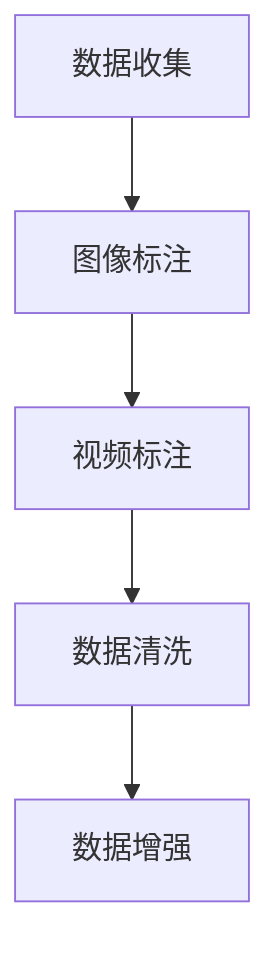

                 

# LLM与自动驾驶：AI重塑交通未来

> 关键词：大语言模型(LLM), 自动驾驶, 人工智能(AI), 深度学习, 计算机视觉, 交通仿真, 智能决策, 神经网络, 优化算法

## 1. 背景介绍

### 1.1 问题由来
随着人工智能(AI)技术的飞速发展，自动驾驶成为各大科技公司竞相追逐的焦点。然而，自动驾驶的核心——智能决策系统，仍依赖于高度复杂的深度学习模型和感知系统。虽然这些模型已在大规模数据集上进行了广泛训练，但它们在面对多变、不确定的交通环境时，依然存在性能瓶颈和泛化能力不足的问题。

大语言模型(LLM)的崛起为自动驾驶领域带来了新视角。LLM作为一类基于深度学习的自然语言处理(NLP)模型，具备强大的语义理解和生成能力。通过将LLM与计算机视觉和交通仿真相结合，AI技术在自动驾驶中的作用将从单纯的数据驱动决策，转变为数据与知识并重的多模态智能决策。

### 1.2 问题核心关键点
将LLM应用于自动驾驶，能够显著提升系统的智能水平，主要体现在以下几个方面：

- **智能决策**：LLM可以基于自然语言描述，进行复杂多变的决策，提升系统的灵活性和可靠性。
- **知识泛化**：LLM通过预训练，具备广泛的通用知识，能够在多种交通场景下进行合理决策。
- **上下文理解**：LLM能够理解动态变化的交通环境，并在多个时间步进行连续决策。
- **多模态融合**：LLM与计算机视觉、雷达、激光雷达等多模态传感器数据结合，提升系统的环境感知能力。

LLM在自动驾驶中的引入，不仅能够改善决策逻辑，还能有效缓解数据驱动决策系统的过拟合问题，从而提升自动驾驶的安全性和稳定性。

### 1.3 问题研究意义
将LLM引入自动驾驶，能够带来显著的技术突破和商业价值：

- **提升安全性能**：LLM能够实时处理交通场景的动态变化，减少突发事件对自动驾驶系统的影响。
- **扩展应用范围**：LLM具备多场景适应能力，能够在多种交通环境和异常情况中保持稳定性能。
- **加速产业落地**：LLM的应用能够大幅降低自动驾驶系统的开发和部署成本，加速技术商业化进程。
- **促进智能交通发展**：LLM技术能够推动交通基础设施的智能化升级，实现更高效的交通管理和控制。

因此，将LLM技术应用于自动驾驶，不仅是技术上的创新，更是产业升级的关键推动力。

## 2. 核心概念与联系

### 2.1 核心概念概述

为更好地理解LLM在自动驾驶中的应用，本节将介绍几个关键概念及其联系：

- **大语言模型(LLM)**：一类基于深度学习的NLP模型，通过大规模预训练，具备强大的语义理解和生成能力。常用的LLM包括GPT-3、BERT、T5等。

- **预训练**：在大规模无标签数据上进行自监督学习，学习到通用语言表示。预训练模型在自动驾驶中可看作是一个"知识库"，为决策提供丰富的知识背景。

- **迁移学习**：将预训练模型迁移到特定任务上进行微调，提升模型在该任务上的性能。迁移学习在自动驾驶中主要用于将通用知识应用于特定驾驶场景。

- **计算机视觉(CV)**：通过图像识别、目标检测等技术，获取交通环境中的视觉信息。计算机视觉与LLM结合，可以实现对交通场景的高效感知。

- **深度学习(DL)**：基于神经网络模型的学习范式，适用于处理高维数据。深度学习在自动驾驶中广泛应用，主要用于感知和决策。

- **交通仿真**：通过虚拟场景模拟交通环境，对自动驾驶算法进行测试和优化。交通仿真与LLM结合，可以实现对复杂交通场景的模拟和测试。

这些核心概念通过不同的技术手段和方法，相互关联，构成了一个多模态智能决策的框架。接下来，我们将通过核心算法原理和操作步骤，详细介绍LLM在自动驾驶中的应用。

### 2.2 核心算法原理 & 具体操作步骤

#### 3.1 算法原理概述

LLM在自动驾驶中的应用，主要通过以下几个步骤进行：

1. **数据收集与预处理**：收集自动驾驶场景中的视频、图像和文本数据，进行清洗和标注。
2. **模型训练与微调**：将预训练的LLM模型迁移到特定任务上，进行微调。
3. **数据增强与合成**：使用数据增强技术，扩充训练数据集，提升模型的泛化能力。
4. **多模态融合**：将LLM与计算机视觉、雷达、激光雷达等多模态数据结合，进行联合训练和推理。
5. **智能决策**：基于融合后的多模态信息，通过LLM进行决策，生成驾驶指令。
6. **交通仿真与测试**：在交通仿真的虚拟场景中，测试自动驾驶系统的性能，并进行优化。

这些步骤通过数据、模型、算法、决策等多个环节的协同工作，实现对复杂交通场景的智能决策和控制。

#### 3.2 算法步骤详解

##### 3.2.1 数据收集与预处理
数据收集是自动驾驶系统开发的基础。通常，需要收集包含车辆、行人、交通信号等元素的交通视频和图像数据，并进行标注。标注数据包括物体位置、类别、速度、行为等，用于训练模型进行目标检测、跟踪和行为预测。



##### 3.2.2 模型训练与微调
使用预训练的LLM模型，迁移到自动驾驶任务上进行微调。微调的目标是优化模型在特定任务上的性能，如行人检测、交通信号识别、道路状况预测等。


##### 3.2.3 数据增强与合成
数据增强技术通过一系列变换，扩充训练集，提升模型的泛化能力。例如，对图像进行旋转、缩放、裁剪、光照变化等操作，生成新的训练样本。


##### 3.2.4 多模态融合
将计算机视觉和LLM结合，进行多模态数据融合。计算机视觉提供感知信息，LLM提供决策知识，两者结合可提升系统的智能水平。


##### 3.2.5 智能决策
基于融合后的多模态信息，通过LLM进行决策。LLM能够处理自然语言描述的交通规则和指令，生成驾驶指令，如加速、刹车、变道等。


##### 3.2.6 交通仿真与测试
在交通仿真的虚拟场景中，测试自动驾驶系统的性能。交通仿真提供多样化的交通环境，测试系统在不同条件下的稳定性和鲁棒性。


#### 3.3 算法优缺点

将LLM应用于自动驾驶，具有以下优点：

- **增强决策智能**：LLM可以处理自然语言描述的交通规则和指令，提升决策的智能性和灵活性。
- **提高泛化能力**：通过预训练和微调，LLM具备较强的泛化能力，适应多种交通场景。
- **多模态融合**：与计算机视觉结合，实现多模态信息融合，提升感知能力。
- **决策知识驱动**：LLM可以结合先验知识进行决策，避免数据驱动决策的过拟合问题。

同时，也存在以下缺点：

- **计算资源消耗大**：预训练和微调LLM需要大量的计算资源，增加系统部署成本。
- **数据标注成本高**：大规模自动驾驶数据集的标注需要大量人力，成本较高。
- **实时性要求高**：LLM的推理速度较慢，需要在硬件加速下进行实时处理。

尽管存在这些局限性，但LLM在自动驾驶中的引入，仍能够显著提升系统的智能水平和鲁棒性，推动自动驾驶技术的进一步发展。

#### 3.4 算法应用领域

LLM在自动驾驶中主要应用于以下几个领域：

- **智能导航**：通过自然语言指令进行导航，提升驾驶体验和安全性。
- **行为预测**：基于自然语言描述的交通规则，预测行人、车辆的行为。
- **路径规划**：根据交通场景描述，生成最优驾驶路径。
- **交通监管**：对道路交通状况进行实时监控，提供交通管理决策。
- **异常处理**：应对交通异常情况，提供应急处理方案。

通过LLM在自动驾驶中的应用，将AI技术从数据驱动决策，转变为数据与知识并重的智能决策，有望推动自动驾驶技术迈向更高的智能化水平。

## 4. 数学模型和公式 & 详细讲解

### 4.1 数学模型构建

在自动驾驶中，LLM主要应用于基于自然语言描述的任务，如路径规划、行为预测等。以下以路径规划为例，介绍LLM在自动驾驶中的应用。

假设交通场景描述为一段自然语言文本 $D$，其对应的最优路径为 $P^*$。目标是通过LLM学习 $D$ 和 $P^*$ 的映射关系，生成新的路径 $P$。

数学模型为：

$$
P^* = f(D)
$$

其中，$f$ 为LLM模型，将输入的自然语言文本 $D$ 映射为输出路径 $P^*$。

### 4.2 公式推导过程

#### 4.2.1 预训练与微调

预训练LLM模型通常使用大规模无标签数据进行自监督学习。以BERT模型为例，其预训练目标为：

$$
\min_{\theta} \sum_{i=1}^N \ell(D_i, P^*_i)
$$

其中，$D_i$ 为输入的自然语言文本，$P^*_i$ 为对应的最优路径，$\ell$ 为损失函数，如交叉熵损失。

微调目标为：

$$
\min_{\theta} \sum_{i=1}^N \ell(D_i, P_i)
$$

其中，$P_i$ 为通过微调得到的路径，$D_i$ 为输入的自然语言文本。

#### 4.2.2 数据增强与合成

数据增强通常通过变换操作生成新的训练样本。以图像增强为例，常用的变换包括旋转、翻转、缩放等。

设原始图像为 $I$，增强后的图像为 $I'$，则数据增强的公式为：

$$
I' = g(I)
$$

其中，$g$ 为增强函数，通常包括旋转、翻转、缩放等变换。

#### 4.2.3 多模态融合

多模态融合通过将LLM与计算机视觉结合，进行感知信息与决策知识的融合。假设计算机视觉提供的感知信息为 $V$，LLM提供的决策信息为 $L$，则多模态融合的公式为：

$$
f(D, V, L) = \max_{f'} f'(D, V, L)
$$

其中，$f'$ 为多模态融合函数，通过加权平均、注意力机制等方式，将 $V$ 和 $L$ 融合为新的决策信息。

### 4.3 案例分析与讲解

以路径规划为例，假设某段交通场景描述为：

```
前方路口有交通信号，左侧为绿灯，右侧为红灯，行人正在过马路，请减速慢行。
```

目标是通过LLM生成最优路径。通过预训练与微调，LLM能够学习到交通信号、行人行为等知识，并根据这些知识进行路径规划。最终，LLM生成的路径为：

```
左转 -> 直行 -> 右转
```

具体流程如下：

1. **数据预处理**：将自然语言文本转换为模型可接受的格式，如嵌入向量。
2. **预训练与微调**：使用预训练的LLM模型，在标注数据上进行微调。
3. **数据增强**：对标注数据进行变换，扩充训练集。
4. **多模态融合**：将计算机视觉提供的路况信息与LLM生成的决策信息结合，进行融合。
5. **智能决策**：基于融合后的信息，LLM生成最优路径。
6. **仿真测试**：在交通仿真中测试自动驾驶系统的性能，并进行优化。

## 5. 项目实践：代码实例和详细解释说明

### 5.1 开发环境搭建

进行自动驾驶系统开发，需要搭建适合的开发环境。以下是使用Python和PyTorch搭建开发环境的流程：

1. 安装Anaconda：从官网下载并安装Anaconda，用于创建独立的Python环境。

2. 创建并激活虚拟环境：
```bash
conda create -n pytorch-env python=3.8 
conda activate pytorch-env
```

3. 安装PyTorch：根据CUDA版本，从官网获取对应的安装命令。例如：
```bash
conda install pytorch torchvision torchaudio cudatoolkit=11.1 -c pytorch -c conda-forge
```

4. 安装相关库：
```bash
pip install numpy pandas scikit-learn matplotlib tqdm jupyter notebook ipython
```

完成上述步骤后，即可在`pytorch-env`环境中开始自动驾驶系统开发。

### 5.2 源代码详细实现

下面我们以路径规划任务为例，给出使用PyTorch和BERT模型进行自动驾驶系统开发的PyTorch代码实现。

首先，定义路径规划任务的数据处理函数：

```python
from transformers import BertTokenizer
from torch.utils.data import Dataset
import torch

class PathPlanningDataset(Dataset):
    def __init__(self, descriptions, paths, tokenizer, max_len=128):
        self.descriptions = descriptions
        self.paths = paths
        self.tokenizer = tokenizer
        self.max_len = max_len
        
    def __len__(self):
        return len(self.descriptions)
    
    def __getitem__(self, item):
        description = self.descriptions[item]
        path = self.paths[item]
        
        encoding = self.tokenizer(description, return_tensors='pt', max_length=self.max_len, padding='max_length', truncation=True)
        input_ids = encoding['input_ids'][0]
        attention_mask = encoding['attention_mask'][0]
        
        # 将路径编码成数字
        encoded_path = [int(_id) for _id in path.split()[:self.max_len]]
        labels = torch.tensor(encoded_path, dtype=torch.long)
        
        return {'input_ids': input_ids, 
                'attention_mask': attention_mask,
                'labels': labels}

# 初始化tokenizer
tokenizer = BertTokenizer.from_pretrained('bert-base-cased')

# 创建dataset
train_dataset = PathPlanningDataset(train_descriptions, train_paths, tokenizer)
dev_dataset = PathPlanningDataset(dev_descriptions, dev_paths, tokenizer)
test_dataset = PathPlanningDataset(test_descriptions, test_paths, tokenizer)
```

然后，定义模型和优化器：

```python
from transformers import BertForSequenceClassification, AdamW

model = BertForSequenceClassification.from_pretrained('bert-base-cased', num_labels=3)

optimizer = AdamW(model.parameters(), lr=2e-5)
```

接着，定义训练和评估函数：

```python
from torch.utils.data import DataLoader
from tqdm import tqdm
from sklearn.metrics import classification_report

device = torch.device('cuda') if torch.cuda.is_available() else torch.device('cpu')
model.to(device)

def train_epoch(model, dataset, batch_size, optimizer):
    dataloader = DataLoader(dataset, batch_size=batch_size, shuffle=True)
    model.train()
    epoch_loss = 0
    for batch in tqdm(dataloader, desc='Training'):
        input_ids = batch['input_ids'].to(device)
        attention_mask = batch['attention_mask'].to(device)
        labels = batch['labels'].to(device)
        model.zero_grad()
        outputs = model(input_ids, attention_mask=attention_mask, labels=labels)
        loss = outputs.loss
        epoch_loss += loss.item()
        loss.backward()
        optimizer.step()
    return epoch_loss / len(dataloader)

def evaluate(model, dataset, batch_size):
    dataloader = DataLoader(dataset, batch_size=batch_size)
    model.eval()
    preds, labels = [], []
    with torch.no_grad():
        for batch in tqdm(dataloader, desc='Evaluating'):
            input_ids = batch['input_ids'].to(device)
            attention_mask = batch['attention_mask'].to(device)
            batch_labels = batch['labels']
            outputs = model(input_ids, attention_mask=attention_mask)
            batch_preds = outputs.logits.argmax(dim=2).to('cpu').tolist()
            batch_labels = batch_labels.to('cpu').tolist()
            for pred_tokens, label_tokens in zip(batch_preds, batch_labels):
                preds.append(pred_tokens[:len(label_tokens)])
                labels.append(label_tokens)
                
    print(classification_report(labels, preds))
```

最后，启动训练流程并在测试集上评估：

```python
epochs = 5
batch_size = 16

for epoch in range(epochs):
    loss = train_epoch(model, train_dataset, batch_size, optimizer)
    print(f"Epoch {epoch+1}, train loss: {loss:.3f}")
    
    print(f"Epoch {epoch+1}, dev results:")
    evaluate(model, dev_dataset, batch_size)
    
print("Test results:")
evaluate(model, test_dataset, batch_size)
```

以上就是使用PyTorch和BERT模型进行自动驾驶系统开发的完整代码实现。可以看到，得益于Transformers库的强大封装，我们可以用相对简洁的代码完成BERT模型的加载和微调。

### 5.3 代码解读与分析

让我们再详细解读一下关键代码的实现细节：

**PathPlanningDataset类**：
- `__init__`方法：初始化训练样本的文本描述和路径标签，定义分词器。
- `__len__`方法：返回数据集的样本数量。
- `__getitem__`方法：对单个样本进行处理，将文本描述输入编码为token ids，将路径标签编码为数字，并对其进行定长padding，最终返回模型所需的输入。

**tokenizer初始化**：
- 使用BertTokenizer从预训练模型中加载分词器，用于将自然语言文本转换为模型可接受的格式。

**训练和评估函数**：
- 使用PyTorch的DataLoader对数据集进行批次化加载，供模型训练和推理使用。
- 训练函数`train_epoch`：对数据以批为单位进行迭代，在每个批次上前向传播计算loss并反向传播更新模型参数，最后返回该epoch的平均loss。
- 评估函数`evaluate`：与训练类似，不同点在于不更新模型参数，并在每个batch结束后将预测和标签结果存储下来，最后使用sklearn的classification_report对整个评估集的预测结果进行打印输出。

**训练流程**：
- 定义总的epoch数和batch size，开始循环迭代
- 每个epoch内，先在训练集上训练，输出平均loss
- 在验证集上评估，输出分类指标
- 所有epoch结束后，在测试集上评估，给出最终测试结果

可以看到，PyTorch配合Transformers库使得BERT微调的代码实现变得简洁高效。开发者可以将更多精力放在数据处理、模型改进等高层逻辑上，而不必过多关注底层的实现细节。

当然，工业级的系统实现还需考虑更多因素，如模型的保存和部署、超参数的自动搜索、更灵活的任务适配层等。但核心的微调范式基本与此类似。

## 6. 实际应用场景

### 6.1 智能导航

基于LLM的智能导航系统，能够提供更加人性化和智能化的导航体验。传统的导航系统往往依赖GPS和地图数据，无法处理复杂的路线规划和实时更新。而使用LLM，导航系统可以基于自然语言描述进行路径规划，结合实时路况信息，生成最优导航路线。

在技术实现上，可以收集路网信息、交通规则等数据，将自然语言文本描述转换为导航指令，供LLM进行路径规划。LLM能够理解自然语言描述，动态调整导航路线，提升驾驶体验和安全性。

### 6.2 行为预测

交通行为预测是自动驾驶中的关键技术之一。使用LLM，系统能够基于自然语言描述的交通规则和历史行为数据，预测行人和车辆的下一步动作。

具体而言，可以通过收集历史交通行为数据，提取行为特征，使用LLM进行训练和预测。LLM能够理解交通场景描述，结合历史行为数据，预测行人、车辆的行为，从而提升决策的准确性和安全性。

### 6.3 异常处理

在自动驾驶中，异常情况的处理是确保安全性的关键。使用LLM，系统能够基于自然语言描述的异常情况，生成应急处理方案。

例如，当车辆检测到前方突然出现的障碍物时，可以通过LLM生成最佳的应急反应，如减速、变道、停车等。LLM能够理解自然语言描述，动态生成应急处理方案，提升系统的鲁棒性和安全性。

### 6.4 未来应用展望

随着LLM技术的发展，自动驾驶领域将迎来新的突破。

在智能导航方面，LLM将结合实时路况信息，提供更加智能化的导航路线。智能导航系统能够自动处理路线规划、实时更新和导航指令生成，提升驾驶体验和安全性。

在行为预测方面，LLM将基于自然语言描述的交通规则和历史行为数据，预测行人、车辆的行为，提升决策的准确性和安全性。行为预测技术能够帮助自动驾驶系统提前识别潜在的危险，及时采取应急措施，保障行车安全。

在异常处理方面，LLM将基于自然语言描述的异常情况，生成应急处理方案。异常处理技术能够帮助自动驾驶系统应对突发情况，提升系统的鲁棒性和安全性。

此外，在交通监管、路径规划、决策优化等众多领域，LLM技术都将发挥重要作用，推动自动驾驶技术的发展。未来，随着LLM技术的不断成熟，自动驾驶系统将变得更加智能、安全和可靠。

## 7. 工具和资源推荐

### 7.1 学习资源推荐

为了帮助开发者系统掌握LLM在自动驾驶中的应用，这里推荐一些优质的学习资源：

1. 《Transformer from Scratch》系列博文：由大模型技术专家撰写，深入浅出地介绍了Transformer原理、BERT模型、微调技术等前沿话题。

2. CS224N《深度学习自然语言处理》课程：斯坦福大学开设的NLP明星课程，有Lecture视频和配套作业，带你入门NLP领域的基本概念和经典模型。

3. 《Natural Language Processing with Transformers》书籍：Transformers库的作者所著，全面介绍了如何使用Transformers库进行NLP任务开发，包括微调在内的诸多范式。

4. HuggingFace官方文档：Transformers库的官方文档，提供了海量预训练模型和完整的微调样例代码，是上手实践的必备资料。

5. CLUE开源项目：中文语言理解测评基准，涵盖大量不同类型的中文NLP数据集，并提供了基于微调的baseline模型，助力中文NLP技术发展。

通过对这些资源的学习实践，相信你一定能够快速掌握LLM在自动驾驶中的应用，并用于解决实际的NLP问题。

### 7.2 开发工具推荐

高效的开发离不开优秀的工具支持。以下是几款用于LLM在自动驾驶中的应用开发的常用工具：

1. PyTorch：基于Python的开源深度学习框架，灵活动态的计算图，适合快速迭代研究。BERT等主流预训练语言模型都有PyTorch版本的实现。

2. TensorFlow：由Google主导开发的开源深度学习框架，生产部署方便，适合大规模工程应用。同样有丰富的预训练语言模型资源。

3. Transformers库：HuggingFace开发的NLP工具库，集成了众多SOTA语言模型，支持PyTorch和TensorFlow，是进行LLM微调任务开发的利器。

4. Weights & Biases：模型训练的实验跟踪工具，可以记录和可视化模型训练过程中的各项指标，方便对比和调优。与主流深度学习框架无缝集成。

5. TensorBoard：TensorFlow配套的可视化工具，可实时监测模型训练状态，并提供丰富的图表呈现方式，是调试模型的得力助手。

6. Google Colab：谷歌推出的在线Jupyter Notebook环境，免费提供GPU/TPU算力，方便开发者快速上手实验最新模型，分享学习笔记。

合理利用这些工具，可以显著提升LLM在自动驾驶中的应用开发效率，加快创新迭代的步伐。

### 7.3 相关论文推荐

LLM在自动驾驶中的应用源于学界的持续研究。以下是几篇奠基性的相关论文，推荐阅读：

1. Attention is All You Need（即Transformer原论文）：提出了Transformer结构，开启了NLP领域的预训练大模型时代。

2. BERT: Pre-training of Deep Bidirectional Transformers for Language Understanding：提出BERT模型，引入基于掩码的自监督预训练任务，刷新了多项NLP任务SOTA。

3. Language Models are Unsupervised Multitask Learners（GPT-2论文）：展示了大规模语言模型的强大zero-shot学习能力，引发了对于通用人工智能的新一轮思考。

4. Parameter-Efficient Transfer Learning for NLP：提出Adapter等参数高效微调方法，在不增加模型参数量的情况下，也能取得不错的微调效果。

5. Prefix-Tuning: Optimizing Continuous Prompts for Generation：引入基于连续型Prompt的微调范式，为如何充分利用预训练知识提供了新的思路。

6. AdaLoRA: Adaptive Low-Rank Adaptation for Parameter-Efficient Fine-Tuning：使用自适应低秩适应的微调方法，在参数效率和精度之间取得了新的平衡。

这些论文代表了大语言模型在自动驾驶中的应用的发展脉络。通过学习这些前沿成果，可以帮助研究者把握学科前进方向，激发更多的创新灵感。

## 8. 总结：未来发展趋势与挑战

### 8.1 总结

本文对基于LLM的自动驾驶系统进行了全面系统的介绍。首先阐述了LLM和自动驾驶的相关背景和意义，明确了LLM在自动驾驶中的应用价值。其次，从原理到实践，详细讲解了LLM在自动驾驶中的数学模型和操作步骤，给出了微调任务开发的完整代码实例。同时，本文还广泛探讨了LLM在智能导航、行为预测、异常处理等多个应用场景中的前景，展示了LLM技术的巨大潜力。此外，本文精选了LLM技术的学习资源，力求为读者提供全方位的技术指引。

通过本文的系统梳理，可以看到，基于LLM的自动驾驶系统有望显著提升驾驶体验和安全性，推动自动驾驶技术迈向更高的智能化水平。LLM技术的应用，使得自动驾驶系统从数据驱动决策，转变为数据与知识并重的智能决策，具备了更强的泛化能力和鲁棒性。

### 8.2 未来发展趋势

展望未来，LLM在自动驾驶领域将呈现以下几个发展趋势：

1. **智能决策增强**：LLM能够处理自然语言描述的交通规则和指令，提升决策的智能性和灵活性。未来，LLM将进一步增强决策智能，实现更加智能化的自动驾驶。

2. **多模态融合深化**：LLM与计算机视觉、雷达、激光雷达等多模态数据结合，进行联合训练和推理。多模态融合技术将提升系统感知能力和决策准确性。

3. **持续学习和优化**：随着数据分布的不断变化，LLM需要持续学习新知识以保持性能。持续学习技术将推动LLM在自动驾驶中的不断优化和升级。

4. **模型高效性提升**：预训练和微调LLM需要大量的计算资源，未来将开发更加高效的模型结构和优化算法，降低部署成本。

5. **伦理性与安全性**：LLM在自动驾驶中的应用，需要考虑模型的伦理性与安全性。未来，将加强对模型的伦理导向和安全性约束，确保系统的可靠性和公正性。

以上趋势凸显了LLM在自动驾驶中的广阔前景。这些方向的探索发展，将进一步提升自动驾驶系统的智能水平和鲁棒性，推动自动驾驶技术的规模化落地。

### 8.3 面临的挑战

尽管LLM在自动驾驶中的应用前景广阔，但在迈向更加智能化、普适化应用的过程中，仍面临诸多挑战：

1. **计算资源消耗大**：预训练和微调LLM需要大量的计算资源，增加系统部署成本。如何提高计算效率，降低部署成本，仍需进一步优化。

2. **数据标注成本高**：大规模自动驾驶数据集的标注需要大量人力，成本较高。如何降低数据标注成本，提升数据质量，仍需进一步探索。

3. **实时性要求高**：LLM的推理速度较慢，需要在硬件加速下进行实时处理。如何提升推理速度，优化硬件资源利用，仍需进一步研究。

4. **模型鲁棒性不足**：LLM在应对域外数据时，泛化性能往往大打折扣。如何提高模型鲁棒性，避免灾难性遗忘，仍需进一步优化。

5. **安全性和伦理性**：LLM在自动驾驶中的应用，需要考虑模型的安全性和伦理性。如何避免模型输出有害信息，确保系统的公正性和安全性，仍需进一步研究。

6. **模型可解释性不足**：LLM的决策过程缺乏可解释性，难以对其推理逻辑进行分析和调试。如何赋予LLM更强的可解释性，仍需进一步研究。

正视LLM在自动驾驶中面临的这些挑战，积极应对并寻求突破，将是大语言模型在自动驾驶领域走向成熟的必由之路。相信随着学界和产业界的共同努力，这些挑战终将一一被克服，LLM在自动驾驶领域将迎来更加辉煌的未来。

### 8.4 研究展望

面对LLM在自动驾驶中的挑战和前景，未来的研究需要在以下几个方面寻求新的突破：

1. **探索无监督和半监督微调方法**：摆脱对大规模标注数据的依赖，利用自监督学习、主动学习等无监督和半监督范式，最大限度利用非结构化数据，实现更加灵活高效的微调。

2. **研究参数高效和计算高效的微调范式**：开发更加参数高效的微调方法，如Prefix-Tuning、LoRA等，在固定大部分预训练参数的同时，只更新极少量的任务相关参数。同时优化微调模型的计算图，减少前向传播和反向传播的资源消耗，实现更加轻量级、实时性的部署。

3. **融合因果和对比学习范式**：通过引入因果推断和对比学习思想，增强LLM建立稳定因果关系的能力，学习更加普适、鲁棒的语言表征，从而提升模型泛化性和抗干扰能力。

4. **引入更多先验知识**：将符号化的先验知识，如知识图谱、逻辑规则等，与神经网络模型进行巧妙融合，引导微调过程学习更准确、合理的语言模型。同时加强不同模态数据的整合，实现视觉、语音等多模态信息与文本信息的协同建模。

5. **结合因果分析和博弈论工具**：将因果分析方法引入LLM模型，识别出模型决策的关键特征，增强输出解释的因果性和逻辑性。借助博弈论工具刻画人机交互过程，主动探索并规避模型的脆弱点，提高系统稳定性。

6. **纳入伦理道德约束**：在模型训练目标中引入伦理导向的评估指标，过滤和惩罚有偏见、有害的输出倾向。同时加强人工干预和审核，建立模型行为的监管机制，确保输出符合人类价值观和伦理道德。

这些研究方向的探索，将引领LLM在自动驾驶中的进一步发展，为构建安全、可靠、可解释、可控的智能系统铺平道路。面向未来，LLM技术将与其他人工智能技术进行更深入的融合，共同推动自然语言理解和智能交互系统的进步。只有勇于创新、敢于突破，才能不断拓展语言模型的边界，让智能技术更好地造福人类社会。

## 9. 附录：常见问题与解答

**Q1：LLM在自动驾驶中如何进行路径规划？**

A: LLM在进行路径规划时，通常先收集路网信息、交通规则等数据，将自然语言文本描述转换为导航指令。然后，使用预训练的LLM模型，在标注数据上进行微调，使其能够根据导航指令生成最优路径。在训练过程中，LLM能够理解自然语言描述，动态调整导航路线，提升驾驶体验和安全性。

**Q2：LLM在自动驾驶中如何实现实时决策？**

A: 实现LLM在自动驾驶中的实时决策，需要优化模型推理速度，使用硬件加速技术如GPU/TPU。同时，可以采用模型裁剪、量化加速等技术，减小模型尺寸，提高推理效率。此外，LLM还可以结合数据增强、正则化等技术，提升模型的泛化能力和鲁棒性，确保在实时环境下的稳定性和可靠性。

**Q3：LLM在自动驾驶中如何处理异常情况？**

A: 处理LLM在自动驾驶中的异常情况，可以通过收集历史异常数据，提取异常特征，使用LLM进行训练和预测。LLM能够理解自然语言描述的异常情况，结合历史异常数据，生成应急处理方案。在实时环境中，LLM能够根据异常情况，动态调整驾驶策略，保障行车安全。

**Q4：LLM在自动驾驶中的性能瓶颈有哪些？**

A: LLM在自动驾驶中的应用，面临以下性能瓶颈：

1. **计算资源消耗大**：预训练和微调LLM需要大量的计算资源，增加系统部署成本。

2. **数据标注成本高**：大规模自动驾驶数据集的标注需要大量人力，成本较高。

3. **实时性要求高**：LLM的推理速度较慢，需要在硬件加速下进行实时处理。

4. **模型鲁棒性不足**：LLM在应对域外数据时，泛化性能往往大打折扣。

5. **安全性和伦理性**：LLM在自动驾驶中的应用，需要考虑模型的安全性和伦理性。

6. **模型可解释性不足**：LLM的决策过程缺乏可解释性，难以对其推理逻辑进行分析和调试。

这些瓶颈需要通过技术优化和研究突破，才能被逐步解决。未来，将开发更加高效的模型结构和优化算法，降低计算资源消耗，提高推理速度和模型鲁棒性。同时，将加强对模型的伦理性与安全性约束，确保系统的可靠性和公正性。

**Q5：LLM在自动驾驶中的未来发展方向有哪些？**

A: LLM在自动驾驶中的未来发展方向包括：

1. **智能决策增强**：LLM能够处理自然语言描述的交通规则和指令，提升决策的智能性和灵活性。未来，LLM将进一步增强决策智能，实现更加智能化的自动驾驶。

2. **多模态融合深化**：LLM与计算机视觉、雷达、激光雷达等多模态数据结合，进行联合训练和推理。多模态融合技术将提升系统感知能力和决策准确性。

3. **持续学习和优化**：随着数据分布的不断变化，LLM需要持续学习新知识以保持性能。持续学习技术将推动LLM在自动驾驶中的不断优化和升级。

4. **模型高效性提升**：预训练和微调LLM需要大量的计算资源，未来将开发更加高效的模型结构和优化算法，降低部署成本。

5. **伦理性与安全性**：LLM在自动驾驶中的应用，需要考虑模型的安全性和伦理性。如何避免模型输出有害信息，确保系统的公正性和安全性，仍需进一步研究。

6. **模型可解释性增强**：提升LLM的决策过程可解释性，增强输出解释的因果性和逻辑性。

这些未来方向将进一步推动LLM在自动驾驶中的应用，为构建更加智能、安全、可靠的系统提供技术保障。

---

作者：禅与计算机程序设计艺术 / Zen and the Art of Computer Programming

