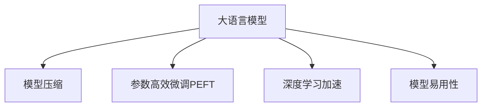

                 

# LLM内核:支撑智能应用的基石

> 关键词：
> 大语言模型,Transformer,模型压缩,参数高效微调,深度学习,自然语言处理(NLP),语音处理,计算机视觉

## 1. 背景介绍

### 1.1 问题由来
随着深度学习技术的发展，大语言模型（Large Language Models, LLMs）在自然语言处理（Natural Language Processing, NLP）领域取得了巨大的成功。这些模型通过在大规模无标签文本数据上进行预训练，学习到丰富的语言知识和常识，具备强大的语言理解和生成能力。然而，LLMs在实际应用中面临诸多挑战，如资源消耗大、推理速度慢、模型过大等问题。为了应对这些挑战，研究者们提出了许多优化方案，如模型压缩、参数高效微调、深度学习加速等，这些优化方法的核心在于构建一个高效、轻量级且易于部署的内核，支撑LLMs在各种智能应用中的稳定运行。

### 1.2 问题核心关键点
LLMs的内核构建与优化，是实现智能应用的关键。内核构建的目标是：在保证模型性能的基础上，尽量减少资源消耗，提升推理速度，并使得模型更易于部署。内核构建的核心理念包括：
1. 模型压缩：通过参数剪枝、知识蒸馏、权重共享等技术，减少模型的参数量，降低资源消耗。
2. 参数高效微调：只更新少量的模型参数，固定大部分预训练参数，以提高微调效率，避免过拟合。
3. 深度学习加速：利用GPU/TPU等高性能设备，加速模型的训练和推理过程。
4. 模型易用性：通过API封装、SDK集成等手段，使得开发者可以更方便地使用LLMs内核进行开发。

## 2. 核心概念与联系

### 2.1 核心概念概述

为更好地理解LLMs内核构建，本节将介绍几个密切相关的核心概念：

- 大语言模型(Large Language Model, LLM)：以自回归(如GPT)或自编码(如BERT)模型为代表的大规模预训练语言模型。通过在大规模无标签文本语料上进行预训练，学习通用的语言表示，具备强大的语言理解和生成能力。

- 模型压缩(Model Compression)：通过减少模型参数量、优化计算图等手段，降低模型的资源占用和推理时间。常见的压缩技术包括参数剪枝、量化、稀疏化等。

- 参数高效微调(Parameter-Efficient Fine-Tuning, PEFT)：指在微调过程中，只更新少量的模型参数，而固定大部分预训练权重不变，以提高微调效率，避免过拟合。

- 深度学习加速(Deep Learning Acceleration)：通过GPU/TPU等高性能设备，加速模型的训练和推理过程。包括模型并行、混合精度训练等技术。

- 模型易用性(Model Usability)：通过API封装、SDK集成等手段，使得开发者可以更方便地使用LLMs内核进行开发。包括模型导入导出、预测接口等。

这些核心概念之间的逻辑关系可以通过以下Mermaid流程图来展示：



这个流程图展示了大语言模型的核心概念及其之间的关系：

1. 大语言模型通过预训练获得基础能力。
2. 模型压缩对预训练模型进行参数剪枝、量化等，减少资源消耗。
3. 参数高效微调仅微调顶层或部分层，提高微调效率。
4. 深度学习加速利用高性能设备提升训练和推理速度。
5. 模型易用性通过API封装、SDK集成，简化模型使用流程。

这些概念共同构成了LLMs内核构建的理论基础，使得LLMs能够在各种智能应用中高效稳定地运行。

## 3. 核心算法原理 & 具体操作步骤
### 3.1 算法原理概述

LLMs内核构建的核心在于通过各种技术手段，对预训练模型进行优化，使其能够在特定应用场景中高效运行。其核心思想是：在保证模型性能的基础上，尽量减少资源消耗，提升推理速度，并使得模型更易于部署。

形式化地，假设预训练模型为 $M_{\theta}$，其中 $\theta$ 为预训练得到的模型参数。给定应用场景 $S$ 的输入 $x$，LLMs内核构建的目标是找到一个压缩后的模型 $M_{\hat{\theta}}$，满足：

$$
M_{\hat{\theta}}(x) \approx M_{\theta}(x)
$$

其中 $\hat{\theta}$ 为内核优化后的模型参数。通过参数剪枝、知识蒸馏、量化等技术，使 $M_{\hat{\theta}}$ 能够在特定应用场景下高效运行，同时尽可能保持与 $M_{\theta}$ 相似的性能。

### 3.2 算法步骤详解

LLMs内核构建一般包括以下几个关键步骤：

**Step 1: 模型选择与压缩**
- 选择合适的预训练模型 $M_{\theta}$ 作为内核构建的基础，如 BERT、GPT 等。
- 根据应用场景的需求，选择适合的压缩技术，如参数剪枝、量化、稀疏化等。

**Step 2: 参数高效微调**
- 根据任务特点，设计合适的输出层和损失函数。
- 使用AdamW等优化算法，设置合适的学习率和正则化参数。
- 将预训练模型顶层作为微调目标，固定其余部分，以提高微调效率。

**Step 3: 深度学习加速**
- 利用GPU/TPU等高性能设备，加速模型的训练和推理过程。
- 采用模型并行、混合精度训练等技术，提高计算效率。

**Step 4: 模型易用性**
- 通过API封装、SDK集成等手段，使得开发者可以更方便地使用内核进行开发。
- 提供模型导入导出、预测接口等功能，简化模型使用流程。

### 3.3 算法优缺点

LLMs内核构建方法具有以下优点：
1. 资源消耗低。通过模型压缩、参数高效微调等技术，内核能够以更少的资源实现高性能计算。
2. 推理速度快。采用深度学习加速技术，内核能够在高性能设备上快速执行推理任务。
3. 模型易用性强。通过API封装、SDK集成等手段，内核提供了良好的易用性和灵活性。
4. 性能保持高。内核优化后的模型仍能保持与预训练模型相似的性能。

同时，该方法也存在一定的局限性：
1. 对特定任务适应性有限。内核构建的优化方式可能不适用于所有应用场景。
2. 对标注数据依赖较高。微调过程中仍需要少量标注数据，获取高质量标注数据的成本较高。
3. 模型结构复杂。内核构建涉及多种优化技术，实现难度较大。

尽管存在这些局限性，但就目前而言，LLMs内核构建仍然是大语言模型应用的重要范式。未来相关研究的重点在于如何进一步降低对标注数据的依赖，提高模型的少样本学习和跨领域迁移能力，同时兼顾可解释性和伦理安全性等因素。

### 3.4 算法应用领域

LLMs内核构建技术在NLP领域已经得到了广泛的应用，覆盖了几乎所有常见任务，例如：

- 文本分类：如情感分析、主题分类、意图识别等。通过内核优化后的模型，可以快速分类文本，提升分类精度。
- 命名实体识别：识别文本中的人名、地名、机构名等特定实体。内核优化后的模型能够快速识别实体边界和类型。
- 关系抽取：从文本中抽取实体之间的语义关系。内核优化后的模型能够高效抽取关系三元组。
- 问答系统：对自然语言问题给出答案。通过微调后的模型，能够快速回答问题，提供智能客服服务。
- 机器翻译：将源语言文本翻译成目标语言。内核优化后的模型能够快速进行翻译。
- 文本摘要：将长文本压缩成简短摘要。内核优化后的模型能够高效生成摘要。
- 对话系统：使机器能够与人自然对话。内核优化后的模型能够提供智能对话服务。

除了上述这些经典任务外，LLMs内核构建技术也被创新性地应用到更多场景中，如可控文本生成、常识推理、代码生成、数据增强等，为NLP技术带来了全新的突破。随着内核构建方法的不断进步，相信LLMs内核将在更广阔的应用领域大放异彩。

## 4. 数学模型和公式 & 详细讲解 & 举例说明
### 4.1 数学模型构建

本节将使用数学语言对LLMs内核构建过程进行更加严格的刻画。

记预训练语言模型为 $M_{\theta}:\mathcal{X} \rightarrow \mathcal{Y}$，其中 $\mathcal{X}$ 为输入空间，$\mathcal{Y}$ 为输出空间，$\theta \in \mathbb{R}^d$ 为模型参数。假设应用场景 $S$ 的输入为 $x \in \mathcal{X}$。

定义内核优化后的模型为 $M_{\hat{\theta}}$，其中 $\hat{\theta} \in \mathbb{R}^d$ 为内核优化后的模型参数。内核构建的目标是最小化应用场景 $S$ 上的预测误差，即：

$$
\min_{\hat{\theta}} \mathcal{L}(M_{\hat{\theta}}, S)
$$

其中 $\mathcal{L}$ 为应用场景 $S$ 上的损失函数，用于衡量模型预测输出与真实标签之间的差异。常见的损失函数包括交叉熵损失、均方误差损失等。

### 4.2 公式推导过程

以下我们以文本分类任务为例，推导交叉熵损失函数及其梯度的计算公式。

假设模型 $M_{\hat{\theta}}$ 在输入 $x$ 上的输出为 $\hat{y}=M_{\hat{\theta}}(x) \in [0,1]$，表示样本属于正类的概率。真实标签 $y \in \{0,1\}$。则二分类交叉熵损失函数定义为：

$$
\ell(M_{\hat{\theta}}(x),y) = -[y\log \hat{y} + (1-y)\log (1-\hat{y})]
$$

将其代入应用场景 $S$ 上的损失函数公式，得：

$$
\mathcal{L}(\hat{\theta}) = -\frac{1}{N}\sum_{i=1}^N [y_i\log M_{\hat{\theta}}(x_i)+(1-y_i)\log(1-M_{\hat{\theta}}(x_i))]
$$

根据链式法则，损失函数对模型参数 $\hat{\theta}_k$ 的梯度为：

$$
\frac{\partial \mathcal{L}(\hat{\theta})}{\partial \hat{\theta}_k} = -\frac{1}{N}\sum_{i=1}^N (\frac{y_i}{M_{\hat{\theta}}(x_i)}-\frac{1-y_i}{1-M_{\hat{\theta}}(x_i)}) \frac{\partial M_{\hat{\theta}}(x_i)}{\partial \hat{\theta}_k}
$$

其中 $\frac{\partial M_{\hat{\theta}}(x_i)}{\partial \hat{\theta}_k}$ 可进一步递归展开，利用自动微分技术完成计算。

在得到损失函数的梯度后，即可带入参数更新公式，完成模型的迭代优化。重复上述过程直至收敛，最终得到适应应用场景 $S$ 的最优模型参数 $\hat{\theta}^*$。

## 5. 项目实践：代码实例和详细解释说明
### 5.1 开发环境搭建

在进行内核构建实践前，我们需要准备好开发环境。以下是使用Python进行PyTorch开发的环境配置流程：

1. 安装Anaconda：从官网下载并安装Anaconda，用于创建独立的Python环境。

2. 创建并激活虚拟环境：
```bash
conda create -n pytorch-env python=3.8 
conda activate pytorch-env
```

3. 安装PyTorch：根据CUDA版本，从官网获取对应的安装命令。例如：
```bash
conda install pytorch torchvision torchaudio cudatoolkit=11.1 -c pytorch -c conda-forge
```

4. 安装Transformers库：
```bash
pip install transformers
```

5. 安装各类工具包：
```bash
pip install numpy pandas scikit-learn matplotlib tqdm jupyter notebook ipython
```

完成上述步骤后，即可在`pytorch-env`环境中开始内核构建实践。

### 5.2 源代码详细实现

这里我们以命名实体识别(NER)任务为例，给出使用Transformers库对BERT模型进行内核构建的PyTorch代码实现。

首先，定义NER任务的数据处理函数：

```python
from transformers import BertTokenizer
from torch.utils.data import Dataset
import torch

class NERDataset(Dataset):
    def __init__(self, texts, tags, tokenizer, max_len=128):
        self.texts = texts
        self.tags = tags
        self.tokenizer = tokenizer
        self.max_len = max_len
        
    def __len__(self):
        return len(self.texts)
    
    def __getitem__(self, item):
        text = self.texts[item]
        tags = self.tags[item]
        
        encoding = self.tokenizer(text, return_tensors='pt', max_length=self.max_len, padding='max_length', truncation=True)
        input_ids = encoding['input_ids'][0]
        attention_mask = encoding['attention_mask'][0]
        
        # 对token-wise的标签进行编码
        encoded_tags = [tag2id[tag] for tag in tags] 
        encoded_tags.extend([tag2id['O']] * (self.max_len - len(encoded_tags)))
        labels = torch.tensor(encoded_tags, dtype=torch.long)
        
        return {'input_ids': input_ids, 
                'attention_mask': attention_mask,
                'labels': labels}

# 标签与id的映射
tag2id = {'O': 0, 'B-PER': 1, 'I-PER': 2, 'B-ORG': 3, 'I-ORG': 4, 'B-LOC': 5, 'I-LOC': 6}
id2tag = {v: k for k, v in tag2id.items()}

# 创建dataset
tokenizer = BertTokenizer.from_pretrained('bert-base-cased')

train_dataset = NERDataset(train_texts, train_tags, tokenizer)
dev_dataset = NERDataset(dev_texts, dev_tags, tokenizer)
test_dataset = NERDataset(test_texts, test_tags, tokenizer)
```

然后，定义模型和优化器：

```python
from transformers import BertForTokenClassification, AdamW

model = BertForTokenClassification.from_pretrained('bert-base-cased', num_labels=len(tag2id))

optimizer = AdamW(model.parameters(), lr=2e-5)
```

接着，定义训练和评估函数：

```python
from torch.utils.data import DataLoader
from tqdm import tqdm
from sklearn.metrics import classification_report

device = torch.device('cuda') if torch.cuda.is_available() else torch.device('cpu')
model.to(device)

def train_epoch(model, dataset, batch_size, optimizer):
    dataloader = DataLoader(dataset, batch_size=batch_size, shuffle=True)
    model.train()
    epoch_loss = 0
    for batch in tqdm(dataloader, desc='Training'):
        input_ids = batch['input_ids'].to(device)
        attention_mask = batch['attention_mask'].to(device)
        labels = batch['labels'].to(device)
        model.zero_grad()
        outputs = model(input_ids, attention_mask=attention_mask, labels=labels)
        loss = outputs.loss
        epoch_loss += loss.item()
        loss.backward()
        optimizer.step()
    return epoch_loss / len(dataloader)

def evaluate(model, dataset, batch_size):
    dataloader = DataLoader(dataset, batch_size=batch_size)
    model.eval()
    preds, labels = [], []
    with torch.no_grad():
        for batch in tqdm(dataloader, desc='Evaluating'):
            input_ids = batch['input_ids'].to(device)
            attention_mask = batch['attention_mask'].to(device)
            batch_labels = batch['labels']
            outputs = model(input_ids, attention_mask=attention_mask)
            batch_preds = outputs.logits.argmax(dim=2).to('cpu').tolist()
            batch_labels = batch_labels.to('cpu').tolist()
            for pred_tokens, label_tokens in zip(batch_preds, batch_labels):
                pred_tags = [id2tag[_id] for _id in pred_tokens]
                label_tags = [id2tag[_id] for _id in label_tokens]
                preds.append(pred_tags[:len(label_tags)])
                labels.append(label_tags)
                
    print(classification_report(labels, preds))
```

最后，启动训练流程并在测试集上评估：

```python
epochs = 5
batch_size = 16

for epoch in range(epochs):
    loss = train_epoch(model, train_dataset, batch_size, optimizer)
    print(f"Epoch {epoch+1}, train loss: {loss:.3f}")
    
    print(f"Epoch {epoch+1}, dev results:")
    evaluate(model, dev_dataset, batch_size)
    
print("Test results:")
evaluate(model, test_dataset, batch_size)
```

以上就是使用PyTorch对BERT进行命名实体识别任务内核构建的完整代码实现。可以看到，得益于Transformers库的强大封装，我们可以用相对简洁的代码完成BERT模型的加载和内核构建。

### 5.3 代码解读与分析

让我们再详细解读一下关键代码的实现细节：

**NERDataset类**：
- `__init__`方法：初始化文本、标签、分词器等关键组件。
- `__len__`方法：返回数据集的样本数量。
- `__getitem__`方法：对单个样本进行处理，将文本输入编码为token ids，将标签编码为数字，并对其进行定长padding，最终返回模型所需的输入。

**tag2id和id2tag字典**：
- 定义了标签与数字id之间的映射关系，用于将token-wise的预测结果解码回真实的标签。

**训练和评估函数**：
- 使用PyTorch的DataLoader对数据集进行批次化加载，供模型训练和推理使用。
- 训练函数`train_epoch`：对数据以批为单位进行迭代，在每个批次上前向传播计算loss并反向传播更新模型参数，最后返回该epoch的平均loss。
- 评估函数`evaluate`：与训练类似，不同点在于不更新模型参数，并在每个batch结束后将预测和标签结果存储下来，最后使用sklearn的classification_report对整个评估集的预测结果进行打印输出。

**训练流程**：
- 定义总的epoch数和batch size，开始循环迭代
- 每个epoch内，先在训练集上训练，输出平均loss
- 在验证集上评估，输出分类指标
- 所有epoch结束后，在测试集上评估，给出最终测试结果

可以看到，PyTorch配合Transformers库使得BERT内核构建的代码实现变得简洁高效。开发者可以将更多精力放在数据处理、模型改进等高层逻辑上，而不必过多关注底层的实现细节。

当然，工业级的系统实现还需考虑更多因素，如模型的保存和部署、超参数的自动搜索、更灵活的任务适配层等。但核心的内核构建范式基本与此类似。

## 6. 实际应用场景
### 6.1 智能客服系统

基于大语言模型内核构建的对话技术，可以广泛应用于智能客服系统的构建。传统客服往往需要配备大量人力，高峰期响应缓慢，且一致性和专业性难以保证。而使用内核构建的对话模型，可以7x24小时不间断服务，快速响应客户咨询，用自然流畅的语言解答各类常见问题。

在技术实现上，可以收集企业内部的历史客服对话记录，将问题和最佳答复构建成监督数据，在此基础上对预训练对话模型进行内核构建。内核优化后的对话模型能够自动理解用户意图，匹配最合适的答案模板进行回复。对于客户提出的新问题，还可以接入检索系统实时搜索相关内容，动态组织生成回答。如此构建的智能客服系统，能大幅提升客户咨询体验和问题解决效率。

### 6.2 金融舆情监测

金融机构需要实时监测市场舆论动向，以便及时应对负面信息传播，规避金融风险。传统的人工监测方式成本高、效率低，难以应对网络时代海量信息爆发的挑战。基于大语言模型内核构建的文本分类和情感分析技术，为金融舆情监测提供了新的解决方案。

具体而言，可以收集金融领域相关的新闻、报道、评论等文本数据，并对其进行主题标注和情感标注。在此基础上对预训练语言模型进行内核构建，使其能够自动判断文本属于何种主题，情感倾向是正面、中性还是负面。将内核构建后的模型应用到实时抓取的网络文本数据，就能够自动监测不同主题下的情感变化趋势，一旦发现负面信息激增等异常情况，系统便会自动预警，帮助金融机构快速应对潜在风险。

### 6.3 个性化推荐系统

当前的推荐系统往往只依赖用户的历史行为数据进行物品推荐，无法深入理解用户的真实兴趣偏好。基于大语言模型内核构建的个性化推荐系统，可以更好地挖掘用户行为背后的语义信息，从而提供更精准、多样的推荐内容。

在实践中，可以收集用户浏览、点击、评论、分享等行为数据，提取和用户交互的物品标题、描述、标签等文本内容。将文本内容作为模型输入，用户的后续行为（如是否点击、购买等）作为监督信号，在此基础上内核构建预训练语言模型。内核优化后的模型能够从文本内容中准确把握用户的兴趣点。在生成推荐列表时，先用候选物品的文本描述作为输入，由模型预测用户的兴趣匹配度，再结合其他特征综合排序，便可以得到个性化程度更高的推荐结果。

### 6.4 未来应用展望

随着大语言模型内核构建技术的不断发展，基于内核构建的智能应用将在更多领域得到应用，为传统行业带来变革性影响。

在智慧医疗领域，基于内核构建的医疗问答、病历分析、药物研发等应用将提升医疗服务的智能化水平，辅助医生诊疗，加速新药开发进程。

在智能教育领域，内核构建技术可应用于作业批改、学情分析、知识推荐等方面，因材施教，促进教育公平，提高教学质量。

在智慧城市治理中，内核构建模型可应用于城市事件监测、舆情分析、应急指挥等环节，提高城市管理的自动化和智能化水平，构建更安全、高效的未来城市。

此外，在企业生产、社会治理、文娱传媒等众多领域，基于内核构建的人工智能应用也将不断涌现，为经济社会发展注入新的动力。相信随着技术的日益成熟，内核构建方法将成为人工智能落地应用的重要范式，推动人工智能技术在垂直行业的规模化落地。

## 7. 工具和资源推荐
### 7.1 学习资源推荐

为了帮助开发者系统掌握大语言模型内核构建的理论基础和实践技巧，这里推荐一些优质的学习资源：

1. 《Transformer从原理到实践》系列博文：由大模型技术专家撰写，深入浅出地介绍了Transformer原理、BERT模型、内核构建技术等前沿话题。

2. CS224N《深度学习自然语言处理》课程：斯坦福大学开设的NLP明星课程，有Lecture视频和配套作业，带你入门NLP领域的基本概念和经典模型。

3. 《Natural Language Processing with Transformers》书籍：Transformers库的作者所著，全面介绍了如何使用Transformers库进行NLP任务开发，包括内核构建在内的诸多范式。

4. HuggingFace官方文档：Transformers库的官方文档，提供了海量预训练模型和完整的内核构建样例代码，是上手实践的必备资料。

5. CLUE开源项目：中文语言理解测评基准，涵盖大量不同类型的中文NLP数据集，并提供了基于内核构建的baseline模型，助力中文NLP技术发展。

通过对这些资源的学习实践，相信你一定能够快速掌握大语言模型内核构建的精髓，并用于解决实际的NLP问题。
###  7.2 开发工具推荐

高效的开发离不开优秀的工具支持。以下是几款用于大语言模型内核构建开发的常用工具：

1. PyTorch：基于Python的开源深度学习框架，灵活动态的计算图，适合快速迭代研究。大部分预训练语言模型都有PyTorch版本的实现。

2. TensorFlow：由Google主导开发的开源深度学习框架，生产部署方便，适合大规模工程应用。同样有丰富的预训练语言模型资源。

3. Transformers库：HuggingFace开发的NLP工具库，集成了众多SOTA语言模型，支持PyTorch和TensorFlow，是进行内核构建任务开发的利器。

4. Weights & Biases：模型训练的实验跟踪工具，可以记录和可视化模型训练过程中的各项指标，方便对比和调优。与主流深度学习框架无缝集成。

5. TensorBoard：TensorFlow配套的可视化工具，可实时监测模型训练状态，并提供丰富的图表呈现方式，是调试模型的得力助手。

6. Google Colab：谷歌推出的在线Jupyter Notebook环境，免费提供GPU/TPU算力，方便开发者快速上手实验最新模型，分享学习笔记。

合理利用这些工具，可以显著提升大语言模型内核构建任务的开发效率，加快创新迭代的步伐。

### 7.3 相关论文推荐

大语言模型和内核构建技术的发展源于学界的持续研究。以下是几篇奠基性的相关论文，推荐阅读：

1. Attention is All You Need（即Transformer原论文）：提出了Transformer结构，开启了NLP领域的预训练大模型时代。

2. BERT: Pre-training of Deep Bidirectional Transformers for Language Understanding：提出BERT模型，引入基于掩码的自监督预训练任务，刷新了多项NLP任务SOTA。

3. Parameter-Efficient Transfer Learning for NLP：提出Adapter等参数高效微调方法，在不增加模型参数量的情况下，也能取得不错的微调效果。

4. Prefix-Tuning: Optimizing Continuous Prompts for Generation：引入基于连续型Prompt的内核构建范式，为如何充分利用预训练知识提供了新的思路。

5. AdaLoRA: Adaptive Low-Rank Adaptation for Parameter-Efficient Fine-Tuning：使用自适应低秩适应的内核构建方法，在参数效率和精度之间取得了新的平衡。

这些论文代表了大语言模型内核构建技术的发展脉络。通过学习这些前沿成果，可以帮助研究者把握学科前进方向，激发更多的创新灵感。

## 8. 总结：未来发展趋势与挑战

### 8.1 总结

本文对大语言模型内核构建方法进行了全面系统的介绍。首先阐述了大语言模型和内核构建的研究背景和意义，明确了内核构建在优化资源消耗、提升推理速度、增强模型易用性等方面的重要价值。其次，从原理到实践，详细讲解了内核构建的数学原理和关键步骤，给出了内核构建任务开发的完整代码实例。同时，本文还广泛探讨了内核构建技术在智能客服、金融舆情、个性化推荐等多个行业领域的应用前景，展示了内核构建范式的巨大潜力。此外，本文精选了内核构建技术的各类学习资源，力求为读者提供全方位的技术指引。

通过本文的系统梳理，可以看到，大语言模型内核构建技术正在成为NLP领域的重要范式，极大地拓展了预训练语言模型的应用边界，催生了更多的落地场景。受益于大规模语料的预训练，内核构建后的模型仍能保持与预训练模型相似的性能，且能够高效地运行在各种智能应用中。未来，伴随内核构建方法的不断进步，相信LLMs内核将在更广阔的应用领域大放异彩。

### 8.2 未来发展趋势

展望未来，大语言模型内核构建技术将呈现以下几个发展趋势：

1. 模型压缩技术将更加先进。随着压缩技术的不断发展，内核构建后的模型将能够以更小的资源占用，提供更好的性能和推理速度。

2. 参数高效微调技术将更加普及。未来将出现更多参数高效的内核构建方法，使得微调过程能够在不增加大量计算资源的情况下，提升模型性能。

3. 深度学习加速技术将更加成熟。利用GPU/TPU等高性能设备，内核构建后的模型能够在实时场景中高效运行。

4. 模型易用性将进一步提升。通过API封装、SDK集成等手段，内核构建后的模型将更容易被开发者使用，加速应用开发进程。

5. 内核构建技术将更加智能化。未来的内核构建方法将能够自动选择最优的压缩、微调等策略，实现自动化调优。

以上趋势凸显了大语言模型内核构建技术的广阔前景。这些方向的探索发展，必将进一步提升NLP系统的性能和应用范围，为人类认知智能的进化带来深远影响。

### 8.3 面临的挑战

尽管大语言模型内核构建技术已经取得了瞩目成就，但在迈向更加智能化、普适化应用的过程中，它仍面临着诸多挑战：

1. 压缩效果依赖于数据质量。内核构建后的模型性能往往受限于预训练模型的数据质量，对于噪声数据和偏见数据的敏感性较高。如何提高数据质量，减少噪声干扰，是内核构建的重要研究方向。

2. 微调过程复杂。内核构建后的模型仍需要进行微调，微调过程涉及多种优化技术，实现难度较大。如何设计更高效、更鲁棒的微调方法，是内核构建的关键难题。

3. 模型鲁棒性不足。内核构建后的模型面对域外数据时，泛化性能往往大打折扣。如何提高模型的鲁棒性，避免灾难性遗忘，还需要更多理论和实践的积累。

4. 推理效率有待提高。内核构建后的模型尽管资源消耗低，但在推理速度上仍可能存在瓶颈。如何优化推理过程，提高计算效率，是内核构建的亟待解决的问题。

5. 可解释性亟需加强。内核构建后的模型虽然计算效率高，但往往缺乏可解释性，难以进行调试和优化。如何赋予模型更强的可解释性，是内核构建的重要研究课题。

6. 安全性有待保障。内核构建后的模型容易学习到有害信息，如何避免有害信息传播，确保输出的安全性，也将是重要的研究方向。

7. 知识整合能力不足。内核构建后的模型往往局限于任务内数据，难以灵活吸收和运用更广泛的先验知识。如何让内核构建过程更好地与外部知识库、规则库等专家知识结合，形成更加全面、准确的信息整合能力，还有很大的想象空间。

正视内核构建面临的这些挑战，积极应对并寻求突破，将是大语言模型内核构建走向成熟的必由之路。相信随着学界和产业界的共同努力，这些挑战终将一一被克服，大语言模型内核构建必将在构建人机协同的智能系统中共展宏图。

### 8.4 研究展望

面对大语言模型内核构建所面临的种种挑战，未来的研究需要在以下几个方面寻求新的突破：

1. 探索更加高效的模型压缩方法。寻找新的压缩算法和技术，如知识蒸馏、量化的改进等，进一步降低内核构建后的模型资源消耗。

2. 研究更加高效的内核构建范式。开发更多参数高效的内核构建方法，如Prefix-Tuning、LoRA等，在保持高精度的同时，减小模型参数量。

3. 融合因果和对比学习范式。通过引入因果推断和对比学习思想，增强内核构建后模型的建立稳定因果关系的能力，学习更加普适、鲁棒的语言表征。

4. 引入更多先验知识。将符号化的先验知识，如知识图谱、逻辑规则等，与神经网络模型进行巧妙融合，引导内核构建过程学习更准确、合理的语言模型。同时加强不同模态数据的整合，实现视觉、语音等多模态信息与文本信息的协同建模。

5. 结合因果分析和博弈论工具。将因果分析方法引入内核构建后模型，识别出模型决策的关键特征，增强输出解释的因果性和逻辑性。借助博弈论工具刻画人机交互过程，主动探索并规避模型的脆弱点，提高系统稳定性。

6. 纳入伦理道德约束。在模型训练目标中引入伦理导向的评估指标，过滤和惩罚有偏见、有害的输出倾向。同时加强人工干预和审核，建立模型行为的监管机制，确保输出符合人类价值观和伦理道德。

这些研究方向的探索，必将引领大语言模型内核构建技术迈向更高的台阶，为构建安全、可靠、可解释、可控的智能系统铺平道路。面向未来，大语言模型内核构建技术还需要与其他人工智能技术进行更深入的融合，如知识表示、因果推理、强化学习等，多路径协同发力，共同推动自然语言理解和智能交互系统的进步。只有勇于创新、敢于突破，才能不断拓展语言模型的边界，让智能技术更好地造福人类社会。

## 9. 附录：常见问题与解答

**Q1：大语言模型内核构建是否适用于所有NLP任务？**

A: 大语言模型内核构建在大多数NLP任务上都能取得不错的效果，特别是对于数据量较小的任务。但对于一些特定领域的任务，如医学、法律等，仅仅依靠通用语料预训练的模型可能难以很好地适应。此时需要在特定领域语料上进一步预训练，再进行内核构建，才能获得理想效果。此外，对于一些需要时效性、个性化很强的任务，如对话、推荐等，内核构建方法也需要针对性的改进优化。

**Q2：内核构建过程中如何选择合适的压缩技术？**

A: 内核构建过程中，选择合适的压缩技术至关重要。常见的压缩技术包括参数剪枝、量化、稀疏化等。不同的压缩技术适用于不同的应用场景。例如，参数剪枝适用于大规模模型，可以通过减少不重要的参数来压缩模型；量化适用于模型推理加速，可以将浮点数计算转化为定点计算；稀疏化适用于内存受限的情况，通过减少参数的密集性来降低内存占用。

**Q3：内核构建后的模型如何进行微调？**

A: 内核构建后的模型仍需要进行微调以适应特定任务。微调过程与一般预训练模型类似，可以通过设置合适的优化算法、学习率、正则化等参数，使用标注数据对模型进行训练。需要注意的是，微调过程应尽量减少对内核构建后模型的参数更新，以保持模型的稳定性和效率。

**Q4：内核构建后的模型如何进行推理加速？**

A: 内核构建后的模型推理加速主要通过深度学习加速技术实现。可以采用模型并行、混合精度训练等技术，利用GPU/TPU等高性能设备加速模型的计算过程。同时，还可以使用模型的量化和稀疏化等技术，降低模型计算量，提升推理速度。

**Q5：内核构建后的模型如何进行优化调试？**

A: 内核构建后的模型优化调试可以采用以下方法：
1. 使用可视化工具（如TensorBoard）监控模型训练和推理过程中的各项指标，帮助分析模型行为。
2. 使用模型蒸馏技术，将大模型转化为小模型，提升推理速度和内存占用效率。
3. 结合知识蒸馏和转移学习，利用预训练模型的知识，提升内核构建后模型的泛化能力和性能。
4. 采用对抗训练和正则化技术，增强模型的鲁棒性和泛化能力，减少过拟合风险。

这些方法可以相互结合，全面提升内核构建后模型的性能和稳定性。

通过本文的系统梳理，可以看到，大语言模型内核构建技术正在成为NLP领域的重要范式，极大地拓展了预训练语言模型的应用边界，催生了更多的落地场景。受益于大规模语料的预训练，内核构建后的模型仍能保持与预训练模型相似的性能，且能够高效地运行在各种智能应用中。未来，伴随内核构建方法的不断进步，相信LLMs内核将在更广阔的应用领域大放异彩。

