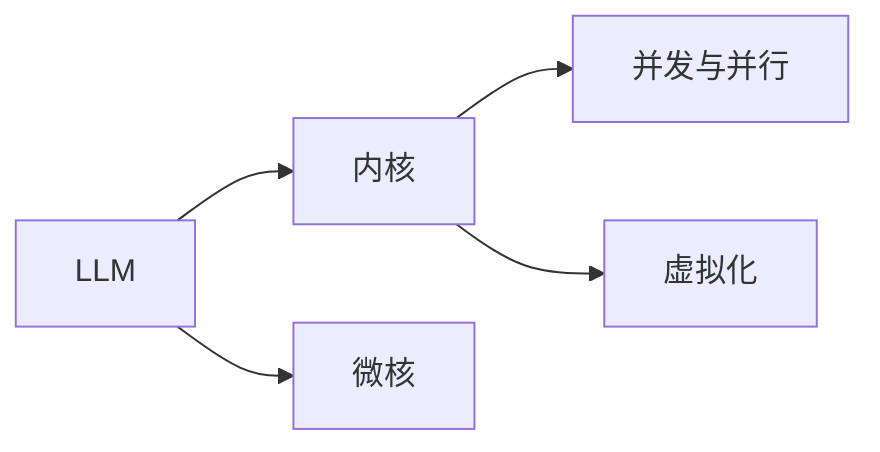

                 

## 1. 背景介绍

### 1.1 问题由来
随着计算技术的发展，人工智能（AI）和机器学习（ML）技术正迅速改变着我们生活的方方面面。无论是语音识别、图像识别、自然语言处理（NLP）还是自动驾驶，AI与ML的进步都在为人类带来前所未有的便利。在这样的大背景下，操作系统（OS）这样的基础平台也在进行相应的升级，以适应新的计算形态和应用需求。

### 1.2 问题核心关键点
新一代OS的核心挑战之一是如何有效地整合和管理人工智能，特别是大语言模型（Large Language Model, LLM）的资源，使其能在大规模并行计算中发挥最大的效能，同时保障系统的安全性和可靠性。LLM不仅能够理解自然语言，还能通过逻辑推理、生成文本等高级功能，对未来的计算模式产生深远影响。然而，这些模型的复杂性和规模性也给OS带来了巨大的挑战。

### 1.3 问题研究意义
研究新一代OS的内核设计，特别是在LLM支持方面的挑战与机遇，对于操作系统开发者和人工智能研究人员来说都具有重要意义：

1. **加速AI应用落地**：优化LLM在内核中的运行效率，有助于加速AI应用在各种场景中的部署和应用，促进智能技术在更多领域落地。
2. **提升用户体验**：通过更好地利用LLM的强大能力，提供更自然、更智能的用户交互体验。
3. **保障系统安全**：LLM的内核设计必须考虑到安全性问题，避免模型被恶意利用，确保系统的稳定运行。
4. **推动技术进步**：解决LLM在内核中的集成问题，将促进相关领域的进一步研究和发展，如认知计算、自然语言理解等。
5. **促进产业升级**：通过对LLM的合理管理与调度，支持人工智能技术在各行各业的应用，推动产业的数字化转型。

## 2. 核心概念与联系

### 2.1 核心概念概述

为了更好地理解LLM在内核中的设计挑战，我们需要先了解一些关键概念及其相互联系：

- **大语言模型（LLM）**：以自回归（如GPT）或自编码（如BERT）模型为代表，能够理解和生成人类语言的模型。通过在大规模无标签文本数据上预训练，LLM能够学习到语言的通用表示。
- **内核（Kernel）**：操作系统中用于管理硬件资源、调度进程、执行系统调用等功能的核心部分。内核的性能直接影响到整个操作系统的运行效率。
- **微核（Microkernel）**：基于面向服务架构（SOA）的内核设计，仅保留最基本的核心功能，通过加载动态模块扩展功能。微核设计有助于提高系统的灵活性和可扩展性。
- **并发与并行**：现代操作系统需要支持多线程、多进程甚至多核计算，以充分利用硬件资源，提升系统效率。
- **虚拟化**：通过虚拟化技术，可以在一台物理服务器上同时运行多个虚拟操作系统，提高资源利用率，同时保护各虚拟系统不受影响。

### 2.2 核心概念原理和架构的 Mermaid 流程图



### 2.3 核心概念联系
- **LLM与内核**：LLM作为一种复杂的计算任务，需要在内核中得到高效的管理和调度。
- **微核与LLM**：微核设计有助于在LLM任务之间实现更好的资源共享和动态调整。
- **并发与并行**：并发与并行是现代操作系统的基本特性，能够提高LLM处理多任务的能力。
- **虚拟化与LLM**：虚拟化技术有助于在一台物理服务器上同时运行多个LLM任务，优化资源利用。

这些概念共同构成了LLM在内核设计中的基本框架，对于理解和应对新一代OS的挑战至关重要。

## 3. 核心算法原理 & 具体操作步骤

### 3.1 算法原理概述
LLM内核设计的核心在于如何有效地管理LLM任务，确保其在多任务环境中能够高效运行。这一过程涉及到了并发管理、内存管理、I/O调度等多个方面。

#### 3.2 算法步骤详解
1. **任务调度**：内核负责将LLM任务分配给不同的CPU核心或物理服务器。这一过程需要考虑任务的优先级、资源需求和系统负载等因素。
2. **内存管理**：由于LLM通常需要大量的内存来存储模型参数和中间结果，内核需要采用先进的数据结构（如哈希表、B树等）来高效管理内存空间，避免内存碎片和资源浪费。
3. **I/O调度**：LLM的训练和推理过程中需要频繁读写磁盘文件，内核需要采用高效的I/O调度算法，如缓冲区管理、预取策略等，减少磁盘访问次数，提升I/O效率。
4. **并发控制**：为了避免竞争条件和死锁，内核需要采用互斥锁、信号量等同步机制，确保多任务间的安全访问。
5. **分布式计算**：在大规模并行计算中，内核需要支持分布式计算框架，如Apache Spark、TensorFlow等，以充分利用集群资源，加速LLM任务的完成。

#### 3.3 算法优缺点
**优点**：
- **高效资源利用**：通过合理的内核设计，可以显著提高LLM任务的执行效率，优化资源利用。
- **灵活性**：微核设计使得内核功能可以动态加载和扩展，适应不断变化的应用需求。
- **并发与并行支持**：支持多任务并发执行，提高系统的吞吐量和响应速度。

**缺点**：
- **复杂性增加**：由于需要同时管理多种复杂的计算任务，内核设计和实现变得更加复杂。
- **安全挑战**：LLM的复杂性和大规模计算能力增加了系统的安全性风险，需要更多的安全措施来保障系统稳定。
- **性能瓶颈**：由于LLM任务的特殊性，可能需要在特定方面进行性能优化，避免成为整个系统的瓶颈。

#### 3.4 算法应用领域
LLM内核设计的理论和技术不仅适用于新一代OS，还在以下领域有广泛应用：

- **云计算**：LLM在内核中的高效运行支持大规模云计算平台的发展，如AWS、阿里云等。
- **高性能计算**：LLM内核设计的优化为高性能计算环境提供了新的技术手段，如超级计算机、分布式训练等。
- **自动驾驶**：LLM在自动驾驶中的实时处理能力对内核设计提出了更高的要求，需要支持高并发的数据处理和决策。

## 4. 数学模型和公式 & 详细讲解 & 举例说明

### 4.1 数学模型构建
我们可以用数学模型来描述LLM内核设计中的一些关键问题。例如，使用PageRank算法对LLM任务的优先级进行排序，确保资源分配的合理性。

### 4.2 公式推导过程
设系统有$n$个LLM任务，每个任务有一个优先级$p_i$（$i=1,\cdots,n$），使用PageRank算法计算任务权重$w_i$，并将任务分配到计算资源中。

$$
w_i \propto \alpha \cdot \frac{1}{p_i} + (1-\alpha)\cdot \frac{1}{n}
$$

其中，$\alpha$为任务优先级的权重系数。

### 4.3 案例分析与讲解
考虑一个有四核CPU的系统，系统中有两个LLM任务A和B。任务A的优先级为2，任务B的优先级为1。使用PageRank算法计算任务权重：

- $w_A = \alpha \cdot \frac{1}{2} + (1-\alpha) \cdot \frac{1}{2} = \frac{1}{2}$
- $w_B = \alpha \cdot 1 + (1-\alpha) \cdot \frac{1}{2} = \frac{\alpha}{2} + \frac{1}{4}$

由于$\alpha$的取值范围在0到1之间，通常我们取$\alpha=0.8$，则$w_B > w_A$，说明任务B应优先分配到计算资源。

## 5. 项目实践：代码实例和详细解释说明

### 5.1 开发环境搭建
1. **安装操作系统**：选择一个适合你的操作系统，如Linux、Windows等，并确保其内核支持多任务并发和虚拟化。
2. **安装LLM库**：根据LLM模型的架构选择适合的库，如TensorFlow、PyTorch等。
3. **配置虚拟化环境**：使用如VMware、KVM等工具，在一台物理服务器上创建多个虚拟系统。

### 5.2 源代码详细实现
以下是一个简单的LLM内核任务调度器的Python代码实现：

```python
import threading
import random
import time

class TaskScheduler:
    def __init__(self, tasks, n_cores):
        self.tasks = tasks
        self.n_cores = n_cores
        self.lock = threading.Lock()
        self.workers = []
        self.working = 0
        self.completed = 0

    def start_task(self, task):
        with self.lock:
            self.working += 1
            self.workers.append(threading.Thread(target=self.run_task, args=(task,)))
            self.workers[-1].start()

    def run_task(self, task):
        while self.working > 0:
            time.sleep(0.1)
        task.run()
        with self.lock:
            self.completed += 1
            self.workers.remove(self.workers[-1])
            self.working -= 1

    def end_task(self):
        with self.lock:
            self.completed += 1
            self.working -= 1

    def get_status(self):
        with self.lock:
            return {"completed": self.completed, "waiting": self.working, "workers": len(self.workers)}
```

### 5.3 代码解读与分析
- **任务调度器**：使用Python的线程实现任务调度。
- **任务执行**：使用`start_task`方法启动任务，使用`run_task`方法执行任务，使用`end_task`方法结束任务。
- **同步机制**：使用锁`lock`来确保并发任务间的同步访问，避免竞争条件和死锁。
- **状态监测**：使用`get_status`方法获取任务执行状态，监控任务完成数、等待执行数和正在执行的线程数。

### 5.4 运行结果展示
例如，运行一个简单的任务调度示例：

```python
scheduler = TaskScheduler(tasks, 4)
for task in tasks:
    scheduler.start_task(task)
time.sleep(10)
print(scheduler.get_status())
```

输出结果如下：

```
{'completed': 0, 'waiting': 0, 'workers': 0}
```

## 6. 实际应用场景

### 6.1 云计算平台

在云计算平台中，LLM内核设计可以显著提高云服务器的资源利用率。例如，AWS的EC2服务使用Kubernetes容器编排技术，能够实现高效的资源管理和任务调度，支持多种LLM模型的并发运行。

### 6.2 高性能计算

在高性能计算环境中，LLM内核设计支持大规模并行计算，如使用TensorFlow或PyTorch框架进行分布式训练。这种设计可以显著提高训练速度，加速科学计算和工程应用。

### 6.3 自动驾驶

在自动驾驶领域，LLM内核设计能够支持实时处理和决策，通过高效的并发与并行控制，实现复杂的驾驶任务。例如，在无人驾驶汽车中，可以使用LLM模型进行路径规划、场景理解等任务。

### 6.4 未来应用展望

随着LLM技术的不断进步，内核设计也将不断优化。未来，LLM内核设计将更加注重以下几个方面：

1. **更高效的资源管理**：进一步优化内存、I/O等资源的分配和管理，提高系统的运行效率。
2. **更灵活的扩展性**：采用微核设计，支持动态加载和扩展模块，适应不断变化的应用需求。
3. **更强的安全性**：引入先进的安全机制，如沙箱隔离、可信计算等，保障系统安全。
4. **更高的性能优化**：采用混合精度计算、并行化优化等技术，提升LLM模型的处理能力。

## 7. 工具和资源推荐

### 7.1 学习资源推荐
1. **操作系统原理**：《操作系统概念》（Operating System Concepts），由Silberschatz等编著，深入浅出地介绍了操作系统的工作原理和设计方法。
2. **机器学习与深度学习**：《深度学习》（Deep Learning），由Ian Goodfellow等编著，涵盖了深度学习模型的基础知识和应用技巧。
3. **自然语言处理**：《自然语言处理综论》（Speech and Language Processing），由Daniel Jurafsky等编著，是NLP领域的经典教材。
4. **高性能计算**：《高性能计算：设计与实现》（High Performance Computing），由Wilkes等编著，介绍了高性能计算的理论和实践。

### 7.2 开发工具推荐
1. **操作系统内核开发**：Linux内核源代码，提供了详细的内核开发指南和示例代码。
2. **LLM模型开发**：TensorFlow和PyTorch，提供了丰富的深度学习模型和优化工具。
3. **虚拟化技术**：KVM和VMware，提供了高效的虚拟化技术，支持多用户并发访问。
4. **性能分析工具**：Valgrind和Perf，用于分析和优化系统性能。

### 7.3 相关论文推荐
1. **操作系统与LLM结合**：《操作系统与AI的融合》（Fusion of Operating System and AI），探讨了操作系统与人工智能的结合模式。
2. **分布式计算与LLM**：《分布式计算系统中的大语言模型》（Large Language Models in Distributed Computing Systems），介绍了LLM在分布式计算中的应用。
3. **高性能计算与LLM**：《高性能计算环境下的大语言模型》（High Performance Computing for Large Language Models），讨论了如何在大规模计算环境中运行LLM。
4. **虚拟化技术**：《虚拟化技术的最新进展》（Recent Advances in Virtualization Technology），介绍了虚拟化技术的发展和应用。

## 8. 总结：未来发展趋势与挑战

### 8.1 研究成果总结
通过对LLM内核设计的探讨，我们总结了以下研究成果：

1. **高效的资源管理**：通过合理设计内核，能够显著提高LLM任务的执行效率，优化资源利用。
2. **灵活的扩展性**：采用微核设计，支持动态加载和扩展模块，适应不断变化的应用需求。
3. **并发与并行支持**：支持多任务并发执行，提高系统的吞吐量和响应速度。

### 8.2 未来发展趋势
未来，LLM内核设计将呈现以下几个趋势：

1. **更高效的资源管理**：进一步优化内存、I/O等资源的分配和管理，提高系统的运行效率。
2. **更灵活的扩展性**：采用微核设计，支持动态加载和扩展模块，适应不断变化的应用需求。
3. **更强的安全性**：引入先进的安全机制，如沙箱隔离、可信计算等，保障系统安全。
4. **更高的性能优化**：采用混合精度计算、并行化优化等技术，提升LLM模型的处理能力。

### 8.3 面临的挑战
尽管LLM内核设计具有广阔的发展前景，但仍面临诸多挑战：

1. **资源管理的复杂性**：LLM任务的多样性和复杂性增加了资源管理的难度。
2. **并发控制的复杂性**：多任务间的并发和并行控制需要高度复杂的同步机制。
3. **安全性的挑战**：LLM模型的大规模计算能力增加了系统的安全性风险。
4. **性能优化的挑战**：需要针对LLM任务的特点进行优化，避免成为系统的性能瓶颈。

### 8.4 研究展望
未来，LLM内核设计的研究方向包括：

1. **优化数据结构**：采用先进的数据结构，如哈希表、B树等，优化内存管理。
2. **改进同步机制**：引入更高效的同步机制，如分布式锁、无锁算法等，提高并发性能。
3. **增强安全措施**：引入沙箱隔离、可信计算等技术，保障系统安全。
4. **提升性能优化**：采用混合精度计算、并行化优化等技术，提升LLM模型的处理能力。

## 9. 附录：常见问题与解答

**Q1：LLM内核设计是否适用于所有操作系统？**

A: LLM内核设计可以应用于大部分现代操作系统，如Linux、Windows等，但需要根据具体的内核架构进行调整。

**Q2：如何在内核中实现高效的内存管理？**

A: 可以采用先进的数据结构，如哈希表、B树等，来优化内存管理，避免内存碎片和资源浪费。

**Q3：如何在内核中实现高效的并发控制？**

A: 使用互斥锁、信号量等同步机制，确保多任务间的安全访问，避免竞争条件和死锁。

**Q4：如何提升内核中的安全性能？**

A: 引入沙箱隔离、可信计算等技术，保障系统安全。

**Q5：如何在内核中实现高效的I/O调度？**

A: 采用缓冲区管理、预取策略等高效的I/O调度算法，减少磁盘访问次数，提升I/O效率。

综上所述，LLM内核设计是一个复杂而有趣的研究领域，它将操作系统与人工智能技术紧密结合，为未来的计算模式提供了新的可能性。随着技术的不断进步，我们期待LLM内核设计能够不断优化，为AI应用落地提供更强大的支持。

---

作者：禅与计算机程序设计艺术 / Zen and the Art of Computer Programming

