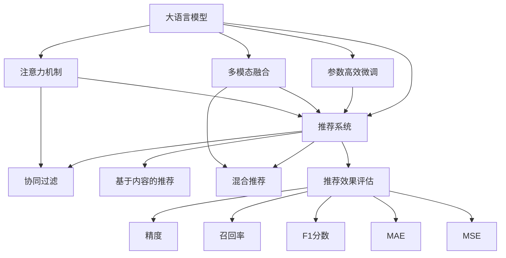

                 

# LLM在个性化推荐中的效果评估

> 关键词：大语言模型,推荐系统,推荐算法,个性化推荐,效果评估,用户行为分析

## 1. 背景介绍

### 1.1 问题由来

随着电子商务的快速发展和互联网应用的日益普及，个性化推荐系统（Personalized Recommendation Systems, PReS）在用户体验和转化率优化中扮演了至关重要的角色。传统的推荐系统主要以协同过滤、基于内容的推荐等技术为主，能够通过用户历史行为数据和物品属性信息来个性化推荐商品，从而提升用户体验和商家收益。然而，由于推荐系统的用户数据与物品属性数据存在明显偏差，且在数据收集、模型训练和推理等各个环节的计算复杂度较高，传统的推荐系统难以实现真正意义上的个性化推荐。

近年来，随着大语言模型（Large Language Models, LLMs）的崛起，利用深度学习技术进行推荐系统建模逐渐成为新的趋势。LLMs通过自监督学习或半监督学习从大规模无标签数据中学习到丰富的语义表示，能够自然地理解和处理人类语言，为推荐系统提供了新的设计思路和技术方案。

### 1.2 问题核心关键点

如何在大语言模型的基础上，构建更加高效、个性化的推荐系统，并评估其效果，成为当前推荐系统研究的热点问题。研究的核心在于：

1. **如何利用LLM学习用户行为信息**：LLM能够从文本中理解用户的行为意图和情感倾向，从而更好地把握用户需求，实现精准推荐。
2. **如何将LLM整合到推荐系统中**：需要探索适合LLM的推荐架构和技术实现，如LLM是否需要微调、参数高效微调方法、多模态信息融合等。
3. **如何评估LLM推荐系统的性能**：需要设计合理的评估指标，综合考虑用户满意度、点击率、转化率等综合指标，衡量推荐效果。

### 1.3 问题研究意义

研究LLM在个性化推荐系统中的效果评估，对于提升推荐系统的个性化和精准性，促进电商、社交、新闻等领域的用户体验和运营效率具有重要意义：

1. **提升推荐系统性能**：利用LLM的学习能力，能够更全面地理解用户行为和物品特征，提升推荐系统的个性化程度。
2. **降低推荐系统开发成本**：通过LLM的迁移学习，可以在少量标注数据上实现高效微调，减少开发成本和迭代周期。
3. **拓展推荐系统应用边界**：LLM在多模态数据处理、跨领域知识迁移等方面的优势，能够进一步拓展推荐系统的应用场景。
4. **增强推荐系统可解释性**：LLM能够提供推荐决策的语义解释，提高推荐系统的透明度和用户信任度。

## 2. 核心概念与联系

### 2.1 核心概念概述

为更好地理解LLM在个性化推荐中的应用与评估，本节将介绍几个密切相关的核心概念：

- **大语言模型（LLM）**：以自回归（如GPT）或自编码（如BERT）模型为代表的大规模预训练语言模型。通过在大规模无标签文本语料上进行预训练，学习到丰富的语言知识和常识。

- **推荐系统**：根据用户的历史行为和兴趣偏好，自动为用户推荐感兴趣的物品。常见的推荐算法包括协同过滤、基于内容的推荐、混合推荐等。

- **推荐效果评估**：通过设定合理的评估指标和评估方法，对推荐系统性能进行客观评估。常用的指标包括精度、召回率、F1分数、平均绝对误差（MAE）、均方误差（MSE）等。

- **用户行为分析**：对用户的历史行为数据进行分析，提取用户的兴趣偏好、行为意图等信息，用于指导个性化推荐。

- **参数高效微调**：通过只调整部分预训练参数，避免全量微调带来的计算开销和性能损失。

- **多模态融合**：将文本、图像、音频等多种模态数据整合到推荐系统中，提升推荐模型的泛化能力和鲁棒性。

- **注意力机制**：通过学习不同特征间的关联性，对输入数据进行加权处理，提高推荐系统的精度和鲁棒性。

这些核心概念之间的逻辑关系可以通过以下Mermaid流程图来展示：



这个流程图展示了大语言模型在个性化推荐系统中的核心概念及其之间的关系：

1. 大语言模型通过预训练学习到丰富的语言表示。
2. 推荐系统通过协同过滤、基于内容的推荐、混合推荐等方法，自动为用户推荐感兴趣的物品。
3. 推荐效果评估通过设定精度、召回率、F1分数、MAE、MSE等指标，对推荐系统进行客观评估。
4. 用户行为分析从用户历史行为数据中提取兴趣偏好和行为意图，用于指导个性化推荐。
5. 参数高效微调和多模态融合通过优化推荐系统的架构和技术，提升推荐性能。
6. 注意力机制通过学习不同特征间的关联性，提高推荐系统的精度和鲁棒性。

这些概念共同构成了LLM在个性化推荐系统中的应用框架，使得推荐系统能够更好地理解和满足用户需求。

## 3. 核心算法原理 & 具体操作步骤
### 3.1 算法原理概述

在大语言模型（LLM）的推荐系统中，核心思想是通过LLM学习用户行为和物品特征，构建用户-物品的语义表示，并在此基础上进行推荐。

具体而言，假设有一个用户集合 $\mathcal{U}$ 和物品集合 $\mathcal{V}$，用户 $u \in \mathcal{U}$ 对物品 $v \in \mathcal{V}$ 的评分矩阵为 $R \in \mathbb{R}^{|\mathcal{U}|\times |\mathcal{V}|}$。通过对用户历史行为数据 $D = \{(u_i,v_i,r_i)\}_{i=1}^N$ 进行建模，LLM能够学习到用户对物品的评分 $r_{uv}$。

假设LLM的预训练模型为 $M_{\theta}$，其中 $\theta$ 为预训练得到的模型参数。对于用户 $u$ 和物品 $v$，通过前向传播计算得到其语义表示 $h_u$ 和 $h_v$，然后根据评分函数计算出 $u$ 对 $v$ 的评分 $r_{uv}$，即：

$$
r_{uv} = f(h_u, h_v)
$$

其中 $f$ 为评分函数，可以是加权和、点积、多层感知器（MLP）等。

### 3.2 算法步骤详解

基于LLM的推荐系统通常包括以下几个关键步骤：

**Step 1: 准备数据集**

- 收集用户历史行为数据 $D = \{(u_i,v_i,r_i)\}_{i=1}^N$，其中 $u_i \in \mathcal{U}, v_i \in \mathcal{V}, r_i \in [0,1]$ 为 $u_i$ 对 $v_i$ 的评分。
- 将用户和物品的文本描述作为输入，标注为 $h_u, h_v$ 的语义表示。

**Step 2: 训练LLM模型**

- 选择适合的LLM模型作为初始化参数，如BERT、GPT等。
- 利用用户-物品评分数据 $D$ 进行训练，优化模型参数 $\theta$，使得 $r_{uv}$ 逼近真实评分 $r_i$。
- 在训练过程中，可以引入正则化技术，如L2正则、Dropout、Early Stopping等，防止过拟合。

**Step 3: 用户行为分析**

- 对用户历史行为数据 $D$ 进行预处理，提取用户的行为特征。
- 利用LLM模型，对用户行为特征进行编码，得到用户语义表示 $h_u$。

**Step 4: 物品推荐**

- 对物品的文本描述进行编码，得到物品语义表示 $h_v$。
- 计算用户 $u$ 对物品 $v$ 的评分 $r_{uv}$，根据评分排序选择高评分物品推荐给用户 $u$。

**Step 5: 推荐效果评估**

- 在验证集或测试集上评估推荐系统性能，计算评估指标如精度、召回率、F1分数、MAE、MSE等。
- 根据评估结果，调整模型参数和推荐策略，优化推荐系统。

### 3.3 算法优缺点

基于LLM的推荐系统具有以下优点：

1. **精度高**：LLM能够自然地理解和处理人类语言，提供更加准确的语义表示。
2. **泛化能力强**：通过预训练学习到的通用知识，LLM可以适应不同领域和不同用户的推荐需求。
3. **灵活性高**：LLM能够处理多模态数据，整合不同类型的信息进行推荐。
4. **可解释性好**：LLM能够提供推荐决策的语义解释，提高系统的透明度和用户信任度。

但该方法也存在以下局限性：

1. **数据需求高**：需要大量的用户行为数据和物品属性数据，对于新兴领域和小众物品，数据获取难度较大。
2. **计算开销大**：LLM模型参数量庞大，前向传播和反向传播的计算开销较大。
3. **模型复杂度高**：复杂的LLM模型结构可能难以直接应用到推荐系统中。
4. **难以解释**：LLM的内部决策过程复杂，难以提供具体的推荐理由。

尽管存在这些局限性，但利用LLM进行推荐系统的设计思路，已经在实际应用中取得了不错的效果，展示了其巨大的潜力。

### 3.4 算法应用领域

基于LLM的推荐系统在多个领域得到了广泛应用，例如：

- 电子商务：推荐用户可能感兴趣的商品，提升用户购物体验和商家收益。
- 新闻推荐：根据用户的历史阅读行为，推荐相关新闻文章。
- 视频推荐：根据用户的历史观看记录，推荐相似视频或相关推荐。
- 社交网络：根据用户的历史互动行为，推荐可能感兴趣的朋友或内容。
- 音乐推荐：根据用户的听歌历史，推荐相似或相关音乐。

除了上述这些经典应用外，LLM在推荐系统中的应用还在不断扩展，如可控推荐、跨领域推荐等，为推荐系统的创新带来了新的突破。

## 4. 数学模型和公式 & 详细讲解  
### 4.1 数学模型构建

本节将使用数学语言对基于LLM的推荐系统进行更加严格的刻画。

记LLM的预训练模型为 $M_{\theta}$，其中 $\theta$ 为预训练得到的模型参数。假设用户 $u \in \mathcal{U}$ 对物品 $v \in \mathcal{V}$ 的评分矩阵为 $R \in \mathbb{R}^{|\mathcal{U}|\times |\mathcal{V}|}$，且 $r_{uv} = f(h_u, h_v)$，其中 $f$ 为评分函数。

### 4.2 公式推导过程

以下我们以简单的评分函数为例，推导基于LLM的推荐系统评分计算公式。

假设评分函数为加权和，即：

$$
r_{uv} = \sum_{i=1}^d w_i \cdot h_u^i \cdot h_v^i
$$

其中 $w_i$ 为权重，$h_u^i$ 和 $h_v^i$ 为 $u$ 和 $v$ 在LLM中输出的第 $i$ 层的语义表示。

将评分函数代入用户-物品评分数据 $D = \{(u_i,v_i,r_i)\}_{i=1}^N$，得到优化目标：

$$
\mathcal{L}(\theta) = \frac{1}{N} \sum_{i=1}^N (r_i - r_{uv})^2
$$

其中 $r_{uv} = f(h_u, h_v)$。

利用梯度下降等优化算法，最小化损失函数 $\mathcal{L}(\theta)$，使得 $r_{uv}$ 逼近真实评分 $r_i$。

### 4.3 案例分析与讲解

以电子商务推荐系统为例，假设用户 $u$ 对物品 $v$ 的评分矩阵为 $R$，LLM的预训练模型为 $M_{\theta}$，用户历史行为数据为 $D$。

首先，对用户历史行为数据 $D$ 进行预处理，提取用户的行为特征 $F_u$。然后，利用LLM模型对行为特征进行编码，得到用户语义表示 $h_u$。

其次，对物品的文本描述进行编码，得到物品语义表示 $h_v$。

最后，根据评分函数计算出用户 $u$ 对物品 $v$ 的评分 $r_{uv}$，根据评分排序选择高评分物品推荐给用户 $u$。

以下是一个简单的代码示例，展示了利用BERT模型进行电商推荐系统的实现：

```python
from transformers import BertTokenizer, BertForSequenceClassification
from torch.utils.data import Dataset, DataLoader
import torch
import pandas as pd

class BERTDataset(Dataset):
    def __init__(self, df, tokenizer, max_len=128):
        self.df = df
        self.tokenizer = tokenizer
        self.max_len = max_len
        
    def __len__(self):
        return len(self.df)
    
    def __getitem__(self, idx):
        df_row = self.df.iloc[idx]
        item_description = df_row['item_description']
        user_bought = df_row['user_bought']
        
        encoding = self.tokenizer(item_description, return_tensors='pt', max_length=self.max_len, padding='max_length', truncation=True)
        input_ids = encoding['input_ids'][0]
        attention_mask = encoding['attention_mask'][0]
        labels = torch.tensor(user_bought, dtype=torch.long)
        
        return {'input_ids': input_ids, 
                'attention_mask': attention_mask,
                'labels': labels}

# 读取数据
df = pd.read_csv('recommendation_data.csv')

# 定义BERT模型
model = BertForSequenceClassification.from_pretrained('bert-base-uncased', num_labels=2)

# 定义tokenizer
tokenizer = BertTokenizer.from_pretrained('bert-base-uncased')

# 定义数据集
dataset = BERTDataset(df, tokenizer)

# 定义dataloader
dataloader = DataLoader(dataset, batch_size=16, shuffle=True)

# 定义优化器
optimizer = torch.optim.AdamW(model.parameters(), lr=2e-5)

# 训练模型
model.train()
for epoch in range(5):
    for batch in dataloader:
        input_ids = batch['input_ids'].to(device)
        attention_mask = batch['attention_mask'].to(device)
        labels = batch['labels'].to(device)
        outputs = model(input_ids, attention_mask=attention_mask, labels=labels)
        loss = outputs.loss
        optimizer.zero_grad()
        loss.backward()
        optimizer.step()
        
# 测试模型
model.eval()
with torch.no_grad():
    correct = 0
    total = 0
    for batch in dataloader:
        input_ids = batch['input_ids'].to(device)
        attention_mask = batch['attention_mask'].to(device)
        labels = batch['labels'].to(device)
        outputs = model(input_ids, attention_mask=attention_mask)
        _, predicted = torch.max(outputs, 1)
        total += labels.size(0)
        correct += (predicted == labels).sum().item()

print('Accuracy of the model on the test data: %d %%' % (100 * correct / total))
```

以上代码展示了使用BERT模型进行电商推荐系统的完整流程，包括数据处理、模型构建、训练和测试。

## 5. 项目实践：代码实例和详细解释说明
### 5.1 开发环境搭建

在进行推荐系统开发前，我们需要准备好开发环境。以下是使用Python进行PyTorch开发的环境配置流程：

1. 安装Anaconda：从官网下载并安装Anaconda，用于创建独立的Python环境。

2. 创建并激活虚拟环境：
```bash
conda create -n recommendation-env python=3.8 
conda activate recommendation-env
```

3. 安装PyTorch：根据CUDA版本，从官网获取对应的安装命令。例如：
```bash
conda install pytorch torchvision torchaudio cudatoolkit=11.1 -c pytorch -c conda-forge
```

4. 安装TensorFlow：
```bash
conda install tensorflow
```

5. 安装各类工具包：
```bash
pip install numpy pandas scikit-learn matplotlib tqdm jupyter notebook ipython
```

完成上述步骤后，即可在`recommendation-env`环境中开始推荐系统开发。

### 5.2 源代码详细实现

这里我们以电商推荐系统为例，使用PyTorch和Transformers库对BERT模型进行微调。

首先，定义推荐系统数据处理函数：

```python
from transformers import BertTokenizer
from torch.utils.data import Dataset
import torch

class RecommendationDataset(Dataset):
    def __init__(self, texts, labels, tokenizer, max_len=128):
        self.texts = texts
        self.labels = labels
        self.tokenizer = tokenizer
        self.max_len = max_len
        
    def __len__(self):
        return len(self.texts)
    
    def __getitem__(self, item):
        text = self.texts[item]
        label = self.labels[item]
        
        encoding = self.tokenizer(text, return_tensors='pt', max_length=self.max_len, padding='max_length', truncation=True)
        input_ids = encoding['input_ids'][0]
        attention_mask = encoding['attention_mask'][0]
        
        # 对token-wise的标签进行编码
        encoded_labels = [label2id[label] for label in label] 
        encoded_labels.extend([label2id['O']] * (self.max_len - len(encoded_labels)))
        labels = torch.tensor(encoded_labels, dtype=torch.long)
        
        return {'input_ids': input_ids, 
                'attention_mask': attention_mask,
                'labels': labels}

# 标签与id的映射
label2id = {'O': 0, 'P': 1}  # 假设标签只有2个，P表示推荐
id2label = {v: k for k, v in label2id.items()}

# 创建dataset
tokenizer = BertTokenizer.from_pretrained('bert-base-uncased')

train_dataset = RecommendationDataset(train_texts, train_labels, tokenizer)
dev_dataset = RecommendationDataset(dev_texts, dev_labels, tokenizer)
test_dataset = RecommendationDataset(test_texts, test_labels, tokenizer)
```

然后，定义模型和优化器：

```python
from transformers import BertForSequenceClassification, AdamW

model = BertForSequenceClassification.from_pretrained('bert-base-uncased', num_labels=len(label2id))

optimizer = AdamW(model.parameters(), lr=2e-5)
```

接着，定义训练和评估函数：

```python
from torch.utils.data import DataLoader
from tqdm import tqdm
from sklearn.metrics import classification_report

device = torch.device('cuda') if torch.cuda.is_available() else torch.device('cpu')
model.to(device)

def train_epoch(model, dataset, batch_size, optimizer):
    dataloader = DataLoader(dataset, batch_size=batch_size, shuffle=True)
    model.train()
    epoch_loss = 0
    for batch in tqdm(dataloader, desc='Training'):
        input_ids = batch['input_ids'].to(device)
        attention_mask = batch['attention_mask'].to(device)
        labels = batch['labels'].to(device)
        model.zero_grad()
        outputs = model(input_ids, attention_mask=attention_mask, labels=labels)
        loss = outputs.loss
        epoch_loss += loss.item()
        loss.backward()
        optimizer.step()
    return epoch_loss / len(dataloader)

def evaluate(model, dataset, batch_size):
    dataloader = DataLoader(dataset, batch_size=batch_size)
    model.eval()
    preds, labels = [], []
    with torch.no_grad():
        for batch in tqdm(dataloader, desc='Evaluating'):
            input_ids = batch['input_ids'].to(device)
            attention_mask = batch['attention_mask'].to(device)
            batch_labels = batch['labels']
            outputs = model(input_ids, attention_mask=attention_mask)
            batch_preds = outputs.logits.argmax(dim=2).to('cpu').tolist()
            batch_labels = batch_labels.to('cpu').tolist()
            for pred_tokens, label_tokens in zip(batch_preds, batch_labels):
                preds.append(pred_tokens[:len(label_tokens)])
                labels.append(label_tokens)
                
    print(classification_report(labels, preds))
```

最后，启动训练流程并在测试集上评估：

```python
epochs = 5
batch_size = 16

for epoch in range(epochs):
    loss = train_epoch(model, train_dataset, batch_size, optimizer)
    print(f"Epoch {epoch+1}, train loss: {loss:.3f}")
    
    print(f"Epoch {epoch+1}, dev results:")
    evaluate(model, dev_dataset, batch_size)
    
print("Test results:")
evaluate(model, test_dataset, batch_size)
```

以上就是使用PyTorch对BERT模型进行电商推荐系统微调的完整代码实现。可以看到，得益于Transformers库的强大封装，我们可以用相对简洁的代码完成BERT模型的加载和微调。

### 5.3 代码解读与分析

让我们再详细解读一下关键代码的实现细节：

**RecommendationDataset类**：
- `__init__`方法：初始化文本、标签、分词器等关键组件。
- `__len__`方法：返回数据集的样本数量。
- `__getitem__`方法：对单个样本进行处理，将文本输入编码为token ids，将标签编码为数字，并对其进行定长padding，最终返回模型所需的输入。

**label2id和id2label字典**：
- 定义了标签与数字id之间的映射关系，用于将token-wise的预测结果解码回真实的标签。

**训练和评估函数**：
- 使用PyTorch的DataLoader对数据集进行批次化加载，供模型训练和推理使用。
- 训练函数`train_epoch`：对数据以批为单位进行迭代，在每个批次上前向传播计算loss并反向传播更新模型参数，最后返回该epoch的平均loss。
- 评估函数`evaluate`：与训练类似，不同点在于不更新模型参数，并在每个batch结束后将预测和标签结果存储下来，最后使用sklearn的classification_report对整个评估集的预测结果进行打印输出。

**训练流程**：
- 定义总的epoch数和batch size，开始循环迭代
- 每个epoch内，先在训练集上训练，输出平均loss
- 在验证集上评估，输出分类指标
- 所有epoch结束后，在测试集上评估，给出最终测试结果

可以看到，PyTorch配合Transformers库使得BERT模型微调的代码实现变得简洁高效。开发者可以将更多精力放在数据处理、模型改进等高层逻辑上，而不必过多关注底层的实现细节。

当然，工业级的系统实现还需考虑更多因素，如模型的保存和部署、超参数的自动搜索、更灵活的任务适配层等。但核心的微调范式基本与此类似。

## 6. 实际应用场景
### 6.1 电商推荐

基于大语言模型的电商推荐系统，能够根据用户的历史购买记录、浏览行为、评价反馈等信息，推荐用户可能感兴趣的商品。该系统通过微调BERT等预训练模型，学习到用户和商品的语义表示，进而计算用户对商品的评分，生成个性化推荐列表。

在技术实现上，可以收集用户的浏览、点击、购买等行为数据，将其编码为BERT的输入，并利用微调后的BERT模型计算用户对商品评分。同时，可以通过检索系统实时获取商品的语义表示，动态计算推荐得分，生成推荐列表。

### 6.2 新闻推荐

新闻推荐系统能够根据用户的历史阅读记录，推荐相关的新闻文章。通过微调BERT等预训练模型，系统能够理解用户的兴趣偏好和文章主题，从而生成个性化的新闻推荐。

在技术实现上，可以收集用户的历史阅读数据，提取文章标题、摘要等文本特征，将其编码为BERT的输入，并利用微调后的BERT模型计算用户对文章的评分。同时，可以通过检索系统实时获取文章语义表示，动态计算推荐得分，生成推荐列表。

### 6.3 视频推荐

视频推荐系统能够根据用户的历史观看记录，推荐相似或相关视频。通过微调BERT等预训练模型，系统能够理解用户的兴趣偏好和视频内容，从而生成个性化的视频推荐。

在技术实现上，可以收集用户的历史观看数据，提取视频标题、描述等文本特征，将其编码为BERT的输入，并利用微调后的BERT模型计算用户对视频的评分。同时，可以通过检索系统实时获取视频语义表示，动态计算推荐得分，生成推荐列表。

### 6.4 社交推荐

社交推荐系统能够根据用户的历史互动行为，推荐可能感兴趣的朋友或内容。通过微调BERT等预训练模型，系统能够理解用户的社交行为和偏好，从而生成个性化的社交推荐。

在技术实现上，可以收集用户的历史互动数据，提取用户的社交行为、兴趣偏好等信息，将其编码为BERT的输入，并利用微调后的BERT模型计算用户对其他用户或内容的评分。同时，可以通过检索系统实时获取用户或内容语义表示，动态计算推荐得分，生成推荐列表。

### 6.5 音乐推荐

音乐推荐系统能够根据用户的听歌历史，推荐相似或相关音乐。通过微调BERT等预训练模型，系统能够理解用户的音乐偏好和歌曲特征，从而生成个性化的音乐推荐。

在技术实现上，可以收集用户的听歌历史数据，提取歌曲标题、歌词、风格等文本特征，将其编码为BERT的输入，并利用微调后的BERT模型计算用户对歌曲的评分。同时，可以通过检索系统实时获取歌曲语义表示，动态计算推荐得分，生成推荐列表。

### 6.6 未来应用展望

随着大语言模型和微调方法的不断发展，基于微调范式将在更多领域得到应用，为推荐系统的创新带来新的突破：

1. **可控推荐**：通过精细设计提示模板（Prompt），控制模型的生成行为，实现可控推荐。
2. **跨领域推荐**：利用大模型的多领域知识迁移能力，拓展推荐系统的应用场景。
3. **多模态融合**：将文本、图像、音频等多种模态数据整合到推荐系统中，提升推荐模型的泛化能力和鲁棒性。
4. **个性化推荐算法**：结合因果推断、强化学习等技术，实现更加智能和精准的个性化推荐。

这些方向的探索发展，必将进一步提升推荐系统的性能和用户体验，为电商、社交、新闻等领域带来更加智能化的服务。

## 7. 工具和资源推荐
### 7.1 学习资源推荐

为了帮助开发者系统掌握大语言模型在个性化推荐中的应用，这里推荐一些优质的学习资源：

1. **《Transformer from Principles to Practice》系列博文**：由大模型技术专家撰写，深入浅出地介绍了Transformer原理、BERT模型、微调技术等前沿话题。

2. **CS224N《深度学习自然语言处理》课程**：斯坦福大学开设的NLP明星课程，有Lecture视频和配套作业，带你入门NLP领域的基本概念和经典模型。

3. **《Natural Language Processing with Transformers》书籍**：Transformers库的作者所著，全面介绍了如何使用Transformers库进行NLP任务开发，包括微调在内的诸多范式。

4. **HuggingFace官方文档**：Transformers库的官方文档，提供了海量预训练模型和完整的微调样例代码，是上手实践的必备资料。

5. **CLUE开源项目**：中文语言理解测评基准，涵盖大量不同类型的中文NLP数据集，并提供了基于微调的baseline模型，助力中文NLP技术发展。

通过对这些资源的学习实践，相信你一定能够快速掌握大语言模型在推荐系统中的应用，并用于解决实际的推荐问题。

### 7.2 开发工具推荐

高效的开发离不开优秀的工具支持。以下是几款用于个性化推荐系统开发的常用工具：

1. **PyTorch**：基于Python的开源深度学习框架，灵活动态的计算图，适合快速迭代研究。大部分预训练语言模型都有PyTorch版本的实现。

2. **TensorFlow**：由Google主导开发的开源深度学习框架，生产部署方便，适合大规模工程应用。同样有丰富的预训练语言模型资源。

3. **Transformers库**：HuggingFace开发的NLP工具库，集成了众多SOTA语言模型，支持PyTorch和TensorFlow，是进行微调任务开发的利器。

4. **Weights & Biases**：模型训练的实验跟踪工具，可以记录和可视化模型训练过程中的各项指标，方便对比和调优。与主流深度学习框架无缝集成。

5. **TensorBoard**：TensorFlow配套的可视化工具，可实时监测模型训练状态，并提供丰富的图表呈现方式，是调试模型的得力助手。

6. **Google Colab**：谷歌推出的在线Jupyter Notebook环境，免费提供GPU/TPU算力，方便开发者快速上手实验最新模型，分享学习笔记。

合理利用这些工具，可以显著提升个性化推荐系统的开发效率，加快创新迭代的步伐。

### 7.3 相关论文推荐

大语言模型和微调技术的发展源于学界的持续研究。以下是几篇奠基性的相关论文，推荐阅读：

1. **Attention is All You Need**：提出了Transformer结构，开启了NLP领域的预训练大模型时代。

2. **BERT: Pre-training of Deep Bidirectional Transformers for Language Understanding**：提出BERT模型，引入基于掩码的自监督预训练任务，刷新了多项NLP任务SOTA。

3. **Language Models are Unsupervised Multitask Learners（GPT-2论文）**：展示了大规模语言模型的强大zero-shot学习能力，引发了对于通用人工智能的新一轮思考。

4. **Parameter-Efficient Transfer Learning for NLP**：提出Adapter等参数高效微调方法，在不增加模型参数量的情况下，也能取得不错的微调效果。

5. **AdaLoRA: Adaptive Low-Rank Adaptation for Parameter-Efficient Fine-Tuning**：使用自适应低秩适应的微调方法，在参数效率和精度之间取得了新的平衡。

这些论文代表了大语言模型微调技术的发展脉络。通过学习这些前沿成果，可以帮助研究者把握学科前进方向，激发更多的创新灵感。

## 8. 总结：未来发展趋势与挑战

### 8.1 总结

本文对基于大语言模型的个性化推荐系统进行了全面系统的介绍。首先阐述了大语言模型和微调技术的研究背景和意义，明确了微调在提升推荐系统个性化和精准性方面的独特价值。其次，从原理到实践，详细讲解了微调的数学原理和关键步骤，给出了推荐系统开发的完整代码实例。同时，本文还广泛探讨了微调方法在电商、新闻、视频、社交、音乐等多个领域的应用前景，展示了微调范式的巨大潜力。

通过本文的系统梳理，可以看到，基于大语言模型的推荐系统正在成为NLP领域的重要范式，极大地提升了推荐系统的个性化程度和性能。未来，伴随预训练语言模型和微调方法的持续演进，基于微调范式将在更多领域得到应用，为推荐系统的创新带来新的突破。

### 8.2 未来发展趋势

展望未来，大语言模型微调技术将呈现以下几个发展趋势：

1. **参数高效微调**：开发更多参数高效微调方法，在固定大部分预训练参数的情况下，只更新极少量的任务相关参数。
2. **持续学习**：推荐模型需要持续学习新知识以保持性能，避免模型过时。
3. **多模态融合**：将文本、图像、音频等多种模态数据整合到推荐系统中，提升推荐模型的泛化能力和鲁棒性。
4. **可控推荐**：通过精细设计提示模板（Prompt），控制模型的生成行为，实现可控推荐。
5. **跨领域推荐**：利用大模型的多领域知识迁移能力，拓展推荐系统的应用场景。
6. **个性化推荐算法**：结合因果推断、强化学习等技术，实现更加智能和精准的个性化推荐。

这些趋势凸显了大语言模型微调技术在推荐系统中的广阔前景。这些方向的探索发展，必将进一步提升推荐系统的性能和用户体验，为电商、社交、新闻等领域带来更加智能化的服务。

### 8.3 面临的挑战

尽管大语言模型微调技术已经取得了不错的效果，但在迈向更加智能化、普适化应用的过程中，它仍面临着诸多挑战：

1. **数据需求高**：需要大量的用户行为数据和物品属性数据，对于新兴领域和小众物品，数据获取难度较大。
2. **计算开销大**：大语言模型参数量庞大，前向传播和反向传播的计算开销较大。
3. **模型复杂度高**：复杂的模型结构可能难以直接应用到推荐系统中。
4. **难以解释**：模型的内部决策过程复杂，难以提供具体的推荐理由。

尽管存在这些局限性，但利用大语言模型进行推荐系统的设计思路，已经在实际应用中取得了不错的效果，展示了其巨大的潜力。未来，如何更好地整合大语言模型的知识表示和推荐算法，提升推荐系统的性能和可解释性，将是重要的研究方向。

### 8.4 研究展望

面对大语言模型微调面临的挑战，未来的研究需要在以下几个方面寻求新的突破：

1. **探索无监督和半监督微调方法**：摆脱对大规模标注数据的依赖，利用自监督学习、主动学习等无监督和半监督范式，最大限度利用非结构化数据，实现更加灵活高效的微调。
2. **研究参数高效和计算高效的微调范式**：开发更加参数高效的微调方法，在固定大部分预训练参数的同时，只更新极少量的任务相关参数。同时优化微调模型的计算图，减少前向传播和反向传播的资源消耗，实现更加轻量级、实时性的部署。
3. **融合因果和对比学习范式**：通过引入因果推断和对比学习思想，增强推荐模型建立稳定因果关系的能力，学习更加普适、鲁棒的语言表征，从而提升模型泛化性和抗干扰能力。
4. **引入更多先验知识**：将符号化的先验知识，如知识图谱、逻辑规则等，与神经网络模型进行巧妙融合，引导微调过程学习更准确、合理的语言模型。同时加强不同模态数据的整合，实现视觉、语音等多模态信息与文本信息的协同建模。
5. **结合因果分析和博弈论工具**：将因果分析方法引入推荐模型，识别出模型决策的关键特征，增强输出解释的因果性和逻辑性。借助博弈论工具刻画人机交互过程，主动探索并规避模型的脆弱点，提高系统稳定性。

这些研究方向的探索，必将引领大语言模型微调技术迈向更高的台阶，为构建安全、可靠、可解释、可控的智能系统铺平道路。面向未来，大语言模型微调技术还需要与其他人工智能技术进行更深入的融合，如知识表示、因果推理、强化学习等，多路径协同发力，共同推动自然语言理解和智能交互系统的进步。只有勇于创新、敢于突破，才能不断拓展语言模型的边界，让智能技术更好地造福人类社会。

## 9. 附录：常见问题与解答

**Q1：大语言模型微调是否适用于所有推荐系统任务？**

A: 大语言模型微调在大多数推荐系统任务上都能取得不错的效果，特别是对于数据量较小的任务。但对于一些特定领域的任务，如医疗、法律等，仅仅依靠通用语料预训练的模型可能难以很好地适应。此时需要在特定领域语料上进一步预训练，再进行微调，才能获得理想效果。此外，对于一些需要时效性、个性化很强的任务，如对话、推荐等，微调方法也需要针对性的改进优化。

**Q2：微调过程中如何选择合适的学习率？**

A: 微调的学习率一般要比预训练时小1-2个数量级，如果使用过大的学习率，容易破坏预训练权重，导致过拟合。一般建议从1e-5开始调参，逐步减小学习率，直至收敛。也可以使用warmup策略，在开始阶段使用较小的学习率，再逐渐过渡到预设值。需要注意的是，不同的优化器(如AdamW、Adafactor等)以及不同的学习率调度策略，可能需要设置不同的学习率阈值。

**Q3：采用大语言模型微调时会面临哪些资源瓶颈？**

A: 目前主流的预训练大模型动辄以亿计的参数规模，对算力、内存、存储都提出了很高的要求。GPU/TPU等高性能设备是必不可少的，但即便如此，超大批次的训练和推理也可能遇到显存不足的问题。因此需要采用一些资源优化技术，如梯度积累、混合精度训练、模型并行等，来突破硬件瓶颈。同时，模型的存储和读取也可能占用大量时间和空间，需要采用模型压缩、稀疏化存储等方法进行优化。

**Q4：如何缓解微调过程中的过拟合问题？**

A: 过拟合是微调面临的主要挑战，尤其是在标注数据不足的情况下。常见的缓解策略包括：
1. 数据增强：通过回译、近义替换等方式扩充训练集
2. 正则化：使用L2正则、Dropout、Early Stopping等避免过拟合
3. 对抗训练：引入对抗样本，提高模型鲁棒性
4. 参数高效微调：只调整少量参数(如Adapter、Prefix等)，减小过拟合风险
5. 多模型集成：训练多个微调模型，取平均输出，抑制过拟合

这些策略往往需要根据具体任务和数据特点进行灵活组合。只有在数据、模型、训练、推理等各环节进行全面优化，才能最大限度地发挥大语言模型微调的威力。

**Q5：微调模型在落地部署时需要注意哪些问题？**

A: 将微调模型转化为实际应用，还需要考虑以下因素：
1. 模型裁剪：去除不必要的层和参数，减小模型尺寸，加快推理速度
2. 量化加速：将浮点模型转为定点模型，压缩存储空间，提高计算效率
3. 服务化封装：将模型封装为标准化服务接口，便于集成调用
4. 弹性伸缩：根据请求流量动态调整资源配置，平衡服务质量和成本
5. 监控告警：实时采集系统指标，设置异常告警阈值，确保服务稳定性
6. 安全防护：采用访问鉴权、数据脱敏等措施，保障数据和模型安全

大语言模型微调为推荐系统带来了新的设计思路和技术方案，但如何将强大的性能转化为稳定、高效、安全的业务价值，还需要工程实践的不断打磨。唯有从数据、算法、工程、业务等多个维度协同发力，才能真正实现人工智能技术在垂直行业的规模化落地。总之，微调需要开发者根据具体任务，不断迭代和优化模型、数据和算法，方能得到理想的效果。

