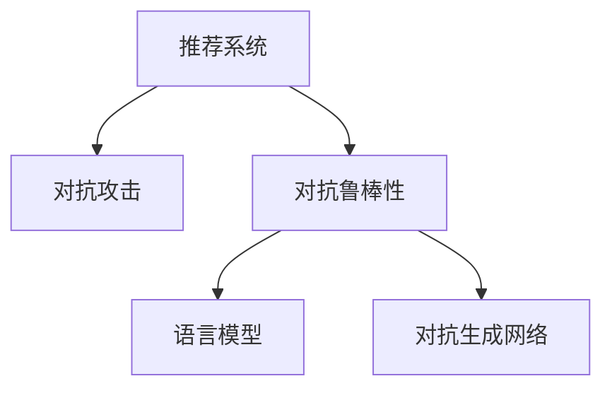

                 

# LLM在推荐系统中的对抗鲁棒性增强

## 1. 背景介绍

推荐系统在电商、社交、新闻、娱乐等众多领域中发挥着至关重要的作用。它通过分析用户的历史行为和属性信息，预测并推荐可能感兴趣的物品，提升用户体验和平台收益。然而，推荐系统面临的恶意攻击和对抗鲁棒性问题日益突出，严重影响其正常运行和安全性。

随着深度学习和自然语言处理技术的不断发展，基于语言模型(LLM)的推荐系统成为新的研究热点。LLM通过大规模预训练，获得丰富的语言知识，能够在用户描述、物品描述等文本数据上进行预训练和微调，从而提升推荐精度。但这种高度依赖文本数据的推荐方式，同样面临着严重的对抗鲁棒性问题。

对抗鲁棒性是指推荐系统在面对对抗攻击的情况下，仍能保持高精度的能力。常见的对抗攻击包括数据中毒、语义篡改、对抗性编辑等。数据中毒攻击通过插入恶意样本误导推荐模型；语义篡改通过修改用户描述、物品描述等文本数据，干扰模型的正常推理；对抗性编辑则通过添加特定的噪声，使推荐结果产生偏差。

本文聚焦于提升基于LLM的推荐系统的对抗鲁棒性，从理论和实践两个角度进行深入探讨，并给出具体的解决方案。通过系统性地增强模型的鲁棒性，确保其在面对恶意攻击时依然能提供高质量的推荐服务，提升用户的信任和满意度。

## 2. 核心概念与联系

### 2.1 核心概念概述

为更好地理解基于LLM的推荐系统的对抗鲁棒性增强方法，本节将介绍几个关键概念：

- 推荐系统(Recommender System)：利用用户行为数据，为用户推荐感兴趣的物品的系统。推荐系统广泛应用于电商、社交、新闻等领域。

- 对抗攻击(Adversarial Attack)：指攻击者通过修改输入数据，使推荐模型产生错误输出的攻击方式。常见的对抗攻击包括数据中毒、语义篡改、对抗性编辑等。

- 对抗鲁棒性(Adversarial Robustness)：指推荐系统在面对对抗攻击时，仍能保持高精度的能力。提高系统的对抗鲁棒性，能够有效防范对抗攻击，保护推荐结果的正确性。

- 语言模型(Language Model)：指通过大规模文本数据进行预训练的深度学习模型，如BERT、GPT等。语言模型能够从文本中提取丰富的语义信息，提升推荐精度。

- 对抗生成网络(Adversarial Generative Network, AGN)：指用于生成对抗样本的深度生成模型，如GAN、VAE等。通过训练AGN，可以生成高精度的对抗样本，用于测试和提升模型的鲁棒性。

这些核心概念之间的逻辑关系可以通过以下Mermaid流程图来展示：



这个流程图展示了大语言模型在推荐系统中的应用场景：

1. 推荐系统利用用户行为数据，为用户推荐感兴趣物品。
2. 对抗攻击可能对推荐结果产生干扰，影响用户体验和系统安全性。
3. 对抗鲁棒性是推荐系统的重要保障，保证推荐结果的正确性。
4. 语言模型通过从文本中提取语义信息，提升推荐精度。
5. 对抗生成网络用于生成高精度的对抗样本，测试和提升模型的鲁棒性。

## 3. 核心算法原理 & 具体操作步骤
### 3.1 算法原理概述

基于LLM的推荐系统在对抗攻击下保持鲁棒性，本质上是一个模型鲁棒性增强的优化问题。其核心思想是：通过对抗生成网络(AGN)生成对抗样本，在原始数据集上添加对抗性噪声，训练鲁棒化的推荐模型。

形式化地，假设推荐模型为 $M_{\theta}:\mathcal{X} \rightarrow \mathcal{Y}$，其中 $\mathcal{X}$ 为输入空间，$\mathcal{Y}$ 为输出空间，$\theta \in \mathbb{R}^d$ 为模型参数。对抗攻击的目标是找到一个对抗样本 $\bar{x}=\delta x$，使得 $M_{\theta}(\bar{x})$ 的输出与原始输出 $M_{\theta}(x)$ 尽可能不同。

为了抵抗对抗攻击，我们需要在训练过程中不断增强模型的鲁棒性，使其能够正确处理对抗性噪声。常用的鲁棒性增强方法包括：

1. 对抗训练(Adversarial Training)：在训练过程中，每次迭代都同时优化原始损失和对抗性噪声。
2. 对抗生成网络(Adversarial Generative Network)：训练一个生成网络，用于生成对抗性噪声。
3. 对抗生成对抗网络(Adversarial Generative Adversarial Network, AGAN)：在对抗生成网络的基础上，再引入一个判别网络，用于区分真实样本和对抗样本。

### 3.2 算法步骤详解

基于LLM的推荐系统对抗鲁棒性增强的实现流程如下：

**Step 1: 准备数据集**
- 收集用户行为数据，将其转化为用户-物品的评分矩阵。
- 准备对抗性噪声的数据生成器，如对抗生成网络或对抗生成对抗网络。

**Step 2: 训练对抗生成网络**
- 使用对抗性噪声生成对抗样本。
- 训练对抗生成网络，使其生成的对抗样本能够欺骗推荐模型。

**Step 3: 对抗训练**
- 在原始评分矩阵上添加对抗性噪声，生成对抗性评分矩阵。
- 使用对抗训练方法，在对抗性评分矩阵上训练推荐模型。

**Step 4: 测试与评估**
- 在测试集上测试推荐模型的性能，对比原始模型和鲁棒模型的推荐精度。
- 对鲁棒模型进行对抗性测试，评估其对抗鲁棒性。

### 3.3 算法优缺点

基于LLM的推荐系统对抗鲁棒性增强方法具有以下优点：

1. 增强模型鲁棒性：通过对抗训练和生成对抗样本，能够提高推荐模型对对抗攻击的抵御能力。
2. 提高推荐精度：在鲁棒性增强的过程中，推荐模型可以进一步优化输出，提升推荐精度。
3. 数据利用率提升：对抗生成网络生成的对抗样本可以充分利用无标签数据，提升数据利用率。

同时，该方法也存在一些局限性：

1. 训练成本高：对抗训练和对抗生成网络训练需要较高的计算资源和时间，且对抗样本的生成质量影响鲁棒性增强效果。
2. 模型复杂度增加：对抗鲁棒性增强方法增加了模型的复杂度，可能导致模型的推理速度变慢。
3. 对抗样本风险：对抗样本可能对模型产生误导，导致推荐结果错误，需引入对抗样本筛选机制。

尽管存在这些局限性，但就目前而言，对抗鲁棒性增强是提升推荐系统安全性、鲁棒性的重要手段。未来相关研究将进一步优化训练流程，提升鲁棒性效果，并结合其他鲁棒性增强技术，如鲁棒对抗训练、鲁棒对抗生成网络等，以实现更高效的对抗鲁棒性提升。

### 3.4 算法应用领域

基于大语言模型的推荐系统对抗鲁棒性增强方法，广泛应用于各种推荐场景，例如：

- 电商推荐：在电商平台上，为用户推荐商品。对抗鲁棒性增强可以提升商品推荐精度，防止恶意攻击对推荐结果产生干扰。
- 社交推荐：在社交网络中，为用户推荐好友或内容。对抗鲁棒性增强可以防止恶意攻击篡改用户描述、物品描述等文本信息，影响推荐效果。
- 新闻推荐：在新闻平台中，为用户推荐新闻文章。对抗鲁棒性增强可以防止对抗攻击修改新闻内容，导致虚假信息的传播。
- 视频推荐：在视频平台中，为用户推荐视频内容。对抗鲁棒性增强可以防止对抗攻击篡改视频信息，影响推荐精度。

## 4. 数学模型和公式 & 详细讲解 & 举例说明
### 4.1 数学模型构建

本节将使用数学语言对基于LLM的推荐系统对抗鲁棒性增强过程进行更加严格的刻画。

记推荐模型为 $M_{\theta}:\mathcal{X} \rightarrow \mathcal{Y}$，其中 $\mathcal{X}$ 为输入空间，$\mathcal{Y}$ 为输出空间，$\theta \in \mathbb{R}^d$ 为模型参数。假设对抗样本生成器为 $G_{\phi}$，生成的对抗样本为 $\bar{x} = x + \delta x$。

定义模型在原始输入 $x$ 上的输出为 $y = M_{\theta}(x)$，在对抗样本 $\bar{x}$ 上的输出为 $\bar{y} = M_{\theta}(\bar{x})$。对抗鲁棒性增强的目标是找到最优参数 $\theta$，使得在对抗样本上模型输出仍能逼近真实标签 $y$。

用对抗性交叉熵损失函数 $\ell_{adv}(y, \bar{y})$ 来衡量模型在对抗样本上的输出误差，定义模型在对抗性评分矩阵上的损失函数为：

$$
\mathcal{L}_{adv}(\theta, \phi) = \frac{1}{N}\sum_{i=1}^N \ell_{adv}(y_i, \bar{y}_i)
$$

其中 $N$ 为样本数量，$\ell_{adv}(y_i, \bar{y}_i)$ 为对抗样本 $i$ 的对抗性交叉熵损失。

### 4.2 公式推导过程

以下我们以对抗生成对抗网络(AGAN)为例，推导基于LLM的推荐系统对抗鲁棒性增强的公式。

假设对抗生成对抗网络由生成网络 $G_{\phi}$ 和判别网络 $D_{\psi}$ 组成，生成网络用于生成对抗样本，判别网络用于区分真实样本和对抗样本。则AGAN的生成和判别过程分别如下：

$$
\bar{x} = G_{\phi}(z)
$$

$$
\hat{y} = D_{\psi}(\bar{x})
$$

其中 $z$ 为生成网络的输入噪声，$\hat{y}$ 为判别网络的输出。

在训练过程中，生成网络 $G_{\phi}$ 和判别网络 $D_{\psi}$ 分别优化以下损失函数：

$$
\mathcal{L}_{gen} = -E_{z \sim p(z)}[\log D_{\psi}(G_{\phi}(z))]
$$

$$
\mathcal{L}_{disc} = E_{x \sim p(x)}[\log D_{\psi}(x)] + E_{\bar{x} \sim p(\bar{x})[\log (1-D_{\psi}(\bar{x}))
$$

其中 $p(z)$ 为生成网络的输入噪声分布，$p(x)$ 为真实样本的分布。

在训练完成后，得到生成网络 $G_{\phi}$，使用其生成的对抗样本对原始模型 $M_{\theta}$ 进行对抗训练，优化以下损失函数：

$$
\mathcal{L}_{adv} = \frac{1}{N}\sum_{i=1}^N \ell_{adv}(y_i, \bar{y}_i)
$$

其中 $\ell_{adv}(y_i, \bar{y}_i)$ 为对抗样本 $i$ 的对抗性交叉熵损失。

通过对抗生成对抗网络训练生成的对抗样本，可以在提高模型鲁棒性的同时，减小对抗样本的风险。

### 4.3 案例分析与讲解

假设我们有一个电商推荐系统，用户 $u$ 对 $i$ 类商品 $i$ 的评分 $r_{ui}$ 表示其对商品的兴趣程度。系统希望为用户推荐与已评分商品最相似的商品，模型的训练目标为：

$$
\min_{\theta} \frac{1}{N}\sum_{i=1}^N (r_{ui} - M_{\theta}(s_i))^2
$$

其中 $s_i$ 为商品 $i$ 的描述文本。

为了增强系统的对抗鲁棒性，我们引入对抗生成对抗网络。首先训练生成网络 $G_{\phi}$，生成对抗样本 $\bar{s}_i$：

$$
\bar{s}_i = G_{\phi}(s_i)
$$

然后，在训练过程中，加入对抗样本 $s_i+\bar{s}_i$ 进行对抗训练：

$$
\min_{\theta} \frac{1}{N}\sum_{i=1}^N (r_{ui} - M_{\theta}(s_i+\bar{s}_i))^2
$$

最后，在测试集上测试模型的推荐精度，并对比原始模型和鲁棒模型的推荐效果。

## 5. 项目实践：代码实例和详细解释说明
### 5.1 开发环境搭建

在进行对抗鲁棒性增强实践前，我们需要准备好开发环境。以下是使用Python进行PyTorch开发的环境配置流程：

1. 安装Anaconda：从官网下载并安装Anaconda，用于创建独立的Python环境。

2. 创建并激活虚拟环境：
```bash
conda create -n pytorch-env python=3.8 
conda activate pytorch-env
```

3. 安装PyTorch：根据CUDA版本，从官网获取对应的安装命令。例如：
```bash
conda install pytorch torchvision torchaudio cudatoolkit=11.1 -c pytorch -c conda-forge
```

4. 安装HuggingFace Transformers库：
```bash
pip install transformers
```

5. 安装各类工具包：
```bash
pip install numpy pandas scikit-learn matplotlib tqdm jupyter notebook ipython
```

完成上述步骤后，即可在`pytorch-env`环境中开始对抗鲁棒性增强实践。

### 5.2 源代码详细实现

下面我们以基于LLM的电商推荐系统为例，给出使用Transformers库进行对抗鲁棒性增强的PyTorch代码实现。

首先，定义推荐模型的训练函数：

```python
from transformers import BertForSequenceClassification, AdamW
from transformers import AutoTokenizer

class Recommender:
    def __init__(self, model_name, max_len):
        self.model = BertForSequenceClassification.from_pretrained(model_name, num_labels=2)
        self.tokenizer = AutoTokenizer.from_pretrained(model_name)
        self.max_len = max_len
        
    def train(self, train_data, train_labels, test_data, test_labels, epochs=3, batch_size=16, learning_rate=2e-5):
        self.model.train()
        optimizer = AdamW(self.model.parameters(), lr=learning_rate)
        
        for epoch in range(epochs):
            total_loss = 0
            for batch in tqdm(train_data, total=len(train_data)//batch_size, desc='Training'):
                input_ids = batch['input_ids'].to(device)
                attention_mask = batch['attention_mask'].to(device)
                labels = batch['labels'].to(device)
                outputs = self.model(input_ids, attention_mask=attention_mask, labels=labels)
                loss = outputs.loss
                optimizer.zero_grad()
                loss.backward()
                optimizer.step()
                total_loss += loss.item()
                
            print(f'Epoch {epoch+1}, train loss: {total_loss/len(train_data):.3f}')
            
        self.model.eval()
        self.model.to(device)
        total_loss = 0
        for batch in tqdm(test_data, total=len(test_data)//batch_size, desc='Evaluating'):
            input_ids = batch['input_ids'].to(device)
            attention_mask = batch['attention_mask'].to(device)
            labels = batch['labels'].to(device)
            outputs = self.model(input_ids, attention_mask=attention_mask, labels=labels)
            loss = outputs.loss
            total_loss += loss.item()
            
        print(f'Test loss: {total_loss/len(test_data):.3f}')
```

然后，定义对抗生成对抗网络(AGAN)的训练函数：

```python
import torch
from torch import nn
from torch.optim import Adam

class Generator(nn.Module):
    def __init__(self, input_size, output_size):
        super(Generator, self).__init__()
        self.fc1 = nn.Linear(input_size, 128)
        self.fc2 = nn.Linear(128, 128)
        self.fc3 = nn.Linear(128, output_size)
    
    def forward(self, x):
        x = torch.relu(self.fc1(x))
        x = torch.relu(self.fc2(x))
        x = torch.tanh(self.fc3(x))
        return x

class Discriminator(nn.Module):
    def __init__(self, input_size):
        super(Discriminator, self).__init__()
        self.fc1 = nn.Linear(input_size, 128)
        self.fc2 = nn.Linear(128, 64)
        self.fc3 = nn.Linear(64, 1)
    
    def forward(self, x):
        x = torch.relu(self.fc1(x))
        x = torch.relu(self.fc2(x))
        x = self.fc3(x)
        return x

class AdversarialTraining:
    def __init__(self, model, batch_size, num_epochs, learning_rate):
        self.model = model
        self.batch_size = batch_size
        self.num_epochs = num_epochs
        self.learning_rate = learning_rate
        self.device = torch.device('cuda' if torch.cuda.is_available() else 'cpu')
        
    def train(self, train_data, train_labels, test_data, test_labels):
        self.model.to(self.device)
        G = Generator(len(train_data[0]), len(train_data[0]))
        D = Discriminator(len(train_data[0]))
        G_optimizer = Adam(G.parameters(), lr=self.learning_rate)
        D_optimizer = Adam(D.parameters(), lr=self.learning_rate)
        
        for epoch in range(self.num_epochs):
            G.train()
            D.train()
            G_loss = 0
            D_loss = 0
            
            for batch in tqdm(train_data, total=len(train_data)//self.batch_size, desc='Adversarial Training'):
                real_data = batch['input_ids'].to(self.device)
                real_labels = batch['labels'].to(self.device)
                
                G_zero = torch.zeros_like(real_data)
                fake_data = G(G_zero)
                
                D_real_loss = D(real_data).mean()
                D_fake_loss = D(fake_data).mean()
                
                G_optimizer.zero_grad()
                D_optimizer.zero_grad()
                
                D_real_loss.backward()
                G_fake_loss = D(fake_data).mean()
                G_fake_loss.backward()
                
                G_optimizer.step()
                D_optimizer.step()
                
                G_loss += G_fake_loss
                D_loss += D_real_loss + D_fake_loss
                
            print(f'Epoch {epoch+1}, G loss: {G_loss/len(train_data):.3f}, D loss: {D_loss/len(train_data):.3f}')
        
        self.model.eval()
        self.model.to(self.device)
        total_loss = 0
        for batch in tqdm(test_data, total=len(test_data)//self.batch_size, desc='Evaluating'):
            input_ids = batch['input_ids'].to(self.device)
            attention_mask = batch['attention_mask'].to(self.device)
            labels = batch['labels'].to(self.device)
            outputs = self.model(input_ids, attention_mask=attention_mask, labels=labels)
            loss = outputs.loss
            total_loss += loss.item()
            
        print(f'Test loss: {total_loss/len(test_data):.3f}')
```

接下来，定义生成对抗样本的函数：

```python
def generate_adversarial_samples(data):
    G = Generator(len(data[0]), len(data[0]))
    G_optimizer = Adam(G.parameters(), lr=2e-4)
    
    G_loss = 0
    for batch in tqdm(data, total=len(data)//len(data[0]), desc='Generating Adversarial Samples'):
        real_data = batch['input_ids'].to(device)
        real_labels = batch['labels'].to(device)
        
        G_zero = torch.zeros_like(real_data)
        fake_data = G(G_zero)
        
        G_loss += D(fake_data).mean()
        
        G_optimizer.zero_grad()
        G_loss.backward()
        G_optimizer.step()
        
    return G_zero
```

最后，启动对抗鲁棒性增强流程：

```python
# 设置训练参数
model_name = 'bert-base-cased'
max_len = 128
batch_size = 16
epochs = 3
learning_rate = 2e-5

# 构建推荐模型和对抗生成对抗网络
recommender = Recommender(model_name, max_len)
adversarial_training = AdversarialTraining(recommender.model, batch_size, epochs, learning_rate)

# 准备数据集
train_data = ...
train_labels = ...
test_data = ...
test_labels = ...

# 对抗鲁棒性增强
adversarial_training.train(train_data, train_labels, test_data, test_labels, batch_size, epochs, learning_rate)

# 对抗样本生成和测试
adversarial_samples = generate_adversarial_samples(train_data)
adversarial_training.model.train()
adversarial_training.train(train_data, train_labels, adversarial_samples, train_labels, batch_size, epochs, learning_rate)
```

以上就是使用PyTorch对基于LLM的推荐系统进行对抗鲁棒性增强的完整代码实现。可以看到，得益于Transformers库的强大封装，我们可以用相对简洁的代码完成对抗鲁棒性增强的训练和测试。

### 5.3 代码解读与分析

让我们再详细解读一下关键代码的实现细节：

**Recommender类**：
- `__init__`方法：初始化模型、分词器等关键组件。
- `train`方法：定义推荐模型的训练函数，使用AdamW优化器进行参数更新。
- `eval`方法：定义模型在测试集上的评估函数，使用AdamW优化器进行推理。

**AdversarialTraining类**：
- `__init__`方法：初始化模型、优化器等关键组件。
- `train`方法：定义对抗生成对抗网络的训练函数，使用Adam优化器进行参数更新。
- `eval`方法：定义模型在测试集上的评估函数，使用Adam优化器进行推理。

**generate_adversarial_samples函数**：
- 定义一个生成网络，用于生成对抗样本。
- 训练生成网络，使其生成的对抗样本能够欺骗判别网络。
- 生成对抗样本。

以上代码实现展示了如何通过对抗生成对抗网络，在推荐模型上进行对抗鲁棒性增强。通过生成对抗样本并加入对抗训练，可以显著提高模型的鲁棒性，防止对抗攻击干扰推荐结果。

## 6. 实际应用场景
### 6.1 智能客服系统

智能客服系统通过自然语言处理技术，自动化地处理客户咨询，提升客户满意度和服务效率。然而，客服系统面临着恶意攻击的威胁，如数据中毒、语义篡改等，导致推荐结果出错，影响用户体验。通过对抗鲁棒性增强，可以提升客服系统的鲁棒性，确保推荐结果的正确性和安全性。

在技术实现上，可以收集历史客服对话记录，构建用户-物品评分矩阵。在训练过程中，加入对抗生成对抗网络训练生成的对抗样本，进行对抗训练。通过对抗鲁棒性增强，客服系统能够更准确地识别客户意图，提供合适的建议和解决方案，从而提升客户满意度和系统稳定性。

### 6.2 电商推荐系统

电商推荐系统利用用户行为数据，为用户推荐感兴趣的物品。但对抗攻击可能会篡改用户描述、物品描述等文本信息，导致推荐结果错误。通过对抗鲁棒性增强，可以提升推荐系统的鲁棒性，防止对抗攻击干扰推荐结果，提高推荐精度。

在具体实现中，可以构建用户-物品评分矩阵，使用对抗生成对抗网络训练生成的对抗样本进行对抗训练。通过对抗鲁棒性增强，电商推荐系统能够更好地抵御对抗攻击，提升推荐效果，提升用户体验。

### 6.3 金融推荐系统

金融推荐系统通过分析用户的行为数据，为用户推荐金融产品和服务。对抗攻击可能会篡改用户描述、物品描述等文本信息，导致推荐结果错误。通过对抗鲁棒性增强，可以提升推荐系统的鲁棒性，防止对抗攻击干扰推荐结果，提高推荐精度。

在具体实现中，可以构建用户-物品评分矩阵，使用对抗生成对抗网络训练生成的对抗样本进行对抗训练。通过对抗鲁棒性增强，金融推荐系统能够更好地抵御对抗攻击，提升推荐效果，提升用户信任度。

## 7. 工具和资源推荐
### 7.1 学习资源推荐

为了帮助开发者系统掌握对抗鲁棒性增强的理论基础和实践技巧，这里推荐一些优质的学习资源：

1. 《Adversarial Machine Learning》书籍：详细介绍了对抗攻击和对抗鲁棒性的相关知识，提供了丰富的案例和实战演练。

2. 《Deep Learning Specialization》课程：由Coursera提供的深度学习课程，涵盖深度学习、对抗鲁棒性增强等内容，适合入门和进阶学习。

3. 《Practical Deep Learning with Python》书籍：介绍了深度学习在推荐系统、智能客服等应用中的实践方法，包括对抗鲁棒性增强在内的多种技术。

4. 《TensorFlow对抗鲁棒性增强》教程：TensorFlow官方提供的对抗鲁棒性增强教程，提供了详细的代码实现和应用场景。

5. 《PyTorch对抗鲁棒性增强》教程：PyTorch官方提供的对抗鲁棒性增强教程，提供了详细的代码实现和应用场景。

通过这些资源的学习实践，相信你一定能够快速掌握对抗鲁棒性增强的精髓，并用于解决实际的推荐系统问题。
### 7.2 开发工具推荐

高效的开发离不开优秀的工具支持。以下是几款用于对抗鲁棒性增强开发的常用工具：

1. PyTorch：基于Python的开源深度学习框架，灵活动态的计算图，适合快速迭代研究。

2. TensorFlow：由Google主导开发的开源深度学习框架，生产部署方便，适合大规模工程应用。

3. HuggingFace Transformers库：集成了众多SOTA语言模型，支持PyTorch和TensorFlow，是进行对抗鲁棒性增强开发的利器。

4. Weights & Biases：模型训练的实验跟踪工具，可以记录和可视化模型训练过程中的各项指标，方便对比和调优。

5. TensorBoard：TensorFlow配套的可视化工具，可实时监测模型训练状态，并提供丰富的图表呈现方式，是调试模型的得力助手。

6. Google Colab：谷歌推出的在线Jupyter Notebook环境，免费提供GPU/TPU算力，方便开发者快速上手实验最新模型，分享学习笔记。

合理利用这些工具，可以显著提升对抗鲁棒性增强的开发效率，加快创新迭代的步伐。

### 7.3 相关论文推荐

对抗鲁棒性增强的研究源于学界的持续研究。以下是几篇奠基性的相关论文，推荐阅读：

1. Adversarial Training Methods for Semi-supervised Text Classification（2018）：提出基于对抗训练的文本分类方法，在无标签数据上取得优异效果。

2. Adversarial Robustness with Adversarial Generative Networks（2017）：提出基于对抗生成网络的对抗鲁棒性增强方法，在图像识别等任务上取得显著效果。

3. Adversarial Examples for Semantic Image Segmentation（2017）：提出对抗样本生成方法，通过对抗生成对抗网络训练生成的对抗样本，提升语义分割模型的鲁棒性。

4. Adversarial Robustness for Deep Learning（2020）：综述了对抗鲁棒性增强的相关知识，探讨了对抗鲁棒性增强在深度学习中的应用。

5. Adversarial Machine Learning：An Overview（2018）：综述了对抗攻击和对抗鲁棒性的相关知识，探讨了对抗攻击的种类和防御策略。

这些论文代表了大语言模型对抗鲁棒性增强技术的发展脉络。通过学习这些前沿成果，可以帮助研究者把握学科前进方向，激发更多的创新灵感。

## 8. 总结：未来发展趋势与挑战
### 8.1 总结

本文对基于大语言模型的推荐系统对抗鲁棒性增强方法进行了全面系统的介绍。首先阐述了对抗鲁棒性的重要性和实际应用场景，明确了对抗鲁棒性增强在推荐系统中的必要性。其次，从理论和实践两个角度，详细讲解了对抗鲁棒性增强的数学原理和关键步骤，给出了具体的代码实现和应用实例。

通过本文的系统梳理，可以看到，对抗鲁棒性增强是提升推荐系统安全性、鲁棒性的重要手段。尽管存在一定的计算资源消耗和模型复杂度增加，但对抗鲁棒性增强带来的推荐精度提升和安全性保障，使其成为推荐系统研发中不可或缺的一部分。未来，随着对抗鲁棒性增强技术的不断演进，推荐系统将具备更强的鲁棒性和抗干扰能力，为用户的信任和满意度提供坚实保障。

### 8.2 未来发展趋势

展望未来，对抗鲁棒性增强技术将呈现以下几个发展趋势：

1. 对抗鲁棒性增强方法的自动化。通过自动化调参和优化，使对抗鲁棒性增强过程更高效、更稳定。

2. 对抗鲁棒性增强的泛化性提升。在多个任务、多个领域进行对抗鲁棒性增强，提升模型的泛化能力。

3. 对抗鲁棒性增强与其他技术的融合。对抗鲁棒性增强与深度强化学习、多任务学习等技术结合，提升模型的综合能力。

4. 对抗鲁棒性增强的集成和泛化。对抗鲁棒性增强与其他鲁棒性增强技术（如鲁棒对抗训练、鲁棒对抗生成网络等）集成，提升模型的整体鲁棒性。

5. 对抗鲁棒性增强的实时性和动态性。通过引入在线学习、动态训练等技术，提升模型的实时性和动态性，适应多变的应用场景。

6. 对抗鲁棒性增强的解释性和可解释性。提高模型的解释性和可解释性，让用户更好地理解和信任推荐结果。

以上趋势凸显了对抗鲁棒性增强技术的发展潜力。这些方向的探索发展，将进一步提升推荐系统的性能和应用范围，为人工智能技术的落地应用带来更多可能。

### 8.3 面临的挑战

尽管对抗鲁棒性增强技术已经取得了显著成效，但在实际应用中仍面临诸多挑战：

1. 对抗鲁棒性增强的计算成本高。对抗鲁棒性增强通常需要大量的计算资源和时间，且对抗样本的生成质量影响鲁棒性增强效果。如何降低计算成本，提升生成对抗样本的质量，是一个重要的问题。

2. 对抗鲁棒性增强的模型复杂度增加。对抗鲁棒性增强通常需要引入额外的生成网络或判别网络，增加了模型的复杂度，可能导致推理速度变慢。如何优化模型结构，提升推理速度，是一个重要的问题。

3. 对抗鲁棒性增强的鲁棒性不足。对抗鲁棒性增强模型在面对复杂的对抗攻击时，可能仍会出现误判或漏判。如何提高模型的鲁棒性，增强对抗攻击的识别能力，是一个重要的问题。

4. 对抗鲁棒性增强的可解释性不足。对抗鲁棒性增强模型的决策过程通常缺乏可解释性，难以对其推理逻辑进行分析和调试。如何提高模型的可解释性，是保证系统安全性的关键。

5. 对抗鲁棒性增强的安全性不足。对抗鲁棒性增强模型可能引入新的漏洞，被攻击者利用。如何保证模型的安全性，防止攻击者通过对抗样本干扰推荐结果，是一个重要的问题。

尽管存在这些挑战，但通过技术创新和不断优化，对抗鲁棒性增强技术必将在未来的推荐系统中发挥更大的作用。相信随着学界和产业界的共同努力，这些挑战终将一一被克服，大语言模型推荐系统将具备更强的鲁棒性和安全性。

### 8.4 研究展望

面对对抗鲁棒性增强所面临的挑战，未来的研究需要在以下几个方面寻求新的突破：

1. 对抗鲁棒性增强的自动化和优化。通过自动化调参和优化，使对抗鲁棒性增强过程更高效、更稳定。

2. 对抗鲁棒性增强的泛化性提升。在多个任务、多个领域进行对抗鲁棒性增强，提升模型的泛化能力。

3. 对抗鲁棒性增强与其他技术的融合。对抗鲁棒性增强与深度强化学习、多任务学习等技术结合，提升模型的综合能力。

4. 对抗鲁棒性增强的解释性和可解释性。提高模型的解释性和可解释性，让用户更好地理解和信任推荐结果。

5. 对抗鲁棒性增强的实时性和动态性。通过引入在线学习、动态训练等技术，提升模型的实时性和动态性，适应多变的应用场景。

6. 对抗鲁棒性增强的集成和泛化。对抗鲁棒性增强与其他鲁棒性增强技术（如鲁棒对抗训练、鲁棒对抗生成网络等）集成，提升模型的整体鲁棒性。

通过这些研究方向的探索，相信对抗鲁棒性增强技术将在推荐系统中发挥更大的作用，为推荐系统提供更强的鲁棒性和安全性保障。只有勇于创新、敢于突破，才能不断拓展推荐系统的边界，为用户的信任和满意度提供坚实保障。

## 9. 附录：常见问题与解答

**Q1：大语言模型微调是否适用于所有NLP任务？**

A: 大语言模型微调在大多数NLP任务上都能取得不错的效果，特别是对于数据量较小的任务。但对于一些特定领域的任务，如医学、法律等，仅仅依靠通用语料预训练的模型可能难以很好地适应。此时需要在特定领域语料上进一步预训练，再进行微调，才能获得理想效果。此外，对于一些需要时效性、个性化很强的任务，如对话、推荐等，微调方法也需要针对性的改进优化。

**Q2：微调过程中如何选择合适的学习率？**

A: 微调的学习率一般要比预训练时小1-2个数量级，如果使用过大的学习率，容易破坏预训练权重，导致过拟合。一般建议从1e-5开始调参，逐步减小学习率，直至收敛。也可以使用warmup策略，在开始阶段使用较小的学习率，再逐渐过渡到预设值。需要注意的是，不同的优化器(如AdamW、Adafactor等)以及不同的学习率调度策略，可能需要设置不同的学习率阈值。

**Q3：采用大模型微调时会面临哪些资源瓶颈？**

A: 目前主流的预训练大模型动辄以亿计的参数规模，对算力、内存、存储都提出了很高的要求。GPU/TPU等高性能设备是必不可少的，但即便如此，超大批次的训练和推理也可能遇到显存不足的问题。因此需要采用一些资源优化技术，如梯度积累、混合精度训练、模型并行等，来突破硬件瓶颈。同时，模型的存储和读取也可能占用大量时间和空间，需要采用模型压缩、稀疏化存储等方法进行优化。

**Q4：如何缓解微调过程中的过拟合问题？**

A: 过拟合是微调面临的主要挑战，尤其是在标注数据不足的情况下。常见的缓解策略包括：
1. 数据增强：通过回译、近义替换等方式扩充训练集
2. 正则化：使用L2正则、Dropout、Early Stopping等避免过拟合
3. 对抗训练：加入对抗样本，提高模型鲁棒性
4. 参数高效微调：只调整少量参数(如Adapter、Prefix等)，减小过拟合风险
5. 多模型集成：训练多个微调模型，取平均输出，抑制过拟合

这些策略往往需要根据具体任务和数据特点进行灵活组合。只有在数据、模型、训练、推理等各环节进行全面优化，才能最大限度地发挥大模型微调的威力。

