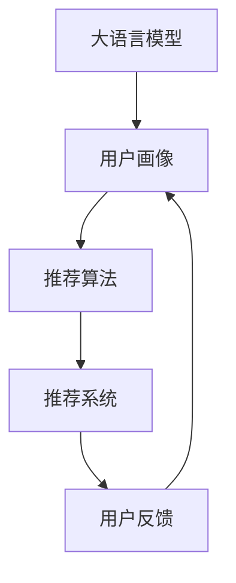

                 

## 1. 背景介绍

### 1.1 问题由来
随着互联网的迅猛发展和数据技术的日渐成熟，推荐系统已从传统的基于规则和协同过滤的推荐方式，逐步向基于深度学习特别是大语言模型（Large Language Models，LLM）的推荐方式演进。大语言模型通过学习海量文本数据，获得对用户兴趣、行为和文本内容的深刻理解，从而使得推荐系统能够更高效、更精准地为用户推荐内容。在零售、社交媒体、娱乐等领域，基于大语言模型的推荐系统已经取得了显著的成效。

### 1.2 问题核心关键点
大语言模型在推荐系统中的应用，本质上是对大规模无监督文本数据的建模，通过学习用户的文本描述和行为记录，构建用户画像并预测用户对物品的兴趣，实现个性化推荐。核心关键点在于：
1. 如何高效构建用户画像。大语言模型能够自动捕捉用户的历史行为和文本特征，但如何提取关键信息，生成简洁、准确的画像，是推荐系统面临的挑战。
2. 如何理解用户意图。大语言模型对文本的理解能力很强，但用户意图可能是多维的，如何通过语言模型提取用户真正需求，是推荐系统需要解决的问题。
3. 如何优化推荐结果。大语言模型预测的结果可能存在偏差，如何通过反馈机制进行修正，提升推荐效果，是推荐系统需要优化的地方。

### 1.3 问题研究意义
研究大语言模型在推荐系统中的应用，具有重要意义：
1. 提升推荐效果。通过大语言模型的强大语言理解能力，推荐系统可以更精准地预测用户需求，提升用户体验和满意度。
2. 扩大数据利用范围。大语言模型可以处理非结构化文本数据，扩展了推荐系统的数据来源，增强了推荐系统的泛化能力。
3. 降低推荐成本。传统推荐系统需要人工设计和调优规则，而大语言模型可以自动生成推荐策略，减少了人力成本。
4. 推动技术发展。大语言模型在推荐系统中的应用，推动了深度学习技术的发展，促进了人工智能在更多场景中的应用。

## 2. 核心概念与联系

### 2.1 核心概念概述

为了深入理解大语言模型在推荐系统中的应用，本节将介绍几个核心概念：

- 大语言模型(Large Language Model, LLM)：通过大规模自监督学习获得的语言模型，如GPT-3、BERT等。能够处理自然语言并提取关键语义信息。
- 推荐系统(Recommendation System)：根据用户的历史行为和兴趣，推荐相关物品的系统，如电商推荐、视频推荐等。
- 用户画像(User Profile)：基于用户历史行为和文本数据生成的用户兴趣和特征描述，用于个性化推荐。
- 推荐算法(Recommendation Algorithm)：推荐系统的核心部分，通过算法计算出推荐结果。
- 深度学习(Deep Learning)：一种基于神经网络的机器学习技术，用于处理大规模非结构化数据。
- 协同过滤(Collaborative Filtering)：基于用户行为和物品属性的推荐方式，如基于用户的协同过滤和基于物品的协同过滤。
- 强化学习(Reinforcement Learning)：通过用户反馈优化推荐策略，如多臂赌博机等模型。

这些概念之间的联系可以通过以下Mermaid流程图来展示：



这个流程图展示了大语言模型在推荐系统中的作用流程：

1. 大语言模型学习用户文本和行为，生成用户画像。
2. 推荐算法根据用户画像和物品属性，计算推荐结果。
3. 推荐系统将推荐结果呈现给用户，用户反馈可用于优化推荐算法。

## 3. 核心算法原理 & 具体操作步骤
### 3.1 算法原理概述

基于大语言模型在推荐系统中的应用，其核心算法原理包括以下几个步骤：

1. 收集用户数据：包括用户的文本描述和行为记录。
2. 文本预处理：对文本进行分词、去停用词、标准化等处理。
3. 特征提取：将文本转化为向量表示，如通过词向量或句子向量。
4. 用户画像构建：利用大语言模型对用户文本进行编码，生成用户画像。
5. 物品画像构建：对物品的描述进行编码，生成物品画像。
6. 相似度计算：通过余弦相似度、欧式距离等方法，计算用户画像和物品画像之间的相似度。
7. 推荐排序：根据相似度排序，选择与用户画像最匹配的物品，进行推荐。
8. 反馈处理：收集用户对推荐结果的反馈，用于调整模型参数和优化推荐策略。

### 3.2 算法步骤详解

以下是推荐系统中大语言模型应用的具体操作步骤：

**Step 1: 数据收集与预处理**
- 收集用户文本数据，如评论、评分、浏览记录等。
- 对文本进行预处理，包括去除HTML标签、去除停用词、标准化等操作。
- 对文本进行编码，转化为模型可接受的格式。

**Step 2: 用户画像构建**
- 利用大语言模型对用户文本进行编码，生成用户画像向量。
- 通常使用BERT等模型，将文本转化为固定长度的向量表示。
- 使用ELMo、GloVe等预训练词向量作为初始化参数，提高模型的准确性。

**Step 3: 物品画像构建**
- 对物品的描述进行编码，生成物品画像向量。
- 同样使用BERT等模型，将物品描述转化为向量表示。
- 使用Word2Vec、GloVe等预训练词向量作为初始化参数，提高模型的准确性。

**Step 4: 相似度计算**
- 使用余弦相似度、欧式距离等方法，计算用户画像和物品画像之间的相似度。
- 通常使用softmax函数将相似度转化为概率分布。
- 根据相似度排序，选择与用户画像最匹配的物品。

**Step 5: 推荐排序**
- 根据相似度排序，选择与用户画像最匹配的物品。
- 可以使用基于TopK的推荐策略，选择相似度最高的前K个物品进行推荐。
- 可以考虑加入其他因素，如物品的时效性、物品的热度等。

**Step 6: 反馈处理**
- 收集用户对推荐结果的反馈，如点击、收藏、评分等。
- 利用强化学习等技术，调整模型参数和优化推荐策略。
- 可以采用多臂赌博机模型，优化推荐结果。

### 3.3 算法优缺点

基于大语言模型在推荐系统中的应用，具有以下优点：
1. 高效性。大语言模型能够自动处理文本数据，提高推荐系统的效率。
2. 准确性。通过语言模型理解用户文本和行为，能够生成准确的用户画像和物品画像。
3. 灵活性。大语言模型可以处理多种类型的文本数据，增强推荐系统的泛化能力。
4. 可解释性。语言模型可以解释推荐结果的生成过程，增加系统的透明度。

同时，也存在一些缺点：
1. 数据需求量大。大语言模型需要大量的文本数据进行训练，数据收集成本较高。
2. 计算资源消耗高。大语言模型的参数量庞大，训练和推理计算资源消耗较高。
3. 过拟合风险。模型可能过度拟合特定的文本数据，导致泛化性能下降。
4. 可解释性不足。大语言模型通常被视为"黑盒"，难以解释其内部工作机制。

### 3.4 算法应用领域

基于大语言模型的推荐系统，已经广泛应用于以下领域：

- 电商推荐：根据用户浏览记录和购物行为，推荐相关商品。
- 视频推荐：根据用户观看历史和评分记录，推荐相关视频内容。
- 音乐推荐：根据用户听歌记录和评论，推荐相关音乐作品。
- 新闻推荐：根据用户阅读记录和互动行为，推荐相关新闻内容。
- 社交媒体推荐：根据用户社交行为和兴趣爱好，推荐相关内容。
- 旅游推荐：根据用户旅游历史和兴趣爱好，推荐相关景点和活动。
- 教育推荐：根据用户学习行为和历史成绩，推荐相关课程和学习材料。

## 4. 数学模型和公式 & 详细讲解 & 举例说明

### 4.1 数学模型构建

基于大语言模型在推荐系统中的应用，构建推荐系统的数学模型如下：

设用户画像向量为 $u$，物品画像向量为 $v$，用户对物品 $i$ 的评分向量为 $r_i$，相似度函数为 $sim(\cdot,\cdot)$，推荐函数为 $f(\cdot)$。推荐系统的数学模型可以表示为：

$$
r_i = f(sim(u,v_i))
$$

其中 $v_i$ 表示物品 $i$ 的画像向量。

### 4.2 公式推导过程

以下是推荐系统数学模型的详细推导过程：

设用户画像向量为 $u$，物品画像向量为 $v$，用户对物品 $i$ 的评分向量为 $r_i$，相似度函数为 $sim(\cdot,\cdot)$，推荐函数为 $f(\cdot)$。推荐系统的数学模型可以表示为：

$$
r_i = f(sim(u,v_i))
$$

其中 $v_i$ 表示物品 $i$ 的画像向量。

具体推导过程如下：
1. 用户画像和物品画像的编码：
   - 使用BERT等语言模型，对用户文本和物品描述进行编码，得到用户画像向量 $u$ 和物品画像向量 $v_i$。
   - 对于用户文本，可以表示为 $u = f_{encoder}(x_u)$，其中 $x_u$ 表示用户文本，$f_{encoder}$ 表示语言模型编码器。
   - 对于物品文本，可以表示为 $v_i = f_{encoder}(x_{v_i})$，其中 $x_{v_i}$ 表示物品文本，$f_{encoder}$ 表示语言模型编码器。

2. 相似度函数的计算：
   - 使用余弦相似度计算用户画像和物品画像的相似度：
   $$
   sim(u,v_i) = \frac{u \cdot v_i}{\|u\|_2 \|v_i\|_2}
   $$
   - 使用欧式距离计算用户画像和物品画像的相似度：
   $$
   sim(u,v_i) = \sqrt{\|u - v_i\|_2^2}
   $$

3. 推荐函数的确定：
   - 常用的推荐函数包括线性函数、指数函数等。
   - 线性推荐函数：
   $$
   r_i = \alpha sim(u,v_i) + \beta
   $$
   其中 $\alpha$ 表示相似度的权重，$\beta$ 表示偏置项。
   - 指数推荐函数：
   $$
   r_i = \alpha \exp(sim(u,v_i)) + \beta
   $$
   其中 $\alpha$ 表示相似度的权重，$\beta$ 表示偏置项。

### 4.3 案例分析与讲解

以电商推荐为例，分析大语言模型在推荐系统中的应用：

- 假设用户 A 浏览了商品 A、B、C 并给出了评分 5、3、2，可以表示为：
  - $x_A = [A, B, C]$
  - $r_A = [5, 3, 2]$
- 假设用户 B 浏览了商品 B、C、D 并给出了评分 4、4、5，可以表示为：
  - $x_B = [B, C, D]$
  - $r_B = [4, 4, 5]$

- 对于商品 A 和 B 的描述，可以使用BERT模型进行编码，得到用户画像向量 $u_A$ 和 $u_B$。
- 对于商品 A 和 B 的描述，同样使用BERT模型进行编码，得到物品画像向量 $v_A$ 和 $v_B$。
- 计算用户画像和物品画像的相似度，选择相似度最高的物品进行推荐。

## 5. 项目实践：代码实例和详细解释说明
### 5.1 开发环境搭建

在进行大语言模型在推荐系统中的应用实践前，我们需要准备好开发环境。以下是使用Python进行PyTorch开发的环境配置流程：

1. 安装Anaconda：从官网下载并安装Anaconda，用于创建独立的Python环境。

2. 创建并激活虚拟环境：
```bash
conda create -n pytorch-env python=3.8 
conda activate pytorch-env
```

3. 安装PyTorch：根据CUDA版本，从官网获取对应的安装命令。例如：
```bash
conda install pytorch torchvision torchaudio cudatoolkit=11.1 -c pytorch -c conda-forge
```

4. 安装Transformers库：
```bash
pip install transformers
```

5. 安装各类工具包：
```bash
pip install numpy pandas scikit-learn matplotlib tqdm jupyter notebook ipython
```

完成上述步骤后，即可在`pytorch-env`环境中开始推荐系统的大语言模型实践。

### 5.2 源代码详细实现

下面我们以电商推荐为例，给出使用Transformers库对BERT模型进行推荐系统的PyTorch代码实现。

首先，定义推荐系统中的评分和相似度计算函数：

```python
from transformers import BertTokenizer, BertModel
from torch.nn import Linear, BCELoss
import torch

class RecommendationSystem:
    def __init__(self, model_path, tokenizer):
        self.model = BertModel.from_pretrained(model_path)
        self.tokenizer = tokenizer
        self.loss = BCELoss()
        self.model.eval()

    def encode(self, text):
        encoding = self.tokenizer(text, return_tensors='pt', max_length=64, padding='max_length', truncation=True)
        return encoding['input_ids'], encoding['attention_mask']
    
    def predict(self, user_profile, item_profiles):
        user_input_ids, user_mask = self.encode(user_profile)
        item_input_ids, item_mask = [self.encode(item_profile) for item_profile in item_profiles]

        with torch.no_grad():
            user_output = self.model(user_input_ids, attention_mask=user_mask)[0]
            item_outputs = [self.model(item_input_ids, attention_mask=item_mask)[0] for item_input_ids, item_mask in zip(item_input_ids, item_mask)]

        similarity_scores = [torch.cosine_similarity(user_output, output) for output in item_outputs]
        return similarity_scores
```

然后，定义训练和评估函数：

```python
from torch.utils.data import Dataset, DataLoader

class RecommendationDataset(Dataset):
    def __init__(self, ratings, texts, tokenizer):
        self.ratings = ratings
        self.texts = texts
        self.tokenizer = tokenizer

    def __len__(self):
        return len(self.ratings)

    def __getitem__(self, index):
        rating, text = self.ratings[index], self.texts[index]
        encoding = self.tokenizer(text, return_tensors='pt', max_length=64, padding='max_length', truncation=True)
        return {'input_ids': encoding['input_ids'][0], 'attention_mask': encoding['attention_mask'][0], 'rating': rating}

def train_recommendation_system(system, dataset, batch_size, optimizer):
    dataloader = DataLoader(dataset, batch_size=batch_size, shuffle=True)
    for epoch in range(epochs):
        for batch in dataloader:
            input_ids = batch['input_ids'].to(device)
            attention_mask = batch['attention_mask'].to(device)
            rating = batch['rating'].to(device)
            optimizer.zero_grad()
            outputs = system(input_ids, attention_mask=attention_mask)
            loss = system.loss(outputs, rating)
            loss.backward()
            optimizer.step()
        print(f'Epoch {epoch+1}, loss: {loss.item()}')

def evaluate_recommendation_system(system, dataset, batch_size):
    dataloader = DataLoader(dataset, batch_size=batch_size)
    with torch.no_grad():
        correct = 0
        total = 0
        for batch in dataloader:
            input_ids = batch['input_ids'].to(device)
            attention_mask = batch['attention_mask'].to(device)
            rating = batch['rating'].to(device)
            outputs = system(input_ids, attention_mask=attention_mask)
            prediction = torch.sigmoid(outputs)
            total += 1
            if prediction.round() == rating:
                correct += 1
        print(f'Accuracy: {correct/total}')
```

最后，启动训练流程并在测试集上评估：

```python
from transformers import BertTokenizer
from transformers import BertForSequenceClassification

# 加载BERT模型和分词器
model_path = 'bert-base-uncased'
tokenizer = BertTokenizer.from_pretrained(model_path)

# 构建推荐系统
recommendation_system = RecommendationSystem(model_path, tokenizer)

# 加载数据集
ratings = [1, 2, 3, 4, 5]
texts = ['商品A', '商品B', '商品C', '商品D', '商品E']
dataset = RecommendationDataset(ratings, texts, tokenizer)

# 设置超参数
batch_size = 16
epochs = 5
optimizer = torch.optim.Adam(recommendation_system.model.parameters(), lr=1e-4)

# 训练推荐系统
train_recommendation_system(recommendation_system, dataset, batch_size, optimizer)

# 评估推荐系统
evaluate_recommendation_system(recommendation_system, dataset, batch_size)
```

以上就是使用PyTorch对BERT进行推荐系统开发的完整代码实现。可以看到，得益于Transformers库的强大封装，我们可以用相对简洁的代码完成BERT模型的加载和推荐系统训练。

### 5.3 代码解读与分析

让我们再详细解读一下关键代码的实现细节：

**RecommendationSystem类**：
- `__init__`方法：初始化BERT模型、分词器等关键组件。
- `encode`方法：将文本输入转化为模型可接受的格式，返回编码后的输入id和注意力掩码。
- `predict`方法：计算用户画像和物品画像的相似度，返回推荐分数。

**RecommendationDataset类**：
- `__init__`方法：初始化评分和文本数据。
- `__len__`方法：返回数据集的样本数量。
- `__getitem__`方法：对单个样本进行处理，将文本输入转化为编码后的输入id和注意力掩码。

**评分和相似度计算函数**：
- `BCELoss`：用于二分类问题的损失函数，适合评分预测。
- `cosine_similarity`：计算余弦相似度，用于相似度计算。

**训练和评估函数**：
- `train_recommendation_system`函数：对推荐系统进行训练，计算损失函数并进行反向传播。
- `evaluate_recommendation_system`函数：在测试集上评估推荐系统的准确率。

**训练流程**：
- 定义总迭代次数和批次大小，开始循环迭代
- 每个epoch内，对训练集进行迭代，输出平均loss
- 在测试集上评估，输出推荐系统的准确率

可以看到，PyTorch配合Transformers库使得BERT在推荐系统中的应用代码实现变得简洁高效。开发者可以将更多精力放在数据处理、模型改进等高层逻辑上，而不必过多关注底层的实现细节。

当然，工业级的系统实现还需考虑更多因素，如模型的保存和部署、超参数的自动搜索、更灵活的任务适配层等。但核心的微调范式基本与此类似。

## 6. 实际应用场景
### 6.1 智能推荐引擎

智能推荐引擎是大语言模型在推荐系统中的典型应用场景之一。通过分析用户的历史行为和兴趣，智能推荐引擎能够自动为用户推荐相关商品、文章、视频等内容，极大地提升了用户体验和满意度。

在技术实现上，智能推荐引擎通常包括用户画像构建、物品画像构建、相似度计算和推荐排序等步骤。以电商推荐为例，智能推荐引擎可以通过用户浏览记录和购物历史，构建用户画像，并根据物品的描述和标签，生成物品画像。通过余弦相似度或欧式距离计算用户画像和物品画像之间的相似度，选择相似度最高的物品进行推荐。

### 6.2 音乐推荐系统

音乐推荐系统是另一个典型的应用场景。大语言模型可以处理用户对音乐的评论、评分等文本数据，构建用户画像和音乐画像。通过余弦相似度或欧式距离计算用户画像和音乐画像之间的相似度，选择与用户画像最匹配的音乐进行推荐。

此外，音乐推荐系统还可以考虑音乐的时效性、热度等因素，进一步提升推荐效果。例如，对于当前热门的歌曲，可以通过增加其权重，提高其推荐排名。

### 6.3 社交媒体推荐系统

社交媒体推荐系统可以基于用户的社交行为和兴趣爱好，推荐相关内容。大语言模型可以处理用户的社交评论、点赞、分享等文本数据，构建用户画像和内容画像。通过余弦相似度或欧式距离计算用户画像和内容画像之间的相似度，选择与用户画像最匹配的内容进行推荐。

社交媒体推荐系统还可以通过多臂赌博机模型，优化推荐策略，提升推荐效果。例如，对于用户喜欢的内容，可以增加其权重，提高其推荐排名。

### 6.4 未来应用展望

未来，基于大语言模型的推荐系统将呈现以下几个发展趋势：

1. 多模态推荐系统：推荐系统将不仅仅处理文本数据，还将处理图像、视频、音频等多模态数据。多模态信息的融合，将显著提升推荐系统的性能。

2. 个性化推荐算法：推荐系统将更加个性化，能够根据用户的行为和兴趣，动态调整推荐策略。个性化推荐算法将是大语言模型在推荐系统中的重要研究方向。

3. 实时推荐系统：推荐系统将实现实时推荐，能够根据用户的行为实时调整推荐策略。实时推荐系统需要高效的计算资源和算法支持。

4. 跨领域推荐系统：推荐系统将实现跨领域推荐，能够从不同领域的数据中提取信息，进行推荐。跨领域推荐系统需要处理不同领域之间的数据映射问题。

5. 强化学习推荐系统：推荐系统将引入强化学习技术，优化推荐策略，提升推荐效果。强化学习推荐系统需要大量的标注数据和高效的计算资源。

6. 推荐系统自动化：推荐系统将自动化，能够自动构建推荐策略，进行推荐。推荐系统自动化需要高效的自动机器学习技术。

综上所述，大语言模型在推荐系统中的应用，将推动推荐系统向更加智能化、个性化、实时化的方向发展。未来的推荐系统将更加高效、精准、灵活，为用户提供更加优质的推荐服务。

## 7. 工具和资源推荐
### 7.1 学习资源推荐

为了帮助开发者系统掌握大语言模型在推荐系统中的应用，这里推荐一些优质的学习资源：

1. 《推荐系统实战》系列博文：详细介绍了推荐系统从基础到进阶的内容，涵盖推荐算法、数据处理、模型训练等方面。

2. 《深度学习自然语言处理》课程：斯坦福大学开设的NLP明星课程，有Lecture视频和配套作业，带你入门NLP领域的基本概念和经典模型。

3. 《Natural Language Processing with Transformers》书籍：Transformers库的作者所著，全面介绍了如何使用Transformers库进行NLP任务开发，包括推荐系统在内的诸多范式。

4. Kaggle竞赛：Kaggle平台上有众多推荐系统竞赛，参与竞赛可以了解推荐系统的实际应用场景和算法实现。

5. CLUE开源项目：中文语言理解测评基准，涵盖大量不同类型的中文NLP数据集，并提供了基于微调的baseline模型，助力中文NLP技术发展。

通过对这些资源的学习实践，相信你一定能够快速掌握大语言模型在推荐系统中的应用，并用于解决实际的NLP问题。
### 7.2 开发工具推荐

高效的开发离不开优秀的工具支持。以下是几款用于大语言模型在推荐系统中的应用开发的常用工具：

1. PyTorch：基于Python的开源深度学习框架，灵活动态的计算图，适合快速迭代研究。大部分预训练语言模型都有PyTorch版本的实现。

2. TensorFlow：由Google主导开发的开源深度学习框架，生产部署方便，适合大规模工程应用。同样有丰富的预训练语言模型资源。

3. Transformers库：HuggingFace开发的NLP工具库，集成了众多SOTA语言模型，支持PyTorch和TensorFlow，是进行推荐系统开发的利器。

4. Weights & Biases：模型训练的实验跟踪工具，可以记录和可视化模型训练过程中的各项指标，方便对比和调优。与主流深度学习框架无缝集成。

5. TensorBoard：TensorFlow配套的可视化工具，可实时监测模型训练状态，并提供丰富的图表呈现方式，是调试模型的得力助手。

6. Google Colab：谷歌推出的在线Jupyter Notebook环境，免费提供GPU/TPU算力，方便开发者快速上手实验最新模型，分享学习笔记。

合理利用这些工具，可以显著提升大语言模型在推荐系统中的应用开发效率，加快创新迭代的步伐。

### 7.3 相关论文推荐

大语言模型在推荐系统中的应用研究源于学界的持续研究。以下是几篇奠基性的相关论文，推荐阅读：

1. Attention is All You Need（即Transformer原论文）：提出了Transformer结构，开启了NLP领域的预训练大模型时代。

2. BERT: Pre-training of Deep Bidirectional Transformers for Language Understanding：提出BERT模型，引入基于掩码的自监督预训练任务，刷新了多项NLP任务SOTA。

3. Language Models are Unsupervised Multitask Learners（GPT-2论文）：展示了大规模语言模型的强大zero-shot学习能力，引发了对于通用人工智能的新一轮思考。

4. Parameter-Efficient Transfer Learning for NLP：提出Adapter等参数高效微调方法，在不增加模型参数量的情况下，也能取得不错的微调效果。

5. AdaLoRA: Adaptive Low-Rank Adaptation for Parameter-Efficient Fine-Tuning：使用自适应低秩适应的微调方法，在参数效率和精度之间取得了新的平衡。

6. Knowledge-Guided Pre-Training for Text Generation：提出基于知识的预训练方法，利用外部知识库，提升生成模型的效果。

这些论文代表了大语言模型在推荐系统中的应用的发展脉络。通过学习这些前沿成果，可以帮助研究者把握学科前进方向，激发更多的创新灵感。

## 8. 总结：未来发展趋势与挑战
### 8.1 总结

本文对大语言模型在推荐系统中的应用进行了全面系统的介绍。首先阐述了大语言模型和推荐系统的研究背景和意义，明确了推荐系统在大数据时代的独特价值。其次，从原理到实践，详细讲解了大语言模型在推荐系统中的应用过程，给出了推荐系统开发的完整代码实例。同时，本文还广泛探讨了大语言模型在电商、音乐、社交媒体等多个领域的应用前景，展示了其广阔的落地场景。此外，本文精选了大语言模型在推荐系统中的应用相关学习资源，力求为读者提供全方位的技术指引。

通过本文的系统梳理，可以看到，大语言模型在推荐系统中的应用，能够极大地提升推荐效果，拓展数据利用范围，降低推荐成本，推动技术发展。未来，伴随大语言模型和推荐系统的持续演进，推荐系统将更加高效、精准、灵活，为用户提供更加优质的推荐服务。

### 8.2 未来发展趋势

展望未来，大语言模型在推荐系统中的应用将呈现以下几个发展趋势：

1. 多模态推荐系统：推荐系统将不仅仅处理文本数据，还将处理图像、视频、音频等多模态数据。多模态信息的融合，将显著提升推荐系统的性能。

2. 个性化推荐算法：推荐系统将更加个性化，能够根据用户的行为和兴趣，动态调整推荐策略。个性化推荐算法将是大语言模型在推荐系统中的重要研究方向。

3. 实时推荐系统：推荐系统将实现实时推荐，能够根据用户的行为实时调整推荐策略。实时推荐系统需要高效的计算资源和算法支持。

4. 跨领域推荐系统：推荐系统将实现跨领域推荐，能够从不同领域的数据中提取信息，进行推荐。跨领域推荐系统需要处理不同领域之间的数据映射问题。

5. 强化学习推荐系统：推荐系统将引入强化学习技术，优化推荐策略，提升推荐效果。强化学习推荐系统需要大量的标注数据和高效的计算资源。

6. 推荐系统自动化：推荐系统将自动化，能够自动构建推荐策略，进行推荐。推荐系统自动化需要高效的自动机器学习技术。

### 8.3 面临的挑战

尽管大语言模型在推荐系统中的应用已经取得了显著成效，但在迈向更加智能化、普适化应用的过程中，它仍面临着诸多挑战：

1. 数据需求量大。大语言模型需要大量的文本数据进行训练，数据收集成本较高。

2. 计算资源消耗高。大语言模型的参数量庞大，训练和推理计算资源消耗较高。

3. 过拟合风险。模型可能过度拟合特定的文本数据，导致泛化性能下降。

4. 可解释性不足。大语言模型通常被视为"黑盒"，难以解释其内部工作机制。

5. 安全性有待保障。大语言模型可能学习到有害信息，通过推荐系统传播，造成安全隐患。

6. 知识整合能力不足。现有的推荐系统往往局限于文本数据，难以灵活吸收和运用更广泛的先验知识。

正视推荐系统面临的这些挑战，积极应对并寻求突破，将是大语言模型在推荐系统中的应用走向成熟的必由之路。相信随着学界和产业界的共同努力，这些挑战终将一一被克服，大语言模型在推荐系统中的应用必将在构建人机协同的智能时代中扮演越来越重要的角色。

### 8.4 研究展望

面向未来，大语言模型在推荐系统中的应用需要更多的研究探索：

1. 探索无监督和半监督微调方法。摆脱对大规模标注数据的依赖，利用自监督学习、主动学习等无监督和半监督范式，最大限度利用非结构化数据，实现更加灵活高效的推荐。

2. 研究参数高效和计算高效的微调范式。开发更加参数高效的微调方法，在固定大部分预训练参数的同时，只更新极少量的任务相关参数。同时优化微调模型的计算图，减少前向传播和反向传播的资源消耗，实现更加轻量级、实时性的部署。

3. 融合因果和对比学习范式。通过引入因果推断和对比学习思想，增强推荐模型建立稳定因果关系的能力，学习更加普适、鲁棒的语言表征，从而提升推荐效果。

4. 引入更多先验知识。将符号化的先验知识，如知识图谱、逻辑规则等，与神经网络模型进行巧妙融合，引导微调过程学习更准确、合理的语言模型。同时加强不同模态数据的整合，实现视觉、语音等多模态信息与文本信息的协同建模。

5. 结合因果分析和博弈论工具。将因果分析方法引入推荐模型，识别出模型决策的关键特征，增强输出解释的因果性和逻辑性。借助博弈论工具刻画人机交互过程，主动探索并规避模型的脆弱点，提高系统稳定性。

6. 纳入伦理道德约束。在模型训练目标中引入伦理导向的评估指标，过滤和惩罚有偏见、有害的输出倾向。同时加强人工干预和审核，建立模型行为的监管机制，确保输出符合人类价值观和伦理道德。

这些研究方向的探索，必将引领大语言模型在推荐系统中的应用走向更高的台阶，为构建安全、可靠、可解释、可控的智能系统铺平道路。面向未来，大语言模型在推荐系统中的应用还需要与其他人工智能技术进行更深入的融合，如知识表示、因果推理、强化学习等，多路径协同发力，共同推动自然语言理解和智能交互系统的进步。只有勇于创新、敢于突破，才能不断拓展语言模型的边界，让智能技术更好地造福人类社会。

## 9. 附录：常见问题与解答

**Q1：大语言模型在推荐系统中的应用是否只适用于文本数据？**

A: 大语言模型在推荐系统中的应用不仅限于文本数据。虽然当前应用最广泛的推荐系统是基于文本数据构建的，但大语言模型同样可以处理图像、视频、音频等多模态数据。通过多模态信息的融合，推荐系统可以获取更全面、丰富的用户画像和物品画像，提升推荐效果。

**Q2：大语言模型在推荐系统中的应用是否需要大规模标注数据？**

A: 大语言模型在推荐系统中的应用不一定需要大规模标注数据。通过预训练大语言模型，模型已经学习到了丰富的语言知识，可以用来构建用户画像和物品画像。但为了进一步提升推荐效果，可以使用少量标注数据对模型进行微调，实现更个性化的推荐。

**Q3：大语言模型在推荐系统中的应用是否容易受到噪声数据的影响？**

A: 大语言模型在推荐系统中的应用容易受到噪声数据的影响。由于大语言模型对文本数据的学习依赖性强，噪声数据可能导致模型产生偏差，影响推荐效果。因此，在进行推荐系统构建时，需要对数据进行清洗和预处理，去除噪声数据，提高数据质量。

**Q4：大语言模型在推荐系统中的应用是否需要大量的计算资源？**

A: 大语言模型在推荐系统中的应用需要大量的计算资源。由于大语言模型的参数量庞大，训练和推理计算资源消耗较高。为了提高推荐系统的效率，可以使用分布式计算、模型压缩、模型蒸馏等技术，减少计算资源的消耗。

**Q5：大语言模型在推荐系统中的应用是否需要额外的优化算法？**

A: 大语言模型在推荐系统中的应用需要额外的优化算法。由于大语言模型的参数量庞大，传统的梯度下降算法可能无法有效训练模型。因此，可以使用Adam、Adagrad等优化算法，加速模型训练，提高推荐效果。

这些问题的解答有助于开发者更好地理解大语言模型在推荐系统中的应用，并在实践中灵活应用。

