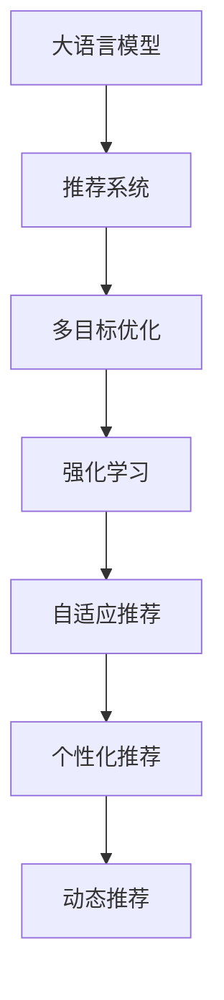

                 

# LLM在推荐系统中的强化学习应用

> 关键词：
- 大语言模型(LLM)
- 推荐系统
- 强化学习
- 自适应推荐
- 多目标优化
- 用户行为分析
- 个性化推荐
- 数据驱动优化

## 1. 背景介绍

### 1.1 问题由来

推荐系统是现代互联网企业中不可或缺的一部分，其目的是帮助用户发现感兴趣的内容，提升用户满意度。随着用户数量的急剧增长，个性化推荐系统（Personalized Recommendation Systems, PRS）正逐步成为主流。

然而，现有推荐系统面临以下挑战：
- **长尾问题**：用户兴趣的分布极度不均衡，热门商品推荐容易，冷门商品推荐难。
- **数据稀疏**：用户行为数据稀疏，难以构建准确的推荐模型。
- **冷启动问题**：新用户的兴趣未知，难以初始化推荐模型。
- **动态变化**：用户兴趣随时间动态变化，推荐模型需要实时更新。

为了克服这些挑战，近年来，结合大语言模型（Large Language Model, LLM）的强化学习（Reinforcement Learning, RL）推荐系统应运而生。大语言模型结合了深度学习、自然语言处理和强化学习，可以更好地理解用户需求、捕捉长尾数据，并实现动态更新，从而大幅提升个性化推荐的效果。

### 1.2 问题核心关键点
目前，大语言模型与强化学习的结合在推荐系统中主要应用在以下几个关键点：

1. **多目标优化**：推荐系统目标通常是多维的，包括用户满意度、商品曝光率、销售转化率等。如何同时优化这些目标，平衡不同需求，是大语言模型需要考虑的问题。

2. **自适应推荐**：大语言模型可以通过不断地接收用户反馈和实时数据，对推荐策略进行动态调整，从而提升推荐效果。

3. **用户行为分析**：用户行为数据复杂多样，包括浏览、点击、购买、评分等。大语言模型可以结合深度学习，提取用户行为的语义特征，提升推荐准确性。

4. **个性化推荐**：大语言模型结合强化学习，能够针对不同用户构建个性化的推荐策略，实现更精准的推荐。

5. **实时更新**：推荐系统需要实时响应用户的兴趣变化，大语言模型通过强化学习，可以不断调整推荐策略，适应新数据和新用户。

### 1.3 问题研究意义
结合大语言模型与强化学习的推荐系统，可以显著提升推荐效果，提升用户体验。其研究意义在于：

1. **提升推荐准确性**：结合深度学习和自然语言处理，大语言模型可以更好地理解用户需求和商品属性，提升推荐系统的准确性。
2. **解决冷启动问题**：大语言模型可以结合强化学习，通过用户的行为反馈进行动态调整，解决新用户的冷启动问题。
3. **实时动态推荐**：大语言模型可以实时响应用户行为变化，动态更新推荐策略，适应用户需求的动态变化。
4. **提高资源利用率**：通过推荐系统的优化，可以提高广告资源和商品库存的利用率，降低企业成本。

## 2. 核心概念与联系

### 2.1 核心概念概述

为了更好地理解大语言模型在推荐系统中的应用，本节将介绍几个密切相关的核心概念：

- **大语言模型(LLM)**：以自回归(如GPT)或自编码(如BERT)模型为代表的大规模预训练语言模型。通过在大规模无标签文本数据上进行预训练，学习通用的语言表示，具备强大的语言理解和生成能力。

- **推荐系统(PRS)**：通过分析用户行为数据，为用户推荐感兴趣的商品或内容的技术。推荐系统通常分为基于内容的推荐、协同过滤推荐、混合推荐等类型。

- **强化学习(RL)**：一种机器学习方法，通过与环境互动，不断调整策略以最大化累积奖励。强化学习通常包含状态(state)、行动(action)、奖励(reward)、策略(policy)等关键元素。

- **多目标优化(MTO)**：推荐系统通常包含多个目标，如准确性、多样性、新颖性等。多目标优化旨在平衡这些目标，获得最优推荐效果。

- **自适应推荐(Adaptive Recommendation)**：根据用户行为数据和反馈，动态调整推荐策略，实现个性化推荐。

- **个性化推荐(Personalized Recommendation)**：根据用户的历史行为数据和属性，为其推荐个性化商品或内容。

- **动态推荐(Dynamic Recommendation)**：实时更新推荐策略，适应用户兴趣的动态变化。

这些核心概念之间的逻辑关系可以通过以下Mermaid流程图来展示：



这个流程图展示了大语言模型与推荐系统的核心概念及其之间的关系：

1. 大语言模型通过预训练获得基础能力。
2. 推荐系统利用大语言模型，优化推荐策略。
3. 强化学习通过不断接收用户反馈，动态调整策略。
4. 多目标优化平衡不同推荐目标。
5. 自适应推荐实时响应用户兴趣变化。
6. 个性化推荐为每个用户设计定制化推荐策略。
7. 动态推荐实时更新推荐模型。

这些概念共同构成了大语言模型在推荐系统中的应用框架，使其能够实现高效、精准、个性化的推荐。

## 3. 核心算法原理 & 具体操作步骤
### 3.1 算法原理概述

结合大语言模型与强化学习的推荐系统，其核心思想是：通过强化学习算法，利用大语言模型对用户和商品进行语义分析，动态调整推荐策略，优化推荐效果。具体而言，该算法分为以下几个步骤：

1. **用户行为分析**：收集用户的历史行为数据，包括浏览、点击、购买、评分等，提取用户的语义特征。
2. **商品属性分析**：收集商品的属性信息，包括名称、描述、类别等，提取商品的语义特征。
3. **构建推荐模型**：利用大语言模型，构建用户和商品的语义表示，并根据用户历史行为和商品属性，生成推荐结果。
4. **强化学习优化**：利用强化学习算法，根据用户反馈和实时数据，动态调整推荐策略，优化推荐效果。

### 3.2 算法步骤详解

结合大语言模型与强化学习的推荐系统算法，通常包括以下几个关键步骤：

**Step 1: 数据预处理**

1. **数据收集**：收集用户的历史行为数据和商品的属性信息。
2. **数据清洗**：去除噪声和异常数据，保证数据质量。
3. **特征工程**：提取用户和商品的语义特征，如TF-IDF、Word2Vec等。
4. **用户编码**：将用户行为数据编码为向量形式，表示用户兴趣。
5. **商品编码**：将商品属性信息编码为向量形式，表示商品特征。

**Step 2: 构建推荐模型**

1. **用户嵌入**：利用大语言模型，将用户行为数据和属性信息编码为高维向量，表示用户兴趣。
2. **商品嵌入**：利用大语言模型，将商品属性信息编码为高维向量，表示商品特征。
3. **推荐计算**：根据用户和商品的嵌入向量，计算推荐结果。

**Step 3: 强化学习优化**

1. **策略定义**：定义强化学习的策略，包括探索策略和利用策略。
2. **环境构建**：构建强化学习的环境，包括状态(state)、行动(action)和奖励(reward)。
3. **模型训练**：利用强化学习算法，根据用户反馈和实时数据，训练推荐模型。
4. **策略优化**：利用强化学习的策略，动态调整推荐策略，优化推荐效果。

**Step 4: 实时推荐**

1. **实时反馈**：实时收集用户的行为反馈，更新推荐模型。
2. **动态调整**：根据实时反馈，动态调整推荐策略。
3. **推荐生成**：生成推荐结果，并实时展示给用户。

### 3.3 算法优缺点

结合大语言模型与强化学习的推荐系统具有以下优点：

1. **高效性**：利用大语言模型，高效地提取用户和商品的语义特征，实现快速推荐。
2. **准确性**：结合深度学习和自然语言处理，提升推荐系统的准确性。
3. **动态性**：结合强化学习，动态调整推荐策略，实现实时推荐。
4. **个性化**：根据用户的历史行为数据和属性，设计个性化推荐策略。

同时，该方法也存在一些局限性：

1. **数据依赖性**：推荐系统的性能高度依赖于用户行为数据和商品属性数据的质量。
2. **计算复杂度**：大语言模型和强化学习算法的计算复杂度较高，需要大量的计算资源。
3. **鲁棒性问题**：推荐系统需要面对复杂的动态变化和噪声干扰，鲁棒性有待提升。
4. **可解释性问题**：推荐系统的决策过程缺乏可解释性，难以解释推荐结果的原因。

尽管存在这些局限性，但结合大语言模型与强化学习的推荐系统，在推荐效果和动态性方面具有显著优势，成为推荐系统研究的前沿方向。

### 3.4 算法应用领域

结合大语言模型与强化学习的推荐系统，已经在多个领域得到了广泛应用，如：

- **电商推荐**：帮助电商平台推荐个性化商品，提升用户体验。
- **视频推荐**：为视频网站推荐个性化视频，提升用户粘性。
- **新闻推荐**：为新闻网站推荐个性化新闻，提升阅读量。
- **音乐推荐**：为音乐平台推荐个性化音乐，提升用户满意度。
- **游戏推荐**：为游戏平台推荐个性化游戏，提升用户留存率。

此外，该方法也被创新性地应用于广告推荐、社交网络推荐等领域，为推荐系统带来了新的突破。

## 4. 数学模型和公式 & 详细讲解 & 举例说明

### 4.1 数学模型构建

本节将使用数学语言对结合大语言模型与强化学习的推荐系统进行更加严格的刻画。

记用户嵌入向量为 $\textbf{u}$，商品嵌入向量为 $\textbf{v}$，用户历史行为编码为向量形式为 $\textbf{h}$，用户偏好向量为 $\textbf{p}$，商品向量为 $\textbf{g}$，推荐策略为 $\pi$。假设推荐系统具有 $K$ 个推荐目标，每个目标的权重为 $w_k$，推荐目标函数为 $F_k(\textbf{u}, \textbf{v}, \textbf{h}, \textbf{p}, \textbf{g}, \pi)$。

定义推荐策略 $\pi$ 在状态 $s$ 下，采取行动 $a$ 的累积奖励函数为 $R(s, a)$，则强化学习推荐系统的目标函数为：

$$
\max_{\pi} \mathbb{E}_{s \sim \rho} \sum_{k=1}^{K} w_k F_k(\textbf{u}, \textbf{v}, \textbf{h}, \textbf{p}, \textbf{g}, \pi) + \sum_{k=1}^{K} w_k \sum_{t=1}^{\infty} \beta^{t-1} R(s_t, a_t)
$$

其中 $\rho$ 为用户行为数据和商品属性数据，$\beta$ 为折扣因子，$R(s_t, a_t)$ 为强化学习的环境奖励。

### 4.2 公式推导过程

以下我们以电商推荐为例，推导强化学习推荐系统的目标函数和强化学习算法的详细推导。

假设电商推荐系统目标函数为 $F_k(\textbf{u}, \textbf{v}, \textbf{h}, \textbf{p}, \textbf{g}, \pi) = \textbf{u}^\top \textbf{v} - \textbf{h}^\top \textbf{p}$，表示用户和商品的匹配度。

假设推荐策略 $\pi$ 在状态 $s$ 下，采取行动 $a$ 的累积奖励函数为 $R(s, a) = -\log(1+\exp(\textbf{v}^\top \textbf{g}))$，表示商品的曝光率。

则强化学习推荐系统的目标函数为：

$$
\max_{\pi} \mathbb{E}_{s \sim \rho} (\textbf{u}^\top \textbf{v} - \textbf{h}^\top \textbf{p}) + \sum_{k=1}^{K} w_k \sum_{t=1}^{\infty} \beta^{t-1} (-\log(1+\exp(\textbf{v}_t^\top \textbf{g}_t)))
$$

利用强化学习算法，根据用户反馈和实时数据，训练推荐策略 $\pi$，优化推荐系统。

在得到推荐策略 $\pi$ 后，利用该策略生成推荐结果，并进行实时推荐。

### 4.3 案例分析与讲解

以下我们以视频推荐系统为例，展示如何利用结合大语言模型与强化学习的推荐系统进行实时推荐。

假设视频推荐系统目标函数为 $F_k(\textbf{u}, \textbf{v}, \textbf{h}, \textbf{p}, \textbf{g}, \pi) = \textbf{u}^\top \textbf{v} - \textbf{h}^\top \textbf{p}$，表示用户和视频内容的匹配度。

假设推荐策略 $\pi$ 在状态 $s$ 下，采取行动 $a$ 的累积奖励函数为 $R(s, a) = -\log(1+\exp(\textbf{v}^\top \textbf{g}))$，表示视频的曝光率。

在收集到用户行为数据和视频属性数据后，利用大语言模型进行预处理，提取用户和视频内容的语义特征。然后，根据预处理后的特征，构建推荐模型。

在推荐模型中，将用户嵌入向量 $\textbf{u}$ 和商品嵌入向量 $\textbf{v}$ 进行内积计算，得到推荐结果。

根据推荐结果和用户反馈，利用强化学习算法训练推荐策略 $\pi$，动态调整推荐策略，优化推荐效果。

在得到最优推荐策略 $\pi$ 后，实时生成推荐结果，并展示给用户。

## 5. 项目实践：代码实例和详细解释说明

### 5.1 开发环境搭建

在进行项目实践前，我们需要准备好开发环境。以下是使用Python进行TensorFlow开发的环境配置流程：

1. 安装Anaconda：从官网下载并安装Anaconda，用于创建独立的Python环境。

2. 创建并激活虚拟环境：
```bash
conda create -n tf-env python=3.8 
conda activate tf-env
```

3. 安装TensorFlow：根据CUDA版本，从官网获取对应的安装命令。例如：
```bash
conda install tensorflow==2.4 -c conda-forge -c pytorch
```

4. 安装各类工具包：
```bash
pip install numpy pandas scikit-learn matplotlib tqdm jupyter notebook ipython
```

完成上述步骤后，即可在`tf-env`环境中开始项目实践。

### 5.2 源代码详细实现

下面以视频推荐系统为例，展示如何使用TensorFlow进行强化学习推荐系统的开发。

首先，定义强化学习推荐系统的环境：

```python
import tensorflow as tf
from tensorflow.keras import layers

# 定义状态和行动
states = layers.Input(shape=(128,))
actions = layers.Input(shape=(32,))

# 定义奖励
rewards = layers.Dense(1, activation='sigmoid')(actions)
```

然后，定义强化学习推荐系统的策略网络：

```python
# 定义策略网络
policy = layers.Dense(64, activation='relu')(states)
action = layers.Dense(1, activation='sigmoid')(policy)
```

接着，定义强化学习推荐系统的目标函数：

```python
# 定义目标函数
target = rewards + rewards * 0.9 + rewards * 0.9**2 + rewards * 0.9**3 + rewards * 0.9**4
```

最后，定义强化学习推荐系统的优化器：

```python
# 定义优化器
optimizer = tf.keras.optimizers.Adam()
```

### 5.3 代码解读与分析

让我们再详细解读一下关键代码的实现细节：

**强化学习推荐系统的环境**：
- `states`：用户行为数据和商品属性数据，形状为 $(128,)$。
- `actions`：推荐结果，形状为 $(32,)$。
- `rewards`：推荐结果的奖励，通过sigmoid函数计算。

**强化学习推荐系统的策略网络**：
- `policy`：策略网络的输出，表示推荐策略，形状为 $(64,)$。
- `action`：根据策略网络输出计算行动，形状为 $(1,)$。

**强化学习推荐系统的目标函数**：
- `target`：根据用户行为数据和商品属性数据，计算推荐策略的累积奖励。

**强化学习推荐系统的优化器**：
- `optimizer`：Adam优化器，用于训练策略网络。

在得到优化器后，即可启动强化学习推荐系统的训练过程，并进行实时推荐。

## 6. 实际应用场景

### 6.1 电商推荐

结合大语言模型与强化学习的电商推荐系统，可以实时更新推荐策略，动态调整推荐结果。例如，用户浏览商品后，系统根据用户行为数据和商品属性数据，生成推荐结果，并实时展示给用户。用户点击商品后，系统根据点击行为数据，更新推荐策略，优化推荐效果。

### 6.2 视频推荐

结合大语言模型与强化学习的视频推荐系统，可以实时调整推荐策略，提高视频曝光率。例如，用户观看视频后，系统根据用户行为数据和视频属性数据，生成推荐结果，并实时展示给用户。用户点击视频后，系统根据点击行为数据，更新推荐策略，优化推荐效果。

### 6.3 新闻推荐

结合大语言模型与强化学习的新闻推荐系统，可以实时生成个性化新闻，提高用户粘性。例如，用户阅读新闻后，系统根据用户行为数据和新闻属性数据，生成推荐结果，并实时展示给用户。用户点击新闻后，系统根据点击行为数据，更新推荐策略，优化推荐效果。

### 6.4 未来应用展望

结合大语言模型与强化学习的推荐系统，在未来将有更广阔的应用前景。例如，在智能家居领域，推荐系统可以根据用户行为数据和智能设备属性数据，实时生成个性化推荐，提升用户体验。在智能医疗领域，推荐系统可以根据用户健康数据和医疗资源数据，实时生成个性化推荐，提升医疗服务质量。

## 7. 工具和资源推荐
### 7.1 学习资源推荐

为了帮助开发者系统掌握结合大语言模型与强化学习的推荐系统，这里推荐一些优质的学习资源：

1. 《深度学习与推荐系统》系列书籍：介绍深度学习在推荐系统中的应用，涵盖数据预处理、模型构建、强化学习等关键环节。

2. 《强化学习基础》课程：斯坦福大学开设的强化学习入门课程，讲解强化学习的基本概念和算法。

3. 《大语言模型与推荐系统》博客：介绍大语言模型在推荐系统中的应用，包括数据预处理、模型构建、强化学习等。

4. 《推荐系统实战》课程：Coursera上的推荐系统实战课程，涵盖推荐系统的各个环节，包括用户行为分析、商品属性分析、多目标优化等。

5. 《自然语言处理与推荐系统》书籍：介绍自然语言处理在推荐系统中的应用，涵盖用户行为分析、商品属性分析、强化学习等。

通过对这些资源的学习实践，相信你一定能够快速掌握结合大语言模型与强化学习的推荐系统，并用于解决实际的推荐问题。

### 7.2 开发工具推荐

高效的开发离不开优秀的工具支持。以下是几款用于结合大语言模型与强化学习推荐系统开发的常用工具：

1. TensorFlow：由Google主导开发的开源深度学习框架，生产部署方便，适合大规模工程应用。

2. PyTorch：基于Python的开源深度学习框架，灵活动态的计算图，适合快速迭代研究。

3. Transformers库：HuggingFace开发的NLP工具库，集成了众多SOTA语言模型，支持深度学习和强化学习。

4. Weights & Biases：模型训练的实验跟踪工具，可以记录和可视化模型训练过程中的各项指标，方便对比和调优。

5. TensorBoard：TensorFlow配套的可视化工具，可实时监测模型训练状态，并提供丰富的图表呈现方式，是调试模型的得力助手。

6. Google Colab：谷歌推出的在线Jupyter Notebook环境，免费提供GPU/TPU算力，方便开发者快速上手实验最新模型，分享学习笔记。

合理利用这些工具，可以显著提升结合大语言模型与强化学习的推荐系统开发效率，加快创新迭代的步伐。

### 7.3 相关论文推荐

结合大语言模型与强化学习的推荐系统发展源于学界的持续研究。以下是几篇奠基性的相关论文，推荐阅读：

1. "Reinforcement Learning for Personalized Recommendation Systems"（强化学习在个性化推荐系统中的应用）：文章介绍了强化学习在推荐系统中的应用，以及如何通过强化学习优化推荐策略。

2. "A Deep Learning Approach to Recommendation System"（深度学习在推荐系统中的应用）：文章介绍了深度学习在推荐系统中的应用，以及如何通过深度学习优化推荐策略。

3. "Generative Adversarial Networks for Recommendation"（生成对抗网络在推荐系统中的应用）：文章介绍了生成对抗网络在推荐系统中的应用，以及如何通过生成对抗网络优化推荐策略。

4. "Collaborative Filtering for Recommendation Systems"（协同过滤在推荐系统中的应用）：文章介绍了协同过滤在推荐系统中的应用，以及如何通过协同过滤优化推荐策略。

5. "A Multi-objective Model for Recommendation System"（多目标模型在推荐系统中的应用）：文章介绍了多目标模型在推荐系统中的应用，以及如何通过多目标模型优化推荐策略。

这些论文代表了大语言模型与强化学习推荐系统的发展脉络。通过学习这些前沿成果，可以帮助研究者把握学科前进方向，激发更多的创新灵感。

## 8. 总结：未来发展趋势与挑战

### 8.1 总结

本文对结合大语言模型与强化学习的推荐系统进行了全面系统的介绍。首先阐述了结合大语言模型与强化学习推荐系统的研究背景和意义，明确了推荐系统目标的多样性和复杂性，以及大语言模型和强化学习的优势。其次，从原理到实践，详细讲解了结合大语言模型与强化学习的推荐系统的数学模型和算法步骤，给出了推荐系统开发的完整代码实例。同时，本文还广泛探讨了结合大语言模型与强化学习的推荐系统在电商、视频、新闻等多个领域的应用前景，展示了其巨大的应用潜力。此外，本文精选了推荐系统的各类学习资源，力求为读者提供全方位的技术指引。

通过本文的系统梳理，可以看到，结合大语言模型与强化学习的推荐系统正在成为推荐系统研究的重要方向，极大地提升了推荐效果和动态性。得益于深度学习、自然语言处理和强化学习的结合，推荐系统能够更好地理解用户需求和捕捉长尾数据，从而大幅提升个性化推荐的效果。未来，伴随大语言模型和强化学习方法的持续演进，结合大语言模型与强化学习的推荐系统必将在推荐系统领域大放异彩。

### 8.2 未来发展趋势

展望未来，结合大语言模型与强化学习的推荐系统将呈现以下几个发展趋势：

1. **多目标优化**：推荐系统通常包含多个目标，如准确性、多样性、新颖性等。未来推荐系统将更加注重多目标优化，平衡不同推荐目标，提升推荐效果。

2. **自适应推荐**：结合强化学习，动态调整推荐策略，实时响应用户兴趣变化，实现个性化推荐。

3. **个性化推荐**：根据用户的历史行为数据和属性，设计个性化推荐策略，提升推荐精准性。

4. **动态推荐**：实时更新推荐策略，适应用户兴趣的动态变化，提升推荐实时性。

5. **实时反馈**：实时收集用户行为数据和商品属性数据，动态调整推荐策略，优化推荐效果。

6. **混合模型**：结合深度学习、强化学习和传统推荐算法，综合不同模型优势，提升推荐效果。

7. **多模态推荐**：结合视觉、音频、文本等多模态数据，提升推荐系统对复杂环境的适应能力。

8. **推荐网络**：构建推荐网络，实现推荐系统对用户行为数据的聚合和融合，提升推荐效果。

以上趋势凸显了结合大语言模型与强化学习推荐系统的发展前景。这些方向的探索发展，必将进一步提升推荐系统的性能和应用范围，为个性化推荐系统带来新的突破。

### 8.3 面临的挑战

尽管结合大语言模型与强化学习的推荐系统已经取得了显著成果，但在迈向更加智能化、普适化应用的过程中，仍面临诸多挑战：

1. **数据依赖性**：推荐系统的性能高度依赖于用户行为数据和商品属性数据的质量。如何获取高质量数据，处理数据偏差，是推荐系统需要解决的关键问题。

2. **计算复杂度**：结合深度学习和强化学习的推荐系统计算复杂度较高，需要大量的计算资源。如何在资源受限的情况下，优化计算效率，是推荐系统需要解决的关键问题。

3. **鲁棒性问题**：推荐系统需要面对复杂的动态变化和噪声干扰，鲁棒性有待提升。如何在动态变化和噪声干扰的情况下，保持推荐系统的稳定性，是推荐系统需要解决的关键问题。

4. **可解释性问题**：推荐系统的决策过程缺乏可解释性，难以解释推荐结果的原因。如何在推荐过程中提供可解释性，是推荐系统需要解决的关键问题。

5. **安全性问题**：推荐系统需要面对恶意攻击和数据泄露的风险，安全性有待提升。如何在推荐系统中加入安全机制，保护用户隐私，是推荐系统需要解决的关键问题。

6. **隐私问题**：推荐系统需要收集和处理大量的用户数据，如何保护用户隐私，是推荐系统需要解决的关键问题。

这些挑战凸显了结合大语言模型与强化学习推荐系统的复杂性和多样性，需要从数据、算法、工程等多个维度协同发力，才能进一步提升推荐系统的性能和稳定性。

### 8.4 研究展望

面对结合大语言模型与强化学习推荐系统面临的挑战，未来的研究需要在以下几个方面寻求新的突破：

1. **数据增强**：利用数据增强技术，提升推荐系统的数据质量，减少数据偏差。

2. **计算优化**：采用计算优化技术，提升推荐系统的计算效率，降低资源消耗。

3. **鲁棒性提升**：引入鲁棒性优化技术，提升推荐系统的鲁棒性，应对动态变化和噪声干扰。

4. **可解释性增强**：引入可解释性优化技术，提升推荐系统的可解释性，增强推荐系统的透明度。

5. **安全性保障**：引入安全优化技术，提升推荐系统的安全性，保护用户隐私。

6. **隐私保护**：引入隐私保护技术，保护用户隐私，增强推荐系统的可靠性。

这些研究方向的探索，必将引领结合大语言模型与强化学习推荐系统迈向更高的台阶，为推荐系统带来新的突破。面向未来，结合大语言模型与强化学习的推荐系统需要与其他人工智能技术进行更深入的融合，如知识表示、因果推理、强化学习等，多路径协同发力，共同推动推荐系统的进步。只有勇于创新、敢于突破，才能不断拓展推荐系统的边界，让推荐系统更好地服务于人类社会。

## 9. 附录：常见问题与解答

**Q1：结合大语言模型与强化学习的推荐系统是否适用于所有推荐场景？**

A: 结合大语言模型与强化学习的推荐系统适用于大部分推荐场景，但需要根据具体场景进行优化。例如，在电商推荐场景中，可以利用大语言模型提取用户和商品的语义特征，进行推荐计算；在新闻推荐场景中，可以利用大语言模型提取用户和新闻的语义特征，进行推荐计算。然而，在冷启动场景和某些特殊场景中，可能还需要结合其他推荐算法进行优化。

**Q2：如何选择推荐系统的目标函数？**

A: 推荐系统的目标函数需要根据具体应用场景进行选择。例如，在电商推荐场景中，目标函数可以是用户和商品的匹配度；在新闻推荐场景中，目标函数可以是用户和新闻的匹配度。在多目标推荐场景中，可以采用多目标优化方法，平衡不同推荐目标。

**Q3：如何选择推荐系统的策略网络？**

A: 推荐系统的策略网络需要根据具体应用场景进行选择。例如，在电商推荐场景中，可以采用简单的线性策略网络；在新闻推荐场景中，可以采用复杂的深度策略网络。在多目标推荐场景中，可以采用联合训练的方法，综合不同策略网络的优势。

**Q4：如何选择推荐系统的优化器？**

A: 推荐系统的优化器需要根据具体应用场景进行选择。例如，在电商推荐场景中，可以采用Adam优化器；在新闻推荐场景中，可以采用SGD优化器。在多目标推荐场景中，可以采用联合训练的方法，综合不同优化器的优势。

**Q5：如何选择推荐系统的奖励函数？**

A: 推荐系统的奖励函数需要根据具体应用场景进行选择。例如，在电商推荐场景中，奖励函数可以是点击率；在新闻推荐场景中，奖励函数可以是阅读量。在多目标推荐场景中，可以采用联合训练的方法，综合不同奖励函数的优点。

这些问题的解答，展示了结合大语言模型与强化学习推荐系统在应用场景中的灵活性和多样性，需要根据具体场景进行优化。

---

作者：禅与计算机程序设计艺术 / Zen and the Art of Computer Programming

