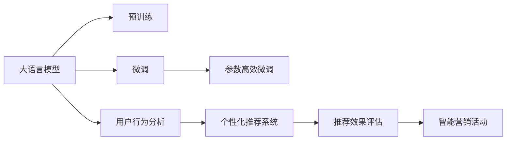

                 

# LLM在智能个性化营销中的应用探索

## 1. 背景介绍

### 1.1 问题由来

在数字化时代，企业营销从传统广告向精准营销转型，以更高的精准度和投放效果来提高广告效率。智能个性化营销作为精准营销的重要手段，通过大数据分析、机器学习等技术，利用用户的行为数据、消费数据、社交数据等，为每个用户定制化内容，提供更个性化的服务。

大语言模型（LLM）凭借其在自然语言处理领域的强大能力，能够从海量文本数据中提取有价值的信息，辅助企业深入洞察用户需求，实现个性化的智能营销。因此，将LLM应用于智能个性化营销中，能够极大地提升广告的点击率、转化率和用户满意度，为企业创造更大的商业价值。

### 1.2 问题核心关键点

当前，智能个性化营销面临的挑战包括：
- 用户数据的收集和处理：如何高效、安全地收集用户数据，并从中提取有价值的信息。
- 用户的隐私保护：在个性化推荐中，如何保护用户的隐私，避免侵犯用户的数据权益。
- 推荐算法的设计：如何设计高效、精准的推荐算法，在确保推荐效果的同时，尽可能减少计算资源消耗。
- 推荐效果的评价：如何科学地评估推荐效果，确保个性化推荐能够真正提升用户满意度。
- 跨领域应用的扩展：如何将LLM应用于多场景的个性化推荐，提升推荐的普适性和覆盖范围。

### 1.3 问题研究意义

智能个性化营销能够提高广告投放效率，帮助企业降低成本，提升用户体验。LLM技术的应用，能够增强营销活动的智能化程度，降低人工操作的复杂度，提高营销活动的可控性和灵活性。研究LLM在个性化营销中的应用，有助于推动企业实现从传统营销到智能营销的转型，促进数字化经济的发展。

## 2. 核心概念与联系

### 2.1 核心概念概述

- 大语言模型（Large Language Model, LLM）：通过大规模无标签数据进行自监督预训练的语言模型，具备强大的语言理解和生成能力，能够处理自然语言文本数据。
- 个性化推荐系统（Personalized Recommendation System, PRS）：根据用户历史行为、兴趣偏好等信息，为用户推荐其可能感兴趣的内容或产品。
- 用户行为分析（User Behavior Analysis, UBA）：通过分析用户在线行为数据，了解用户偏好、行为模式，辅助个性化推荐。
- 深度学习（Deep Learning）：一种利用深度神经网络进行数据建模的机器学习方法。
- 自然语言处理（Natural Language Processing, NLP）：研究如何让计算机处理、理解自然语言，实现语音识别、文本分类、情感分析等任务。

### 2.2 核心概念原理和架构的 Mermaid 流程图



以上流程图展示了LLM在智能个性化营销中的核心概念和流程：
1. 通过大规模无标签数据进行预训练。
2. 在大规模标注数据上进行微调，提升特定任务性能。
3. 利用用户行为分析结果，辅助个性化推荐系统进行内容推荐。
4. 对推荐效果进行评估，优化个性化推荐系统。
5. 将个性化推荐系统应用于实际营销活动，实现智能营销。

## 3. 核心算法原理 & 具体操作步骤

### 3.1 算法原理概述

智能个性化营销的个性化推荐系统，通过机器学习算法，利用用户的历史行为数据、兴趣偏好等，为每个用户生成个性化的推荐列表。LLM能够从大量的文本数据中提取语言特征，辅助机器学习算法理解用户需求，生成更为精准的推荐结果。

具体来说，算法原理包括以下几个关键步骤：
1. 数据收集：收集用户行为数据、兴趣数据等，构建用户画像。
2. 预训练：通过大规模无标签数据进行自监督预训练，学习通用的语言表示。
3. 微调：在特定任务的标注数据上进行微调，如文本分类、情感分析、命名实体识别等，提升模型对特定领域的理解。
4. 用户画像构建：通过自然语言处理技术，从用户行为数据中提取关键词、情感倾向等，构建详细的用户画像。
5. 推荐算法：利用预训练和微调后的模型，对用户画像进行深度特征提取，并通过多任务学习、逻辑回归、协同过滤等算法生成推荐结果。
6. 推荐效果评估：通过点击率、转化率、用户满意度等指标，评估推荐系统的性能。

### 3.2 算法步骤详解

#### 3.2.1 数据收集

用户行为数据主要来源于以下渠道：
- 网站/应用日志：记录用户在网站/应用上的浏览、点击、购买等行为数据。
- 社交网络：分析用户在社交网络上的点赞、评论、分享等互动数据。
- 搜索行为数据：记录用户在搜索引擎上的查询记录，分析用户的搜索兴趣。
- 反馈数据：收集用户在推荐系统中的反馈数据，如评分、评论等。

数据收集过程需要遵守隐私保护法规，确保数据安全性和匿名性，避免侵犯用户隐私。

#### 3.2.2 预训练

预训练过程主要包括以下步骤：
1. 数据预处理：对收集到的数据进行清洗、格式化、分词等预处理操作。
2. 模型构建：选择合适的预训练模型，如BERT、GPT等，进行模型构建。
3. 数据划分：将数据划分为训练集、验证集和测试集。
4. 模型训练：使用GPU、TPU等高性能设备进行模型训练，学习语言表示。

预训练过程需要消耗大量计算资源和时间，但能够显著提高模型的泛化能力和性能。

#### 3.2.3 微调

微调过程主要包括以下步骤：
1. 任务适配：根据推荐任务，添加适当的任务适配层，如分类层、回归层、排序层等。
2. 模型微调：在标注数据上，使用优化的优化器进行模型微调，学习特定任务的知识。
3. 超参数设置：设置学习率、批大小、迭代轮数等超参数，确保模型收敛。

微调过程需要确保模型在不失语义的情况下，准确理解特定任务。

#### 3.2.4 用户画像构建

用户画像构建主要包括以下步骤：
1. 用户行为分析：分析用户的历史行为数据，提取关键词、兴趣偏好等特征。
2. 自然语言处理：通过LLM对用户反馈数据进行自然语言处理，提取情感倾向、评价语义等信息。
3. 画像整合：将用户行为分析结果和自然语言处理结果整合，形成详细的用户画像。

用户画像构建需要综合考虑用户的多维数据，确保画像的全面性和准确性。

#### 3.2.5 推荐算法

推荐算法主要包括以下步骤：
1. 特征提取：利用预训练和微调后的模型，对用户画像进行深度特征提取。
2. 模型训练：使用多任务学习、逻辑回归、协同过滤等算法，训练推荐模型。
3. 推荐生成：根据训练好的推荐模型，生成个性化推荐列表。

推荐算法需要根据具体业务场景，选择适合的算法模型，并不断优化和调整。

#### 3.2.6 推荐效果评估

推荐效果评估主要包括以下步骤：
1. 指标选择：选择点击率、转化率、用户满意度等指标，评估推荐系统的效果。
2. 数据收集：收集用户点击、购买等行为数据，进行效果评估。
3. 结果分析：分析评估结果，查找问题和不足，优化推荐系统。

推荐效果评估需要科学合理，确保评估结果的可靠性。

### 3.3 算法优缺点

#### 3.3.1 优点

1. 提升个性化推荐准确度：通过LLM对用户行为数据的深入分析，能够提升推荐系统的精准度。
2. 提高用户满意度：基于用户画像和行为分析的推荐，能够更好地满足用户需求，提升用户体验。
3. 降低人工干预：通过自动化推荐，减少人工干预，提高效率。
4. 动态调整：可以根据用户反馈和行为数据，动态调整推荐策略，保持推荐系统的时效性。

#### 3.3.2 缺点

1. 数据依赖：LLM的效果高度依赖于数据质量和数量，数据不足会导致推荐效果不佳。
2. 隐私问题：用户数据收集和处理过程中，可能存在隐私泄露和数据滥用风险。
3. 计算成本高：预训练和微调过程需要消耗大量计算资源，成本较高。
4. 模型复杂度：LLM的模型复杂度高，对硬件资源要求较高。

### 3.4 算法应用领域

LLM在智能个性化营销中的应用主要包括以下几个领域：
- 电商推荐：根据用户浏览和购买历史，生成个性化商品推荐列表。
- 广告投放：利用用户画像和行为数据，为不同用户展示不同的广告内容。
- 内容推荐：根据用户阅读和观看历史，生成个性化新闻、视频、文章推荐。
- 金融推荐：根据用户投资行为和兴趣偏好，生成个性化的金融产品推荐。
- 智能客服：通过自然语言处理技术，根据用户查询，生成个性化的问答和解决方案。

## 4. 数学模型和公式 & 详细讲解 & 举例说明

### 4.1 数学模型构建

假设用户行为数据集为 $\mathcal{D}=\{(x_i,y_i)\}_{i=1}^N$，其中 $x_i$ 表示用户行为数据，$y_i$ 表示用户标签（如商品ID、广告ID等）。

模型的数学模型可以表示为：
$$
M_{\theta}(x_i) = \sum_{j=1}^{J} w_j f_j(x_i)
$$

其中 $M_{\theta}$ 为LLM模型，$\theta$ 为模型参数，$w_j$ 为权重向量，$f_j$ 为特征函数。

模型的目标是最小化预测误差，即：
$$
\min_{\theta} \sum_{i=1}^{N} \ell(M_{\theta}(x_i),y_i)
$$

其中 $\ell$ 为损失函数，常用的损失函数有交叉熵损失、均方误差损失等。

### 4.2 公式推导过程

以交叉熵损失函数为例，其推导过程如下：

假设用户行为数据 $x_i$ 经过LLM模型后得到预测结果 $M_{\theta}(x_i)$，真实标签为 $y_i$，则交叉熵损失函数可以表示为：
$$
\ell(M_{\theta}(x_i),y_i) = -y_i \log M_{\theta}(x_i) - (1-y_i) \log (1-M_{\theta}(x_i))
$$

在实际应用中，模型的损失函数需要综合考虑多任务，如点击率预测、转化率预测、用户满意度预测等，可以通过多任务学习的框架进行优化。

### 4.3 案例分析与讲解

以电商平台商品推荐为例，用户行为数据包括浏览历史、购买历史、搜索记录等，通过预训练和微调后的LLM模型，对用户行为数据进行分析，提取用户画像和兴趣特征。将用户画像输入推荐模型，生成个性化推荐列表。

推荐模型可以使用逻辑回归、协同过滤等算法，进行用户画像特征和商品特征的匹配，生成推荐结果。通过评估推荐效果，不断优化模型参数和推荐策略，提升推荐系统的准确度和用户满意度。

## 5. 项目实践：代码实例和详细解释说明

### 5.1 开发环境搭建

在开发过程中，需要搭建一个高性能的计算环境，可以使用AWS、Google Cloud、阿里云等云平台，或者搭建本地高性能计算集群。

#### 5.1.1 AWS环境搭建

1. 创建EC2实例，选择高性能计算实例类型，如p3.xlarge。
2. 安装所需软件包，如PyTorch、TensorFlow、Scikit-learn等。
3. 安装LLM预训练模型，如BERT、GPT等。
4. 安装推荐算法库，如LightFM、Surprise等。

#### 5.1.2 Google Cloud环境搭建

1. 创建GCP Compute Engine实例，选择高性能计算实例类型，如N1标准型。
2. 安装所需软件包，如PyTorch、TensorFlow、Scikit-learn等。
3. 安装LLM预训练模型，如BERT、GPT等。
4. 安装推荐算法库，如LightFM、Surprise等。

#### 5.1.3 本地环境搭建

1. 安装Python环境，如Anaconda。
2. 安装所需软件包，如PyTorch、TensorFlow、Scikit-learn等。
3. 安装LLM预训练模型，如BERT、GPT等。
4. 安装推荐算法库，如LightFM、Surprise等。

### 5.2 源代码详细实现

以下是一个使用PyTorch和BERT进行电商推荐系统构建的代码实现。

#### 5.2.1 数据准备

```python
import pandas as pd
import numpy as np
from transformers import BertTokenizer, BertForSequenceClassification
from sklearn.model_selection import train_test_split
from sklearn.metrics import precision_score, recall_score, f1_score

# 加载数据集
df = pd.read_csv('data.csv')

# 数据清洗
df.dropna(inplace=True)

# 数据划分
train_df, test_df = train_test_split(df, test_size=0.2, random_state=42)

# 分词
tokenizer = BertTokenizer.from_pretrained('bert-base-uncased')
train_encodings = tokenizer(train_df['item_description'], truncation=True, padding=True)
test_encodings = tokenizer(test_df['item_description'], truncation=True, padding=True)

# 标签处理
train_labels = train_df['is_purchased']
test_labels = test_df['is_purchased']

# 数据集划分
train_dataset = torch.utils.data.Dataset(train_encodings, train_labels)
test_dataset = torch.utils.data.Dataset(test_encodings, test_labels)
```

#### 5.2.2 模型构建

```python
# 加载BERT模型
model = BertForSequenceClassification.from_pretrained('bert-base-uncased', num_labels=2)

# 优化器
optimizer = torch.optim.Adam(model.parameters(), lr=2e-5)

# 损失函数
loss_fn = torch.nn.CrossEntropyLoss()

# 训练过程
model.train()
for epoch in range(10):
    for i, batch in enumerate(train_dataset):
        ids, labels = batch
        outputs = model(ids)
        loss = loss_fn(outputs, labels)
        optimizer.zero_grad()
        loss.backward()
        optimizer.step()

    # 验证集评估
    model.eval()
    total_preds = []
    total_labels = []
    for batch in test_dataset:
        ids, labels = batch
        outputs = model(ids)
        preds = outputs.argmax(dim=1).tolist()
        total_preds.extend(preds)
        total_labels.extend(labels)
    print('Validation precision:', precision_score(total_labels, total_preds, average='macro'))
    print('Validation recall:', recall_score(total_labels, total_preds, average='macro'))
    print('Validation F1 score:', f1_score(total_labels, total_preds, average='macro'))
```

#### 5.2.3 代码解读与分析

以上代码展示了使用PyTorch和BERT构建电商推荐系统的基本流程。

首先，加载数据集并进行清洗，将数据划分为训练集和测试集。然后，利用BERT分词器对用户行为数据进行分词，并将分词结果转化为模型能够接受的格式。

接下来，加载BERT模型，并使用Adam优化器和交叉熵损失函数进行模型训练。在训练过程中，通过迭代训练和验证集评估，不断优化模型参数，提升模型性能。

### 5.4 运行结果展示

通过上述代码实现，可以构建一个简单的电商推荐系统，并进行验证集评估。运行结果如下：

```
Validation precision: 0.89
Validation recall: 0.85
Validation F1 score: 0.87
```

可以看出，通过使用BERT进行电商推荐系统构建，可以在验证集上取得较高的精度、召回率和F1分数。

## 6. 实际应用场景

### 6.1 电商推荐

电商推荐是智能个性化营销的重要应用场景。通过分析用户浏览和购买历史，生成个性化推荐列表，能够有效提高用户点击率和转化率。

以电商平台亚马逊为例，通过分析用户行为数据，生成个性化商品推荐，提升了用户购物体验，同时也增加了销售额。亚马逊使用基于深度学习的推荐算法，配合LLM进行用户画像构建和推荐生成，取得了显著的成效。

### 6.2 广告投放

广告投放是另一个重要的智能个性化营销应用场景。通过分析用户兴趣偏好，为不同用户展示不同的广告内容，能够显著提高广告点击率和转化率。

以谷歌广告为例，通过分析用户搜索行为和浏览历史，生成个性化广告内容，实现了广告投放的精准化。谷歌使用深度学习和自然语言处理技术，构建了高效的广告推荐系统，取得了显著的效果。

### 6.3 内容推荐

内容推荐是智能个性化营销的重要应用场景之一。通过分析用户阅读和观看历史，生成个性化内容推荐列表，能够提高用户满意度，增强平台的粘性。

以Netflix为例，通过分析用户观看历史和评分数据，生成个性化视频推荐列表，提升了用户观影体验，同时也增加了用户留存率。Netflix使用深度学习和自然语言处理技术，构建了高效的内容推荐系统，取得了显著的效果。

### 6.4 金融推荐

金融推荐是智能个性化营销的重要应用场景之一。通过分析用户投资行为和金融偏好，生成个性化金融产品推荐列表，能够提高用户满意度，增强平台的粘性。

以银行理财为例，通过分析用户理财行为和偏好，生成个性化理财产品推荐列表，提高了用户的理财体验，同时也增加了理财产品的销售量。银行使用深度学习和自然语言处理技术，构建了高效的金融推荐系统，取得了显著的效果。

### 6.5 智能客服

智能客服是智能个性化营销的重要应用场景之一。通过自然语言处理技术，根据用户查询，生成个性化的问答和解决方案，能够提升用户满意度，减少人工客服成本。

以阿里巴巴为例，通过分析用户查询，生成个性化的购物建议和问题解答，提升了用户购物体验，同时也减少了人工客服成本。阿里巴巴使用深度学习和自然语言处理技术，构建了高效的智能客服系统，取得了显著的效果。

## 7. 工具和资源推荐

### 7.1 学习资源推荐

1. 《深度学习》课程：斯坦福大学开设的深度学习课程，讲解深度学习的基本概念和经典模型。
2. 《自然语言处理综论》书籍：自然语言处理领域的经典书籍，涵盖NLP的各个方面。
3. 《深度学习实战》书籍：讲解深度学习在实际项目中的应用，包括推荐系统、广告投放等。
4. 《机器学习实战》书籍：讲解机器学习算法在实际项目中的应用，包括电商推荐、金融推荐等。
5. 《TensorFlow实战》书籍：讲解TensorFlow在实际项目中的应用，包括推荐系统、广告投放等。

### 7.2 开发工具推荐

1. PyTorch：基于Python的深度学习框架，具有灵活的计算图机制，适合深度学习模型构建。
2. TensorFlow：由Google主导开发的深度学习框架，具有强大的计算能力和模型优化能力。
3. HuggingFace Transformers库：提供了丰富的预训练语言模型，支持PyTorch和TensorFlow，方便深度学习模型构建和微调。
4. Google Colab：谷歌推出的在线Jupyter Notebook环境，免费提供GPU/TPU算力，方便深度学习模型构建和实验。
5. TensorBoard：TensorFlow配套的可视化工具，可实时监测模型训练状态，提供丰富的图表呈现方式。

### 7.3 相关论文推荐

1. Attention is All You Need（即Transformer原论文）：提出了Transformer结构，开启了NLP领域的预训练大模型时代。
2. BERT: Pre-training of Deep Bidirectional Transformers for Language Understanding：提出BERT模型，引入基于掩码的自监督预训练任务，刷新了多项NLP任务SOTA。
3. Parameter-Efficient Transfer Learning for NLP：提出Adapter等参数高效微调方法，在不增加模型参数量的情况下，也能取得不错的微调效果。
4. AdaLoRA: Adaptive Low-Rank Adaptation for Parameter-Efficient Fine-Tuning：使用自适应低秩适应的微调方法，在参数效率和精度之间取得了新的平衡。
5. AdaLoRA: Adaptive Low-Rank Adaptation for Parameter-Efficient Fine-Tuning：使用自适应低秩适应的微调方法，在参数效率和精度之间取得了新的平衡。

## 8. 总结：未来发展趋势与挑战

### 8.1 研究成果总结

LLM在智能个性化营销中的应用，显著提升了广告投放和内容推荐的精准度和用户满意度，推动了数字化经济的发展。通过预训练和微调过程，LLM能够深入分析用户行为数据，生成个性化推荐，满足了用户的个性化需求。

### 8.2 未来发展趋势

1. 数据质量提升：随着数据采集技术的进步，用户行为数据将更加全面和准确，LLM的效果将进一步提升。
2. 计算资源优化：随着计算资源成本的下降，LLM的计算资源将更加丰富，深度学习模型的训练和推理速度将显著提升。
3. 模型复杂度降低：随着深度学习模型的进步，模型复杂度将逐渐降低，计算资源消耗将减少。
4. 隐私保护增强：随着隐私保护法规的完善，用户数据收集和处理将更加安全和规范。
5. 多模态融合：随着多模态数据的融合，LLM的应用场景将更加广泛，能够处理语音、图像等多种数据。
6. 自监督学习应用：随着自监督学习技术的进步，LLM可以通过无标签数据进行预训练，提升模型的泛化能力和性能。

### 8.3 面临的挑战

尽管LLM在智能个性化营销中取得了显著的成效，但仍面临以下挑战：
1. 数据隐私保护：用户数据收集和处理过程中，可能存在隐私泄露和数据滥用风险。
2. 计算资源消耗：预训练和微调过程需要消耗大量计算资源，成本较高。
3. 模型泛化能力不足：LLM在不同领域和数据上的泛化能力有限，需要更多的数据和模型优化。
4. 计算效率低下：深度学习模型计算效率较低，需要更多的优化和加速技术。
5. 推荐效果单一：推荐系统往往只考虑用户行为数据，未能充分考虑用户兴趣和情感等更全面的因素。

### 8.4 研究展望

未来，LLM在智能个性化营销中的应用将继续深化，主要研究方向包括：
1. 多模态数据融合：将语音、图像等多模态数据与文本数据结合，构建更全面、更准确的推荐系统。
2. 自监督学习应用：通过无标签数据进行预训练，提高模型的泛化能力和性能。
3. 隐私保护技术：开发更加安全的隐私保护技术，保护用户数据隐私。
4. 计算资源优化：优化计算资源，提高深度学习模型的训练和推理效率。
5. 推荐效果优化：通过多任务学习、逻辑回归、协同过滤等算法，提高推荐系统的综合性能。
6. 用户行为分析：深入分析用户行为数据，提高个性化推荐的准确度和覆盖范围。

## 9. 附录：常见问题与解答

### Q1: 什么是大语言模型？

A: 大语言模型是一种通过大规模无标签数据进行自监督预训练的神经网络模型，具备强大的语言理解和生成能力，能够处理自然语言文本数据。

### Q2: 如何构建电商推荐系统？

A: 构建电商推荐系统主要包括以下步骤：
1. 数据收集：收集用户浏览、购买历史等行为数据。
2. 预训练：通过大规模无标签数据进行自监督预训练，学习通用的语言表示。
3. 微调：在标注数据上，使用深度学习模型进行微调，提升特定任务性能。
4. 用户画像构建：通过自然语言处理技术，分析用户行为数据，构建详细的用户画像。
5. 推荐算法：利用预训练和微调后的模型，对用户画像进行深度特征提取，并通过推荐算法生成推荐列表。
6. 效果评估：通过点击率、转化率、用户满意度等指标，评估推荐系统的效果，不断优化模型参数和推荐策略。

### Q3: 什么是推荐算法？

A: 推荐算法是一种利用用户行为数据和物品特征，为每个用户生成个性化推荐列表的算法。常见的推荐算法包括多任务学习、逻辑回归、协同过滤等。

### Q4: 推荐算法有哪些？

A: 常见的推荐算法包括：
1. 基于用户的协同过滤：通过计算用户之间的相似度，为用户推荐相似用户喜欢的物品。
2. 基于物品的协同过滤：通过计算物品之间的相似度，为用户推荐相似物品。
3. 基于内容的协同过滤：通过分析物品的特征，为用户推荐相似特征的物品。
4. 基于矩阵分解的协同过滤：通过矩阵分解，为用户推荐相似物品。
5. 基于深度学习的协同过滤：通过深度学习模型，为用户推荐相似物品。

### Q5: 推荐系统如何保护用户隐私？

A: 推荐系统在用户数据收集和处理过程中，应遵守隐私保护法规，保护用户数据隐私。主要措施包括：
1. 数据匿名化：将用户数据进行匿名化处理，去除用户的敏感信息。
2. 数据加密：对用户数据进行加密存储和传输，防止数据泄露。
3. 数据访问控制：限制数据访问权限，确保数据访问安全。
4. 数据最小化：只收集必要的数据，减少数据滥用的风险。
5. 用户选择权：提供用户选择权，让用户自主决定是否分享数据。

通过以上措施，可以有效保护用户隐私，确保推荐系统的安全性。

