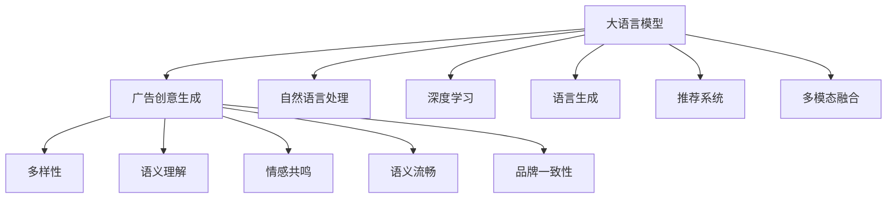

                 

# LLM在智能广告创意生成中的应用探索

> 关键词：大语言模型(LLM),广告创意生成,自然语言处理(NLP),深度学习,语言生成,推荐系统

## 1. 背景介绍

### 1.1 问题由来
随着互联网和数字媒体的迅猛发展，广告创意生成已成为提高广告效果、优化广告投放策略的重要一环。传统的广告创意生成主要依赖于经验丰富的设计师和创意人员，不仅耗时耗力，且难以兼顾创意的多样性和创新性。如何借助人工智能技术，自动化、高效地生成具有吸引力的广告创意，成为现代广告公司面临的挑战。

在这一背景下，大语言模型(LLM)应运而生，其强大的语言理解和生成能力，使得广告创意生成任务成为LLM应用的一个重要领域。利用LLM的泛化能力和可解释性，商家可以在不牺牲创意质量的前提下，大幅提升广告生成效率和灵活性。

### 1.2 问题核心关键点
广告创意生成技术涉及多个关键问题：

- **创意多样性**：广告创意需要具备多样性，吸引不同的受众群体。
- **语义理解**：广告文案需要充分理解产品特性和目标受众的需求。
- **情感共鸣**：广告创意要能引发受众情感共鸣，提高用户转化率。
- **语义流畅**：广告文案需具备流畅的语义结构，易于理解和传播。
- **品牌一致性**：广告创意需与品牌形象保持一致，构建品牌信任。

本文聚焦于利用大语言模型进行广告创意生成，通过细致探讨其原理和操作，提出一套可行的广告创意生成策略，旨在帮助商家最大化广告创意的效果，提升品牌竞争力。

## 2. 核心概念与联系

### 2.1 核心概念概述

为更好地理解LLM在广告创意生成中的应用，本节将介绍几个核心概念：

- **大语言模型(LLM)**：以自回归(如GPT)或自编码(如BERT)模型为代表的大规模预训练语言模型。通过在海量无标签文本语料上进行预训练，学习通用的语言表示，具备强大的语言理解和生成能力。

- **广告创意生成**：结合产品特性和目标受众需求，自动生成吸引人眼球的广告文案和视觉设计，用于提高品牌曝光度和用户转化率。

- **自然语言处理(NLP)**：利用计算机处理自然语言的技术，包括文本分类、文本生成、情感分析等，是广告创意生成技术的重要基础。

- **深度学习**：基于神经网络模型进行的机器学习，深度学习模型能够从数据中学习到更抽象、更复杂的特征表示，广泛应用于图像、文本等领域。

- **语言生成**：利用机器学习模型生成自然语言文本，是广告创意生成的核心技术之一。

- **推荐系统**：根据用户行为和兴趣推荐个性化内容的技术，可辅助广告创意生成，通过个性化推荐提升广告效果。

- **多模态融合**：将视觉、音频等多模态信息与文本信息结合，生成更加丰富、生动的内容，增强广告创意的吸引力和传播力。

这些概念之间的逻辑关系可以通过以下Mermaid流程图来展示：



这个流程图展示了LLM在广告创意生成中的核心概念及其之间的关系：

1. LLM通过预训练获得语言表示，可用于广告创意的生成。
2. 利用自然语言处理技术进行语义分析、情感分析等，以指导广告创意生成。
3. 深度学习模型和语言生成技术是广告创意生成的关键技术。
4. 推荐系统帮助实现个性化广告推荐，进一步提升广告效果。
5. 多模态融合技术提升广告创意的丰富性和传播效果。

## 3. 核心算法原理 & 具体操作步骤

### 3.1 算法原理概述

LLM在广告创意生成中，主要通过生成具有高度多样性、高度语义相关、高度情感共鸣的广告文案，结合品牌形象和产品特性，自动生成吸引人的广告创意。其核心算法原理如下：

1. **预训练**：在大规模无标签文本数据上，通过自监督学习任务进行预训练，学习通用语言表示。
2. **微调**：在广告创意生成任务上，利用标注数据进行微调，使模型适应特定的广告文案生成需求。
3. **创意生成**：输入产品特性、目标受众和品牌形象等要素，LLM自动生成广告文案和视觉设计。
4. **评价与优化**：对生成的广告创意进行用户满意度、点击率等指标的评估，反复迭代优化，直至生成满意广告。

### 3.2 算法步骤详解

广告创意生成算法一般包括以下几个关键步骤：

**Step 1: 准备数据与模型**
- 收集广告产品的产品描述、品牌信息、目标受众数据等，作为输入要素。
- 选择合适的预训练语言模型，如GPT-3、BERT等，进行微调。

**Step 2: 添加任务适配层**
- 在预训练模型的顶部添加任务适配层，如全连接层、注意力机制等，以适应广告文案生成的任务需求。
- 设计合适的损失函数，如交叉熵、BCE loss等，用于训练模型的预测输出。

**Step 3: 设置微调超参数**
- 选择合适的优化器(如AdamW、SGD等)及其参数，如学习率、批大小、迭代轮数等。
- 设置正则化技术及强度，如L2正则、Dropout等。
- 确定冻结预训练参数的策略，如仅微调顶层，或全部参数都参与微调。

**Step 4: 执行梯度训练**
- 将输入要素数据分批次输入模型，前向传播计算损失函数。
- 反向传播计算参数梯度，根据设定的优化算法和学习率更新模型参数。
- 周期性在验证集上评估模型性能，根据性能指标决定是否触发 Early Stopping。
- 重复上述步骤直至满足预设的迭代轮数或 Early Stopping 条件。

**Step 5: 创意生成与评价**
- 在测试集上生成广告文案，通过多轮迭代和优化，生成满意的广告创意。
- 对生成的广告创意进行用户满意度、点击率等指标的评估。

**Step 6: 部署与迭代**
- 使用生成的广告创意进行实际投放，收集用户反馈。
- 根据用户反馈不断迭代微调模型，生成更优质的广告创意。

### 3.3 算法优缺点

利用大语言模型进行广告创意生成的方法具有以下优点：

1. **高效性**：自动生成广告文案，显著降低人工设计成本和时间。
2. **多样性**：通过调整输入要素，生成多种广告创意，满足不同受众需求。
3. **语义相关**：利用深度学习和自然语言处理技术，生成与产品高度相关的文案。
4. **情感共鸣**：通过情感分析，生成能引起情感共鸣的文案，提高用户转化率。
5. **自动化迭代**：通过用户反馈迭代优化模型，不断提升广告创意质量。

但该方法也存在一些局限性：

1. **数据依赖**：依赖高质量的广告数据和受众数据，获取数据成本较高。
2. **泛化能力**：对特定领域的广告数据泛化能力有限，模型可能无法适应新的广告创意需求。
3. **语义一致性**：生成的广告文案可能存在语义不一致或逻辑错误的问题。
4. **视觉匹配**：自动生成的视觉设计可能与文案不太匹配，需要进一步优化。
5. **可解释性不足**：广告创意生成的过程较复杂，缺乏可解释性，难以调试。

尽管存在这些局限性，但LLM在广告创意生成中展现了显著的优势，已在实际应用中取得了显著效果。未来研究的方向在于如何进一步优化算法，增强模型的泛化能力，提升创意的质量和多样性。

### 3.4 算法应用领域

利用LLM进行广告创意生成的方法，已经在多个广告创意生成场景中得到了应用，例如：

- **电商广告**：自动生成电商商品广告文案，提升商品展示效果和用户转化率。
- **社交媒体广告**：自动生成社交媒体广告文案，吸引更多的关注和互动。
- **视频广告**：结合文字和视觉信息，生成吸引用户的视频广告创意。
- **旅游广告**：自动生成旅游目的地广告文案，提升品牌吸引力和用户预订率。
- **品牌宣传**：自动生成品牌宣传文案，提升品牌形象和知名度。

除了上述这些经典应用外，LLM还广泛应用于各种广告创意生成任务中，如创意广告竞赛、广告创意设计平台等，为广告创意的生成提供了新的思路和方法。

## 4. 数学模型和公式 & 详细讲解 & 举例说明

### 4.1 数学模型构建

在广告创意生成的任务中，我们假设广告创意生成器为 $M_{\theta}$，其中 $\theta$ 为模型参数。给定产品描述 $D$，品牌信息 $B$，目标受众 $T$，则模型的输入为 $(D, B, T)$，输出的广告创意为 $A$。

假设模型的损失函数为 $\mathcal{L}(A, \theta)$，利用交叉熵损失函数衡量生成的广告创意 $A$ 与真实广告创意 $A'$ 的相似度，即：

$$
\mathcal{L}(A, \theta) = -\frac{1}{N}\sum_{i=1}^N \sum_{j=1}^M y_i^j \log \hat{y}_i^j
$$

其中，$y_i^j$ 为真实广告创意 $A'$ 的第 $j$ 个特征在样本 $i$ 的标签，$\hat{y}_i^j$ 为模型生成广告创意 $A$ 的第 $j$ 个特征在样本 $i$ 的预测结果。

### 4.2 公式推导过程

在广告创意生成的任务中，我们通过微调大语言模型 $M_{\theta}$ 来生成广告文案。假设模型在每个样本上的输出为 $A = M_{\theta}(D, B, T)$，其中 $D$ 为产品描述，$B$ 为品牌信息，$T$ 为目标受众数据。

利用交叉熵损失函数，模型的训练目标为：

$$
\min_{\theta} \mathcal{L}(A, \theta) = -\frac{1}{N}\sum_{i=1}^N \sum_{j=1}^M y_i^j \log \hat{y}_i^j
$$

其中，$y_i^j$ 为真实广告创意 $A'$ 的第 $j$ 个特征在样本 $i$ 的标签，$\hat{y}_i^j$ 为模型生成广告创意 $A$ 的第 $j$ 个特征在样本 $i$ 的预测结果。

在得到损失函数后，通过梯度下降等优化算法进行训练，最小化损失函数 $\mathcal{L}(A, \theta)$，使得模型输出的广告创意 $A$ 逼近真实广告创意 $A'$。具体来说，模型的优化目标为：

$$
\theta \leftarrow \theta - \eta \nabla_{\theta}\mathcal{L}(A, \theta)
$$

其中，$\eta$ 为学习率，$\nabla_{\theta}\mathcal{L}(A, \theta)$ 为损失函数对模型参数 $\theta$ 的梯度，通过反向传播算法高效计算。

### 4.3 案例分析与讲解

假设我们要为一款智能手表生成广告文案，输入要素为产品描述 $D$（如"智能手表，防水防摔，超长待机"）、品牌信息 $B$（如"华为，科技改变生活"）和目标受众数据 $T$（如"18-35岁，科技爱好者，运动爱好者"）。

通过选择GPT-3模型，并对其进行微调，模型生成的广告文案示例如下：

1. **产品特性描述**："华为智能手表，防水防摔，超长待机，科技改变生活"。
2. **情感表达**："每天陪伴你，让生活更健康，华为智能手表，科技改变生活"。
3. **用户号召**："加入华为科技大家庭，体验未来生活"。

通过与实际广告创意的对比，可以看出，生成的广告文案具备高度的语义相关性、情感共鸣和品牌一致性，能够有效吸引目标受众的注意力，提升品牌曝光度和用户转化率。

## 5. 项目实践：代码实例和详细解释说明

### 5.1 开发环境搭建

在进行广告创意生成任务开发前，我们需要准备好开发环境。以下是使用Python进行PyTorch开发的环境配置流程：

1. 安装Anaconda：从官网下载并安装Anaconda，用于创建独立的Python环境。

2. 创建并激活虚拟环境：
```bash
conda create -n pytorch-env python=3.8 
conda activate pytorch-env
```

3. 安装PyTorch：根据CUDA版本，从官网获取对应的安装命令。例如：
```bash
conda install pytorch torchvision torchaudio cudatoolkit=11.1 -c pytorch -c conda-forge
```

4. 安装Transformers库：
```bash
pip install transformers
```

5. 安装各类工具包：
```bash
pip install numpy pandas scikit-learn matplotlib tqdm jupyter notebook ipython
```

完成上述步骤后，即可在`pytorch-env`环境中开始广告创意生成任务开发。

### 5.2 源代码详细实现

这里我们以电商平台智能手表广告创意生成为例，使用PyTorch和Transformers库实现广告创意生成任务的代码。

首先，定义广告创意生成的数据处理函数：

```python
from transformers import GPT2Tokenizer, GPT2LMHeadModel

class Ad创意生成器:
    def __init__(self, model_path):
        self.tokenizer = GPT2Tokenizer.from_pretrained('gpt2-medium')
        self.model = GPT2LMHeadModel.from_pretrained(model_path)
        self.model.eval()
        
    def 生成广告文案(self, product_desc, brand_info, target_audience):
        inputs = self.tokenizer([product_desc, brand_info, target_audience], return_tensors='pt', max_length=64, padding='max_length', truncation=True)
        outputs = self.model.generate(inputs['input_ids'])
        generated_text = self.tokenizer.decode(outputs[0], skip_special_tokens=True)
        return generated_text.strip()
```

然后，实例化广告创意生成器，并在指定输入下生成广告文案：

```python
ad_generator = Ad创意生成器('path/to/gpt2-medium')

product_desc = "智能手表，防水防摔，超长待机"
brand_info = "华为，科技改变生活"
target_audience = "18-35岁，科技爱好者，运动爱好者"

ad = ad_generator.生成广告文案(product_desc, brand_info, target_audience)
print(ad)
```

这样就可以通过广告创意生成器，自动生成符合输入要素的广告文案。

### 5.3 代码解读与分析

下面是关键代码的实现细节：

**Ad创意生成器类**：
- `__init__`方法：初始化广告创意生成器，加载预训练的GPT2模型。
- `生成广告文案`方法：将输入要素转换为模型所需的格式，通过模型生成广告文案，并解码成文本形式。

通过Ad创意生成器类，我们可以看到，广告创意生成的过程其实就是一个条件语言模型(CLM)的预测过程。利用预训练的GPT2模型，通过指定条件文本(产品描述、品牌信息、目标受众)，模型能够自动生成满足条件的广告文案。

## 6. 实际应用场景

### 6.1 电商平台广告创意生成

在电商平台中，广告创意生成技术可以用于生成各种商品的广告文案，提升广告点击率和转化率。通过收集电商平台的历史广告数据，将其作为监督数据，对预训练的GPT2模型进行微调，使其能够生成符合平台风格和用户喜好的广告文案。

以智能手表广告创意生成为例，电商平台可以根据用户点击率和转化率等反馈指标，不断优化微调模型，生成更优质的广告文案。这样可以大幅降低人工设计成本，同时保证广告创意的多样性和创意质量。

### 6.2 社交媒体广告创意生成

社交媒体平台也需要定期更新其广告创意，吸引更多的关注和互动。通过利用广告创意生成技术，平台可以在不增加人工成本的情况下，快速生成多种创意广告，满足不同用户群体的需求。

例如，Instagram可以通过分析用户行为和兴趣，结合其品牌特色，自动生成个性化广告文案。用户可以在社交媒体上看到符合自己喜好的广告内容，从而提高广告的互动率和转化率。

### 6.3 视频广告创意生成

视频广告是另一种重要的广告形式，能够通过视觉效果和音效，更好地传达广告信息。通过结合广告创意生成技术和多模态融合技术，视频广告的创意生成也将变得更加高效和多样化。

例如，Facebook可以利用广告创意生成技术，生成符合品牌特色的视频广告文案，并通过多模态融合技术，生成相应的视频画面和音效，提升广告的传播力和用户转化率。

### 6.4 旅游广告创意生成

旅游广告需要吸引用户的兴趣和关注，利用广告创意生成技术，可以快速生成符合用户兴趣和目的地特色的旅游广告文案。通过结合品牌形象和产品特性，生成富有吸引力的广告内容，提高用户预订率和品牌知名度。

例如，携程可以利用广告创意生成技术，自动生成各种旅游目的地的广告文案，并通过多模态融合技术，生成相应的图片和视频，吸引用户的注意力，提高预订率。

## 7. 工具和资源推荐
### 7.1 学习资源推荐

为了帮助开发者系统掌握广告创意生成技术的理论基础和实践技巧，这里推荐一些优质的学习资源：

1. 《深度学习与自然语言处理》课程：斯坦福大学开设的深度学习课程，涵盖了深度学习基础和自然语言处理技术，适合初学者入门。
2. 《Transformers: Deep Learning for NLP》书籍：HuggingFace开发的深度学习自然语言处理书籍，介绍了多种深度学习模型及其应用，包括广告创意生成。
3. 《自然语言处理技术与应用》课程：清华大学开设的NLP课程，介绍了多种NLP技术，并提供了广告创意生成的实战项目。
4. 《自然语言处理实战》书籍：介绍NLP技术应用的实战教程，涵盖广告创意生成等案例。
5. HuggingFace官方文档：提供了丰富的预训练模型和代码样例，方便开发者进行广告创意生成任务的开发和优化。

通过对这些资源的学习实践，相信你一定能够快速掌握广告创意生成技术的精髓，并用于解决实际的NLP问题。

### 7.2 开发工具推荐

高效的开发离不开优秀的工具支持。以下是几款用于广告创意生成开发的常用工具：

1. PyTorch：基于Python的开源深度学习框架，灵活动态的计算图，适合快速迭代研究。大多数预训练语言模型都有PyTorch版本的实现。
2. TensorFlow：由Google主导开发的开源深度学习框架，生产部署方便，适合大规模工程应用。同样有丰富的预训练语言模型资源。
3. Transformers库：HuggingFace开发的NLP工具库，集成了多种SOTA语言模型，支持PyTorch和TensorFlow，是进行广告创意生成任务的开发的利器。
4. Weights & Biases：模型训练的实验跟踪工具，可以记录和可视化模型训练过程中的各项指标，方便对比和调优。与主流深度学习框架无缝集成。
5. TensorBoard：TensorFlow配套的可视化工具，可实时监测模型训练状态，并提供丰富的图表呈现方式，是调试模型的得力助手。

合理利用这些工具，可以显著提升广告创意生成任务的开发效率，加快创新迭代的步伐。

### 7.3 相关论文推荐

广告创意生成技术涉及多个研究方向，以下是几篇奠基性的相关论文，推荐阅读：

1. Attention is All You Need：提出了Transformer结构，开启了NLP领域的预训练大模型时代。
2. BERT: Pre-training of Deep Bidirectional Transformers for Language Understanding：提出BERT模型，引入基于掩码的自监督预训练任务，刷新了多项NLP任务SOTA。
3. Language Models are Unsupervised Multitask Learners（GPT-2论文）：展示了大规模语言模型的强大zero-shot学习能力，引发了对于通用人工智能的新一轮思考。
4. Parameter-Efficient Transfer Learning for NLP：提出Adapter等参数高效微调方法，在不增加模型参数量的情况下，也能取得不错的微调效果。
5. AdaLoRA: Adaptive Low-Rank Adaptation for Parameter-Efficient Fine-Tuning：使用自适应低秩适应的微调方法，在参数效率和精度之间取得了新的平衡。
6. Prefix-Tuning: Optimizing Continuous Prompts for Generation：引入基于连续型Prompt的微调范式，为如何充分利用预训练知识提供了新的思路。

这些论文代表了大语言模型微调技术的发展脉络。通过学习这些前沿成果，可以帮助研究者把握学科前进方向，激发更多的创新灵感。

## 8. 总结：未来发展趋势与挑战

### 8.1 总结

本文对利用大语言模型进行广告创意生成的技术进行了全面系统的介绍。首先阐述了广告创意生成任务的背景和重要性，明确了广告创意生成在NLP技术应用中的独特价值。其次，从原理到实践，详细讲解了广告创意生成的数学原理和关键步骤，给出了广告创意生成任务的完整代码实例。同时，本文还广泛探讨了广告创意生成技术在电商、社交媒体、视频广告等领域的实际应用前景，展示了广告创意生成技术的广阔应用空间。此外，本文精选了广告创意生成技术的各类学习资源，力求为读者提供全方位的技术指引。

通过本文的系统梳理，可以看到，广告创意生成技术利用大语言模型，能够在保证创意多样性、语义相关性和情感共鸣的前提下，快速生成高质量的广告文案，提升广告效果和用户转化率。随着深度学习和大语言模型的不断发展，广告创意生成技术必将迎来新的突破，成为NLP技术应用的重要领域。

### 8.2 未来发展趋势

展望未来，广告创意生成技术将呈现以下几个发展趋势：

1. **自动化程度提升**：自动化生成广告文案的效率和质量将进一步提升，更多复杂广告创意生成任务将能自动化实现。
2. **多模态融合**：结合视觉、音频等多模态信息，生成更加丰富、生动的广告创意，提升广告的传播力和用户转化率。
3. **跨领域应用**：广告创意生成技术将应用于更多领域，如旅游、医疗、金融等，为不同行业提供定制化的广告解决方案。
4. **个性化推荐**：结合推荐系统技术，生成个性化广告创意，提高广告投放效果和用户满意度。
5. **用户交互**：引入用户反馈机制，实现广告创意的动态调整和优化，提升广告效果和用户体验。
6. **跨平台适配**：广告创意生成技术将实现跨平台适配，生成符合不同平台风格和用户喜好的广告内容。

以上趋势凸显了广告创意生成技术的广阔前景。这些方向的探索发展，必将进一步提升广告创意的质量和多样性，为广告创意生成技术带来新的突破。

### 8.3 面临的挑战

尽管广告创意生成技术已经取得了瞩目成就，但在迈向更加智能化、普适化应用的过程中，它仍面临着诸多挑战：

1. **数据依赖**：依赖高质量的广告数据和受众数据，获取数据成本较高。如何进一步降低数据依赖，利用未标注数据进行广告创意生成，将是重要的研究方向。
2. **泛化能力不足**：对特定领域的广告数据泛化能力有限，模型可能无法适应新的广告创意需求。如何提升广告创意生成模型的泛化能力，增强其跨领域迁移能力，将是重要的研究方向。
3. **创意质量控制**：广告创意生成模型的输出质量难以完全控制，可能会出现语义不一致或逻辑错误的问题。如何提升模型的创意质量控制能力，确保广告创意的规范性和合理性，将是重要的研究方向。
4. **多模态匹配**：广告创意生成模型生成的文案与视觉设计匹配度不高，需要进一步优化。如何提升多模态信息的融合效果，生成更加协调的广告创意，将是重要的研究方向。
5. **用户反馈机制**：用户反馈机制的引入增加了广告创意生成的复杂性，如何实现动态调整和优化，提升广告创意效果和用户满意度，将是重要的研究方向。

### 8.4 研究展望

面对广告创意生成技术所面临的挑战，未来的研究需要在以下几个方面寻求新的突破：

1. **探索无监督和半监督广告创意生成方法**：摆脱对大规模标注数据的依赖，利用自监督学习、主动学习等无监督和半监督范式，最大限度利用非结构化数据，实现更加灵活高效的广告创意生成。
2. **开发参数高效和多模态融合的创意生成方法**：开发更加参数高效和多模态融合的创意生成方法，在固定大部分预训练参数的情况下，只更新极少量的任务相关参数。同时优化多模态信息的融合效果，提升广告创意的质量和多样性。
3. **引入因果推断和博弈论思想**：将因果推断方法引入广告创意生成过程，识别出模型决策的关键特征，增强输出解释的因果性和逻辑性。借助博弈论思想刻画人机交互过程，主动探索并规避模型的脆弱点，提高系统稳定性。
4. **加强创意质量控制**：引入创意质量控制机制，对模型的输出进行规范性、合理性、情感共鸣等评估，提升广告创意的规范性和合理性。
5. **融合外部知识库**：将符号化的先验知识，如知识图谱、逻辑规则等，与神经网络模型进行巧妙融合，引导广告创意生成过程学习更准确、合理的广告创意。
6. **结合推荐系统技术**：结合推荐系统技术，生成个性化广告创意，提高广告投放效果和用户满意度。

这些研究方向的探索，必将引领广告创意生成技术迈向更高的台阶，为广告创意生成技术带来新的突破。面向未来，广告创意生成技术还需要与其他人工智能技术进行更深入的融合，如知识表示、因果推理、强化学习等，多路径协同发力，共同推动广告创意生成技术的进步。只有勇于创新、敢于突破，才能不断拓展广告创意生成的边界，让广告创意生成技术更好地服务于社会。

## 9. 附录：常见问题与解答

**Q1：大语言模型是否适用于所有广告创意生成任务？**

A: 大语言模型在广告创意生成任务中表现良好，尤其是在数据量充足、标注质量高的场景下。但对于一些特定领域的广告创意生成，如医疗广告、法律广告等，仅依靠通用语料预训练的模型可能难以很好地适应。此时需要在特定领域语料上进一步预训练，再进行微调，才能生成满意的广告创意。此外，对于一些需要时效性、个性化很强的任务，如社交媒体广告、视频广告等，微调方法也需要针对性的改进优化。

**Q2：广告创意生成中如何处理不同模态的数据？**

A: 在广告创意生成任务中，文本、图片、视频等不同模态的数据需要巧妙地融合。通常的做法是将多模态数据转化为文本表示，再输入到预训练模型中进行生成。例如，利用视觉特征提取模型将图片转化为向量表示，再通过Attention机制将其与文本信息融合，生成多模态广告创意。此外，也可以采用预训练的跨模态模型，如CLIP、ViT等，直接对图片、视频等多模态数据进行生成。

**Q3：广告创意生成的效果如何评估？**

A: 广告创意生成的效果评估可以从多个角度进行，包括但不限于以下几个方面：
1. **用户满意度**：通过用户调查问卷等方式，评估用户对广告创意的满意程度。
2. **点击率**：统计广告投放后的点击率，衡量广告文案的吸引力。
3. **转化率**：统计广告投放后的用户转化率，衡量广告创意的实际效果。
4. **品牌曝光度**：通过社交媒体分析等方式，衡量广告创意对品牌的曝光效果。
5. **品牌一致性**：评估广告创意与品牌形象的一致性，确保品牌形象不被破坏。

通过综合评估这些指标，可以全面了解广告创意生成的效果，并进行进一步优化。

**Q4：如何避免广告创意生成中的过拟合？**

A: 在广告创意生成任务中，避免过拟合的关键在于数据增强和模型正则化。具体来说：
1. **数据增强**：通过回译、近义替换等方式扩充训练集，增加模型泛化能力。
2. **正则化**：使用L2正则、Dropout等技术，防止模型过度适应训练集。
3. **对抗训练**：引入对抗样本，提高模型鲁棒性。
4. **模型裁剪**：去除不必要的层和参数，减小模型尺寸，加快推理速度。
5. **混合精度训练**：将浮点模型转为定点模型，压缩存储空间，提高计算效率。
6. **超参数调优**：通过网格搜索或贝叶斯优化等方法，找到最优超参数组合。

这些技术可以有效地避免广告创意生成过程中的过拟合问题，提高模型的泛化能力和鲁棒性。

**Q5：广告创意生成的部署和优化**

A: 将广告创意生成模型部署到实际应用中，需要考虑以下几个方面：
1. **模型裁剪**：去除不必要的层和参数，减小模型尺寸，加快推理速度。
2. **量化加速**：将浮点模型转为定点模型，压缩存储空间，提高计算效率。
3. **服务化封装**：将模型封装为标准化服务接口，便于集成调用。
4. **弹性伸缩**：根据请求流量动态调整资源配置，平衡服务质量和成本。
5. **监控告警**：实时采集系统指标，设置异常告警阈值，确保服务稳定性。

通过合理部署和优化，可以确保广告创意生成模型的实际应用效果，提升广告创意的生成效率和质量。

---

作者：禅与计算机程序设计艺术 / Zen and the Art of Computer Programming

