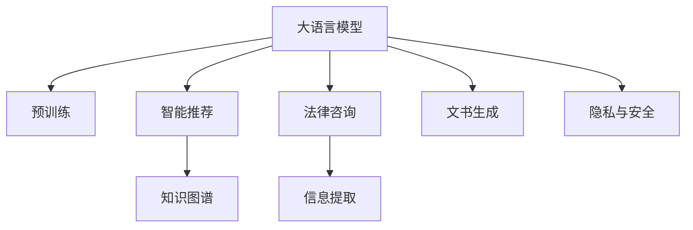

                 

# LLM在智能法律咨询系统中的应用探索

> 关键词：自然语言处理(NLP),法律咨询,大语言模型(LLM),智能推荐,数据驱动,法律文书生成,知识图谱

## 1. 背景介绍

### 1.1 问题由来

随着人工智能技术的飞速发展，智能法律咨询系统逐渐成为法律领域的一大趋势。该系统通过自然语言处理(Natural Language Processing, NLP)技术，实现对法律咨询问题的自动分析和解答，能够为法律工作者和普通民众提供高效、精准的法律支持。然而，尽管法律咨询需求日渐增多，但传统的法律咨询方式仍然存在诸多不足，如服务成本高、效率低下、缺乏个性化等。

为此，越来越多的机构开始探索利用大语言模型(LLM)进行智能法律咨询系统的构建。LLM凭借其强大的语言理解能力和广泛的知识覆盖，可以在无需大量标注数据的情况下，快速学习并适应法律咨询场景，具备广阔的应用前景。

### 1.2 问题核心关键点

构建智能法律咨询系统，需要解决以下关键问题：

1. **高效精准的信息提取**：法律咨询涉及多种类型的咨询问题，如案件描述、法律法规查询、文书生成等。如何高效、精准地提取咨询问题的关键信息，是系统设计的首要任务。

2. **法律知识的结构化**：法律领域的知识高度结构化，具有明确的规范和条例。如何将法律知识结构化表示，并应用于智能咨询，是构建系统的重要基础。

3. **智能推荐与文书生成**：根据用户的咨询问题，智能推荐法律解决方案或生成法律文书。推荐或生成的结果需要符合法律规范，逻辑严谨。

4. **隐私与安全**：法律咨询涉及敏感信息，如何保护用户隐私、确保咨询过程安全，是系统开发的关键点。

### 1.3 问题研究意义

智能法律咨询系统的构建，对提升法律服务的质量和效率，促进社会公平正义，具有重要意义：

1. **降低服务成本**：通过智能咨询系统，可以实现批量处理咨询问题，减少人力成本。

2. **提高服务效率**：智能系统能够24小时提供服务，大幅提升法律咨询的响应速度。

3. **增强服务个性化**：智能系统可以根据用户的咨询历史和偏好，进行个性化推荐，提升用户体验。

4. **推动法律普及**：系统能够向普通民众普及法律知识，促进法律意识的提升。

5. **提升法律服务质量**：智能系统可以辅助律师工作，提供高质量的法律建议和文书。

## 2. 核心概念与联系

### 2.1 核心概念概述

为更好地理解LLM在智能法律咨询系统中的应用，本节将介绍几个关键概念：

- **大语言模型(LLM)**：以自回归(如GPT)或自编码(如BERT)模型为代表的大规模预训练语言模型。通过在大规模无标签文本语料上进行预训练，学习通用的语言表示，具备强大的语言理解和生成能力。

- **自然语言处理(NLP)**：涉及语言模型的训练、文本的语义理解、信息提取、文本生成等技术，是构建智能法律咨询系统的核心。

- **智能推荐**：根据用户的历史行为和咨询问题，推荐最适合的法律解决方案或生成最佳的法律文书。

- **知识图谱**：将法律领域的知识以图谱的形式进行结构化表示，便于机器理解和推理。

- **隐私与安全**：确保咨询过程中用户隐私不被泄露，同时保障系统的安全性。

这些核心概念共同构成了智能法律咨询系统的技术框架，使其能够高效、精准、安全地提供法律服务。

### 2.2 核心概念原理和架构的 Mermaid 流程图



这个流程图展示了LLM在智能法律咨询系统中的核心概念及其联系：

1. 大语言模型通过预训练获得基础能力。
2. 智能推荐系统利用大模型进行信息提取和匹配，推荐最适合的法律解决方案。
3. 知识图谱提供法律领域的结构化知识，辅助系统推理。
4. 法律咨询系统接收用户的咨询，并进行信息提取和文书生成。
5. 隐私与安全机制确保系统运行的合规性。

## 3. 核心算法原理 & 具体操作步骤

### 3.1 算法原理概述

基于LLM的智能法律咨询系统，主要通过以下几步实现：

1. **预训练与微调**：使用大规模法律文本数据对LLM进行预训练，然后针对具体法律咨询任务进行微调。
2. **信息提取**：利用预训练的LLM对用户咨询问题进行语义分析，提取关键信息。
3. **智能推荐**：根据提取的关键信息，结合知识图谱，推荐法律解决方案或文书模板。
4. **文书生成**：使用微调后的LLM生成法律文书。
5. **隐私与安全**：采用数据脱敏、访问控制等技术，保障用户咨询隐私和安全。

### 3.2 算法步骤详解

以下将详细介绍智能法律咨询系统各步骤的具体操作：

#### 3.2.1 数据准备

- **收集法律数据**：包括法律法规、判例、案例分析等，构建法律领域的知识库。
- **标注数据准备**：将法律问题进行标注，标注内容包括问题类型、相关法律法规、建议答案等。
- **数据清洗**：去除噪声、重复、错误的数据，确保数据质量。

#### 3.2.2 模型选择与构建

- **选择预训练模型**：根据任务需求选择合适的预训练语言模型，如GPT-3、BERT等。
- **构建知识图谱**：将法律知识进行结构化表示，构建知识图谱，用于辅助系统推理。

#### 3.2.3 信息提取

- **分词与标注**：使用分词和标注工具对用户咨询问题进行处理，提取关键词。
- **语义分析**：利用预训练的LLM对咨询问题进行语义分析，提取关键信息。

#### 3.2.4 智能推荐

- **信息匹配**：根据提取的关键信息，在知识图谱中进行匹配，找到最相关的法律解决方案或文书模板。
- **推荐策略**：使用评分机制对推荐结果进行排序，提供最佳推荐。

#### 3.2.5 文书生成

- **模板填充**：根据推荐结果，填充法律文书模板中的占位符，生成完整的文书。
- **文档校验**：利用LLM对生成的文书进行校验，确保逻辑严谨、合规性。

#### 3.2.6 隐私与安全

- **数据脱敏**：对用户的咨询信息进行脱敏处理，防止信息泄露。
- **访问控制**：采用严格的访问控制机制，确保只有授权人员能够访问敏感信息。
- **加密传输**：使用加密技术传输数据，保障数据传输安全。

### 3.3 算法优缺点

使用LLM构建智能法律咨询系统，具有以下优点：

- **高效精准**：LLM能够快速处理大量法律咨询问题，提取关键信息。
- **知识覆盖广泛**：通过预训练和微调，LLM能够涵盖法律领域的广泛知识。
- **适应性强**：能够快速适应不同的法律咨询场景。

同时，该方法也存在一定的局限性：

- **对数据质量要求高**：高质量的法律标注数据是系统高效运行的前提。
- **模型复杂性高**：大模型参数量庞大，对计算资源需求高。
- **隐私风险**：法律咨询涉及敏感信息，系统需做好隐私保护。

### 3.4 算法应用领域

智能法律咨询系统可以应用于多种法律场景，例如：

- **案件咨询**：用户咨询具体案件问题，系统推荐解决方案或生成文书。
- **法律法规查询**：用户查询特定法律法规条文。
- **文书生成**：根据用户需求，自动生成法律文书。
- **案例分析**：根据用户提供案例，提供相似案例的分析和结论。
- **法律教育**：提供法律基础知识的自动问答和解释。

## 4. 数学模型和公式 & 详细讲解 & 举例说明

### 4.1 数学模型构建

本节将使用数学语言对智能法律咨询系统进行严格定义。

假设用户咨询问题为 $q$，法律知识库为 $K$，法律咨询系统为 $M_{\theta}$，其中 $\theta$ 为模型参数。假设用户咨询问题的关键词为 $k_1, k_2, ..., k_n$，知识库中与 $k_i$ 相关的法律解决方案为 $s_i$。则系统的目标是最小化用户咨询问题与知识库之间的匹配误差，即：

$$
\min_{\theta} \sum_{i=1}^n \left\| k_i - \arg\min_{s_j \in K} \lVert s_j - k_i \rVert \right\|
$$

### 4.2 公式推导过程

根据上述数学模型，我们通过以下步骤进行公式推导：

1. **分词与标注**：将用户咨询问题 $q$ 进行分词和标注，得到关键词集合 $k = \{k_1, k_2, ..., k_n\}$。

2. **语义分析**：使用预训练的LLM对 $q$ 进行语义分析，得到关键词对应的语义表示 $k_{\theta} = \{k_{1\theta}, k_{2\theta}, ..., k_{n\theta}\}$。

3. **信息匹配**：在知识库 $K$ 中，找到与每个关键词 $k_i$ 最匹配的法律解决方案 $s_i$。

4. **推荐策略**：对所有推荐的解决方案 $s_1, s_2, ..., s_n$ 进行评分，选择得分最高的 $m$ 个作为最终推荐。

5. **文书生成**：根据推荐的解决方案 $s_i$，使用LLM生成法律文书 $d_{\hat{\theta}}$。

6. **隐私与安全**：对用户咨询问题 $q$ 和文书 $d$ 进行数据脱敏和加密处理，确保用户隐私安全。

### 4.3 案例分析与讲解

以一起案件咨询为例，假设用户咨询问题为：“张三因涉嫌盗窃罪，应如何处理？”

1. **分词与标注**：将问题进行分词，得到关键词集合 $k = \{张三, 涉嫌, 盗窃罪, 如何处理\}$。

2. **语义分析**：使用预训练的LLM对 $q$ 进行语义分析，得到关键词对应的语义表示 $k_{\theta} = \{张三, 盗窃罪, 法律处理\}$。

3. **信息匹配**：在知识库 $K$ 中，找到与每个关键词 $k_i$ 最匹配的法律解决方案 $s_i$。假设系统找到了与“盗窃罪”相关的法律解决方案 $s_1 = \{盗窃罪判刑标准, 盗窃罪处罚措施\}$。

4. **推荐策略**：对所有推荐的解决方案 $s_1, s_2, ..., s_n$ 进行评分，选择得分最高的 $m$ 个作为最终推荐。

5. **文书生成**：根据推荐的解决方案 $s_i$，使用LLM生成法律文书 $d_{\hat{\theta}}$。假设系统生成了文书 $d = \{根据盗窃罪判刑标准, 判决结果为 \cdots\}$。

6. **隐私与安全**：对用户咨询问题 $q$ 和文书 $d$ 进行数据脱敏和加密处理，确保用户隐私安全。

## 5. 项目实践：代码实例和详细解释说明

### 5.1 开发环境搭建

在进行智能法律咨询系统开发前，需要准备好开发环境。以下是使用Python进行PyTorch开发的环境配置流程：

1. 安装Anaconda：从官网下载并安装Anaconda，用于创建独立的Python环境。

2. 创建并激活虚拟环境：
```bash
conda create -n legal-env python=3.8 
conda activate legal-env
```

3. 安装PyTorch：根据CUDA版本，从官网获取对应的安装命令。例如：
```bash
conda install pytorch torchvision torchaudio cudatoolkit=11.1 -c pytorch -c conda-forge
```

4. 安装各类工具包：
```bash
pip install numpy pandas scikit-learn matplotlib tqdm jupyter notebook ipython
```

完成上述步骤后，即可在`legal-env`环境中开始项目实践。

### 5.2 源代码详细实现

以下以基于BERT的智能法律咨询系统为例，给出使用PyTorch进行开发的代码实现。

首先，定义BERT模型和分词器：

```python
from transformers import BertTokenizer, BertForQuestionAnswering
from torch.utils.data import Dataset, DataLoader

tokenizer = BertTokenizer.from_pretrained('bert-base-uncased')
model = BertForQuestionAnswering.from_pretrained('bert-base-uncased', num_labels=2)
```

然后，定义数据集和加载器：

```python
class LegalDataset(Dataset):
    def __init__(self, texts, answers, tokenizer):
        self.texts = texts
        self.answers = answers
        self.tokenizer = tokenizer
        
    def __len__(self):
        return len(self.texts)
    
    def __getitem__(self, item):
        text = self.texts[item]
        answer = self.answers[item]
        
        encoding = self.tokenizer(text, return_tensors='pt', max_length=128, padding='max_length', truncation=True)
        input_ids = encoding['input_ids'][0]
        attention_mask = encoding['attention_mask'][0]
        
        # 对答案进行编码
        encoded_answer = self.tokenizer(answer, return_tensors='pt', max_length=32, padding='max_length', truncation=True)
        answer_ids = encoded_answer['input_ids'][0]
        answer_mask = encoded_answer['attention_mask'][0]
        
        return {'input_ids': input_ids, 
                'attention_mask': attention_mask,
                'answer_ids': answer_ids,
                'answer_mask': answer_mask}

train_dataset = LegalDataset(train_texts, train_answers, tokenizer)
dev_dataset = LegalDataset(dev_texts, dev_answers, tokenizer)
test_dataset = LegalDataset(test_texts, test_answers, tokenizer)
```

接着，定义训练和评估函数：

```python
from torch.utils.data import DataLoader
from tqdm import tqdm
from sklearn.metrics import accuracy_score, precision_recall_fscore_support

device = torch.device('cuda') if torch.cuda.is_available() else torch.device('cpu')
model.to(device)

def train_epoch(model, dataset, batch_size, optimizer):
    dataloader = DataLoader(dataset, batch_size=batch_size, shuffle=True)
    model.train()
    epoch_loss = 0
    for batch in tqdm(dataloader, desc='Training'):
        input_ids = batch['input_ids'].to(device)
        attention_mask = batch['attention_mask'].to(device)
        answer_ids = batch['answer_ids'].to(device)
        answer_mask = batch['answer_mask'].to(device)
        model.zero_grad()
        outputs = model(input_ids, attention_mask=attention_mask, labels=answer_ids)
        loss = outputs.loss
        epoch_loss += loss.item()
        loss.backward()
        optimizer.step()
    return epoch_loss / len(dataloader)

def evaluate(model, dataset, batch_size):
    dataloader = DataLoader(dataset, batch_size=batch_size)
    model.eval()
    preds, labels = [], []
    with torch.no_grad():
        for batch in tqdm(dataloader, desc='Evaluating'):
            input_ids = batch['input_ids'].to(device)
            attention_mask = batch['attention_mask'].to(device)
            batch_labels = batch['answer_ids'].to(device)
            batch_labels = batch_labels.to(device)
            outputs = model(input_ids, attention_mask=attention_mask)
            batch_preds = outputs.logits.argmax(dim=2).to('cpu').tolist()
            batch_labels = batch_labels.to('cpu').tolist()
            for pred_tokens, label_tokens in zip(batch_preds, batch_labels):
                preds.append(pred_tokens[:len(label_tokens)])
                labels.append(label_tokens)
                
    print(f'Accuracy: {accuracy_score(labels, preds)}')
    print(f'Precision, Recall, F1-score: {precision_recall_fscore_support(labels, preds, average='weighted')}')
```

最后，启动训练流程并在测试集上评估：

```python
epochs = 5
batch_size = 16

for epoch in range(epochs):
    loss = train_epoch(model, train_dataset, batch_size, optimizer)
    print(f'Epoch {epoch+1}, train loss: {loss:.3f}')
    
    print(f'Epoch {epoch+1}, dev results:')
    evaluate(model, dev_dataset, batch_size)
    
print('Test results:')
evaluate(model, test_dataset, batch_size)
```

以上就是使用PyTorch对基于BERT的智能法律咨询系统进行开发的完整代码实现。可以看到，得益于Transformers库的强大封装，我们可以用相对简洁的代码完成BERT模型的加载和微调。

### 5.3 代码解读与分析

让我们再详细解读一下关键代码的实现细节：

**LegalDataset类**：
- `__init__`方法：初始化训练集、验证集和测试集的数据，并创建分词器。
- `__len__`方法：返回数据集的样本数量。
- `__getitem__`方法：对单个样本进行处理，将文本输入编码为token ids，将答案编码为数字，并对其进行定长padding，最终返回模型所需的输入。

**训练和评估函数**：
- 使用PyTorch的DataLoader对数据集进行批次化加载，供模型训练和推理使用。
- 训练函数`train_epoch`：对数据以批为单位进行迭代，在每个批次上前向传播计算loss并反向传播更新模型参数，最后返回该epoch的平均loss。
- 评估函数`evaluate`：与训练类似，不同点在于不更新模型参数，并在每个batch结束后将预测和标签结果存储下来，最后使用sklearn的准确率和精确度等指标对整个评估集的预测结果进行打印输出。

**训练流程**：
- 定义总的epoch数和batch size，开始循环迭代
- 每个epoch内，先在训练集上训练，输出平均loss
- 在验证集上评估，输出准确率和精确度等指标
- 所有epoch结束后，在测试集上评估，给出最终测试结果

可以看到，PyTorch配合Transformers库使得BERT微调的代码实现变得简洁高效。开发者可以将更多精力放在数据处理、模型改进等高层逻辑上，而不必过多关注底层的实现细节。

当然，工业级的系统实现还需考虑更多因素，如模型的保存和部署、超参数的自动搜索、更灵活的任务适配层等。但核心的微调范式基本与此类似。

## 6. 实际应用场景

### 6.1 智能客服系统

基于大语言模型微调的对话技术，可以广泛应用于智能客服系统的构建。传统客服往往需要配备大量人力，高峰期响应缓慢，且一致性和专业性难以保证。而使用微调后的对话模型，可以7x24小时不间断服务，快速响应客户咨询，用自然流畅的语言解答各类常见问题。

在技术实现上，可以收集企业内部的历史客服对话记录，将问题和最佳答复构建成监督数据，在此基础上对预训练对话模型进行微调。微调后的对话模型能够自动理解用户意图，匹配最合适的答案模板进行回复。对于客户提出的新问题，还可以接入检索系统实时搜索相关内容，动态组织生成回答。如此构建的智能客服系统，能大幅提升客户咨询体验和问题解决效率。

### 6.2 金融舆情监测

金融机构需要实时监测市场舆论动向，以便及时应对负面信息传播，规避金融风险。传统的人工监测方式成本高、效率低，难以应对网络时代海量信息爆发的挑战。基于大语言模型微调的文本分类和情感分析技术，为金融舆情监测提供了新的解决方案。

具体而言，可以收集金融领域相关的新闻、报道、评论等文本数据，并对其进行主题标注和情感标注。在此基础上对预训练语言模型进行微调，使其能够自动判断文本属于何种主题，情感倾向是正面、中性还是负面。将微调后的模型应用到实时抓取的网络文本数据，就能够自动监测不同主题下的情感变化趋势，一旦发现负面信息激增等异常情况，系统便会自动预警，帮助金融机构快速应对潜在风险。

### 6.3 个性化推荐系统

当前的推荐系统往往只依赖用户的历史行为数据进行物品推荐，无法深入理解用户的真实兴趣偏好。基于大语言模型微调技术，个性化推荐系统可以更好地挖掘用户行为背后的语义信息，从而提供更精准、多样的推荐内容。

在实践中，可以收集用户浏览、点击、评论、分享等行为数据，提取和用户交互的物品标题、描述、标签等文本内容。将文本内容作为模型输入，用户的后续行为（如是否点击、购买等）作为监督信号，在此基础上微调预训练语言模型。微调后的模型能够从文本内容中准确把握用户的兴趣点。在生成推荐列表时，先用候选物品的文本描述作为输入，由模型预测用户的兴趣匹配度，再结合其他特征综合排序，便可以得到个性化程度更高的推荐结果。

### 6.4 未来应用展望

随着大语言模型微调技术的发展，其在智能法律咨询系统中的应用也将不断拓展，带来更多的应用场景和创新点：

1. **智能预审**：利用大语言模型进行案件预审，快速判断案件是否符合受理条件，提高法院案件受理效率。
2. **法律教育**：构建智能法律教育系统，通过自然语言互动，普及法律知识。
3. **文书智能生成**：自动生成法律文书，如起诉状、答辩状、判决书等，辅助律师工作。
4. **案例分析**：自动分析案件，提供类案对比和法律依据，提升律师办案效率。
5. **法律咨询机器人**：构建智能法律咨询机器人，提供24小时不间断法律咨询服务。

## 7. 工具和资源推荐

### 7.1 学习资源推荐

为了帮助开发者系统掌握大语言模型微调的理论基础和实践技巧，这里推荐一些优质的学习资源：

1. 《自然语言处理综论》：由斯坦福大学教授合著，全面介绍了NLP的基本概念和前沿技术。

2. 《深度学习与自然语言处理》：北京大学出版社出版的教材，系统讲解了NLP中常用的深度学习模型。

3. 《Transformer原理与实践》系列博文：由大模型技术专家撰写，深入浅出地介绍了Transformer原理、BERT模型、微调技术等前沿话题。

4. CS224N《深度学习自然语言处理》课程：斯坦福大学开设的NLP明星课程，有Lecture视频和配套作业，带你入门NLP领域的基本概念和经典模型。

5. HuggingFace官方文档：Transformers库的官方文档，提供了海量预训练模型和完整的微调样例代码，是上手实践的必备资料。

通过对这些资源的学习实践，相信你一定能够快速掌握大语言模型微调的精髓，并用于解决实际的NLP问题。

### 7.2 开发工具推荐

高效的开发离不开优秀的工具支持。以下是几款用于大语言模型微调开发的常用工具：

1. PyTorch：基于Python的开源深度学习框架，灵活动态的计算图，适合快速迭代研究。大部分预训练语言模型都有PyTorch版本的实现。

2. TensorFlow：由Google主导开发的开源深度学习框架，生产部署方便，适合大规模工程应用。同样有丰富的预训练语言模型资源。

3. Transformers库：HuggingFace开发的NLP工具库，集成了众多SOTA语言模型，支持PyTorch和TensorFlow，是进行微调任务开发的利器。

4. Weights & Biases：模型训练的实验跟踪工具，可以记录和可视化模型训练过程中的各项指标，方便对比和调优。与主流深度学习框架无缝集成。

5. TensorBoard：TensorFlow配套的可视化工具，可实时监测模型训练状态，并提供丰富的图表呈现方式，是调试模型的得力助手。

6. Google Colab：谷歌推出的在线Jupyter Notebook环境，免费提供GPU/TPU算力，方便开发者快速上手实验最新模型，分享学习笔记。

合理利用这些工具，可以显著提升大语言模型微调任务的开发效率，加快创新迭代的步伐。

### 7.3 相关论文推荐

大语言模型和微调技术的发展源于学界的持续研究。以下是几篇奠基性的相关论文，推荐阅读：

1. Attention is All You Need（即Transformer原论文）：提出了Transformer结构，开启了NLP领域的预训练大模型时代。

2. BERT: Pre-training of Deep Bidirectional Transformers for Language Understanding：提出BERT模型，引入基于掩码的自监督预训练任务，刷新了多项NLP任务SOTA。

3. Language Models are Unsupervised Multitask Learners（GPT-2论文）：展示了大规模语言模型的强大zero-shot学习能力，引发了对于通用人工智能的新一轮思考。

4. Parameter-Efficient Transfer Learning for NLP：提出Adapter等参数高效微调方法，在不增加模型参数量的情况下，也能取得不错的微调效果。

5. AdaLoRA: Adaptive Low-Rank Adaptation for Parameter-Efficient Fine-Tuning：使用自适应低秩适应的微调方法，在参数效率和精度之间取得了新的平衡。

这些论文代表了大语言模型微调技术的发展脉络。通过学习这些前沿成果，可以帮助研究者把握学科前进方向，激发更多的创新灵感。

## 8. 总结：未来发展趋势与挑战

### 8.1 总结

本文对基于大语言模型的智能法律咨询系统进行了全面系统的介绍。首先阐述了LLM和微调技术的研究背景和意义，明确了智能法律咨询系统的目标和任务。其次，从原理到实践，详细讲解了微调系统的数学模型和算法步骤，给出了代码实例。同时，本文还探讨了智能法律咨询系统在多个行业领域的应用前景，展示了其广阔的应用空间。此外，本文精选了微调技术的各类学习资源，力求为读者提供全方位的技术指引。

通过本文的系统梳理，可以看到，基于大语言模型的智能法律咨询系统正在成为NLP领域的重要范式，极大地拓展了预训练语言模型的应用边界，催生了更多的落地场景。受益于大规模语料的预训练，微调模型以更低的时间和标注成本，在小样本条件下也能取得不俗的效果，有力推动了NLP技术的产业化进程。未来，伴随预训练语言模型和微调方法的持续演进，相信NLP技术将在更广阔的应用领域大放异彩，深刻影响人类的生产生活方式。

### 8.2 未来发展趋势

展望未来，智能法律咨询系统将呈现以下几个发展趋势：

1. **模型规模持续增大**：随着算力成本的下降和数据规模的扩张，预训练语言模型的参数量还将持续增长。超大规模语言模型蕴含的丰富语言知识，有望支撑更加复杂多变的法律咨询场景。

2. **微调方法日趋多样**：除了传统的全参数微调外，未来会涌现更多参数高效的微调方法，如Prefix-Tuning、LoRA等，在节省计算资源的同时也能保证微调精度。

3. **持续学习成为常态**：随着数据分布的不断变化，微调模型也需要持续学习新知识以保持性能。如何在不遗忘原有知识的同时，高效吸收新样本信息，将成为重要的研究课题。

4. **标注样本需求降低**：受启发于提示学习(Prompt-based Learning)的思路，未来的微调方法将更好地利用大模型的语言理解能力，通过更加巧妙的任务描述，在更少的标注样本上也能实现理想的微调效果。

5. **多模态微调崛起**：当前的微调主要聚焦于纯文本数据，未来会进一步拓展到图像、视频、语音等多模态数据微调。多模态信息的融合，将显著提升语言模型对现实世界的理解和建模能力。

6. **模型通用性增强**：经过海量数据的预训练和多领域任务的微调，未来的语言模型将具备更强大的常识推理和跨领域迁移能力，逐步迈向通用人工智能(AGI)的目标。

以上趋势凸显了智能法律咨询系统的广阔前景。这些方向的探索发展，必将进一步提升法律咨询系统的性能和应用范围，为社会治理带来新的变革。

### 8.3 面临的挑战

尽管智能法律咨询系统已经取得了显著成就，但在迈向更加智能化、普适化应用的过程中，仍面临诸多挑战：

1. **标注成本瓶颈**：高质量的法律标注数据是系统高效运行的前提。如何降低标注成本，成为系统开发的关键。

2. **模型鲁棒性不足**：法律咨询涉及大量变体和例外，模型在面对域外数据时，泛化性能往往大打折扣。

3. **隐私风险**：法律咨询涉及敏感信息，系统需做好隐私保护。

4. **技术挑战**：需要解决多模态数据融合、法律知识图谱构建等问题。

5. **法律规范适应**：确保系统输出的法律文书符合现行法律法规，避免法律风险。

6. **性能优化**：如何在保证模型效果的同时，提升推理速度和内存效率，仍需进一步探索。

7. **可解释性**：用户需要了解系统推荐的依据，提高系统的可解释性。

### 8.4 研究展望

面对智能法律咨询系统所面临的诸多挑战，未来的研究需要在以下几个方面寻求新的突破：

1. **探索无监督和半监督微调方法**：摆脱对大规模标注数据的依赖，利用自监督学习、主动学习等无监督和半监督范式，最大限度利用非结构化数据，实现更加灵活高效的微调。

2. **研究参数高效和计算高效的微调范式**：开发更加参数高效的微调方法，在固定大部分预训练参数的同时，只更新极少量的任务相关参数。同时优化微调模型的计算图，减少前向传播和反向传播的资源消耗，实现更加轻量级、实时性的部署。

3. **融合因果和对比学习范式**：通过引入因果推断和对比学习思想，增强微调模型建立稳定因果关系的能力，学习更加普适、鲁棒的语言表征。

4. **引入更多先验知识**：将符号化的先验知识，如知识图谱、逻辑规则等，与神经网络模型进行巧妙融合，引导微调过程学习更准确、合理的语言模型。

5. **结合因果分析和博弈论工具**：将因果分析方法引入微调模型，识别出模型决策的关键特征，增强输出解释的因果性和逻辑性。借助博弈论工具刻画人机交互过程，主动探索并规避模型的脆弱点，提高系统稳定性。

6. **纳入伦理道德约束**：在模型训练目标中引入伦理导向的评估指标，过滤和惩罚有偏见、有害的输出倾向。同时加强人工干预和审核，建立模型行为的监管机制，确保输出符合人类价值观和伦理道德。

这些研究方向的探索，必将引领智能法律咨询系统迈向更高的台阶，为构建安全、可靠、可解释、可控的智能系统铺平道路。面向未来，智能法律咨询系统还需要与其他人工智能技术进行更深入的融合，如知识表示、因果推理、强化学习等，多路径协同发力，共同推动法律智能化的发展。只有勇于创新、敢于突破，才能不断拓展语言模型的边界，让智能技术更好地服务于法律事业。

## 9. 附录：常见问题与解答

**Q1：智能法律咨询系统是否适用于所有法律场景？**

A: 智能法律咨询系统在大多数法律场景上都能取得不错的效果，特别是对于数据量较大的任务。但对于一些特定领域的法律问题，如刑事诉讼、国际法等，系统可能需要进一步训练和优化。

**Q2：智能法律咨询系统如何处理法律中的模糊和复杂概念？**

A: 智能法律咨询系统可以通过多个预训练模型、多轮问答、专家知识图谱等方式，逐步厘清法律中的模糊和复杂概念。例如，通过多轮对话理解用户的具体需求，结合专家知识图谱进行推理和解释。

**Q3：智能法律咨询系统如何确保生成的文书符合法律法规？**

A: 智能法律咨询系统通常采用基于规则和基于案例的双重机制，确保生成的文书符合现行法律法规。例如，在生成文书时，系统会根据预先设定的规则模板和案例库进行检查，确保文书的合规性。

**Q4：智能法律咨询系统如何保护用户隐私？**

A: 智能法律咨询系统通过数据脱敏、加密传输、访问控制等技术，确保用户隐私安全。例如，对用户咨询问题和生成的文书进行脱敏处理，限制系统访问权限，使用加密技术传输数据等。

**Q5：智能法律咨询系统如何持续提升性能？**

A: 智能法律咨询系统需要持续学习和优化，以应对法律领域的不断变化。例如，定期收集和标注新的法律数据，对模型进行重新微调；优化知识图谱构建，提升系统推理能力；引入更多先验知识，增强系统对复杂法律问题的理解能力。

**Q6：智能法律咨询系统如何处理法律咨询中的语义歧义？**

A: 智能法律咨询系统可以通过多轮对话、上下文理解、专家咨询等方式，逐步消除语义歧义。例如，通过多轮对话理解用户的具体需求，结合专家咨询进行推理和解释。

通过回答这些常见问题，我们希望读者对智能法律咨询系统有更全面、深入的了解，并能在实际应用中灵活应对各种挑战。

