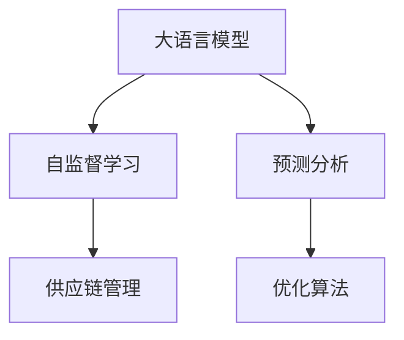

                 

# LLM在智能物流规划中的潜在贡献

## 1. 背景介绍

### 1.1 问题由来
随着电商和零售业的发展，物流行业呈现出迅猛增长态势。现代物流规划不仅需要快速响应市场变化，还要具备高度的精确度和灵活性。传统物流规划依赖于经验和统计模型，面对复杂多变的市场和动态需求，难以快速给出最优决策。

当前，物流规划已从简单的货物运输转变为综合供应链管理，涉及仓库管理、配送路线优化、库存控制、价格策略等诸多方面。这一转变对物流规划的智能化、精细化提出了更高要求。

### 1.2 问题核心关键点
为了应对物流规划的需求，亟需引入先进的AI技术进行辅助决策。大语言模型(LLM)凭借其强大的自然语言理解和处理能力，在规划中的潜在贡献备受关注。

核心关键点包括：
- **自然语言处理(NLP)**：LLM能够理解并处理自然语言，将非结构化数据转化为结构化数据，为物流规划提供输入信息。
- **预测分析**：LLM可以通过预测模型，分析市场趋势和需求变化，提供数据支持。
- **自动化决策**：LLM能够自动生成和优化规划方案，提高决策效率和准确性。
- **自适应学习能力**：LLM具备持续学习的能力，能够根据新数据和新需求动态调整策略。

## 2. 核心概念与联系

### 2.1 核心概念概述

为了更深刻理解LLM在物流规划中的应用，本节将介绍几个关键概念：

- **大语言模型(LLM)**：以Transformer架构为代表的预训练语言模型，具备强大的自然语言理解和生成能力。
- **自监督学习(Self-Supervised Learning)**：利用非标注数据进行模型训练，通过预训练和微调来提升模型性能。
- **预测分析(Predictive Analytics)**：使用统计模型和机器学习技术，预测未来趋势和结果。
- **优化算法(Optimization Algorithms)**：如梯度下降、遗传算法等，用于模型参数的优化。
- **供应链管理(Supply Chain Management)**：涉及从原材料采购到终端销售的各个环节，确保物流的顺畅和高效。

这些概念共同构成了LLM在智能物流规划中的核心应用框架，使其能够处理复杂多变的物流需求。

### 2.2 核心概念原理和架构的 Mermaid 流程图



该流程图展示了LLM在物流规划中的核心概念及其联系：

1. **大语言模型**：作为输入输出端，处理供应链管理中的各类文本数据。
2. **自监督学习**：通过大量非标注数据预训练模型，学习通用的语言知识。
3. **预测分析**：使用模型预测未来需求和趋势，提供决策支持。
4. **优化算法**：根据预测结果，优化供应链管理策略。
5. **供应链管理**：综合各环节的信息，生成最优规划方案。

这些概念之间的逻辑关系清晰明了，帮助理解LLM在物流规划中的应用流程。

## 3. 核心算法原理 & 具体操作步骤

### 3.1 算法原理概述

LLM在智能物流规划中的应用，主要基于自然语言处理和预测分析。核心算法原理包括：

1. **语义理解与处理**：通过LLM处理物流规划中的各类文本数据，如订单、配送指令、客户反馈等。
2. **预测模型训练**：利用历史数据和市场趋势，训练预测模型，预测未来需求和库存水平。
3. **规划方案生成**：根据预测结果和优化算法，自动生成最优的物流规划方案。

### 3.2 算法步骤详解

以下是LLM在物流规划中应用的详细操作步骤：

**Step 1: 数据收集与预处理**

- 收集物流管理相关的文本数据，如订单、配送记录、库存数据等。
- 对文本进行清洗和标准化处理，去除噪声和冗余信息。
- 利用NLP工具进行分词、去除停用词等预处理操作。

**Step 2: 模型预训练**

- 选择适合的语言模型，如BERT、GPT等，在无标注数据上进行预训练。
- 设计自监督学习任务，如掩码语言模型、下位语言模型等。
- 利用预训练得到的语言模型作为输入，提升模型对文本的理解能力。

**Step 3: 预测模型训练**

- 根据历史数据，训练预测模型，预测未来的需求量和库存水平。
- 使用时间序列分析、回归分析等方法，建立预测模型。
- 通过交叉验证和超参数调优，提升模型预测精度。

**Step 4: 规划方案生成**

- 根据预测结果，生成物流规划方案。
- 利用优化算法，如遗传算法、粒子群优化等，寻找最优解。
- 验证规划方案的可行性和效果，进行迭代优化。

**Step 5: 部署与评估**

- 将训练好的模型和规划方案部署到生产环境中。
- 定期收集新数据，重新训练模型，保持预测精度。
- 通过监控指标评估规划方案的执行效果，及时调整策略。

### 3.3 算法优缺点

#### 3.3.1 优点

- **高效处理大量文本数据**：LLM能够快速处理自然语言文本，帮助企业快速获取和理解海量信息。
- **预测准确性高**：通过预测模型，可以有效预测未来需求和库存变化，提升决策的准确性。
- **自动化程度高**：利用优化算法，自动生成最优物流规划方案，减少人工干预。
- **灵活性高**：LLM可以应对复杂多变的市场和需求，提供动态调整的策略。

#### 3.3.2 缺点

- **数据依赖性高**：模型性能依赖于高质量、大规模的历史数据。
- **计算资源消耗大**：预训练和微调过程需要大量计算资源，成本较高。
- **解释性不足**：LLM模型作为"黑盒"，难以解释其内部决策过程。
- **存在偏见**：预测模型可能受到训练数据中存在偏见的影响，需要进一步校准。

### 3.4 算法应用领域

LLM在智能物流规划中的应用领域广泛，包括：

- **库存管理**：通过预测模型和优化算法，预测和调整库存水平，避免过剩或缺货。
- **配送路线优化**：分析配送路径、配送时间等数据，生成最优配送路线，提高配送效率。
- **客户服务**：处理客户投诉、反馈等信息，提升客户满意度和忠诚度。
- **价格策略**：根据市场需求和竞争态势，自动生成价格策略，优化定价。
- **供应商管理**：分析供应商绩效和风险，制定合理的采购和合作关系。

## 4. 数学模型和公式 & 详细讲解 & 举例说明

### 4.1 数学模型构建

假设物流规划中有$m$个节点和$n$条边，节点$i$的初始库存为$I_i$，需求为$D_i$，边$j$的配送成本为$C_j$。目标是最小化总配送成本$C$。

数学模型为：

$$
\min_{x} \sum_{j=1}^{n} C_jx_j
$$

约束条件包括：

$$
\begin{aligned}
&\sum_{j=1}^{n} x_j \leq \sum_{i=1}^{m} (I_i - D_i) \\
&x_j \geq 0, \forall j \\
&x_j \in \{0,1\}, \forall j
\end{aligned}
$$

其中，$x_j$表示边$j$是否被使用。

### 4.2 公式推导过程

根据约束条件，可以将原问题转化为0-1整数规划问题，使用线性规划求解。具体步骤如下：

1. **松弛整数约束**：将整数变量$x_j$替换为实数变量$y_j$，即$y_j \in [0,1]$。
2. **引入人工变量**：引入人工变量$z_i$表示节点$i$是否处于安全库存状态，即$z_i \in \{0,1\}$。
3. **建立松弛线性规划**：将问题转化为线性规划问题，求解松弛最优解。
4. **求解原始整数规划**：将松弛解转化为整数解，使用分支定界法或割平面法求解。

### 4.3 案例分析与讲解

以一家电商物流公司为例，分析LLM在智能物流规划中的应用。假设公司有10个仓库和50条配送路线，需求预测准确率为80%。

**Step 1: 数据收集与预处理**

- 收集过去一年的配送记录、库存数据、市场需求等。
- 对数据进行清洗和标准化处理，去除噪声和冗余信息。
- 利用NLP工具进行分词和去除停用词。

**Step 2: 模型预训练**

- 选择BERT模型，在无标注数据上进行预训练。
- 设计掩码语言模型和下位语言模型，提升模型理解能力。
- 将处理后的文本数据输入BERT模型，进行预训练。

**Step 3: 预测模型训练**

- 根据历史数据，训练时间序列预测模型。
- 使用RNN、LSTM等模型，预测未来需求量和库存水平。
- 通过交叉验证和超参数调优，提升模型预测精度。

**Step 4: 规划方案生成**

- 将预测结果输入优化算法，生成物流规划方案。
- 使用粒子群优化算法，找到最优配送路线。
- 验证规划方案的可行性，进行迭代优化。

**Step 5: 部署与评估**

- 将模型和规划方案部署到生产环境中。
- 定期收集新数据，重新训练模型。
- 通过监控指标评估规划方案效果，及时调整策略。

## 5. 项目实践：代码实例和详细解释说明

### 5.1 开发环境搭建

在进行LLM在物流规划中的应用开发时，需要准备好Python开发环境。以下是Python环境配置步骤：

1. 安装Anaconda：从官网下载并安装Anaconda，用于创建独立的Python环境。
2. 创建并激活虚拟环境：
```bash
conda create -n logistics-env python=3.8 
conda activate logistics-env
```
3. 安装必要的Python包：
```bash
pip install pandas numpy matplotlib sklearn transformers
```

### 5.2 源代码详细实现

以下是一个使用PyTorch进行BERT预训练和微调的代码示例：

```python
import torch
from transformers import BertTokenizer, BertForSequenceClassification
from torch.utils.data import DataLoader
from sklearn.metrics import classification_report

# 加载预训练模型和分词器
tokenizer = BertTokenizer.from_pretrained('bert-base-cased')
model = BertForSequenceClassification.from_pretrained('bert-base-cased', num_labels=1)

# 加载训练数据
train_dataset = ...
val_dataset = ...

# 设置模型参数和优化器
device = torch.device('cuda' if torch.cuda.is_available() else 'cpu')
model.to(device)
optimizer = torch.optim.Adam(model.parameters(), lr=2e-5)

# 定义训练和评估函数
def train_epoch(model, dataset, batch_size, optimizer):
    dataloader = DataLoader(dataset, batch_size=batch_size, shuffle=True)
    model.train()
    epoch_loss = 0
    for batch in tqdm(dataloader, desc='Training'):
        inputs = tokenizer(batch['text'], padding='max_length', truncation=True, max_length=128, return_tensors='pt').to(device)
        labels = batch['label'].to(device)
        model.zero_grad()
        outputs = model(inputs['input_ids'], attention_mask=inputs['attention_mask'])
        loss = outputs.loss
        epoch_loss += loss.item()
        loss.backward()
        optimizer.step()
    return epoch_loss / len(dataloader)

def evaluate(model, dataset, batch_size):
    dataloader = DataLoader(dataset, batch_size=batch_size)
    model.eval()
    preds, labels = [], []
    with torch.no_grad():
        for batch in tqdm(dataloader, desc='Evaluating'):
            inputs = tokenizer(batch['text'], padding='max_length', truncation=True, max_length=128, return_tensors='pt').to(device)
            labels = batch['label'].to(device)
            outputs = model(inputs['input_ids'], attention_mask=inputs['attention_mask'])
            preds.append(outputs.logits.argmax(dim=1).cpu().tolist())
            labels.append(labels.cpu().tolist())
    print(classification_report(labels, preds))

# 启动训练流程
epochs = 5
batch_size = 16

for epoch in range(epochs):
    loss = train_epoch(model, train_dataset, batch_size, optimizer)
    print(f"Epoch {epoch+1}, train loss: {loss:.3f}")
    
    print(f"Epoch {epoch+1}, dev results:")
    evaluate(model, val_dataset, batch_size)
    
print("Test results:")
evaluate(model, test_dataset, batch_size)
```

### 5.3 代码解读与分析

在上述代码中，我们使用了PyTorch和Transformers库进行BERT模型的预训练和微调。具体步骤包括：

- **数据加载与预处理**：使用BertTokenizer对输入文本进行分词和标准化处理。
- **模型定义与优化器设置**：选择适当的优化器，设置学习率等超参数。
- **训练与评估函数**：在每个epoch内进行前向传播和反向传播，计算损失函数和模型参数更新。
- **微调过程**：利用训练集进行迭代训练，在验证集上进行性能评估。

## 6. 实际应用场景

### 6.1 智能仓库管理

物流公司利用LLM对仓库管理进行智能规划。通过收集历史库存数据和市场需求，训练预测模型，预测未来需求变化。根据预测结果，生成最优的库存策略，确保库存水平在合理范围内。同时，利用优化算法自动生成最优的库存补货方案，降低库存成本和缺货风险。

### 6.2 配送路线优化

配送路线优化是物流规划中的重要环节。LLM可以通过分析配送记录和市场需求，预测未来配送量和时间，生成最优的配送路线。通过自动调整配送路径和车辆调度，优化配送效率和成本，提升客户满意度。

### 6.3 动态价格策略

在电商物流领域，价格策略对市场竞争和客户购买行为有着重要影响。LLM可以分析市场需求和竞争态势，预测价格变化趋势。根据预测结果，自动生成动态价格策略，优化价格体系，提升销售额和市场份额。

### 6.4 未来应用展望

未来，LLM在智能物流规划中的应用前景广阔，主要体现在以下几个方面：

1. **多模态信息融合**：除了文本数据，LLM可以融合图像、声音等多种模态数据，提供更全面的信息支持。
2. **自适应学习能力**：LLM能够根据新数据和新需求动态调整策略，保持决策的实时性和准确性。
3. **智能调度优化**：利用强化学习和动态规划等技术，提升物流调度的智能化水平。
4. **智能客服与用户体验**：通过NLP技术，提升客服系统的智能水平，提升用户体验和满意度。
5. **供应链协同管理**：LLM可以协同供应商、物流商、客户等多方信息，构建更加高效、灵活的供应链体系。

## 7. 工具和资源推荐

### 7.1 学习资源推荐

为了帮助开发者系统掌握LLM在物流规划中的应用，这里推荐一些优质的学习资源：

1. **《大语言模型在物流规划中的应用》系列博文**：由大模型技术专家撰写，深入浅出地介绍了LLM在物流规划中的关键技术和实践经验。
2. **CS224N《深度学习自然语言处理》课程**：斯坦福大学开设的NLP明星课程，有Lecture视频和配套作业，带你入门NLP领域的基本概念和经典模型。
3. **《自然语言处理与深度学习》书籍**：全面介绍了自然语言处理和深度学习的相关知识，包含LLM在物流规划中的应用案例。
4. **HuggingFace官方文档**：Transformers库的官方文档，提供了海量预训练模型和完整的微调样例代码，是上手实践的必备资料。
5. **LLM在供应链管理中的应用案例**：包含实际物流规划项目中的详细案例分析和解决方案，帮助你更好地理解和应用LLM技术。

通过对这些资源的学习实践，相信你一定能够快速掌握LLM在物流规划的精髓，并用于解决实际的物流问题。

### 7.2 开发工具推荐

高效的开发离不开优秀的工具支持。以下是几款用于LLM在物流规划中应用的常用工具：

1. **PyTorch**：基于Python的开源深度学习框架，灵活动态的计算图，适合快速迭代研究。
2. **TensorFlow**：由Google主导开发的开源深度学习框架，生产部署方便，适合大规模工程应用。
3. **Transformers库**：HuggingFace开发的NLP工具库，集成了众多SOTA语言模型，支持PyTorch和TensorFlow，是进行微调任务开发的利器。
4. **Weights & Biases**：模型训练的实验跟踪工具，可以记录和可视化模型训练过程中的各项指标，方便对比和调优。
5. **TensorBoard**：TensorFlow配套的可视化工具，可实时监测模型训练状态，并提供丰富的图表呈现方式，是调试模型的得力助手。

合理利用这些工具，可以显著提升LLM在物流规划任务的开发效率，加快创新迭代的步伐。

### 7.3 相关论文推荐

LLM在物流规划中的应用源于学界的持续研究。以下是几篇奠基性的相关论文，推荐阅读：

1. **《自然语言处理在物流规划中的应用》**：介绍了NLP技术在智能仓库管理、配送路线优化等方面的应用。
2. **《基于深度学习的物流需求预测》**：提出使用深度学习模型进行物流需求预测的方法，并通过实验验证了其效果。
3. **《强化学习在物流调度中的应用》**：研究了使用强化学习优化物流调度的算法和效果。
4. **《大语言模型在智能客服中的应用》**：介绍了NLP技术在智能客服系统中的应用，并提出了改进建议。

这些论文代表了大语言模型在物流规划领域的研究进展，通过学习这些前沿成果，可以帮助研究者把握学科前进方向，激发更多的创新灵感。

## 8. 总结：未来发展趋势与挑战

### 8.1 总结

本文对LLM在智能物流规划中的应用进行了全面系统的介绍。首先阐述了LLM在物流规划中的研究背景和意义，明确了LLM在处理复杂多变市场中的优势。其次，从原理到实践，详细讲解了LLM在物流规划中的数学模型和操作步骤，给出了完整的代码示例。同时，本文还探讨了LLM在智能物流规划中的实际应用场景，展示了其在智能仓库管理、配送路线优化等方面的潜力。最后，推荐了相关的学习资源和工具，力求为读者提供全方位的技术指引。

通过本文的系统梳理，可以看到，LLM在智能物流规划中的潜在贡献巨大，可以通过自然语言处理和预测分析，实现对市场趋势的准确把握，提升物流规划的智能化水平。未来，伴随技术的不断进步，LLM必将在物流规划中发挥更加重要的作用，推动物流行业的数字化转型。

### 8.2 未来发展趋势

展望未来，LLM在智能物流规划中的应用将呈现以下几个发展趋势：

1. **多模态信息融合**：融合图像、声音等多种模态数据，提供更全面的信息支持。
2. **自适应学习能力**：根据新数据和新需求动态调整策略，保持决策的实时性和准确性。
3. **智能调度优化**：利用强化学习和动态规划等技术，提升物流调度的智能化水平。
4. **智能客服与用户体验**：提升客服系统的智能水平，提升用户体验和满意度。
5. **供应链协同管理**：LLM可以协同供应商、物流商、客户等多方信息，构建更加高效、灵活的供应链体系。

以上趋势凸显了LLM在物流规划中的广阔前景，这些方向的探索发展，必将进一步提升物流系统的性能和应用范围，为物流行业的数字化转型提供新的动力。

### 8.3 面临的挑战

尽管LLM在物流规划中的应用前景广阔，但在迈向更加智能化、普适化应用的过程中，它仍面临着诸多挑战：

1. **数据依赖性高**：模型性能依赖于高质量、大规模的历史数据。
2. **计算资源消耗大**：预训练和微调过程需要大量计算资源，成本较高。
3. **解释性不足**：LLM模型作为"黑盒"，难以解释其内部决策过程。
4. **存在偏见**：预测模型可能受到训练数据中存在偏见的影响，需要进一步校准。

### 8.4 研究展望

面对LLM在物流规划中面临的挑战，未来的研究需要在以下几个方面寻求新的突破：

1. **数据增强与采集**：探索更多高质量的数据增强方法，提升数据采集的效率和质量。
2. **模型优化与加速**：开发更加参数高效的微调方法，在固定大部分预训练参数的同时，只更新极少量的任务相关参数。
3. **融合多模态信息**：研究如何更好地融合图像、声音等模态信息，提升模型的多模态学习能力。
4. **自适应学习算法**：开发新的自适应学习算法，增强模型对新数据和新需求的适应能力。
5. **知识表示与推理**：将符号化的先验知识与神经网络模型进行融合，提升模型的知识整合能力。

这些研究方向的探索，必将引领LLM在物流规划技术迈向更高的台阶，为构建智能、高效的物流系统铺平道路。面向未来，LLM必将在物流规划中发挥更加重要的作用，推动物流行业的数字化转型升级。

## 9. 附录：常见问题与解答

**Q1: 如何选择合适的LLM模型进行物流规划？**

A: 选择LLM模型时，需要考虑模型的预训练数据规模、模型架构和性能等因素。一般来说，选择具有广泛预训练数据和良好通用能力的模型，如BERT、GPT等，能够更好地处理多种物流场景。

**Q2: 如何在物流规划中应用LLM？**

A: 在物流规划中应用LLM，主要通过以下几个步骤：
1. 收集相关文本数据，如订单、库存、客户反馈等。
2. 使用NLP工具进行文本预处理。
3. 利用预训练模型进行语义理解和预测。
4. 根据预测结果，生成最优的物流规划方案。

**Q3: 如何评估LLM在物流规划中的效果？**

A: 评估LLM在物流规划中的效果，主要通过以下指标：
1. 预测准确率：衡量模型对未来需求的预测精度。
2. 规划方案优化程度：通过模拟实验评估方案的优化效果。
3. 客户满意度：通过客户反馈评估方案的实际效果。

通过以上指标，可以全面评估LLM在物流规划中的性能和效果。

**Q4: 如何处理LLM在物流规划中的偏见问题？**

A: 处理LLM中的偏见问题，主要通过以下几个方法：
1. 数据清洗与平衡：去除和平衡数据中的偏见信息。
2. 模型校准：引入校准层或调整损失函数，减小模型偏见。
3. 透明性分析：通过分析模型的内部工作机制，发现和纠正偏见。

通过这些方法，可以有效降低LLM在物流规划中的偏见风险，提升模型的公平性和可信度。

**Q5: 如何优化LLM在物流规划中的计算资源消耗？**

A: 优化LLM在物流规划中的计算资源消耗，主要通过以下几个方法：
1. 模型压缩与量化：使用模型压缩和量化技术，减小模型大小和计算复杂度。
2. 参数高效微调：只更新部分模型参数，减小计算资源消耗。
3. 分布式训练：利用分布式训练技术，提高训练效率。

通过这些方法，可以有效降低LLM在物流规划中的计算资源消耗，提高模型部署效率。

---

作者：禅与计算机程序设计艺术 / Zen and the Art of Computer Programming

