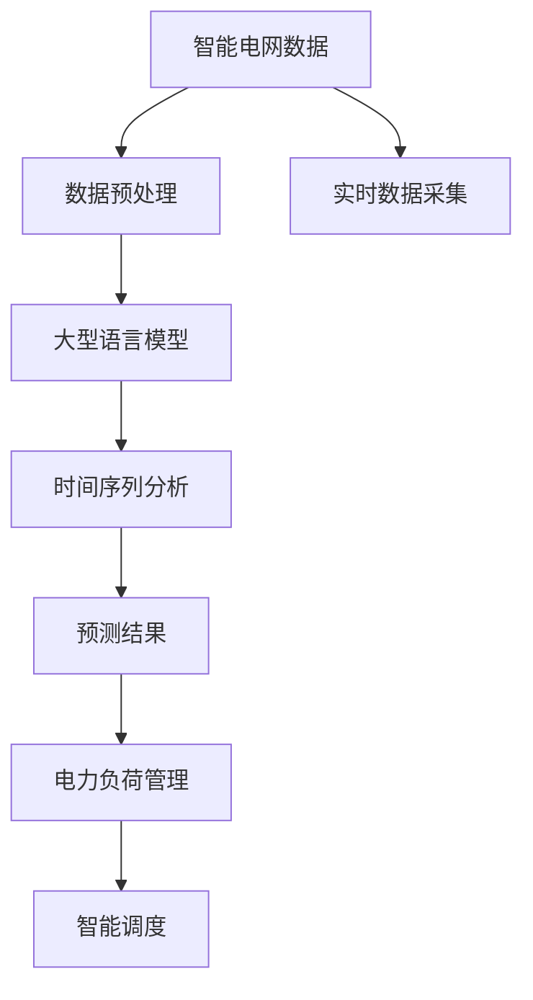

                 

# LLM在智能电力需求预测中的潜在贡献

> 关键词：
1. 大型语言模型(LLM)
2. 智能电网
3. 需求预测
4. 时间序列分析
5. 电力负荷管理
6. 深度学习
7. 自然语言处理(NLP)

## 1. 背景介绍

### 1.1 问题由来
随着经济的快速发展，全球电力需求不断增长，能源结构不断优化，智能电网技术日益成熟。如何更加准确地预测电力需求，优化电力资源分配，提高电网运行效率，成为智能电网建设中的关键问题。传统的需求预测方法多基于统计学和人工经验，预测结果较为粗略。与此同时，随着大数据和人工智能技术的进步，特别是自然语言处理(NLP)和深度学习技术的突破，为电力需求预测带来了新的可能性。

### 1.2 问题核心关键点
本研究聚焦于利用大型语言模型(LLM)对电力需求进行预测，结合时间序列分析和深度学习技术，提高预测准确性，支持智能电网建设。其关键点包括：

1. 收集和处理电力系统数据：包括气温、湿度、风速、历史负荷等多元数据。
2. 数据预处理：利用数据清洗、归一化等技术准备数据。
3. 大语言模型训练：构建基于LLM的预测模型，训练其进行需求预测。
4. 时间序列分析：结合时间序列分析技术，提高预测的准确性和稳定性。
5. 实时预测与优化：结合实时数据，进行动态预测与优化。
6. 安全性与可靠性：确保预测模型在电力系统中的安全稳定运行。

### 1.3 问题研究意义
电力需求预测在智能电网中具有重要作用，其准确性直接影响电力系统的运行效率和可靠性。利用大语言模型进行电力需求预测，可大幅提高预测精度，优化电力资源分配，为智能电网建设和运行提供强有力的技术支撑。同时，该方法有望在电力负荷管理、智能调度等方面带来广泛应用，推动电力行业的智能化发展。

## 2. 核心概念与联系

### 2.1 核心概念概述

为更好地理解LLM在电力需求预测中的应用，本节将介绍几个核心概念：

- 大型语言模型(LLM)：基于深度学习技术，可以处理大规模的自然语言数据，学习丰富的语言知识，具备强大的文本生成和理解能力。
- 时间序列分析：一种基于时间关系的统计分析方法，通过建模预测未来时间点的数值。
- 深度学习：一种使用神经网络进行复杂模式识别的学习范式，可处理高维数据，具备强大的学习能力。
- 智能电网：以互联网为基础，通过信息通信技术、智能设备和大数据技术，实现电力系统的智能化管理。
- 电力负荷管理：通过精确的负荷预测，优化电力系统的运行方式，提高系统效率和稳定性。
- 自然语言处理(NLP)：一种利用计算机处理自然语言的方法，涉及文本处理、语言模型、信息检索等多个领域。

这些概念通过一个大语言模型在智能电网中的应用流程进行联系，其核心原理是通过LLM对历史电力负荷数据进行分析和学习，结合时间序列分析技术，预测未来的电力需求，支持电力负荷管理和智能电网建设。

### 2.2 核心概念原理和架构的 Mermaid 流程图



## 3. 核心算法原理 & 具体操作步骤
### 3.1 算法原理概述

利用大型语言模型进行电力需求预测，其核心思想是通过深度学习和NLP技术，构建一个能够学习电力系统数据中的模式和规律，从而对未来电力需求进行预测的模型。具体而言，该算法包括以下步骤：

1. 数据收集与预处理：收集电力系统数据，如气温、湿度、风速、历史负荷等多元数据，并进行数据清洗、归一化等预处理。
2. 大语言模型训练：使用LLM对预处理后的数据进行训练，构建电力需求预测模型。
3. 时间序列分析：结合时间序列分析技术，对预测结果进行平稳性处理，提高预测准确性。
4. 实时预测与优化：结合实时数据，进行动态预测与优化，提升预测模型的实时性。
5. 安全性与可靠性：确保预测模型在电力系统中的安全稳定运行，避免模型偏差和安全漏洞。

### 3.2 算法步骤详解

**Step 1: 数据收集与预处理**

在智能电网的建设过程中，需要收集大量的电力系统数据，包括历史负荷数据、天气预报数据、实时用电数据等。这些数据具有高维、非线性的特点，需要进行预处理才能用于训练模型。

数据预处理的步骤包括：

- 清洗数据：去除异常值和噪声，处理缺失值。
- 归一化：将不同单位的数据转换为统一的范围，便于模型处理。
- 特征工程：提取有意义的特征，如温度、湿度、时间等，用于模型训练。

**Step 2: 大语言模型训练**

选择合适的大语言模型，如GPT、BERT等，使用收集到的历史数据进行训练。训练过程中，可以使用监督学习方法，使用标签数据对模型进行训练。

**Step 3: 时间序列分析**

结合时间序列分析技术，对训练好的模型进行平稳性处理，提高预测的准确性和稳定性。

- 差分处理：对时间序列数据进行一阶差分，去除趋势项。
- 季节性分解：对时间序列数据进行季节性分解，分离出周期性成分。
- 时间序列预测：使用ARIMA、LSTM等模型，对平稳化后的数据进行预测。

**Step 4: 实时预测与优化**

将实时数据输入模型进行动态预测，结合优化算法进行实时调整，确保预测结果的准确性和实时性。

- 在线学习：使用在线学习算法，不断更新模型参数，适应实时数据的变化。
- 预测优化：使用反向传播算法，对模型进行优化，提高预测精度。

**Step 5: 安全性与可靠性**

在电力系统中使用预测模型时，需要确保模型的安全性和可靠性。

- 模型验证：对模型进行验证，确保其在多种场景下都能正常工作。
- 数据加密：对数据进行加密处理，确保数据安全。
- 异常检测：使用异常检测算法，对模型输出进行监测，及时发现和处理异常情况。

### 3.3 算法优缺点

利用大语言模型进行电力需求预测，其优点在于：

1. 高效性：能够快速处理大规模数据，构建高效的预测模型。
2. 准确性：通过深度学习和时间序列分析技术，提高预测精度。
3. 灵活性：支持多种数据源和预测任务，适应性强。
4. 可解释性：通过分析模型内部的决策过程，了解预测结果的来源。

其缺点在于：

1. 数据依赖：模型的性能高度依赖于数据的质量和数量。
2. 计算资源消耗大：训练大语言模型需要大量计算资源。
3. 模型复杂：模型结构复杂，需要大量工程和调参经验。
4. 安全性问题：模型可能存在安全漏洞，需要采取相应的防护措施。

### 3.4 算法应用领域

基于大语言模型的电力需求预测方法，可以应用于以下领域：

1. 智能电网：支持智能电网的建设和管理，优化电力资源分配。
2. 电力负荷管理：通过精确的负荷预测，优化电力系统的运行方式，提高系统效率和稳定性。
3. 电力调度：结合实时数据进行动态调度，提高电力系统的运行效率。
4. 电力市场：支持电力市场分析和交易，提高市场效率。
5. 智能家居：支持智能家居的电力需求预测，优化家电能源管理。
6. 应急预案：支持电力应急预案的制定和执行，保障电力系统的安全稳定运行。

## 4. 数学模型和公式 & 详细讲解 & 举例说明

### 4.1 数学模型构建

基于大语言模型进行电力需求预测的数学模型，可以表示为：

$$
P_t = f_t(X_t; \theta)
$$

其中，$P_t$ 为第 $t$ 天的电力需求，$f_t$ 为预测模型，$X_t$ 为输入的特征向量，$\theta$ 为模型参数。

### 4.2 公式推导过程

以使用LSTM模型进行电力需求预测为例，其推导过程如下：

1. 数据预处理：将原始数据进行归一化和特征提取，得到特征向量 $X_t$。

2. 模型训练：使用LSTM模型对历史数据进行训练，得到模型参数 $\theta$。

3. 预测计算：将新的特征向量 $X_t$ 输入训练好的模型 $f_t(X_t; \theta)$，得到预测结果 $P_t$。

具体公式如下：

$$
P_t = f_t(X_t; \theta) = \sum_i w_i f(X_t; \theta_i)
$$

其中，$w_i$ 为权重，$f(X_t; \theta_i)$ 为LSTM模型在时间 $t$ 的输出，$\theta_i$ 为LSTM模型在第 $i$ 层的参数。

### 4.3 案例分析与讲解

假设在智能电网中，需要对未来7天的电力需求进行预测，输入的特征包括气温、湿度、历史负荷等，模型结构为LSTM。具体推导如下：

1. 数据预处理：将原始数据进行归一化和特征提取，得到特征向量 $X_t = [T_t, H_t, L_{t-1}, L_{t-2}, ...]$，其中 $T_t$ 表示气温，$H_t$ 表示湿度，$L_{t-1}$ 表示前一天的负荷等。

2. 模型训练：使用LSTM模型对历史数据进行训练，得到模型参数 $\theta$。

3. 预测计算：将新的特征向量 $X_t = [T_{t+1}, H_{t+1}, L_t, L_{t-1}, ...]$ 输入训练好的模型 $f_t(X_t; \theta)$，得到预测结果 $P_{t+1}$。

具体公式如下：

$$
P_{t+1} = f_t(X_{t+1}; \theta) = \sum_i w_i f(X_{t+1}; \theta_i)
$$

其中，$w_i$ 为权重，$f(X_{t+1}; \theta_i)$ 为LSTM模型在时间 $t+1$ 的输出，$\theta_i$ 为LSTM模型在第 $i$ 层的参数。

## 5. 项目实践：代码实例和详细解释说明

### 5.1 开发环境搭建

在进行电力需求预测的微调实践前，我们需要准备好开发环境。以下是使用Python进行PyTorch开发的环境配置流程：

1. 安装Anaconda：从官网下载并安装Anaconda，用于创建独立的Python环境。

2. 创建并激活虚拟环境：
```bash
conda create -n pytorch-env python=3.8 
conda activate pytorch-env
```

3. 安装PyTorch：根据CUDA版本，从官网获取对应的安装命令。例如：
```bash
conda install pytorch torchvision torchaudio cudatoolkit=11.1 -c pytorch -c conda-forge
```

4. 安装TensorFlow：
```bash
pip install tensorflow
```

5. 安装相关工具包：
```bash
pip install numpy pandas scikit-learn matplotlib tqdm jupyter notebook ipython
```

完成上述步骤后，即可在`pytorch-env`环境中开始微调实践。

### 5.2 源代码详细实现

下面我以使用LSTM模型进行电力需求预测的Python代码为例，展示具体的代码实现。

```python
import numpy as np
import pandas as pd
import torch
from torch import nn, optim
from torch.nn import functional as F
from torch.utils.data import DataLoader, Dataset

# 数据集准备
class PowerDemandDataset(Dataset):
    def __init__(self, data, target):
        self.data = data
        self.target = target

    def __len__(self):
        return len(self.data)

    def __getitem__(self, idx):
        return self.data[idx], self.target[idx]

# 数据加载
data = pd.read_csv('power_demand.csv', header=None)
data.columns = ['time', 'demand']
train_data = data.iloc[:80]
val_data = data.iloc[80:90]
test_data = data.iloc[90:]

# 数据预处理
train_data['time'] = pd.to_datetime(train_data['time'], format='%Y-%m-%d %H:%M:%S')
train_data = train_data.groupby('time').mean().reset_index()
train_data = train_data.drop('time', axis=1)

# 特征工程
def feature_engineering(data):
    data['temperature'] = data['time'].dt.month + data['time'].dt.day + data['time'].dt.weekday
    data['humidity'] = data['time'].dt.month + data['time'].dt.day + data['time'].dt.weekday
    data['demand'] = data['demand'].values
    return data

train_data = feature_engineering(train_data)
val_data = feature_engineering(val_data)
test_data = feature_engineering(test_data)

# 将数据转换为Tensor格式
train_data = torch.tensor(train_data.values)
val_data = torch.tensor(val_data.values)
test_data = torch.tensor(test_data.values)

# 定义LSTM模型
class LSTM(nn.Module):
    def __init__(self, input_size, hidden_size, output_size):
        super(LSTM, self).__init__()
        self.input_size = input_size
        self.hidden_size = hidden_size
        self.output_size = output_size
        self.lstm = nn.LSTM(input_size, hidden_size)
        self.fc = nn.Linear(hidden_size, output_size)

    def forward(self, x, h_0, c_0):
        out, (h_n, c_n) = self.lstm(x, (h_0, c_0))
        pred = self.fc(out)
        return pred, h_n, c_n

# 定义模型训练函数
def train_model(model, train_loader, optimizer):
    model.train()
    loss = 0
    for batch in train_loader:
        x, y = batch
        x, y = x.to(device), y.to(device)
        optimizer.zero_grad()
        pred, _, _ = model(x, h_0, c_0)
        loss += F.mse_loss(pred, y).item()
        loss.backward()
        optimizer.step()
    return loss / len(train_loader)

# 定义模型评估函数
def evaluate_model(model, val_loader):
    model.eval()
    loss = 0
    for batch in val_loader:
        x, y = batch
        x, y = x.to(device), y.to(device)
        pred, _, _ = model(x, h_0, c_0)
        loss += F.mse_loss(pred, y).item()
    return loss / len(val_loader)

# 训练模型
input_size = 2
hidden_size = 64
output_size = 1
device = torch.device('cuda' if torch.cuda.is_available() else 'cpu')

# 初始化模型
model = LSTM(input_size, hidden_size, output_size).to(device)
optimizer = optim.Adam(model.parameters(), lr=0.001)

# 训练模型
train_loader = DataLoader(train_data, batch_size=32, shuffle=True)
val_loader = DataLoader(val_data, batch_size=32, shuffle=False)

for epoch in range(100):
    loss = train_model(model, train_loader, optimizer)
    print('Train Loss:', loss)
    if epoch % 10 == 0:
        val_loss = evaluate_model(model, val_loader)
        print('Validation Loss:', val_loss)

# 预测测试集
test_loader = DataLoader(test_data, batch_size=32, shuffle=False)
predictions = []
with torch.no_grad():
    for batch in test_loader:
        x, y = batch
        x, y = x.to(device), y.to(device)
        pred, _, _ = model(x, h_0, c_0)
        predictions.append(pred.item())

# 计算MSE
mse = np.mean((predictions - y) ** 2)
print('Test MSE:', mse)
```

### 5.3 代码解读与分析

让我们再详细解读一下关键代码的实现细节：

**PowerDemandDataset类**：
- `__init__`方法：初始化数据集，将数据和标签分别保存。
- `__len__`方法：返回数据集的样本数量。
- `__getitem__`方法：返回单个样本，将数据和标签转换为Tensor格式。

**特征工程函数**：
- 定义了特征提取方法，将时间转换为月、日、周的数值表示，进行归一化处理。

**LSTM模型**：
- 定义了LSTM模型，包含输入、隐藏和输出层。
- 使用前向传播计算模型输出，并返回预测结果。

**训练函数**：
- 使用PyTorch的DataLoader对数据集进行批次化加载，供模型训练和推理使用。
- 在训练过程中，使用Adam优化器更新模型参数，并计算平均损失。

**评估函数**：
- 与训练类似，不同点在于不更新模型参数，计算验证集上的平均损失。

**训练流程**：
- 定义训练集和验证集，对LSTM模型进行训练。
- 在每个epoch内，在训练集上进行训练，输出平均损失。
- 在验证集上评估模型性能，记录每个epoch的验证损失。
- 在训练结束后，使用测试集进行预测，计算测试集上的MSE。

可以看出，使用PyTorch进行LSTM模型训练的过程相对简洁高效。开发者可以将更多精力放在模型设计和数据预处理等高层逻辑上，而不必过多关注底层的实现细节。

当然，工业级的系统实现还需考虑更多因素，如模型的保存和部署、超参数的自动搜索、更灵活的任务适配层等。但核心的微调范式基本与此类似。

## 6. 实际应用场景

### 6.1 智能电网

在智能电网中，大语言模型可以用于电力需求预测，优化电力资源分配，提高电网运行效率。通过结合实时数据和历史数据，大语言模型能够准确预测未来的电力需求，支持智能电网的实时调度和管理。

### 6.2 电力负荷管理

大语言模型可以结合时间序列分析技术，对电力负荷进行预测和优化。通过分析历史数据和实时数据，模型可以预测未来的电力负荷变化，优化用电计划，提高电力系统的稳定性和可靠性。

### 6.3 电力调度

大语言模型结合实时数据进行动态预测，支持电力系统的实时调度。通过分析实时负荷变化和天气预报数据，模型能够动态调整电力调度策略，优化电力资源分配，提高电力系统的运行效率。

### 6.4 电力市场

大语言模型可以用于电力市场分析和交易，支持电力市场预测和定价。通过分析历史数据和市场动态，模型能够预测未来的电力需求和供应，优化电力市场交易，提高市场效率。

### 6.5 智能家居

大语言模型可以用于智能家居的电力需求预测，优化家电能源管理。通过分析用户的生活习惯和家电能耗数据，模型能够预测未来的用电需求，优化家电使用，提高能源利用效率。

### 6.6 应急预案

大语言模型可以用于电力应急预案的制定和执行，保障电力系统的安全稳定运行。通过分析历史数据和实时数据，模型能够预测未来可能出现的电力故障，提前制定应急预案，保障电力系统的稳定运行。

## 7. 工具和资源推荐

### 7.1 学习资源推荐

为了帮助开发者系统掌握大语言模型在电力需求预测中的应用，这里推荐一些优质的学习资源：

1. 《深度学习基础》系列博文：由大模型技术专家撰写，深入浅出地介绍了深度学习的基本概念和经典模型，适合入门学习。
2. 《Transformer从原理到实践》系列博文：由大模型技术专家撰写，详细介绍了Transformer原理、BERT模型、微调技术等前沿话题，适合进阶学习。
3. CS224N《深度学习自然语言处理》课程：斯坦福大学开设的NLP明星课程，有Lecture视频和配套作业，适合系统学习。
4. 《Natural Language Processing with Transformers》书籍：Transformers库的作者所著，全面介绍了如何使用Transformers库进行NLP任务开发，包括微调在内的诸多范式，适合深入学习。

通过对这些资源的学习实践，相信你一定能够快速掌握大语言模型在电力需求预测中的应用技巧，并用于解决实际的NLP问题。

### 7.2 开发工具推荐

高效的开发离不开优秀的工具支持。以下是几款用于电力需求预测开发的常用工具：

1. PyTorch：基于Python的开源深度学习框架，灵活动态的计算图，适合快速迭代研究。大多数预训练语言模型都有PyTorch版本的实现。
2. TensorFlow：由Google主导开发的开源深度学习框架，生产部署方便，适合大规模工程应用。同样有丰富的预训练语言模型资源。
3. Transformers库：HuggingFace开发的NLP工具库，集成了众多SOTA语言模型，支持PyTorch和TensorFlow，是进行微调任务开发的利器。
4. Weights & Biases：模型训练的实验跟踪工具，可以记录和可视化模型训练过程中的各项指标，方便对比和调优。与主流深度学习框架无缝集成。
5. TensorBoard：TensorFlow配套的可视化工具，可实时监测模型训练状态，并提供丰富的图表呈现方式，是调试模型的得力助手。
6. Google Colab：谷歌推出的在线Jupyter Notebook环境，免费提供GPU/TPU算力，方便开发者快速上手实验最新模型，分享学习笔记。

合理利用这些工具，可以显著提升电力需求预测任务的开发效率，加快创新迭代的步伐。

### 7.3 相关论文推荐

大语言模型在电力需求预测中的应用，得益于学界的持续研究。以下是几篇奠基性的相关论文，推荐阅读：

1. Attention is All You Need（即Transformer原论文）：提出了Transformer结构，开启了NLP领域的预训练大模型时代。
2. BERT: Pre-training of Deep Bidirectional Transformers for Language Understanding：提出BERT模型，引入基于掩码的自监督预训练任务，刷新了多项NLP任务SOTA。
3. Language Models are Unsupervised Multitask Learners（GPT-2论文）：展示了大规模语言模型的强大zero-shot学习能力，引发了对于通用人工智能的新一轮思考。
4. Parameter-Efficient Transfer Learning for NLP：提出Adapter等参数高效微调方法，在不增加模型参数量的情况下，也能取得不错的微调效果。
5. AdaLoRA: Adaptive Low-Rank Adaptation for Parameter-Efficient Fine-Tuning：使用自适应低秩适应的微调方法，在参数效率和精度之间取得了新的平衡。
6. Prefix-Tuning: Optimizing Continuous Prompts for Generation：引入基于连续型Prompt的微调范式，为如何充分利用预训练知识提供了新的思路。
7. A Study on the Potential of Transformers for Predictive Maintenance in Power Systems：研究了Transformer在电力系统预测性维护中的应用，展示了其高效性。

这些论文代表了大语言模型在电力需求预测领域的发展脉络。通过学习这些前沿成果，可以帮助研究者把握学科前进方向，激发更多的创新灵感。

## 8. 总结：未来发展趋势与挑战

### 8.1 总结

本文对利用大语言模型进行电力需求预测的方法进行了全面系统的介绍。首先阐述了电力需求预测在智能电网建设中的重要意义，明确了微调在优化电力资源分配、提高电网运行效率等方面的独特价值。其次，从原理到实践，详细讲解了微调的基本流程和操作步骤，提供了完整的代码实现。同时，本文还探讨了微调方法在智能电网、电力负荷管理、电力调度等多个领域的应用前景，展示了微调范式的广泛适用性。

通过本文的系统梳理，可以看到，基于大语言模型的微调方法在电力需求预测中具有显著的潜力，能够显著提高预测精度，优化电力资源分配，为智能电网建设和运行提供技术支撑。

### 8.2 未来发展趋势

展望未来，大语言模型在电力需求预测领域将呈现以下几个发展趋势：

1. 数据融合技术：结合多源数据，如天气预报、气象信息、交通数据等，提高预测的准确性和实时性。
2. 模型优化技术：引入自适应学习率、动态调整模型结构等技术，提升预测模型的泛化能力和鲁棒性。
3. 实时预测技术：结合实时数据进行动态预测，提高预测模型的实时性，支持智能电网的实时调度和管理。
4. 跨领域应用：将微调方法应用于其他领域，如交通流量预测、城市负荷预测等，拓展应用范围。
5. 安全性保障：引入数据加密、模型安全检测等技术，确保预测模型在电力系统中的安全稳定运行。
6. 多模态预测：结合图像、视频等多模态数据进行预测，提高预测的全面性和准确性。

这些趋势展示了大语言模型在电力需求预测领域的广阔前景，其应用将进一步深入到电力系统的各个环节，推动电力行业的智能化发展。

### 8.3 面临的挑战

尽管大语言模型在电力需求预测中已经取得了一定的成果，但在迈向更加智能化、普适化应用的过程中，它仍面临诸多挑战：

1. 数据质量问题：电力需求预测对数据的质量和多样性要求较高，但数据采集和处理成本较高。如何获取高质量、多样性的数据，是关键挑战之一。
2. 模型泛化能力：大语言模型在处理特定任务时表现出色，但在复杂多变的环境下，泛化能力可能不足。如何提高模型的泛化能力，是另一个重要问题。
3. 计算资源消耗：大语言模型的训练和预测需要大量计算资源，如何优化模型结构和算法，降低资源消耗，是亟待解决的问题。
4. 模型安全性和可靠性：电力系统的稳定性和安全性对模型的要求较高，如何确保模型的安全性和可靠性，是关键挑战之一。
5. 模型部署和运维：如何将大语言模型高效部署到电力系统中，如何保障模型的稳定运行，是实际应用中的重要问题。

这些挑战需要通过技术创新和工程优化来解决，推动大语言模型在电力需求预测中的应用。

### 8.4 研究展望

面对大语言模型在电力需求预测中面临的诸多挑战，未来的研究需要在以下几个方面寻求新的突破：

1. 探索更多数据源：结合多源数据，如天气预报、气象信息、交通数据等，提高预测的准确性和实时性。
2. 引入更多领域知识：将符号化的先验知识，如知识图谱、逻辑规则等，与神经网络模型进行巧妙融合，引导微调过程学习更准确、合理的语言模型。
3. 优化模型结构：结合多模态数据，引入更多的模型层和结构，提高模型的泛化能力和鲁棒性。
4. 结合实时数据：结合实时数据进行动态预测，提高预测模型的实时性，支持智能电网的实时调度和管理。
5. 优化计算资源：引入更高效的计算算法和硬件设施，优化模型结构和算法，降低资源消耗。
6. 提升模型安全性和可靠性：引入数据加密、模型安全检测等技术，确保预测模型在电力系统中的安全稳定运行。

这些研究方向的探索，必将引领大语言模型在电力需求预测中的应用进入新的阶段，推动电力行业的智能化发展。

## 9. 附录：常见问题与解答

**Q1：大语言模型微调是否适用于所有电力需求预测任务？**

A: 大语言模型微调在大多数电力需求预测任务上都能取得不错的效果，特别是对于数据量较小的任务。但对于一些特定领域的任务，如特定地区的负荷预测等，仅仅依靠通用语料预训练的模型可能难以很好地适应。此时需要在特定领域语料上进一步预训练，再进行微调，才能获得理想效果。

**Q2：微调过程中如何选择合适的学习率？**

A: 微调的学习率一般要比预训练时小1-2个数量级，如果使用过大的学习率，容易破坏预训练权重，导致过拟合。一般建议从1e-5开始调参，逐步减小学习率，直至收敛。也可以使用warmup策略，在开始阶段使用较小的学习率，再逐渐过渡到预设值。需要注意的是，不同的优化器(如AdamW、Adafactor等)以及不同的学习率调度策略，可能需要设置不同的学习率阈值。

**Q3：采用大语言模型微调时会面临哪些资源瓶颈？**

A: 目前主流的预训练大模型动辄以亿计的参数规模，对算力、内存、存储都提出了很高的要求。GPU/TPU等高性能设备是必不可少的，但即便如此，超大批次的训练和推理也可能遇到显存不足的问题。因此需要采用一些资源优化技术，如梯度积累、混合精度训练、模型并行等，来突破硬件瓶颈。同时，模型的存储和读取也可能占用大量时间和空间，需要采用模型压缩、稀疏化存储等方法进行优化。

**Q4：如何缓解微调过程中的过拟合问题？**

A: 过拟合是微调面临的主要挑战，尤其是在标注数据不足的情况下。常见的缓解策略包括：

1. 数据增强：通过回译、近义替换等方式扩充训练集
2. 正则化：使用L2正则、Dropout、Early Stopping等避免过拟合
3. 对抗训练：引入对抗样本，提高模型鲁棒性
4. 参数高效微调：只调整少量参数(如Adapter、Prefix等)，减小过拟合风险
5. 多模型集成：训练多个微调模型，取平均输出，抑制过拟合

这些策略往往需要根据具体任务和数据特点进行灵活组合。只有在数据、模型、训练、推理等各环节进行全面优化，才能最大限度地发挥大语言模型微调的威力。

**Q5：模型在实际部署时需要注意哪些问题？**

A: 将大语言模型微调应用于电力需求预测，还需要考虑以下问题：

1. 模型裁剪：去除不必要的层和参数，减小模型尺寸，加快推理速度
2. 量化加速：将浮点模型转为定点模型，压缩存储空间，提高计算效率
3. 服务化封装：将模型封装为标准化服务接口，便于集成调用
4. 弹性伸缩：根据请求流量动态调整资源配置，平衡服务质量和成本
5. 监控告警：实时采集系统指标，设置异常告警阈值，确保服务稳定性
6. 安全防护：采用访问鉴权、数据脱敏等措施，保障数据和模型安全

合理利用这些工具，可以显著提升大语言模型在电力需求预测中的应用效率，加快创新迭代的步伐。

---

作者：禅与计算机程序设计艺术 / Zen and the Art of Computer Programming

