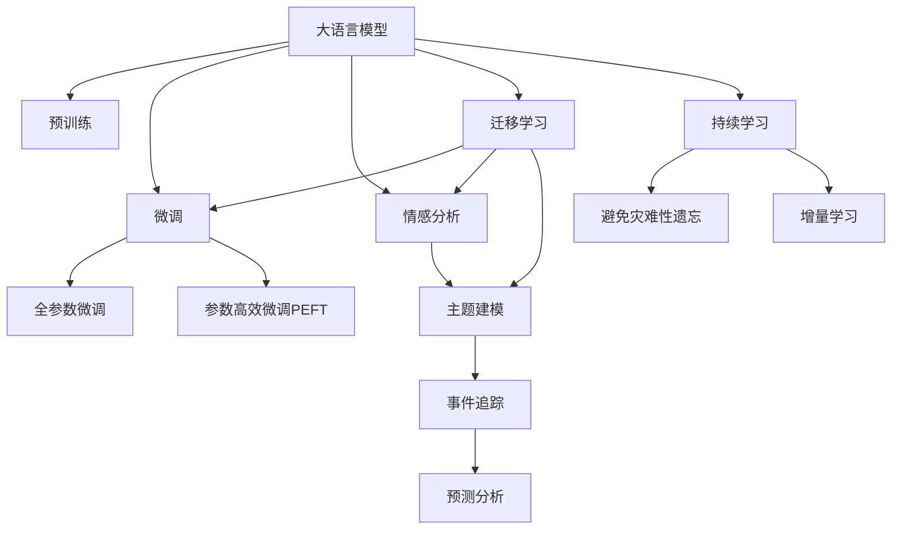

                 

# LLM在智能舆情分析中的潜力

> 关键词：大语言模型,自然语言处理,智能舆情分析,情感分析,文本分类,主题建模,机器学习,深度学习

## 1. 背景介绍

在当今信息爆炸的时代，舆情分析已成为理解社会动态、预测未来趋势的重要工具。传统的舆情分析依赖于人工手动分析大量文本数据，不仅耗时耗力，且分析结果主观性强。然而，随着人工智能技术的发展，大语言模型（Large Language Models, LLMs）为智能舆情分析提供了新的可能性。大语言模型通过学习大量的文本数据，可以自动进行文本分类、情感分析、主题建模等任务，显著提高了舆情分析的效率和准确性。

### 1.1 问题由来
舆情分析是指对公众意见、情感、态度等进行收集、分析和解读，以预测社会动态和趋势。传统的人工舆情分析方法包括关键词提取、主题建模、情感分析等，但这些方法依赖于人工标注和复杂的算法模型，耗时耗力，且分析结果易受主观影响。相比之下，基于大语言模型的智能舆情分析方法可以自动处理海量文本数据，识别和分类关键情感和主题，并提供更为客观、准确的分析结果。

### 1.2 问题核心关键点
大语言模型在智能舆情分析中的应用，主要体现在以下几个方面：

1. **文本分类**：自动对大量文本数据进行分类，如政经、娱乐、体育等。
2. **情感分析**：自动识别文本中的情感倾向，如正面、负面、中性等。
3. **主题建模**：自动发现文本中的主题，如热门话题、热点事件等。
4. **事件追踪**：自动追踪事件的发展历程和影响范围。
5. **预测分析**：基于历史数据预测未来事件的可能发展。

这些核心关键点使得大语言模型在智能舆情分析中具有巨大潜力。

## 2. 核心概念与联系

### 2.1 核心概念概述

为了更好地理解大语言模型在智能舆情分析中的应用，本节将介绍几个密切相关的核心概念：

1. **大语言模型（LLM）**：以自回归（如GPT）或自编码（如BERT）模型为代表的大规模预训练语言模型。通过在大规模无标签文本语料上进行预训练，学习通用的语言表示，具备强大的语言理解和生成能力。

2. **预训练**：指在大规模无标签文本语料上，通过自监督学习任务训练通用语言模型的过程。常见的预训练任务包括言语建模、遮挡语言模型等。

3. **微调**：指在预训练模型的基础上，使用下游任务的少量标注数据，通过有监督地训练来优化模型在该任务上的性能。通常只需要调整顶层分类器或解码器，并以较小的学习率更新全部或部分的模型参数。

4. **迁移学习**：指将一个领域学习到的知识，迁移应用到另一个不同但相关的领域的学习范式。大模型的预训练-微调过程即是一种典型的迁移学习方式。

5. **情感分析**：自动识别文本中的情感倾向，如正面、负面、中性等。在舆情分析中，情感分析能够帮助判断公众对某个事件的态度。

6. **主题建模**：自动识别文本中的主题，如热门话题、热点事件等。在舆情分析中，主题建模能够帮助发现公众关注的热点话题。

### 2.2 核心概念原理和架构的 Mermaid 流程图



这个流程图展示了大语言模型在智能舆情分析中的核心概念及其之间的关系：

1. 大语言模型通过预训练获得基础能力。
2. 微调是对预训练模型进行任务特定的优化，可以分为全参数微调和参数高效微调（PEFT）。
3. 情感分析和主题建模是典型的下游任务，可以通过微调使模型具备这些能力。
4. 事件追踪和预测分析则是更高级的应用，通常需要结合时序数据和模型推理。
5. 迁移学习是连接预训练模型与下游任务的桥梁，可以通过微调或新引入的技能来实现。
6. 持续学习旨在使模型能够不断学习新知识，同时避免遗忘旧知识。

这些核心概念共同构成了大语言模型在智能舆情分析中的应用框架，使其能够在各种场景下发挥强大的语言理解和生成能力。通过理解这些核心概念，我们可以更好地把握大语言模型的工作原理和优化方向。

## 3. 核心算法原理 & 具体操作步骤
### 3.1 算法原理概述

大语言模型在智能舆情分析中的应用，本质上是一个有监督的细粒度迁移学习过程。其核心思想是：将预训练的大语言模型视作一个强大的"特征提取器"，通过在舆情分析任务的少量标注数据上进行有监督地训练，使得模型输出能够匹配任务标签，从而获得针对特定任务优化的模型。

形式化地，假设预训练模型为 $M_{\theta}$，其中 $\theta$ 为预训练得到的模型参数。给定舆情分析任务的标注数据集 $D=\{(x_i, y_i)\}_{i=1}^N$，其中 $x_i$ 为文本数据，$y_i$ 为标签（如情感类别、主题等）。微调的目标是找到新的模型参数 $\hat{\theta}$，使得：

$$
\hat{\theta}=\mathop{\arg\min}_{\theta} \mathcal{L}(M_{\theta},D)
$$

其中 $\mathcal{L}$ 为针对任务 $T$ 设计的损失函数，用于衡量模型预测输出与真实标签之间的差异。常见的损失函数包括交叉熵损失、均方误差损失等。

通过梯度下降等优化算法，微调过程不断更新模型参数 $\theta$，最小化损失函数 $\mathcal{L}$，使得模型输出逼近真实标签。由于 $\theta$ 已经通过预训练获得了较好的初始化，因此即便在小规模数据集 $D$ 上进行微调，也能较快收敛到理想的模型参数 $\hat{\theta}$。

### 3.2 算法步骤详解

基于大语言模型的智能舆情分析微调一般包括以下几个关键步骤：

**Step 1: 准备预训练模型和数据集**
- 选择合适的预训练语言模型 $M_{\theta}$ 作为初始化参数，如 BERT、GPT 等。
- 准备舆情分析任务的标注数据集 $D$，划分为训练集、验证集和测试集。一般要求标注数据与预训练数据的分布不要差异过大。

**Step 2: 添加任务适配层**
- 根据任务类型，在预训练模型顶层设计合适的输出层和损失函数。
- 对于分类任务，通常在顶层添加线性分类器和交叉熵损失函数。
- 对于生成任务，通常使用语言模型的解码器输出概率分布，并以负对数似然为损失函数。

**Step 3: 设置微调超参数**
- 选择合适的优化算法及其参数，如 AdamW、SGD 等，设置学习率、批大小、迭代轮数等。
- 设置正则化技术及强度，包括权重衰减、Dropout、Early Stopping 等。
- 确定冻结预训练参数的策略，如仅微调顶层，或全部参数都参与微调。

**Step 4: 执行梯度训练**
- 将训练集数据分批次输入模型，前向传播计算损失函数。
- 反向传播计算参数梯度，根据设定的优化算法和学习率更新模型参数。
- 周期性在验证集上评估模型性能，根据性能指标决定是否触发 Early Stopping。
- 重复上述步骤直到满足预设的迭代轮数或 Early Stopping 条件。

**Step 5: 测试和部署**
- 在测试集上评估微调后模型 $M_{\hat{\theta}}$ 的性能，对比微调前后的精度提升。
- 使用微调后的模型对新样本进行推理预测，集成到实际的应用系统中。
- 持续收集新的数据，定期重新微调模型，以适应数据分布的变化。

以上是基于大语言模型的智能舆情分析微调的一般流程。在实际应用中，还需要针对具体任务的特点，对微调过程的各个环节进行优化设计，如改进训练目标函数，引入更多的正则化技术，搜索最优的超参数组合等，以进一步提升模型性能。

### 3.3 算法优缺点

基于大语言模型的智能舆情分析方法具有以下优点：

1. **高效处理海量数据**：大语言模型能够自动处理海量文本数据，显著提升舆情分析的效率。
2. **自动学习情感和主题**：通过微调，模型能够自动识别文本中的情感倾向和主题，减少人工标注的需求。
3. **泛化能力强**：预训练模型具有较强的泛化能力，能够适应不同领域和语境的舆情分析任务。
4. **可解释性强**：大语言模型在推理过程中保留了可解释性，便于分析和调试。

同时，该方法也存在一定的局限性：

1. **依赖标注数据**：微调的效果很大程度上取决于标注数据的质量和数量，获取高质量标注数据的成本较高。
2. **迁移能力有限**：当目标任务与预训练数据的分布差异较大时，微调的性能提升有限。
3. **负面效果传递**：预训练模型的固有偏见、有害信息等，可能通过微调传递到下游任务，造成负面影响。
4. **可解释性不足**：微调模型的决策过程通常缺乏可解释性，难以对其推理逻辑进行分析和调试。

尽管存在这些局限性，但就目前而言，基于大语言模型的智能舆情分析方法仍是最主流范式。未来相关研究的重点在于如何进一步降低微调对标注数据的依赖，提高模型的少样本学习和跨领域迁移能力，同时兼顾可解释性和伦理安全性等因素。

### 3.4 算法应用领域

基于大语言模型的智能舆情分析方法，已经在舆情监测、舆情预警、舆情分析等多个领域得到应用，成为舆情分析的重要手段。

1. **舆情监测**：自动监测互联网上的舆情动态，发现和分析重大舆情事件。
2. **舆情预警**：通过情感分析等手段，提前发现和预警潜在舆情风险。
3. **舆情分析**：自动分析舆情事件的情感倾向、主题、热点等，提供全面的舆情分析报告。

除了上述这些经典应用外，大语言模型在舆情分析领域的创新应用还包括舆情可视化、舆情预测、舆情情绪识别等，为舆情分析提供了更多的可能性。随着大语言模型的不断进步，其在舆情分析中的应用也将更加广泛。

## 4. 数学模型和公式 & 详细讲解 & 举例说明

### 4.1 数学模型构建

本节将使用数学语言对基于大语言模型的智能舆情分析微调过程进行更加严格的刻画。

记预训练语言模型为 $M_{\theta}$，其中 $\theta$ 为预训练得到的模型参数。假设舆情分析任务的训练集为 $D=\{(x_i,y_i)\}_{i=1}^N$，其中 $x_i$ 为文本数据，$y_i$ 为标签（如情感类别、主题等）。

定义模型 $M_{\theta}$ 在输入 $x$ 上的输出为 $\hat{y}=M_{\theta}(x) \in \mathcal{Y}$，其中 $\mathcal{Y}$ 为输出空间。针对任务 $T$ 设计的损失函数为 $\ell(M_{\theta}(x),y)$，则在数据集 $D$ 上的经验风险为：

$$
\mathcal{L}(\theta) = \frac{1}{N} \sum_{i=1}^N \ell(M_{\theta}(x_i),y_i)
$$

微调的优化目标是最小化经验风险，即找到最优参数：

$$
\theta^* = \mathop{\arg\min}_{\theta} \mathcal{L}(\theta)
$$

在实践中，我们通常使用基于梯度的优化算法（如SGD、Adam等）来近似求解上述最优化问题。设 $\eta$ 为学习率，$\lambda$ 为正则化系数，则参数的更新公式为：

$$
\theta \leftarrow \theta - \eta \nabla_{\theta}\mathcal{L}(\theta) - \eta\lambda\theta
$$

其中 $\nabla_{\theta}\mathcal{L}(\theta)$ 为损失函数对参数 $\theta$ 的梯度，可通过反向传播算法高效计算。

### 4.2 公式推导过程

以下我们以情感分析任务为例，推导交叉熵损失函数及其梯度的计算公式。

假设模型 $M_{\theta}$ 在输入 $x$ 上的输出为 $\hat{y}=M_{\theta}(x) \in \mathcal{Y}$，其中 $\mathcal{Y}$ 为输出空间，包含多个类别。真实标签 $y \in \{1,2,\cdots,K\}$。则二分类交叉熵损失函数定义为：

$$
\ell(M_{\theta}(x),y) = -[y\log M_{\theta}(y_i) + (1-y)\log (1-M_{\theta}(y_i))]
$$

将其代入经验风险公式，得：

$$
\mathcal{L}(\theta) = -\frac{1}{N}\sum_{i=1}^N [y_i\log M_{\theta}(x_i)+(1-y_i)\log(1-M_{\theta}(x_i))]
$$

根据链式法则，损失函数对参数 $\theta_k$ 的梯度为：

$$
\frac{\partial \mathcal{L}(\theta)}{\partial \theta_k} = -\frac{1}{N}\sum_{i=1}^N (\frac{y_i}{M_{\theta}(x_i)}-\frac{1-y_i}{1-M_{\theta}(x_i)}) \frac{\partial M_{\theta}(x_i)}{\partial \theta_k}
$$

其中 $\frac{\partial M_{\theta}(x_i)}{\partial \theta_k}$ 可进一步递归展开，利用自动微分技术完成计算。

在得到损失函数的梯度后，即可带入参数更新公式，完成模型的迭代优化。重复上述过程直至收敛，最终得到适应舆情分析任务的最优模型参数 $\theta^*$。

## 5. 项目实践：代码实例和详细解释说明

### 5.1 开发环境搭建

在进行智能舆情分析微调实践前，我们需要准备好开发环境。以下是使用Python进行PyTorch开发的环境配置流程：

1. 安装Anaconda：从官网下载并安装Anaconda，用于创建独立的Python环境。

2. 创建并激活虚拟环境：
```bash
conda create -n pytorch-env python=3.8 
conda activate pytorch-env
```

3. 安装PyTorch：根据CUDA版本，从官网获取对应的安装命令。例如：
```bash
conda install pytorch torchvision torchaudio cudatoolkit=11.1 -c pytorch -c conda-forge
```

4. 安装Transformers库：
```bash
pip install transformers
```

5. 安装各类工具包：
```bash
pip install numpy pandas scikit-learn matplotlib tqdm jupyter notebook ipython
```

完成上述步骤后，即可在`pytorch-env`环境中开始智能舆情分析微调实践。

### 5.2 源代码详细实现

下面我以情感分析任务为例，给出使用Transformers库对BERT模型进行智能舆情分析微调的PyTorch代码实现。

首先，定义情感分析任务的数据处理函数：

```python
from transformers import BertTokenizer
from torch.utils.data import Dataset
import torch

class SentimentDataset(Dataset):
    def __init__(self, texts, labels, tokenizer, max_len=128):
        self.texts = texts
        self.labels = labels
        self.tokenizer = tokenizer
        self.max_len = max_len
        
    def __len__(self):
        return len(self.texts)
    
    def __getitem__(self, item):
        text = self.texts[item]
        label = self.labels[item]
        
        encoding = self.tokenizer(text, return_tensors='pt', max_length=self.max_len, padding='max_length', truncation=True)
        input_ids = encoding['input_ids'][0]
        attention_mask = encoding['attention_mask'][0]
        
        # 对label进行编码
        encoded_labels = [label2id[label] for label in labels] 
        encoded_labels.extend([label2id['O']] * (self.max_len - len(encoded_labels)))
        labels = torch.tensor(encoded_labels, dtype=torch.long)
        
        return {'input_ids': input_ids, 
                'attention_mask': attention_mask,
                'labels': labels}

# 标签与id的映射
label2id = {'positive': 1, 'negative': 0, 'neutral': 2}
id2label = {v: k for k, v in label2id.items()}

# 创建dataset
tokenizer = BertTokenizer.from_pretrained('bert-base-cased')

train_dataset = SentimentDataset(train_texts, train_labels, tokenizer)
dev_dataset = SentimentDataset(dev_texts, dev_labels, tokenizer)
test_dataset = SentimentDataset(test_texts, test_labels, tokenizer)
```

然后，定义模型和优化器：

```python
from transformers import BertForTokenClassification, AdamW

model = BertForTokenClassification.from_pretrained('bert-base-cased', num_labels=len(label2id))

optimizer = AdamW(model.parameters(), lr=2e-5)
```

接着，定义训练和评估函数：

```python
from torch.utils.data import DataLoader
from tqdm import tqdm
from sklearn.metrics import classification_report

device = torch.device('cuda') if torch.cuda.is_available() else torch.device('cpu')
model.to(device)

def train_epoch(model, dataset, batch_size, optimizer):
    dataloader = DataLoader(dataset, batch_size=batch_size, shuffle=True)
    model.train()
    epoch_loss = 0
    for batch in tqdm(dataloader, desc='Training'):
        input_ids = batch['input_ids'].to(device)
        attention_mask = batch['attention_mask'].to(device)
        labels = batch['labels'].to(device)
        model.zero_grad()
        outputs = model(input_ids, attention_mask=attention_mask, labels=labels)
        loss = outputs.loss
        epoch_loss += loss.item()
        loss.backward()
        optimizer.step()
    return epoch_loss / len(dataloader)

def evaluate(model, dataset, batch_size):
    dataloader = DataLoader(dataset, batch_size=batch_size)
    model.eval()
    preds, labels = [], []
    with torch.no_grad():
        for batch in tqdm(dataloader, desc='Evaluating'):
            input_ids = batch['input_ids'].to(device)
            attention_mask = batch['attention_mask'].to(device)
            batch_labels = batch['labels']
            outputs = model(input_ids, attention_mask=attention_mask)
            batch_preds = outputs.logits.argmax(dim=2).to('cpu').tolist()
            batch_labels = batch_labels.to('cpu').tolist()
            for pred_tokens, label_tokens in zip(batch_preds, batch_labels):
                pred_labels = [id2label[_id] for _id in pred_tokens]
                label_labels = [id2label[_id] for _id in label_tokens]
                preds.append(pred_labels[:len(label_labels)])
                labels.append(label_labels)
                
    print(classification_report(labels, preds))
```

最后，启动训练流程并在测试集上评估：

```python
epochs = 5
batch_size = 16

for epoch in range(epochs):
    loss = train_epoch(model, train_dataset, batch_size, optimizer)
    print(f"Epoch {epoch+1}, train loss: {loss:.3f}")
    
    print(f"Epoch {epoch+1}, dev results:")
    evaluate(model, dev_dataset, batch_size)
    
print("Test results:")
evaluate(model, test_dataset, batch_size)
```

以上就是使用PyTorch对BERT进行情感分析任务智能舆情分析微调的完整代码实现。可以看到，得益于Transformers库的强大封装，我们可以用相对简洁的代码完成BERT模型的加载和微调。

### 5.3 代码解读与分析

让我们再详细解读一下关键代码的实现细节：

**SentimentDataset类**：
- `__init__`方法：初始化文本、标签、分词器等关键组件。
- `__len__`方法：返回数据集的样本数量。
- `__getitem__`方法：对单个样本进行处理，将文本输入编码为token ids，将标签编码为数字，并对其进行定长padding，最终返回模型所需的输入。

**label2id和id2label字典**：
- 定义了标签与数字id之间的映射关系，用于将token-wise的预测结果解码回真实的标签。

**训练和评估函数**：
- 使用PyTorch的DataLoader对数据集进行批次化加载，供模型训练和推理使用。
- 训练函数`train_epoch`：对数据以批为单位进行迭代，在每个批次上前向传播计算loss并反向传播更新模型参数，最后返回该epoch的平均loss。
- 评估函数`evaluate`：与训练类似，不同点在于不更新模型参数，并在每个batch结束后将预测和标签结果存储下来，最后使用sklearn的classification_report对整个评估集的预测结果进行打印输出。

**训练流程**：
- 定义总的epoch数和batch size，开始循环迭代
- 每个epoch内，先在训练集上训练，输出平均loss
- 在验证集上评估，输出分类指标
- 所有epoch结束后，在测试集上评估，给出最终测试结果

可以看到，PyTorch配合Transformers库使得BERT微调的代码实现变得简洁高效。开发者可以将更多精力放在数据处理、模型改进等高层逻辑上，而不必过多关注底层的实现细节。

当然，工业级的系统实现还需考虑更多因素，如模型的保存和部署、超参数的自动搜索、更灵活的任务适配层等。但核心的微调范式基本与此类似。

## 6. 实际应用场景
### 6.1 智能舆情监测

基于大语言模型的智能舆情分析方法，可以广泛应用于智能舆情监测系统。传统舆情监测往往依赖人工手动分析，耗时耗力，且难以实时更新。使用微调后的模型，可以自动实时监测互联网上的舆情动态，发现和分析重大舆情事件。

在技术实现上，可以构建一个基于大语言模型的智能舆情监测系统，实时抓取互联网上的新闻、评论、论坛帖子等文本数据，进行情感分析和主题建模。系统根据模型输出自动判断舆情事件的情感倾向和关注热点，生成预警报告，通知相关人员及时应对。

### 6.2 舆情预警

舆情预警是智能舆情分析的重要应用之一。使用大语言模型，可以自动识别舆情事件的情感倾向和影响范围，提前发现和预警潜在的舆情风险。

在实际应用中，可以构建一个舆情预警系统，对互联网上的舆情数据进行实时监控。系统根据模型输出判断舆情事件的情感倾向和关注度，一旦发现负面情绪激增或关注度异常提升，系统便会自动发出预警，提示相关人员进行应对。

### 6.3 舆情分析

舆情分析是智能舆情分析的核心应用之一。通过情感分析和主题建模，可以自动分析舆情事件的情感倾向和关注热点，生成详细的舆情分析报告，帮助企业及时掌握舆情动态，制定应对策略。

在实际应用中，可以使用大语言模型对互联网上的舆情数据进行自动分析，生成情感分布、热门话题、事件趋势等分析报告。报告可以帮助企业了解公众对某个事件的态度和需求，指导决策和应对策略。

### 6.4 未来应用展望

随着大语言模型和智能舆情分析技术的发展，未来的舆情分析系统将具备以下特点：

1. **实时性**：利用大语言模型的强大推理能力，系统能够实时监测互联网上的舆情动态，快速响应舆情事件。
2. **自动化**：通过自动化处理舆情数据，减少人工干预，提高舆情分析的效率和准确性。
3. **多模态融合**：结合图像、视频、语音等多模态数据，提升舆情分析的全面性和深度。
4. **情感分析**：使用更先进的情感分析模型，提高对舆情情感倾向的识别准确度。
5. **主题建模**：引入更多主题建模算法，识别出舆情事件的热点话题和关键议题。

这些技术特点将使得智能舆情分析系统具备更强的适应性和实用性，为互联网时代的企业和政府提供更为精准、及时、全面的舆情服务。

## 7. 工具和资源推荐
### 7.1 学习资源推荐

为了帮助开发者系统掌握大语言模型在智能舆情分析中的应用，这里推荐一些优质的学习资源：

1. 《Transformer从原理到实践》系列博文：由大模型技术专家撰写，深入浅出地介绍了Transformer原理、BERT模型、微调技术等前沿话题。

2. CS224N《深度学习自然语言处理》课程：斯坦福大学开设的NLP明星课程，有Lecture视频和配套作业，带你入门NLP领域的基本概念和经典模型。

3. 《Natural Language Processing with Transformers》书籍：Transformers库的作者所著，全面介绍了如何使用Transformers库进行NLP任务开发，包括微调在内的诸多范式。

4. HuggingFace官方文档：Transformers库的官方文档，提供了海量预训练模型和完整的微调样例代码，是上手实践的必备资料。

5. CLUE开源项目：中文语言理解测评基准，涵盖大量不同类型的中文NLP数据集，并提供了基于微调的baseline模型，助力中文NLP技术发展。

通过对这些资源的学习实践，相信你一定能够快速掌握大语言模型在智能舆情分析中的应用，并用于解决实际的舆情分析问题。
###  7.2 开发工具推荐

高效的开发离不开优秀的工具支持。以下是几款用于智能舆情分析微调开发的常用工具：

1. PyTorch：基于Python的开源深度学习框架，灵活动态的计算图，适合快速迭代研究。大部分预训练语言模型都有PyTorch版本的实现。

2. TensorFlow：由Google主导开发的开源深度学习框架，生产部署方便，适合大规模工程应用。同样有丰富的预训练语言模型资源。

3. Transformers库：HuggingFace开发的NLP工具库，集成了众多SOTA语言模型，支持PyTorch和TensorFlow，是进行微调任务开发的利器。

4. Weights & Biases：模型训练的实验跟踪工具，可以记录和可视化模型训练过程中的各项指标，方便对比和调优。与主流深度学习框架无缝集成。

5. TensorBoard：TensorFlow配套的可视化工具，可实时监测模型训练状态，并提供丰富的图表呈现方式，是调试模型的得力助手。

6. Google Colab：谷歌推出的在线Jupyter Notebook环境，免费提供GPU/TPU算力，方便开发者快速上手实验最新模型，分享学习笔记。

合理利用这些工具，可以显著提升智能舆情分析微调任务的开发效率，加快创新迭代的步伐。

### 7.3 相关论文推荐

大语言模型在智能舆情分析领域的应用源于学界的持续研究。以下是几篇奠基性的相关论文，推荐阅读：

1. Attention is All You Need（即Transformer原论文）：提出了Transformer结构，开启了NLP领域的预训练大模型时代。

2. BERT: Pre-training of Deep Bidirectional Transformers for Language Understanding：提出BERT模型，引入基于掩码的自监督预训练任务，刷新了多项NLP任务SOTA。

3. Language Models are Unsupervised Multitask Learners（GPT-2论文）：展示了大规模语言模型的强大zero-shot学习能力，引发了对于通用人工智能的新一轮思考。

4. Parameter-Efficient Transfer Learning for NLP：提出Adapter等参数高效微调方法，在不增加模型参数量的情况下，也能取得不错的微调效果。

5. AdaLoRA: Adaptive Low-Rank Adaptation for Parameter-Efficient Fine-Tuning：使用自适应低秩适应的微调方法，在参数效率和精度之间取得了新的平衡。

6. Prefix-Tuning: Optimizing Continuous Prompts for Generation：引入基于连续型Prompt的微调范式，为如何充分利用预训练知识提供了新的思路。

这些论文代表了大语言模型在智能舆情分析领域的发展脉络。通过学习这些前沿成果，可以帮助研究者把握学科前进方向，激发更多的创新灵感。

## 8. 总结：未来发展趋势与挑战

### 8.1 总结

本文对基于大语言模型的智能舆情分析方法进行了全面系统的介绍。首先阐述了大语言模型和智能舆情分析的研究背景和意义，明确了智能舆情分析在大数据时代的重要价值。其次，从原理到实践，详细讲解了智能舆情分析的数学原理和关键步骤，给出了智能舆情分析任务开发的完整代码实例。同时，本文还广泛探讨了智能舆情分析方法在智能舆情监测、舆情预警、舆情分析等多个领域的应用前景，展示了智能舆情分析技术的巨大潜力。

通过本文的系统梳理，可以看到，基于大语言模型的智能舆情分析方法在数据处理、情感分析、主题建模等方面具有显著优势，能够显著提高舆情分析的效率和准确性。大语言模型在舆情分析中的应用前景广阔，有望成为未来舆情分析的重要手段。

### 8.2 未来发展趋势

展望未来，智能舆情分析技术将呈现以下几个发展趋势：

1. **实时性增强**：利用大语言模型的强大推理能力，系统能够实时监测互联网上的舆情动态，快速响应舆情事件。

2. **自动化提升**：通过自动化处理舆情数据，减少人工干预，提高舆情分析的效率和准确性。

3. **多模态融合**：结合图像、视频、语音等多模态数据，提升舆情分析的全面性和深度。

4. **情感分析改进**：使用更先进的情感分析模型，提高对舆情情感倾向的识别准确度。

5. **主题建模优化**：引入更多主题建模算法，识别出舆情事件的热点话题和关键议题。

6. **跨领域迁移**：利用大语言模型的迁移学习能力，将舆情分析方法应用于不同领域，提升应用范围和适用性。

以上趋势凸显了智能舆情分析技术的广阔前景。这些方向的探索发展，将进一步提升智能舆情分析系统的性能和应用范围，为互联网时代的企业和政府提供更为精准、及时、全面的舆情服务。

### 8.3 面临的挑战

尽管智能舆情分析技术已经取得了瞩目成就，但在迈向更加智能化、普适化应用的过程中，它仍面临着诸多挑战：

1. **数据质量瓶颈**：舆情数据的真实性和代表性对模型性能影响较大，如何获取高质量、高代表性的舆情数据，是一大难题。

2. **模型鲁棒性不足**：舆情数据中可能包含噪音、歧义等，对模型泛化能力提出挑战。如何提高模型的鲁棒性，避免过拟合，还需进一步研究。

3. **隐私保护**：舆情分析涉及大量个人隐私数据，如何保护隐私，避免数据滥用，是一大挑战。

4. **技术透明度**：舆情分析模型的决策过程缺乏透明度，难以解释模型的内部工作机制和推理逻辑。如何增强模型可解释性，是一大挑战。

5. **多语言支持**：当前的舆情分析模型多聚焦于英语等主流语言，对多语言的支持还不够完善，如何扩展多语言支持，提升国际舆情分析能力，是一大挑战。

尽管存在这些挑战，但智能舆情分析技术的未来发展充满希望。随着技术的不断进步，这些挑战终将一一被克服，智能舆情分析技术必将在舆情分析领域大放异彩，成为不可或缺的重要工具。

### 8.4 研究展望

面向未来，智能舆情分析技术需要在以下几个方面进行突破：

1. **数据增强**：利用数据增强技术，提升舆情数据的质量和代表性。

2. **鲁棒性提升**：引入鲁棒性学习技术，提高舆情分析模型的泛化能力和抗干扰能力。

3. **隐私保护**：采用隐私保护技术，如差分隐私、联邦学习等，保护舆情数据的隐私安全。

4. **模型可解释性**：引入可解释性技术，如因果推理、图模型等，增强模型的透明度和可解释性。

5. **多语言支持**：引入多语言模型训练和应用技术，提升多语言舆情分析能力。

这些研究方向的探索，必将引领智能舆情分析技术迈向更高的台阶，为舆情分析领域带来新的突破。面向未来，智能舆情分析技术还需要与其他人工智能技术进行更深入的融合，如知识表示、因果推理、强化学习等，多路径协同发力，共同推动舆情分析系统的进步。只有勇于创新、敢于突破，才能不断拓展智能舆情分析的边界，让智能技术更好地造福社会。

## 9. 附录：常见问题与解答

**Q1：智能舆情分析的微调方法适用于所有舆情分析任务吗？**

A: 智能舆情分析的微调方法在大多数舆情分析任务上都能取得不错的效果，特别是对于数据量较小的任务。但对于一些特定领域的任务，如医学、法律等，仅仅依靠通用语料预训练的模型可能难以很好地适应。此时需要在特定领域语料上进一步预训练，再进行微调，才能获得理想效果。此外，对于一些需要时效性、个性化很强的任务，如对话、推荐等，微调方法也需要针对性的改进优化。

**Q2：智能舆情分析的微调过程中如何选择合适的学习率？**

A: 智能舆情分析的微调学习率一般要比预训练时小1-2个数量级，如果使用过大的学习率，容易破坏预训练权重，导致过拟合。一般建议从1e-5开始调参，逐步减小学习率，直至收敛。也可以使用warmup策略，在开始阶段使用较小的学习率，再逐渐过渡到预设值。需要注意的是，不同的优化器(如AdamW、Adafactor等)以及不同的学习率调度策略，可能需要设置不同的学习率阈值。

**Q3：智能舆情分析微调过程中需要注意哪些问题？**

A: 智能舆情分析微调过程中需要注意以下问题：

1. **数据质量**：舆情数据的质量对模型性能影响较大，需要确保数据的真实性和代表性。

2. **模型鲁棒性**：舆情数据中可能包含噪音、歧义等，对模型泛化能力提出挑战。

3. **隐私保护**：舆情分析涉及大量个人隐私数据，需要保护隐私，避免数据滥用。

4. **技术透明度**：舆情分析模型的决策过程缺乏透明度，难以解释模型的内部工作机制和推理逻辑。

5. **多语言支持**：当前的舆情分析模型多聚焦于英语等主流语言，对多语言的支持还不够完善。

6. **模型可解释性**：舆情分析模型的决策过程缺乏可解释性，难以解释模型的内部工作机制和推理逻辑。

这些问题的解决将显著提升智能舆情分析的性能和应用范围。只有在数据、模型、训练、推理等各环节进行全面优化，才能最大限度地发挥智能舆情分析的威力。

**Q4：智能舆情分析的微调模型如何部署？**

A: 智能舆情分析的微调模型可以部署为在线服务或离线模型。在线服务通常使用API接口，方便外部系统调用。离线模型则直接加载模型文件，在本地运行。部署过程中需要注意以下几个问题：

1. **模型裁剪**：去除不必要的层和参数，减小模型尺寸，加快推理速度。

2. **量化加速**：将浮点模型转为定点模型，压缩存储空间，提高计算效率。

3. **服务化封装**：将模型封装为标准化服务接口，便于外部系统调用。

4. **弹性伸缩**：根据请求流量动态调整资源配置，平衡服务质量和成本。

5. **监控告警**：实时采集系统指标，设置异常告警阈值，确保服务稳定性。

大语言模型微调为智能舆情分析提供了强大的计算能力，但如何将强大的性能转化为稳定、高效、安全的业务价值，还需要工程实践的不断打磨。唯有从数据、算法、工程、业务等多个维度协同发力，才能真正实现智能舆情分析技术在舆情分析领域的应用。总之，智能舆情分析的微调需要开发者根据具体任务，不断迭代和优化模型、数据和算法，方能得到理想的效果。

---

作者：禅与计算机程序设计艺术 / Zen and the Art of Computer Programming

