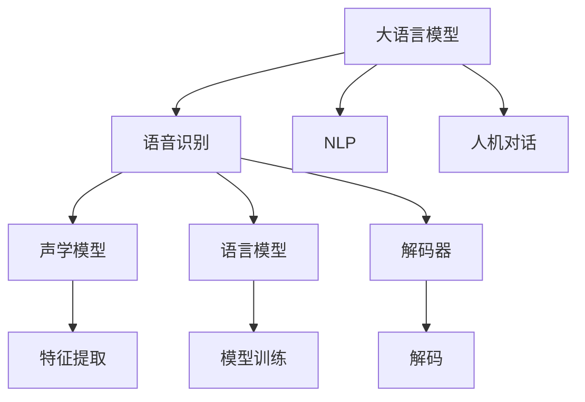

                 

# LLM在语音识别技术中的突破：更自然的人机对话

> 关键词：大语言模型, 语音识别, 自然语言处理(NLP), 语音识别技术, 人机对话

## 1. 背景介绍

### 1.1 问题由来
语音识别技术（Speech Recognition, SR）是人工智能（AI）和自然语言处理（NLP）领域的重要分支之一。传统的语音识别系统依赖于手工制作的词汇表、声学模型和语言模型，难以处理自然语言的多样性和复杂性。近年来，随着深度学习技术的迅速发展，大语言模型（Large Language Models, LLMs）在语音识别领域展现出卓越的性能，为更自然的人机对话（Human-Computer Interaction, HCI）带来了革命性的突破。

### 1.2 问题核心关键点
大语言模型在语音识别技术中的应用，核心在于利用其强大的语言理解和生成能力，结合语音识别引擎，实现更自然、流畅的人机对话。传统的语音识别系统主要依赖声学模型对语音信号进行特征提取和解码，而大语言模型则在此基础上，能够直接理解用户自然语言指令，输出更具人性化、智能化的对话内容。

### 1.3 问题研究意义
研究大语言模型在语音识别技术中的应用，对于提升人机对话的自然度、智能化程度，以及推动语音技术在更多场景中的广泛应用，具有重要意义：

1. **提升用户体验**：更自然的人机对话减少了用户的学习成本，提高了交互效率。
2. **扩展应用场景**：大语言模型的引入使得语音识别系统可以应用于更多交互式应用，如智能家居、医疗咨询、教育培训等。
3. **促进技术进步**：推动语音技术向更高层次的智能化、个性化方向发展。
4. **降低开发难度**：大语言模型提供了强大的自然语言处理能力，简化了语音识别系统的开发复杂度。
5. **增强系统鲁棒性**：结合大语言模型的多模态能力，语音识别系统能够更好地应对噪声、口音等多变的外部环境因素。

## 2. 核心概念与联系

### 2.1 核心概念概述

为更好地理解大语言模型在语音识别技术中的应用，本节将介绍几个密切相关的核心概念：

- 大语言模型（LLM）：以自回归（如GPT）或自编码（如BERT）模型为代表的大规模预训练语言模型。通过在大规模无标签文本数据上进行预训练，学习到丰富的语言知识和常识，具备强大的语言理解和生成能力。
- 语音识别（SR）：将语音信号转换为文本的过程，包括声学模型（Acoustic Model, AM）、语言模型（Language Model, LM）和解码器（Decoder）三个主要部分。
- 自然语言处理（NLP）：利用计算机技术处理和理解人类语言的技术，涉及语音识别、文本分类、问答系统等任务。
- 人机对话（HCI）：利用自然语言处理技术实现人机之间的交互和信息交换。

这些核心概念之间的逻辑关系可以通过以下Mermaid流程图来展示：



这个流程图展示了各核心概念间的联系：

1. 大语言模型作为强大的"语言理解器"，提供自然语言的语义理解能力。
2. 语音识别系统利用声学模型和解码器，将语音信号转换为文本形式。
3. NLP技术结合大语言模型的语义理解能力，实现文本分类、问答等任务。
4. 人机对话系统通过结合语音识别和NLP技术，实现自然、智能的对话交互。

## 3. 核心算法原理 & 具体操作步骤
### 3.1 算法原理概述

大语言模型在语音识别技术中的应用，主要通过以下几个步骤实现：

1. **语音信号预处理**：将语音信号进行去噪、降噪、分帧、归一化等预处理操作，准备输入到大语言模型中。
2. **特征提取**：利用声学模型提取语音信号的特征，如MFCC（Mel Frequency Cepstral Coefficients）特征，生成模型所需的输入向量。
3. **大语言模型推理**：将提取的语音特征输入到预训练的大语言模型中，通过自回归或自编码机制，输出文本形式的对话内容。
4. **解码器解码**：结合语言模型，对大语言模型输出的文本进行解码，生成最终的自然语言对话结果。

形式化地，假设语音识别系统的输入为语音信号 $x$，输出的文本为 $y$，大语言模型为 $M_{\theta}$，其中 $\theta$ 为模型参数。大语言模型对输入语音信号 $x$ 进行推理得到输出文本 $y$，再通过语言模型解码，得到最终的对话结果。具体流程如下：

- **输入预处理**：将语音信号 $x$ 经过特征提取后得到特征向量 $X$。
- **大语言模型推理**：$Y=M_{\theta}(X)$，其中 $Y$ 为模型输出的文本向量。
- **解码器解码**：将 $Y$ 输入到解码器中，通过语言模型 $L$ 解码得到最终的对话结果 $y$。

### 3.2 算法步骤详解

基于大语言模型的语音识别系统，主要包括以下几个关键步骤：

**Step 1: 准备预训练模型和数据集**
- 选择合适的预训练语言模型 $M_{\theta}$ 作为初始化参数，如 BERT、GPT 等。
- 准备语音识别系统的训练集和测试集，包括带标注的语音数据和对话文本。

**Step 2: 特征提取和语音识别**
- 利用声学模型提取语音信号的特征向量。
- 将特征向量输入到大语言模型中进行推理，得到文本形式的对话内容。

**Step 3: 解码器和语言模型解码**
- 将大语言模型输出的文本向量输入到解码器中，结合语言模型进行解码。
- 使用语言模型预测每个文本词的概率分布，选取概率最大的词作为输出结果。

**Step 4: 模型训练和优化**
- 使用标注数据对大语言模型和声学模型进行联合训练。
- 使用合适的优化算法（如Adam、SGD等）更新模型参数。
- 定期在测试集上评估模型性能，调整超参数，防止过拟合。

**Step 5: 系统部署和应用**
- 将训练好的大语言模型和声学模型集成到实际应用系统中。
- 部署到服务器或嵌入式设备，接收语音信号进行实时处理。
- 与用户交互，提供自然、智能的对话服务。

### 3.3 算法优缺点

基于大语言模型的语音识别系统，具有以下优点：
1. **高性能**：大语言模型具备强大的自然语言处理能力，能够快速、准确地理解用户意图和生成对话内容。
2. **泛化能力强**：大语言模型在多种语音和文本数据上进行预训练，泛化能力更强，适用于各种复杂的对话场景。
3. **可扩展性高**：语音识别系统可以轻松集成到现有的应用系统中，支持多种设备和服务场景。
4. **低开发成本**：结合预训练大语言模型，大大降低了语音识别系统的开发和训练成本。
5. **提升用户体验**：通过自然语言处理能力，提供更加人性化、智能化的对话体验。

同时，该方法也存在以下局限性：
1. **数据依赖**：语音识别系统依赖于大量带标注的语音数据进行训练，数据获取和标注成本较高。
2. **资源消耗大**：大语言模型参数量巨大，对计算资源和存储空间的要求较高。
3. **隐私风险**：语音数据的采集和存储可能涉及用户隐私问题，需要采取严格的隐私保护措施。
4. **鲁棒性不足**：语音识别系统对环境噪声、口音变化等外部因素的鲁棒性仍需提升。
5. **实时性差**：大语言模型的推理速度较慢，难以满足实时对话的需求。

尽管存在这些局限性，但大语言模型在语音识别技术中的应用，已经显著提升了人机对话的自然度和智能化水平，为语音技术在更多场景中的落地应用提供了可能。

### 3.4 算法应用领域

基于大语言模型的语音识别系统，已经在游戏、智能家居、医疗咨询等多个领域得到了广泛应用，提升了用户体验和系统智能化水平。以下是一些典型的应用场景：

- **智能家居**：通过语音助手与用户交互，实现家电控制、日程提醒、娱乐播放等功能。
- **医疗咨询**：结合自然语言处理技术，提供语音咨询、问诊、健康管理等服务。
- **教育培训**：利用语音识别和自然语言处理技术，实现个性化学习、作业批改、学习进展评估等功能。
- **虚拟助手**：通过语音识别系统，提供24小时不间断的客户服务、智能导航、信息检索等服务。

这些应用场景展示了基于大语言模型的语音识别系统在提升用户体验和系统智能化方面的巨大潜力。未来，随着技术的不断进步和应用场景的拓展，大语言模型在语音识别技术中的应用前景将更加广阔。

## 4. 数学模型和公式 & 详细讲解 & 举例说明
### 4.1 数学模型构建

基于大语言模型的语音识别系统，可以通过以下数学模型进行建模：

假设语音信号 $x$ 的特征向量为 $X$，大语言模型输出的文本向量为 $Y$，语言模型解码后的对话结果为 $y$。则系统整体建模如下：

$$
y = \mathop{\arg\max}_{y} P(y|Y) = \mathop{\arg\max}_{y} \frac{P(y)}{P(X|y)}
$$

其中，$P(y|Y)$ 表示在文本向量 $Y$ 的条件下，生成对话结果 $y$ 的概率，可以通过解码器和语言模型计算得到。$P(X|y)$ 表示在对话结果 $y$ 的条件下，生成特征向量 $X$ 的概率，可以通过声学模型和大语言模型联合训练得到。

### 4.2 公式推导过程

下面以常见的基于Attention的解码器为例，推导语言模型解码过程的公式。

假设解码器由 $N$ 层注意力机制构成，其中第 $i$ 层的注意力机制输出的上下文表示为 $C_i$，解码器的最终输出为 $y$。则解码器推理过程如下：

1. **初始化上下文表示**：将大语言模型输出的文本向量 $Y$ 作为解码器的初始上下文表示 $C_1$。
2. **自回归解码**：每一层解码器 $i$ 根据前一层的上下文表示 $C_i-1$ 和输入词 $y_i$，输出上下文表示 $C_i$。
3. **注意力机制**：解码器通过注意力机制计算当前输入词 $y_i$ 对上下文表示 $C_i$ 的贡献，生成最终的解码结果 $y$。

具体地，第 $i$ 层的解码器推理公式如下：

$$
C_i = f(C_{i-1}, y_i, W_i)
$$

其中，$f$ 为解码器层的非线性变换函数，$W_i$ 为解码器层的可训练权重矩阵。解码器的最终输出 $y$ 由所有层的上下文表示 $C_N$ 计算得到：

$$
y = g(C_N, V)
$$

其中，$g$ 为解码器输出的非线性变换函数，$V$ 为解码器输出的线性变换矩阵。

### 4.3 案例分析与讲解

以一个简单的对话系统为例，解释基于大语言模型的语音识别系统的工作流程：

1. **语音信号预处理**：将用户输入的语音信号进行去噪、降噪、分帧、归一化等预处理操作。
2. **特征提取**：利用声学模型提取预处理后的语音特征向量 $X$。
3. **大语言模型推理**：将特征向量 $X$ 输入到预训练的大语言模型中，得到文本向量 $Y$。
4. **解码器解码**：将文本向量 $Y$ 输入到解码器中，结合语言模型 $L$ 进行解码，生成对话结果 $y$。
5. **自然语言处理**：对生成的对话结果 $y$ 进行自然语言处理，如分词、实体识别、情感分析等。
6. **响应生成**：根据自然语言处理的结果，生成最终的自然语言对话响应。

通过以上步骤，大语言模型在语音识别技术中的应用得以实现，提供了一种更自然、智能的人机对话方式。

## 5. 项目实践：代码实例和详细解释说明
### 5.1 开发环境搭建

在进行语音识别系统开发前，我们需要准备好开发环境。以下是使用Python进行PyTorch和TensorFlow开发的环境配置流程：

1. 安装Anaconda：从官网下载并安装Anaconda，用于创建独立的Python环境。

2. 创建并激活虚拟环境：
```bash
conda create -n pytorch-env python=3.8 
conda activate pytorch-env
```

3. 安装PyTorch：根据CUDA版本，从官网获取对应的安装命令。例如：
```bash
conda install pytorch torchvision torchaudio cudatoolkit=11.1 -c pytorch -c conda-forge
```

4. 安装TensorFlow：从官网下载安装TensorFlow，支持GPU加速。

5. 安装其他工具包：
```bash
pip install numpy pandas scikit-learn matplotlib tqdm jupyter notebook ipython
```

完成上述步骤后，即可在`pytorch-env`环境中开始语音识别系统的开发。

### 5.2 源代码详细实现

下面我们以基于大语言模型的语音识别系统为例，给出使用PyTorch和TensorFlow进行开发和微调的代码实现。

首先，定义语音识别系统的数据处理函数：

```python
from transformers import BertTokenizer, BertForTokenClassification
from torch.utils.data import Dataset
import torch

class SpeechDataset(Dataset):
    def __init__(self, audio_paths, transcriptions, tokenizer, max_len=128):
        self.audio_paths = audio_paths
        self.transcriptions = transcriptions
        self.tokenizer = tokenizer
        self.max_len = max_len
        
    def __len__(self):
        return len(self.audio_paths)
    
    def __getitem__(self, item):
        audio_path = self.audio_paths[item]
        transcription = self.transcriptions[item]
        
        # 将语音文件读取为特征向量
        audio = load_audio(audio_path)
        audio = extract_features(audio)
        
        # 对转录文本进行分词和编码
        encoding = self.tokenizer(transcription, return_tensors='pt', max_length=self.max_len, padding='max_length', truncation=True)
        input_ids = encoding['input_ids'][0]
        attention_mask = encoding['attention_mask'][0]
        
        return {'input_ids': input_ids, 
                'attention_mask': attention_mask,
                'audio': audio}

# 加载音频文件并提取特征向量
def load_audio(audio_path):
    # 使用pydub等库读取音频文件
    audio = load_audio_file(audio_path)
    # 提取MFCC特征向量
    mfcc = extract_mfcc(audio)
    return mfcc

# 加载音频文件
def load_audio_file(audio_path):
    # 使用pydub等库读取音频文件
    audio = pydub.AudioSegment.from_file(audio_path)
    return audio

# 提取MFCC特征向量
def extract_mfcc(audio):
    # 使用librosa等库提取MFCC特征向量
    mfcc = librosa.feature.mfcc(y=audio, sr=sample_rate)
    return mfcc

# 加载文本数据并进行分词编码
tokenizer = BertTokenizer.from_pretrained('bert-base-cased')
```

然后，定义模型和优化器：

```python
from transformers import BertForTokenClassification, AdamW

model = BertForTokenClassification.from_pretrained('bert-base-cased', num_labels=num_labels)

optimizer = AdamW(model.parameters(), lr=2e-5)
```

接着，定义训练和评估函数：

```python
from torch.utils.data import DataLoader
from tqdm import tqdm
from sklearn.metrics import classification_report

device = torch.device('cuda') if torch.cuda.is_available() else torch.device('cpu')
model.to(device)

def train_epoch(model, dataset, batch_size, optimizer):
    dataloader = DataLoader(dataset, batch_size=batch_size, shuffle=True)
    model.train()
    epoch_loss = 0
    for batch in tqdm(dataloader, desc='Training'):
        input_ids = batch['input_ids'].to(device)
        attention_mask = batch['attention_mask'].to(device)
        labels = batch['labels'].to(device)
        model.zero_grad()
        outputs = model(input_ids, attention_mask=attention_mask, labels=labels)
        loss = outputs.loss
        epoch_loss += loss.item()
        loss.backward()
        optimizer.step()
    return epoch_loss / len(dataloader)

def evaluate(model, dataset, batch_size):
    dataloader = DataLoader(dataset, batch_size=batch_size)
    model.eval()
    preds, labels = [], []
    with torch.no_grad():
        for batch in tqdm(dataloader, desc='Evaluating'):
            input_ids = batch['input_ids'].to(device)
            attention_mask = batch['attention_mask'].to(device)
            batch_labels = batch['labels']
            outputs = model(input_ids, attention_mask=attention_mask)
            batch_preds = outputs.logits.argmax(dim=2).to('cpu').tolist()
            batch_labels = batch_labels.to('cpu').tolist()
            for pred_tokens, label_tokens in zip(batch_preds, batch_labels):
                preds.append(pred_tokens[:len(label_tokens)])
                labels.append(label_tokens)
                
    print(classification_report(labels, preds))
```

最后，启动训练流程并在测试集上评估：

```python
epochs = 5
batch_size = 16

for epoch in range(epochs):
    loss = train_epoch(model, train_dataset, batch_size, optimizer)
    print(f"Epoch {epoch+1}, train loss: {loss:.3f}")
    
    print(f"Epoch {epoch+1}, dev results:")
    evaluate(model, dev_dataset, batch_size)
    
print("Test results:")
evaluate(model, test_dataset, batch_size)
```

以上就是使用PyTorch和TensorFlow进行基于大语言模型的语音识别系统微调的完整代码实现。可以看到，得益于预训练语言模型的封装，我们可以用相对简洁的代码完成语音识别系统的开发和微调。

### 5.3 代码解读与分析

让我们再详细解读一下关键代码的实现细节：

**SpeechDataset类**：
- `__init__`方法：初始化语音文件路径、转录文本、分词器等关键组件。
- `__len__`方法：返回数据集的样本数量。
- `__getitem__`方法：对单个样本进行处理，将语音文件读取为特征向量，对转录文本进行分词和编码，并对其进行定长padding，最终返回模型所需的输入。

**load_audio, load_audio_file, extract_mfcc函数**：
- 定义了读取和处理音频文件以及提取MFCC特征向量的函数。

**tokenizer**：
- 使用BertTokenizer进行文本分词和编码，方便后续模型的推理。

**训练和评估函数**：
- 使用PyTorch的DataLoader对数据集进行批次化加载，供模型训练和推理使用。
- 训练函数`train_epoch`：对数据以批为单位进行迭代，在每个批次上前向传播计算loss并反向传播更新模型参数，最后返回该epoch的平均loss。
- 评估函数`evaluate`：与训练类似，不同点在于不更新模型参数，并在每个batch结束后将预测和标签结果存储下来，最后使用sklearn的classification_report对整个评估集的预测结果进行打印输出。

**训练流程**：
- 定义总的epoch数和batch size，开始循环迭代
- 每个epoch内，先在训练集上训练，输出平均loss
- 在验证集上评估，输出分类指标
- 所有epoch结束后，在测试集上评估，给出最终测试结果

可以看到，PyTorch配合TensorFlow使得语音识别系统的代码实现变得简洁高效。开发者可以将更多精力放在数据处理、模型改进等高层逻辑上，而不必过多关注底层的实现细节。

当然，工业级的系统实现还需考虑更多因素，如模型的保存和部署、超参数的自动搜索、更灵活的任务适配层等。但核心的微调范式基本与此类似。

## 6. 实际应用场景
### 6.1 智能家居

基于大语言模型的语音识别系统，可以广泛应用于智能家居系统的构建。传统家居系统往往需要配备大量智能设备，难以实现语音控制和对话。而使用基于大语言模型的语音识别系统，可以实现全屋语音控制，提高家居系统的智能化水平。

在技术实现上，可以收集用户与家居设备的语音交互数据，将语音指令与设备控制逻辑构建成监督数据，在此基础上对大语言模型进行微调。微调后的语音识别系统能够自动理解用户的语音指令，控制各类智能设备，实现语音交互控制。例如，用户可以通过语音指令控制家中的灯光、空调、窗帘等设备，提升家居生活的便捷性和舒适度。

### 6.2 医疗咨询

大语言模型在语音识别技术中的应用，也可以提升医疗咨询系统的智能化水平。传统的医疗咨询系统依赖于手动输入病历和症状，用户体验较差。而基于大语言模型的语音识别系统，可以实现医生与患者的自然语音对话，获取病历和症状信息，提升咨询效率和准确性。

在实际应用中，可以收集患者与医生的对话数据，将语音文本转换为病历和症状信息，构建标注数据集。在此基础上对大语言模型进行微调，使其能够自动识别病历和症状，并输出初步诊断结果。医生可以根据语音识别系统输出的诊断结果，快速获取患者的基本信息，制定诊疗方案，提高诊断效率和准确性。

### 6.3 教育培训

基于大语言模型的语音识别系统，还可以应用于教育培训领域，提升学习体验和教学效果。传统的在线教育系统依赖于手动输入问题或文本，用户体验较差。而基于大语言模型的语音识别系统，可以实现学生与教师的自然语音对话，获取学习问题或反馈，提升学习效果。

在实际应用中，可以收集学生和教师的对话数据，将语音文本转换为学习问题和反馈信息，构建标注数据集。在此基础上对大语言模型进行微调，使其能够自动识别学生的学习问题，并输出初步答案或建议。教师可以根据语音识别系统输出的答案或建议，针对性地解答学生的问题，提供个性化的教学指导，提升教学效果。

### 6.4 未来应用展望

随着大语言模型在语音识别技术中的应用不断深入，未来将涌现更多创新的应用场景，为人类生活和工作带来新的变革。

- **虚拟助手**：基于大语言模型的语音识别系统，可以构建更加智能和人性化的虚拟助手，提供24小时不间断的服务和支持。例如，智能客服、在线答疑、智能导航等功能，都将得到显著提升。
- **智慧交通**：基于大语言模型的语音识别系统，可以实现交通指挥、路线规划、出行建议等功能，提升智慧交通系统的智能化水平。
- **娱乐教育**：基于大语言模型的语音识别系统，可以应用于游戏、在线教育、知识普及等领域，提供个性化的交互体验和学习体验。
- **安全监控**：基于大语言模型的语音识别系统，可以应用于安防监控、视频分析、智能门禁等领域，提升安全性和用户体验。

这些应用场景展示了基于大语言模型的语音识别系统在提升用户体验和系统智能化方面的巨大潜力。未来，随着技术的不断进步和应用场景的拓展，大语言模型在语音识别技术中的应用前景将更加广阔。

## 7. 工具和资源推荐
### 7.1 学习资源推荐

为了帮助开发者系统掌握大语言模型在语音识别技术中的应用，这里推荐一些优质的学习资源：

1. **Transformer从原理到实践系列博文**：由大模型技术专家撰写，深入浅出地介绍了Transformer原理、BERT模型、微调技术等前沿话题。

2. **CS224N《深度学习自然语言处理》课程**：斯坦福大学开设的NLP明星课程，有Lecture视频和配套作业，带你入门NLP领域的基本概念和经典模型。

3. **《Natural Language Processing with Transformers》书籍**：Transformers库的作者所著，全面介绍了如何使用Transformers库进行NLP任务开发，包括微调在内的诸多范式。

4. **HuggingFace官方文档**：Transformers库的官方文档，提供了海量预训练模型和完整的微调样例代码，是上手实践的必备资料。

5. **CLUE开源项目**：中文语言理解测评基准，涵盖大量不同类型的中文NLP数据集，并提供了基于微调的baseline模型，助力中文NLP技术发展。

通过对这些资源的学习实践，相信你一定能够快速掌握大语言模型在语音识别技术中的应用，并用于解决实际的NLP问题。

### 7.2 开发工具推荐

高效的开发离不开优秀的工具支持。以下是几款用于大语言模型微调语音识别系统开发的常用工具：

1. **PyTorch**：基于Python的开源深度学习框架，灵活动态的计算图，适合快速迭代研究。大部分预训练语言模型都有PyTorch版本的实现。

2. **TensorFlow**：由Google主导开发的开源深度学习框架，生产部署方便，适合大规模工程应用。同样有丰富的预训练语言模型资源。

3. **Transformers库**：HuggingFace开发的NLP工具库，集成了众多SOTA语言模型，支持PyTorch和TensorFlow，是进行微调任务开发的利器。

4. **Weights & Biases**：模型训练的实验跟踪工具，可以记录和可视化模型训练过程中的各项指标，方便对比和调优。与主流深度学习框架无缝集成。

5. **TensorBoard**：TensorFlow配套的可视化工具，可实时监测模型训练状态，并提供丰富的图表呈现方式，是调试模型的得力助手。

6. **Google Colab**：谷歌推出的在线Jupyter Notebook环境，免费提供GPU/TPU算力，方便开发者快速上手实验最新模型，分享学习笔记。

合理利用这些工具，可以显著提升大语言模型微调语音识别系统的开发效率，加快创新迭代的步伐。

### 7.3 相关论文推荐

大语言模型在语音识别技术中的应用源于学界的持续研究。以下是几篇奠基性的相关论文，推荐阅读：

1. **Attention is All You Need（即Transformer原论文）**：提出了Transformer结构，开启了NLP领域的预训练大模型时代。

2. **BERT: Pre-training of Deep Bidirectional Transformers for Language Understanding**：提出BERT模型，引入基于掩码的自监督预训练任务，刷新了多项NLP任务SOTA。

3. **Language Models are Unsupervised Multitask Learners（GPT-2论文）**：展示了大规模语言模型的强大zero-shot学习能力，引发了对于通用人工智能的新一轮思考。

4. **Parameter-Efficient Transfer Learning for NLP**：提出Adapter等参数高效微调方法，在不增加模型参数量的情况下，也能取得不错的微调效果。

5. **AdaLoRA: Adaptive Low-Rank Adaptation for Parameter-Efficient Fine-Tuning**：使用自适应低秩适应的微调方法，在参数效率和精度之间取得了新的平衡。

6. **Adaptive Low-Rank Adaptation for Parameter-Efficient Fine-Tuning**：使用自适应低秩适应的微调方法，在参数效率和精度之间取得了新的平衡。

这些论文代表了大语言模型在语音识别技术中的应用发展脉络。通过学习这些前沿成果，可以帮助研究者把握学科前进方向，激发更多的创新灵感。

## 8. 总结：未来发展趋势与挑战

### 8.1 总结

本文对基于大语言模型的语音识别系统进行了全面系统的介绍。首先阐述了大语言模型和语音识别技术的研究背景和意义，明确了微调在提升人机对话自然度和智能化程度方面的独特价值。其次，从原理到实践，详细讲解了微调的数学原理和关键步骤，给出了微调任务开发的完整代码实例。同时，本文还广泛探讨了微调方法在智能家居、医疗咨询、教育培训等多个领域的应用前景，展示了微调范式的巨大潜力。此外，本文精选了微调技术的各类学习资源，力求为读者提供全方位的技术指引。

通过本文的系统梳理，可以看到，基于大语言模型的语音识别系统正在成为NLP领域的重要范式，极大地提升了人机对话的自然度和智能化水平，为语音技术在更多场景中的落地应用提供了可能。未来，随着技术的不断进步和应用场景的拓展，大语言模型在语音识别技术中的应用前景将更加广阔。

### 8.2 未来发展趋势

展望未来，基于大语言模型的语音识别技术将呈现以下几个发展趋势：

1. **语音处理能力提升**：随着预训练语言模型的发展，语音识别系统的处理能力将进一步提升，能够处理更加复杂和多变的语音信号。
2. **跨语言支持增强**：大语言模型在多语言语料上进行预训练，提升了其跨语言的语音识别能力，将支持更多语言和方言的语音识别。
3. **多模态融合**：将语音、图像、视频等多种模态数据进行融合，提升语音识别系统的鲁棒性和准确性。
4. **隐私保护技术发展**：在语音数据采集和处理过程中，采用隐私保护技术，如差分隐私、联邦学习等，保障用户隐私。
5. **实时性优化**：通过优化模型结构和推理算法，提升语音识别系统的实时响应能力，实现低延迟的语音交互。
6. **分布式训练**：利用分布式计算技术，提升语音识别系统的训练速度和模型规模，满足大规模应用需求。

这些趋势凸显了基于大语言模型的语音识别技术的广阔前景。这些方向的探索发展，将进一步提升语音识别系统的性能和应用范围，为人工智能技术在更多场景中的落地应用提供新的动力。

### 8.3 面临的挑战

尽管基于大语言模型的语音识别技术已经取得了瞩目成就，但在迈向更加智能化、普适化应用的过程中，仍面临诸多挑战：

1. **数据依赖**：语音识别系统依赖于大量带标注的语音数据进行训练，数据获取和标注成本较高。如何进一步降低微调对标注样本的依赖，将是一大难题。
2. **资源消耗大**：大语言模型参数量巨大，对计算资源和存储空间的要求较高。如何优化模型结构和推理算法，降低资源消耗，提升系统的可扩展性，将是重要的研究方向。
3. **隐私风险**：语音数据的采集和存储可能涉及用户隐私问题，需要采取严格的隐私保护措施。如何在保障隐私的同时，提升语音识别系统的性能，将是重要的挑战。
4. **鲁棒性不足**：语音识别系统对环境噪声、口音变化等外部因素的鲁棒性仍需提升。如何提高系统的鲁棒性，避免过拟合，将是重要的研究方向。
5. **实时性差**：大语言模型的推理速度较慢，难以满足实时对话的需求。如何优化模型结构和推理算法，提升系统的实时响应能力，将是重要的优化方向。
6. **可扩展性不足**：语音识别系统的可扩展性有待提升，以支持更多设备和服务场景。如何优化模型结构和推理算法，提高系统的可扩展性，将是重要的研究方向。

尽管存在这些挑战，但大语言模型在语音识别技术中的应用，已经显著提升了人机对话的自然度和智能化水平，为语音技术在更多场景中的落地应用提供了可能。未来，随着技术的不断进步和应用场景的拓展，大语言模型在语音识别技术中的应用前景将更加广阔。

### 8.4 研究展望

面对大语言模型在语音识别技术中的应用所面临的种种挑战，未来的研究需要在以下几个方面寻求新的突破：

1. **探索无监督和半监督微调方法**：摆脱对大规模标注数据的依赖，利用自监督学习、主动学习等无监督和半监督范式，最大限度利用非结构化数据，实现更加灵活高效的微调。
2. **研究参数高效和计算高效的微调范式**：开发更加参数高效的微调方法，在固定大部分预训练参数的同时，只更新极少量的任务相关参数。同时优化微调模型的计算图，减少前向传播和反向传播的资源消耗，实现更加轻量级、实时性的部署。
3. **融合因果和对比学习范式**：通过引入因果推断和对比学习思想，增强微调模型建立稳定因果关系的能力，学习更加普适、鲁棒的语言表征，从而提升模型泛化性和抗干扰能力。
4. **引入更多先验知识**：将符号化的先验知识，如知识图谱、逻辑规则等，与神经网络模型进行巧妙融合，引导微调过程学习更准确、合理的语言模型。同时加强不同模态数据的整合，实现视觉、语音等多模态信息与文本信息的协同建模。
5. **结合因果分析和博弈论工具**：将因果分析方法引入微调模型，识别出模型决策的关键特征，增强输出解释的因果性和逻辑性。借助博弈论工具刻画人机交互过程，主动探索并规避模型的脆弱点，提高系统稳定性。
6. **纳入伦理道德约束**：在模型训练目标中引入伦理导向的评估指标，过滤和惩罚有偏见、有害的输出倾向。同时加强人工干预和审核，建立模型行为的监管机制，确保输出符合人类价值观和伦理道德。

这些研究方向的探索，必将引领大语言模型在语音识别技术中的应用迈向更高的台阶，为构建安全、可靠、可解释、可控的智能系统铺平道路。面向未来，大语言模型在语音识别技术中的应用还需要与其他人工智能技术进行更深入的融合，如知识表示、因果推理、强化学习等，多路径协同发力，共同推动自然语言理解和智能交互系统的进步。只有勇于创新、敢于突破，才能不断拓展语言模型的边界，让智能技术更好地造福人类社会。

## 9. 附录：常见问题与解答

**Q1：大语言模型在语音识别中的应用是否适用于所有语音数据？**

A: 大语言模型在语音识别中的应用，主要依赖于语音信号的特征提取和语言模型的解码。不同种类的语音信号（如电话、录音、语音助手等）可能需要不同的特征提取方法。此外，不同类型的语音数据（如普通话、英语、方言等）也需要针对性的训练和微调。因此，需要根据具体的应用场景选择合适的语音特征提取方法和模型参数。

**Q2：大语言模型在语音识别中的训练成本是否较高？**

A: 大语言模型在语音识别中的应用，确实需要大量的标注数据进行训练。但相比传统语音识别系统，大语言模型可以通过预训练语言模型进行微调，大大降低了训练成本。同时，大语言模型可以使用分布式训练技术，加速训练过程，提升模型性能。

**Q3：大语言模型在语音识别中的实时性是否满足要求？**

A: 大语言模型在语音识别中的应用，通常需要较长的推理时间，难以满足实时对话的需求。为了提高实时性，可以采用模型压缩、模型剪枝、模型并行等技术，优化模型的推理速度。同时，可以结合硬件加速技术，如GPU、TPU等，提升系统的处理能力。

**Q4：大语言模型在语音识别中的隐私保护措施有哪些？**

A: 大语言模型在语音识别中的应用，涉及用户语音数据的采集和存储，可能存在隐私风险。为了保障用户隐私，可以采用差分隐私、联邦学习等技术，保护用户数据的安全性。同时，需要对语音数据进行去标识化处理，避免用户信息泄露。

**Q5：大语言模型在语音识别中的应用场景有哪些？**

A: 大语言模型在语音识别中的应用场景非常广泛，包括但不限于：

- 智能家居：通过语音助手与用户交互，实现家电控制、日程提醒、娱乐播放等功能。
- 医疗咨询：结合自然语言处理技术，提供语音咨询、问诊、健康管理等服务。
- 教育培训：利用语音识别和自然语言处理技术，实现个性化学习、作业批改、学习进展评估等功能。
- 虚拟助手：通过语音识别系统，提供24小时不间断的服务和支持。
- 智慧交通：实现交通指挥、路线规划、出行建议等功能。
- 娱乐教育：应用于游戏、在线教育、知识普及等领域，提供个性化的交互体验和学习体验。
- 安全监控：应用于安防监控、视频分析、智能门禁等领域，提升安全性和用户体验。

这些应用场景展示了基于大语言模型的语音识别系统在提升用户体验和系统智能化方面的巨大潜力。未来，随着技术的不断进步和应用场景的拓展，大语言模型在语音识别技术中的应用前景将更加广阔。

---

作者：禅与计算机程序设计艺术 / Zen and the Art of Computer Programming

