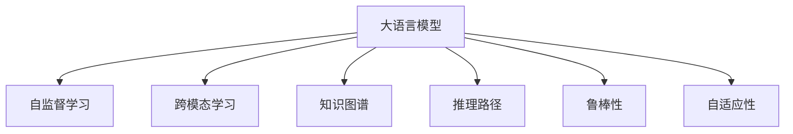

                 

# LLM在风险评估中的潜在作用

## 1. 背景介绍

### 1.1 问题由来

在金融、保险、医疗等多个领域，风险评估一直是核心业务之一。传统的风险评估依赖于经验、规则和模型，但这些方法的局限性日益凸显：

- 缺乏适应性和实时性。传统的规则和模型通常基于历史数据构建，难以应对实时变化的风险环境。
- 规则复杂，难以整合。业务规则可能涉及多维度数据，复杂且难以整合。
- 模型可解释性差。传统的复杂模型往往难以解释其决策过程，导致信任度低。

随着人工智能技术的发展，特别是大语言模型(LLM)的崛起，为风险评估提供了新的思路。LLM通过在大量无标签文本数据上进行预训练，学习到丰富的语言知识，具备强大的语义理解能力，能够实时、自动地对文本数据进行风险评估。

### 1.2 问题核心关键点

LLM在风险评估中的核心关键点包括：

- 实时性：LLM能够对新数据进行实时评估，快速响应风险变化。
- 自适应性：LLM通过大量无标签数据预训练，具备良好的适应性，能够应对新的风险环境。
- 自监督学习能力：LLM通过自监督学习，从文本数据中自动提取特征，无需过多标注数据。
- 跨模态融合能力：LLM不仅能够处理文本数据，还可以融合图像、音频等多模态信息。
- 可解释性：LLM通过基于规则和逻辑的推理过程，生成易于理解的输出，提高了决策的可解释性。
- 高灵活性：LLM可以通过微调适应不同领域的风险评估需求。

这些关键点使得LLM在风险评估中具有独特的优势，能够解决传统方法难以应对的问题，具有广阔的应用前景。

## 2. 核心概念与联系

### 2.1 核心概念概述

为更好地理解LLM在风险评估中的应用，本节将介绍几个密切相关的核心概念：

- 大语言模型(LLM)：指通过自监督学习在大量无标签文本数据上预训练得到的语言模型，具备强大的语义理解和生成能力。
- 自监督学习(Self-Supervised Learning)：指在没有标注数据的情况下，通过从数据本身设计目标函数，训练模型学习数据内在结构的方法。
- 跨模态学习(Cross-Modal Learning)：指模型能够融合多种数据模态，如文本、图像、音频等，实现更全面的信息理解。
- 知识图谱(Knowledge Graph)：指将领域知识结构化表示为节点和边的图，用于增强模型的知识推理能力。
- 推理路径(Reasoning Path)：指模型从输入到输出的推理过程，可以用于解释模型的决策过程。
- 鲁棒性(Robustness)：指模型对噪声、对抗攻击等的抵抗能力。
- 自适应性(Adaptability)：指模型在新的数据分布上表现良好，能够适应环境变化。

这些核心概念之间的逻辑关系可以通过以下Mermaid流程图来展示：



这个流程图展示了大语言模型和相关概念之间的紧密联系：

1. 大语言模型通过自监督学习从无标签文本中学习语言知识。
2. 跨模态学习使模型能够处理多种数据模态，实现更全面的信息理解。
3. 知识图谱帮助模型从结构化知识中学习推理逻辑。
4. 推理路径提供模型决策过程的解释，提高可解释性。
5. 鲁棒性和自适应性确保模型在不同环境和数据分布上表现稳定。

这些概念共同构成了大语言模型在风险评估中的基础框架，为其提供强大的支撑。

## 3. 核心算法原理 & 具体操作步骤

### 3.1 算法原理概述

基于LLM的风险评估，主要利用其自监督学习和推理能力，对输入文本进行语义理解和风险评估。具体来说，LLM通过在大量无标签数据上进行预训练，学习到丰富的语言知识和语义结构。在此基础上，通过微调模型，使其能够适应特定领域的风险评估需求。

假设风险评估任务为$T$，输入文本为$x$，风险标签为$y$，模型的目标函数为$\mathcal{L}$。风险评估的数学模型可以表示为：

$$
\mathcal{L}(y, M_{\theta}(x)) = \log P(y|M_{\theta}(x))
$$

其中$P(y|M_{\theta}(x))$为模型在给定文本$x$下的风险预测概率，$M_{\theta}$为预训练大语言模型，$\theta$为模型参数。

在风险评估过程中，通过训练集$D=\{(x_i, y_i)\}_{i=1}^N$上的数据进行有监督微调，使得模型在未见过的测试数据上的风险预测精度$P(y|M_{\theta}(x))$尽可能高。

### 3.2 算法步骤详解

基于LLM的风险评估流程包括：

**Step 1: 数据准备**
- 收集领域内的无标签文本数据，作为预训练语料。
- 对文本进行预处理，如去除停用词、分词、词干提取等。
- 设计任务目标函数，如风险预测概率等。

**Step 2: 模型初始化**
- 选择预训练大语言模型$M_{\theta}$，如BERT、GPT等。
- 将预训练模型的权重作为初始化参数，进行风险评估微调。

**Step 3: 任务适配层设计**
- 根据风险评估任务设计合适的任务适配层，如分类器、回归器等。
- 设计损失函数，如交叉熵、均方误差等。

**Step 4: 微调训练**
- 将预训练模型作为初始化参数，使用有监督的微调数据集$D$进行训练。
- 使用优化器（如AdamW、SGD等）和合适的学习率进行梯度下降。
- 使用正则化技术，如Dropout、L2正则等，防止过拟合。

**Step 5: 模型评估与部署**
- 在验证集和测试集上评估微调后模型的性能。
- 将模型部署到实际应用系统中，进行实时风险评估。
- 定期更新模型参数，以应对新数据分布的变化。

### 3.3 算法优缺点

基于LLM的风险评估方法具有以下优点：

- 自适应性强：LLM能够适应新环境和新数据分布，具备良好的自适应性。
- 实时性好：LLM能够对新数据进行实时评估，快速响应风险变化。
- 可解释性高：通过推理路径和逻辑推理，生成易于理解的输出，提高了决策的可解释性。
- 数据利用率高：自监督学习可以充分利用无标签数据，减少了对标注数据的依赖。

同时，该方法也存在一定的局限性：

- 对文本质量要求高：输入文本质量差时，可能影响模型的准确性。
- 预训练成本高：预训练需要大量计算资源，增加了成本。
- 鲁棒性不足：LLM对输入文本的噪声敏感，鲁棒性较弱。
- 依赖语料多样性：模型性能取决于语料的多样性和覆盖范围。

尽管存在这些局限性，但就目前而言，基于LLM的风险评估方法在实时性、自适应性和可解释性方面具有显著优势，广泛应用于金融风控、医疗诊断等领域。

### 3.4 算法应用领域

基于LLM的风险评估方法已经在金融风控、医疗诊断、反欺诈等多个领域得到了广泛应用，取得了显著效果。

#### 3.4.1 金融风控

在金融领域，风险评估是核心业务之一。传统的风控方法依赖于人工规则和模型，存在成本高、效率低、可解释性差等问题。通过预训练和微调大语言模型，可以实现高效、实时的风险评估：

- 信用风险评估：通过分析客户提交的文本申请，自动评估其信用风险。
- 欺诈检测：对交易行为进行实时监控，自动识别和预警异常交易行为。
- 信用评分：根据客户的社交媒体、网络行为等信息，自动生成信用评分。

#### 3.4.2 医疗诊断

在医疗领域，风险评估对疾病诊断和治疗方案的选择具有重要意义。传统方法依赖于专家经验和规则，存在准确性不高、可解释性差等问题。通过预训练和微调大语言模型，可以自动进行疾病诊断和治疗方案推荐：

- 疾病诊断：自动分析患者文本描述和病历，进行疾病诊断。
- 治疗方案推荐：根据患者症状和病史，自动推荐合适的治疗方案。
- 药物副作用预测：分析患者药物使用情况，自动预测可能的副作用。

#### 3.4.3 反欺诈

在反欺诈领域，及时识别和预防欺诈行为是关键。传统的反欺诈方法依赖于规则和模型，存在识别率低、误报率高的问题。通过预训练和微调大语言模型，可以实现更高效、更准确的反欺诈：

- 异常行为识别：自动分析用户行为数据，识别异常行为模式。
- 欺诈行为预警：对交易行为进行实时监控，自动预警欺诈行为。
- 欺诈行为分类：对疑似欺诈行为进行自动分类和处理。

## 4. 数学模型和公式 & 详细讲解

### 4.1 数学模型构建

假设风险评估任务为$T$，输入文本为$x$，风险标签为$y$。定义模型$M_{\theta}$的预测概率为$P(y|M_{\theta}(x))$，风险评估的数学模型可以表示为：

$$
\mathcal{L}(y, M_{\theta}(x)) = \log P(y|M_{\theta}(x))
$$

其中，$P(y|M_{\theta}(x))$为模型在给定文本$x$下的风险预测概率，$M_{\theta}$为预训练大语言模型，$\theta$为模型参数。

在实际应用中，通常使用分类交叉熵损失函数：

$$
\mathcal{L}(y, M_{\theta}(x)) = -y \log P(y|M_{\theta}(x)) - (1-y) \log (1-P(y|M_{\theta}(x)))
$$

其中，$y$为二元标签（1表示高风险，0表示低风险），$P(y|M_{\theta}(x))$为模型预测的风险概率。

### 4.2 公式推导过程

以二分类任务为例，推导分类交叉熵损失函数的梯度计算公式：

假设模型$M_{\theta}$在输入$x$上的输出为$\hat{y}=M_{\theta}(x) \in [0,1]$，表示样本属于高风险的概率。真实标签$y \in \{0,1\}$。则二分类交叉熵损失函数定义为：

$$
\ell(M_{\theta}(x),y) = -[y\log \hat{y} + (1-y)\log (1-\hat{y})]
$$

将其代入经验风险公式，得：

$$
\mathcal{L}(\theta) = -\frac{1}{N}\sum_{i=1}^N [y_i\log M_{\theta}(x_i)+(1-y_i)\log(1-M_{\theta}(x_i))]
$$

根据链式法则，损失函数对参数$\theta_k$的梯度为：

$$
\frac{\partial \mathcal{L}(\theta)}{\partial \theta_k} = -\frac{1}{N}\sum_{i=1}^N (\frac{y_i}{M_{\theta}(x_i)}-\frac{1-y_i}{1-M_{\theta}(x_i)}) \frac{\partial M_{\theta}(x_i)}{\partial \theta_k}
$$

其中$\frac{\partial M_{\theta}(x_i)}{\partial \theta_k}$可进一步递归展开，利用自动微分技术完成计算。

在得到损失函数的梯度后，即可带入参数更新公式，完成模型的迭代优化。重复上述过程直至收敛，最终得到适应下游任务的最优模型参数$\theta^*$。

### 4.3 案例分析与讲解

以信用风险评估为例，分析LLM在金融领域的应用。

假设模型$M_{\theta}$在输入$x$上的输出为$\hat{y}=M_{\theta}(x) \in [0,1]$，表示客户属于高风险的概率。真实标签$y \in \{0,1\}$。则二分类交叉熵损失函数定义为：

$$
\ell(M_{\theta}(x),y) = -[y\log \hat{y} + (1-y)\log (1-\hat{y})]
$$

将其代入经验风险公式，得：

$$
\mathcal{L}(\theta) = -\frac{1}{N}\sum_{i=1}^N [y_i\log M_{\theta}(x_i)+(1-y_i)\log(1-M_{\theta}(x_i))]
$$

根据链式法则，损失函数对参数$\theta_k$的梯度为：

$$
\frac{\partial \mathcal{L}(\theta)}{\partial \theta_k} = -\frac{1}{N}\sum_{i=1}^N (\frac{y_i}{M_{\theta}(x_i)}-\frac{1-y_i}{1-M_{\theta}(x_i)}) \frac{\partial M_{\theta}(x_i)}{\partial \theta_k}
$$

其中$\frac{\partial M_{\theta}(x_i)}{\partial \theta_k}$可进一步递归展开，利用自动微分技术完成计算。

在得到损失函数的梯度后，即可带入参数更新公式，完成模型的迭代优化。重复上述过程直至收敛，最终得到适应信用风险评估任务的最优模型参数$\theta^*$。

## 5. 项目实践：代码实例和详细解释说明

### 5.1 开发环境搭建

在进行风险评估实践前，我们需要准备好开发环境。以下是使用Python进行PyTorch开发的环境配置流程：

1. 安装Anaconda：从官网下载并安装Anaconda，用于创建独立的Python环境。

2. 创建并激活虚拟环境：
```bash
conda create -n pytorch-env python=3.8 
conda activate pytorch-env
```

3. 安装PyTorch：根据CUDA版本，从官网获取对应的安装命令。例如：
```bash
conda install pytorch torchvision torchaudio cudatoolkit=11.1 -c pytorch -c conda-forge
```

4. 安装Transformers库：
```bash
pip install transformers
```

5. 安装各类工具包：
```bash
pip install numpy pandas scikit-learn matplotlib tqdm jupyter notebook ipython
```

完成上述步骤后，即可在`pytorch-env`环境中开始风险评估实践。

### 5.2 源代码详细实现

下面我们以信用风险评估任务为例，给出使用Transformers库对BERT模型进行风险评估的PyTorch代码实现。

首先，定义风险评估任务的数据处理函数：

```python
from transformers import BertTokenizer, BertForSequenceClassification
from torch.utils.data import Dataset
import torch

class CreditRiskDataset(Dataset):
    def __init__(self, texts, labels, tokenizer, max_len=128):
        self.texts = texts
        self.labels = labels
        self.tokenizer = tokenizer
        self.max_len = max_len
        
    def __len__(self):
        return len(self.texts)
    
    def __getitem__(self, item):
        text = self.texts[item]
        label = self.labels[item]
        
        encoding = self.tokenizer(text, return_tensors='pt', max_length=self.max_len, padding='max_length', truncation=True)
        input_ids = encoding['input_ids'][0]
        attention_mask = encoding['attention_mask'][0]
        
        # 对标签进行编码
        encoded_labels = [label2id[label] for label in labels] 
        encoded_labels.extend([label2id['low risk']] * (self.max_len - len(encoded_labels)))
        labels = torch.tensor(encoded_labels, dtype=torch.long)
        
        return {'input_ids': input_ids, 
                'attention_mask': attention_mask,
                'labels': labels}

# 标签与id的映射
label2id = {'low risk': 0, 'high risk': 1}
id2label = {v: k for k, v in label2id.items()}

# 创建dataset
tokenizer = BertTokenizer.from_pretrained('bert-base-cased')

train_dataset = CreditRiskDataset(train_texts, train_labels, tokenizer)
dev_dataset = CreditRiskDataset(dev_texts, dev_labels, tokenizer)
test_dataset = CreditRiskDataset(test_texts, test_labels, tokenizer)
```

然后，定义模型和优化器：

```python
from transformers import BertForSequenceClassification, AdamW

model = BertForSequenceClassification.from_pretrained('bert-base-cased', num_labels=2)

optimizer = AdamW(model.parameters(), lr=2e-5)
```

接着，定义训练和评估函数：

```python
from torch.utils.data import DataLoader
from tqdm import tqdm
from sklearn.metrics import accuracy_score

device = torch.device('cuda') if torch.cuda.is_available() else torch.device('cpu')
model.to(device)

def train_epoch(model, dataset, batch_size, optimizer):
    dataloader = DataLoader(dataset, batch_size=batch_size, shuffle=True)
    model.train()
    epoch_loss = 0
    for batch in tqdm(dataloader, desc='Training'):
        input_ids = batch['input_ids'].to(device)
        attention_mask = batch['attention_mask'].to(device)
        labels = batch['labels'].to(device)
        model.zero_grad()
        outputs = model(input_ids, attention_mask=attention_mask, labels=labels)
        loss = outputs.loss
        epoch_loss += loss.item()
        loss.backward()
        optimizer.step()
    return epoch_loss / len(dataloader)

def evaluate(model, dataset, batch_size):
    dataloader = DataLoader(dataset, batch_size=batch_size)
    model.eval()
    preds, labels = [], []
    with torch.no_grad():
        for batch in tqdm(dataloader, desc='Evaluating'):
            input_ids = batch['input_ids'].to(device)
            attention_mask = batch['attention_mask'].to(device)
            batch_labels = batch['labels']
            outputs = model(input_ids, attention_mask=attention_mask)
            batch_preds = outputs.logits.argmax(dim=2).to('cpu').tolist()
            batch_labels = batch_labels.to('cpu').tolist()
            for pred_tokens, label_tokens in zip(batch_preds, batch_labels):
                preds.append(pred_tokens[:len(label_tokens)])
                labels.append(label_tokens)
                
    print(f"Accuracy: {accuracy_score(labels, preds)}")
```

最后，启动训练流程并在测试集上评估：

```python
epochs = 5
batch_size = 16

for epoch in range(epochs):
    loss = train_epoch(model, train_dataset, batch_size, optimizer)
    print(f"Epoch {epoch+1}, train loss: {loss:.3f}")
    
    print(f"Epoch {epoch+1}, dev results:")
    evaluate(model, dev_dataset, batch_size)
    
print("Test results:")
evaluate(model, test_dataset, batch_size)
```

以上就是使用PyTorch对BERT进行信用风险评估任务的风险评估微调的完整代码实现。可以看到，得益于Transformers库的强大封装，我们可以用相对简洁的代码完成BERT模型的加载和微调。

### 5.3 代码解读与分析

让我们再详细解读一下关键代码的实现细节：

**CreditRiskDataset类**：
- `__init__`方法：初始化文本、标签、分词器等关键组件。
- `__len__`方法：返回数据集的样本数量。
- `__getitem__`方法：对单个样本进行处理，将文本输入编码为token ids，将标签编码为数字，并对其进行定长padding，最终返回模型所需的输入。

**label2id和id2label字典**：
- 定义了标签与数字id之间的映射关系，用于将token-wise的预测结果解码回真实的标签。

**训练和评估函数**：
- 使用PyTorch的DataLoader对数据集进行批次化加载，供模型训练和推理使用。
- 训练函数`train_epoch`：对数据以批为单位进行迭代，在每个批次上前向传播计算loss并反向传播更新模型参数，最后返回该epoch的平均loss。
- 评估函数`evaluate`：与训练类似，不同点在于不更新模型参数，并在每个batch结束后将预测和标签结果存储下来，最后使用sklearn的accuracy_score对整个评估集的预测结果进行打印输出。

**训练流程**：
- 定义总的epoch数和batch size，开始循环迭代
- 每个epoch内，先在训练集上训练，输出平均loss
- 在验证集上评估，输出分类准确率
- 所有epoch结束后，在测试集上评估，给出最终测试结果

可以看到，PyTorch配合Transformers库使得BERT微调的代码实现变得简洁高效。开发者可以将更多精力放在数据处理、模型改进等高层逻辑上，而不必过多关注底层的实现细节。

当然，工业级的系统实现还需考虑更多因素，如模型的保存和部署、超参数的自动搜索、更灵活的任务适配层等。但核心的微调范式基本与此类似。

## 6. 实际应用场景

### 6.1 智能客服系统

基于大语言模型微调的对话技术，可以广泛应用于智能客服系统的构建。传统客服往往需要配备大量人力，高峰期响应缓慢，且一致性和专业性难以保证。而使用微调后的对话模型，可以7x24小时不间断服务，快速响应客户咨询，用自然流畅的语言解答各类常见问题。

在技术实现上，可以收集企业内部的历史客服对话记录，将问题和最佳答复构建成监督数据，在此基础上对预训练对话模型进行微调。微调后的对话模型能够自动理解用户意图，匹配最合适的答案模板进行回复。对于客户提出的新问题，还可以接入检索系统实时搜索相关内容，动态组织生成回答。如此构建的智能客服系统，能大幅提升客户咨询体验和问题解决效率。

### 6.2 金融舆情监测

金融机构需要实时监测市场舆论动向，以便及时应对负面信息传播，规避金融风险。传统的人工监测方式成本高、效率低，难以应对网络时代海量信息爆发的挑战。基于大语言模型微调的文本分类和情感分析技术，为金融舆情监测提供了新的解决方案。

具体而言，可以收集金融领域相关的新闻、报道、评论等文本数据，并对其进行主题标注和情感标注。在此基础上对预训练语言模型进行微调，使其能够自动判断文本属于何种主题，情感倾向是正面、中性还是负面。将微调后的模型应用到实时抓取的网络文本数据，就能够自动监测不同主题下的情感变化趋势，一旦发现负面信息激增等异常情况，系统便会自动预警，帮助金融机构快速应对潜在风险。

### 6.3 个性化推荐系统

当前的推荐系统往往只依赖用户的历史行为数据进行物品推荐，无法深入理解用户的真实兴趣偏好。基于大语言模型微调技术，个性化推荐系统可以更好地挖掘用户行为背后的语义信息，从而提供更精准、多样的推荐内容。

在实践中，可以收集用户浏览、点击、评论、分享等行为数据，提取和用户交互的物品标题、描述、标签等文本内容。将文本内容作为模型输入，用户的后续行为（如是否点击、购买等）作为监督信号，在此基础上微调预训练语言模型。微调后的模型能够从文本内容中准确把握用户的兴趣点。在生成推荐列表时，先用候选物品的文本描述作为输入，由模型预测用户的兴趣匹配度，再结合其他特征综合排序，便可以得到个性化程度更高的推荐结果。

### 6.4 未来应用展望

随着大语言模型微调技术的发展，其在风险评估领域的应用前景广阔。未来，LLM在风险评估中的作用将进一步凸显，成为各类风险管理系统的核心组件。

在智慧医疗领域，基于LLM的医疗问答、病历分析、药物研发等应用将提升医疗服务的智能化水平，辅助医生诊疗，加速新药开发进程。

在智能教育领域，微调技术可应用于作业批改、学情分析、知识推荐等方面，因材施教，促进教育公平，提高教学质量。

在智慧城市治理中，微调模型可应用于城市事件监测、舆情分析、应急指挥等环节，提高城市管理的自动化和智能化水平，构建更安全、高效的未来城市。

此外，在企业生产、社会治理、文娱传媒等众多领域，基于大模型微调的人工智能应用也将不断涌现，为经济社会发展注入新的动力。相信随着技术的日益成熟，微调方法将成为人工智能落地应用的重要范式，推动人工智能技术在各行各业的普及和应用。

## 7. 工具和资源推荐
### 7.1 学习资源推荐

为了帮助开发者系统掌握大语言模型微调的理论基础和实践技巧，这里推荐一些优质的学习资源：

1. 《Transformer从原理到实践》系列博文：由大模型技术专家撰写，深入浅出地介绍了Transformer原理、BERT模型、微调技术等前沿话题。

2. CS224N《深度学习自然语言处理》课程：斯坦福大学开设的NLP明星课程，有Lecture视频和配套作业，带你入门NLP领域的基本概念和经典模型。

3. 《Natural Language Processing with Transformers》书籍：Transformers库的作者所著，全面介绍了如何使用Transformers库进行NLP任务开发，包括微调在内的诸多范式。

4. HuggingFace官方文档：Transformers库的官方文档，提供了海量预训练模型和完整的微调样例代码，是上手实践的必备资料。

5. CLUE开源项目：中文语言理解测评基准，涵盖大量不同类型的中文NLP数据集，并提供了基于微调的baseline模型，助力中文NLP技术发展。

通过对这些资源的学习实践，相信你一定能够快速掌握大语言模型微调的精髓，并用于解决实际的NLP问题。
###  7.2 开发工具推荐

高效的开发离不开优秀的工具支持。以下是几款用于大语言模型微调开发的常用工具：

1. PyTorch：基于Python的开源深度学习框架，灵活动态的计算图，适合快速迭代研究。大部分预训练语言模型都有PyTorch版本的实现。

2. TensorFlow：由Google主导开发的开源深度学习框架，生产部署方便，适合大规模工程应用。同样有丰富的预训练语言模型资源。

3. Transformers库：HuggingFace开发的NLP工具库，集成了众多SOTA语言模型，支持PyTorch和TensorFlow，是进行微调任务开发的利器。

4. Weights & Biases：模型训练的实验跟踪工具，可以记录和可视化模型训练过程中的各项指标，方便对比和调优。与主流深度学习框架无缝集成。

5. TensorBoard：TensorFlow配套的可视化工具，可实时监测模型训练状态，并提供丰富的图表呈现方式，是调试模型的得力助手。

6. Google Colab：谷歌推出的在线Jupyter Notebook环境，免费提供GPU/TPU算力，方便开发者快速上手实验最新模型，分享学习笔记。

合理利用这些工具，可以显著提升大语言模型微调任务的开发效率，加快创新迭代的步伐。

### 7.3 相关论文推荐

大语言模型和微调技术的发展源于学界的持续研究。以下是几篇奠基性的相关论文，推荐阅读：

1. Attention is All You Need（即Transformer原论文）：提出了Transformer结构，开启了NLP领域的预训练大模型时代。

2. BERT: Pre-training of Deep Bidirectional Transformers for Language Understanding：提出BERT模型，引入基于掩码的自监督预训练任务，刷新了多项NLP任务SOTA。

3. Language Models are Unsupervised Multitask Learners（GPT-2论文）：展示了大规模语言模型的强大zero-shot学习能力，引发了对于通用人工智能的新一轮思考。

4. Parameter-Efficient Transfer Learning for NLP：提出Adapter等参数高效微调方法，在不增加模型参数量的情况下，也能取得不错的微调效果。

5. Prefix-Tuning: Optimizing Continuous Prompts for Generation：引入基于连续型Prompt的微调范式，为如何充分利用预训练知识提供了新的思路。

6. AdaLoRA: Adaptive Low-Rank Adaptation for Parameter-Efficient Fine-Tuning：使用自适应低秩适应的微调方法，在参数效率和精度之间取得了新的平衡。

这些论文代表了大语言模型微调技术的发展脉络。通过学习这些前沿成果，可以帮助研究者把握学科前进方向，激发更多的创新灵感。

## 8. 总结：未来发展趋势与挑战

### 8.1 总结

本文对基于LLM的风险评估方法进行了全面系统的介绍。首先阐述了LLM在金融、保险、医疗等多个领域的应用前景，明确了LLM在实时性、自适应性和可解释性方面的独特优势。其次，从原理到实践，详细讲解了LLM在风险评估中的数学模型和关键步骤，给出了微调任务开发的完整代码实例。同时，本文还广泛探讨了LLM在智能客服、金融舆情、个性化推荐等多个领域的应用前景，展示了LLM在风险评估中的广阔前景。

通过本文的系统梳理，可以看到，基于LLM的风险评估方法在实时性、自适应性和可解释性方面具有显著优势，能够解决传统方法难以应对的问题，具有广阔的应用前景。未来，伴随LLM技术的发展，其在风险评估中的应用将更加广泛，进一步推动各行业的智能化进程。

### 8.2 未来发展趋势

展望未来，LLM在风险评估技术中的应用将呈现以下几个发展趋势：

1. 模型规模持续增大。随着算力成本的下降和数据规模的扩张，预训练语言模型的参数量还将持续增长。超大规模语言模型蕴含的丰富语言知识，有望支撑更加复杂多变的风险评估需求。

2. 微调方法日趋多样。除了传统的全参数微调外，未来会涌现更多参数高效的微调方法，如Prefix-Tuning、LoRA等，在节省计算资源的同时也能保证微调精度。

3. 持续学习成为常态。随着数据分布的不断变化，LLM需要持续学习新知识以保持性能。如何在不遗忘原有知识的同时，高效吸收新样本信息，将成为重要的研究课题。

4. 标注样本需求降低。受启发于提示学习(Prompt-based Learning)的思路，未来的微调方法将更好地利用LLM的语言理解能力，通过更加巧妙的任务描述，在更少的标注样本上也能实现理想的微调效果。

5. 多模态微调崛起。当前的微调主要聚焦于纯文本数据，未来会进一步拓展到图像、视频、语音等多模态数据微调。多模态信息的融合，将显著提升LLM对现实世界的理解和建模能力。

6. 模型通用性增强。经过海量数据的预训练和多领域任务的微调，LLM将具备更强大的常识推理和跨领域迁移能力，逐步迈向通用人工智能(AGI)的目标。

以上趋势凸显了LLM在风险评估中的潜力。这些方向的探索发展，必将进一步提升LLM的风险评估能力，为各行业带来新的价值。

### 8.3 面临的挑战

尽管LLM在风险评估中具有显著优势，但在迈向更加智能化、普适化应用的过程中，它仍面临着诸多挑战：

1. 标注成本瓶颈。虽然LLM能够利用自监督学习，但面对一些特定领域，标注数据可能仍不可得，成为制约微调性能的瓶颈。如何进一步降低微调对标注样本的依赖，将是一大难题。

2. 模型鲁棒性不足。LLM对输入文本的噪声敏感，鲁棒性较弱。如何在保证模型性能的同时，提高鲁棒性，是一个重要研究方向。

3. 推理效率有待提高。虽然LLM精度高，但在实际部署时往往面临推理速度慢、内存占用大等效率问题。如何在保证性能的同时，简化模型结构，提升推理速度，优化资源占用，将是重要的优化方向。

4. 可解释性亟需加强。LLM输出结果虽然准确，但往往缺乏可解释性，难以解释其内部工作机制和决策逻辑。如何赋予LLM更强的可解释性，将是亟待攻克的难题。

5. 安全性有待保障。LLM可能学习到有偏见、有害的信息，通过微调传递到下游任务，产生误导性、歧视性的输出，给实际应用带来安全隐患。如何从数据和算法层面消除模型偏见，避免恶意用途，确保输出的安全性，也将是重要的研究课题。

6. 知识整合能力不足。现有的LLM往往局限于任务内数据，难以灵活吸收和运用更广泛的先验知识。如何让LLM更好地与外部知识库、规则库等专家知识结合，形成更加全面、准确的信息整合能力，还有很大的想象空间。

正视LLM面临的这些挑战，积极应对并寻求突破，将是大语言模型微调走向成熟的必由之路。相信随着学界和产业界的共同努力，这些挑战终将一一被克服，LLM在风险评估中的应用必将在各行各业大放异彩。

### 8.4 研究展望

面对LLM在风险评估中所面临的挑战，未来的研究需要在以下几个方面寻求新的突破：

1. 探索无监督和半监督微调方法。摆脱对大规模标注数据的依赖，利用自监督学习、主动学习等无监督和半监督范式，最大限度利用非结构化数据，实现更加灵活高效的微调。

2. 研究参数高效和计算高效的微调范式。开发更加参数高效的微调方法，在固定大部分预训练参数的同时，只更新极少量的任务相关参数。同时优化微调模型的计算图，减少前向传播和反向传播的资源消耗，实现更加轻量级、实时性的部署。

3. 融合因果和对比学习范式。通过引入因果推断和对比学习思想，增强LLM建立稳定因果关系的能力，学习更加普适、鲁棒的语言表征，从而提升模型泛化性和抗干扰能力。

4. 引入更多先验知识。将符号化的先验知识，如知识图谱、逻辑规则等，与神经网络模型进行巧妙融合，引导微调过程学习更准确、合理的语言模型。同时加强不同模态数据的整合，实现视觉、语音等多模态信息与文本信息的协同建模。

5. 结合因果分析和博弈论工具。将因果分析方法引入LLM，识别出模型决策的关键特征，增强输出解释的因果性和逻辑性。借助博弈论工具刻画人机交互过程，主动探索并规避模型的脆弱点，提高系统稳定性。

6. 纳入伦理道德约束。在模型训练目标中引入伦理导向的评估指标，过滤和惩罚有偏见、有害的输出倾向。同时加强人工干预和审核，建立模型行为的监管机制，确保输出符合人类价值观和伦理道德。

这些研究方向的探索，必将引领大语言模型微调技术迈向更高的台阶，为构建安全、可靠、可解释、可控的智能系统铺平道路。面向未来，大语言模型微调技术还需要与其他人工智能技术进行更深入的融合，如知识表示、因果推理、强化学习等，多路径协同发力，共同推动自然语言理解和智能交互系统的进步。只有勇于创新、敢于突破，才能不断拓展语言模型的边界，让智能技术更好地造福人类社会。

## 9. 附录：常见问题与解答

**Q1：大语言模型在风险评估中是否需要大量标注数据？**

A: 虽然传统的深度学习模型依赖大量标注数据进行训练，但基于自监督学习的大语言模型可以通过预训练获得广泛的语言知识，从而在风险评估中减少对标注数据的依赖。在特定领域，如果能够获取少量有标注数据，微调过程可以进一步提升模型的准确性。

**Q2：大语言模型在风险评估中的计算效率如何？**

A: 大语言模型虽然精度高，但计算量较大，尤其是在推理阶段。为了提高计算效率，可以采用以下方法：
1. 梯度累积：将多个小批量梯度累积，减少单次更新的计算量。
2. 混合精度训练：将浮点参数转换为半精度参数进行计算，减少内存占用。
3. 模型剪枝：去除冗余参数，减小模型规模。
4. 模型量化：将浮点参数转换为定点参数，加速推理过程。
5. 模型并行：采用分布式训练和推理，提高计算速度。

**Q3：如何评估大语言模型在风险评估中的性能？**

A: 评估大语言模型在风险评估中的性能，通常使用以下指标：
1. 准确率：模型预测结果与实际结果相符的比例。
2. 召回率：实际结果被正确预测的比例。
3. F1分数：准确率和召回率的调和平均，综合衡量模型的性能。
4. ROC曲线和AUC：绘制不同阈值下的ROC曲线，计算曲线下的面积，评估模型的鲁棒性和泛化能力。
5. 推理时间：模型推理单条数据所需的时间，衡量模型效率。

**Q4：大语言模型在风险评估中的可解释性如何？**

A: 大语言模型在风险评估中的可解释性主要依赖于推理路径和逻辑推理。通过观察模型的推理过程，可以理解其决策依据。此外，可以通过以下方法进一步增强可解释性：
1. 注意力机制：观察模型在推理时关注的关键特征。
2. 可视化工具：使用可视化工具展示模型的输出和推理过程，增强可解释性。
3. 规则提取：通过分析模型输出，提取其中的规则和逻辑，形成可解释的决策规则。

**Q5：大语言模型在风险评估中是否需要频繁更新？**

A: 大语言模型在风险评估中需要持续学习新知识，以应对环境变化和数据分布的变化。更新频率取决于数据分布的变化程度和模型的鲁棒性。通常建议定期更新模型，以确保其性能稳定。

---

作者：禅与计算机程序设计艺术 / Zen and the Art of Computer Programming

